# 汇编语言

> 汇编语言（王爽）
>
> ISBN	978-7-302-53941-4
>
> 清华大学出版社
>
> 2019年12月 第四版
>
> 2021年12月第六次印刷

## 第一章	基础知识

### 1.3	汇编语言的组成

汇编语言发展至今，有以下3类指令组成

1. 汇编指令：机器码的助记符，有对应的机器码
2. 伪指令：没有对应的机器码，由编译器执行，计算机并不执行
3. 其他符号：如+，-，*，/等，由编译器识别，没有对应的机器码

### 1.5	指令和数据

指令和数据是应用上的概念。在内存或者磁盘上，指令和数据没有区别，都是二进制信息。CPU在工作的时候把相同的信息赋予不同的意义

### 1.7	CPU对存储器的读写

CPU想要进行读写，必须和外部器件（芯片）进行下面3类信息的交互：

1. 存储单元的地址（地址信息）
2. 器件的选择，读或写的命令（控制信息）
3. 读或写的数据（数据信息）

### 1.8	地址总线

CPU通过地址总线指定存储器单元，一个CPU由N根地址线，则可以说这个CPU的地址总线的宽度为N。这样的CPU最多可以寻找2的N次方个内存单元

### 1.9	数据总线

CPU与内存或其他器件之间的数据传送是通过数据总线来进行的。数据总线的宽度决定了CPU和外界的数据传送速度。8n根数据总线一次可以传送n个字节数据。

### 1.10	控制总线

CPU对外部器件的控制是通过控制总线来进行的。控制总线是一些不同控制线的集合。有多少根控制总线，就意味着CPU提供了对外部器件的多少种控制。所以，控制总线的宽度决定了CPU对外部器件的控制能力


### 1.1～1.10	小结

1. 汇编指令是机器指令的助记符，同机器指令一一对应
2. 每一种CPU都有自己的汇编指令集
3. CPU可以直接使用的信息在存储器中存放
4. 在存储器中指令和数据没有任何的区别，都是二进制信息
5. 存储单元从零开始顺序编号
6. 一个存储单元可以存储8个bit，即8位二进制数
7. 1 Byte = 8 bit / 1 KB = 1024 B / 1 MB = 1024 KB / 1 GB = 1024 MB
8. 每一个CPU芯片都有许多管脚，这些管脚和总线相连。也可以说，这些管脚引出总线。一个CPU可以引出3种总线的宽度标志了这个CPU不同方面的性能
    - 地址总线的宽度决定了CPU的寻址能力
    - 数据总线的宽度决定了CPU与其他期间进行数据传送时的一次数据传送量
    - 控制总线的宽度决定了CPU对系统中其他器件的控制能力

### 1.11	内存地址空间（概述）

举例来说，一个CPU的地址总线宽度为10，那么可以寻址1024个内存单元，这1024个可寻到的内存单元就构成这个CPU的内存地址空间

最终运行程序的是CPU，我们用汇编语言编程的时候，必须从CPU的角度考虑问题。对CPU来说，系统中的所有存储器中的存储单元都处于一个统一的逻辑存储器中，它的容量受CPU寻址能力的限制。这个逻辑存储器就是我们所说的内存地址空间。

### 1.12	主板

在每一台PC机中，都有一个主板，主板上由核心器件和一些主要器件，这些器件通过总线（地址总线 / 数据总线 / 控制总总线）相连。这些器件有CPU / 存储器 / 外围芯片组 / 扩展插槽等。扩展插槽上一般插有RAM内存条和各类接口

### 1.13	接口卡

计算机系统中，所有可用程序控制其工作的设备，必须受到CPU的控制。CPU对外部设备都不能直接控制，如显示器 / 音箱 / 打印机等。直接控制这些设备进行工作的是插在拓展插槽上的接口卡。拓展插槽通过总线和CPU相连，所以接口卡也通过总线同CPU相连。CPU可以直接控制这些接口卡，从而实现CPU对外设的间接控制。简单地讲，就是CPU通过总线向接口卡发送命令，接口卡根据CPU的命令控制外设进行工作。

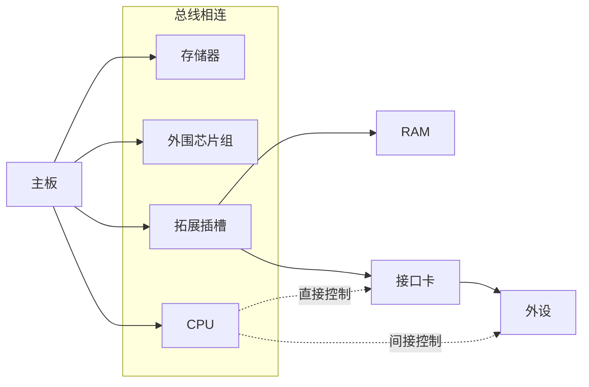

<center font="15"><strong>主板概念图</strong></center>

### 1.14	各类存储器芯片

存储器芯片从物理连接上看是独立的 / 不同的器件。

***从读取属性上分为两类：***

1. 随机存储器（RAM）：可读可写，带电存储，关机后存储内容消失
2. 只读存储器（ROM）：只读不写，关机后内容不丢失

***从功能和连接上分为：***

- 随机存储器

    用于存放供CPU使用的绝大部分程序和数据，主随机存储器一般由两个位置上的RAM组成，装在主板上的RAM和插在扩展插槽上的RAM

- 装有BIOS（Basic Input/output System）的ROM

    BIOS是由主板和各类接口卡（显卡 / 网卡等）厂商提供的软件系统，可以通过它利用该硬件设备进行最基本的输入输出。在主板和某些接口卡上插有存储相应BIOS的ROM。例如，主板上的ROM中存储着主板的BIOS（通常成为系统BIOS）；显卡上的ROM中存储着显卡的BIOS……

- 接口卡上的RAM

    某些接口卡需要对大批量输入 / 输出数据进行暂时存储，在其上装有RAM。最典型的是显卡上的RAM，常常称为显存。显卡随时将显存中的数据向显示器上输出。换句话说，**我们将需要显示的内容写入显存，就会出现在显示器上**

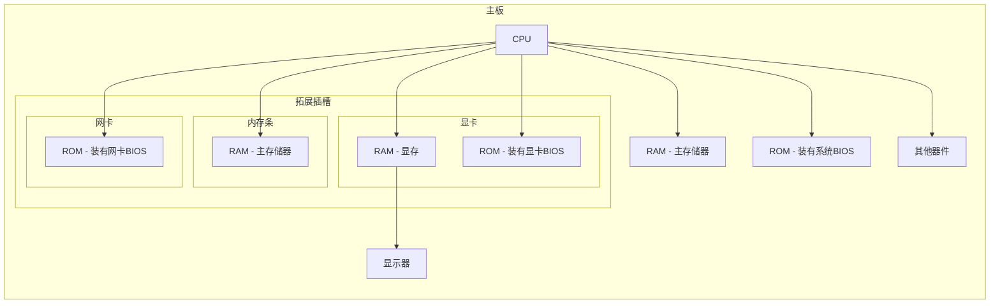

<center font="15"><strong>PC机中各类存储器的逻辑链接</strong></center>

### 1.15	内存地址空间

上述的存储器，在物理上独立，但有以下两点相同：

- 都和CPU总线相连
- CPU对它们进行读或写的时候都通过控制线散发出内存读写命令

也就是说，***CPU在操控它们的时候，把它们都当作内存来对待***，把它们总的看作一个由若干存储单元组成的逻辑存储器，这个逻辑存储器就是我们所说的**内存地址空间**。***在汇编这门课中，我们所面对的是内存地址空间***

```mermaid
graph LR;

subgraph <strong>内存地址空间</br>假想的逻辑存储器</strong>
	main_RAM[主存储器地址空间]
	graph_RAM[显存地址空间]
	graph_ROM[显卡BIOS ROM 地址空间]
	net_ROM[网卡BIOS ROM 地址空间]
	sys_ROM[系统BIOS ROM 地址空间]
	other
end

c[CPU] --总线--> main_RAM & graph_RAM & graph_ROM & net_ROM & sys_ROM & other[其他器件]
main_RAM ==> main_RAM1[RAM - 主存储器]
main_RAM ==> main_RAM2

subgraph 主板
	main_RAM1
	sys[系统BIOS]
end

subgraph <strong>拓展插槽</strong>
	subgraph <strong>内存条</strong>
		main_RAM2[RAM - 主存储器]
	end
	subgraph <strong>显卡</strong>
		ram3[RAM - 显存]
		rom2[ROM - 装有显卡BIOS]
	end
	subgraph <strong>网卡</strong>
		rom3[ROM - 装有网卡BIOS]
	end
end

graph_RAM --> ram3
graph_ROM --> rom2
net_ROM --> rom3
sys_ROM --> sys
```

<center font="15"><strong>将各类存储器看作一个逻辑存储器</strong></center>


***在这张图中，所有的物理存储器被看作一个由若干存储单元组成的逻辑存储器，每个物理存储器在这个逻辑存储器中占有一个地址段，即一段地址空间。CPU在这段地址空间中读写数据，实际上就是在相对应的物理存储器中读写数据。***


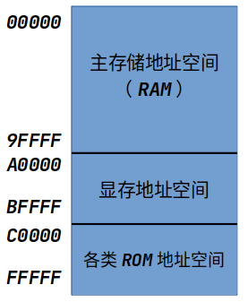

<center font="15"><strong>8086 PC机内存地址空间分配</strong></center>

不同计算机系统的内存空间的分配情况是不同的，以8086为例，

- CPU向内存地址为00000H～9FFFFH写入数据，这个数据就被写入主随机存储器
- 向A0000H～BFFFFH写入数据，这个数据就被写入显存，然后被显卡输出到显示器
- 向C0000H以后写入数据的操作**没有结果**，因为它们是ROM中的一个单元

******

内存地址空间的大小首CPU地址总线宽度的限制，8086 CPU地址总线宽度为20，可以传送`2^20`不同的地址信息，可以定位`2^20`个内存单元，即最大内存地址空间1 MB

我们基于一个计算机硬件系统编程的时候，必须知道这个系统中的内存地址空间分配情况。因为当我们想要在某类存储器中读写数据的时候，必须知道它的第一个单元的地址和最后一个单元的地址，才能保证读写操作是在预期的存储器中进行。


## 第二章	寄存器

CPU的构成：

- 运算器：信息处理
- 控制器：控制各种器件进行工作
- 寄存器：进行信息存储
- 内部总线：连接CPU内部各种器件，在它们之间进行信息传递

### 2.1	通用寄存器

**通用寄存器：**AX / BX / CX / DX

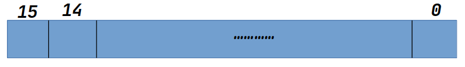

<center><strong font="15">8086 16位寄存器</strong><br/><p font="10">可以存储8KB数据</p></center>

为了向基于8位寄存器的程序兼容，16位通用寄存器可以分为两个8位寄存器使用：

- AX可以分为AH和AL（高位AH，低位AL，AH又从高到底分为7～0）
- 以此类推

### 2.2	字在寄存器中的存储

8086 CPU能够处理数据：

- 字节
- 字：由两个字节组成，分别称为这个字的高位字节和低位字节

******

***关于数制的讨论***

一个内存单元可以存放8位数据，CPU中的寄存器可以存放n个8位的数据。很多时候，需要直观地看出组成数据的各个字节数据的值，用十六进制来表示数据可以直观地看出这个数据是由哪些8位数据构成的。

### 2.3	几条汇编指令

| 汇编指令  | 控制CPU完成的操作 | 用高级语言的语法描述 |
| --------- | ----------------- | -------------------- |
| mov ax,18 | 将18送入AX寄存器  | AX=18                |
| mov ah,78 |                   | AH=78                |
| add ax,8  |                   | AX=AX+8              |
| mov ax,bx |                   | AX=BX                |
| add ax,bx |                   | AX=AX+BX             |

******

1. 在运算过程中，如果计算结果超出了寄存器能够表示的范围，那么只储存低位，超过位数限制的部分被舍去。
2. 同时，如果将一个16位寄存器当作两个8位寄存器使用，CPU在执行指令的时候认为AH和AL是两个不相关的寄存器，所以如果AL超过位数限制，也不会保存在AH
3. 在进行数据传送或运算时，要注意指令的两个操作对象的位数应当是一致的

### 2.4	物理地址

CPU访问内存单元时，要给出内存单元的地址。所有的内存单元构成的存储空间是一维线性空间，每一个内存单元在这个空间中都有唯一的地址，我们将这个唯一地址称为物理地址

CPU通过地址总线送入存储器的，必须是一个内存单元的物理地址。在CPU向地址总线上发出物理地址之前，必须要在内部先形成这个物理地址。不同的CPU可以由不同的形成物理地址的方式

### 2.5	16位结构的CPU

概括地讲，16位结构（16位机，字长为16位等）描述了一个CPU具有以下几方面的结构特性：

- 运算器一次最多可以处理16位数据
- 寄存器的最大宽度位16位
- 寄存器和运算器之间的通路位16位

### 2.6	8086 CPU给出物理地址的方法

8086CPU有20位地址总线，可以传送20位地址，达到1MB的寻址能力。但是8086是16位结构，因此其采用一种在内部用两个16位地址合成的方法来形成一个20位的物理地址

```mermaid
graph LR;

subgraph <strong>8086</strong>
	other[其它部件] --16位段地址--> plus[地址加法器]
	other --16位偏移地址--> plus
		plus --20位物理地址--> IO[输入输出控制电路]
end

IO --20位地址总线 -> 物理地址--> sto[内存]
IO --数据总线--> sto
IO --控制总线--> sto
```

<center><strong>8086CPU相关部件的逻辑结构</strong></center>

地址加法器采用**物理地址 = 段地址 * 16 + 偏移地址**的方法用段地址和偏移地址合成物理地址。

******

<strong><i>由段地址*16引发的讨论</i></strong>

一个X进制的数据左移1位，相当于乘以X

### 2.8	段的概念

内存并没有分段，段的划分来自于CPU，由于8086CPU用“基础地址（段地址*16）+偏移地址=物理地址”的方式给出内存单元的物理地址，使得我们可以用分段的方式来管理内存。

例如，我们可以认为：地址10000H～100FFH的内存单元组成一个段，该段的起始地址（基础地址）为10000H，段地址位1000H（段地址 = 基础地址 / 16），大小为100H（00～FF）

因此，在编程时可以根据需要，将若干地址连续的内存单元看作一个段，用段地址*16定位段的起始位置（基础地址），用偏移地址当作段中的内存单元。

***有两点需要注意***

1. 段地址*16必然是16的倍数，因此一个段的起始地址（基础地址）必然是16的倍数
2. 16位地址的寻址能力位64kb，所以一个段的长度最大为64kb

******

***内存单元地址小结***

1. CPU可以用不同的段地址和偏移地址形成同一个物理地址

2. 如果给定一个段地址，仅仅通过变化偏移地址来进行寻址，最多可定位多少个内存单元？

    结论：偏移地址16位，变化范围为0～FFFFH，仅用偏移地址来寻址最多可以找到64KB个内存单元

    比如给定段地址1000H，用偏移地址寻址，CPU的寻址地址为：10000H～1FFFFH

3. “数据在21F60H内存单元中”，这句话对于8086PC机一般不这样讲，取而代之的是两种类似的说法：

    1. 数据存在内存2000：1F60中
    2. 数据存在内存的2000H段中的1F60单元中

### 2.9	段寄存器

段地址在8086CPU的段寄存器中存放。8086CPU有4个段寄存器：CS / DS / SS / ES

### 2.10 CS和IP

CS和IP是8086CPU中两个最关键的寄存器，它们指示了CPU当前需要读取指令的地址。CS为代码段寄存器（***Code Segment***），IP为指令指针寄存器（***Instruction Pointer***）

在8086PC机中，任意时刻，设CS中的内容为M，IP中的内容为N，8086CPU将从内存M*16+N单元开始，读取一条指令并执行

也可以这样描述：8086机中，任意时刻，CPU将CS：IP指向的内容当作指令执行

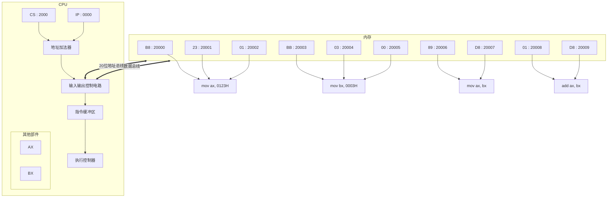

<center><strong>8086PC 读取和执行指令的相关部件</strong></center>

说明如下：

1. 8086CPU当前状态：CS中的内容位2000H，IP中的内容位0000H
2. 内存20000H～20009H单元存放着可执行的机器码

8086CPU的工作过程可以简要描述如下：

1. 从CS：IP指向的内存单元读取指令，读取的指令进入指令缓冲器
2. IP = IP + 所读取指令的长度，从而指向下一条指令
3. 执行指令，转到步骤1，重复这个过程

在8086CPU加电启动或复位（即CPU刚开始工作时）CS和IP被设置为CS = FFFFH，IP = 0000H，即在8086PC机启动时，CPU从内存FFFF0H单元中读取指令执行，FFFF0H单元中的指令是8086PC机开机后执行的第一条指令

******

***CPU根据什么将内存中的信息看作指令？***

CPU将CS：IP指向的内存单元中的内容看作指令，因为，在任何时候，CPU将CS / IP中的内容当作指令的段地址和偏移地址，用它们合成指令的物理地址，到内存中读取指令码，执行。如果说，内存中的一段信息曾被CPU执行的话，它所在的内存单元必然被CS：IP指向过

### 2.11	修改CS：IP的指令

在CPU中，程序员能够用指令读写的部件只有寄存器，程序员可以通过改变寄存器中的内容实现对CPU的控制。CPU从何处执行指令是由CS / IP中的内容决定的，程序员可以通过改变CS / IP中的内容来控制CPU执行目标指令

- 8086CPU大部分寄存器的值，都可以用mov指令来改变，mov指令被称为传送指令
- mov指令不能用于设置CS / IP的值，原因很简单，因为8086CPU没有提供这样的功能。能够改变CS / IP的内容的指令被统称为转移指令

若想同时修改CS / IP中的内容，可用形如***jmp 段地址：偏移地址***的指令完成

```
`jmp 2AE3:3`执行后，CS = 2AE3H，IP = 0003H
```

***jmp 段地址：偏移地址***指令的功能为：用指令中给出的段地址修改CS，偏移地址修改IP

******

若想仅仅修改IP的内容，可用形如***jmp 某一合法寄存器***的指令完成，如：

```
jmp ax, 执行执行前：ax=1000H，CS=2000H，IP=0003H
		指令执行后：ax=1000H，CS=2000H，IP=1000H
```

***jmp 偏移地址***指令的功能为：用寄存器中的值修改IP

### 2.12	代码段

我们可以将长度为N（N < 64 KB）的一组代玛，存在一组地址连续 / 起始地址为16的倍数的内存单元中，我们可以认为，这段内存是用来存放代码的，从而定义了一个代码段

将一段内存当作代码段，仅仅是我们在编程时的一种安排，CPU并不会由于这种安排，就自动地将我们定义的代码段中的指令当作指令来执行。要让CPU执行我们放在代码段中的指令，必须要将CS：IP指向定义的代码段中的第一条指令的首地址。

******

### 实验	1

> <center><strong>本次实验中需要用到的语言</strong></center>
>
> <p>查看 / 修改CPU中寄存器的指令：R</p>
>
> 查看内存：D
>
> 修改内存：E
>
> 将内存中的内容解释为机器指令和对应的汇编指令：U
>
> 修改CS：rcs
>
> 修改IP：rip
>
> 执行CS：IP指向的内存单元处的指令：T
>
> 以汇编指令的形式向内存中写入指令：A

## 第三章	寄存器（内存访问）

### 3.1	内存中字的存储

***字单元：***即存放一个字型数据的内存单元，由两个地址连续的内存单元组成。高地址内存单元中存放字型数据的高位字节，低地址内存单元中存放字型数据的低位字节

我们将起始地址为N的字单元简称为N地址字单元。比如一个字单元由2 / 3两个内存组成，则这个字单元的起始地址为2，我们可以说这是2地址字单元

任何两个地址连续的内存单元，N号单元和N+1号单元，可以将它们看成两个内存单元，也可以看成一个地址为N的字单元中的高位字节单元和低位字节单元

### 3.2	DS和[address]

8086CPU中有一个***DS***寄存器，通常用来存放要访问的数据的段地址。(segment register)

***读取10000H单元的内容***

```assembly
mov	bx,1000H
mov	ds,bx
mov al,[0]
```

“[···]”表示一个内存单元，其中的数字表示内存单元的偏移地址。执行指令时，8086CPU自动取`ds：…`中的数据为内存单元的段地址

***8086CPU不支持将数据直接送入段寄存器的操作，需要用一个寄存器来进行中转***

### 3.4	mov / add / sub指令

***mov指令的形式***

```mermaid
flowchart TD;
subgraph <strong>mov</strong>
	register
	data
	memoryUnit[memory unit]
	segRe[segment register]
	
	register --> data
	register --> register
	register <--> memoryUnit
	register <--> segRe
	segRe <--> memoryUnit
end
```

```mermaid
flowchart TD;
subgraph <strong>add / sub</strong>
	register --> data
	register --> register
	register <--> memory[memory unit]
end
```

### 3.1～3.5	小结

1. 字在内存中存储时，要用两个地址连续的内存单元来存放，字的低位字节放在低地址单元中，高位字节存放在高地址单元中
2. 用mov指令访问内存单元，可以在mov指令中只给出单元的偏移地址，此时，段地址默认在DS寄存器中
3. [address]表示一个偏移地址为address的内存单元
4. 在内存和寄存器之间传送字型数据时，高地址单元和高8位寄存器 / 低地址单元和低8位寄存器相对应
5. mov / add / sub是具有两个操作对象的指令。jmp是具有一个操作对象的命令

### 3.7	CPU提供的栈机制

```assembly
push
pop
```

在使用8086CPU编程的时候，可以将一段内存当作栈来使用。8086CPU的入栈和出栈操作都是以字为单位的

***CPU如何知道栈顶的位置？***

> rss
>
> rsp

8086CPU中，有两个寄存器，段寄存器SS（***stack segment***）和寄存器SP(***stack pointer***)，栈顶的段地址存放在SS中，偏移地址存放在SP中。***任意时刻，SS：SP指向栈顶元素***。push和pop指令执行时，CPU从SS和SP中得到栈顶的地址

8086CPU中，入栈时，栈顶从高地址向低地址方向增长

### 3.8	栈顶超界问题

8086CPU不保证我们对栈的操作不会超界，它只考虑当前的情况：当前的栈顶在何处 / 当前要执行的指令时哪一条。我们在编程的时候要自己操心栈顶超界的问题，要根据可能用到的最大栈空间，来安排栈的大小，防止入栈的数据太多而导致的超界；执行出栈的操作的时候也要注意，以防栈空的时候继续出栈而导致的超界

### 3.9	push / pop命令


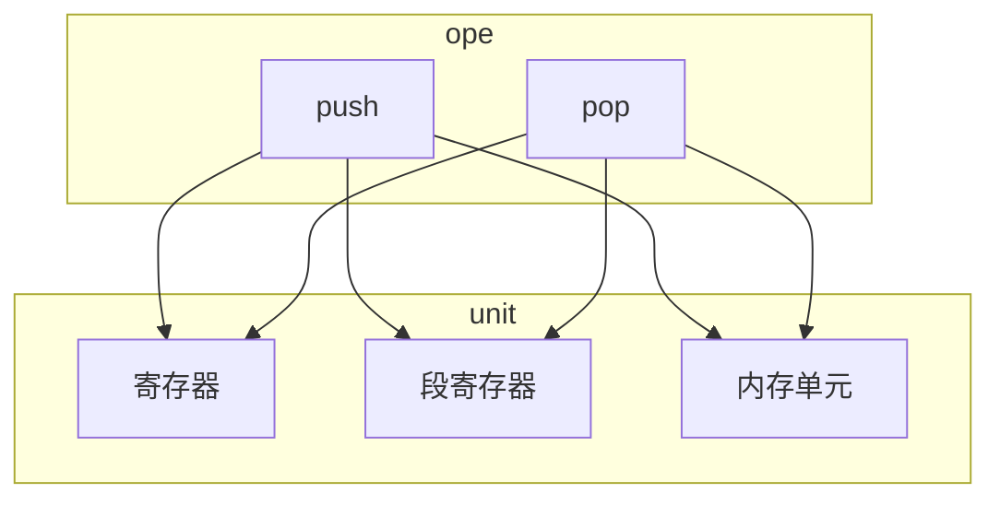

指令执行时，CPU要知道内存单元的地址，可以在push / pop指令中只给出内存单元的偏移地址，段地址在执行时，CPU从ds中获得

***栈指针的移动规则***

执行push时，CPU的两步操作是：先改变SP，然后向SS：SP传送数据

执行pop时，CPU的两步操作是：先读取SS：SP处的数据，然后改变SP

### 段的综述

> 一段内存，既可以是代码的存储空间，又是数据的存储空间，还可以是栈空间，也可以什么都不是。关键在于CPU中寄存器的设置

<center><b><i>我们可以将一段内存定义为一个段，用一个段地址指示段用偏移地址访问段内的单元<br/>——这完全是我们自己的安排</i></b></center>

我们可以用一个段存放数据，将它定义为“数据段”（***data segment - DS***）

我们可以用一个段存放代码，将它定义为“代码段”（***code segment - CS:IP***）

我们可以用一个段当作栈，将它定义为“栈段”（***stack segment - SS:SP***）

<center><b><i>可见，不管我们如何安排，<br/>CPU将内存中的某段内容当作代码，是因为CS：IP指向了那里<br/>CPU将某段内存当作栈，是因为SS：SP指向了那里</i></b></center>

### 实验2	

> 访问的新方法：
>
> ```
> d / e / a / u 段寄存器:偏移地址
> ```

******

***注意：Debug的T命令在执行修改寄存器SS的指令时，下一条指令也紧接着被执行***


## 第四章	第一个程序

### 4.1	编写汇编源程序

1. 编写汇编源文件

2. 对源程序进行编译链接

    使用汇编语言编译程序对源程序文件中的源程序进行编译，产生目标文件；再用连接程序对目标文件进行连接，生成可在操作系统中直接运行的可执行文件

    可执行文件包含两部分内容：

    1. 程序（从源程序中的汇编指令翻译过来的机器码）和数据（源程序中定义的数据）
    2. 相关的描述信息（比如，程序有多大 / 要占用多少内存空间等）

    这一步工作的结果：产生一个可以在操作系统中运行的可执行文件

3. 执行可执行文件中的程序

### 4.2	源程序

```assembly
assume cs:codesg # 用assume将代码段的段codesg和CPU中的cs联系起来

codesg segment

		mov ax,0123H
		mov bx,0456H
		add ax,bx
		add ax,ax
		
		# 程序返回
		mov	ax,4c00H
		int 21H
		
codesg ends

end
```

******

#### 1.	伪指令

在汇编语言源程序中，包含两种指令：***汇编指令***和***伪指令***

***汇编指令***是由对应的机器码的指令，可以被编译为机器指令，最终为CPU执行

***伪指令***没有对应的机器指令，最终不被CPU所执行，由编译器来执行，编译器根据伪指令来进行相关的编译工作

1. ```assembly
    XXX segment
    
    XXX ends
    ```

    `segment`和`ends`的功能是定义一个段，segment说明一个段开始，ends说明一个段结束。一个段必须有一个名称来表示

    一个汇编程序是由多个段组成的，这些段被用来存放代码 / 数据或作栈空间来使用。前面所讲解的段的概念，在汇编源程序中的得到了应用和体现，一个源程序中所有将被计算机所处理的信息：指令 / 数据 / 栈，被划分到了不同的段中

    ***一个有意义的汇编程序中至少要有一个段，这个段用来存放代码***

2. <strong>`end`</strong>

    end是一个汇编程序的结束标记，编译器在编译汇编程序的过程在中，如果碰到了伪指令end，就结束对源程序的编译。

3. <strong>`asume`</strong>

    它假设某一段寄存器和程序中的某一个用`segment ... ends`定义的段相关联。在需要的请款修改，编译程序可以将段寄存器和某一个具体的段相联系

#### 2.	源程序中的“程序”

将『***源程序文件中的所有内容***』称为『***源程序***』

将『***源程序中最终由计算机执行 / 处理的指令或数据***』称为『***程序***』

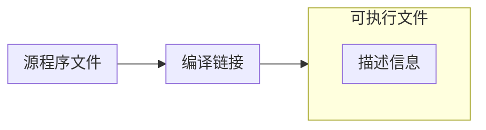

#### 3.	标号

一个标号指定了一个地址。比如`codesg`在`segment`的前面，作为一个段的名称，这个段的名称最终将被编译 / 连接程序处理为一个段的地址

#### 4.	程序的结构

源程序是由一些段构成的。我们可以在这些段中存放代码 / 数据，或将某个段当作栈空间。

***编程运算2^3***

```assembly
assume cs:abc

abc segment

	mov	ax,2
	add ax,ax
	add ax,ax
	
abc ends

end
```

#### 5.	程序返回

> 下面，我们在***DOS（但人物操作系统）***的基础上，简单的讨论一下这个问题：
>
> 一个程序P2在可执行文件中，则必须有一个正在运行的程序P1，将P2从可执行文件中加载入内存后，将CPU的控制权交给P2。P2开始运行后，P1暂停运行。
>
> 而当P2运行完毕后，应该将CPU的控制权交还给运行的程序P1，此后，P1继续运行

***程序返回：***一个程序结束后，将CPU的控制权交还给使得它得以运行的程序

<center><strong>与程序结束相关的概念</strong></center>

| 目的                 | 相关指令                 | 指令性质 | 指令执行者           |
| -------------------- | ------------------------ | -------- | -------------------- |
| 通知编译器一个段结束 | 段名 ends                | 伪指令   | 编译时，由编译器执行 |
| 通知编译器程序结束   | end                      | 伪指令   | 编译时，由编译器执行 |
| 程序返回             | mov ax,4c00H<br/>int 21H | 汇编指令 | 执行时，由CPU执行    |

#### 6.	语法错误和逻辑错误

### 4.5	连接

连接的作用：

1. 当源程序很大时，可以将它分为多个源程序文件来编译，每个源程序编译成为目标文件后，再用连接程序将它们连接到一起，生成一个可执行文件
2. 程序中调用了某个库文件中的子程序，需要将这个库文件和该程序生成的目标文件连接到一起，生成一个可执行文件
3. 一个源程序编译后，得到了存有机器码的目标文件，目标文件中的有些内容还不能直接用来生成可执行文件，连接程序将这些内容处理为最终的可执行信息。所以，在只有一个源文件，而又不需要调用某个库中的子程序的情况下，也必须用连接程序对目标文件进行处理，生成可执行文件

注意，对于连接的过程，可知性文件是我们得到的最终结果

### 4.8	谁将可执行文件中的程序装载进入内存并使它运行？

<center><strong><i>操作系统的外壳</i></strong></center>

操作系统是由多个功能模块组成的庞大 / 复杂的软件系统。任何通用的操作系统，都要提供一个称为shell（外壳）的程序，用户（操作人员）使用这个程序来操作计算机系统进行工作i

DOS有一个程序command.com，这个程序在DOS中被称为命令解释器，也就是DOS系统的shell

DOS启动时，首先完成其他重要的初始化工作，然后运行command.com，command.com运行后，执行完其他的相关任务 后，在屏幕上显示出由当前盘符和当前路径组成的提示符

如果用户要执行一个程序，则输入该程序的可执行文件的名称，comamnd首先根据文件名找到可执行文件，然后将这个可执行文件中的程序加载入内存，设置CS：IP指向程序的入口。此后，command暂停运行，CPU运行程序。程序运行结束后，返回到command中，command再次显示由当前盘符和当前路径组成的提示符，等待用户的输入

在DOS中，command处理各种输入：命令或要执行的程序的文件名。我们就是通过command来进行工作

<center><strong><i>汇编程序从写入到执行的过程</i></strong></center>


### 4.9	程序执行过程的跟踪

***EXE文件中程序的加载过程***

1. 找到一段起始地址位SA：0000（即起始地址的偏移地址为0）的容量足够的空闲内存区
2. 在这段内存区的前256个字节中，创建一个称为程序段前缀（PSP，Program Segment Prefix）的数据区，DOS要利用PSP来和被加载的程序来进行通信
3. 从这段内存区的256字节处开始（在PSP的后面），将程序装入，程序的地址被设为SA+10H：0（10H << 1 = 256）
4. 将该内存区的段地址装入DS中，初始化其他相关寄存器后，设置CS：IP指向程序的入口

```shell
debug 1.exe
-r
...
-u
...
# 到了int 21，使用-退出程序

```

## 第五章	[BX]和loop指令

#### 1.	[bx]和内存单元的描述

```assembly
mov ax,[0]
```

要完整地描述一个内存单元，需要两种信息：

1. 内存单元的地址
2. 内存单元的长度（类型）

用`[0]`表示一个内存单元时，0表示单元的偏移地址，`[bx]`同样也表示一个内存单元，它的偏移地址在bx中，比如：

```assembly
mov ax,[bx]	# 将DS:BX中的内容送入ax
```

#### 2.	loop——循环

#### 3.	定义描述性符号`()`

<center><b><i>我们将一个描述性的符号“()”来表示一个寄存器或一个内存单元中的内容</i></b></center>

注意，“（ ）”中的元素可以有三种类型：

1. 寄存器名
2. 段寄存器
3. 内存单元的物理地址（一个20位数据）

#### 4.	约定符号`idata`（***instant data***，立即数<a name='idata'></a>）表示常量

```assembly
mov	ax,[idata]	# mov ax,[1]
mov bx,idata	# mov bx,1
mov ds,idata	# mov ds,1	非法
```

### 5.2	Loop指令

loop指令的格式是：loop标号，CPU执行loop指令的时候，要进行两步操作：

1. (cx) = (cx) - 1
2. 判断cx中的值，不为零则转至标号处执行程序，如果为零则向下执行

******

***任务1：编程计算2^2，结果存在ax中***

```assembly
assume cs:code
code segment
	mov ax,2
	add ax,ax
	
	mov ax,4C00H
	int 21H
code ends
ends
```

***任务2：编程计算2^3***

***任务3：编程计算2^12***

```assembly
assume cs:code
code segment
	mov ax,2
	
	mov cx,11
s:	add ax,ax
	loop s
	mov ax,4C00H
	int 21H
code ends
ends
```

******

用cx和loop指令相配合实现循环功能的3个要点：

1. 在cx中存放循环次数
2. loop指令中的标号所标识地址要在前面
3. 要循环执行的程序段，要写在标号和loop指令的中间

***框架***

```assembly
	mov cx,[循环次数]
s:	
	[循环执行的程序段]
	loop s
```

### 5.3	在Debug中跟踪用loop指令实现的循环程序

***在汇编语言中，数据不能以字母开头，所以要在前面加0***

```assembly
assume cs:code

code segment
	mov ax,0ffffh
	mov ds,ax
	mov bx,6		;设置ds:bx指向ffff:6
	
	mov al,[bx]		
	mov ah,0	
	
	mov dx,0
	
	mov cx,3
s:	add dx,ax
	loop s
	
	mov ax,4C00H
	int 21H			;程序返回
code ends

end
```

******

1. 执行指令，到某一个地址停下

    ```shell
    -g ip
    ```

2. 结束循环

    ```shell
    0B3D:0014 E2FC		LOOP		0012
    -p
    ```

    或者

    ```shell
    -g 0016
    ```

### 5.4	Debug和汇编编译器masm对指令的不同处理

***源代码***

```assembly
mov al,[0]
mov bl,[1]
```

***Debug实现***

```assembly
mov al,[0000]
mov bl,[0001]
```

***MASM -> LINK***

```assembly
mov al,00
mov bl,01
```

可以明显的看出，对于指令中的`[idata]`，Debug将它解释为`[idata]`是一个内存单元，"idata"是偏移地址；而编译器将`[idata]`解释为"idata"

******

***解决方法***

```assembly
mov ax,2000H
mov ds,ax
mov al,ds:[0]
```

******

```assembly
mov al,[0]		; (al) = 0，将常量0送入al中
mov al,ds:[0]	; (al) = ((ds) * 16 + 0)，将内存单元中的数据送入al中
mov al,[bx]		; (al) = ((ds) * 16 + bx)，将内存单元中的数据送入al中
mov al,ds:[bx]	; 与mov al,[bx]相同
```

从上面的比较可以看出：

1. 在汇编源程序中，如果用指令***访问一个内存单元***，则在指令中必须用`[...]`来表示内存单元；如果在`[]`里用一个常量idata直接给出内存单元的偏移地址，就要在`[]`的前面显式地给出段地址所在的段寄存器
2. 如果在`[]`中用寄存器，间接给出内存单元的偏移地址，则段地址默认在ds中。当然，也可以显式地给出段地址所在的段寄存器

### 5.5	loop和[bx]的联合应用

***问题：计算`ffff:0~ffff:9`单元中的数据的和，存储在dx中***

***分析：如何将8位的数据放到16位的寄存器中***

***解决方法：将内存单元的8位数据赋值到一个16位寄存器，然后再将数据写入dx中***

```assembly
assume cs:code

code segment
	mov ax,0ffffH
	mov ds,ax			;initialize DS, add DS:[BX] to DX
	mov dx,0			;initialize register DX to restore the result
	mov ax,0			;use AX to temporarily store the num
	mov bx,0			;loop DS:[0] to DS:[9]
	mov cx,9			;control the range of loop
s:	mov al,[bx]			;mov al,DS:[bx]
	add dx,ax			;8 Byte -> 16 Byte
	inc bx				;bx += 1
	loop s
	
	mov ax,4C00H
	int 21H
code ends

end
```

### 5.6	段前缀

出现在访问内存单元的指令中，用于显式地指明内存单元的段地址的`ds / cs / ss / es`，在汇编语言中称为段前缀

### 5.7	一段安全的空间

在不能确定一段内存空间中是否存放着重要的数据代码的时候，不能随意向其中写入内容

> 不能忘记的是，我们正在学习的是汇编语言，要通过它来获得底层的编程体验，理解计算机的底层的基本工作机理。所以我们尽量直接对硬件编程，而不去理会操作系统
>
> 我们似乎面临一种选择，是在操作系统中安全 / 规矩的编程，还是自由 / 直接地使用汇编语言去操作真实的硬件，了解那些早已被层层系统软件掩盖的真相？在大部分的情况下，我们选择后者
>
> 注意，我们在纯DOS方式（实模式）下，可以不理会DOS，直接用汇编语言去操作真实的硬件，因为运行在CPU实模式下的DOS，没有能力对硬件系统进行全面 / 严格的管理。但是在运行于CPU保护模式下的操作系统中，不理会操作系统，用汇编语言去操作真实的硬件，是根本不可能的。硬件已经被操作系统全面而严格地管理了

总结：

1. 我们需要直接向一段内存中写入内容
2. 这段内存空间不应该存放系统或其他程序的数据或代码，否则写入操作很可能引发错误
3. DOS方式下，一般情况，`0:200~0:2ff`空间中没有系统或其他程序的数据或代码
4. 以后，我们需要直接向一段内存中写入内容时，就使用`0:200~0:2ff`这段空间

### 5.8	段前缀的使用

***问题：将内存`ffff:0~ffff:b`单元中的数据复制到`0:200~0:20b`单元中***

```assembly
assume cs:code
;将内存 ffff:0~ffff:b 单元中的数据复制到 0:200~0:20b 单元中
code segment
	;iniliazation
	mov ax,0ffffH
	mov ds,ax
	mov ax,0
	mov es,ax

	mov cx,0bH		;控制遍历范围
	mov bx,0		;将DS:[BX]复制给ES:[BX]

s:	mov al,ds:[bx]	;不能够 mov es:[bx],ds:[bx]
	mov es:[bx],al
	inc bx
	loop s

	mov ax,4C00H
	int 21H
code ends

end
```

### 实验4	[bx]和loop的使用

```assembly
assume cs:code
code segment
	mov ax,0
	mov ds,ax
	mov bx,0200H
	mov dx,0h

	mov cx,64
s:	mov ds:[bx],dl
	inc bx
	inc dx
	loop s

	mov ax,4C00H
	int 21H
code ends
end
```

## 第六章	包含多个段的程序

程序取得所需i空间的方法有两种，一是在加载程序的时候为程序分配，再就是程序在执行的过程中向系统申请。在这本书中，不讨论第二种方法

我们若要一个程序在加载的时候取得所需的空间，则必须在源程序中作出说明。我们通过在源程序中定义段来进行内存空间的获取

******

上面是从内存空间获取的角度上，谈定义段的问题。我们再从程序规划的角度来谈定义段的问题。大多数有用的程序，都要处理数据，使用栈空间，当然也都必须有指令，为了程序设计上的清晰和方便，我们一般也都定义不同的段来存放它们

### 6.1	在代码段中使用数据

从规范的角度讲，我们时不能自己随便决定哪段空间可以使用的，应该让系统来为我们分配。我们可以在程序中，定义我们希望处理的数据，这些数据就会被编译 / 连接程序作为程序的一部分写到可执行文件中。当可执行文件中的程序被加载入内存时，这些数据也同时被加载入内存中。

***程序6.1***

```assembly
assume cs:code

code segment
	dw	0123H,0456H,0789H,0abcH,0defH,...
	;其他代码
code ends

end
```

`dw`的含义是定义字形数据（***define word***）

由于这些数据被定义在代码段中，程序在运行的时候CS中存放代码段的地址，偏移地址以字记

******

这样一来，程序就找不到正确的入口，所以需要指明程序的入口所在

```assembly
assume cs:code
code segment
	dw ...
start:	...
code ends
end start
```

***end除了通知编译器程序结束外，还可以告知编译器程序的入口在什么地方***

******

***程序框架***

```assembly
assuem cs:code

code segment
	[数据]
start:
	[代码]
code ends
end start
```

### 6.3	将数据 / 代码 / 栈放入不同的段

1. 定义多个段的方法

    对于不同的段，需要有不同的段名

2. 对段地址的引用

    在程序中，段名就相当于一个标号，它代表了段地址。一个段中的数据可以由段名代表，偏移地址就要看数据在段中的位置

3. “代码段” / “数据段” / “栈段”完全是我们的安排

### 实验5	编写 / 调试具有多个段的程序

#### 1

```assembly
assume cs:code,ds:data,ss:stack

data segment
	dw 0123H,0456H,0789H,0abcH,0defH,0fedH,0cbaH,0987H
data ends

stack segment
	dw 0,0,0,0,0,0,0,0
stack ends

code segment
start:	mov ax,stack
		mov ss,ax
		mov sp,16
		
		mov ax,data
		mov ds,ax
		
		push ds:[0]
		push ds:[0]
		pop	 ds:[2]
		pop  ds:[0]
		
		mov ax,4C00H
		int 21H
code ends

end start
```

#### 2

```assembly
assume cs:code,ds:data,ss:stack

data segment
	dw 0123H,0456H	;虽然只有两个字的数据，但会分配8个字的内存空间给data
data ends

stack segment
	dw 0,0			;同理
stack ends

code segment
start:	mov ax,stack
		mov ss,ax
		mov sp,16

		mov ax,data
		mov ds,ax

		push ds:[0]
		push ds:[2]
		pop  ds:[2]
		pop  ds:[0]

		mov ax,4C00H
		int 21H
code ends

end start
```

可以发现，对于如下定义的段：

```assembly
name segment
	|
	|
	|
name ends
```

如果段中的数据占用N个字节，那么程序加载后，该段实际栈有的空间为：

```cpp
//段地址每+1，便会跳过16个字节，因此
//刚好满足16字节的倍数，便是16字节的倍数大小
//否则就向上补齐
N % 16 == 0 ? (N / 16) : (N / 16 + 1) 	//个字节
```

#### 3

```assembly
assume cs:code,ds:data,ss:stack

code segment
start:	mov ax,stack
		mov ss,ax
		mov sp,16

		mov ax,data
		mov ds,ax

		push ds:[0]
		push ds:[2]
		pop  ds:[2]
		pop  ds:[0]

		mov ax,4C00H
		int 21H
code ends

data segment
	dw 0123H,0456H
data ends

stack segment
	dw 0,0
stack ends

end start
```

#### 5

编写code段中的代码，将a段和b段中的数据依次相加，将结果存到c段中

```assembly
assume cs:code

a segment
	db 1,2,3,4,5,6,7,8		; define byte
a ends

b segment
	db 1,2,3,4,5,6,7,8
b ends

c segment
	db 0,0,0,0,0,0,0,0
c ends

;由于段寄存器的数量只有两个：ds和es，因此一次只能移动一个段
;先用mov将a移动到c中
;再用add将b合并到c中
code segment
start:	
		;设置数据源
		mov ax,a
		mov ds,ax
		;设置目标
		mov ax,c
		mov es,ax
		;循环初始化
		mov bx,0
		mov cx,8
	s1:					; 两个循环标签名称不能相同
		mov al,[bx]		; 不能直接写 mov es:[bx],ds:[bx]
		mov es:[bx],al
		inc bx
		loop s1

		mov ax,b
		mov ds,ax
		mov bx,0
		mov cx,8
	s2:
		mov al,[bx]
		add es:[bx],al
		inc bx
		loop s2

		mov ax,4C00H
		int 21H
code ends

end start
```

#### 6

程序如下，编写code中的代码，用push将a段中的前8个字型数据，倒序存储到b段中

```assembly
assume cs:code

a segment
	dw 1,2,3,4,5,6,7,8,9,0ah,0bh,0ch,0dh,0eh,0fh,0ffh
a ends

b segment 
	dw 0,0,0,0,0,0,0,0
b ends

code segment
start:
		;设置数据段
		mov ax,a
		mov ds,ax
		;设置栈段
		mov ax,b
		mov ss,ax
		mov sp,16		; 使用的是define word，8个字
		;循环初始化
		mov bx,0
		mov cx,8
	s:
		push ds:[bx]
		add bx,2		; 因为是字，所以需要+2
		loop s

		mov ax,4C00H
		int 21H
code ends

end start
```

## 第七章	更灵活的定位内存地址的方法

### 7.1	`and`和`or`指令

1. `and`：逻辑与

    通过该指令可将操作对象的相应位设置为0，其他位不变

2. 'or'：逻辑或

    通过该指令可将操作对象的相应位设置为1，其他位不变

### 7.2	关于ASCII码

只要编码和解码采用同样的机制，我们就可以将人能理解的信息存入到计算机，再从计算机中取出

在文本编辑过程中，

- 我们按下键盘的'a'键，这个按键的信息就被送入计算机，计算机用ASCII码规则对其进行编码，将其转化为`61H`存储在内存的指定空间中；
- 文本编辑软件从内存中取出`61H`，将其送到显卡的显存中
- 工作在文本模式下的显卡，用ASCII规则解释显存中的内容，`61H`被看作字符'a'，显卡驱动显示器，将字符'a'的图像画在屏幕上

### 7.3	以字符形式给出的数据

我们可以在汇编程序中，用`'......'`的方式指明数据是以字符的形式给出的，编译器把它们转化为相对应的ASCII码。

```assembly
bd 'uNIX'
mov bl,'b'
```

### 7.4	大小写转换问题

小写字母的ASCII码值比大写字母的ASCII码值大20H

又：
$$
(20H)_{16}\space=\space(0010\;0000)_{2} 
$$
因此，如果要将所有的大写字母转换成小写字母，只需要将第六位变为1，而小写字母保持不变

```assembly
assume cs:code,ds:data

data segment
	db 'Basic'
	db 'iNfOrMaTiOn'
data ends

code segment
start:	
		mov ax,data
		mov ds,ax

;将Basic全部转换为大写字母
		mov bx,0
		mov cx,5			;Basic占位5位
	s1:	mov al,[bx]			;将值复制出来，操作完后放回
		and al,11011111B	;将第六位变为0，其他位不变
		mov [bx],al
		inc bx
		loop s1

;将iNfOrMaTiOn全部变为小写字母
		mov bx,5			;设置(bx) = 5，指向"iN..."的第一个字母
		mov cx,11
	s0:	mov al,[bx]
		or al,00100000B		;将第六位变为1，其他位不变
		mov [bx],al
		inc bx
		loop s0

		mov ax,4C00H
		int 21H
code ends

end start
```


### 7.5	[bx + idata]

[bx + idata]表示一个内存单元，它的偏移地址为`(bx) + idata`

```assembly
mov ax,[bx+200]
```

操作结果：
$$
(ax)\space=\space((ds)*16+(bx)+200)
$$
也可以写成：

```assembly
mov ax,[200+bx]
mov ax,200[bx]
mov ax,[bx].200
```

### 7.6	用[bx + idata]的方式进行数组的处理

```assembly
data segment
	db 'Basic'
	db 'iNfOrMaTiOn'
data ends
```

对于data中的字符串，一个起始地址为0，另一个起始地址为5。于是可以如此改进程序：

```assembly
	mov dx,data
	mov ds,ax

	mov bx,0
	mov cx,5
s:	mov al,[bx]			; 0[bx]
	and al,11011111b
	mov	[bx],al
	mov al,[5+bx]		; 5[bx]
	or	al,00100000b
	mov [5+bx],al
	inc bx
	loop s
```

***[bx+idata]的方式为高级语言实现数组提供了遍历机制***

### 7.7	SI和DI<a name='si'></a>

si和di是8086CPU中和bx功能相接近的寄存器，si和di不能够分成两个8位寄存器来使用

```assembly
;用si和di实现将字符串'welcome to masm!'复制到它后面的数据区中
assume cs:code,ds:data

data segment
	db	'welcome to masm!'
	db	'................'
data ends

code segment
start:
		mov ax,data
		mov ds,ax
		mov si,0
		mov di,16

		mov bx,0
		mov cx,16
	s:	mov ax,[si]
		mov [di],ax		
		add si,2
		add di,2
		loop s
;更简单的方法
;	s:	mov ax,0[si]
;		mov 16[si],ax
;		add si,2
;		loop s
		mov ax,4C00H
		int 21H
code ends

end start
```

### 7.8	[bx+si]和[bx+di]

`mov ax,[bx+si]`等价于`mov ax,[bx][si]`

### 7.9	[bx+si+idata]和[bx+di+idata]

`mov ax,[bx+si+idata]`：
$$
(ax)\space=\space(\space(ds)\space*\space16\space+\space(bx)\space+\space(si)\space+\space idata)
$$
常用格式：

```assembly
mov ax,[bx+200+si]
mov ax,[200+bx+si]
mov ax,200[bx][si]
mov ax,[bx].200[si]
mov ax,[bx][si].200
```

### 7.10	不同寻址方式的灵活运用

几种常用的定位内存地址的方法（寻址方式）：

1. `[idata]`用一个常量来表示地址，可用于直接定位一个内存单元
2. `[bx]`用一个变量来表示内存地址，可用于间接定位一个内存单元
3. `[bx+idata]`用一个变量和常量表示字符，可在一个起始地址的基础上用变量间接定位一个内存单元
4. `[bx+si]`用两个变量表示地址
5. `[bx+si+idata]`用两个变量和一个常量表示地址

#### Q7.6——`[bx+idata]`<a name='bx+idata'></a>

```assembly
;编程，将data段中每一个单词的头一个字母改为大写字母
assume cs:code,ds:data

;可以发现，每一个单词的首字母位于当前16个字节中的第四个
;于是，idata = 4
;可以用bx存储data段的首地址，即0，所以没有必要存储
;用di来进行下一个单词的遍历
;于是寻址方式为：[di+4]，每次di向后移动16字节
;循环6次
data segment
	db '1. file         '
	db '2. edit         '
	db '3. search       '
	db '4. view         '
	db '5. options      '
	db '6. help         '
data ends

code segment
start:
;初始化DS
		mov ax,data
		mov ds,ax
;设置偏移地址DI
;设置循环次数CX
		mov di,0H
		mov cx,6H
	s:	mov bl,[di+3]		;按字节将需要改变的字符传入
		and bl,11011111B	;将字符进行与运算，令第6位变为0（ASCII - 32）
		mov [di+3],bl		;将结果传出
		add di,16			;指向下一个需要操作的字符
		loop s

		mov ax,4C00H
		int 21H
code ends

end start
```

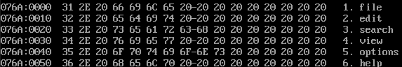

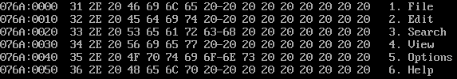

******

#### ==***重要程序：Q7.7——`[bx+si]`与stack***==<a name='bx+si'></a>

在涉及到多层循环的时候，因为循环的默认变量都是`CX`，因此，如果不做任何操作，内层循环将会改变外层循环的循环变量（本质上用的是同一个）。***所以，在进行内层循环的时候，需要保存当前循环次数以及一些其他需要保存的值，然后在内层循环结束的时候再将这些值恢复。***

***那么，这些值保存在哪里？***既然寄存器的数量是有限的，所以这些值只能保存在提前开辟好的内存空间中。而循环的调用颇为类似栈的增长与消退，于是，***用栈来存放这些数据是最为合适的***

```assembly
;编程，将data段中的每个单词改为大写字母
assume cs:code,ds:data,ss:stack

;要解决这个问题，需要两层循环
	;第一层循环用来遍历当前的列（16个字节）
	;第二层循环用来遍历四行
;于是用bx来遍历行，所以bx每次增加16
	;于是外层循环的循环次数为4
;于是用di来遍历列，所以di每次增加1
	;于是内层循环的循环次数为16
;于是寻址公式：[bx+di]
data segment
	db 'ibm             '
	db 'dec             '
	db 'dos             '
	db 'vax             '
data ends

;以栈的方式，用8个字的内存空间存放内外层循环交替时的数据
stack segment
	dw 0,0,0,0,0,0,0
stack ends

code segment
start:
;initialization
		mov ax,data
		mov ds,ax
		mov ax,stack
		mov ss,ax
		mov sp,16

;外层循环，初始化外层遍历变量bx和外层循环变量CX
		mov bx,0
		mov cx,4
	i:	
		push cx					;记录当前循环变量
		mov cx,16				;初始化内层循环变量
		mov di,0				;初始化内层遍历变量DI
		j:
			;以字节方式传入，处理后传出
			mov al,[bx+di]
			and al,11011111B
			mov [bx+di],al
			inc di
			loop j
		
		add bx,16				;向后移动16字节，处理下一行
		pop cx					;恢复外层循环变量
		loop i

		mov ax,4C00H
		int 21H
code ends

end start
```

#### Q7.9——`[bx+si+idata]`<a name='bx+si+idata'></a>

```assembly
;编程，将data段中每个单词的前四个字母改为大写字母
assume cs:code,ss:stack,ds:data

stack segment
	dw 0,0,0,0,0,0,0,0
stack ends
	
;第一个字母位于第四个字节，所以idata = 3
;两层循环
	;外层循环循环行，存储于bx中，每次bx+1，循环变量为4
	;内层循环循环列，存储于di中，每次di+1，循环变量为4
;所以寻址公式为：[bx+di+3]
data segment
	db '1. display      '
	db '2. brows        '
	db '3. replace      '
	db '4. modify       '
data ends

code segment
start:
;init
		mov ax,data
		mov ds,ax
		mov ax,stack
		mov ss,ax
		mov sp,16

		mov bx,0
		mov cx,4
	i:
		push cx

		mov cx,4
		mov di,0
		j:	mov al,[bx+di+3]
			and al,11011111B
			mov [bx+di+3],al
			inc di
			loop j

		pop cx
		add bx,16
		loop i

		mov ax,4C00H
		int 21H
code ends

end start
```

## 第八章	数据处理的两个基本问题

计算机是进行数据处理 / 运算的机器，那么有两个基本的问题就包含在其中：

1. 处理的数据在什么地方？
2. 要处理的数据有多长？

******

我们定义的描述性符号：`reg`（register）和`sreg`（segment register）

- `reg`的集合包括：`ax`,`bx`,`cx`,`dx`,`ah`,`al`,`bh`,`bl`,`ch`,`cl`,`dh`,`dl`,`sp`,`dp`,`si`,`di`

- `sreg`的集合包括：`ds`,`ss`,`cs`,`es`

### 8.1	bx / [si / di](#si)和dp

1. 在8086CPU中，只有这四个寄存器可以用在`[...]`中来进行内存单元的寻址

2. 在`[...]`中，这4个寄存器可以单个出现，或者只能以4种组合出现：

    ```mermaid
    flowchart TD;
    bx --> si & di
    dp --> si & di
    ```

3. 只要在`[...]`中使用寄存器`bp`，而指令中没有显性地给出段地址，段地址就默认在`ss`中

### 8.2	机器指令处理的数据在什么地方

绝大部分机器指令都是进行数据处理的指令，处理大致可以分为3类：***读取 / 写入 / 运算***

在机器指令这一层来讲，并不关心数据的值是多少，而关心***指令执行前一刻***，它将要处理的数据所在的位置。

指令在执行前，所要处理的数据可以在3个地方：***CPU内部 / 内存 / 端口***

### 8.3	汇编语言中数据位置的表达

1. 立即数（[idata](#idata)）

    对于直接包含在机器指令中的数据（执行前在CPU的指令缓冲器中），在汇编语言中称为：立即数（idata），在汇编指令中直接给出

2. 寄存器

    指令要处理的数据在寄存器中，在汇编指令中给出相应的寄存器名称

3. 段地址(***SA - Segment Address***)和偏移地址（***EA - Effective Address***，又称为有效地址）

    指令要处理的数据在内存中，在汇编指令中可用`[X]`的格式给出`EA`,`SA`在某个段寄存器中。存放段地址的寄存器可以是默认的，比如`[di]`，也可以是显性给出的，比如`ds:[bp]`

### 8.4	寻址方式

当数据存放在内存中的时候，我们可以用多种方式来给定这个内存单元的偏移地址，这种定位内存单元的方法一般被称为寻址方式。

<h3>
    <center><b><i>寻址方式小结</i></b></center>
</h3>

<table border="1">
        <tr>
            <th>寻址方式</th>
            <th>含义</th>
            <th>名称</th>
            <th>常用格式举例</th>
        </tr>
        <tr>
            <td>[idata]</td>
            <td>EA=idata; SA=(ds)</td>
            <td>直接寻址</td>
            <td>[idata]</td>
        </tr>
        <tr>
            <td>[bx]</td>
            <td>EA=(bx); SA=(ds)</td>
            <td rowspan="4">寄存器间接寻址</td>
            <td rowspan="4">[bx]</td>
        </tr>
        <tr>
            <td>[si]</td>
            <td>EA=(si); SA=(ds)</td>
        </tr>
        <tr>
            <td>[di]</td>
            <td>EA=(di); SA=(ds)</td>
        </tr>
        <tr>
            <td>[bp]</td>
            <td>EA=(bp); SA=(ss)</td>
        </tr>
        <tr>
            <td>[bx+idata]</td>
            <td>EA=(bx)+idata; SA=(ds)</td>
            <td rowspan="4"><a href="#bx+idata">寄存器相对寻址</a></td>
            <td rowspan="4">用于结构体：<br>[bx].idata<br>用于数组：<br>idata[si], idata[di]<br>用于二维数组：<br>[bx][idata]</td>
        </tr>
        <tr>
            <td>[si+idata]</td>
            <td>EA=(si)+idata; SA=(ds)</td>
        </tr>
        <tr>
            <td>[di+idata]</td>
            <td>EA=(di)+idata; SA=(ds)</td>
        </tr>
        <tr>
            <td>[bp+idata]</td>
            <td>EA=(bp)+idata; SA=(ss)</td>
        </tr>
        <tr>
            <td>[bx+si]</td>
            <td>EA=(bx)+(si); SA=(ds)</td>
            <td rowspan="4"><a href="#bx+si">基址变址寻址</a></td>
            <td rowspan="4">用于二维数组：<br>[bx][si]</td>
        </tr>
        <tr>
            <td>[bx+di]</td>
            <td>EA=(bx)+(di); SA=(ds)</td>
        </tr>
        <tr>
            <td>[bp+si]</td>
            <td>EA=(bp)+(si); SA=(ss)</td>
        </tr>
        <tr>
            <td>[bp+di]</td>
            <td>EA=(bp)+(di); SA=(ss)</td>
        </tr>
        <tr>
            <td>[bx+si+idata]</td>
            <td>EA=(bx)+(si)+idata;<br>SA=(ds)</td>
            <td rowspan="4"><a href="#bx+si+idata">相对基址变址寻址</a></td>
            <td rowspan="4">用于表格（结构）中的数组项：<br>[bx].idata[si]<br><br>用于二维数组：<br>idata[bx][si]</td>
        </tr>
        <tr>
            <td>[bx+di+idata]</td>
            <td>EA=(bx)+(di)+idata;<br>SA=(ds)</td>
        </tr>
        <tr>
            <td>[bp+si+idata]</td>
            <td>EA=(bp)+(si)+idata;<br>SA=(ss)</td>
        </tr>
        <tr>
            <td>[bp+di+idata]</td>
            <td>EA=(bp)+(di)+idata;<br>SA=(ss)</td>
        </tr>
    </table>

### 8.5	指令要处理的数据有多长

8086CPU可以处理两种尺寸的数据，byte和word。所以在机器指令中要指明 ，指令进行的是字操作还是字节操作

1. 通过寄存器名指明要处理的数据的尺寸

2. 在没有寄存器存在的情况下，用`X ptr`指明内存单元的长度，`X`在汇编指令中可以为word或byte

    ```assembly
    mov word ptr ds:[0],1
    mov byte ptr ds:[0],1
    ```

3. 其他方法

    有些指令默认了访问的是字单元还是字节单元，比如，`push [1000H]`就不用指明访问的字单元还是字节单元，因为push指令只进行字操作

### 8.6	寻址方式的综合应用

8086CPU提供的如`[bx+si+idata]`的寻址方式为结构化数据的处理提供了方便。使得我们可以在编程的时候，从结构化的角度去看待所要处理的数据。***一个结构化的数据包含了多个数据项，而数据项的类型又不相同。***一般来说，我们可以用`[bx+si+idata]`的方式来访问结构体中的数据。***用`bx`定位整个结构体，用`idata`定位结构体中的某一个数据项，用`si`定位数组项中的每个元素。***为此，汇编语言提供了更为贴切的书写方式，如：`[bx].idata`  /  `[bx].idata[si]`

### 8.7	div指令

***div是除法指令***，使用div做除法的时候应当注意以下问题：

1. 除数：有8位和16位两种，在一个reg或者内存单元中
2. 被除数：默认放在AX或DX和AX中，如果除数为8位,被除数则为16位,默认在AX中存放;如果除数为16位,被除数则为32位,在DX和AX中存放,DX存放高16位,AX存放低16位
3. 结果:如果除数为8位,则AL存储除法操作的商,AH存储除法操作的余数;如果除数为16位,则AX存储除法操作的商,DX存储除法操作的余数

******

**格式如下:**

```assembly
div	reg
div	内存单元
```

```assembly
div byte ptr ds:[0]
; 含义: (al) = (ax) / ((ds) * 16 + 0)的商
;		(ah) = (ax) / ((ds) * 16 + 0)的余数
```

******

***Q8.7***

```assembly
;	编程,利用除法指令计算 100001/100
;	分析:100001 > 65535,即超出16位二进制的范围,因此,
;	采用32位存放被除数,用16位存放除数,即将100001存放于DX和AX中

assume cs:code

code segment
	mov dx,1
	mov ax,86A1H
	mov bx,100
	div bx

	mov ax,4C00H
	int 21H
code ends

end
```

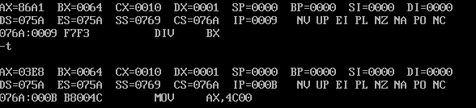

### 8.8	伪指令dd

前面我们用`db`(define byte)和`dw`(define word)定义字节型数据和字型数据. `dd`是用来定义dword（double word）的。

***Q8.1***

```assembly
;	用div计算data段中第一个数据除以第二个数据后的结果
;	商存在第三个数据的存储单元中

assume cs:code,ds:data

data segment
	dd 100001
	dw 100
	dw 0
data ends

code segment
start:	
	;init
	mov ax,data
	mov ds,ax

	;mov data to regs
	mov ax,ds:[0]			;将低16位保存在ax中
	mov dx,ds:[2]			;将高16位保存在dx中
	div word ptr ds:[4]
	mov ds:[6],ax

	mov ax,4C00H
	int 21H
code ends

end start
```

### 8.9	dup

`dup`是一个操作符,在汇编语言中同`db`等一样,也是由编译器识别处理的符号.***它是和`db` / `dw` / `dd`等数据定义伪指令配合使用的,用来进行数据的重复***

***格式***

```assembly
db / dw / dd 重复的次数 dup (重复的对应类型的数据)
```

***引用***

```assembly
db 3 dup (0)	;定义3个字节,它们的值都是0,相当于	db 0,0,0
db 3 dup (0,1,2);定义了9个字节,它们是0,1,2,0,1,2,0,1,2,0,1,2

;定义一个容量为1000字节的栈段
stack segment
	db 1000 dup (0)
stack ends
```

### 实验7	寻址方式在结构化数据访问中的应用

```assembly
;	编程,将data段中的年份 / 总收入 / 雇员人数按照顺序,
;	覆盖table段中的year / summ / ne,并计算人均收入,取整后覆盖??

assume cs:code,ds:data,ss:stack

data segment
	;表示21年的21个字符串
	db '1975','1976','1977','1978','1979','1980','1981','1982','1983'
	db '1984','1985','1986','1987','1988','1989','1990','1991','1992'
	db '1993','1994','1995'

	;表示21年公司总收入的21个dword型数据
	dd 16,22,382,1356,2390,8000,16000,24486,50065,97479,140417,197514
	dd 345980,590827,803530,1183000,1843000,2759000,3753000,4649000,5937000

	;表示21年公司雇员人数的21个word型数据
	dw 3,7,9,13,28,38,130,220,476,778,1001,1442,2258,2793,4037,5635,8226
	dw 11542,14430,15257,17800
data ends

table segment
	db 21 dup ('year summ ne ?? ')
table ends

; 分析:
;	思路一:	采用分批完成的思想:将三组数据看作三个数组,一个一个数组向table中输入数据,即遍历table3次
		;难点与解决:	1.访问table中对应的数据:[bx].idata[si],一次顶多能够处理一个字的大小,因此对于double word类型的数据需要多处理一次
				;	2.每组数据完成之后不需要额外偏移,改变偏移量即可,那是否可以使用jmp指令?
;	思路二:	采用一次完整的思想:分别记录三组数据的开始地址,然后每完成一次就将这些地址增加相应的量
		;难点与解决:	1.
stack segment
	db 1000 dup (0)
stack ends

code segment
start1:	
		;init
		mov ax,data 	;数据区
		mov ds,ax
		mov ax,stack 	;栈区,用于存放循环变量和临时存放DS
		mov ss,ax
		mov sp,1000
		mov bx,table 	;将table的地址存放在di中,方便拿取
		mov di,bx
		mov bp,0 		;BP用于遍历整个DATA段

;先将年的信息写入结构化数据中
		mov cx,21
		mov bx,0		;bx用于遍历每一年,也就是一个结构体
year:
		push cx
		mov cx,4		;年份由4个byte组成,所以遍历四次(其实也可以用2个word解决)
		mov si,0		;[bx].idata[si],idata定位数组,si定位数组中的元素
	year_byte:
			mov al,ds:[bp]		;先将要复制的内容放在寄存器中
			push ds				;将DS暂存
			mov ds,di			;更改DS,使其指向table段
			mov [bx].0[si],al	;将要复制的内容放到目标位置
			pop ds
			inc si				;指向下一个byte
			inc bp
			loop year_byte
		pop cx
		add bx,10H				;处理完一年,指向下一年
		loop year

;复制收入
		mov bx,0				;重置BX,使目标回到第一年
		mov cx,21
summery:
		push cx
		mov cx,2
		mov si,0
	summery_doubleWord:
			mov ax,ds:[bp]
			push ds
			mov ds,di
			mov [bx].5[si],ax
			pop ds
			add si,2			;为了读取下一个word,偏移两个byte
			add bp,2
			loop summery_doubleWord
		pop cx
		add bx,10H
		loop summery

;复制雇员数量
		mov bx,0
		mov cx,21
staff:
		mov ax,ds:[bp]
		push ds
		mov ds,di
		mov [bx].10,ax
		pop ds
		add bx,10H
		add bp,2
		loop staff

;计算人均收入.由于收入是32位数据,因此采用高位存放在DX,低位存放在AX的计算方法
		mov bx,0
		mov cx,21
		mov ds,di				;由于不涉及拷贝,直接将DS设置为table段的首地址
ave:
		mov si,0
		mov ax,[bx].5[si]		;移入低位
		add si,2				;1word的偏移量
		mov dx,[bx].5[si]		;移入高位
		div word ptr [bx].10	;进行运算
		mov [bx].0DH,ax			;仅保留整数,于是将AX中的商放入目标位置
		add bx,10H
		loop ave

		mov ax,4C00H
		int 21H
code ends

end start1
```

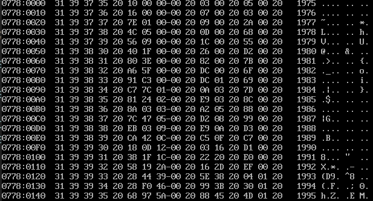

***网络查询到的代码***

```assembly
assume cs:codesg
data segment
  db '1975','1976','1977','1978','1979','1980','1981','1982','1983'
  db '1984','1985','1986','1987','1988','1989','1990','1991','1992'
  db '1993','1994','1995'
  # 以上表示21年的21个字符串

  dd 16,22,382,1356,2390,8000,16000,24486,50065,97479,140417,197514
  dd 345980,590827,803530,1183000,1843000,2759000,3753000,4649000,5937000
  # 以上表示21年公司总收入的21个dword型数据

  dw 3,7,9,13,28,38,130,220,476,778,1001,1442,2258,2793,4037,5635,8226
  dw 11542,14430,15257,17800
  # 以上表示21年公司雇员人数的21个word型数据
data ends

table segment
  db 21 dup ('year summ ne ??')
table ends

codesg segment

start: mov ax,data
       mov ds,ax                     # 将data段传入ds
       mov ax,table
       mov es,ax                     # 将table段传入es
       mov bx,0
       mov si,0
       mov di,0
       mov cx,15h                    # 循环次数
       
    s: mov ax,ds:[bx]                # 将年份低位传入ax寄存器
       mov es:[si],ax                # 将ax中的年份低位传入es:[si]的0位
       mov ax,ds:[bx + 2]            # 将年份高位传入ax寄存器
       mov es:[si + 2],ax            # 将ax中的年份高位传入es:[si]的2位
                                     # 以上四条指令处理表格此行的年份

       mov ax,ds:[bx + 54h]          # 将收入低位传入ax寄存器
       mov es:[si + 5],ax            # 将ax中的收入低位传入es:[si]的5位
       mov ax,ds:[bx + 56h]          # 将收入高位传入ax寄存器
       mov es:[si + 7],ax            # 将ax中的收入高位传入es:[si]的7位
                                     # 以上四条指令处理表格此行的收入
       
       mov ax,ds:[di + 00a8h]        # 将雇员数传入ax寄存器
       mov es:[si + 0ah],ax          # 将雇员数传入es:[si]的10位 
                                     # 以上两条指令处理表格此行的雇员数

       mov ax,[bx + 54h]             # 取收入的低位传入ax
       mov dx,[bx + 56h]             # 取收入的高位传入dx
       div word ptr ds:[di + 00a8h]  # 收入除以雇员数
       mov es:[si + 0dh],ax          # 将ax中收入的整数传入es:[si]的13位
                                     # 以上四条指令处理表格此行的人均收入

       add si,16                     # 表格换行
       add di,2                      # 雇员数和人均收入均为2字节
       add bx,4                      # 年份和收入均为4字节

       loop s

       mov ax 4c00h
       int 21h

codesg ends
end start
```

首先自己的代码没有采用`es`寄存器,并且自己的代码采用的是第一种思路,而网络上的代码采用的是第二种思路.在认真计算每组数据之间的距离之后,其实第二种方法也非常简便db

