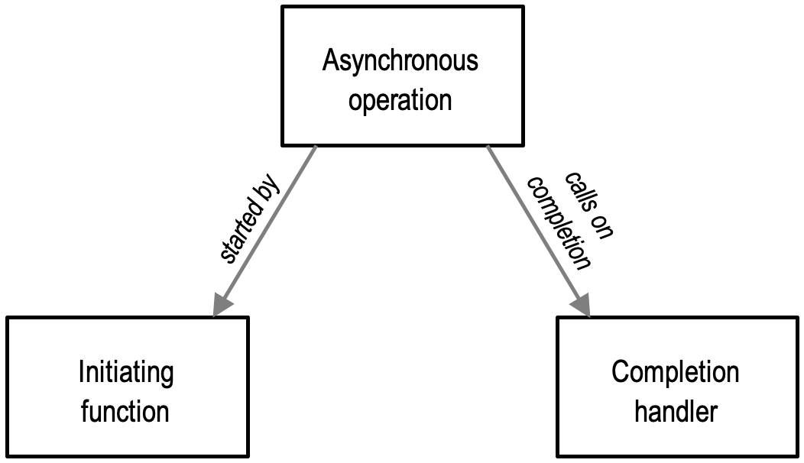
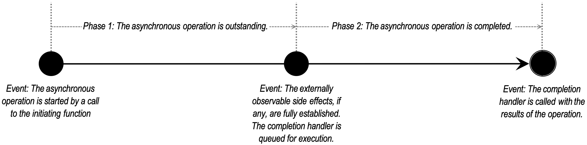
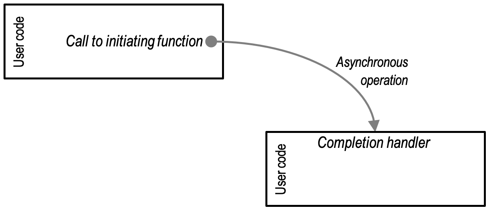
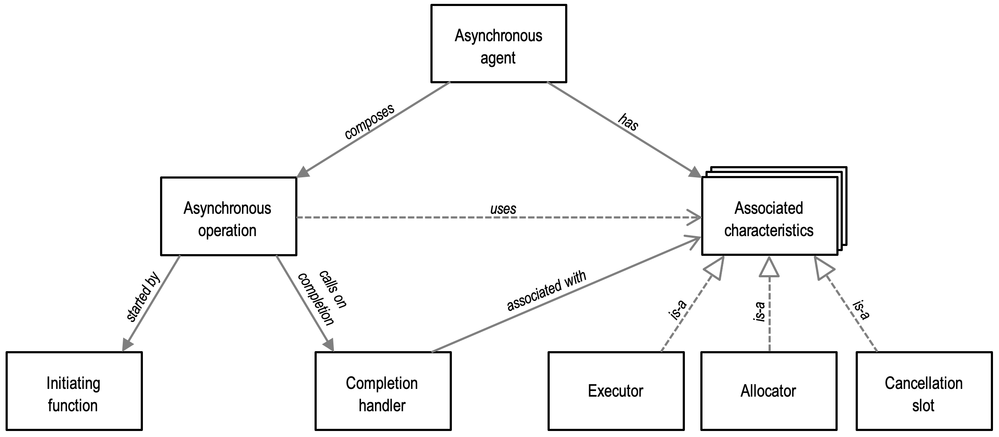
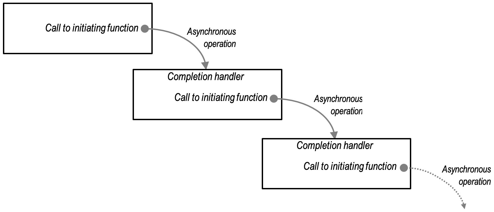

[TOC]

# 总览

## Boost.Asio架构


作为一个介绍性的例子，让我们考虑一下当你在一个套接字上执行连接操作时会发生什么。我们将从检查同步操作开始。

你的程序将至少有一个I/O执行上下文，例如`boost::ASIO::io_context`对象、`boost::thread_pool`对象或`boost::system_context`。这个I/O执行上下文代表你的程序与操作系统的I/O服务的联系。

```cpp
boost::asio::io_context io_context;
```

为了执行I/O操作，你的程序将需要一个I/O对象，如TCP套接字：

```cpp
boost::asio::ip::tcp::socket socket(io_context);
```

当执行同步连接操作时，会发生以下事件顺序：

1. 你的程序通过调用I/O对象启动连接操作：

    ```cpp
    socket.connect(server_endpoint);
    ```

2. I/O对象将请求转发给I/O执行环境。

3. I/O执行环境调用操作系统来执行连接操作。

4. 操作系统将操作结果返回给I/O执行环境。

5. I/O执行上下文将操作产生的任何错误转化为一个`boost::system::error_code`类型的对象。`error_code`可以与特定的值进行比较，或者作为一个布尔值进行测试（错误的结果意味着没有发生错误）。然后，该结果被转发回I/O对象。

6. 如果操作失败，I/O对象会抛出一个`boost::system::system_error`类型的异常。如果启动该操作的代码被写成：

    ```cpp
    boost::system::error_code ec;
    socket.connect(server_endpoint, ec);
    ```

    那么`error_code`变量`ec`将被设置为操作的结果，并且不会抛出异常。

当使用一个异步操作时，会发生不同的事件序列。


1. 你的程序通过调用I/O对象启动连接操作：

    ```cpp
    socket.async_connect(server_endpoint, your_completion_handler);
    ```

    其中 your_completion_handler 是一个具有签名的函数或函数对象：

    ```cpp
    void your_completion_handler(const boost::system::error_code& ec);
    ```

    所需的确切签名取决于正在执行的异步操作。

2. I/O对象将请求转发给I/O执行环境。

3. I/O执行上下文向操作系统发出信号，它应该开始一个异步连接。

    这需要一段时间(在同步情况下，这种等待将完全包含在连接操作的时间内)。

    

4. 操作系统表示连接操作已经完成，将结果放在一个队列中，准备由I/O执行上下文来接收。

5. 当使用`io_context`作为I/O执行上下文时，你的程序必须调用`io_context::run()`（或类似的`io_context`成员函数之一），以便检索到结果。对`io_context::run()`的调用在有未完成的异步操作时被阻止，所以你通常会在开始第一个异步操作时调用它。

6. 在调用`io_context::run()`的过程中，I/O执行上下文对操作的结果进行排队，将其转化为`error_code`，然后将其传递给你的完成处理器。

## 异步模型

### 异步操作



异步操作是Boost.Asio异步模型中的基本组成单位。异步操作代表了在后台启动和执行的工作，而启动工作的用户代码可以继续做其他事情。

从概念上讲，一个异步操作的生命周期可以用以下事件和阶段来描述：



启动函数是一个可由用户调用的函数，用于启动一个异步操作。

一个完成处理句柄(completion handler)是一个函数对象, 这个函数对象由用户提供, 只支持移动操作(move), 这个函数对象只能用异步操作的结果调用最多一次. 对完成处理句柄的调用将会通知用户: 操作已经完成，操作的结果已经建立。

启动函数和完成处理句柄被纳入用户的代码中，具体如下：



同步操作被体现为单一函数，因此有几个固有的语义属性。异步操作从其同步操作中采用了其中的一些语义属性，以促进灵活和高效的组合。

| 同步操作的属性                                               | 异步操作的等效属性                                           |
| ------------------------------------------------------------ | ------------------------------------------------------------ |
| 当一个同步操作是通用的（即模板）时，返回类型是由函数和它的参数决定性地派生出来的。 | 当一个异步操作是通用的，完成处理句柄的参数类型和顺序是由启动函数和它的参数决定的。 |
| 如果一个同步操作需要一个临时资源（如内存、文件描述符或线程），这个资源在从函数返回之前被释放。 | 如果一个异步操作需要一个临时资源（如内存、文件描述符或线程），这个资源在调用完成处理句柄之前被释放。 |

后者是异步操作的一个重要属性，因为它允许完成处理句柄在不重叠使用资源的情况下启动进一步的异步操作。考虑到同一操作在一个链中被不断重复的琐碎（相对常见）的情况：


通过确保资源在完成处理句柄运行之前被释放，我们避免了操作链的峰值资源使用量的翻倍。

### 异步代理



一个异步代理是异步操作的顺序组合。每个异步操作都被认为是作为异步代理的一部分运行，即使该代理只包含该单一操作。异步代理是一个实体，可以与其他代理同时进行工作。异步代理是对异步操作的，就像线程对同步操作一样。

然而，异步代理是一个纯粹的概念性结构，它允许我们对程序中的异步操作的背景和组成进行推理。"异步代理 "这个名字并没有出现在库中，哪个具体的机制被用来组合代理中的异步操作也不重要。

我们可以将一个异步代理形象化，如下所示：




异步代理交替地等待一个异步操作的完成，然后为该操作运行一个完成处理句柄。在代理的范围内，这些完成处理句柄代表了可调度工作的不可分割的单位。

### 相关的特征和关联

一个异步代理有相关的特性，指定异步操作在作为该代理的一部分组成时应如何表现，例如：

+ 一个分配器，它决定了代理的异步操作如何获得内存资源。
+ 一个取消槽，它决定了代理的异步操作如何支持取消。
+ 一个执行器，它决定了代理的完成处理句柄如何被排队和运行。

当异步操作在异步代理中运行时，其实现可以查询这些相关的特性，并使用它们来满足它们所代表的要求或偏好。异步操作通过将关联特征应用到完成处理句柄来执行这些查询。每个特征都有一个相应的关联特征。

联想器特征可以被专门用于具体的完成处理句柄类型：

+ 接受由异步操作提供的默认特性，按原样返回该默认特性
+ 返回一个无关的特性的实现，或者
+ 调整所提供的默认值以引入完成处理句柄所需的额外行为。

#### 联想器的规范

给出一个名为`associated_R`的联想器，其具有以下特性：

+ 一个`S`类型的源值`s`，在这里是指完成处理程序和它的类型
+ 一组类型要求（或一个概念）`R`，它定义了相关特征的句法和语义要求
+ 一个由异步操作提供的符合类型要求`R`的`C`型候选值`c`，它代表了相关特性的默认实现。

异步操作使用关联的特性来计算以下内容:

+  `associated_R<S, C>::type`的类型
+ `associated_R<S, C>::get(s, c)`的值

这些内容应当满足`R`中的定义. 为方便起见，这些也可以分别通过类型别名`associated_R_t<S, C>`和自由函数`get_associated_R(s, c)`进行访问。

特质的主要模板被指定为：

+ 如果`S::R_type`格式良好，则定义一个嵌套的类型别名`type为S::R_type`，以及一个静态成员函数返回`s.get_R()`
+ 否则，如果`associator<associated_R, S, C>::type`是格式良好的，并且表示一个类型，则继承于`associator<associated_R, S, C>`。
+ 否则，定义一个嵌套的类型别名type为`C`，以及一个静态成员函数返回`c`。

# 样例

## 基本技巧

### 同步地使用定时器

本样例将通过展示如何设置一个基于时间的锁来介绍 asio 库.

```cpp
//
// timer.cpp
// ~~~~~~~~~
//
// Copyright (c) 2003-2023 Christopher M. Kohlhoff (chris at kohlhoff dot com)
//
// Distributed under the Boost Software License, Version 1.0. (See accompanying
// file LICENSE_1_0.txt or copy at http://www.boost.org/LICENSE_1_0.txt)
//

#include <iostream>
#include <boost/asio.hpp>

int main()
{
  boost::asio::io_context io;

  boost::asio::steady_timer t(io, boost::asio::chrono::seconds(5));
  t.wait();

  std::cout << "Hello, world!" << std::endl;

  return 0;
}
```

1. 在函数的开头, 声明了一个`io_context`对象. 所有使用 asio 库的程序都需要至少有一个 IO 执行上下文, 例如`io_context`或者`thread_pool`对象. 一个 IO 执行上下文提供了访问 IO 功能的方法.

2. 接下来声明了`boost::steady_timer`类型的一个对象, 提供I/O功能（或像本例中的定时器功能）的核心asio类总是将一个执行器或对一个执行上下文（如`io_context`）的引用作为其第一个构造参数。构造函数的第二个参数将定时器设置为从现在起5秒后失效。

3. 在这个简单的例子中, 我们对定时器进行阻塞式等待. 调用`steady_timer::wait()`在定时器超时之前都不会返回.

    一个定时器只有两种状态:

    + 超时
    + 未超时

    如果`steady_timer::wait()`函数被调用在一个已经超时的定时器上, 那么函数就会马上返回.

4. 最后, 在定时器超时之后, "Hello, world!"会被打印.

### 异步地使用定时器

```cpp
//
// timer.cpp
// ~~~~~~~~~
//
// Copyright (c) 2003-2023 Christopher M. Kohlhoff (chris at kohlhoff dot com)
//
// Distributed under the Boost Software License, Version 1.0. (See accompanying
// file LICENSE_1_0.txt or copy at http://www.boost.org/LICENSE_1_0.txt)
//

#include <iostream>
#include <boost/asio.hpp>

void print(const boost::system::error_code& /*e*/)
{
  std::cout << "Hello, world!" << std::endl;
}

int main()
{
  boost::asio::io_context io;

  boost::asio::steady_timer t(io, boost::asio::chrono::seconds(5));
  t.async_wait(&print);

  io.run();

  return 0;
}
```

1. 使用asio的异步功能意味着提供一个 [completion token](https://www.boost.org/doc/libs/1_82_0/doc/html/boost_asio/overview/model/completion_tokens.html)，这决定了当一个异步操作完成时，结果将如何传递给一个完成处理程序。在这个程序中，我们定义了一个名为print的函数，当异步等待完成时被调用。
2. 接下来, 我们调用`steady_timer::async_wait()`函数来进行异步等待. 当我们调用这个函数的时候, 我们会将上面定义的`print`函数一并传递
3. 最后, 我们必须调用`io_context::run()`成员函数. asio 库保证完成处理句柄只会被正在调用`io_context::run()`函数的线程调用. 因此除非调用`io_context::run()`, 否则调用完成处理句柄的异步等待的完成过程不会被调用.

在还有工作要完成的时候, `io_context::run()`会保持运行. 在这个例子中, 工作就是异步等待定时器, 所以在计时器超时/完成过程句柄被返回之前, 函数都不会返回.

一定要记得在调用`io_context::run()`之前给`io_context`一些工作. 例如, 如果我们省略了代码中调用的`steady_timer::async_wait()`, 那么`io_context`就没有任何工作, 因此`io_context::run()`就会立即返回.

### 将参数绑定至完成处理句柄

```cpp
//
// timer.cpp
// ~~~~~~~~~
//
// Copyright (c) 2003-2023 Christopher M. Kohlhoff (chris at kohlhoff dot com)
//
// Distributed under the Boost Software License, Version 1.0. (See accompanying
// file LICENSE_1_0.txt or copy at http://www.boost.org/LICENSE_1_0.txt)
//

#include <iostream>
#include <boost/asio.hpp>
#include <boost/bind/bind.hpp>

void print(const boost::system::error_code& /*e*/,
    boost::asio::steady_timer* t, int* count)
{
  if (*count < 5)
  {
    std::cout << *count << std::endl;
    ++(*count);

    t->expires_at(t->expiry() + boost::asio::chrono::seconds(1));
    t->async_wait(boost::bind(print,
          boost::asio::placeholders::error, t, count));
  }
}

int main()
{
  boost::asio::io_context io;

  int count = 0;
  boost::asio::steady_timer t(io, boost::asio::chrono::seconds(1));
  t.async_wait(boost::bind(print,
        boost::asio::placeholders::error, &t, &count));

  io.run();

  std::cout << "Final count is " << count << std::endl;

  return 0;
}
```

要想使用 asio 实现一个反复执行的定时器, 需要在完成处理句柄中更改定时器的超时时间, 然后启动一个新的异步等待. 显然, 这意味着完成处理句柄要能够访问定时器对象. 于是我们需要向`print`函数中添加两个参数:

+ 一个指向定时器对象的指针
+ 一个计数器, 这个计数器让我们能够在合适的时候停下

1. 正如代码中展示的, 这个程序会在定时器第六次触发后停下. 但是我们可以注意到, 我们并没有显式地要`io_context`停下. 回忆上一个样例中的内容, `io_context::run()`会在没有剩下的工作后结束. 当计时器到达 5, 我们不再开启一个新的异步等待工作, `io_context`就会因为没有剩下的工作而停下.

2. 我们将计时器的超时时限延长 1 秒, 这样我们就不会因为任何的延迟而导致出错

3. 然后我们开始一个新的异步等待. `steady_timer::async_wait()`函数需要一个句柄函数(或者说, 函数对象), 这个句柄函数的函数签名需要是: `void(const boost::system::error_code&)`, 将额外的参数绑定到函数`print`上能使我们的函数复合函数签名的需要.

    在这个例子中, `boost::asio::placeholders::error`参数是一个占位符. 为了符合函数签名, 这个参数必须存在, 但是因为在句柄函数中不被需要, 因此我们传入了一个占位符.

### 将成员函数作为完成处理句柄

```cpp
//
// timer.cpp
// ~~~~~~~~~
//
// Copyright (c) 2003-2023 Christopher M. Kohlhoff (chris at kohlhoff dot com)
//
// Distributed under the Boost Software License, Version 1.0. (See accompanying
// file LICENSE_1_0.txt or copy at http://www.boost.org/LICENSE_1_0.txt)
//

#include <iostream>
#include <boost/asio.hpp>
#include <boost/bind/bind.hpp>

class printer
{
public:
  printer(boost::asio::io_context& io)
    : timer_(io, boost::asio::chrono::seconds(1)),
      count_(0)
  {
    timer_.async_wait(boost::bind(&printer::print, this));
  }

  ~printer()
  {
    std::cout << "Final count is " << count_ << std::endl;
  }

  void print()
  {
    if (count_ < 5)
    {
      std::cout << count_ << std::endl;
      ++count_;

      timer_.expires_at(timer_.expiry() + boost::asio::chrono::seconds(1));
      timer_.async_wait(boost::bind(&printer::print, this));
    }
  }

private:
  boost::asio::steady_timer timer_;
  int count_;
};

int main()
{
  boost::asio::io_context io;
  printer p(io);
  io.run();

  return 0;
}
```

在这个实例中, 我们将看到如何使用一个类的成员函数作为完成处理句柄. 

1. 与之前的做法不同, 我们定义了一个叫做`printer`的类.
    + 这个类的构造函数将会需要一个`io_context`对象的引用作为参数. 它会使用这个参数来初始化`timer_`成员. 计数器用于结束程序, 同样是类的成员变量
    + `boost::bind`函数在成员函数中一样可以工作, 只是对于非静态成员函数来说, 我们需要将隐式参数`this`传入. 此处我们并没有提供`boost::asio::placeholders::error`占位符, 因为`print`函数并不需要一个`error`对象作为参数
    + 在析构函数中我们将会打印计数器的最后的值
    + `print`函数与之前的示例中的示例非常相像, 只是它现在操作的是类的成员而不是通过参数传入定时器和计数器
2. `main`函数相较之前简单了很多, 它只需要声明一个`printer`对象, 然后像之前一样调用`io_context`即可.

### 在多线程程序中同步完成处理句柄

> 在将不同的事务同时放入`strand`之后, 事务会按照放入的顺序执行. 即使有多个线程调用了`io_context::run()`. 
>
> 但是如果不同的事务没有放入同一个`strand`, 那么用多个线程调用`io_context::run()`就能够在一定程度上加快事务的处理速度.
>
> 在本例中, 可以将事务处理的工作交给新的线程, 而主线程继续别的工作

```cpp
//
// timer.cpp
// ~~~~~~~~~
//
// Copyright (c) 2003-2023 Christopher M. Kohlhoff (chris at kohlhoff dot com)
//
// Distributed under the Boost Software License, Version 1.0. (See accompanying
// file LICENSE_1_0.txt or copy at http://www.boost.org/LICENSE_1_0.txt)
//

#include <iostream>
#include <boost/asio.hpp>
#include <boost/thread/thread.hpp>
#include <boost/bind/bind.hpp>

class printer
{
public:
  printer(boost::asio::io_context& io)
    : strand_(boost::asio::make_strand(io)),
      timer1_(io, boost::asio::chrono::seconds(1)),
      timer2_(io, boost::asio::chrono::seconds(1)),
      count_(0)
  {
    timer1_.async_wait(boost::asio::bind_executor(strand_,
          boost::bind(&printer::print1, this)));

    timer2_.async_wait(boost::asio::bind_executor(strand_,
          boost::bind(&printer::print2, this)));
  }

  ~printer()
  {
    std::cout << "Final count is " << count_ << std::endl;
  }

  void print1()
  {
    if (count_ < 10)
    {
      std::cout << "Timer 1: " << count_ << std::endl;
      ++count_;

      timer1_.expires_at(timer1_.expiry() + boost::asio::chrono::seconds(1));

      timer1_.async_wait(boost::asio::bind_executor(strand_,
            boost::bind(&printer::print1, this)));
    }
  }

  void print2()
  {
    if (count_ < 10)
    {
      std::cout << "Timer 2: " << count_ << std::endl;
      ++count_;

      timer2_.expires_at(timer2_.expiry() + boost::asio::chrono::seconds(1));

      timer2_.async_wait(boost::asio::bind_executor(strand_,
            boost::bind(&printer::print2, this)));
    }
  }

private:
  boost::asio::strand<boost::asio::io_context::executor_type> strand_;
  boost::asio::steady_timer timer1_;
  boost::asio::steady_timer timer2_;
  int count_;
};

int main()
{
  boost::asio::io_context io;
  printer p(io);
  boost::thread t(boost::bind(&boost::asio::io_context::run, &io));
  io.run();
  t.join();

  return 0;
}
```

本示例展示如何在一个多线程程序中使用`strand`类模板来同步完成处理句柄.

前面的实例中, 都通过在单个线程中调用`io_context::run()`来避免了处理同步的问题. 正如你已经知道的，asio库提供了一个保证，即完成处理句柄只能从当前正在调用`io_context::run()`的线程中被调用。因此，只从一个线程调用`io_context::run()`可以确保完成处理程序不能同时运行。

在使用 asio 开发应用程序时，单线程方法通常是最好的。缺点是它对程序的限制，特别是服务器，包括：

+ 当处理程序可能需要很长时间才能完成时，响应性差。
+ 无法在多处理器系统上进行扩展。

如果遇到了这样的问题, 一个较好的解决方法是, 使用一个线程池调用`io_context::run()`. 但是, 正如句柄允许并行调用, 我们需要句柄在访问一些共享的, 非线程安全的资源的时候进行同步.

1. 我们依然从定义`printer`类开始, 相较上一个示例, 我们有一些扩展

    + 除了初始化一对`boost::asio::steady_timer`成员, 构造函数初始化了`strand_`成员, 一个类型为`boost::asio::strand<boost::asio::io_context::executor_type>`的对象
    + `strand`类模板是一个执行器适配器, 它保证对于那些通过它派发的处理程序，一个正在执行的处理程序将被允许在下一个开始之前完成。无论调用`io_context::run()`的线程有多少，都能保证这一点。
    + 当然，处理程序仍然可能与其他没有通过`strand`派发的处理程序同时执行，或者通过不同的`strand`对象派发。
    + 在初始化异步操作的时候, 每一个完成处理句柄都被绑定到了一个`boost::asio::strand<boost::asio::io_context::executor_type>`对象. `boost::asio::bind_executor()`函数返回一个新的句柄，该句柄通过`strand`对象自动分派其包含的处理程序。通过将处理程序绑定到同一`strand`上，我们确保它们不能同时执行。

2. 在一个多线程程序中, 异步操作的句柄应当在访问共享资源的时候同步. 在本示例中, 句柄们使用的共享资源为`std::cout`和`cout_`数据成员

3. `main`函数中的`io_context::run()`现在能被两个线程调用:

    + 主线程
    + 一个额外线程

    这通过`boost::thread`对象实现.

4. 就像单线程的调用一样，对`io_context::run()`的并发调用将在有工作要做时继续执行。在所有异步操作完成之前，后台线程不会退出。

## Socket 介绍

### 一个同步 TCP daytime 客户端

本示例将展示如何使用 asio 库来实现一个使用 TCP 的客户端程序

```cpp
//
// client.cpp
// ~~~~~~~~~~
//
// Copyright (c) 2003-2023 Christopher M. Kohlhoff (chris at kohlhoff dot com)
//
// Distributed under the Boost Software License, Version 1.0. (See accompanying
// file LICENSE_1_0.txt or copy at http://www.boost.org/LICENSE_1_0.txt)
//

#include <iostream>
#include <boost/array.hpp>
#include <boost/asio.hpp>

using boost::asio::ip::tcp;

int main(int argc, char* argv[])
{
  try
  {
    if (argc != 2)
    {
      std::cerr << "Usage: client <host>" << std::endl;
      return 1;
    }

    boost::asio::io_context io_context;

    tcp::resolver resolver(io_context);
    tcp::resolver::results_type endpoints =
      resolver.resolve(argv[1], "daytime");

    tcp::socket socket(io_context);
    boost::asio::connect(socket, endpoints);

    for (;;)
    {
      boost::array<char, 128> buf;
      boost::system::error_code error;

      size_t len = socket.read_some(boost::asio::buffer(buf), error);

      if (error == boost::asio::error::eof)
        break; // Connection closed cleanly by peer.
      else if (error)
        throw boost::system::system_error(error); // Some other error.

      std::cout.write(buf.data(), len);
    }
  }
  catch (std::exception& e)
  {
    std::cerr << e.what() << std::endl;
  }

  return 0;
}
```

1. 这个程序的目的是访问一个服务, 所以我们首先需要指定服务器

2. 所有使用 asio 的程序都需要拥有至少一个 IO 执行上下文, 例如`io_context`对象

3. 我们需要把作为参数指定给应用程序的服务器名称变成一个TCP端点。要做到这一点，我们使用一个`ip::tcp::resolver`对象。

    + 解析器接收一个主机名和服务名，并将它们变成一个端点列表。我们使用`argv[1]`中指定的服务器的名称和服务的名称（在这里是 "daytime"）执行一个解析调用。
    + 端点的列表使用一个类型为ip::tcp::resolver::results_type的对象返回。这个对象是一个范围，有begin()和end()成员函数，可用于在结果上进行迭代。

4. 现在我们创建并连接套接字。上面获得的端点列表可能同时包含IPv4和IPv6端点，所以我们需要逐一尝试，直到找到一个可以使用的端点。这样可以使客户端程序不受特定IP版本的影响。`boost::asio::connect()`函数会自动为我们完成这个任务。

5. 连接已经打开。现在我们需要做的是读取日间服务的响应。

    我们使用一个`boost::array`来保存收到的数据。`boost::asio::buffer()`函数自动确定数组的大小，以帮助防止缓冲区超限。我们可以使用`char []`或`std::vector`来代替`boost::array`。

6. 当服务器关闭连接时，`ip::tcp::socket::read_some()`函数将以`boost::asio::error::eof`错误退出，这就是我们知道退出循环的方法。

7. 最后，处理任何可能被抛出的异常。

### 一个同步 TCP daytime 服务端

本示例将展示如何使用 asio 实现一个使用 TCP 的服务端.

1. 我们声明一个函数`make_daytime_string()`来创建一个字符串, 这个字符串会被发送回客户端. 这个函数会在服务端程序中反复使用
2. 我们需要创建一个`ip::tcp::acceptor`对象来监听新的连接. 这个对象被初始化为监听TCP端口13，使用的 IP版本是 4。
3. 这是一个迭代服务器, 这意味着它一次处理一个连接. 创建一个socket，代表与客户端的连接，然后等待连接。
4. 当客户端连接之后, 确定当前的时间, 然后将信息传递给客户端
5. 最后, 处理异常

### 一个异步 TCP daytime 服务端


```cpp
//
// server.cpp
// ~~~~~~~~~~
//
// Copyright (c) 2003-2023 Christopher M. Kohlhoff (chris at kohlhoff dot com)
//
// Distributed under the Boost Software License, Version 1.0. (See accompanying
// file LICENSE_1_0.txt or copy at http://www.boost.org/LICENSE_1_0.txt)
//

#include <ctime>
#include <iostream>
#include <string>
#include <boost/bind/bind.hpp>
#include <boost/shared_ptr.hpp>
#include <boost/enable_shared_from_this.hpp>
#include <boost/asio.hpp>

using boost::asio::ip::tcp;

std::string make_daytime_string()
{
  using namespace std; // For time_t, time and ctime;
  time_t now = time(0);
  return ctime(&now);
}

class tcp_connection
  : public boost::enable_shared_from_this<tcp_connection>
{
public:
  typedef boost::shared_ptr<tcp_connection> pointer;

  static pointer create(boost::asio::io_context& io_context)
  {
    return pointer(new tcp_connection(io_context));
  }

  tcp::socket& socket()
  {
    return socket_;
  }

  void start()
  {
    message_ = make_daytime_string();

    boost::asio::async_write(socket_, boost::asio::buffer(message_),
        boost::bind(&tcp_connection::handle_write, shared_from_this(),
          boost::asio::placeholders::error,
          boost::asio::placeholders::bytes_transferred));
  }

private:
  tcp_connection(boost::asio::io_context& io_context)
    : socket_(io_context)
  {
  }

  void handle_write(const boost::system::error_code& /*error*/,
      size_t /*bytes_transferred*/)
  {
  }

  tcp::socket socket_;
  std::string message_;
};

class tcp_server
{
public:
  tcp_server(boost::asio::io_context& io_context)
    : io_context_(io_context),
      acceptor_(io_context, tcp::endpoint(tcp::v4(), 13))
  {
    start_accept();
  }

private:
  void start_accept()
  {
    tcp_connection::pointer new_connection =
      tcp_connection::create(io_context_);

    acceptor_.async_accept(new_connection->socket(),
        boost::bind(&tcp_server::handle_accept, this, new_connection,
          boost::asio::placeholders::error));
  }

  void handle_accept(tcp_connection::pointer new_connection,
      const boost::system::error_code& error)
  {
    if (!error)
    {
      new_connection->start();
    }

    start_accept();
  }

  boost::asio::io_context& io_context_;
  tcp::acceptor acceptor_;
};

int main()
{
  try
  {
    boost::asio::io_context io_context;
    tcp_server server(io_context);
    io_context.run();
  }
  catch (std::exception& e)
  {
    std::cerr << e.what() << std::endl;
  }

  return 0;
}
```

#### `main`函数

我们需要创建一个服务端对象来接受到达的客户端连接. `io_context`对象提供了服务器对象将会使用的 IO 服务, 例如 socket.

运行`io_context`对象, 它就会进行异步地操作.

#### `tcp_server`类

构造函数初始化了一个接收器, 这个接收器将监听 TCP 端口 13

函数`start_accept()`创建一个 socket, 并初始化了一个异步接收操作来等待新的连接.

当`start_accept()`对异步接收操作的初始化完成的时候, 函数`handle_accept()`将被调用. 函数`handle_accept()`处理客户端的请求, 然后调用`start_accept()`函数来初始化下一个接收操作.

#### `tcp_connection`类

由于我们希望只要有操作引用到, `tcp_connection`对象就不被析构, 我们将使用`shared_ptr`和`enable_shared_from_this`.

在函数`start()`中, 我们调用了`boost::asio::async_write()`来将数据传递给客户端. 需要注意的是, 我们使用的是`boost::asio::async_write()`, 而不是`ip::tcp::async_write_some()`, 来确保整块的数据被发送. 

由于我们需要在异步操作结束之前保持数据有效, 要被发送的数据被保存在类成员对象`message_`中.

当初始化异步操作时，如果使用`boost::bind()`，你必须只指定与处理程序的参数列表相匹配的参数。在这个程序中，两个参数占位符（`boost::assio::placeholders::error`和`boost::placeholders::byte_transferred`）都有可能被删除，因为它们没有被用在`handle_write()`。

该客户连接的任何进一步行动现在都由`handle_write()`负责。

#### 移除未使用的句柄参数

你可能已经注意到，在`handle_write()`函数的主体中没有使用`error`和`bytes_transferred`参数。如果不需要参数，可以把它们从函数中删除:

```cpp
void handle_write()
{
}
```

然后，用于启动调用的`boost::asio::async_write()`调用可以改成只用：

```cpp
boost::asio::async_write(socket_, boost::asio::buffer(message_),
  boost::bind(&tcp_connection::handle_write, shared_from_this()));
```


