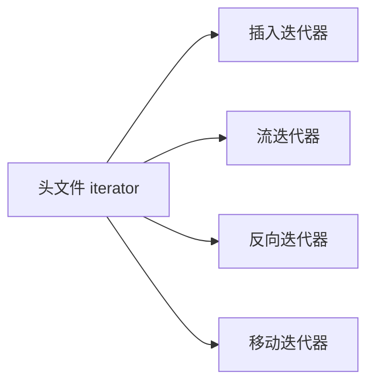
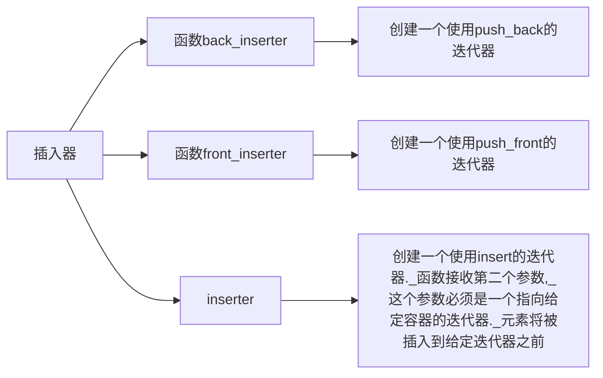

```toc
```
# 再探迭代器

备注: 移动构造器笔记未写



# 插入迭代器——insert iterator

> 插入器是一种迭代器适配器，它接受一个容器，生成一个迭代器，能实现向给定容器添加元素。当我们通过一个插入迭代器进行赋值时，该迭代器调用容器操作来向给定容器的指定位置插入一个元素
> 

<aside>
📌 只有在容器支持`push_front`的情况下，我们才可以使用`front_inserter`。

只有在容器支持`push_back`的情况下，我们才可以使用`back_inserter`

</aside>

| 操作 | 含义 |
| --- | --- |
| it = t | 在it指定的当前位置插入t，假定c是it绑定的容器，依赖于插入迭代器的不同种类，此赋值会分别调用c.push_back() / c.push_front() / c.insert(t, p)，其中p为传递给inserter的迭代器位置 |
| *it, ++it, it++ | 这些操作虽然存在，但不会对it做任何事情，每一个操作都返回it |



## `back_inserter`

```cpp
vector<int> vec;
auto it = back_inserter(vec);
*it = 42; // vec.push_back(42);
```

```cpp
vector<int> vec;
// 错误
fill_n(vec.begin(), 10, 0);
// 正确
fill_n(back_inserter(vec), 10, 0);
```

右侧代码块第一个语句错误的原因是：泛型写入算法并不考虑容器中是否有这么多空间，它只进行写入。而显然我们没有这么多空间。

而第二个语句正确的原因就很容易理解了，对`back_inserter`返回的迭代器进行赋值操作，其实就是对`vector`进行`push_back`

## `inserter`

```cpp
auto it = inserter(vec, ite);
*it = val;
```

```cpp
it = vec.insert(it, val);
++it;
```

左右两侧代码的效果是一样的。可以看下面的代码进行进一步了解：

```cpp
#include <iterator>
#include <iostream>
#include <vector>
#include <algorithm>

using namespace std;

int main()
{
        vector<int> vec({5});
        auto ite = find(vec.begin(), vec.end(), 5);
// insert函数返回一个指向添加元素的迭代器，也就是会返回指向10的迭代器
// 如果我们想要继续添加，那么就需要将ite向后移动一个位置
        ite = vec.insert(ite, 10);
        ++ite;
        for_each(vec.begin(), vec.end(), [](const int& i) { cout << i << ' '; });
        cout << endl;
        cout << "the location of ite: " << ite - vec.begin() << endl;

// 接下来，我们使用inserter返回的迭代器插入元素
// 可以发现，我们并不需要人为地向后挪动迭代器，它会自动移动
        auto it = inserter(vec, ite);
        *it = 15;
        *it = 20;
        for_each(vec.begin(), vec.end(), [](const int& i) { cout << i << ' '; });
        cout << endl;
}
```

```
输出：
10 5
the location of ite: 1
10 15 20 5
```

## `front_inserter`

```
list<int> lst = {1, 2, 3, 4};
list<int> lst2, lst3;
copy(lst.begin(), lst.end(), front_inserter(lst2));         // lst2: 4, 3, 2, 1
copy(lst.begin(), lst.end(), inserter(lst3, lst3.begin())); // lst3: 1, 2, 3, 4
```

`front_inserter`返回的迭代器，每对迭代器进行一次赋值操作，就相当于进行一次`push_front`

而`inserter`返回的迭代器，每对迭代器进行一次赋值操作，迭代器就会指向插入元素的后一个位置

# 流迭代器——stream iterator

虽然`iostream`类型不是容器，但这些迭代器能够将它们对应的流当做一个特定类型的元素序列来处理。**通过使用流迭代器，我们可以用泛型算法从流对象读取数据以及向其写入数据。**

## `istream_iterator`

> **当创建一个流迭代器时，必须指定迭代器将要读写的对象类型。**`istream_iterator`要读取的类型必须定义了输入运算符。在创建的时候，我们可以将其绑定到一个流，也可以默认初始化迭代器，从创建一个可以当做尾后值使用的迭代器。
> 

```cpp
istream_iterator<int> int_it(cin);     // 从cin中读取int
istream_iterator<int> int_eof;         // 尾后迭代器
ifstream in("afile");
istream_iterator<string> str_it(int);  // 从"afile"中读取字符串
```

<aside>
📌 **示例：从`istream_iterator`从标准输入读取数据，存入一个`vector`**

```cpp
istream_iterator<int> in_iter(cin);  // 从cin读取int
istream_iterator<int> eof;      // 尾后迭代器
while (in_iter != eof)
{
	vec.push_back(*in_iter++);
}
```

当然，我们可以使用更简便的写法：

```cpp
istream_iterator<int> in_iter(cin), eof;
vector<int> vec(in_iter, eof);  // 使用迭代器范围构造vec
```

</aside>

## 使用算法操作流迭代器

由于算法是用迭代器操作来处理数据，而流迭代器又至少支持某些迭代器操作，因此我们至少可以用某些算法来操作流迭代器。

```cpp
// 计算cin中整数的和
istream_iterator<int> in(cin), eof;
cout << accumulate(in, eof, 0);
```

## `ostream_iterator`

我们可以对任何具有输出运算符`<<`的类型定义`ostream_iterator`。当创建一个`ostream_iterator`的时候，我们可以提供第二个参数，它是一个字符串，在输出每一个元素之后都会打印这个字符串。同时，**这个字符串必须是C风格字符串。**`ostream_iterator`必须被绑定到一个输出流，不允许空构造或表示尾后位置的`ostrea_iterator`

虽然我们对`ostream_iterator`进行解引用操作或者递增运算返回的都是对象本身，但是我们还是应该写上，这是为了保证代码风格的一致性。我们可以用`ostream_iterator`来输出值的序列：

```cpp
ostream_iterator<int> out_iter(cout, " ");
for (auto e : vec)
{
	*out_iter++ = e;
}
cout << endl;
```

```cpp
ostream_iterator<int> out_iter(cout, " ");
// 左右侧代码一样，但是为了风格的统一，更推荐使用左侧风格代码
for (auto e : vec)
{
	out_iter = e;
}
cout << endl;
```

<aside>
📌 **重要应用：我们通常使用`copy`来向输出流进行容器的打印**

```cpp
copy(vec.begin(), vec.end(), out_iter);
cout << endl;
```

</aside>

## 使用流迭代器处理类类型

**就如同我们可以用`ostream_iterator`处理定义了`<<`操作的类一样，我们可以用`istream_iterator`处理定义了`>>`的对象**

## 示例

### 编写程序，使用流迭代器读取一个文本文件，存入一个`vector`中的`string`里

```cpp
// test.txt
// hello world !

int main()
{
        ifstream fin("./test.txt", ifstream::in);
        istream_iterator<string> in_iter(fin);
        vector<string> vec(in_iter, istream_iterator<string>());
        copy(vec.cbegin(), vec.cend(), ostream_iterator<string>(cout, "\t"));
}

// 输出： hello   world   !
```

### 使用流迭代器、`sort`和`copy`从标准输入读取一个整数序列，将其排序并将结果写到标准输出

```cpp
int main()
{
        istream_iterator<int> in_iter(cin), eof;
        vector<int> vec(in_iter, eof);
        sort(vec.begin(), vec.end());
        copy(vec.begin(), vec.end(),
                        ostream_iterator<int>(cout, " "));
}
```

### 修改前一题程序，使其只打印不重复的元素。你的程序应当使用`unique_copy`

```cpp
int main()
{
        istream_iterator<int> in_iter(cin), eof;
        vector<int> vec(in_iter, eof);
        sort(vec.begin(), vec.end());
        unique_copy(vec.begin(), vec.end(),
                        ostream_iterator<int>(cout, " "));
}
```

### 编写程序，接收三个参数：一个输入文件和两个输出文件的文件名。输入文件保存的应该是整数。使用`istream_iterator`读取输入文件。使用`ostream_iterator`将奇数写入第一个输出文件，每个值之后跟一个空格。将偶数写入第二个输出文件，每个值都独占一行

```cpp
// test.cpp
#include <iostream>
#include <iterator>
#include <fstream>
#include <algorithm>
#include <functional>
#include <cstdlib>
#include <stdlib.h>

using namespace std;

int main(int argc, char** argv)
{
        if (argc != 4) { cout << "invalid parameters" << endl; }

        ifstream fin(argv[1], ifstream::in);
        ofstream fout_odd(argv[2], ofstream::out), fout_even(argv[3], ofstream::out);

        istream_iterator<int> fin_iter(fin), eof;

        for_each(fin_iter, eof,
                [&](const int& i) -> void
                {
                        if (i % 2) { fout_odd << i << ' '; }
                        else { fout_even << i << '\n'; }
                });

        cout << "program finished, please check file " << argv[2] << " and " << argv[3] << endl;
        system("pause");
}
```

```
// test.txt
1
2
3
4
5
6
7
8
```

```bash
// 执行脚本： run.sh
if [ -f test.exe ]
then
        rm test.exe
fi;

g++ -o test.exe test.cpp

if [ -f test.exe ]
then
        if [ -f test.txt ]
        then
                ./test.exe test.txt test_out_odd.txt test_out_even.txt
        else
                echo "file test.txt not found"
        fi;
else
        echo "compiling failed"
fi;
```

运行方法：将`test.cpp`、`test.txt`以及`run.sh`放到同一个文件，运行`run.sh`文件

# 反向迭代器——reverse iterator


## 移动反向迭代器

```cpp
#include <iostream>
#include <vector>

using namespace std;

int main()
{
        vector<int> vec({1, 2, 3, 4, 5});
        for (vector<int>::reverse_iterator rite = vec.rbegin(); rite != vec.rend(); rite++)
        {
                cout << *rite << " ";
        }
}
// 输入：5 4 3 2 1
```

也就是说，在反向迭代器中，**我们使用`++`来向前移动，使用`--`来向后移动（前提是容器支持这样的操作）**

## 反向迭代器与其他迭代器之间的关系

考虑这个例子：在一个`string`中，有一个个单词，其中由逗号隔开，假如我们想要找到最后一个单词并将其打印，我们应当如何操作？

答案是显而易见的，我们可以使用反向迭代器：

```cpp
string str = "Do,you,want,to,build,a,snowman";
// 下面这条语句有两个很重要的地方：
// 首先返回的必须是const_reverse_iterator（当然你可以偷懒用auto）
// 其次，比较的值必须是',' ，而不是","。原因涉及到容器的一个特征value_type，在此不做展开
string::const_reverse_iterator comma = find(str.rbegin(), str.rend(), ',');
```

这样，我们就找到了最后一个逗号，然后我们可以使用迭代器将其后面的内容打印。但需要注意的是，由于`comma`是一个反向迭代器，我们需要用一个反向迭代器来与之配对。换言之，这样的代码是行不通的：


当然，我们可以这样：


但这个。。未免有些。。。

---

我们的想法当然是可以使用`string`的构造函数，或者是使用泛型算法。那么我们可能会这样写：

```cpp
// 泛型算法
copy(str.crbegin(), comma, ostream_iterator<string::value_type>(cout));
cout << endl;
// string构造函数
cout << string(str.crbegin(), comma) << endl;
```

这是运行结果：

```cpp
namwons
namwons
```

我们会尴尬的发现，反向迭代器会将我们想要的东西“反过来”。当然我们还可以使用泛型算法`reverse`，但是，最简单的方法当然是我们能够让`comma`变为一个正向迭代器，然后我们就可以进行正常操作。

## `reverse_iterator.base()`


# 移动迭代器——move iterator