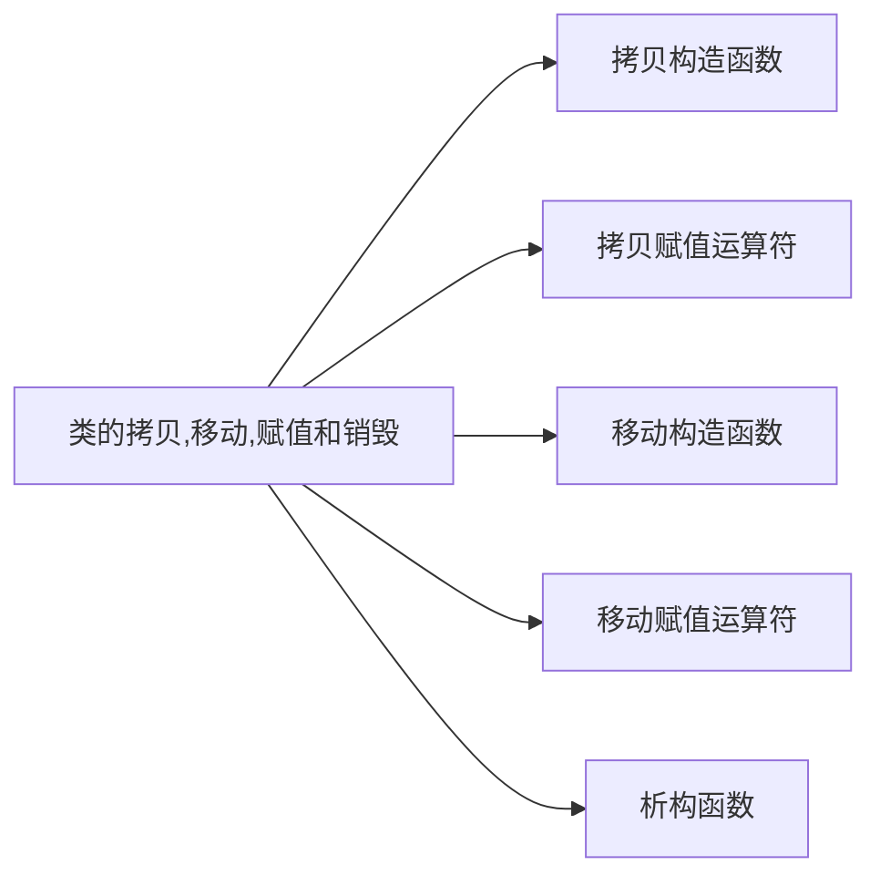

0-[TOC]




> [!Warning] 警告
> 如果一个类没有定义所有这些拷贝控制成员、编译器会自动地为它定义缺失的操作。因此，很多类会忽略这些拷贝控制及操作。但是，对一些类来说，依赖这些操作的默认定义会导致灾难。

# 拷贝、赋值与销毁

## 拷贝构造函数

> [!Notes] Note
> 任何拷贝构造函数的额外参数都需要有默认值


### 拷贝初始化

拷贝初始化不仅在我们`=`定义变量是会发生，在下列情况下也会发生：

* 将一个对象作为实参传递给一个非引用类型的形参
* 从一个返回类型为非引用类型的函数返回一个对象
* 用花括号列表初始化一个数组中的元素或一个聚合类中的成员
* 某些类类型还会对它们所分配的对象使用拷贝初始化，例如`vector`的`insert`和`push`，而`emplace`则不会

### 参数和返回值

拷贝构造函数被用来初始化非引用类类型参数，这一特性解释了为什么拷贝构造函数自己的参数必须是引用类型。如果其参数不是引用类型，则调用永远也不会成功——***为了调用拷贝构造函数，我们必须拷贝它的实参，但为了拷贝实参，我们又需要调用拷贝构造函数。*

### 编译器可以绕过拷贝构造函数

> 在拷贝初始化过程中，编译器可以（但不是必须）跳过拷贝/移动构造函数，直接创建对象

```C++
# 编译器可以将如下代码：
string null_book = "9-999-99999-9";
# 改为：
string null_book("9-999-99999-9");
```

## 拷贝赋值运算符

> [!Tips] Best Practice
> 赋值运算符通常应该返回一个指向其左侧运算对象的引用。***标准库通常要求保存在容器中的类型要去油赋值运算符，且其返回值是左侧运算对象的引用***

## 析构函数

## 三/五法则

### 需要析构函数的类也需要拷贝和赋值操作

#### 法则一

***当我们决定一个类是否需要定义它自己版本的拷贝控制成员时，一个基本原则是首先确定这个类是否需要一个析构函数。当一个类需要一个析构函数的时候，我们几乎可以确定它也需要一个拷贝构造函数和一个拷贝赋值运算符。***

### 需要拷贝操作的类也需要赋值操作，反之亦然

#### 法则二

***如果一个类需要一个拷贝构造函数，几乎可以肯定它也需要一个拷贝赋值运算符。反之亦然——如果一个类需要一个拷贝赋值运算符，几乎可以肯定它也需要一个拷贝构造函数。然而，无论是需要拷贝构造函数还是需要拷贝赋值运算符都不必然意味着也需要析构函数。***

## 使用`=default`

我们可以通过将拷贝控制成员定义为[` = default`](杂项/=default.md)来显式地要求编译器生成合成版本。

```C++
class Sales_data()
{
public:
	// 类内合成函数
	Sales_data() = default; // 使用合成构造函数
	Sales_data(const Sales_data&) = default; // 使用合成拷贝函数
	~Sales_data() = default; // 使用合成析构函数

	// 类外合成函数
	Sales_data& operator=(const Sales_data&);
}

Sales_data& Sales_data::operator=(const Sales_data&) = default;
```
> [!Warning] 警告
> 我们只能对具有合成版本（编译器能够自行编写）的成员函数使用` = default`。

> [!Tips] Best Practice
> 大多数类应当定义默认构造函数、拷贝构造函数和拷贝赋值运算符，无论是显式地还是隐式的。

## 阻止拷贝

虽然大多数类应该定义（而且也定义了拷贝构造函数和拷贝赋值运算符），但是对于某些类来说，这些操作没有合理的意义。在此情况下，在定义类的时候必须采用某种机制阻止拷贝或者赋值。例如，`iostream`类阻止了拷贝，以避免多个对象写入或读取相同的IO缓冲。为了阻止拷贝，看起来可能应该不定义拷贝控制成员。但是，这种策略是无效的：***如果我们的类没有定义这些操作，那么编译器会生成合成的版本。***

### 定义删除的函数

在新标准下，我们可以通过将拷贝构造函数和拷贝赋值运算符定义为**删除的函数（deleted function）**来阻止拷贝. 删除的函数是这样一种函数: ***我们虽然声明了它们, 但是不能以任何的方式使用它们.*** 在函数的参数列表后面加上` = delete` 来指出我们希望将它定义为删除的: 

```C++
struct NoCopy
{
	NoCopy() = default;
	NoCopy(const NoCopy&) = delete;				// 阻止拷贝
	NoCopy& operator=(const NoCopy&) = delete;	// 阻止赋值
};
```

******

**` = delete` 与 ` = default` 的不同:**

1. ` = delete` 必须出现在函数第一次声明的时候.
2. 我们可以对任何函数指定` = delete`, 而` = default` 只能对一些特定函数使用. 虽然删除函数的主要用途是禁止拷贝控制成员, 但当我们希望应到函数匹配过程的时候, 删除函数有的时候也是有用的.

### 析构函数不能是删除的对象

> [!Warning] 警告
> 对于析构函数已经删除的类型,不能定义该类型的变量或释放指向该类型动态分配对象的指针.

### 合成的拷贝可能是删除的

如果一个类未定义构造函数,编译器会为其合成一个默认构造函数. ***对某些类来说, 编译器将这些合成的成员定义为删除的函数:***

* 如果类的**某个成员的析构函数**是删除的或者不可访问的, 则类的合成析构函数被定义为删除的.
* 如果类的**某个成员的拷贝构造函数**是删除的或者不可访问的, 则类的合成拷贝构造函数被定义为删除的. 如果类的**某个成员的析构函数**是删除的或不可访问的, 则类合成的拷贝构造函数也被定义为删除的.
* 如果类的**某个成员的拷贝赋值运算符**是删除的或不可访问的, 或是类有一个** `const`的或引用成员**, 则类的合成拷贝赋值运算符被定义为删除的. 如果类的**某个成员的析构函数**是删除的或者不可访问的, 或者是类有**一个引用的成员**并且其没有类内初始化器, 或是类有**一个`const`成员.** 它没有类内初始化器且其类型未显示定义默认构造函数的, 该类的默认构造函数被定义为删除的.

![[C++ Primer.assets/第13章 拷贝控制.assets/第13章 拷贝控制 2022-07-05 15.22.39.excalidraw]]

> [!Notes] 笔记
> 本质上,这些规则的含义是: 如果一个雷友数据成员不能默认构造, 拷贝, 复制或销毁, 则对应的成员函数将被定义为删除的.

### `private`拷贝控制

在新标准之前, 类是通过将其拷贝构造函数和拷贝赋值运算符声明为`private`的来阻止拷贝. 我们可以通过定义`private`的这两样函数来避免普通用户的调用, 但是我们并不能阻止类内函数和友元的函数来调用他们, 因此, 我们可以***只声明, 而不去定义.***


> [!NOTE] 笔记
> 通过这样的做法，我们可以实现：
> 1. 试图拷贝对象的用户代码将在编译阶段被标记为错误
> 2. 成员函数或者友元函数中的拷贝操作将会导致链接错误

# 拷贝控制和资源管理

通常，**管理类外资源的类必须定义拷贝控制成员**。为了定义这些成员，我们首先必须确定此类型对象的拷贝语义。一般来说，我们可以定义拷贝操作，使类的行为看起来向一个值或者像一个指针。

1. 类的行为像一个值，意味着它应该也有自己的状态。当我们拷贝一个像值的对象时，副本和原对象是完全独立的。改变副本不会对原有对象有任何的影响，反之亦然
2. 行为像指针的类则共享状态。当我们靠背一个这种类的对象的时候，副本和原对象使用相同的底层数据，改变副本也会改变原对象，反之亦然。

## 在赋值运算符中使用`swap`

自己定义了`swap`函数的类通常在这个函数中使用`std::swap`来完成所需要的操作，这个函数在除了`array`之外的数据结构中都拥有在O(1)内完成的能力。而我们通常还能使用自己定义的`swap`函数来定义这个类的赋值运算符。这些运算符使用了一种名为**拷贝并交换（copy and swap）** 的技术。这种技术将左侧运算对象与右侧运算对象的一个副本进行交换。

```C++
// 需要注意的是，参数是按值传递的
HasPtr& HasPtr::operator=(HasPtr has)
{
	swap(*this, rhs);
	return *this;
}
```

这个技术的有趣之处是它自动处理了自赋值情况而且天然就是安全的。代码中唯一可能抛出异常的是拷贝构造函数中的`new`表达式。但是如果真的出现异常，这个异常也出现在开始操作左侧对象之前，因此它也是**异常安全**的。

# 对象移动

在旧C++标准中，没有直接的方法移动对象。因此，即使不比拷贝对象的情况下，我们也不得不拷贝。如果对象较大，或者是对象本身要求分配内存空间，进行不必要的拷贝代价非常高。类似的，在旧版本的标准库中，容器中所保存的类必须是可拷贝的。**但在新标准中，我们可以用容器保存不可拷贝的类型，只要它们可以被移动即可。**

## 右值引用——`rvalue reference`

所谓的右值引用就是必须绑定到右值的引用。我们通过`&&`而不是`&`来获得右值引用。右值引用有一个非常重要的性质——***只能绑定到一个将要销毁的对象***。这样，我们可以自由地将一个右值资源“移动”到另一个对象中。

***一般而言，一个左值表达式表示的是一个对象的身份，而一个右值表达式表示的是对象的值。对于左值引用，我们不能将其绑定到要求转换的表达式、字面常量或是返回右值的表达式；对于右值引用，我们可以将右值绑定到这些表达式上，但是不能将一个右值引用直接绑定到左值上。***

```C++
int i = 42;
int &r = i;
int &&rr = i;              // 错误：不能将一个右值引用绑定到左值上
int &r2 = i * 42;          // 错误：i * 42是右值
const int &r3 = i * 42;    // 正确：可以将一个const引用绑定到右值上
int &&rr2 = i * 42;        // 正确：将rr2绑定到乘法结果上
```
### 左值持久；右值短暂

由于右值引用只能绑定到临时对象，我们得知：

* 所引用的对象将要被销毁
* 该对象没有其他用户

这个特性意味着：使用右值引用的代码可以自由地接管所引用的对象的资源

### 变量是左值

```C++
int &&r1 = 42;  // 正确
int &&r2 = r1;  // 错误
```

### 标准库`move`函数

虽然不能将一个右值引用直接绑定到一个左值上，但是我们可以**显式地将一个左值转换为对应的右值引用类型**。我们还可以通过调用一个名为`move`的新标准库函数来获得绑定到左值上的右值引用，此函数定义在头文件`utility`中。

```C++
int &&rr3 = std::move(r1);
```

`move`调用告诉编译器：我们有一个左值，但我们希望像一个右值一样处理它。我们必须认识到，调用`move`就意味着承诺：***除了对`r1`赋值或销毁它外，我们将不再使用它。在调用`move`之后，我么不能对移后源对象的值做任何假设。***

> [!Notes] Note
> 我们可以销毁一个移后源对象，也可以赋予新值，但不能使用一个移后源对象的值。

> [!Warning] 警告
> 使用`move`的代码应该使用`std::move`而不是`move`。这样做可以避免潜在的名字冲突

### 移动构造函数和移动赋值运算符

为了让我们自己的类型支持移动操作，需要为其定义移动构造函数和移动赋值运算符。这两个成员类似对应的拷贝操作，但它们从给定对象“窃取”资源而不是拷贝资源。

除了完成资源移动，移动构造函数还必须确保移后源对象出于这样一个状态：***销毁它是无害的***。

```C++
StrVec::StrVec(StrVec&& s) noexcept
	// 成员初始化器接管s中的资源
	: elements(s.elements), first_free(s.first_free), cap(s.cap)
{
	// 令s进入这样的状态——对齐运行析构函数是安全的
	s.elements = s.first_free = s.cap = nullptr;
}
```

### 移动操作、标准库容器和异常

由于移动操作“窃取资源”，它通常不分配任何资源。因此，移动操作通常不会抛出任何异常。当编写一个不抛出异常的自动操作时，我们应该将此事通知标准库。在一个构造函数当中，`noexcept`出现在参数列表和初始化列表开始的冒号之间。

### 移动赋值运算符

```C++
Type& Type::operator(Type&& t) noexcept{}
```

> [!Warning] 提示
> 注意检查自赋值情况

### 移后源对象必须可析构

> [!Warning] 警告
> 在移动操作之后，移后源对象必须保持有效的、可析构的状态，但是用户不能对其值进行任何的假设（也就是不能再试图去使用原本的值）。

### 合成移动操作

1. 只有当一个类没有定义任何自己版本的拷贝控制成员，且它是的所有数据成员都能移动或移动赋值时，编译器才会为其合成移动构造函数或移动赋值运算符
2. 定义了一个移动构造函数或移动赋值运算符的类必须也定义自己的拷贝操作。否则，这些拷贝成员默认的被定义为删除的。

### 移动右值，拷贝左值

如果一个类既有移动构造函数，也有拷贝构造函数，编译器使用普通的函数匹配规则来确定使用哪个构造函数。

```C++
StrVec v1, v2;
v1 = v2;  // v2是左值，使用拷贝赋值
StrVec getVec(istream& is); // 这个函数返回右值
v2 = getVec(cin); // getVec(cin)返回一个右值，使用移动构造
```

但如果只有拷贝构造函数，没有移动构造函数，那么就对右值也使用拷贝构造函数。***用拷贝构造函数代替移动构造函数几乎肯定是安全的***

### 移动迭代器

新标准库中定义了一种**移动迭代器**适配器。一个移动迭代器通过改变给定迭代器的解引用运算符的行为来适配这个迭代器。一个移动迭代器的解引用运算符生成一个右值引用。

我们通过调用标准库的`make_move_iterator`函数将一个普通迭代器转换为一个移动迭代器。这个函数接收一个迭代器参数，返回一个移动迭代器。

> [!Notes] 不要随意使用移动操作
> 在移动构造函数和移动赋值运算符这些类实现代码之外的地方，只有当你确信需要进行移动操作且移动操作是安全的，才可以使用`std::move`


