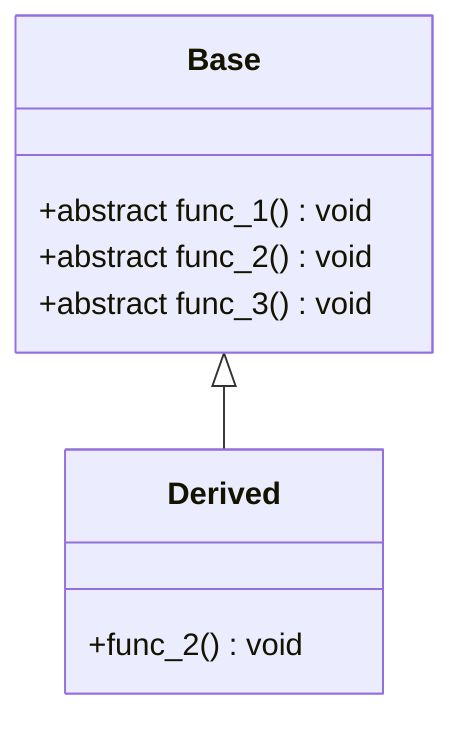
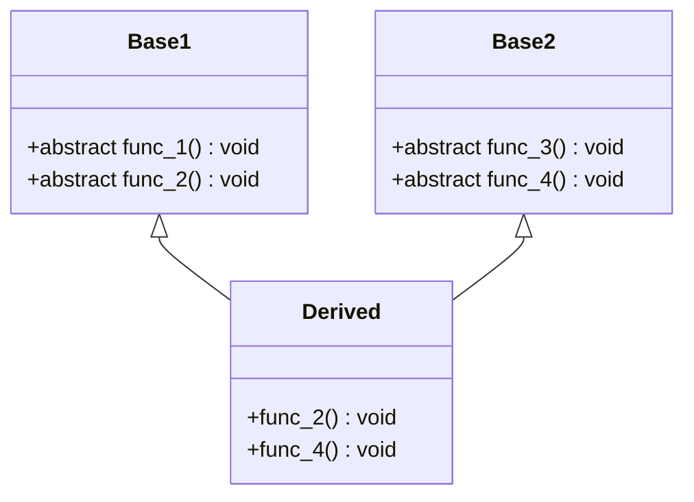
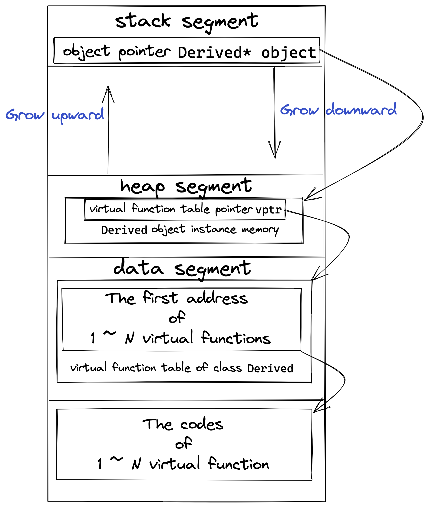
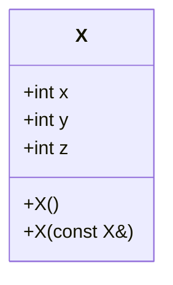

[TOC]

# 1	虚函数表指针位置分析

> 如果一个类中有虚函数，则针对这个类会产生一个虚函数表
>
> **注：基于不同的实验平台，实验的结果可能不同，但是核心思想是相同的**
>
> ```shell
> > g++ -v
> Apple clang version 14.0.0 (clang-1400.0.29.202)
> Target: arm64-apple-darwin22.1.0
> Thread model: posix
> InstalledDir: /Library/Developer/CommandLineTools/usr/bin
> ```

生成虚函数表的时候，该对象中就会有一个虚函数表指针用来指向这个虚函数表的起始地址。这个指针可以看成类中的成员变量，也占一定的字节数（一般是4字节或8字节）。通常会将这个这个指针存放在对象的开头或者末尾。

参考下面的代码：

[***1_where_is_virtual_funcPointer.cpp***](./1_virtualFunctionCodes/1_where_is_virtual_funcPointer.cpp)

```c++
#include <cstdio>
#include <iostream>

using namespace std;

class Normal
{
        long data;
};

class Virtual
{
public:
        long data;
        virtual void func() { cout << "I'm virtual class" << endl; }
};

int main()
{
        printf("size of class Normal: %zu\n", sizeof(Normal));
        printf("size of class Virtual: %zu\n", sizeof(Virtual));
        Virtual v;
        printf("Offset of member data: %zu\n", reinterpret_cast<char*>(&(v.data)) - reinterpret_cast<char*>(&v));
}
```

在上面的代码中，我们使用了一个不包含虚函数的类`Normal`和一个包含虚函数的类`Virtual`。

以下是运行结果：

```
size of class Normal: 8
size of class Virtual: 16
Offset of member data: 8
```

于是我们可以引出关于虚函数指针的第一个性质：

<center><b><i>===== 虚函数指针位于对象内存的开头。 =====</i></b></center>

对于Windows，Linux和Darwin，他们都位于对象内存的开头，对于其他平台，可以使用上面的方法验证。

# 2	继承关系作用下虚函数的手动调用

> 使用虚函数表指针调用虚函数

> 具体代码：[***2_call_parent_virtual_func.cpp***](./1_virtualFunctionCodes/2_call_parent_virtual_func.cpp)

考虑如下两个类：



首先，我们观察两个类的大小：

```c++
printf("size of class Base: %zu\n", sizeof(Base));
printf("size of class Derived: %zu\n", sizeof(Derived));
```

运行结果：

```
size of class Base: 8
size of class Derived: 8
```

******

接下来，我们分析两个类的虚函数表。

我们的思路是，首先获得一个`Base`类对象的虚函数表指针和一个`Derived`类对象的虚函数表的指针，然后打印表中的前三个表项，来观察他们的地址。

说白了，这样我们就可以对比两个虚函数表的表项：

```c++
vptr vptr_base = reinterpret_cast<vptr>(new Base());		// 对象指针
vptr vptr_derived = reinterpret_cast<vptr>(new Derived());		// 对象指针

vptr virtual_table_base = reinterpret_cast<vptr>(*vptr_base);		// 虚函数表指针
vptr virtual_table_derived = reinterpret_cast<vptr>(*vptr_derived);		// 虚函数表指针
```

然后我们去打印前三个指针的指即可：

```c++
The first 3 items in the virtual function table in class Base:
table[0]: 0x100b0af74	// <---------- Base::func_1 函数入口地址
table[1]: 0x100b0afbc	// <---------- Base::func_2 函数入口地址
table[2]: 0x100b0b004	// <---------- Base::func_3 函数入口地址
The first 3 items in the virtual function table in class Derived:
table[0]: 0x100b0af74	
table[1]: 0x100b0b090	// <---------- Derived::func_2 函数入口地址
table[2]: 0x100b0b004
```

可以看到，`Derived`类的`func_1()`和`func_3()`函数的入口地址是一样的。而由于我们在`Derived`类中重写了函数`func_2()`，所以其入口地址不同。

******

接下来，我们尝试去调用这些函数。

我们先对函数进行标记，以方便我们对调用的函数进行分辨：

```c++
#define BASE_CALL	cout << "Base::" << __func__ << endl; 
#define DERI_CALL	cout << "Derived::" << __func__ << endl;

class Base
{
public:
	virtual void func_1() { BASE_CALL; }
	virtual void func_2() { BASE_CALL; }
	virtual void func_3() { BASE_CALL; }
};

class Derived : public Base
{
public:
	void func_2() { DERI_CALL; }
};
```

然后我们可以开始调用：

```c++
cout << "Try to call virtual functions in class Base:" << endl;
for (int i = 0; i < 3; i++)
{
    (reinterpret_cast<void(*)()>(virtual_table_base[i]))();
}

cout << "Try to call virtual functions in class Derived:" << endl;
for (int i = 0; i < 3; i++)
{
    (reinterpret_cast<void(*)()>(virtual_table_derived[i]))();
}
```

运行结果：

```
Try to call virtual functions in class Base:
Base::func_1
Base::func_2
Base::func_3
Try to call virtual functions in class Derived:
Base::func_1
Derived::func_2
Base::func_3
```

# 3	虚函数表分析

> [***3_OO&OB.cpp***](./1_virtualFunctionCodes/3_OO&OB.cpp)

结合前面的运行结果，我们可以有以下分析：

1. 包含虚函数的类才会有虚函数表，同属于一个类的对象共享这个虚函数表，但是每个对象都有自己的虚函数指针，当然该指针所指向的地址（虚函数表的首地址）是相同的

    ```c++
    vptr d1 = reinterpret_cast<vptr>(new Derived());
    vptr d2 = reinterpret_cast<vptr>(new Derived());
    ```

    虽然`d1`和`d2`指向不同的地址（代表不同的对象），但是这两个地址中的前8个字节的内容相同，因为他们指向相同的虚函数表。

    ```c
    The address of virtual function table of derived1: 0x104048100
    The address of virtual function table of derived2: 0x104048100
    ```

2. 父类中有虚函数就等于子类中有虚函数。换句话说，父类中有虚函数表，那么子类中一定会有虚函数表，即使其不重写父类的任何虚函数。

    同样，***即使我们在子类中把父类中的虚函数全部重写，这些函数依然是虚函数***：

    ```c++
    class Derived : public Base
    {
    public:
        void func_1() {}
        void func_2() {}
        void func_3() {}
    };
    ```

    上面三个函数依然是虚函数。

3. 如果子类中完全没有新的虚函数，则可以认为子类的虚函数表和父类的虚函数表内容相同，但**仅仅是内容不同**，这两个表在内存中处于不同位置的。***换句话说，这是内容相同的两张表。***

4. 超出虚函数表部分的内存内容不可知也不可预测。最好的办法就是不要触碰其中的内容。

    我们可以在之前的基础上多打印几项，然后会发现，虚函数之前的地址差距较小，而超出的部分差距极大：

    ```c++
    The first 5 items in the virtual function table in class Base:
    table[0]: 0x1028eaf74
    table[1]: 0x1028eafbc
    table[2]: 0x1028eb004
    table[3]: 0x203235270	// <---------- 超出的部分地址差距极大
    table[4]: 0x80000001028ebead
    The first 5 items in the virtual function table in class Derived:
    table[0]: 0x1028eaf74
    table[1]: 0x1028eb090
    table[2]: 0x1028eb004
    table[3]: 0x2032352d8
    table[4]: 0x80000001028ebeb3
    ```

******

接下来，我们对比一下OO和OB在思想和代码实现上的区别：

+ 首先，我们知道对于C++，我们是通过类对象的指针和引用来支持多态的，这种程序设计风格就是常说的面向对象模型——OOM（Object Oriented Model）
+ 还有一种程序设计风格叫做基于对象（Object-Based），这种风格以前叫做抽象数据模型ADT（Abstract Datatype Model），这种模型不支持多态。因为函数调用的解析没有虚函数指针和虚函数表的概念、不需要运行决定（没有多态或者说没有虚函数），而是编译期间就解析完成，所以在这种模型下的对象运行速度更快，内存空间紧凑程度上更紧凑。但是显然OB的设计灵活性相较OO就要差一些。

那么在具体的实现是怎样实现的？

```c++
Derived derived;
Base base = derived;
Base* ptr_base = &derived;

printf("The address of virtual function table of derived: %p\n", (*((long*)&derived)));
    printf("In OO, the address of virtual function table of base: %p\n", (*((long*)ptr_base)));
    printf("In OB, the address of virtual function table of base: %p\n", (*((long*)&base)));
```

运行结果：

```c++
The address of virtual function table of derived: 0x10275c100
In OO, the address of virtual function table of base: 0x10275c100
In OB, the address of virtual function table of base: 0x10275c150
```


<center><b><i>C++既支持面向对象程序设计，也支持基于对象程序设计，继承机制和多态机制就摆在那里。不用，就是基于对象的程序设计；用了，就是面向对象的程序设计。弹性和效率方面如何使用，取决于程序员。</i></b></center>

# 4	多重继承虚函数表分析

> [***4_multiple_inheritance.cpp***](./1_virtualFunctionCodes/4_multiple_inheritance.cpp)

考虑这样的情况：



我们在每个虚函数中，令他们打印形如`类名::函数名`的信息。

我们首先观察他们的大小：

```
size of class Base1: 8
size of class Base2: 8
size of class Derived: 16
```

可以发现，派生类有两个虚函数表指针，也就是说，派生类`Derived`分别从`Base1`和`Base2`处继承了一张虚函数表。

我们可以进一步进行观察：

1. 打印三个类的虚函数表地址：

    ```c++
    The address of virtual function table of class Base1: 0x102380130
    The address of virtual function table of class Base2: 0x102380160
    The address of virtual function table 1 of class Derived: 0x102380190
    The address of virtual function table 2 of class Derived: 0x1023801b8
    ```

2. 打印三个类的虚函数表中的函数入口地址和调用结果：

    1. `Base1`

        ```
        Print all addresses of virtual functions in class Base1:
        0x10237e6fc
        0x10237e7ac
        Call all functions in class Base1:
        Base1::func_1
        Base1::func_2
        ```

    2. `Base2`

        ```
        Print all addresses of virtual functions in class Base2:
        0x10237ea8c
        0x10237eb3c
        Call all functions in class Base2:
        Base2::func_3
        Base2::func_4
        ```

    3. `Derived`

        我们首先打印两张表中的函数入口地址：

        ```
        Print all addresses of virtual functions in virtual function table 1 of class Derived: 
        0x10237e6fc	// <---------- 与父类Base1相同
        0x10237ec88	// <---------- 与父类Base1不同
        Print all addresses of virtual functions in virtual function table 2 of class Derived: 
        0x10237ea8c	// <---------- 与父类Base2相同
        0x10237ede8	// <---------- 与父类Base2不同
        ```

        可以看到，我们确实有两张表，第一张表来自`Base1`，第二张表来自`Base2`。同时，由于我们在派生类`Derived`中重写了`func_2()`和`func_4()`，这两个函数的入口地址与父类不同（也就是不是同一个函数）；而其他函数因为继承自父类，故而入口函地址相同。

    ******

经过上面的分析，我们可以得到以下结论：

<center><b><i>一个类，如果它继承自多个类，那么有多个虚函数表指针。<br/>在多继承中，对应各个基类的虚函数表指针按照继承顺序依次放置在类内存空间中。</i></b></center>

# 5	辅助工具与`vptr`、`vtbl`的创建时机

## 5.1	使用辅助工具查看虚函数表

+ Windows：

    在Visual Studio中打开开发人员命令行工具，进入到想要查看的虚函数表对应的cpp源代码所在路径，输入：

    ```powershell
    cl /d1 reportSingleClassLayoutDerived MyProject.cpp
    ```

    1. 需要注意的是，命令`cl`的第二个字符是小写L，选项`d1`的第二个字符是数字1。
    2. `reportClassLyaout`后面跟的是要查看的类名，在本例中，查看的是`Derived`
    3. 最后跟的文件名就是要查看的类所在的`.cpp`源文件名

+ Linux：

    在Linux操作系统中，我们可以使用`g++`编译器，使用选项`-fdump-class-hierarchy`选项来导出类的层次结构：

    ```shell
    g++ -fdump-class-hirearchy -fsyntax-only MyProject.cpp
    ```

    此时，系统会生成一个扩展名为`.class`的文件，该文件内就有类的布局信息。这个文件很长，我们只需要看最后的部分就可以了：

    ```
    Vtable for Derived
    Derived::_ZTV7Derived: 9u entries
    0     (int (*)(...))0
    8     (int (*)(...))(& _ZTI7Derived)
    16    (int (*)(...))Base1::func_1
    24    (int (*)(...))Derived::func_2
    32    (int (*)(...))Derived::func_4
    40    (int (*)(...))-8
    48    (int (*)(...))(& _ZTI7Derived)
    56    (int (*)(...))Base2::func_3
    64    (int (*)(...))Derived::_ZThn8_N7Derived6func_4Ev
    
    Class Derived
       size=16 align=8
       base size=16 base align=8
    Derived (0x0x7fa819e5fc40) 0
        vptr=((& Derived::_ZTV7Derived) + 16u)
      Base1 (0x0x7fa819de4420) 0 nearly-empty
          primary-for Derived (0x0x7fa819e5fc40)
      Base2 (0x0x7fa819de4480) 8 nearly-empty
          vptr=((& Derived::_ZTV7Derived) + 56u)
    ```

## 5.2	虚函数表的创建时机

### `vptr`虚函数指针是何时创建的？

对于有虚函数的类，在编译的时候，***编译器会往类的构造函数中安插为`vptr`负值的语句***，这是在编译期间做的。这是编译器默默在背后为程序员做的事情，程序员并不知道。

当程序运行的时候，遇到创建该类对象的语句时，会执行该类的构造函数，因为构造函数中有为`vptr`（要创建的对象所属的`vptr`）赋值的语句，从而让这个对象的`vptr`有有效值。

### `vtbl`虚函数表是何时创建的？

实际上，编译器在**编译期间**（而不是运行期间）就给每个类确定好了对应的虚函数表`vtbl`的内容。

### 进一步讨论

一个C++程序，经过编译、链接的步骤，最终会生成一个可执行文件。可执行程序遵循一定的文件格式，当我们执行这个可执行文件的时候，操作系统会把这个可执行程序根据约定的格式装载到内存中并开始执行。

一般来说，一个可执行程序必然有“代码段”和“数据段”用于存取各种要执行的代码和各种必要的数据。

当这个可执行程序装载到内存后，它的代码段、数据段也一并被装在到了内存中，同时，操作系统还会根据一定的规则为这个可执行程序分配各种内存空间（***此处推荐《程序员的自我修养——链接、装载与库》***），例如堆栈。

如果我们执行这样一段代码：

```cpp
Derived *obj = new Derived();
```

那么，这个处于栈区的指针就会指向堆区申请并构造好的空间；而这个对象中的虚函数表指针指向数据段中的虚函数表；虚函数表中的虚函数首地址指向代码段中的虚函数入口地址。

<center></center>

# 6	单纯的类不纯时引发的虚函数调用问题

> [***6_pure_class.cpp***](./1_virtualFunctionCodes/6_pure_class.cpp)

## 单纯类的演示

考虑这样一个类：



我们在初始化的时候，令三个数据成员的初始值为0，并在构造函数和拷贝构造函数中分别打印信息：

```C++
X() : x(0), y(0), z(0) { cout << "Constructor" << endl;}

X(const X& x) : x(x.x), y(x.y), z(x.z) { cout << "Copy Constructor" << endl; }
```

考虑这样的代码：

```c++
int main()
{
    X x1;
    x1.x = 100; x1.y = 200; x1.y = 300;
    X x2(x1);
    cout << "X1: " << x1;
    cout << "X2: " << x2;
}
```

这是运行结果：

```
Constructor
Copy Constructor
X1: 100,	300,	0
X2: 100,	300,	0
```

但这样有些复杂，我们可以使用效率更高的写法来编写两个构造函数：

```c++
X()
{
    memset(this, 0, sizeof(X));
    cout << "Constructor" << endl;
}

X(const X& x)
{
    memcpy(this, &x, sizeof(X));
    cout << "Copy Constructor" << endl;
}
```

如果这个类像现在这么单纯，那么，上述这样使用`memset`/`memcpy`函数，并且将`this`作为第一参数的写法并没有什么问题。

但是，假如这个类不那么单纯，那么上面的写法就是错的，会导致程序的崩溃。

不单纯的类指的是，在某些情况下，编译器会往类中添加一些程序员看不见但真实存在的成员变量（隐藏成员变量），有了这种成员变量，类就不单纯了。

## 不单纯类

隐藏的成员变量都是在构造函数和拷贝构造函数的函数体之间进行的。于是，假如我们使用上面的方法：

1. 在构造时，编译器给一些隐藏的成员变量赋值。但是在构造函数的函数体中，我们使用`memset`将这些赋值清零了
2. 在拷贝构造时，往往对象与对象之间（复制的源对象和目标对象之间）的成员变量可能并不相同。但是在执行拷贝构造函数的时候，我们使用`memcpy`，就会导致成员变量值覆盖了目标对象中隐藏的成员变量值。

接下来我们做一个测试：

我们在`X`类中添加一个**虚析构函数**，一个**虚函数**，一个普通函数，然后在我们的`main`函数中增加一行代码，用以调用新增的虚函数：

```c++
virtual ~X()
{
    cout << "Destructor" << endl;
}

virtual void vir_func()
{
    cout << "virtual function" << endl;
}

void normal_func()
{
    cout << "Normal function" << endl;
}
```

以下是运行结果：

```
Constructor
Copy Constructor
X1: 100,	300,	0
X2: 100,	300,	0
virtual function
Destructor
Destructor
```

看上去合情合理：第五行打印了虚函数的调用输出，6/7行打印了`x1`/`x2`的析构函数的调用输出。

<center><b><i>但是，这才是最不合理的地方。</i></b></center>

我们分明在构造和拷贝构造中使用了`memset`和`memcpy`！虚函数表指针是空的！我们不可能可以调用！

为了验证我们的想法，我们在下面增加一些测试代码：

```c++
X* ptr_x = new X();
ptr_x->normal_func();
ptr_x->vir_func();
delete ptr_x;
```

以下是运行结果：

```
Constructor
Normal function

Process finished with exit code 139 (interrupted by signal 11: SIGSEGV)
```

程序终于按照我们的希望崩溃了。

于是，我们发现，***生成一个`X`的局部变量（对象在栈中），不影响通过改对象调用虚函数，也不影响对象的正常析构；但是如果使用`new`在堆中生成一个类`X`的对象实例并用对象指针指向该对象实例，再用这个对象指针调用虚函数，或者`delete`这个指针，程序的执行就会变得不正常。***

至于为什么会是这样的结果，涉及到两个概念：***静态联编(static binding)***和***动态联编(dynamic binding)***。

1. 静态联编：编译的时候就能确定调用的是哪个函数，把调用语句和被调用函数绑定到一起。站在汇编的角度来看，使用的是`call func`
2. 动态联编：编译的时候无法确定调用的是哪个函数，在程序运行的时候，根据实际情况，动态地把调用语句和被调用函数绑定到一起。站在汇编的角度来看，使用的是`call <register>`

于是，我们就可以解释为什么上面使用局部变量调用的时候可以访问到函数，而在使用指针的时候就无法访问了：局部变量调用自己的虚函数，其实和调用自己的普通函数没有任何区别，不需要用到虚函数表，因为不涉及多态；指针调用虚函数，就需要使用虚函数表来进行调用，因此调用就会出错。

我们对上面的代码进行反汇编：

```assembly
Dump of assembler code for function main():
   0x0000000000400b2d <+0>:	         push   rbp
   0x0000000000400b2e <+1>:	         mov    rbp,rsp
   0x0000000000400b31 <+4>:	         push   r12
   0x0000000000400b33 <+6>:	         push   rbx
   0x0000000000400b34 <+7>:	         sub    rsp,0x40
   0x0000000000400b38 <+11>:	lea    rax,[rbp-0x30]
   0x0000000000400b3c <+15>:	mov    rdi,rax
   0x0000000000400b3f <+18>:	call   0x400ce0 <X::X()>
   0x0000000000400b44 <+23>:	mov    DWORD PTR [rbp-0x28],0x64
   0x0000000000400b4b <+30>:	mov    DWORD PTR [rbp-0x24],0xc8
   0x0000000000400b52 <+37>:	mov    DWORD PTR [rbp-0x24],0x12c
   0x0000000000400b59 <+44>:	lea    rdx,[rbp-0x30]
   0x0000000000400b5d <+48>:	lea    rax,[rbp-0x50]
   0x0000000000400b61 <+52>:	mov    rsi,rdx
   0x0000000000400b64 <+55>:	mov    rdi,rax
   0x0000000000400b67 <+58>:	call   0x400d2c <X::X(X const&)>
   0x0000000000400b6c <+63>:	mov    esi,0x400f3c
   0x0000000000400b71 <+68>:	mov    edi,0x602100
   0x0000000000400b76 <+73>:	call   0x400950 <_ZStlsISt11char_traitsIcEERSt13basic_ostreamIcT_ES5_PKc@plt>
   0x0000000000400b7b <+78>:	lea    rdx,[rbp-0x30]
   0x0000000000400b7f <+82>:	mov    rsi,rdx
   0x0000000000400b82 <+85>:	mov    rdi,rax
   0x0000000000400b85 <+88>:	call   0x400aad <operator<<(std::ostream&, X const&)>
   0x0000000000400b8a <+93>:	mov    esi,0x400f41
   0x0000000000400b8f <+98>:	mov    edi,0x602100
   0x0000000000400b94 <+103>:	call   0x400950 <_ZStlsISt11char_traitsIcEERSt13basic_ostreamIcT_ES5_PKc@plt>
   0x0000000000400b99 <+108>:	lea    rdx,[rbp-0x50]
   0x0000000000400b9d <+112>:	mov    rsi,rdx
   0x0000000000400ba0 <+115>:	mov    rdi,rax
   0x0000000000400ba3 <+118>:	call   0x400aad <operator<<(std::ostream&, X const&)>
   0x0000000000400ba8 <+123>:	lea    rax,[rbp-0x30]
   0x0000000000400bac <+127>:	mov    rdi,rax
   0x0000000000400baf <+130>:	call   0x400dee <X::vir_func()>
   0x0000000000400bb4 <+135>:	mov    esi,0x400f46
   0x0000000000400bb9 <+140>:	mov    edi,0x602100
   0x0000000000400bbe <+145>:	call   0x400950 <_ZStlsISt11char_traitsIcEERSt13basic_ostreamIcT_ES5_PKc@plt>
   0x0000000000400bc3 <+150>:	mov    esi,0x400970
   0x0000000000400bc8 <+155>:	mov    rdi,rax
   0x0000000000400bcb <+158>:	call   0x400960 <_ZNSolsEPFRSoS_E@plt>
   0x0000000000400bd0 <+163>:	mov    edi,0x18
   0x0000000000400bd5 <+168>:	call   0x400990 <_Znwm@plt>
   0x0000000000400bda <+173>:	mov    rbx,rax
   0x0000000000400bdd <+176>:	mov    rdi,rbx
   0x0000000000400be0 <+179>:	call   0x400ce0 <X::X()>
   0x0000000000400be5 <+184>:	mov    QWORD PTR [rbp-0x18],rbx
   0x0000000000400be9 <+188>:	mov    rax,QWORD PTR [rbp-0x18]
   0x0000000000400bed <+192>:	mov    rdi,rax
   0x0000000000400bf0 <+195>:	call   0x400e18 <X::normal_func()>
   0x0000000000400bf5 <+200>:	mov    rax,QWORD PTR [rbp-0x18]
   0x0000000000400bf9 <+204>:	mov    rax,QWORD PTR [rax]
   0x0000000000400bfc <+207>:	add    rax,0x10
   0x0000000000400c00 <+211>:	mov    rax,QWORD PTR [rax]
   0x0000000000400c03 <+214>:	mov    rdx,QWORD PTR [rbp-0x18]
   0x0000000000400c07 <+218>:	mov    rdi,rdx
   0x0000000000400c0a <+221>:	call   rax
   0x0000000000400c0c <+223>:	cmp    QWORD PTR [rbp-0x18],0x0
   0x0000000000400c11 <+228>:	je     0x400c2a <main()+253>
   0x0000000000400c13 <+230>:	mov    rax,QWORD PTR [rbp-0x18]
   0x0000000000400c17 <+234>:	mov    rax,QWORD PTR [rax]
   0x0000000000400c1a <+237>:	add    rax,0x8
   0x0000000000400c1e <+241>:	mov    rax,QWORD PTR [rax]
   0x0000000000400c21 <+244>:	mov    rdx,QWORD PTR [rbp-0x18]
   0x0000000000400c25 <+248>:	mov    rdi,rdx
   0x0000000000400c28 <+251>:	call   rax
   0x0000000000400c2a <+253>:	lea    rax,[rbp-0x50]
   0x0000000000400c2e <+257>:	mov    rdi,rax
   0x0000000000400c31 <+260>:	call   0x400d7e <X::~X()>
   0x0000000000400c36 <+265>:	lea    rax,[rbp-0x30]
   0x0000000000400c3a <+269>:	mov    rdi,rax
   0x0000000000400c3d <+272>:	call   0x400d7e <X::~X()>
   0x0000000000400c42 <+277>:	mov    eax,0x0
   0x0000000000400c47 <+282>:	jmp    0x400c84 <main()+343>
   0x0000000000400c49 <+284>:	mov    r12,rax
   0x0000000000400c4c <+287>:	mov    rdi,rbx
   0x0000000000400c4f <+290>:	call   0x400900 <_ZdlPv@plt>
   0x0000000000400c54 <+295>:	mov    rbx,r12
   0x0000000000400c57 <+298>:	jmp    0x400c5c <main()+303>
   0x0000000000400c59 <+300>:	mov    rbx,rax
   0x0000000000400c5c <+303>:	lea    rax,[rbp-0x50]
   0x0000000000400c60 <+307>:	mov    rdi,rax
   0x0000000000400c63 <+310>:	call   0x400d7e <X::~X()>
   0x0000000000400c68 <+315>:	jmp    0x400c6d <main()+320>
   0x0000000000400c6a <+317>:	mov    rbx,rax
   0x0000000000400c6d <+320>:	lea    rax,[rbp-0x30]
   0x0000000000400c71 <+324>:	mov    rdi,rax
   0x0000000000400c74 <+327>:	call   0x400d7e <X::~X()>
   0x0000000000400c79 <+332>:	mov    rax,rbx
   0x0000000000400c7c <+335>:	mov    rdi,rax
   0x0000000000400c7f <+338>:	call   0x4009a0 <_Unwind_Resume@plt>
   0x0000000000400c84 <+343>:	add    rsp,0x40
   0x0000000000400c88 <+347>:	pop    rbx
   0x0000000000400c89 <+348>:	pop    r12
   0x0000000000400c8b <+350>:	pop    rbp
   0x0000000000400c8c <+351>:	ret
```

注意观察第34行，此处我们使用局部变量直接调用虚函数`vir_func`，可以看到`call`后面跟的是一个具体的地址；但在56,65行，我们分别使用对象指针调用了`vir_func`和析构函数，可以看到`call`调用的是推算出的一个地址，我们可以猜测使用的是虚函数表中的函数指针。

