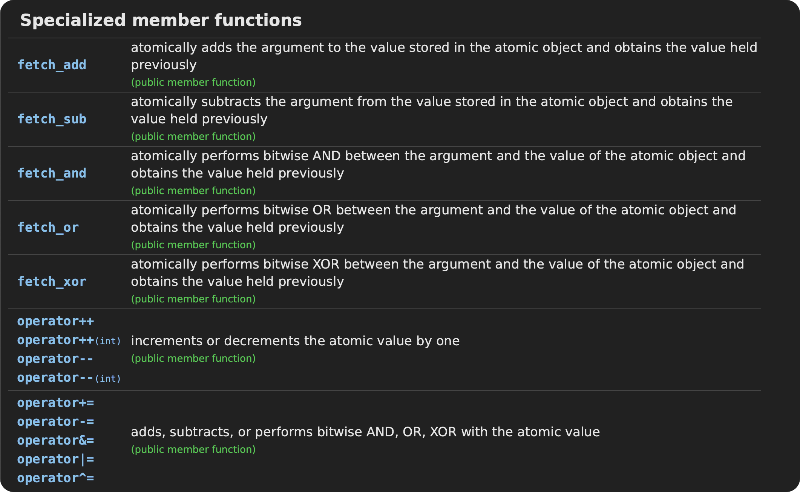

[TOC]

# 基本概念和实现

## 并发、进程和线程的基本概念和综述

1. 并发

	并发表示两个或者更多任务（独立的活动）同时发生（进行）。回到计算机领域，所谓并发，就是一个程序同时执行多个独立的任务。

	以往计算机只有单核CPU的时候，它实现多任务的方式就是由操作系统调度，每秒钟进行多次所谓的“任务切换”。因为任务的切换速度很快，所以在人类的感觉中，好像是多个任务在同时进行中（并行执行），其实这种并发是一种假象（并不是真正的并发）。当然，这种任务之间的切换（也称作上下文切换）也有一定的时间开销，例如操作系统要保存任务切换时的各种状态、执行进度等信息，因为一会儿操作系统切换回来的时候还要复原这些信息。

	随着计算机硬件的发展，多核计算机的出现真正实现并行执行多个任务（这叫做硬件并发），因为有多个CPU，就可以做多件事情。当然，如果并发的任务数量超过了CPU的数量，那么任务切换依然存在。

	可以看到，使用并发的原因主要就是能够让多件事情同时做，从而提高整体做事情的效率，也就是提高整体的运行性能。

2. 进程：运行起来了的可执行程序
3. 线程
	
	+ 每个进程都有一个主线程，这个主线程是唯一的，也就是说一个进程中只能有一个主线程
	+ 当一个可执行程序，产生了一个进程之后，这个主线程就随着这个进程默默启动
	
	除了主线程之外，可以通过编写代码来创建其他线程，其他线程可以执行别的指令。

	当然，线程并不是越多越好，每个线程都需要独立的堆栈空间（耗费内存），而且线程之间的切换也需要保存很多中间状态，这也涉及上面提到过的上下文切换。所以，如果线程太多，上下文切换就会很频繁，而上下文切换是一种必须但是没有意义的额外工作，会耗费原本属于程序运行的时间。

	对线程进行总结：

	+ 线程是用来执行代码的
	+ 把线程理解为一条代码的执行通路，一个新线程代表一条新的道路
	+ 一个进程自动包含一个主线程，主线程随着进程默默启动并运行，并可以包含多个其他线程，但创建线程的数量最大一般都不建议超过200~300个，到底多少个合适，在实际项目中要不断调整和优化，有时线程多了效率还会降低

## 并发的实现方法

+ 通过多个进程来实现并发，每个进程做一件事。这里所说的进程，指的就是只包含一个主线程的进程，这种手段并不需要在程序代码中书写任何与线程有关的代码
+ 在单独的一个进程中创建多个线程来实现并发，这种情况下就得书写代码来创建除主线程以外的其他线程了

1. 多进程并发

	进程之间通信的手段比较多，如果是同一台计算机上的进程通信，可以使用管道、文件、消息队列、共享内存等技术实现，而在不同计算机之间的进程通信可以使用socket（网络套接字）等网络通信技术来实现。由于进程之间数据保护的问题，即便是在同一台电脑上，进程之间的通信也是比较复杂的。

2. 多线程并发

	多线程就是在单个的进程中创建多个线程。所以，线程有点类似于轻量级的进程。每个线程都是独立运行的，但是一个进程中的所有线程共享地址空间（共享内存），还有诸如全局变量、指针、引用等，都是可以在线程之间传递的，所以可以得出一个结论：使用多线程的开销远远小于多进程。

	当然，多线程使用共享内存虽然灵活，但是也带来了新的问题——数据一致性问题。

	虽然多进程并发和多线程并发可以同时使用，但是一般来讲，建议优先考虑使用多线程的技术手段来实现并发而不是多进程。

3. 总结

	和多进程相比，多线程并发的缺点如下：

	+ 优点：线程启动速度更快，更轻量级；系统资源开销更小；执行速度更快
	+ 缺点：使用起来有一定难度，要处理数据一致性问题

## C++11 新标准线程库

以往要写多线程程序，每个不同的操作系统平台都有不同的线程创建方法。例如Windows的`CreateThread`方法，还有一堆和线程相关的其他函数和概念，例如临界区、互斥量等。Linux操作系统也一样，例如使用`pthread_create`函数创建线程。

可以看到，这些代码都不一样，不能实现跨平台操作。当然，也可以使用跨平台的多线程库例如POSIX thread（pthread）。但是，为了支持pthread，要在不同的操作系统下进行一番配置，配置的方法也有不同，所以pthread的使用也并不是十分方便。

自从C++11开始，C++语言本身增加了针对多线程的支持。这意味着可以使用C++语言本身提供的编程接口来编写和具体的操作系统无关的多线程程序，极大地增加了程序的可移植性。在实际的开发中，如果要求必须实现跨平台开发时，这会大量地减少开发人员的工作量，非常方便。

# 线程启动、结束与创建线程的写法

## 范例演示线程运行的开始和结束

> `#include <thread>`

### 线程的创建

对于C++来说，线程就是一个对象，所以在创建的时候，只需要像正常的对象来进行使用就可以了。但是需要注意的是，在Linux中，创建函数的时候，需要传入的参数有：

+ 保存线程的结构体指针
+ 线程的属性
+ 线程的启动函数指针（函数的类型必须为`void* (*)(void*)`）
+ 启动函数的参数（`void *arg`）

在C++11中，创建的方法进行了极大的简化：

```c++
template< class Function, class... Args > 
explicit thread( Function&& f, Args&&... args );
```

对于一个简单的、没有任何参数的线程来说，创建一个线程十分简单：

```c++
extern void my_print() {  }

thread child_thread(my_print);
```

### 线程的销毁

线程的销毁方式有两种：

1. `join()`：阻塞，必须等到子线程结束
2. `detach()`：非阻塞，不许要等到子线程结束，调用线程即可结束。调用`detach`的线程会驻留在后台运行，被C++运行时库所接管。当这个线程执行完、或者是进程退出的时候，由运行时库进行清理。这种分离的线程在Linux中称为“守护线程”。

需要注意的是，一旦调用过`detach()`，不可再调用`join()`，否则会造成程序运行异常。

而一个线程，我们如何知道已经被调用过`join()`或者`detach()`？解决方法是使用`joinable()`：

```c++
if (child_thread.joinable())
	child_thread.join();
```

## 其他创建线程的方法

### 用类来创建线程

只要我们提供的类重载了`operator()`函数，那么也就可以被传递给`thread`：[1_create_thread_with_class.cpp](./测试代码/17_并发与多线程/1_create_thread_with_class.cpp)

这份代码一切正常。但是需要注意的是，类和`detach`混合使用会有意外的问题[2_create_thread_and_detach.cpp](./测试代码/17_并发与多线程/2_create_thread_and_detach.cpp)：

```
value of m_i: 6
Address of m_i: 0x30d475b8c
====================================
value of m_i: 6
Address of m_i: 0x30d475b8c
====================================
foo is end								<-------------- foo结束
value of m_i: 3							<-------------- m_i值改变
Address of m_i: 0x30d475b8c
====================================
value of m_i: 3
Address of m_i: 0x30d475b8c
====================================
...
```
所以，当主调线程结束，而子线程还在后台继续运行的时候，很可能会产生意料之外的后果。当然，产生这样的结果的很大的原因都在于类的设计中采用了引用。所以，在设计类的时候，需要尽可能的小心。

***如果真的需要使用`detach`的方式来管理线程，不要往线程中传递引用、指针之类的参数***

### 用lambda表达式来创建线程

## 线程传参详解、`detach`坑与成员函数作为线程函数

考虑这样的代码：

```c++
void myPrint(const int& i, char& pMyBuf)
{
	cout << i << endl;
	cout << pMyBuf << endl;
	return;
}

int main()
{
	int mvar = 1;
	int& mvary = mvar;
	char mybuf[] = "this is a test!";
	std::thread my_thread(myPrint, mvar, mybuf);
	my_thread.join();

	cout << "Main is end" << endl;
}
```

### 要避免的陷阱——一

如果我们将`main`函数中的`join`换成`detach`，程序就可能会出问题了。原因在于，当主线程退出的时候，`pMyBuf`指向的内存被释放。

前面提到，如果一个线程使用`detach`来释放，那么不要向其中传递指针和引用。但是有的时候如果我们一定需要，应该怎么办？解决方法是使用`const &`。原因是C++会为常量引用创建临时对象。

所以我们可以修改`myPrint`的函数签名为：

```c++
void myPrint(int i, const string& pMyBuf);
```

### 要避免的陷阱——二

仅仅在被创建的线程的开始函数中这样操作，并不能完全解决问题。假如我们在主线程结束后，再调用`std::thread my_thread(myPrint, mvar, mybuf);`，这依然是有问题的。理由依然是调用了已经被释放的内存。

因此，正确的做法应当是，同样修改调用语句为：

```c++
std::thread my_thread(myPrint, mvar, string(mybuf));
```

需要注意的是，此处之所以有问题是因为，可能在内存失效之后依然调用内存，并不是因为`mybuf`是一个字符数组。即使我们换成`string`，这样的问题也是依然存在的。

当我们在传递参数的时候使用一次拷贝函数，构造一个临时对象，将这个临时对象传递线程入口函数就安全。虽然这个方法看上去有些笨，但是确实是一个好方法。

### 总结

+ 如果传递int这种简单的参数，建议直接使用值传递，避免节外生枝
+ 如果传递类对象作为参数，则需要避免隐式转换（例如传入`char*`，而函数内部使用的是`string`，如果搭配`detach`，很有可能在主线程结束之前，构造函数还没有调用结束）。最好的办法是创建线程的时候直接构建出临时对象，然后线程入口函数的形参位置使用引用来作为形参。
+ 建议不使用`detach`，只使用`join`，这样就不存在局部变量失效导致线程对内存非法引用

## 临时对象作为线程参数续讲

> 为什么手工构建临时对象是安全的，而让系统使用类型转换构造函数构造对象就不安全？

### 线程id

线程id用来唯一标识一个线程。对于C++标准库来说，可以使用`std::this_thread::get_id`来获取。

### 临时对象构造时机抓捕

我们现在编写一个测试代码，测试假如我们不使用临时对象的方法，子线程中隐式转换的对象，到底在哪个线程中被构建[3_where_does_temp_object_create.cpp](./测试代码/17_并发与多线程/3_where_does_temp_object_create.cpp)

下面是测试结果：

```
Main thread id: 0x1e23ae500
Test::Test(), thread id: 0x16da47000
myPrint: &test: 0x16da46f3c, thread id: 0x16da47000
Test::~Test(), thread id: 0x16da47000
Main is finished
```

可以看到，隐式转换的对象是在子线程中完成创建的。也就是说，如果我们将代码中的`join`变为`detach`，很有可能在子线程中调用构造函数的时候，内存已经被释放，造成程序崩溃。

而我们如果在代码中使用临时对象，再运行一次：

```
Main thread id: 0x202c662c0
Test::Test(), thread id: 0x202c662c0
Test::Test(const Test&), thread ID: 0x202c662c0
Test::Test(const Test&), thread ID: 0x202c662c0
Test::~Test(), thread id: 0x202c662c0
Test::~Test(), thread id: 0x202c662c0
myPrint: &test: 0x7fce6d705a10, thread id: 0x30989b000
Test::~Test(), thread id: 0x30989b000
Main is finished
```

可以发现，线程入口函数中需要的形参在主线程中就已经构造完毕。这说明即使主线程退出了，也没有问题，这个入口函数的形参已经被构造完毕，不会出现对非法内存进行存取的情况。

同时，如果线程入口函数参数的`&`被去掉，也会造成一样的问题，即在子线程中调用构造/拷贝构造函数，依然是不安全的。

因此，***一言蔽之，如果线程入口函数接受一个对象作为参数，创建线程时应当创建临时对象，同时入口函数的接口应当设计为引用。***

## 传递类对象与智能指针作为线程参数

现在，让我们来观察一下线程入口函数的函数签名：

```c++
vood thread_func(const Test& test);
```

在这，我们的主要注意力需要放在`const`上。我们为什么需要`const`？原因很简单，因为***C++只会为`const&`产生临时对象***。这个`const`支持了我们在外面以临时对象的方式构造一个对象。

但是，如果我们又需要对`test`进行修改，怎么办？这个时候，我们就可以对数据成员增加关键字`mutable`：

```c++
struct Test
{
  	mutable int val;  
};
```

但是这个方法并不解决问题：

1. 我们难道要为每一个成员都增加`mutable`关键字？
2. 我们在子线程修改的对象，不影响主进程。那如果我们希望影响呢？

解决方法是`std::ref`。使用`ref`的考虑是，我们真的有需求明确告诉编译器要传递一个能够影响原始参数（实参）的引用过去，就可以使用这个函数。

在这样的设计下，我们在传递参数的时候，只需要这样写：

```c++
thread my_thread(myPrint, std::ref(test));
```

这样，我们函数的签名的`const`就可以去掉，类数据成员中`mutable`也就可以去掉。

再考虑一个问题，如果我们将智能指针作为形参传递到线程入口函数，该怎样编写代码呢？对于指针本身的处理是非常简单的，对于`shared_ptr`就正常使用，对于`unique_ptr`就使用`move`来进行传递。最大的问题在于：

```c++
void test(unique_ptr<int> ptr)
{
    // 假设存在一些代码，使该线程的结束晚于主线程
    return;
}

int main()
{
    unique_ptr<int> ptr(new int(100));
    thread my_thread(test, move(ptr));
    
    my_thread.detach();		// 注意，此处使用的是detach
    
    return 0;
}
```

会发生内存泄漏吗？结果是会的。当主线程结束之后，虽然子线程中的形参指向这块内存，但这块内存依然会泄露，被操作系统回收。原因是主线程执行完毕了。这自然是非常严重的问题。但是，如果子线程能够在主线程结束前结束，那么就可以避免这个情况。

## 用成员函数作为线程入口函数

> [RTFSC](./测试代码/17_并发与多线程/4_create_thread_with_member_function.cpp)

如果我们在传递参数的时候，使用的是：

```c++
thread my_thread(&Test::_thread, test);
```

那么就会**在主线程中**调用拷贝构造函数，也就是说，会拷贝一个`Test`对象，将这个新拷贝的对象的地址作为`this`传递给`Test::_thread`。如果我们不使用地址，也不想调用拷贝函数，我们可以使用`ref`，也是可以的。

不推荐使用`detach`，理由依然是防止对非法内存的存取。

# 创建多个线程、数据共享问题分析与案例代码

## 创建和等待多个线程

> [5_create_many_threads.cpp](./测试代码/17_并发与多线程/5_create_many_threads.cpp)

运行结果：

```
Thread id: Thread id: 0x3056f20000x30566f000    index:  index: 1Thread id: 0
0x305775000
Thread id: Thread id: 0x30587b000       index: 4
0x3058fe000     index: Thread id: 5
Thread id: 0x3057f8000  index: 3
Thread id: 0x305a04000  index: 0x305981000      index: 6
Thread id: 0x305a87000  index: 8
2
        index: 7
Thread id: 0x305b0a000  index: 9
Main thread finished
```

+ 多个线程之间的执行顺序是混乱的。先创建的线程不见得比后创建的线程执行得快，这个与操作系统内部对线程的运行调度机制有关
+ 主线程需要等待所有子线程结束再结束，这样让程序更为稳定、健壮
+ 把线程封装到容器来维护，是非常方便的

## 数据共享问题分析

### 只读的数据

对于一段共享数据，如果只是只读的，每个线程都去读，那无所谓，读到的内容肯定是一样的

### 有读有写

略

# 互斥量的概念、用法术、死锁演示与解决详解

## 互斥量的基本概念

略

## 互斥量的用法

> `#include <mutex>`

### `lock`与`unlock`

使用规则：成对使用，任何的不平衡都会导致代码不稳定甚至崩溃

+ 锁定的代码段越少，执行的效率越高。因为锁住的代码少，执行的快，其他等待锁的线程等待的时间就短。

+ 在代码中，加锁与去锁的操作代码量可能是不对称的（比如一个`lock`对应多个`unlock`），但是最后在运行的时候一定是对称的

    ```c++
    void foo(int val)
    {
        my_mutex.lock();
        if (val < 0)
        {
            my_mutex.unlock();
            return;
        }
        // ....
        my_mutex.unlock();
        return;
    }
    ```

[测试代码](./测试代码/17_并发与多线程/6_lock&unlock.cpp)

### `std::lock_guard`类模板

> `std::lock_guard<std::mutex> guard(my_mutex);`

`std::lock_guard<std::mutex>`类模板可以直接用来取代`lock`和`unlock`，其工作原理很简单：在构造函数中，调用了`mutex`的`lock`成员函数，在析构函数中调用`unlock`函数。

虽然用起来是很方便，但是问题也很明显：`unlock`的调用不是非常方便。要解决这个问题，可以人为地创建块，就可以在一定程度上解决这个问题。

## 死锁

### 死锁的一般解决方案

一个是在设计的时候，采用一定的上锁顺序，从而避免死锁。一个是使用标准库函数`std::lock`，一次上锁多个互斥量。

可以想象一下`lock`的工作步骤：先锁住第一个互斥量，然后去锁第二个，如果失败，那么就把之前锁住的都解开。

```c++
mutex mutex1, mutex2;

std::lock(mutex1, mutex2);
```

`std::lock`这种一次锁住多个互斥量的函数模板，要谨慎使用（建议一个一个锁）。因为一般来讲，用到两个或两个以上互斥量的线程，每个互斥量都应该维护不同的代码段，也就是说，两个互斥量的`lock`应当是有所先后的，两个互斥量在同时锁住的情况并不多见。

### `std::lock_guard`之`std::adopt_lock`参数

这个参数用来告知`lock_guard`，上锁操作已经由程序员自行完成，只需要负责解锁即可。

# `unique_lock`详解

`unique_lock`是一个类模板，其功能与`lock_guard`相类似，但是比`lock_guard`更为灵活。当然，就像虚函数一样，在C++中，灵活的代价是执行速度和内存。

首先我们给出`lock_guard`版本的代码：

```c++
#include <iostream>
#include <thread>
#include <mutex>
#include <list>

using namespace std;

class A
{
public:
	void inMsgRecvQueue()
	{
		for (int i = 0; i < 100000; i++)
		{
			cout << __func__ << " execute, append element " << i << endl;

			lock_guard<mutex> guard1(my_mutex);
			msgRecvQueue.push_back(i);

			// ...
		}
		return;
	}

	bool outMsgLULProc(int& command)
	{
		lock_guard<mutex> guard1(my_mutex);

		if (!msgRecvQueue.empty())
		{
			command = msgRecvQueue.front();
			msgRecvQueue.pop_front();
			return true;
		}
		return false;
	}

	void outMsgRecvQueue()
	{
		int command = 0;
		for (int i = 0; i < 100000; i++)
		{
			bool result = outMsgLULProc(command);
			if (result)
			{
				cout << __func__ << " execute, get element of value " << command << endl;
				// ...
			}
			else
			{
				cout << __func__ << " execute, queue empty" << endl;
			}
		}
	}
private:
	list<int> msgRecvQueue;
	mutex my_mutex;
};

int main()
{
	A a;
	thread out_msg(&A::outMsgRecvQueue, ref(a));
	thread in_msg(&A::inMsgRecvQueue, ref(a));

	out_msg.join();
	in_msg.join();

	cout << "Main exit" << endl;
}
```

运行结果看起来大概是这样的：

```
outMsgRecvQueue execute, queue empty
outMsgRecvQueue execute, queue empty
outMsgRecvQueueinMsgRecvQueue execute, append element 0
inMsgRecvQueue execute, append element 1
inMsgRecvQueue execute, append element 2
inMsgRecvQueue execute, append element 3
inMsgRecvQueue execute, append element 4
...
inMsgRecvQueue execute, append element 99997
inMsgRecvQueue execute, append element 99998
inMsgRecvQueue execute, append element 99999
Main exit
```

## 使用`unique_lock`取代`lock_guard`

首先需要说明的一点是：`unique_lock`完全可以取代`lock_guard`，只需要将代码中`lock_guard`的部分替换为`unique_lock`即可。

## `unique_lock`的第二个参数

1. `std::adopt_lock`在此处依然适用——只需解锁而无须上锁。

2. `std::try_to_lock`这个第二参数的含义是，系统会尝试使用`mutex::lock()`来锁定互斥量，但是如果一直拿不到互斥量，那就让出程序去干点别的。

    ```c++
    std::unique_lock<std::mutex> guard(my_mutex, std::try_to_lock);
    
    // 如果拿到了互斥量
    if (guard.owns_lock())
    {
        // ...
    }
    // 如果没有
    else
    {
        // ...
    }
    ```

3. `std::defer_lock`的含义是初始化互斥量，但是并不加锁。

## `unique_lock`的成员函数

### `lock`

给互斥量加锁，如果无法加锁，就会阻塞

### `unlock`

给互斥量解锁。这两个函数就体现出了`unique_lock`的灵活之处，可以自行加锁、解锁

### `try_lock`

尝试给互斥量加锁，如果成功返回`true`，否则返回`false`。此函数不阻塞

### `release`

返回所管理的`mutex`对象指针，**释放所有权。**一旦释放了所有权，那么如果原来互斥量处于互斥状态，程序员有责任手动解锁。

### 总结

> [试着使用上面的函数敲敲代码](./测试代码/17_并发与多线程/7_unique_lock.cpp)
>
> 运行结果：
>
> ```
> inMsgRecvQueue execute, append element outMsgLULProc get mutex failed, NOP0
> outMsgRecvQueue execute, queue empty
> outMsgLULProc get mutex failed, NOP
> outMsgRecvQueue execute, queue empty
> ...
> ```

这些成员函数其实并不复杂。需要上锁时`lock`，需要解锁时`unlock`，就是这么简单。如果对象生命周期结束的时候拥有互斥量，就会释放；如果不拥有互斥量，那么就什么都不做。

那么，我们为什么需要`lock`->`unlock`->`lock`呢？这涉及到一个原则：***锁住的内容越少，执行的速度越快。***尽早把锁解开，其他线程的阻塞时间就越短。所以也有人把**用锁锁住的代码的多少称为锁的粒度。**锁住的代码少，粒度就细，执行效率也就高。

## `unique_lock`所有权的传递

`unique_lock`很像`unique_ptr`，其管理的内容，可以转移，但是不可以复制。

在转移所有权的时候，可以使用`std::move`，当然也可以使用函数返回值直接返回。作为函数返回值再赋值的时候，就会调用其移动构造函数。

# 单例设计模式共享数据分析、解决与`call_once`

> [8_singleton_pattern.cpp](./测试代码/17_并发与多线程/8_singleton_pattern.cpp)

## 单例设计模式共享数据问题分析、解决

为了解决多个线程同时调用构造函数的情况，以下是`getInstance`的第一个改版：

```c++
static GameConfig* getInstance()
{
    static mutex resource_mutex;
    unique_lock<mutex> lock(resource_mutex);	
    if (!m_instance)
    {
        m_instance = new GameConfig();
    }
    return m_instance;
}
```

这样问题解决了吗？看上去是的，因为我们避免了两个线程同时进入`if`，执行构造函数的问题。但是我们解决的并不够好。因为这会导致，即使`m_instance`不为`nullptr`，在同一时间，我们的多个线程只有一个能获得`m_instance`指针，即使这个线程不对`m_instance`做任何的修改（在这个函数中）。

这是效率很低的一件事。由此引出进一步的优化：

```c++
static GameConfig* getInstance()
{
    static mutex resource_mutex;
    // 如果m_instance已经指向一个实例，那么就直接到return的部分，不需要被阻塞
    if (!m_instance)
    {
        // 上锁，确保只有一个线程去执行构造函数
        unique_lock<mutex> lock(resource_mutex);	
    	if (!m_instance)
    	{
        	m_instance = new GameConfig();
    	}
    }
    
    return m_instance;
}
```

## `std::call_once`

> `-std=c++11`
>
> ```c++
> template< class Callable, class... Args >
> void call_once( std::once_flag& flag, Callable&& f, Args&&... args );
> ```

这个函数用来保证，在多个线程下，只有一个线程调用函数。从这个角度讲，`call_once`也是具备互斥量的能力的，而且效率上据说比互斥量消耗的资源更少。

要使用这个函数，首先需要引入`std::once_flag`，这是一个数据结构，就像平时使用的标志位一样，这个标志位用来决定被调函数`f`是否执行。在我们调用`call_once`之后，这个标志位就会被反转，这样再次调用`call_once`的时候，被调函数就不会被执行。

于是，搭配`call_once`，我们的代码可以被优化成这个样子：[9_singleton_pattern_with_call_once.cpp](./测试代码/17_并发与多线程/9_singleton_pattern_with_call_once.cpp)

## `condition_variable`、`wait`、`norify_one`与`notify_all`

> 条件变量用于在多线程中，当一个线程完成一项任务以后，通知另一个线程继续运行

[starting code](./测试代码/17_并发与多线程/10_condition_variable_starting_code.cpp)

这个代码目前是能够稳定工作的。但是可以注意到，我们在对队列中的数据进行取用的时候，我们的操作都是：无论能够成功取到元素，我们都加锁，再做进一步考虑。

我们当然可以使用上面提到的“双重加锁”技术，对`A::outMsgLULProc`进行下面的改动：

```c++
bool outMsgLULProc(int& command)
{
    if(!_msgRecvQueue.empty())
    {
        unique_lock<mutex> guard(_my_mutex);
		if(!_msgRecvQueue.empty())
		{
			// 消息不为空
			command = _msgRecvQueue.front();
			_msgRecvQueue.pop_front();
			return true;
		}
    }
	
	return false;
}
```

这样固然会带来效率的提升，但是**通过一个循环不断地检测一个标记，当标记成立时，就去做一件事**，这样的解决方法是很不好的。

### `std::condition_variable::wait`&`std::condition_vaiable::notify_one`

为了提升效率，同时避免反复检验标记的操作，我们就需要`std::condition_variable`。这是一个类，一个和条件相关的类，用于等待一个条件的达成。

要使用这个机制，我们首先需要在类中添加一个成员变量：

```c++
private:
	condition_variable _my_condition;
```

然后我们需要介绍`condition_variable`的成员函数`wait`与`notify_one`函数：

+ `wait`的函数签名如下：

    ```c++
    // 函数签名1
    void wait( std::unique_lock<std::mutex>& lock );
    // 函数签名2
    template< class Predicate >
    void wait( std::unique_lock<std::mutex>& lock, Predicate stop_waiting );
    ```

    第一个参数需要我们传入一个`unique_lock`类型的锁，第二个参数需要传入一个可调用对象，这个参数可以用来传递我们的附加条件。

    `wait`的运行逻辑是这样的：在调用的时候，`wait`会使调用的线程阻塞，直到条件变量被通知（notified）。当这个函数被调用时，`unique_lock`对象必须被锁定，当线程被阻塞时它将被解锁。当函数返回时，锁被重新获得。但是，即使条件变量被通知，假如附加条件stop_waiting`不成立，线程也将被继续阻塞

+ `notify_one`：这个函数将会通知当前被`this`阻塞的线程中的一个

在运用了上面介绍的特性之后，代码是这样的：[11_condition_variable.cpp](./测试代码/17_并发与多线程/11_condition_variable.cpp)

根据上面的代码，我们对`wait`的具体运行逻辑再进行进一步解释：在`wait`的线程被唤醒之后，它的运行方式到底是怎样的？

1. `wait`不断地尝试重新获取并加锁该互斥量，如果获取不到，它就卡在这里并反复尝试重新获取，如果获取到了，执行流程就继续往下走
2. `wait`在获取到互斥量并加锁了互斥量之后：
    1. 如果`wait`有第二个参数（可调用对象），那么就执行这个可调用对象：
        + 如果返回值为`false`，那么`wait`继续加锁，直到再次被notified
        + 如果返回值为`true`，那么`wait`返回，继续执行流程
    2. 如果`wait`没有第二个参数，那么直接返回，继续执行

### `notify_all`

唤醒同一个`condition_variable`下所有`wait`的线程

# `async`、`future`、`packaged_task`与`promise`

## `std::async`与`std::future`创建后台任务并返回值

> `#include <future>`

### `std::async`和`std::future`的用法

> 线程的返回结果如何获取？

`std::async`是一个函数模板，通常的说法是用来启动一个异步任务，启动异步任务之后，它会返回一个`std::future`对象（`std::future`是一个类模板）。这个对象中包含了线程入口函数的执行结果，我们可以使用`get`来获取结果。

举个例子：[12_future.cpp](./测试代码/17_并发与多线程/12_future.cpp)

在上面的例子中，主线程运行到`result.get()`之后，就会等待子线程返回结果，再继续运行。需要注意的是：`get`函数是一个很特殊的一个函数，如果程序没有办法获得子线程的返回值，那么程序就会阻塞在相应的位置。所以一定要保证子线程的入口函数的返回值能够返回给`future`对象。

同时，`get`只能执行一次，反复执行会导致报错。

`future`还有一个`wait`成员函数，这个成员函数只等待线程的返回，而本身不返回结果。

******

同样，我们可以给`async`函数调用的入口函数带上参数，只需要在可调用对象后附上参数即可。同理，只要是可调用对象，都可以传递给`async`函数。

### `std::async`额外参数详解

在`async`的第一个参数位置，我们可以附上一个额外的参数，其类型为`std::launch`（一个枚举类型），来表示一些额外的选项。

#### `std::launch::deferred`

这个参数表示线程入口函数的执行被延迟到`std::future`的`wait`或者`get`被调用时。换言之，如果调用线程不去调用`wait`或者`get`，子线程直接不会被创建。

但是，此处真的创建了子线程了吗？

[测试代码](./测试代码/17_并发与多线程/13_async_deferred.cpp)

运行结果：

```
main continues, thread id: 0x206aaa500
Got child thread return value: entry_function execute, thread id: 0x206aaa500
5
```

可以发现，主线程和子线程的线程ID是相同的。也就是说，主线程执行了子线程的入口函数。

#### `std::launch::async`

如果我们想要在调用`async`的时候就创建并执行线程，就使用这个参数。其表示系统必须要创建出新线程来执行。

#### `std::launch::deferred`&`std::launch::async`

`deferred`和`async`可以使用`|`来连接，这很像是MFC中的控制位，可以连续使用。如果我们使用`|`来连接两个值，`async`的行为可能会变为，任务以同步（不创建新线程）或者异步（创建新线程）的方式运行，皆有可能。这取决于系统硬件资源是否枯竭等因素。

#### 不使用任何额外参数

如果不使用任何额外参数，就相当于：`std::launch::deferred | std::launch::async`

### `std::thread`与`std::async`的区别

在前面，创建一个线程，通常都是使用`thread`的方法，但是如果在一个进程中创建的线程太多，可能就会导致系统资源紧张（或者在系统资源本身就已经很紧张的情况下），使用`thread`创建线程，可能就会导致线程创建失败，程序也会随之崩溃。

而且。`thread`这种创建线程的方式，如果线程返回一个值，程序员也很难获取。

于是这就显现出了`async`的好处：`async`可能创建新线程，也可能不创建线程。同时我们可以使用`future`来获取线程的运行结果。

根据经验来说，一个程序（进程）里面创建的线程数量，如果真的有非常大量的业务需求，一般以100~200为好，最高不要超出500个。线程调度、线程切换都需要消耗系统资源和时间。

## `std::packaged_task`

> 把各种可调用对象包装，方便将来作为线程入口参数使用

举个例子：[14_packaged_task.cpp](./测试代码/17_并发与多线程/14_packaged_task.cpp)

在创建对象的时候，我们可以使用`ref(packaged_task)`来作为可执行对象传递，这样线程对调用`packaged_task`的`operator()()`，其实也就是调用了我们传递给其的可执行对象。

我们可以使用`packaged_task::get_future()`来获得`future`对象，之后再正常使用`futre`的成员函数即可。

需要注意的是，创建的线程一定要`join`（或者`detach`），否则会报错。

`packaged_task`允许你定义一个可以在以后被调用的任务，可以由同一个线程或不同的线程调用。当你想定义一个将在未来某个时间点执行的任务，但又不想在等待任务完成时阻塞当前线程时，这就很有用。

在实际的工作中，我们可能会需要将其封装到容器中，然后进行使用。

## `std::promise`

> 我们可以通过`promise`保存一个值，在将来的某个时刻通过把一个`future`绑定到这个`promise`上得到这个绑定的值

[示例代码](./测试代码/17_并发与多线程/15_promise.cpp)

# `future`其他成员函数、`shared_future`与`atomic`

> [示例代码](./测试代码/17_并发与多线程/16_members_of_future.cpp)

在我们使用`future`绑定`async`的返回结果之后，我们可以调用`future::wait_for`/`future::wait_until`来让当前线程等待一段时间（等待到一定时间点）。

其返回类型为`future_status`，标志着`async`所启动线程的状态：

+ `ready`：结果已经返回，可以取用
+ `timeout`：超时，结果还不可以取用
+ `deferred`：线程采用同步方式，尚未启动

## `std::async`的不确定问题

前面提到，如果不对`async`的参数进行任何的限定，那么究竟是马上创建线程，还是延迟启动，由系统自己决定。

这样有时可能会带来无法预料的问题，而解决这个问题的焦点就在于，如何确定异步任务到底有没有被推迟运行。

我们可以使用`future.wait(std::chrono::seconds(0))`，马上获取线程的状态，就可以知道异步任务是否开始运行。

当然，这确实看上去有些傻，所以我们也可以在启动异步任务的时候，确定异步任务是否需要马上执行。

## `std::shared_future`

前面说过，`future`的`get`函数只能够调用一次，其原因是，`get`被设计为**移动语义**，一旦调用`get`，其所拥有的对象就会被移动。

那么，如果由多个线程需要获取`future`的结果，`get`的设计肯定是不能够满足要求的。此时就需要`shared_future`。

我们可以像使用`future`一样使用`shared_future`，当很多线程都请求`shared_future::get()`的时候，如果结果没有准备好，那么所有线程都会被阻塞，也在结果被准备好的时候解除阻塞。`shared_future::get()`返回结果的拷贝，也就是说，任意线程更改`shared_future::get()`的返回值，均不会对其他线程造成影响，同时我们可以调用多次`get`。

如果我们需要在`shared_future`中存放一个不可拷贝的对象，那么最好的办法是，在`shared_future`中存放指向对象的指针，而不是对象本身。

## 原子操作`std::atomic`

> `#include <atomic>`

可以把原子操作理解为一种不需要用到互斥量加锁技术的多线程并发编程方式，或者可以理解成，原子操作是在多线程中不会被打断的程序执行片段。从效率上来说，也可以认为原子操作的效率更胜一筹。

另外还有一点要注意到，互斥量的加锁一般针对的是一段代码，而原子操作针对的是一个变量，而不是一个代码段。

### 基本的`std::atomic`用法范例

> [18_atomic.cpp](./测试代码/17_并发与多线程/18_atomic.cpp)

运行结果：

```
ORDINARY_SUM: 100000000
ATOMIC_SUM: 10000000
Ordinary time cost:	2098714 microseconds
Atomic time cost:	720484 microseconds
```

可以看到，性能差距还是非常大的。

但是需要注意的是，`std::atomic<int>`并不是所有操作都是原子的。一般来说，只有简单的操作符才是原子操作，其他比较复杂的操作都不是原子操作。



# 互斥量续谈

## `recursive_mutex`

在C++11中，如果连续调用两次相同互斥量的`lock`成员函数，程序就会崩溃，这是非常令人遗憾的事情。

```c++
#include <mutex>

using namespace std;

int main()
{
	mutex m;
	m.lock();
	m.lock();
}
```

当然，没有人会刻意去编写这样的代码。但是下面的代码显然是可能的：

```c++
mutex m;

void func_1()
{
    m.lock();
    // ...
}

void func_2()
{
    m.lock();
    // ...
}
```

这两个线程入口函数都是没什么问题的。问题就是，假如我们在`func_1`中调用了`func_2`，那么就悲剧了。

那怎么办呢？解决方法就是使用`recursive_mutex`，它能够允许同一个线程多次调用同一个`mutex`的`lock`函数。

## 带超时的互斥量`std::timed_mutex`和`std::recursive_timed_mutex`

+ `try_lock_for`
+ `try_lock_until`

如果成功拿到锁，返回`true`，否则返回`false`

# 补充知识与数量谈

## 知识点补充

### 虚假唤醒

回顾之前的代码：[11_condition_variable.cpp](./测试代码/17_并发与多线程/11_condition_variable.cpp)

在这里需要考虑一个概念，称为“虚假唤醒”。虚假唤醒，就是`condition_variable::wait`代码行被唤醒了，但是不排除要处理的数据为空的情况。醒来是为了处理数据，但是实际没有可供处理的数据，这就叫做虚假唤醒。

现在代码中不存在“虚假唤醒”的情况，其原因是我们在调用`wait`的时候，还传递了一个判断函数。

另外，对于`wait`来说，如果一直不`notify`，或者`notify`的时机不对，可能唤醒不了`wait`。所以在书写代码的时候，一定要小心编写。一旦出现错误，比较难排查。

### `atomic`的进一步理解

```c++
atomic<int> a(10);
cout << a << endl;
```

这是一个原子操作吗？很遗憾，并不是。

于是引出两个函数：

+ `atomic::load`——以原子方式读取对象的值
+ `atomic::store`——以原子方式写入内容

## 数量谈

一个进程中所包含的线程的数量尽量不要超过500个，以200个以内比较好。如果业务过于庞大，单台计算机处理不了，那么就要考虑集群的解决方案。

