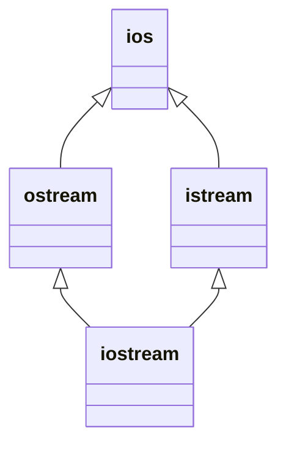
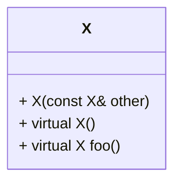

# 关于对象——Object Lessons

在C语言中，“数据”和“处理数据的操作（函数）”是分开来声明的，也就是说，语言本身并没有支持“数据和函数”之间的关联性。我们把这种程序方法称为程序性的（procedural），由一组“分布在各个以功能为导向的函数中”的算法所驱动，它们处理的是共同的外部数据。

当我们把相同的设计放到C++的时候，程序员会问的第一个问题是：加上了封装之后，布局成本（内存成本）增加了多少？答案是，在绝大多情况下没有。C++在布局以及存取时间上主要的额外负担是由virtual引起的，包括：

+ 虚函数机制：用以支持一个有效率的“执行期函数动态绑定”(runtime binding)
+ 虚基类

除此之外可能还有以`dynamic_cast`为首的，一些试图将基类的引用或者指针转换为派生类的操作，会产生一些额外的负担。

## 1.1 C++对象模式——The C++ Object Module

> 本篇描述C++对象模型的各种演化。有的对象模型没有被真正实装，但是也为后来的设计提供了思路。

> 在C++中，有两种类数据成员（class data member）：
>
> + static
> + nonstatic
>
> 以及三种类成员函数（class member functions）：
>
> + static
> + nonstatic
> + virtual

### 简单对象模型——A Simple Object Module

第一个模型十分简单，它的目的是尽量降低C++编译器的设计复杂度而开发出来的，牺牲的是内存空间和执行期效率。在这个简单的模型中，一个对象(object)是一系列的表格(slots)，每一个slot指向一个成员(member)。Members按照声明顺序，各自被指定一个slot。每一个数据成员或者函数成员都有自己的一个slot。

> slot可以理解为一片内存空间，这些内存空间中存放着指针，指针指向各种各样的成员。而这个内存空间就是对象。

<center></center>

在这个对象模型下，member本身并不放在object中。只有指向members的指针才被存放在object中。这么做的好处是，可以避免members有不同的类型，因而需要处理不同的存储空间的问题。Object是以slot的索引值来寻址的。一个object class的大小是非常容易计算的：$sizeof(pointer) * number\:of\:pointers$

这个模型并没有被运用到任何实际的产品上。**但是这种模型提供的思想却被应用到*pointer-to-member***的观念中。

### 表格驱动对象模型——A Table-driven Object Module

为了对所有的classes的所有objects都有一致的表达方式，另一种对象模型是把所有与members相关的信息抽出来，放在一个data member table和一个member function table之中，class object本身则内含指向这两个表格的指针。Member function table是一系列的slots，每一个slot指向一个member function：Data member table则直接持有data本身。

<center></center>

这个模型也没有被真正应用到真正的C++编译器上，但是member function table这个观念却成为了支持virtual functions的一个有效方案。

### C++对象模型——The C++ Object Module

C++对象模型是从简单对象模型派生而来的，并对内存空间和存取时间做了优化。在这个模型中，非静态数据成员（Nonstatic data member）被配置到每一个class object instance之内，静态数据成员（static data members）则被存放在class object instance之外。Static和nonstatic function members也被放在个别的class object之外。Virtual functions则以两个步骤来进行支持：

1. 每一个类产生出一堆指向虚函数的指针，放在表格中。这个表格被称为virtual table(vtbl)
2. 每一个类对象的内存中再加入一个指针，这个指针指向相关的virtual table。通常这个指针被称为**vptr**。vptr的设定（setting）和重置（resetting）都由一个class的constructor, destructor和copy constructor运算符自动完成。每一个class所关联的type_info object（用以支持runtime type identification, RTTI）也经由virtual table被指出来。***通常放在表格的第一个slot***。

<center></center>


这个模型最大的优点是它在内存空间和运行时的效率；最大的缺点是，即使我们的都一段代码没有任何的更改，但是这段代码中使用到的类的对象的非静态类成员进行了任何的更改（增加，删除或者修改），那么这段代码就需要重新编译。在这一点上，前面两种模型就通过多提供一层间接性而具备了更大的灵活性，当然他们付出的代价是内存空间和执行期效率。

### 加上继承——Adding Inheritance

C++支持单继承，多继承和虚继承。

在虚继承中，base class不管在继承过程中被派生（derived）了多少次，永远只会存在一个实例（称为subobject）。例如：




`iostream`中就只有`ios`的一个实例。

***一个派生类如何在本质上模塑其基类的实例呢？***

在“简单对象模型”中，每一个基类可以被derived class object内的一个slot指出，这个slot内含base class subobject的地址。这个体制的主要缺点是，因为间接访问而导致的空间和存取时间上的额外负担；优点则是类对象的大小不会因为基类的改变而受到影响。

当然，我们可以考虑“base table”模型。这个模型中有一个指针bptr(basic class table ptr)，指向包含着对象的基类的所有指针的表，我们可以像考虑虚函数表一样来考虑这个模型。缺点依然是间接性存取带来的空间、时间上的负担；优点则是，对于不同的继承方式，都有着相同的表示方法。同时，不需要更改对象本身的大小，就可以改变基类表的大小。

上面的两种机制，“间接性”的级数都将因为继承的深度而增加。

******

C++最初代表的继承模型并不运用任何间接性。基类对象的数据成员被直接存放到派生类对象中。这提供了对基类成员最紧凑而且有效的存取。当然缺点也很明显：如果基类的成员有任何的改变，包括增加、移除或者改变类型，都将使得任何用到了基类的函数、派生类等等重新编译。

在C++ 2.0添加了虚基类之后，表示基类的方法有所改变。类对象中被添加一个或多个虚基类表指针，指向虚基类表。

### 对象模型如何影响程序——How the Object Module Effects Programs

> 上面讨论的对象模型如何影响到我们的程序

上面讨论的对象模型为程序员带来了怎样的影响？***对于不同的对象模型，会产生“现有的代码必须修改”，或者“必须加入新的程序代码”两种结果。***

考虑这样一个类：



然后我们编写如下代码：

```c++
X foobar()
{
	X xx;
	X *px = new X;

	xx.foo();
	px->foo();
    
	delete px;
	return xx;
}
```

然后这段代码会编译器编译成如下的样子：

```c++
// Probable internal transformation 
// Pseudo C++ code 
void foobar( X &_result ) 
{
    // construct _result 
    // _result replaces local xx ... 
    _result.X::X(); 
    
    // expand X *px = new X; 
    px = _new( sizeof( X ));
    if ( px != 0 )
        px->X::X(); 
    
    // expand xx.foo(): suppress virtual mechanism 
    // replace xx with _result 
    foo( &_result ); 
    
    // expand px->foo() using virtual mechanism 
    ( *px->_vtbl[ 2 ] )( px )
    
    // expand delete px; 
    if ( px != 0 ) 
    {
        ( *px->_vtbl[ 1 ] )( px ); // destructor 
        _delete( px ); 
    }
    
    // replace named return statement 
    // no need to destroy local object xx 
    return; 
};
```

关于这段代码，并不需要现在理解，在完成后面的章节之后，自然就会理解。

> 侯杰注图：
>
> ```mermaid
> flowchart LR
> subgraph X class object
> 	普通数据
> 	vptr
> end
> 
> subgraph vtb[Virtual table for X]
> 	slot_1
> 	slot_2
> 	slot_3
> end
> 
> vptr--> vtb
> 
> slot_1 --> type[type_info for X]
> slot_2 --> des[destructor]
> slot_3 --> foo
> ```

## 1.2 关键词所带来的差异——A Keywod Distinction

如果不是为了努力维护与C之间的兼容性，C++可以比现在更简单。举个例子，如果没有8种整数需要支持的话，重载函数的方法会简单很多。同样，如果C++丢掉C的声明语法，就不需要纠结下面的究竟是函数调用还是声明操作（是函数调用）：

```c
int (*pf)(1024);
```

我们之所以可以判断这是一个函数调用，是因为我们传入了1024.

但下面这个就没有这么好运了（这是一个声明）：

```c
int (*pq)();
```

当语言无法区分那是一个声明还是一个表达式（expression）的时候，我们需要一个超越语言范围的规则，而这个规则会将上式判断为一个声明。

*****

同样，如果C++并不需要支持C原有的`struct`，那么类的观念可以使用唯一的关键字`class`来解决。但是令人惊讶的是，当一个C程序员使用C++的时候，除了会关心效率的问题，他们的另一个问题是：什么时候可以使用`struct`来代替`class`？

### 关键词的困扰

对于上面的问题，回答是：当你感觉好的时候。

换句话说，***对于程序本身来说，使用`struct`还是`class`并没有影响。因为这只是C++为了兼容C代码而保留的关键字。***

再换句话说，***`class`和`sruct`是可以互换的。***

### 策略性正确的`struct`——The Politically Correct Struct

C程序员的编程技巧有的时候会成为C++中意想不到的陷阱。例如，将单一元素的数组放在一个`struct`的尾端，于是每个`struct`对象可以有可变长的数组：

```c
struct mumble
{
    /* other member */
    char pc[1];
};

// 从文件或标准输入中取得一个字符串，然后配置足够的内存：
struct mumble *pmumb1 = (struct mumble*)malloc(sizeof(mumble) + strlen(string) + 1);
strcpy(&mumble.pc, string);
```

而在C++中，一个类，可能有以下情况（几乎是肯定）：

+ 制定了多个访问权限部分（access sections, `public`...）
+ 从另一个`class`派生而来
+ 定义了一个或多个虚函数

那么，上面的这个技巧也许可以正常使用，也许不能。

之所以可能可以使用，是因为在一个类中，***处于同一个access section的数据，必定保证以其声明的顺序出现在内存布局当中；但是，对于放置在多个access sections中的数据，排序顺序就不一定了***。所以，运气好的时候，这个数组定义在内存布局的最后，就可以正常使用。

但是不能使用的原因，除了上面说道的不同的access sections的内存布局不确定，派生类和基类的数据成员的布局也没有强制规定。更别提虚函数、虚基类了。

所以，最好的解决方法就是，不要这么做。

******

如果我们迫切的需要将一个复杂的C++类中的一部分数据处理成C声明的那样，曾经的最好的做法是从C结构体中派生C++的部分。对于现在来说，***最好的做法是在一个C++类中组合C结构体***。

C结构体在C++类中的一个合理用途，就是当我们想要把C++的一个类对象的全部或者部分传递给C函数的时候，我们可以使用`struct`声明将数据封装，并保证其拥有与C兼容的内存布局。当然，这样的功能只在前面所说的组合的前提下才能存在。

# 1.3 对象的差异——An Object Distinction

C++程序设计模型直接支持三种程序设计范式（programming paradigms）：

1. 程序模型（procedural model）。就像C一样，C++当然也支持。

2. 抽象数据类型模型（abstract data type model, ADT）。我们像使用基本类型一样去使用，但是其实其本质并不是基本类型，例如：

    ```c++
    string s1, s2;
    s1 = "...";		// string::operator=()
    s1 == s2;            // string::operator==()
    ```

3. 面向对象模型（object-oriented model）。在此模型中有一些彼此相关的类型，通过一个抽象的基类（用以提供接口）被封装起来。

纯粹使用一个范式来编写程序，有助于整体行为的良好稳固。但是如果混合了不同的范式，就会带来令人吃惊的后果。尤其是我们没有谨慎处理的时候。

******

在C++中，多态只存在于一个个的public class体系中。一个指针可能指向某个类的对象，也可能指向其public派生的一个子类型。非public派生的的派生行为以及`void*`虽然可以被称为“多态”，但是并没有被语言明确地支持。也就是说，它们需要被程序员显式地进行转换操作来管理。

### C++如何支持多态

C++以以下方式支持多态：

1. ```c++
    shape *ps = new circle();
    ```

2. ```c++
    ps->rotate();
    ```

3. ```c++
    if (circle *pc = dynamic_cast<circle*>(ps)) { /*...*/ }
    ```

多态的主要用途是经由一个共同的接口来影响类型的封装，这个接口通常被定义在一个抽象的基类中。这个共享接口是以virtual function的机制引发的，它可以在执行期根据对象的真正类型解析出到底是哪个函数被调用。

### C++对象的大小

需要多少内存才能够表现一个class object？一般而言要有：

+ nonstatic data member的大小

+ 内存对齐的大小

    > Plus any padding (between members or on the aggregate boundary itself) due to alignment constraints (or simple efficiency) 
    >
    > <p align="right">——  Stanley B. Lippman</p>

    > `alignment`就是将数值调整到某个数的倍数。在32位计算机上，通常其值为4 Byte，***以使bus的“运输量”达到最高效率。***
    >
    > <p align="right">——侯捷</p>
    
+ 为了支持virtual而由内部产生的任何额外负担（overhead）

### 指针的类型——The Type of a Pointer

考虑一个问题，指针的大小都是固定的，那么我们为何需要去考虑指针的类型呢？其真正的原因就在于，***指针类型指导编译器解释某个特定的内存的内容及其大小***。

这也就是为什么我们只能用`void*`来保存一个地址，而不能对无类型指针（`void*`）进行提领（dereference）操作。

所以，转换（cast）其实是一个编译器指令。大部分情况下它并不改变一个指针所包含的真正地址，它只影响我们对指向的内存的解释方式。

### 加上多态之后——Adding Polymorphism

