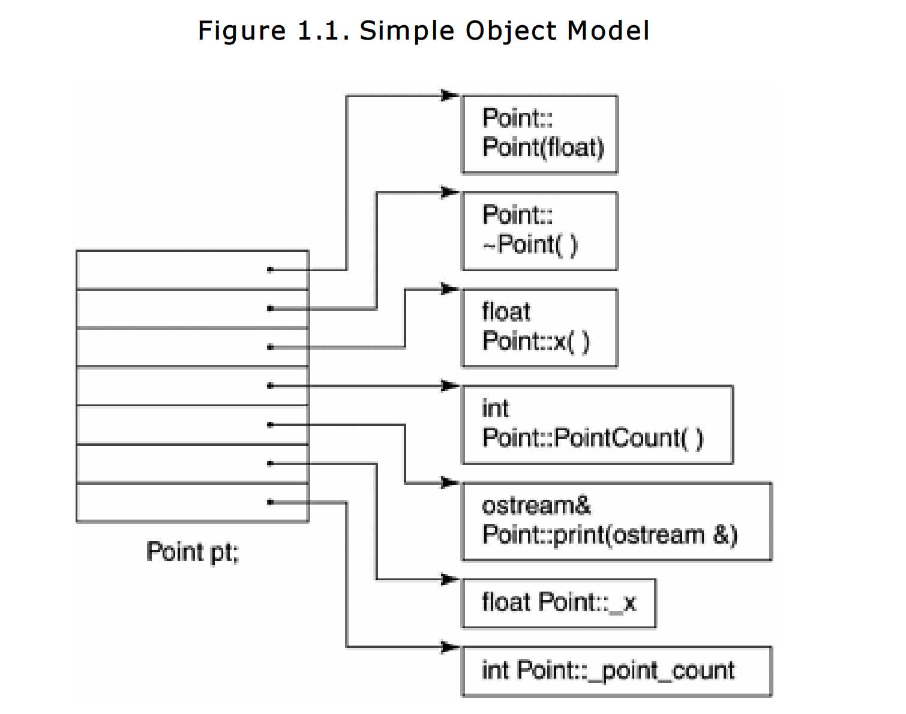
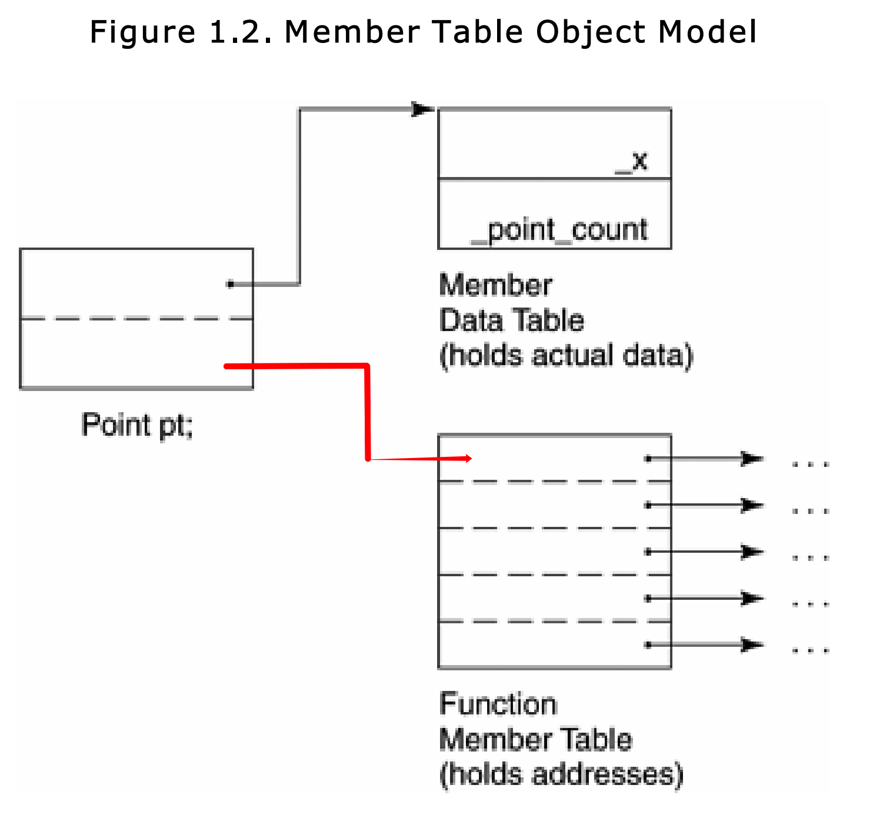
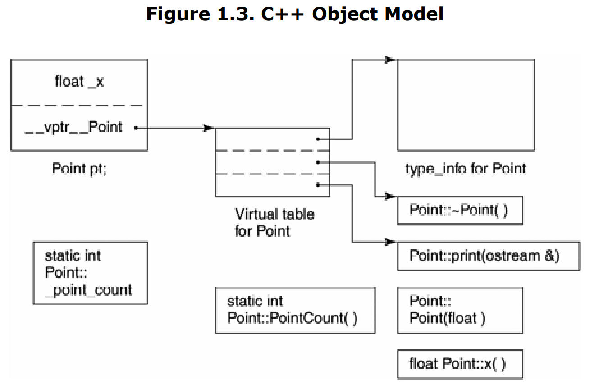
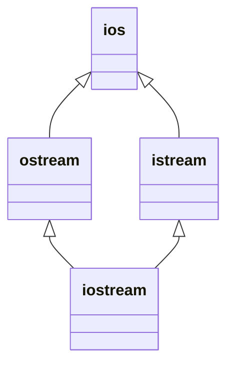

# 关于对象——Object Lessons

在C语言中，“数据”和“处理数据的操作（函数）”是分开来声明的，也就是说，语言本身并没有支持“数据和函数”之间的关联性。我们把这种程序方法称为程序性的（procedural），由一组“分布在各个以功能为导向的函数中”的算法所驱动，它们处理的是共同的外部数据。

当我们把相同的设计放到C++的时候，程序员会问的第一个问题是：加上了封装之后，布局成本（内存成本）增加了多少？答案是，在绝大多情况下没有。C++在布局以及存取时间上主要的额外负担是由virtual引起的，包括：

+ 虚函数机制：用以支持一个有效率的“执行期函数动态绑定”(runtime binding)
+ 虚基类

除此之外可能还有以`dynamic_cast`为首的，一些试图将基类的引用或者指针转换为派生类的操作，会产生一些额外的负担。

## 1.1 C++对象模式——The C++ Object Module

> 本篇像是在描述C++对象模式的发展

> 在C++中，有两种类数据成员（class data member）：
>
> + static
> + nonstatic
>
> 以及三种类成员函数（class member functions）：
>
> + static
> + nonstatic
> + virtual

### 简单对象模型——A Simple Object Module

第一个模型十分简单，它的目的是尽量降低C++编译器的设计复杂度而开发出来的，牺牲的是内存空间和执行期效率。在这个简单的模型中，一个对象(object)是一系列的表格(slots)，每一个slot指向一个成员(member)。Members按照声明顺序，各自被指定一个slot。每一个数据成员或者函数成员都有自己的一个slot。

> slot可以理解为一片内存空间，这些内存空间中存放着指针，指针指向各种各样的成员。而这个内存空间就是对象。

在这个对象模型下，member本身并不放在object中。只有指向members的指针才被存放在object中。这么做的好处是，可以避免members有不同的类型，因而需要处理不同的存储空间的问题。Object是以slot的索引值来寻址的。一个object class的大小是非常容易计算的：$sizeof(pointer) * number\:of\:pointers$

这个模型并没有被运用到任何实际的产品上。**但是这种模型提供的思想却被应用到*pointer-to-member***的观念中。

### 表格驱动对象模型——A Table-driven Object Module

为了对所有的classes的所有objects都有一致的表达方式，另一种对象模型是把所有与members相关的信息抽出来，放在一个data member table和一个member function table之中，class object本身则内含指向这两个表格的指针。Member function table是一系列的slots，每一个slot指向一个member function：Data member table则直接持有data本身。

这个模型也没有被真正应用到真正的C++编译器上，但是member function table这个观念却成为了支持virtual functions的一个有效方案。

### C++对象模型——The C++ Object Module

C++对象模型是从简单对象模型派生而来的，并对内存空间和存取时间做了优化。在这个模型中，非静态数据成员（Nonstatic data member）被配置到每一个class object instance之内，静态数据成员（static data members）则被存放在class object instance之外。Static和nonstatic function members也被放在个别的class object之外。Virtual functions则以两个步骤来进行支持：

1. 每一个类产生出一堆指向虚函数的指针，放在表格中。这个表格被称为virtual table(vtbl)
2. 每一个类对象的内存中再加入一个指针，这个指针指向相关的virtual table。通常这个指针被称为**vptr**。vptr的设定（setting）和重置（resetting）都由一个class的constructor, destructor和copy constructor运算符自动完成。每一个class所关联的type_info object（用以支持runtime type identification, RTTI）也经由virtual table被指出来。***通常放在表格的第一个slot***。

这个模型最大的优点是它在内存空间和运行时的效率；最大的缺点是，即使我们的都一段代码没有任何的更改，但是这段代码中使用到的类的对象的非静态类成员进行了任何的更改（增加，删除或者修改），那么这段代码就需要重新编译。在这一点上，前面两种模型就通过多提供一层间接性而具备了更大的灵活性，当然他们付出的代价是内存空间和执行期效率。

### 加上继承——Adding Inheritance

C++支持单继承，多继承和虚继承。

在虚继承中，base class不管在继承过程中被派生（derived）了多少次，永远只会存在一个实例（称为subobject）。例如：

`iostream`中就只有`ios`的一个实例。

***一个派生类如何在本质上模塑其基类的实例呢？***

在“简单对象模型”中，每一个基类可以被derived class object内的一个slot指出，这个slot内含base class subobject的地址。这个体制的主要缺点是，因为间接性而导致的空间和存取时间上的额外负担；优点则是类对象的大小不会因为基类的改变而受到影响

