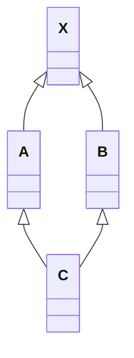

# 构造函数语义学

<p align="right"><b><i>——The Semantics of Constructors</i></b></p>

>  关于C++，最常听到的一个抱怨就是，编译器背着程序员做了太多事情。

## 2.1 Default Constructor的构造操作

> <i>default constructors……在需要时被编译器产生出来。</i>

关键字眼是“在需要的时候”。被谁需要？做什么事情？

### “需要”是编译器认为需要，而不是我们的程序需要

```c++
class Foo { public: int val; Foo *pNext; };

void foo_bar()
{
    // 我们需要bar的所有成员都是0
    Foo bar;
    if ( bar.val || bar.pNext ) { /*...*/ }
}
```

在这个例子中，正确的程序语义是要求`Foo`有一个默认构造函数，可以将它的两个对象都初始化为0。上面这段代码并不符合我们对“需要”的定义。其差别在于，一个是程序的需要，一个是编译器的需要。

<p align="center"><b><i>程序如果需要，那么是程序员的责任，而不是编译器的。</i></b></p>

一个默认构造函数会被合成出来，当且仅当编译器需要它的时候。并且，合成出的构造函数只完成编译器需要它完成的工作，我们不能期待这个合成出的构造函数会为我们做任何额外我们所希望的事。换言之，假设编译器真的为我们合成了构造函数，我们也不能去期望里面的两个data member被初始化为0.

> <center><b><i>If there is no user-declared constructor for class X, a default constructor is implicitly declared…. </br>A constructor is *trivial* if it is an implicitly declared default constructor….</i></b></center>

******

但是，存在四种情况，编译器生成的默认构造函数将不是“trivial”的：

### “带有Default Constructor”的Member Class Object

如果一个类没有任何constructor，但是它内部含有一个成员对象，而后者有一个默认构造函数，那么这个类的implicit default constructor就不是"trivial"的：**编译器需要为该类合成一个default constructor**

这样的操作产生了一个问题：在C++各个不同的编译模块中（此处指不同的文件）编译器如何避免合成出多个default destructor？解决方法是**把合成的default constructor / copy constructor / destructor / assignment copy operator都以`inline`的方式完成**。一个`inline`函数有静态链接（static linkage），不会在文件以外被看到。

如果函数太复杂，不适合做成内联函数，就会合成出一个 *explicit non-inline static function instance*。

例如，在如下的程序片段中，编译器将为`class Bar`合成一个default constructor：

```c++
class Foo { public: Foo(), Foo( int ) ... };
class Bar { public: Foo foo; char *str; };

void foo_bar()
{
    Bar bar;
    // ...
}
```

被合成的`Bar` default constructor内含必要的代码，能够调用class `Foo`的default constructor来处理成员对象`Bar::foo`，**但它不产生任何代码来初始化`Bar::str`**。将`Bar::foo`初始化是编译器的责任，但是将`Bar::str`初始化是程序员的责任。

******

那么，我们添加一个构造函数好了：

```c++
Bar::Bar()
{
    str = 0;
}
```

现在我们程序员自己该做的事情做完了（虽然一个合格的程序员还是应该显式地去构造每一个成员），但是编译器还需要初始化成员对象`foo`。但由于default constructor已经被显式地定义出来，编译器不能再合成第二个。

编译器的行动是：

<center><b><i>如果class A内含一个或一个以上的member class objects</br>那么class A的每一个constructor必须调用每一个member classes的default constructor。</i></b></center>

编译器会扩充已经存在的constructors，在其中安插一些代码，***使得user code被执行之前，先调用必要的default constructors。***

也就是说，可能会是这个样子：

```c++
Bar::Bar()
{
    foo.Foo:Foo();
    str = 0;
}
```

如果有多个class member objects都要求constructor初始化操作，C++就将以member objects在class中声明的顺序来调用各个constructors，这些代码将被安插在explicit user code之前。

### “带有Default Constructor”的Base Class

假设存在一个基类，如果这个基类派生出的派生类有一个默认的构造函数，而这个基类没有默认的构造函数，编译器就会为这个基类创建一个默认构造函数。

### “带有一个Virtual Function”的Class

在以下的情况下，也需要合成出default constructor：

1. class声明（或继承）了一个virtual function
2. class派生自一个继承链，其中有一个或更多的virtual base classes。

不管是哪一种情况，在编译期间都会发生以下的行为：

1. 一个virtual function table(vtbl)会被编译器产生出来，内放class的virtual functions地址
2. 在每一个class object中，一个额外的pointer member（vptr）会被编译器合成出来，内含相关的class vtbl的地址。

### “带有一个Virtual Base Class”的Class

Virtual base class的实现在不同的编译器之间有极大的差异。然而，这些实现的共同点在于，虚基类在每一个派生类对象中的位置（内存），会在执行期准备妥当。



对于上面的UML图，我们编写如下的代码：

```c++
class X 						{ public: int i; }
class A : public virtual X 		{ public: int j; }
class B : public virtual X 		{ public: double d; }
class C : public A, public B 	{ public: int k; }

// 编译器无法在编译时期决定（resolve） pa->X::i 的位置
void foo( constA* pa ) { pa->i = 1024; }

int main()
{
    foo( new A );
    foo( new C );
}
```

编译器必须改变“执行存取”的那些代码，使得`X::i`可以延迟到执行期才能决定下来。

原先`cfront`的做法是：在derived class object的每一个virtual base classes中安插一个指针来完成

而我们也再次给出一个可能的实现方式：

```c++
// 编译器可能做出的转变操作
void foo( const A* pa )
{
    pa->__vbcX->i = 1024;
}
```

其中，`__vbcX`代表`virtual base class X`。

> As you've no doubt guessed by now, the initialization of __vbcX (or whatever implementation mechanism is used) is accomplished during the construction of the class object. For each constructor the class defines, the compiler inserts code that permits runtime access of each virtual base class. In classes that do not declare any constructors, the compiler needs to synthesize a default constructor. 

`__vbcX`或者任何类似的机制，都是在对象构造期间完成的。对于类所定义的每一个构造函数，编译器都会在其中插入一些代码，来满足在运行期间访问虚基类的需求。对于那些没有声明任何构造函数的类，编译器需要为他们生成默认构造函数。

### 总结

通过上面的讨论，存在4种情况，会导致编译器为没有声明构造函数的类生成默认构造函数。C++标准将这些合成的构造函数称为implicit nontrivial default constructor。***被合成的构造函数只能满足编译器（而非程序）的需要。***这些构造函数被合成，只是为了满足机制上的需要（合成、继承、虚继承、多态）。至于不在上述4种情况之列，又没有声明任何构造函数的类，我们说它们拥有的是implicit trivial default constructors。***它们实际上不会被编译器合成出来。***

在合成的默认构造函数中，只有base class subobjects和member class objects会被初始化。所有其他的nonstatic data mamber（如整数、整数指针、整数数组等等）都不会被初始化。这些初始化操作对程序而言或许有必要，但对编译器则非必要。如果程序需要一个“把某个指针设为0”的default constructor，那么提供它的人应当是程序员。

> Programmers new to C++ often have two common misunderstandings: 
>
> 1. That a default constructor is synthesized for every class that does not define one 
> 2. That the compiler-synthesized default constructor provides explicit default initializers for each data member declared within the class
>
> As you have seen, neither of these is true.
