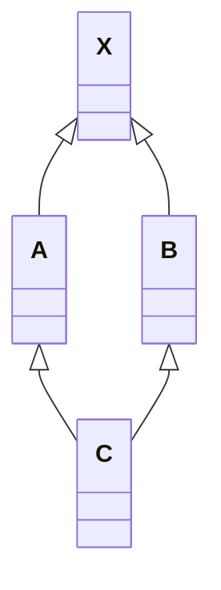
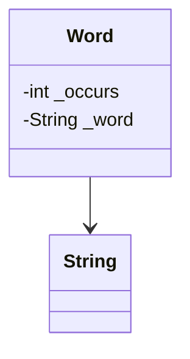

# 构造函数语义学

<p align="right"><b><i>——The Semantics of Constructors</i></b></p>

>  关于C++，最常听到的一个抱怨就是，编译器背着程序员做了太多事情。

[TOC]

## 2.1 Default Constructor的构造操作

> <i>default constructors……在需要时被编译器产生出来。</i>

关键字眼是“在需要的时候”。被谁需要？做什么事情？

### “需要”是编译器认为需要，而不是我们的程序需要

```c++
class Foo { public: int val; Foo *pNext; };

void foo_bar()
{
    // 我们需要bar的所有成员都是0
    Foo bar;
    if ( bar.val || bar.pNext ) { /*...*/ }
}
```

在这个例子中，正确的程序语义是要求`Foo`有一个默认构造函数，可以将它的两个对象都初始化为0。上面这段代码并不符合我们对“需要”的定义。其差别在于，一个是程序的需要，一个是编译器的需要。

<p align="center"><b><i>程序如果需要，那么是程序员的责任，而不是编译器的。</i></b></p>

一个默认构造函数会被合成出来，当且仅当编译器需要它的时候。并且，合成出的构造函数只完成编译器需要它完成的工作，我们不能期待这个合成出的构造函数会为我们做任何额外我们所希望的事。换言之，假设编译器真的为我们合成了构造函数，我们也不能去期望里面的两个data member被初始化为0.

> <center><b><i>If there is no user-declared constructor for class X, a default constructor is implicitly declared…. </br>A constructor is *trivial* if it is an implicitly declared default constructor….</i></b></center>

******

但是，存在四种情况，编译器生成的默认构造函数将不是“trivial”的：

### “带有Default Constructor”的Member Class Object

如果一个类没有任何constructor，但是它内部含有一个成员对象，而后者有一个默认构造函数，那么这个类的implicit default constructor就不是"trivial"的：**编译器需要为该类合成一个default constructor**

这样的操作产生了一个问题：在C++各个不同的编译模块中（此处指不同的文件）编译器如何避免合成出多个default destructor？解决方法是**把合成的default constructor / copy constructor / destructor / assignment copy operator都以`inline`的方式完成**。一个`inline`函数有静态链接（static linkage），不会在文件以外被看到。

如果函数太复杂，不适合做成内联函数，就会合成出一个 *explicit non-inline static function instance*。

例如，在如下的程序片段中，编译器将为`class Bar`合成一个default constructor：

```c++
class Foo { public: Foo(), Foo( int ) ... };
class Bar { public: Foo foo; char *str; };

void foo_bar()
{
    Bar bar;
    // ...
}
```

被合成的`Bar` default constructor内含必要的代码，能够调用class `Foo`的default constructor来处理成员对象`Bar::foo`，**但它不产生任何代码来初始化`Bar::str`**。将`Bar::foo`初始化是编译器的责任，但是将`Bar::str`初始化是程序员的责任。

******

那么，我们添加一个构造函数好了：

```c++
Bar::Bar()
{
    str = 0;
}
```

现在我们程序员自己该做的事情做完了（虽然一个合格的程序员还是应该显式地去构造每一个成员），但是编译器还需要初始化成员对象`foo`。但由于default constructor已经被显式地定义出来，编译器不能再合成第二个。

编译器的行动是：

<center><b><i>如果class A内含一个或一个以上的member class objects</br>那么class A的每一个constructor必须调用每一个member classes的default constructor。</i></b></center>

编译器会扩充已经存在的constructors，在其中安插一些代码，***使得user code被执行之前，先调用必要的default constructors。***

也就是说，可能会是这个样子：

```c++
Bar::Bar()
{
    foo.Foo:Foo();
    str = 0;
}
```

如果有多个class member objects都要求constructor初始化操作，C++就将以member objects在class中声明的顺序来调用各个constructors，这些代码将被安插在explicit user code之前。

### “带有Default Constructor”的Base Class

假设存在一个基类，如果这个基类派生出的派生类有一个默认的构造函数，而这个基类没有默认的构造函数，编译器就会为这个基类创建一个默认构造函数。

### “带有一个Virtual Function”的Class

在以下的情况下，也需要合成出default constructor：

1. class声明（或继承）了一个virtual function
2. class派生自一个继承链，其中有一个或更多的virtual base classes。

不管是哪一种情况，在编译期间都会发生以下的行为：

1. 一个virtual function table(vtbl)会被编译器产生出来，内放class的virtual functions地址
2. 在每一个class object中，一个额外的pointer member（vptr）会被编译器合成出来，内含相关的class vtbl的地址。

### “带有一个Virtual Base Class”的Class

Virtual base class的实现在不同的编译器之间有极大的差异。然而，这些实现的共同点在于，虚基类在每一个派生类对象中的位置（内存），会在执行期准备妥当。



对于上面的UML图，我们编写如下的代码：

```c++
class X 						{ public: int i; }
class A : public virtual X 		{ public: int j; }
class B : public virtual X 		{ public: double d; }
class C : public A, public B 	{ public: int k; }

// 编译器无法在编译时期决定（resolve） pa->X::i 的位置
void foo( constA* pa ) { pa->i = 1024; }

int main()
{
    foo( new A );
    foo( new C );
}
```

编译器必须改变“执行存取”的那些代码，使得`X::i`可以延迟到执行期才能决定下来。

原先`cfront`的做法是：在derived class object的每一个virtual base classes中安插一个指针来完成

而我们也再次给出一个可能的实现方式：

```c++
// 编译器可能做出的转变操作
void foo( const A* pa )
{
    pa->__vbcX->i = 1024;
}
```

其中，`__vbcX`代表`virtual base class X`。

> As you've no doubt guessed by now, the initialization of __vbcX (or whatever implementation mechanism is used) is accomplished during the construction of the class object. For each constructor the class defines, the compiler inserts code that permits runtime access of each virtual base class. In classes that do not declare any constructors, the compiler needs to synthesize a default constructor. 

`__vbcX`或者任何类似的机制，都是在对象构造期间完成的。对于类所定义的每一个构造函数，编译器都会在其中插入一些代码，来满足在运行期间访问虚基类的需求。对于那些没有声明任何构造函数的类，编译器需要为他们生成默认构造函数。

### 总结

通过上面的讨论，存在4种情况，会导致编译器为没有声明构造函数的类生成默认构造函数。C++标准将这些合成的构造函数称为implicit nontrivial default constructor。***被合成的构造函数只能满足编译器（而非程序）的需要。***这些构造函数被合成，只是为了满足机制上的需要（合成、继承、虚继承、多态）。至于不在上述4种情况之列，又没有声明任何构造函数的类，我们说它们拥有的是implicit trivial default constructors。***它们实际上不会被编译器合成出来。***

在合成的默认构造函数中，只有base class subobjects和member class objects会被初始化。所有其他的nonstatic data mamber（如整数、整数指针、整数数组等等）都不会被初始化。这些初始化操作对程序而言或许有必要，但对编译器则非必要。如果程序需要一个“把某个指针设为0”的default constructor，那么提供它的人应当是程序员。

> Programmers new to C++ often have two common misunderstandings: 
>
> 1. That a default constructor is synthesized for every class that does not define one 
> 2. That the compiler-synthesized default constructor provides explicit default initializers for each data member declared within the class
>
> As you have seen, neither of these is true.

## 2.2 Copy Constructor的构造操作

有三种情况，会用一个object的内容作为另一个class object的初值。

1. 最明显的一种情况当然是对一个object做显式地初始化操作，像这样：

    ```c++
    class X { ... };
    X x;
    X xx = x;
    ```

2. 或者是将对象作为参数直接传递给函数：

    ```c++
    extern void foo ( X x );
    
    void bar()
    {
    	X xx;
        
        foo( xx );
    }
    ```

3. 然后是将对象作为函数返回值：

    ```c++
    X foo_bar()
    {
        X xx;
        return xx;
    }
    ```

假如我们显示地定义了一个拷贝构造函数（copy constructor），例如：

```c++
X::X( const X& x );
Y::Y( const Y& y, int = 0 );
```

那么在大部分情况下，当一个类对象以另一个对象实例作为初值，上述的构造函数就会被调用。这可能会导致一个临时性的类对象的产生，或者是改变实际的代码（编译器会优化我们的代码），或者二者都有。

> This may result in the generation of a temporary class object or the actual transformation of program code (or both).

### Default Memberwise Initialization

> 如果类没有显式地提供一个拷贝构造函数（explicit copy constructor），会如何？

当类对象以相同的类的另一个对象作为初值，其内部是以所谓的“default memberwise initialization”方式完成的。意即，它把每一个内建的或派生的数据成员的值，从某个对象拷贝到另一个对象上。不过，它并不会拷贝其中的成员类对象，而是以递归的方式执行“memberwise initialization”。例如：

```c++
class String
{
public:
	// ... 没有提供explicit copy constructor
private:
    char *str;
    size_t len;
};
```

一个`String`对象的“default memberwise initialization”发生在这种情况下：

```c++
String noun("book");
String verb = noun;
```

其实现为：

```c++
verb.str = noun.str;
verb.len = noun.len;
```

接下来，如果我们将`String`类声明为`Word`类的成员，像这样：



```C++
class Word
{
public:
    // ... 同样，我们没有提供explicit copy constructor
private:
    int _occurs;
    String _word;
};
```

那么，一个`Word`对象的""default memberwise initialization"会拷贝`_occurs`，然后再在`_word`上调用`memberwise initialization`。于是形成了一个递归的拷贝。

“如果一个类没有定义出拷贝构造，编译器就会自动为它生成一个”，这句话也是错的，而应该是：***Default constructors and copy constructors…are generated (by the compiler) where needed.***

> <center><b><i>A class object can be copied in two ways, by initialization (what we are concerned with here)…and by assignment (treated in Chapter 5). Conceptually (my italics), these two operations are implemented by a copy constructor and copy assignment operator.</i></b></center>
>
> <p align="right">——Stanley B. Lippman</p>
>
> <center><b><i>一个类对象可以用两种方式复制得到，一种是被初始化（也就是我们这里关心的），另一种是被指定（assignment，第5章讨论）。从概念上而言，这两个操作分别是以copy constructor和copy assignment operator完成的。</i></b></center>
>
> <p align="right">——侯捷</p>

就像default constructor，C++标准将拷贝构造分为trivial和nontrivial。只有nontrivial的实例代码才会被合成。***决定一个拷贝构造是否为trivial，在于类是否展现出所谓的“bitwise copy semantics”***

### Bitwise Copy Semantics（位逐次拷贝）

考虑如下代码：

```c++
#include "Word.h"

Word noun("book");

void foo()
{
    Word verb = noun;
}
```

基于`Word`的不同实现方式，`foo`中的拷贝方式也会有不同。

如果`Word`得设计者定义了一个拷贝构造，那么，`verb`的初始化操作会调用它；但如果`Word`没有定义显式地拷贝构造函数，那么是否会有一个编译器合成的实例被调用？这取决于类是否展现“Bitwise Copy Semantics”。

#### `Word`实现1——展现“Bitwise Copy Semantics”

```c++
class Word
{
public:
    Word( const char* );
    ~Word() { delete [] str; }
    // ...
private:
    int		cnt;
    char* 	str;
};
```

这种情况下并不需要合成一个default copy constructor。因为上述代码展现了“default copy semantics”，而`verb`的初始化也不需要调用任何的函数（也就是说，我们只需要调用拷贝构造，而不需要在其中再调用别的函数）。当然，这里的实现是灾难性的，因为其中涉及到了深浅拷贝的问题。

#### `Word`实现2——不展现`Bitwise Copy Semantics`

```c++
class String
{
public:
    String( const char* );
    String( const String& );
    ~String();
    // ...
};

class Word  
{
public:
    Word( const String& );
    ~Word();
    // ...
private:
    int		cnt;
    String	str;
};
```

在这种情况下，编译器必须合成一个拷贝构造函数，这样才能调用`String`类的拷贝构造函数。我们可以假设合成的代码是这样的：

```c++
inline Word::Word( const Word& wd )
{
    str.String::String( wd.str );
    cnt = wd.cnt;
}
```

有一点值得注意：在合成出来的拷贝构造函数中，所有的不是类对象成员的成员（nonclass members）也会被复制，如同我们所期待的那样。

### 不要Bitwise Copy Semantics！——4种情况

什么时候一个类不展现出“bitwise copy semantics”？有四种情况：

1. 当类内含一个成员对象而后者的类声明中含有一个拷贝构造时（无论这个拷贝构造是由设计者显式声明，还是由编译器合成）
2. 当类继承自一个基类，而后者存在一个拷贝构造的时候（同样，无论是合成的还是设计的）
3. 当一个类设计了一个或多个虚函数时
4. 当类派生自一个继承链，其中有一个或多个的虚基类时

1/2没有太多讨论的意义，因为我们需要一个拷贝构造，在其中去调用成员的拷贝构造。我们主要讨论的是后面两点。

### 重新设定Virtual Table的指针

让我们回忆我们在之前讨论过的，编译器会在编译期间对代码进行的扩充操作（只要一个类声明了虚函数就会如此）：

+ 增加一个虚函数表（vtbl），内含每一个有作用的虚函数地址
+ 一个指向虚函数表的指针（vptr），安插在每一个类对象中

很显然，如果编译器对于每一个新产生的类对象的虚函数表指针不能成功而正确地设定好初值，将导致严重的后果。因此，***当编译器导入一个虚函数表指针到类中的时候，这个类就不再展现"bitwise semantics"了。***现在，编译器需要合成出一个拷贝构造来将虚函数表指针初始化：

```c++
class ZooAnimal
{
public:
    ZooAnimal();
    virtual ~ZooAnimal();
    
    virtual void animate();
    virtual void draw();
    // ...
    
private:
    // ZooAnimal的成员函数所需要的数据
};

class Bear: : pulic ZooAnimal 
{
public:
    Bear();
    void animate();	// 虽然此处没有写Virtual，但是同样是虚函数
    void draw();	// 同上
    virtual void dance();
    // ...
private:
    // 需要的数据
};
```

******

当我们用`ZooAnimal`的对象初始化另一个`ZooAnimal`对象、或者我们用`Bear`的一个对象去初始化另一个`Bear`对象的时候，都可以靠bitwise copy semantics完成。举个例子：

```c++
Bear yogi;
Bear winnie = yogi;
```

`yogi`会被default `Bear` constructor初始化。而在构造函数中，`yogi`的虚函数指针被设定指向`Bear`类的虚函数表（靠编译器安插的代码完成）。因此，把`yogi`的vptr拷贝给`winnie`是安全的。

******

同样，当我们使用一个派生类来初始化其基类的时候，其vptr的复制也必须要保证安全，例如：

```c++
ZooAnimal franny = yogi;	// 这会产生切割（sliced）行为
```

`franny`的vptr不可以被设定指向`Bear`类的虚函数表，这是自然的。也就是说，合成出来的`ZooAnimal` copy constructor会显式设定对象的vptr指向`ZooAnimal`类的虚函数表，而不是直接把右边的类对象的vptr值直接拷贝过来。

### 处理Virtual Base Class Subobject（未完成）

### 总结

我们已经看过4种情况，在这些情况下类不再保持“bitwise copy semantics”，而且default copy constructor如果没有被声明的话，就会被视为nontrivial。在这些情况下，如果缺乏一个已经声明的copy constructor，编译器为了正确处理“以一个类对象作为另一个类对象的初值”，必须合成出一个拷贝构造函数。

## 2.3 程序转化语义学（Program Transformation Semantics）

### 引入

已知下面的程序片段：

```c++
#include "X.h"

X foo()
{
    X xx;
    // ...
    
    return xx;
}
```

对于这个函数，我们可能会做以下假设：

1. 每次`foo()`被调用，就传回`xx`的值
2. 如果类`X`定义了一个拷贝构造函数，那么当`foo()`被调用的时候，保证这个拷贝构造也会被调用

第一个假设的真实性，必须视`X`的定义而定；

第二个假设的真实性，虽然也部分地必须视`X`如何定义而定，但主要的还是取决于C++编译器所提供的进取性优化层级（degree of aggresive optimization）而定。

我们甚至可以假设在一个高质量的C++编译器中，上述两点对于`X`的nontrivial definitions的假设都不正确

### 显式的初始化操作（Explicit Initialization）

已知有这样的定义：

```c++
X x0;
```

下面的三个定义，每一个都明显地以`x0`来初始化其类对象：

```c++
void foo_bar()
{
    X x1(x0);
    X x2 = x0;
    X x3 = X(x0);
}
```

对于编辑器来说，必要的代码转化有两个步骤：

1. 重写定义，剥除其中的初始化操作

    ***侯捷：在严谨的C++用词中，“定义”是指“占用内存”的行为***

2. 安插拷贝构造函数

我们可以假设在转化之后，代码是这个样子的：

```c++
void foo_bar()
{
    // definition
    X x1;
    X x2;
    X x3;
    
    // copy construction
    // X::X(const X& xx)
    x1.X::X( X0 );
    x2.X::X( X0 );
    x3.X::X( X0 );
}
```

### 参数的初始化（Argument Initialization）

C++ Standard中提到，把一个类对象当做参数传给一个函数（或是作为一个函数的返回值），相当于以下形式的初始化操作：

```c++
X xx = arg;
```

其中，`xx`代表形式化参数（或返回值）而`arg`代表真正的参数值。

因此，若已知这个函数：

```c++
void foo(X x0);
```

下面这样的调用方式：

```c++
X xx;
// ...
foo (xx);
```

将会要求局部实例（local instance）`x0`以memberwise的方式将`xx`当做初值。

在编译器的实现上：

1. 有一种策略是导入所谓的临时性对象，并调用拷贝构造将它初始化，同时还需要改变函数的签名、实现，然后再将这个临时性对象传递给修改后的函数。在这种转换下，我们可以假设代码会被转化成这个样子：

    ```c++
    X __temp0;	// 临时对象
    __temp0.X::X( xx );
    
    // 重新改写函数调用操作，以便使用上述对象
    foo ( __temp0 );
    ```

    为了方便实现上面的操作，还有最重要的一步，那就是改写`foo()`的声明：

    ```c++
    void foo (X& x0);
    ```

    其中，`X`声明了一个析构函数，它会在`foo()`函数完成之后被调用，处理那个临时性的对象。

2. 另一种实现方法是用“拷贝建构”的方式把实际参数直接建构在其应该的位置上，此位置视函数活动范围的不同，记录于程序的堆栈中。在函数返回之前，局部对象（local object）的析构函数会被执行

    > 从文字看来，编译器的做法可能是直接在函数栈帧前的内存做构造，这样就相当于我们`push`了一个对象进去

### 返回值的初始化（Return Value Initialization）

已知下面函数的定义：

```c++
X bar()
{
    X xx;
    // ...
    return xx;
}
```

我们可能会问`bar()`的返回值如何从局部对象`xx`中拷贝过来？cfont的做法是进行双阶段的转化：

1. 首先给函数加上一个额外参数，类型是类对象的引用。这个参数用来放置真正的返回值
2. 在`return`之前调用拷贝构造，把我们想返回的对象拷贝给前面的额外参数。真正的返回值是什么？编译器会重新改写函数，使其不返回任何值。

> 这样的思路，在C中其实非常常见，比如：
>
> ```c
> struct Node node;
> void construct_node(&node);
> ```

根据这样的算法，`bar()`函数转换如下：

```c++
void bar(X& __result)
{
    // definition
    X xx;
    
    // default construction
    xx.X::X();
    
    // ...
    
    // 编译器产生的拷贝构造
    __result.X::X( xx );
    
    return;
}
```

现在，编译器必须转换每一个`bar()`调用操作，以反应其新定义。例如：

```C++
X xx = bar();
```

将被转换为：

```c++
X xx;		// 注意，在这里没有进行默认构造
bar( xx );
```

同理，如果我们想直接使用`bar()`返回的对象的成员函数，比如：

```c++
bar().memfunc();
```

可能会转化为：

```c++
X __temp0;
( bar(temp0), temp0 ).memfunc();
```

同理，如果我们声明了函数指针，像这样：

```c++
X (*pf)();
pf = bar;
```

它也必须被转化为：

```c++
void (*pf)(X&);
pf = bar;
```

### 在使用者层面做优化（Optimization at the User Level）

对于以下代码：

```c++
X bar( const T &y, const T &z )
{
    X xx;
    // ...以y和z处理xx
    return xx;
}
```

我们可以通过提供一个构造函数，来加快代码的执行速度：

```c++
X bar( const T &y, const T &z )
{
    return X(y, z);
}
```

于是当`bar`被定义转换之后，效率就会比较高：

```c++
// 一种可能的转换
void bar( X& __result, const T& y, const T& z )
{
    __result.X::X(y, z);
    return;
}
```

在这个层面上，类的设计是以效率考虑居多，而不是以“支持抽象化”为优先。

### 在编译器层面做优化（Optimization at the Compiler Level）

考虑之前的函数`bar`：

```c++
X bar()
{
    X xx;
    // ...
    return xx;
}
```

在像这样的一个函数中，所有的`return`指令传回相同的具名数值（named value），因此编译器有可能做自己的优化，方法是为函数添加一个参数，以此来取代named return value。例如：

```c++
// 一种可能的优化
void bar(X& __result)
{
    // default constructor
    __result.X::X();
    
    // 直接处理__result
    
    return;
}
```

这样的编译器优化操作，有时被称为Named Return Value(NRV)优化。NRV优化如今被视为标准C++编译器一个义不容辞的优化操作——虽然其需求其实超越了正式标准之外。

为了对效率的改善有所感觉，请考虑一下代码：

```c++
class test
{
	friend test foo(double);
public:
    test() { memset( array, 0, 100 * sizeof( double ) ); }
private:
    double array[ 100 ];
};
```

同时请考虑以下函数，它产生、修改并传回一个`test`类对象：

```c++
test foo(double val)
{
    test local;
    
    local.array[0] = val;
    local.array[99] = val;
    
    return local;
}
```

有一个`main()`函数调用上述的`foo()`函数100万次：

```c++
int main()
{
    for ( int cnt = 0; cnt < 1000000; cnt++ )
    {
        test t = foo(double(cnt));
    }
    return 0;
}
```

上述程序要实行NRV优化，需要补上一个拷贝构造函数。加上一个内联的拷贝构造：

```c++
inline test( const test& t );
```

这个拷贝构造的出现，就会激活C++编译器的NRV优化。NRV优化的执行并不通过另外独立的优化工具完成。

> 但NRV技术也有一定的问题...

如果我们希望我们编写的拷贝构造函数在任何时候都被严格执行，不需要编译器的优化（例如NRV），那么有的时候就会被征以严格的“效率税”。例如，虽然下面三个初始化操作在语义上相等：

```c++
X xx0( 1024 );
X xx1 = X( 1024 );
X xx2 = ( X )1024;
```

虽然三个初始化都是使用1024来初始化一个对象，但不同点在于：

初始化`xx1`的时候首先构造出了一个临时的对象，并调用了拷贝构造将这个临时对象赋值给`xx1`，然后这个临时对象马上析构：

```c++
// C++伪代码
X __temp0;
__temp0.X::X(1024);
xx1.X::X(__temp0);
__temp0.X::~X();
```


于是就会产生一定的性能损耗...


一般而言，面对“以一个类对象作为另一个类对象的初值”的情形，语言允许编译器有大量的自由发挥空间。其利益当然是导致机器码产生的时候有明显的效率提升。缺点则是你不能够假定你写的拷贝构造函数的副作用，必须视情况而定。

### Copy Constructor：To Have or To Have Not?

考虑下面这个类：

```c++
class Point3d
{
public:
    Point3d( float x, float y, float z );
    // ...
private:
    float _x, _y, _z;
};
```

我们应该为这个类提供一个显式的拷贝构造（explicit copy constructor）吗？

上面这个类的默认拷贝构造会被视为trivial的。它既没有任何类对象成员，也没有任何的虚基类或者虚函数。所以，默认情况下，一个`Point3d`类对象的“memberwise”初始化操作会导致“bitwise copy”。这样做的效率很高，但是安全吗？

答案是肯定的。三个坐标成员是以数值来存储的。bitwise copy既不会导致内存泄露（memory leak），也不会产生地址冲突（addresss aliasing）。因此，它既安全、又迅速。

那么，这个类的设计者应该提供一个显式的拷贝构造函数吗？答案很显然，是**否定的**。我们没有任何的理由来提供一个显式的拷贝构造，理由是，编译器为我们产生的拷贝构造足够强大，也满足一切需求。

但是，当我们需要这个类进行大量的赋值操作的时候，提供一个显式的内联拷贝构造函数就非常合理——在编译器提供NRV优化的前提下。

```c++
Point3d operator+(...);
Point3d operator-(...);
Point3d operator*(...);
```

而我们应该以尽量高的效率来实现这个内联的拷贝构造函数呢？——答案是`memcpy`——当然，前提是，被实施这样的操作的类中不能包含编译器为我们添加的对象，例如虚基类表指针和虚函数表指针。

### 摘要

拷贝构造的应用，迫使编译器多多少少对我们的部分做部分的改动。尤其是当一个函数以传值的方式返回一个类对象，而这个类又提供了一个拷贝构造函数（无论是设计者提供的还是编译器提供的）的时候。此外，编译器也将拷贝构造的调用操作优化，以一个额外的第一参数（数值被直接存放在其中）取代NRV。

## 2.4 成员们的初始化列表（Member Initialization List）

> + 何时使用成员初始化列表才有意义？
> + 初始化列表到底在干什么？
> + 一些陷阱

当我们使用构造函数初始化对象的时候，我们要么使用对象初始化列表（member initialization list），要么就是在构造函数的函数体内进行初始化。除此之外，我们的选择并不多。

在下列情况中，我们只有使用了初花列表，我们才能成功编译：

1. 初始化一个引用成员（reference member）
2. 初始化一个常量成员（const member）
3. 调用一个基类的构造函数，而这个构造函数有一组参数
4. 调用一个成员类的构造函数，而这个构造函数有一组参数

在这4种情况下，程序可以被正确编译执行，但效率不高。例如：

```c++
class Word
{
    String _name;
    int    _cnt;
public:
    Word()
    {
        _name = 0;
        _cnt = 0;
    }
};
```

在我们编写的构造函数中，首先会生成一个临时性的String 对象，然后将它初始化，再用一个赋值运算符（assignment）运算符将临时性对象指定给`_name`。然后再销毁那个临时性的对象。

```c++
// C++伪码：一种可能的扩展
Word::Word( /* this pointer goes here */ )
{
    // 调用String的default constructor
    _name.String::String();
    
    // 产生临时性对象
    String temp = String(0);
    
    // memberwise地拷贝
    _name.String::operator=( temp );
    
    // 销毁临时性对象
    temp.String::~String();
    
    _cnt = 0;
}
```

而对`String`使用初始化列表的方式来进行初始化，我们就会得到一个更有效率的实现方法：

```c++
// 较好的实现方式
Word::Word() : _name(0)
{
    _cnt = 0;
}
```

它会被扩张成这个样子：

```c++
Word::Word( /* this pointer goes here */ )
{
    _name.String::String(0);
    _cnt = 0;
}
```

顺带一提，陷阱很有可能会出现在这样的模板代码（template code）中：

```c++
template <class type>
foo<type>::foo(type t)
{
    // 可能是（也可能不是）一个好主意
    // 视type的真正类型而定
    _t = t;
}
```

上面的论述会导致某些程序员十分积极进取地坚持所有的对象初始化操作必须在成员初始化列表中完成，甚至是一个行为良好的成员，比如`_cnt`：

```C++
Word()::Word() :
	_cnt( 0 ), _name(0)
{
        
}
```

 这里我们就需要考虑一个问题：成员初始化列表中到底会发生什么事情？

编译器会一一操作初始化列表，以适当顺序在构造函数之内安插初始化操作，这些代码会被添加在任何显式的用户代码（explicit user code）之前。

但是，有一些微妙的地方需要注意：

***list中的项目顺序是由class中的成员声明的顺序决定的，不是由初始化列表中的排列顺序决定的。***

意即，对于以下类：

```c++
class Word
{
	String 	_name;
    int		_cnt;
}
```

无论我们如何编写成员初始化列表：

```C++
// 1
Word::Word() : _name(0), _cnt(0) {}
// 2
Word::Word() : _cnt(0), _name(0) {}
```

在编译器处理之后，一定只会变成：

```C++
Word::Word()
{
	_name(0);
    _cnt(0);
    
    // explicit user code
}
```

所以，这样的代码一定是错的：

```C++
class Test
{
	int i, j;
    
    Test();
}

Test::Test(int val) : j(val), i(j) {}
```

这个bug的困难在于它很不容易被观察出来。编译器应该发出一个警告消息，但是到目前为止我只知道有一个编译器（g++）做到了这一点。

***我建议你总是把一个成员的初始化操作和另一个放在一起（如果你真的觉得有必要的话），放在构造函数体之内：***

```c++
// 比较受到喜爱的方式
X::X(int val) :
	j(val)
{
	i = j;        
}
```

另外一个值得关注的问题是，我们在构造一个对象的时候，能不能在成员初始化列表中调用这个对象的成员函数？就像这样：

```C++
X::X(int val) :
	i (xfoo(val)), j(val)
{}
```

答案是：可以，也不可以。原因是，我们并不知道`xfoo`函数对对象的依赖度有多高（换言之，`xfoo()`是否可以脱离`this`来执行一些操作）。当然，在构造函数体中使用成员函数是合法的，这是因为和这个对象有关的`this`指针已经被构造完毕。

最后一个问题：在一个派生类的构造函数的成员初始化列表中，如果我们向基类传递派生类的一个成员函数的运行结果，将会如何？

```c++
class FooBar : public X
{
    int _fval;
public:
    int fval() { return _fval; }
    Foobar(int val) :
    	_fval(val), X(fval())
    {
        
    }
}
```

这是可能的编译扩张结果：

```C++
FooBar::FooBar(/*this pointer here*/, val)
{
	X::X(this, this->fval());
    _fval = val;
}
```

显而易见，这并不是一个好主意，因为`_fval`还没有被初始化。

> ***简略的说，编译器会对初始化列表一一处理并可能重新排序，以反映出成员的声明顺序。它会安插一些代码到构造函数体内，并置于任何显式的用户代码之前。***
