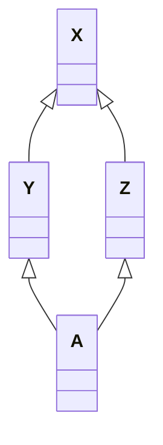

# Data语义学

<p align="right">—— The semantics of Data</p>

## 引入

> 在这一章中，类的数据成员以及类的层次结构式中心议题。一个类的数据成员，一般而言，可以表现这个类在程序执行时的某种状态。非静态数据成员（nonstatic data members）放置的是“个别的类对象”感兴趣的数据。静态数据成员（static data members）则放置的是所有类对象都感兴趣的数据。
>
> C++对象模型尽量以空间优化和存取速度优化的考虑阿里表现非静态数据成员。并且保持和C语言struct数据配置的兼容性。它把数据直接存放在每一个类对象之中。对于继承而来的非静态数据成员（不管是virtual还是nonvirtual base class）也是如此。不过并没有强制定义其间的排列顺序。至于static data members，则被放置在程序的一个global data segment中，不会影响到个别的类成员的大小。在程序之中，不管该类被产生出多少个成员（经由直接产生或间接派生），static data members永远只存在一份实例。***甚至在该类没有任何对象实例的时候，其static data member就已经存在***。但是一个template class的static data mebers的行为稍有不同，在第七章讨论。

考虑下面的代码，并考虑他们的`sizeof()`结果：

```c++
class X {};
class Y : public virtual X {};
class Z : public virtual X {};
class A : public Y, public Z {};
```



上述X、Y、Z、A中没有任何一个class中含有明显的数据，其间只表示了继承关系。但是需要注意的是，哪怕是`X`，其大小都不为0。

> ***注：***
>
> 这里的测试结果由：
>  OS: 64bit macOS         13.0.1         22A400
>  Kernel: arm64 Darwin 22.1.0
>
> g++版本：
>
>  Apple clang version 14.0.0 (clang-1400.0.29.202)
>  Target: arm64-apple-darwin22.1.0
>  Thread model: posix
>  生成。此处已经启用了下文提到的empty virtual base class优化。
>
> 
>
> 同时需要注意的是，本机是64位机，指针大小为8Byte，测试机为32位机，指针大小为4Byte。下文的笔记直接来自于书本，没有结合我的测试结果做分析。

```
// 我的测试结果
Sizeof class X: 1
Sizeof class Y: 8
Sizeof class Z: 8
Sizeof class A: 16

// 书的测试结果
Sizeof class X: 1
Sizeof class Y: 8
Sizeof class Z: 8
Sizeof class A: 12
```

首先，`X`的大小为1个Byte，那是被编译器安插进去的一个char。这使得这一class的任意对象都得以在内存中配置独一无二的地址。

其次是类`Y`和`Z`的大小。事实上，`Y`和`Z`的大小受到三个因素的影响：

1. **语言本身造成的额外负担（overhead）**：当语言支持virtual base classes时，就会导致一些额外负担。在derived class中，这个额外负担反应在某种形式的指针身上，它或者指向virtual base class subobject，或者指向一个相关表格；表格中存放的若不是virtual base class subobject的地址，就是其偏移地址（offset）。

2. **编译器对于特殊情况所提供的优化处理**。虚基类的1个Byte的大小也会出现在派生类`Y`和`Z`上。传统它被放在派生类的固定部分的尾部。某些编译器会对empty virtual base class提供特殊支持，这部分内容在下面展开。

3. **Alignment的限制。**类`Y`和`Z`的大小到目前为止是4个字节（一个Byte的char和4个Byte的虚基类指针）。在大部分机器上，聚合的结构体大小会受到alignment的限制，使它们能够更有效率地在内存中被存取。通常，alignment的大小为4个字节，因此最终得到的结果是8 Bytes。

    > alignment就是将数值调整到某数的整数倍，以使bus的运输量达到最高效率

Empty virtual base class已经称为C++ OO设计的一个特有术语了。它提供一个virtual interface。没有定义任何数据。某些新近的编译器对此提供了特殊的处理。在这个策略之下，一个empty virtual base class被视为derived class object最开头的一部分。也就是说它没有花费任何的空间。

这就节省了上文中提到的一个Byte的空间，也就不需要第三点提到的3Byte的填补。在这个模型下，`Y`和`Z`的大小都是4而不是8。

> 编译器之间的潜在差异正说明了C++对象模型的演化。这个模型为一般情况提供了解决之道。当特殊情况逐渐被挖掘出来的时候，种种启发（尝试错误）法于是被引入，提供优化的处理。
>
> 如果成功，启发法于是就提升为普遍的策略，并跨越各种编译器而合并。它被视为标准（虽然它并不为规范为标准），久而久之也就成了语言的一部分。
>
> Virtual function table就是一个好例子，另一个例子是前面提到的NRV优化。

那么，我们期望A的大小是多少呢？很显然，某种程度上我们需要根据我们使用的编译器而决定。首先，我们考虑没有进行过empty virtual base class优化的编译器。

来自虚基类的一个char，分别来自两个类的虚基类指针，因此大小为：
$$
1 Byte + 4 Byte + 4 Byte = 9Byte \to 12Byte
$$
如果我们考虑进行了优化的编译器，那么大小就是8Byte。

***注意，如果我们在虚基类中放置了一个及以上的数据成员，两种编译器就会产生出完全相同的对象布局。***

C++标准并不强制规定如“base class subobjects的排列顺序”或“不同存取层级的data members的排列顺序”这种琐碎细节。它也不规定virtual functions或virtual base class的实现细节。C++标准只说：那些细节由各家厂商自定。***因此在阅读的时候，需要区分“C++标准规定”和“目前的C++实现标准”两种讨论。***

总而言之，一个类对象的大小之所以有时会让你大吃一惊，原因是：

1. 由编译器自动加上的额外数据成员，用以支持某些语言特性
2. 因为alignment（边界调整）的需要。

