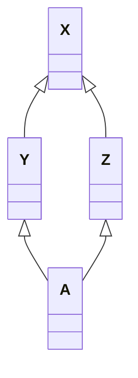
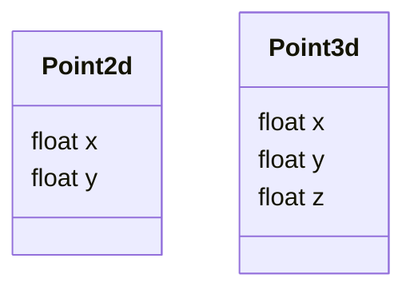
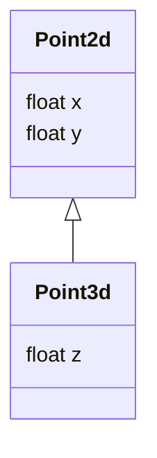
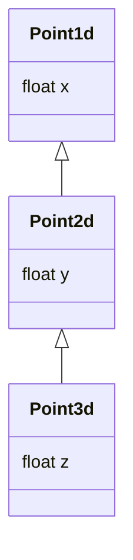
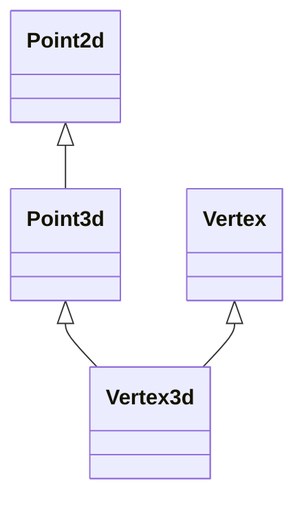
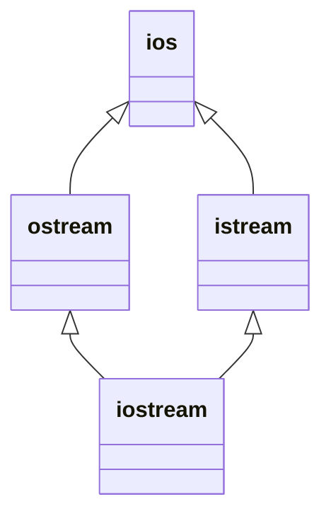
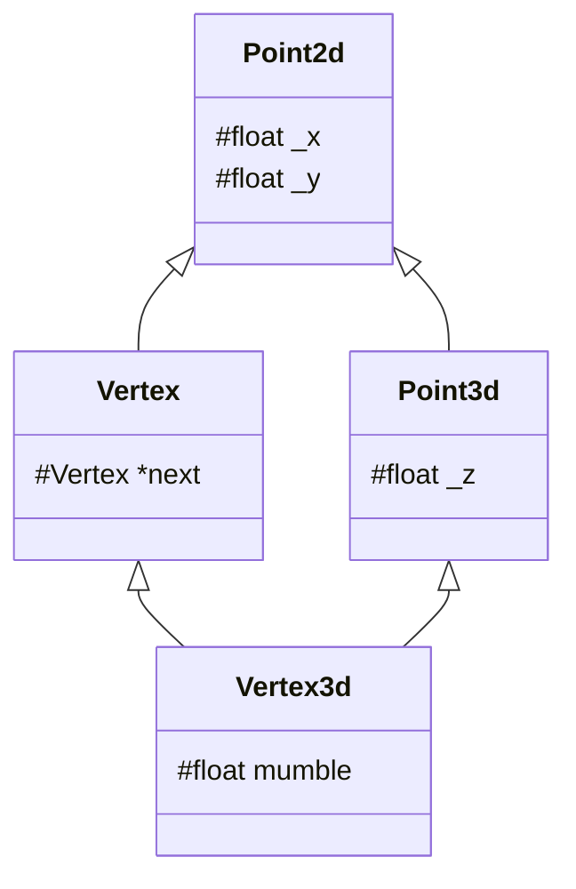

# Data语义学

<p align="right">—— The semantics of Data</p>

## 引入

> 在这一章中，类的数据成员以及类的层次结构式中心议题。一个类的数据成员，一般而言，可以表现这个类在程序执行时的某种状态。非静态数据成员（nonstatic data members）放置的是“个别的类对象”感兴趣的数据。静态数据成员（static data members）则放置的是所有类对象都感兴趣的数据。
>
> C++对象模型尽量以空间优化和存取速度优化的考虑阿里表现非静态数据成员。并且保持和C语言struct数据配置的兼容性。它把数据直接存放在每一个类对象之中。对于继承而来的非静态数据成员（不管是virtual还是nonvirtual base class）也是如此。不过并没有强制定义其间的排列顺序。至于static data members，则被放置在程序的一个global data segment中，不会影响到个别的类成员的大小。在程序之中，不管该类被产生出多少个成员（经由直接产生或间接派生），static data members永远只存在一份实例。***甚至在该类没有任何对象实例的时候，其static data member就已经存在***。但是一个template class的static data mebers的行为稍有不同，在第七章讨论。

考虑下面的代码，并考虑他们的`sizeof()`结果：

```c++
class X {};
class Y : public virtual X {};
class Z : public virtual X {};
class A : public Y, public Z {};
```



上述X、Y、Z、A中没有任何一个class中含有明显的数据，其间只表示了继承关系。但是需要注意的是，哪怕是`X`，其大小都不为0。

> ***注：***
>
> 这里的测试结果由：
>  OS: 64bit macOS         13.0.1         22A400
>  Kernel: arm64 Darwin 22.1.0
>
> g++版本：
>
>  Apple clang version 14.0.0 (clang-1400.0.29.202)
>  Target: arm64-apple-darwin22.1.0
>  Thread model: posix
>  生成。此处已经启用了下文提到的empty virtual base class优化。
>
> 
>
> 同时需要注意的是，本机是64位机，指针大小为8Byte，测试机为32位机，指针大小为4Byte。下文的笔记直接来自于书本，没有结合我的测试结果做分析。

```
// 我的测试结果
Sizeof class X: 1
Sizeof class Y: 8
Sizeof class Z: 8
Sizeof class A: 16

// 书的测试结果
Sizeof class X: 1
Sizeof class Y: 8
Sizeof class Z: 8
Sizeof class A: 12
```

首先，`X`的大小为1个Byte，那是被编译器安插进去的一个char。这使得这一class的任意对象都得以在内存中配置独一无二的地址。

其次是类`Y`和`Z`的大小。事实上，`Y`和`Z`的大小受到三个因素的影响：

1. **语言本身造成的额外负担（overhead）**：当语言支持virtual base classes时，就会导致一些额外负担。在derived class中，这个额外负担反应在某种形式的指针身上，它或者指向virtual base class subobject，或者指向一个相关表格；表格中存放的若不是virtual base class subobject的地址，就是其偏移地址（offset）。

2. **编译器对于特殊情况所提供的优化处理**。虚基类的1个Byte的大小也会出现在派生类`Y`和`Z`上。传统它被放在派生类的固定部分的尾部。某些编译器会对empty virtual base class提供特殊支持，这部分内容在下面展开。

3. **Alignment的限制。**类`Y`和`Z`的大小到目前为止是4个字节（一个Byte的char和4个Byte的虚基类指针）。在大部分机器上，聚合的结构体大小会受到alignment的限制，使它们能够更有效率地在内存中被存取。通常，alignment的大小为4个字节，因此最终得到的结果是8 Bytes。

    > alignment就是将数值调整到某数的整数倍，以使bus的运输量达到最高效率

Empty virtual base class已经称为C++ OO设计的一个特有术语了。它提供一个virtual interface。没有定义任何数据。某些新近的编译器对此提供了特殊的处理。在这个策略之下，一个empty virtual base class被视为derived class object最开头的一部分。也就是说它没有花费任何的空间。

这就节省了上文中提到的一个Byte的空间，也就不需要第三点提到的3Byte的填补。在这个模型下，`Y`和`Z`的大小都是4而不是8。

> 编译器之间的潜在差异正说明了C++对象模型的演化。这个模型为一般情况提供了解决之道。当特殊情况逐渐被挖掘出来的时候，种种启发（尝试错误）法于是被引入，提供优化的处理。
>
> 如果成功，启发法于是就提升为普遍的策略，并跨越各种编译器而合并。它被视为标准（虽然它并不为规范为标准），久而久之也就成了语言的一部分。
>
> Virtual function table就是一个好例子，另一个例子是前面提到的NRV优化。

那么，我们期望A的大小是多少呢？很显然，某种程度上我们需要根据我们使用的编译器而决定。首先，我们考虑没有进行过empty virtual base class优化的编译器。

来自虚基类的一个char，分别来自两个类的虚基类指针，因此大小为：
$$
1 Byte + 4 Byte + 4 Byte = 9Byte \to 12Byte
$$
如果我们考虑进行了优化的编译器，那么大小就是8Byte。

***注意，如果我们在虚基类中放置了一个及以上的数据成员，两种编译器就会产生出完全相同的对象布局。***

C++标准并不强制规定如“base class subobjects的排列顺序”或“不同存取层级的data members的排列顺序”这种琐碎细节。它也不规定virtual functions或virtual base class的实现细节。C++标准只说：那些细节由各家厂商自定。***因此在阅读的时候，需要区分“C++标准规定”和“目前的C++实现标准”两种讨论。***

总而言之，一个类对象的大小之所以有时会让你大吃一惊，原因是：

1. 由编译器自动加上的额外数据成员，用以支持某些语言特性
2. 因为alignment（边界调整）的需要。

## Data Member的绑定（The Binding of a Data Member）

考虑下面这段代码：

```c++
extern float x;

class Point3d
{
public:
	Point3d(float, float, float);
    // 问题：被传回的是哪一个x？
    float X() const { return x; }
    void X(float new_x) const { x = new_x; }
    // ...
private:
    float x, y, z;
};
```

在今天看来，我们所有人都会认为，`Point3d::X()`返回的一定是类内的成员`x`。这个答案是正确的，但并不是从过去以来都是正确的。

在C++最早的编译器上，如果在`Point3d::X()`的两个函数实例中做出参阅（取用）操作，该操作将会指向全局变量`x`。这样的绑定结果几乎不在大家的预期中。出于这样的原因，早期C++衍生出了两种防御性程序设计风格：

1. 把所有的数据成员都放在class声明的起始处，以确保正确的绑定：

    ```c++
    class Point3d
    {
    	// 防御性程序风格 #1
        // 在class声明起始处先放置所有的数据成员
        float x, y, z;
    public:
        float X() const { return x; }
    };
    ```

2. 把所有的内联函数（inline function），不管大小，都放在class声明之外：

    ```c++
    class Point3d
    {
    public:
        // 防御性程序设计风格 #2
        // 把所有的inlines都转移到class之外
        Point3d();
        float X() const;
        void X( float ) const;
    };
    
    inline float Point3d::X() const
    {
        return x;
    }
    ```

这些程序设计风格事实上到今天还仍然存在，虽然事到如今已经不再需要。这个古老的语言规则被称为“member rewriting rule”，大意是“一个inline函数实体，在整个class声明未被完全看见之前，是不会被评估求值（evaluated）的”。C++ standard以“member scope resolution rules”来精炼这个规则，其效果是，如果一个inline函数在类声明之后立刻被定义的话，那么就还是对其评估求值（evaluate）。也就是说，当一个人写下以下的代码：

```c++
extern int x;

class Point3d
{
	// 对于函数本体的分析将延迟，直至
    // class声明的右大括号出现才开始
    float X() const { return x; }
private:
    float x;
    // ...
};

// 事实上，分析在这里进行
```

对成员函数本体的分析，会直到整个类的声明都出现了才开始。因此在一个inline member function躯体之内的一个数据成员绑定操作，会在一个类声明完成之后才会进行。

然而，上述讨论对于成员函数的参数列表（argument list）并不为成立。Argument list中的名称还是会在它们第一次被编译器读取到的时候被适当地决议（resolved）完成。因此在extern和nested type names之间的非直觉绑定操作还是会发生。

举个例子，在下面的这个例子中，`length`的类型在两个成员函数签名（member function signatures）中都被决议（resolve）为global typedef，也就是`int`。当后续再有`length`的nested typedef声明出现的时候，C++ standard就把稍早的绑定标识为非法：

```c++
typedef int length;

class Point3d
{
public:
    void mumble(length val) { _val = val; }
    length mumble() { return _val; }
	// ...
private:
    // length必须在“本类对它的第一个参考操作”之前被看见
    // 这样的声明将使之前的参考操作不合法
    typedef float length;
    length _val;
};
```

上述这个语言状况，仍然需要某种防御性的程序设计风格：***请总是把“nested type声明”放在类的起始处。***在上面的例子中，如果把`length`的nested typedef定义于“在class中被参考”之前，就可以确保非直觉绑定的正确性。

## Data Member的布局（Data Member Layout）

已知下面一组data members:

```c++
class Point3d
{
public:
    // ...
private:
    float x;
    static List<Point3d*>* freeList;
    float y;
    static const int chunkSize = 250;
    float z;
};
```

Nonstatic data members在类对象中的排序顺序将和其被声明的顺序一样，任何中间介入的static data members如`freeList`和`chunjSize`都不会被放进对象布局之中。在上述例子里，每一个`Point3d`对象是由三个`float`组成的，顺序是`x / y / z`。static data members存放在程序的数据段（data segment）中，和个别的类对象无关。

C++ standard要求，在同一个access section（也就是`private`, `public`和`protected`等区段）中，members的排列只需符合“较晚出现的成员在类对象中有较高的地址”这一条件即可。也就是说，各个成员并不一定得连续排列。什么东西可能会介于被声明的成员之间呢？答案是边界调整（alignment）。

编译器还可能会合成一些内部使用的数据成员，以支持整个对象模型。vptr就是这样的东西，目前所有的编译器都把他安插在每一个“内含virtual function的类”的成员内。vptr会被放在什么位置呢？传统上它被放在所有显式声明的成员的最后。不过如今也有一些编译器把vptr放在一个类对象的最前端。

> 个人注：
>
> 在Darwin、Centos和Windows下编写下列测试代码：
>
> ```c++
> #include <iostream>
> 
> using namespace std;
> 
> struct Test
> {
> 	virtual void test() { }
> 	int i;
> };
> 
> int main()
> {
> 	Test t;
> 	cout << (reinterpret_cast<char*>(&t.i) - reinterpret_cast<char*>(&t)) << endl;
> }
> ```
>
> 最后的测试结果都为8，意即，在本人的测试下，vptr被放在了对象的起始。

C++秉承先前所说的“对于布局所持的放任态度”，允许编译器把那些内部产生出来的成员自由地放在任何位置上，甚至放在那些被程序员声明出来的成员之间。

C++ standard也允许编译器将多个access section之间的数据成员自由排布，比不在乎它们出现在类声明中的顺序。也就是说，下面这样的声明顺序：

```c++
class Point3d
{
public:
    // ...
private:
    float x;
    static List<Point3d*> *freeList;
private:
    float y;
    static const int chunkSize = 250;
private:
    float z;
};
```

其类对象的大小和组成都和之前的相同，但是成员的排列顺序由编译器决定。编译器可以随意把`y`或者`z`放在第一个，但是到目前为止，没有编译器会这么做。

目前编译器的做法都是把一个以上的access section连锁在一起（意即，把相同的访问层级的部分连接在一起），依照声明的顺序，成为一个连续区块。Access Section的多少并不会带来额外的负担。

下面这个函数用于判断在一个类中的两个成员谁先出现：

```c++
template <	class class_type,
			class data_type1,
			class data_type2 >
char*
access_order (
		data_type1 class_type::*mem1,
		data_type2 class_type::*mem2
		)
{
	assert (mem1 != mem2);
	return
		mem1 < mem2
			? "member 1 occurs first"
			: "member 2 occurs first";
}
```

## 3.3 Data Member的存取

> 已知下面这段程序代码：
>
> ```c++
> Point3d origin;
> origin.x = 0.0;
> ```
> 
> 	本小节将围绕`x`的存取成本展开。

`x`的存取成本取决于`x`如何声明。`x`可能是个static member，可能是个nonstatic member。Point3d可能是个独立（非派生）的类，也可能是从另一个单一的基类派生而来的；虽然可能性不高，但它甚至可能是从多继承或者是虚继承而来的。

### Static Data Members

静态数据成员，会被编译器提出类外，被视为一个全局变量（但只会在类的生命周期之内可见）。每一个成员的存取许可，以及与类的关联，并不会招致任何空间上或执行时间上的额外负担——不论是在个别的类对象还是在静态数据成员本身。

每一个静态数据成员只有一个实例，存放在程序的数据段中。每次程序参阅（取用）静态成员的时候，就会被内部转化为对该唯一`extern`实例的直接参考操作。

如果有两个类，每一个都声明了一个静态成员`freeList`，那么当它们都被放在程序的数据段时，就会导致名称冲突。编译器的解决方法是暗中对每一个静态数据成员编码（这种手法有个很美的名称——name-mangling），以获得一个独一无二的程序识别代码。有多少个编译器，就有多少种name-mangling做法。通常不外乎是表格、文法措辞等

任何name-mangling都有两个重点：

1. 一个算法，推导出独一无二的名称
2. 万一编译系统（或环境工具）必须和使用者交谈，那些独一无二的名称可以轻易被推导回到原来的名称

### Nonstatic Data Members

非静态数据成员直接存放在每一个类对象之中。除非经由显式（explicit）或隐式（implicit）类对象，否则没有办法直接存取它们。只要程序员在一个成员函数中直接处理一个非静态数据成员，所谓的隐式类对象就会产生。

想要对一个非静态数据成员进行存取操作，编译器需要把类对象的起始地址加上数据成员的偏移位置（offset）。

> 下面的测试用例为自己编写，书中的用例和解释与现在流行的编译器不同，不做采用。

例如：

```c++
#include <iostream>

using namespace std;

struct Test
{
	char c;
	short s;
	int i;
	double d;
};

int main()
{
	Test t;

	printf("Address of t: %p\n", &t);
	printf("Address of t.c: %p, address offset of c: %p\n", &t.c, &Test::c);
	printf("Address of t.s: %p, address offset of s: %p\n", &t.s, &Test::s);
	printf("Address of t.i: %p, address offset of i: %p\n", &t.i, &Test::i);
	printf("Address of t.d: %p, address offset of d: %p\n", &t.d, &Test::d);
}
```

运行结果为：

```
Address of t: 0x16d8f3120
Address of t.c: 0x16d8f3120, address offset of c: 0x0
Address of t.s: 0x16d8f3122, address offset of s: 0x2
Address of t.i: 0x16d8f3124, address offset of i: 0x4
Address of t.d: 0x16d8f3128, address offset of d: 0x8
```

每一个非静态数据成员的偏移位置（offset）在编译时期即可获知，甚至如何成员属于一个基类子对象也是如此。因此，存取一个非静态数据成员，其效率和存取一个C结构体成员或者一个非派生类的类的成员是一样的。

### 虚继承而来的数据成员

虚继承将为“经由基类子对象存取类成员”导入一层新的间接性（即多存取一次）。

对于下面的代码：

```c++
Point3d *pt3d;
Pt3d->_x = 0.0;
```

其执行效率在`_x`是一个结构体成员、一个类成员、单一继承、多重继承的情况下都是相同的。但如果`_x`是一个虚基类的成员，存取速度会稍慢一点。

> 对于这段话，我也存疑。
>
> 以下是我编写的测试代码：
>
> ```c++
> #include <cstdio>
> #include <iostream>
> 
> using namespace std;
> 
> struct Base
> {
> 	int i;
> };
> 
> struct Derive : virtual public Base
> {
> 
> };
> 
> struct Test
> {
> 	int i;
> };
> 
> int main()
> {
> 	Derive d;
> 	d.i = 1;
> 
> 	Test t;
> 	t.i = 1;
> 
> 	printf("Address of d: %p\n", &d);
> 	printf("Address of d.i: %p, address offset of i: %p\n", &d.i, &Derive::i);
> 	printf("Address offset of Base: %p\n", &Derive::Base::i);
> }
> ```
>
> 以下是运行结果：
>
> ```
> Address of d: 0x7ffc4eda2230
> Address of d.i: 0x7ffc4eda2238, address offset of i: (nil)
> Address offset of Base: (nil)
> ```
>
> 以下赋值语句的Linux反汇编码：
>
> ```assembly
> 0x0000000000400781 <+20>:	mov    DWORD PTR [rbp-0x8],0x1
> 0x0000000000400788 <+27>:	mov    DWORD PTR [rbp-0x20],0x1
> ```
>
> 可见，存取效率并无区别。

## 3.4 “继承”与Data Member

在C++继承模型中，一个派生类对象所表现出来的东西，是其自己的成员再加上基类的成员的总和。至于派生类成员和基类成员的排列顺序，则并未在C++ standard中强制制定；理论上编译器可以自由安排之。在大部分编译器上头，基类成员总是先出现，但是虚基类的除外（**一般而言，任何一条通则一旦碰上虚基类就没辙了，此处亦不例外。**）

> 这是我的测试代码和结果：
>
> ```c++
> #include <cstdio>
> #include <iostream>
> 
> using namespace std;
> 
> struct Base
> {
> 	int i;
> };
> 
> struct Derive :  public Base
> {
> 	int j;
> };
> 
> int main()
> {
> 	Derive d;
> 
> 	printf("Address offset of d.i: %p\n", &Derive::i);
> 	printf("Address offset of d.j: %p\n", &Derive::j);
> }
> ```
>
> 测试结果：
>
> ```
> Address offset of d.i: 0x0
> Address offset of d.j: 0x4
> ```

******

下面考虑这样的问题：

有两个类，`Point2d`和`Point3d`，我们在设计的时候可以有多种设计方法：

***设计方法一：***



***设计方法二：***



***设计方法三：***



这三种结构有什么不同？下面将围绕“单一继承且不含虚函数”、“单一继承并含虚函数”、“多重继承”、“虚拟继承”等四种情况。

### 只要继承不要多态（Inheritance without Polymorphism）

一般而言，具体继承（即，相反于虚继承）并不会增加空间或存取时间上的额外负担。


这样设计的好处就是可以把管理x和y坐标代码的程序代码局部化（限制于`Point2d`之中）。此外，这个设计可以明显表现出两个抽象类之间的紧密关系。

******

新手在设计的时候会犯两个常见错误：

1. 把两个原本独立不相干的类凑成一对“type/subtype”，并带有继承关系。用上面的例子来说，就是：

    ```mermaid
    classDiagram
    Point2d <|-- Point3d
    class Point3d {
    	Point2d p
    	float z
    }
    ```

    经验不足的人可能会重复设计一些相同操作的函数。例如，在`Point2d`中没有提供内联的`operator+=`，导致在`Point3d`中重复设计或者使用函数调用而造成效率下降。

2. 第二个常见的问题是，把一个类分解为两层或更多层，有可能为了“为了抽象而抽象”，而没有任何的实际意义。

    就比如：

    ```mermaid
    classDiagram
    
    Point1d <|-- Point2d
    Point2d <|-- Point3d
    
    class Point1d {
    	float x
    }
    
    class Point2d {
    	float y
    }
    
    class Point3d {
    	float z
    }
    ```

    但这样的设计就是好的吗？不见得，有的时候，可能会导致不必要的内存占用。

    对于这样的类：

    ```mermaid
    classDiagram
    class Concrete {
    	int val
    	char bit1
    	char bit2
    	char bit3
    }
    ```

    它的大小是8Byte：
    $$
    4Byte + 1Byte * 3 + Alignment(1Byte) = 8Byte
    $$
    而对于这样的设计：

    ```mermaid
    classDiagram
    
    Concrete1 <|-- Concrete2
    Concrete2 <|-- Concrete3
    
    class Concrete1 {
    	int val
    	char bit1
    }
    
    class Concrete2 {
    	char bit2
    }
    
    class Concrete3 {
    	char bit3
    }
    ```

    现在，`Concrete3`的大小是多少？
    $$
    Sizeof\: Concrete1 = 4Byte + 1 Byte + Alighment = 8Byte \\
    Sizeof\: Concrete2 = Sizeof\: Concrete1 + 1 Byte + Alighment = 12Byte \\
    Sizeof\: Concrete3 = Sizeof\: Concrete2 + 1 Byte + Alighment = 16Byte
    $$
    可以看到，这样的设计的空间占用相较之前增加了$100\%$。

    ******

    但是，编译器为什么要这样去设计？为什么不能在派生类中调整内存分布，让`bit1`和`bit2`紧密排布，这样大小就依然是8Byte：
    $$
    4Byte + 1Byte(bit1) + Byte(bit2) + Alignment = 8
    $$
    这样做是有理由的。让我们声明以下指针：

    ```c++
    Concrete2 *pc2;
    Concrete1 *pc1_1, *pc1_2;
    ```

    其中`pc1_1`和`pc1_2`都可以指向前述的三个类中的任意一种对象。

    现在我们编写这样一段代码：

    ```c++
    pc1_1 = &(Concrete());	// 现在pc1_1指向一个Concrete1类型的对象
    pc1_2 = &(Concrete());	// 现在pc1_2指向一个Concrete2类型的对象
    *pc1_1 = *pc1_2;		// 这会发生什么？
    ```

    如果编译器把基类对象原本的填补空间让出来给派生类成员使用，像这样：

    

那么在拷贝的时候，就会这样：


很明显，原本作为填充字节的地方被放了`bit2`，这显然不是我们期望的。这就是为什么编译器宁愿浪费空间，也要把这里空出来的原因。而这也是为什么我们在设计类的时候不能一味追求抽象的理由。

### 加上多态（Adding Polymorphism）

如果我要处理一个坐标点，而不打算在乎它是一个`Point2d`还是`Point3d`实例，那么我们需要再继承关系中提供一个虚函数接口。这样，我们在面对不同类型的对象的时候，调用相同的函数接口，就可以实现不同的功能。这样的弹性，正是面向对象程序设计的中心。支持这样的弹性，就会为我们的类带来空间和存取时间上的负担：

+ 导入一个和`Point2d`有关的虚函数表（virtual table），用来存放它所声明的一个虚函数的地址。这个表的元素个数一般而言是被声明的虚函数的个数，再加上一个或两个元素（用于支持runtime type identification）
+ 在每一个类对象中导入一个vptr，提供执行期的链接，使每一个对象能够找到相应的虚函数表
+ 加强构造函数，使它能够为虚函数表指针设定初值，让它指向类所对应的虚函数表。这可能意味着在派生类和每一个基类的构造函数中，重新设定vptr的值。其情况视编译器优化的积极性而定。
+ 加强析构函数，使他能够抹除“指向类相关的虚函数表”的vptr。

这些额外负担带来的冲击程度视被处理的对象的个数和生命周期而定，也视“对这些对象做多态程序设计所得的利益”而定。

把vptr放在类对象的前面还是后面，都会有自己的优势和缺点。

+ 曾经的cfront选择将vptr放在类对象的后面，这样做的好处是，可以保留基类的C结构体的对象布局，因而我们可以在C代码中使用代码。这种做法在C++最初问世的时候，被许多人采用
+ 到了C++2.0，开始支持虚拟继承一级抽象类，并且由于面向对象范式（OO paradigm）的兴起，有些编译器开始把vptr放在类对象的起头处（比如Microsoft的第一个编译器，就十分主张这种做法）。这样做的好处是，对于“在多重继承之下，通过指向class members的指针调用virtual function”，会带来一些帮助。否则，不仅“从类对象起点开始计算”的offset必须在执行期就准备好，甚至与类vptr之间的offset也必须计算好。当然，vptr放在前端，付出的代价就是丧失了C代码的兼容性。

### 多重继承（Multiple Inheritance）

单一继承提供了一种“自然多态（natural polymorphism）”形式，是关于类体系中的base type和derived type之间的转换。

在单继承下，派生类对象到基类对象的转换是非常简单的，把一个派生类对象指定给基类的指针或者引用，这个操作并不需要编译器去调停或者修改地址。它可以很自然的发生，并且提供了最佳的执行效率。

但是，如果派生类对象的起始处有vptr，而基类对象没有，这就会导致一些问题。这种情况下，把一个派生类对象转换给基类的指针或者引用，就需要编译器的介入，用以调整地址。在既是多重继承又是虚拟继承的情况下，编译器的介入更有必要。

多继承不像单一继承，不容易模塑出其模型。比如这样的一个类：



多重继承的问题主要发生于派生类对象和其第二或后继的基类对象之间的转换。不论是直接转换：

```c++
extern void mumble(const Vertex&);
Vertex3d v;
... 
mumble(v);
```

或者是经由其所支持的虚函数机制做转换。

对于一个多重派生对象，将其地址指定给“最左端”（也就是第一个）基类的指针，情况和单继承的时候相同，因为二者都指向相同的起始地址。需要付出的只有地址的制定操作而已。至于第二个或者后继的基类的地址制定操作，则需要将地址进行修改：加上或者减去介于中间的基类子对象的大小。例如：

```c++
Vertex3d v3d;
Vertex* pv = &v3d;
```

则需要这样的转换：

```c++
// 虚拟C++代码
pv = (Vertex*)(((char*)&v3d) + sizeof(Point3d));
```

而如果是这样的代码：

```c++
Vertex3d *pv3d;
Vertex *pv;
pv = pv3d;
```

那么就不能像上面一样做简单的转换，而是需要进行一次判断：

```c++
pv = pv3d
   ? (Vertex*)((char*)pv3d + sizeof(Point3d))
   : 0;
```

C++ standard并没有要求`Vertex3d`中的基类`Point3d`和`Vertex`有特定的排列顺序。原始的cfront编译器是根据声明顺序来配列它们的。目前各编译器仍然以此方式完成多基类的布局。（但是如果加上虚继承，事情就不太一样了）

某些编译器设计了一种优化技术，只要第二个或者后继的基类声明了虚函数，而第一个基类没有，就会调换基类的顺序。这样可以在派生类对象中少产生一个vptr。但是这项技术并未得到全球厂商的认可，因此并不普及。

如果我们要存取基类的数据对象，将会怎样呢？要付出额外的成本吗？答案是否定的，即使是多继承。members的位置在编译的时候就已经固定了，因此存取members只是简单的offset运算，就像单一继承一样简单——不管是经由一个指针、一个引用或者是一个对象来存取。

### 虚继承（Virtual Inheritance）

多继承的一个语义上的副作用就是，它必须支持某种形式的“shared subobjec继承”。典型的一个例子就是最早的`iostream`库。



为了解决`ostream`和`istream`中都含有一份`ios`，但是`iostream`中只需要一份的问题，语言层面就引入了虚继承。

要在编译器中支持虚拟继承，实在是难度颇高。在上述`iostream`的例子中，实现技术的挑战在于，要找到一个足够有效的方法，将`istream`和`ostream`各自维护的一个`ios`子对象，转换成一个由`iostream`唯一维护的一个子对象，并且还可以保存基类和派生类的指针（以及引用）之间的多态指定操作（polymorphism assignments）。

一般的实现方法如下所述。Class内如果包含一个或者多个virtual base class subobjects，像`istream`那样，将被分割为两部分：一个不变区域和一个共享区域。不变区域中的数据，不管后继如何演化，总是有固定的offset（从object开头算起），所以这一部分的内容可以被直接存取。至于共享区域，所表现的就是virtual base class subobject。这一部分的数据，其位置会因为每次的派生操作而有变化，所以它们只可以被简介存取。各家编译器实现技术之间的差异就在于间接存取的方法不同。以下说明三种主流策略。下面是`Vertex3d`虚拟继承的层次结构：




```c++
class Point2d
{
public:
	// ...
protected:
	float _x, _y;
};

class Vertex : public virtual Point2d
{
public:
	// ...
protected:
	Vertex *next;
};

class Point3d : public virtual Point2d
{
public:
	// ...
protected:
	float _z;
};

class Vertex3d :
	public Vertex, public Point3d
{
public:
	// ...
protected:
	float mumble;
};
```

一般的布局策略是先安排好derived class不变的部分，然后再建立其共享部分。

然而，这中间存在着一个问题：如何能够存取class的共享部分？cfront编译器会在每一个派生类对象中安排一些指针，每个指针指向一个虚基类。要存取继承得到的虚基类成员，可以通过相关指针间接完成。

举个例子，如果我们有以下的`Point3d`运算符：

```c++
void Point3d::operator+=(const Point3d &rhs)
{
    _x += rhs._x;
    _y += rhs._y;
    _z += rhs._z;
}
```

在cfront策略之下，这个运算符会被内部转换为：

```c++
// 虚拟C++代码
__vbcPoint2d->_x += rhs.__vbcPoint2d->_x;	// vbc为virtual base class
__vbcPoint2d->_y += rhs.__vbcPoint2d->_y;
_z += rhs._z;
```

而一个派生类和一个基类的实例之间的转换，像这样：

```c++
Point2s *p2d = pv3d;
```

在cfront实现模型之下，会变成：

```c++
// 虚拟C++代码
Point2d *p2d = pv3d ? pv3d->__vbcPoint2d : 0;
```

这样的实现模型有两个主要的缺点：

1. 每一个对象必须针对其每一个virtual base class背负一个额外的指针。然而理想上我们却希望类对象有固定的负担，不因为其virtual base classes的个数而有所变化。
2. 由于虚拟继承串链的加长，导致间接存取层次的增加。这里的意思是，如果我们有三层虚拟派生，我们就需要三次间接存取（经由三个virtual base class指针）。然而理想上我们却希望有固定的存取时间，不因为虚拟派生的深度而变化。

第二个问题有一个简单的解决方法。它们经由拷贝操作得到所有的nested virtual base class指针，放到derived class object之中。这就解决了“固定存取时间”的问题，虽然付出了一些空间上的代价。

至于第一个问题，一般而言有两个解决方法。

1. Microsoft编译器引入所谓的virtual base class table。每一个类对象如果有一个或多个virtual base classes，就会安排由编译器安插一个指针，指向virtual base class table。至于真正的virtual base class指针，当然是被放在该表格中。
2. 第二个解决方法，是在virtual function table中放置virtual base class的offset。

上述每一种方法都是一种实现模型，而不是一种标准。每一种模型都是用来解决“存取shared subobject内的数据”（其位置会因为每次派生操作而有变化）所引发的问题。由于对virtual base classes的支持带来额外的负担以及高度的复杂性，每一种实现模型多少有点不同。

一般而言，虚基类最有效的一种运用方式就是：***一个抽象的虚基类，没有任何的数据成员***

## 3.5 对象成员的效率（Object Module Efficiency）

以下是我对书中测试结果的总结（在优化的情况下）：

1. 对于没有继承、虚函数等的类来说，存取其中的成员的效率，不管使用getter/setter/inline function，其效率等同于对一个普通结构体、数组和单一变量的效率
2. 对于普通继承来说，存取效率不受影响
3. 对于虚拟继承来说，无论是是用什么方法，存取效率都会下降。

> 程序员如果关心其效率，应该实际测试，不要光凭推论、常识判断或假设。
>
> 优化操作并不一定总是能有效运行。

## 3.6 指向Data Members的指针（Pointer to Data Members）

指向数据成员的指针，是一个有点神秘但是颇有用处的语言疼醒，特别是如果当我们想要详细地调查累成云得底层布局的话。这样的调查可以决定vptr是放在类的首部还是尾部。另一个用途，可以用来确定类中的access section的顺序。

同时，对于一个类中的成员，我们有两种“指法”：

1. 指向特定对象的成员：`&t.i`，这个返回的是一个具体的地址
2. 指向类的成员：`&Test::i`，这返回的是成员在类中的偏移值

### “指向Members的指针”的效率问题

测试结果表明（优化）：

1. 直接存取、使用指向对象的指针存取、使用成员的指针进行存取，效率是一样的。
2. 在没有继承和简单继承下，存取效率相同，虚拟继承的效率有一倍以上的效率下降

