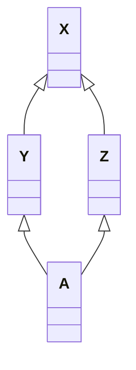

# Data语义学

<p align="right">—— The semantics of Data</p>

## 引入

> 在这一章中，类的数据成员以及类的层次结构式中心议题。一个类的数据成员，一般而言，可以表现这个类在程序执行时的某种状态。非静态数据成员（nonstatic data members）放置的是“个别的类对象”感兴趣的数据。静态数据成员（static data members）则放置的是所有类对象都感兴趣的数据。
>
> C++对象模型尽量以空间优化和存取速度优化的考虑阿里表现非静态数据成员。并且保持和C语言struct数据配置的兼容性。它把数据直接存放在每一个类对象之中。对于继承而来的非静态数据成员（不管是virtual还是nonvirtual base class）也是如此。不过并没有强制定义其间的排列顺序。至于static data members，则被放置在程序的一个global data segment中，不会影响到个别的类成员的大小。在程序之中，不管该类被产生出多少个成员（经由直接产生或间接派生），static data members永远只存在一份实例。***甚至在该类没有任何对象实例的时候，其static data member就已经存在***。但是一个template class的static data mebers的行为稍有不同，在第七章讨论。

考虑下面的代码，并考虑他们的`sizeof()`结果：

```c++
class X {};
class Y : public virtual X {};
class Z : public virtual X {};
class A : public Y, public Z {};
```



上述X、Y、Z、A中没有任何一个class中含有明显的数据，其间只表示了继承关系。但是需要注意的是，哪怕是`X`，其大小都不为0。

> ***注：***
>
> 这里的测试结果由：
>  OS: 64bit macOS         13.0.1         22A400
>  Kernel: arm64 Darwin 22.1.0
>
> g++版本：
>
>  Apple clang version 14.0.0 (clang-1400.0.29.202)
>  Target: arm64-apple-darwin22.1.0
>  Thread model: posix
>  生成。此处已经启用了下文提到的empty virtual base class优化。
>
> 
>
> 同时需要注意的是，本机是64位机，指针大小为8Byte，测试机为32位机，指针大小为4Byte。下文的笔记直接来自于书本，没有结合我的测试结果做分析。

```
// 我的测试结果
Sizeof class X: 1
Sizeof class Y: 8
Sizeof class Z: 8
Sizeof class A: 16

// 书的测试结果
Sizeof class X: 1
Sizeof class Y: 8
Sizeof class Z: 8
Sizeof class A: 12
```

首先，`X`的大小为1个Byte，那是被编译器安插进去的一个char。这使得这一class的任意对象都得以在内存中配置独一无二的地址。

其次是类`Y`和`Z`的大小。事实上，`Y`和`Z`的大小受到三个因素的影响：

1. **语言本身造成的额外负担（overhead）**：当语言支持virtual base classes时，就会导致一些额外负担。在derived class中，这个额外负担反应在某种形式的指针身上，它或者指向virtual base class subobject，或者指向一个相关表格；表格中存放的若不是virtual base class subobject的地址，就是其偏移地址（offset）。

2. **编译器对于特殊情况所提供的优化处理**。虚基类的1个Byte的大小也会出现在派生类`Y`和`Z`上。传统它被放在派生类的固定部分的尾部。某些编译器会对empty virtual base class提供特殊支持，这部分内容在下面展开。

3. **Alignment的限制。**类`Y`和`Z`的大小到目前为止是4个字节（一个Byte的char和4个Byte的虚基类指针）。在大部分机器上，聚合的结构体大小会受到alignment的限制，使它们能够更有效率地在内存中被存取。通常，alignment的大小为4个字节，因此最终得到的结果是8 Bytes。

    > alignment就是将数值调整到某数的整数倍，以使bus的运输量达到最高效率

Empty virtual base class已经称为C++ OO设计的一个特有术语了。它提供一个virtual interface。没有定义任何数据。某些新近的编译器对此提供了特殊的处理。在这个策略之下，一个empty virtual base class被视为derived class object最开头的一部分。也就是说它没有花费任何的空间。

这就节省了上文中提到的一个Byte的空间，也就不需要第三点提到的3Byte的填补。在这个模型下，`Y`和`Z`的大小都是4而不是8。

> 编译器之间的潜在差异正说明了C++对象模型的演化。这个模型为一般情况提供了解决之道。当特殊情况逐渐被挖掘出来的时候，种种启发（尝试错误）法于是被引入，提供优化的处理。
>
> 如果成功，启发法于是就提升为普遍的策略，并跨越各种编译器而合并。它被视为标准（虽然它并不为规范为标准），久而久之也就成了语言的一部分。
>
> Virtual function table就是一个好例子，另一个例子是前面提到的NRV优化。

那么，我们期望A的大小是多少呢？很显然，某种程度上我们需要根据我们使用的编译器而决定。首先，我们考虑没有进行过empty virtual base class优化的编译器。

来自虚基类的一个char，分别来自两个类的虚基类指针，因此大小为：
$$
1 Byte + 4 Byte + 4 Byte = 9Byte \to 12Byte
$$
如果我们考虑进行了优化的编译器，那么大小就是8Byte。

***注意，如果我们在虚基类中放置了一个及以上的数据成员，两种编译器就会产生出完全相同的对象布局。***

C++标准并不强制规定如“base class subobjects的排列顺序”或“不同存取层级的data members的排列顺序”这种琐碎细节。它也不规定virtual functions或virtual base class的实现细节。C++标准只说：那些细节由各家厂商自定。***因此在阅读的时候，需要区分“C++标准规定”和“目前的C++实现标准”两种讨论。***

总而言之，一个类对象的大小之所以有时会让你大吃一惊，原因是：

1. 由编译器自动加上的额外数据成员，用以支持某些语言特性
2. 因为alignment（边界调整）的需要。

## Data Member的绑定（The Binding of a Data Member）

考虑下面这段代码：

```c++
extern float x;

class Point3d
{
public:
	Point3d(float, float, float);
    // 问题：被传回的是哪一个x？
    float X() const { return x; }
    void X(float new_x) const { x = new_x; }
    // ...
private:
    float x, y, z;
};
```

在今天看来，我们所有人都会认为，`Point3d::X()`返回的一定是类内的成员`x`。这个答案是正确的，但并不是从过去以来都是正确的。

在C++最早的编译器上，如果在`Point3d::X()`的两个函数实例中做出参阅（取用）操作，该操作将会指向全局变量`x`。这样的绑定结果几乎不在大家的预期中。出于这样的原因，早期C++衍生出了两种防御性程序设计风格：

1. 把所有的数据成员都放在class声明的起始处，以确保正确的绑定：

    ```c++
    class Point3d
    {
    	// 防御性程序风格 #1
        // 在class声明起始处先放置所有的数据成员
        float x, y, z;
    public:
        float X() const { return x; }
    };
    ```

2. 把所有的内联函数（inline function），不管大小，都放在class声明之外：

    ```c++
    class Point3d
    {
    public:
        // 防御性程序设计风格 #2
        // 把所有的inlines都转移到class之外
        Point3d();
        float X() const;
        void X( float ) const;
    };
    
    inline float Point3d::X() const
    {
        return x;
    }
    ```

这些程序设计风格事实上到今天还仍然存在，虽然事到如今已经不再需要。这个古老的语言规则被称为“member rewriting rule”，大意是“一个inline函数实体，在整个class声明未被完全看见之前，是不会被评估求值（evaluated）的”。C++ standard以“member scope resolution rules”来精炼这个规则，其效果是，如果一个inline函数在类声明之后立刻被定义的话，那么就还是对其评估求值（evaluate）。也就是说，当一个人写下以下的代码：

```c++
extern int x;

class Point3d
{
	// 对于函数本体的分析将延迟，直至
    // class声明的右大括号出现才开始
    float X() const { return x; }
private:
    float x;
    // ...
};

// 事实上，分析在这里进行
```

对成员函数本体的分析，会直到整个类的声明都出现了才开始。因此在一个inline member function躯体之内的一个数据成员绑定操作，会在一个类声明完成之后才会进行。

然而，上述讨论对于成员函数的参数列表（argument list）并不为成立。Argument list中的名称还是会在它们第一次被编译器读取到的时候被适当地决议（resolved）完成。因此在extern和nested type names之间的非直觉绑定操作还是会发生。

举个例子，在下面的这个例子中，`length`的类型在两个成员函数签名（member function signatures）中都被决议（resolve）为global typedef，也就是`int`。当后续再有`length`的nested typedef声明出现的时候，C++ standard就把稍早的绑定标识为非法：

```c++
typedef int length;

class Point3d
{
public:
    void mumble(length val) { _val = val; }
    length mumble() { return _val; }
	// ...
private:
    // length必须在“本类对它的第一个参考操作”之前被看见
    // 这样的声明将使之前的参考操作不合法
    typedef float length;
    length _val;
};
```

上述这个语言状况，仍然需要某种防御性的程序设计风格：***请总是把“nested type声明”放在类的起始处。***在上面的例子中，如果把`length`的nested typedef定义于“在class中被参考”之前，就可以确保非直觉绑定的正确性。

## Data Member的布局（Data Member Layout）

已知下面一组data members:

```c++
class Point3d
{
public:
    // ...
private:
    float x;
    static List<Point3d*>* freeList;
    float y;
    static const int chunkSize = 250;
    float z;
};
```

Nonstatic data members在类对象中的排序顺序将和其被声明的顺序一样，任何中间介入的static data members如`freeList`和`chunjSize`都不会被放进对象布局之中。在上述例子里，每一个`Point3d`对象是由三个`float`组成的，顺序是`x / y / z`。static data members存放在程序的数据段（data segment）中，和个别的类对象无关。

C++ standard要求，在同一个access section（也就是`private`, `public`和`protected`等区段）中，members的排列只需符合“较晚出现的成员在类对象中有较高的地址”这一条件即可。也就是说，各个成员并不一定得连续排列。什么东西可能会介于被声明的成员之间呢？答案是边界调整（alignment）。

编译器还可能会合成一些内部使用的数据成员，以支持整个对象模型。vptr就是这样的东西，目前所有的编译器都把他安插在每一个“内含virtual function的类”的成员内。vptr会被放在什么位置呢？传统上它被放在所有显式声明的成员的最后。不过如今也有一些编译器把vptr放在一个类对象的最前端。

> 个人注：
>
> 在Darwin、Centos和Windows下编写下列测试代码：
>
> ```c++
> #include <iostream>
> 
> using namespace std;
> 
> struct Test
> {
> 	virtual void test() { }
> 	int i;
> };
> 
> int main()
> {
> 	Test t;
> 	cout << (reinterpret_cast<char*>(&t.i) - reinterpret_cast<char*>(&t)) << endl;
> }
> ```
>
> 最后的测试结果都为8，意即，在本人的测试下，vptr被放在了对象的起始。

C++秉承先前所说的“对于布局所持的放任态度”，允许编译器把那些内部产生出来的成员自由地放在任何位置上，甚至放在那些被程序员声明出来的成员之间。

C++ standard也允许编译器将多个access section之间的数据成员自由排布，比不在乎它们出现在类声明中的顺序。也就是说，下面这样的声明顺序：

```c++
class Point3d
{
public:
    // ...
private:
    float x;
    static List<Point3d*> *freeList;
private:
    float y;
    static const int chunkSize = 250;
private:
    float z;
};
```

其类对象的大小和组成都和之前的相同，但是成员的排列顺序由编译器决定。编译器可以随意把`y`或者`z`放在第一个，但是到目前为止，没有编译器会这么做。

目前编译器的做法都是把一个以上的access section连锁在一起（意即，把相同的访问层级的部分连接在一起），依照声明的顺序，成为一个连续区块。Access Section的多少并不会带来额外的负担。

下面这个函数用于判断在一个类中的两个成员谁先出现：

```c++
template <	class class_type,
			class data_type1,
			class data_type2 >
char*
access_order (
		data_type1 class_type::*mem1,
		data_type2 class_type::*mem2
		)
{
	assert (mem1 != mem2);
	return
		mem1 < mem2
			? "member 1 occurs first"
			: "member 2 occurs first";
}
```

## 3.3 Data Member的存取

> 已知下面这段程序代码：
>
> ```c++
> Point3d origin;
> origin.x = 0.0;
> ```
> 
> 	本小节将围绕`x`的存取成本展开。

`x`的存取成本取决于`x`如何声明。`x`可能是个static member，可能是个nonstatic member。Point3d可能是个独立（非派生）的类，也可能是从另一个单一的基类派生而来的；虽然可能性不高，但它甚至可能是从多继承或者是虚继承而来的。

### Static Data Members

静态数据成员，会被编译器提出类外，被视为一个全局变量（但只会在类的生命周期之内可见）。每一个成员的存取许可，以及与类的关联，并不会招致任何空间上或执行时间上的额外负担——不论是在个别的类对象还是在静态数据成员本身。

每一个静态数据成员只有一个实例，存放在程序的数据段中。每次程序参阅（取用）静态成员的时候，就会被内部转化为对该唯一`extern`实例的直接参考操作。

如果有两个类，每一个都声明了一个静态成员`freeList`，那么当它们都被放在程序的数据段时，就会导致名称冲突。编译器的解决方法是暗中对每一个静态数据成员编码（这种手法有个很美的名称——name-mangling），以获得一个独一无二的程序识别代码。有多少个编译器，就有多少种name-mangling做法。通常不外乎是表格、文法措辞等

任何name-mangling都有两个重点：

1. 一个算法，推导出独一无二的名称
2. 万一编译系统（或环境工具）必须和使用者交谈，那些独一无二的名称可以轻易被推导回到原来的名称

### Nonstatic Data Members

非静态数据成员直接存放在每一个类对象之中。除非经由显式（explicit）或隐式（implicit）类对象，否则没有办法直接存取它们。只要程序员在一个成员函数中直接处理一个非静态数据成员，所谓的隐式类对象就会产生。

想要对一个非静态数据成员进行存取操作，编译器需要把类对象的起始地址加上数据成员的偏移位置（offset）。

> 下面的测试用例为自己编写，书中的用例和解释与现在流行的编译器不同，不做采用。

例如：

```c++
#include <iostream>

using namespace std;

struct Test
{
	char c;
	short s;
	int i;
	double d;
};

int main()
{
	Test t;

	printf("Address of t: %p\n", &t);
	printf("Address of t.c: %p, address offset of c: %p\n", &t.c, &Test::c);
	printf("Address of t.s: %p, address offset of s: %p\n", &t.s, &Test::s);
	printf("Address of t.i: %p, address offset of i: %p\n", &t.i, &Test::i);
	printf("Address of t.d: %p, address offset of d: %p\n", &t.d, &Test::d);
}
```

运行结果为：

```
Address of t: 0x16d8f3120
Address of t.c: 0x16d8f3120, address offset of c: 0x0
Address of t.s: 0x16d8f3122, address offset of s: 0x2
Address of t.i: 0x16d8f3124, address offset of i: 0x4
Address of t.d: 0x16d8f3128, address offset of d: 0x8
```

每一个非静态数据成员的偏移位置（offset）在编译时期即可获知，甚至如何成员属于一个基类子对象也是如此。因此，存取一个非静态数据成员，其效率和存取一个C结构体成员或者一个非派生类的类的成员是一样的。

### 虚继承而来的数据成员

虚继承将为“经由基类子对象存取类成员”导入一层新的间接性（即多存取一次）。

对于下面的代码：

```c++
Point3d *pt3d;
Pt3d->_x = 0.0;
```

其执行效率在`_x`是一个结构体成员、一个类成员、单一继承、多重继承的情况下都是相同的。但如果`_x`是一个虚基类的成员，存取速度会稍慢一点。

> 对于这段话，我也存疑。
>
> 以下是我编写的测试代码：
>
> ```c++
> #include <cstdio>
> #include <iostream>
> 
> using namespace std;
> 
> struct Base
> {
> 	int i;
> };
> 
> struct Derive : virtual public Base
> {
> 
> };
> 
> struct Test
> {
> 	int i;
> };
> 
> int main()
> {
> 	Derive d;
> 	d.i = 1;
> 
> 	Test t;
> 	t.i = 1;
> 
> 	printf("Address of d: %p\n", &d);
> 	printf("Address of d.i: %p, address offset of i: %p\n", &d.i, &Derive::i);
> 	printf("Address offset of Base: %p\n", &Derive::Base::i);
> }
> ```
>
> 以下是运行结果：
>
> ```
> Address of d: 0x7ffc4eda2230
> Address of d.i: 0x7ffc4eda2238, address offset of i: (nil)
> Address offset of Base: (nil)
> ```
>
> 以下赋值语句的Linux反汇编码：
>
> ```assembly
> 0x0000000000400781 <+20>:	mov    DWORD PTR [rbp-0x8],0x1
> 0x0000000000400788 <+27>:	mov    DWORD PTR [rbp-0x20],0x1
> ```
>
> 可见，存取效率并无区别。

## 3.4 “继承”与Data Member

