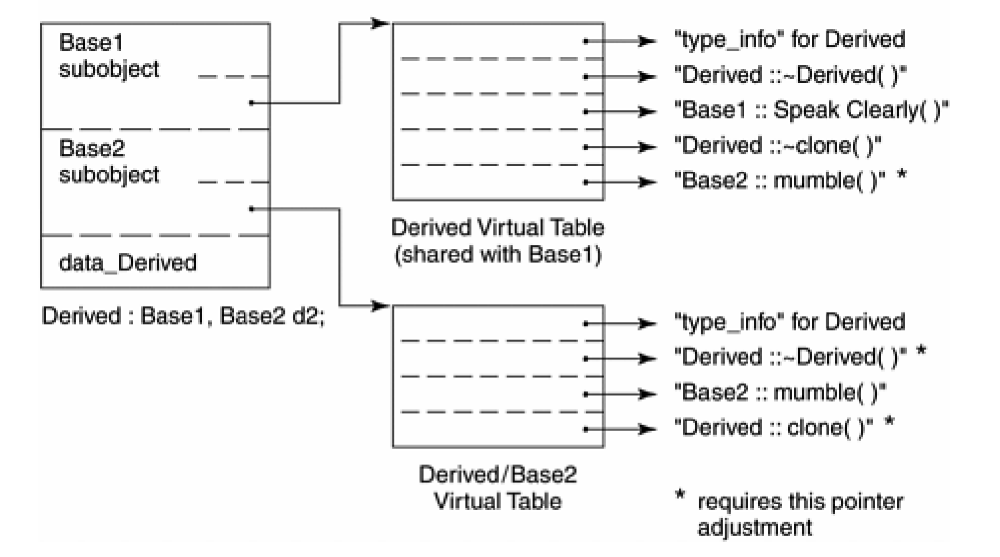
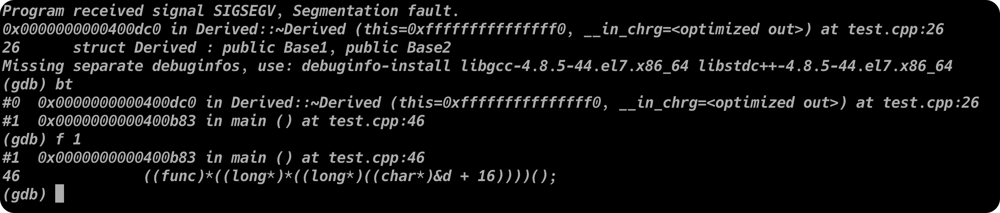

# Function语义学

<p align="right">——The Semantics of Function</p>

> C++支持三种类型的成员函数：static/nonstatic和virtual，每一种类型被调用的方式都不相同

[TOC]

## 4.1 Member的各种调用方式

> 回顾历史，原始的“C with classes”只支持非静态成员函数。Virtual函数是在20世纪80年代被加入的。Static member function是最后被引入的一种函数类型。

### Nonstatic Member Function(非静态成员函数)

C++的设计准则之一就是：非静态成员函数至少必须和一般的非成员函数有相同的效率。编译器在这其中对成员函数进行了一系列转化，使之最后效率能够和普通函数相媲美：

1. 改写函数签名，安插一个额外参数到成员函数中，用以提供一个存取管道，使类对象得以将此函数调用。该额外函数被称为`this`指针。
2. 将每一个“对非静态数据成员的存取操作”经由`this`指针来进行存取。
3. 将成员函数重新写成一个外部函数，将函数名称经过“manling”处理，使之在程序中成为独一无二的词汇

当然，对于返回值，还可能会有NRV优化。

#### 名称的特殊处理（Name Mangling）

一般而言，member的名称会被加上类的名称，形成独一无二的命名。

而由于成员函数可以被重载（overloaded），所以需要更广泛的mangling手法，以提供绝对独一无二的名称。通常的做法是在加上类的名称之后，再在函数名后面跟上参数列表的类型。（但是如果声明了`extern "C"`，就会抑制效果）

目前的编译器还没有统一的编码方法。

在目前的编译系统中，有一种所谓的demangling工具，用来拦截名称并将其转换回去。使用者可以仍然处于“不知道内部名称”的莫大幸福之中。

### Virtual Member Functions(虚成员函数)

如果`normalize()`是一个虚成员函数，那么以下调用：

```c++
ptr->normalize();
```

就会被内部转化为：

```c++
(*ptr->vptr[1])(ptr);
```

其中：

+ `vptr`表示虚函数表指针。
+ `1`是虚函数的下标，关联到`normalize`函数
+ 第二个`vptr`代表了`this`指针

如果虚成员函数被声明为`inline`，会更有效率。其决议（resolved）方式会和非静态成员函数一样，同时虚函数实例可以被扩展（expand）开来，提供极大的效率利益。

### Static Member Functions(静态成员函数)

静态成员函数的主要特性就是，它没有`this`指针。以下的次要特性统统源于其主要特性：

+ 它不能够直接存取其类中的非静态成员
+ 它不能够被声明为`const`/`volatile`/`virtual`
+ 它不需要经由成员被调用，即使我们可以使用普通成员函数的调用方式来调用它

像前文提到的一样，静态成员函数的名称也会经过mangling处理，例如`SFv`代表static member function,参数列表为`void`

如果去一个静态成员函数的指针，获得的将是其在内存中的入口地址。由于静态成员函数没有`this`指针，所以其地址的类型并不是一个“指向class member function的指针”，而是一个“非成员函数指针”。也就是说：

```c++
&Point3d::object_count();
```

会得到一个数值，其类型为：

```c++
unsigned int(*)();
```

而不是：

```c++
unsigned int (Point3d::*)();
```

由于静态成员函数在表现上像普通函数，它提供了一个意想不到的好处：成为一个callback函数。

## 4.2 Virtual Member Functions（虚拟成员函数）

为了支持虚函数机制，必须能够对于多态对象有某种形式的“执行期类型判断法（runtime type resolution）”。也就是说，对于以下调用，我们需要在执行期获取一些信息：

```c++
ptr->z();
```

如此一来才能找到并调用`z()`的适当实例。

最直截了当但成本最高的解决方法就是把必要的信息加载`ptr`身上。在这样的额策略之下，一个指针（或者一个引用）持有两项信息：

1. 它所参考的对象的地址
2. 对象类型的某种编码，或是某个结构的地址

这个方法带来两个问题：

1. 它明显增加了空间的负担，即使程序并不适用多态
2. 它打断了与C程序之间的兼容性

如果这份额外信息不能和指针放在一起，那么下一个考虑的地方就是把它放在对象本身。当我们调用一个虚函数的时候，我们如何在执行期调用正确的虚函数实例？我们需要知道：

+ 指针所指向对象的真实类型。这可以使我们选择正确的`z()`实例
+ `z()`实例的位置，这样可以让我们调用它

在实现上，首先我们可以在每一个多态的类成员身上增加两个成员：

1. 一个字符串或者数字，表示类的类型
2. 一个指针，指向某个表格，表格中持有程序的虚函数的执行期地址

表格中的虚函数地址如何被构建起来？在C++中，虚函数可以在编译器时期获知。此外，这一组地址是固定不可变的，执行期不可能新增或者替换之。由于程序执行时，表格的大小和内容都不会改变，所以其构建和存取可以由编译器完全掌控，不需要执行期的任何介入。

然而，在执行期准备好函数的地址，只完成了一半。另一半是我们如何找到这些地址：

1. 为了找到表格，每一个类对象被安插了一个由编译器内部产生的指针，指向该表格
2. 为了找到函数地址，每一个虚函数被指派一个表格索引值

这些工作都由编译器在完成，执行期要做的，只是在特定的虚函数表格中激活这些虚函数。这些被激活的虚函数包括：

+ 这一类所定义的函数实例。它会改写（overriding）一个可能存在的base class virtual function实例

+ 继承自base class得函数实例。这是在派生类决定不改写虚函数的时候才会发生的情况

+ 一个`pure_virtual_called()`函数实例，它既可以扮演pure virtaul function的空间保卫者角色，也可以当做执行期异常处理函数（有时候会用到）

    > `pure_virtual_called()`是一个 C++ 的标准库函数，它用于抛出一个 `std::bad_function_call` 异常。这个函数通常用在纯虚函数的默认实现中，当调用纯虚函数时，会导致程序抛出异常。

******

> 经过个人测试，虚函数表的地址是一样的，也就是说，对于同一个类的对象，虚函数表只有一张：
>
> ```c++
> #include <iostream>
> 
> using namespace std;
> 
> struct Test
> {
> 	virtual void test() { cout << "test" << endl; }
> };
> 
> int main()
> {
> 	Test t1, t2;
> 
> 	typedef void(*func)();
> 
> 	func f_test = (func)*((long*)*(long*)(&t1));
> 	f_test();
> 
> 	printf("vtbl address of t1: %p\n", (void*)*(long*)(&t1));
> 	printf("vtbl address of t2: %p\n", (void*)*(long*)(&t2));
> }
> ```
>
> 运行结果：
>
> ```
> test
> vtbl address of t1: 0x104b800f0
> vtbl address of t2: 0x104b800f0
> ```

每一个虚函数都被指派一个固定的索引值，这个索引在整个继承体系中保持与特定的虚函数的关系。

当一个类派生自一个带有虚函数的类的时候，有三种可能的情况：

1. 它可以继承基类中所声明的虚函数的函数实例。正确的说法是，该函数实例的地址会被拷贝到派生类的虚函数表的相对应的表格之中
2. 它可以使用自己的函数实例。
3. 它可以加入一个新的虚函数。这时候虚函数表的尺寸会增大，而新的函数实例地址会被放进该表格中

******

现在，如果我们有这样的式子：

```c++
ptr->z();
```

我们应该有如何的知识在编译时期设定虚函数的调用呢？

+ 一般而言，每次调用`z()`时，我们并不知道`ptr`所指对象的真正类型。然而我们知道，经由`ptr`可以存取到该对象的虚函数表
+ 虽然我们不知道哪个`z()`函数实例会被调用，但我们知道每一个`z()`函数地址都被放在一个固定的slot中

于是，这些信息使得编译器可以将该调用转化为：

```c++
(*ptr->vptr[4])(ptr);
```

在一个单一继承体系中，虚函数机制的行为十分良好，不但有效率而且非常容易模塑模型。但在多继承和虚继承中，事情就没有那么美好了

### 多重继承下的Virtual Functions

在多重继承中支持虚函数，其复杂度围绕在第二个及以后的类上，以及必须在“执行期调整`this`指针”这一点。以下面的类为例：

```c++
class Base1 
{
public:
    Base1();
    virtual ~Base1();
    virtual void speakClearly();
    virtual Base1 *clone() const;
protected:
    float data_Base1;
};

class Base2
{
public:
    Base2();
    virtual ~Base2();
    virtual void mumble();
    virtual Base2 *clone() const;
protected:
    float data_Base2;
};

class Derived : public Base1, public Base2
{
public:
    Derived();
    virtual ~Derived();
    virtual Derived *clone() const;
protected:
    float data_Derived;
};
```

"`Derived`支持虚函数"的困难度，全部都在`Base2`的subobject身上。有三个问题需要解决，对于本例来说，分别是：

1. 虚析构函数
2. 被继承下来的`Base2::mumble()`
3. 一组`clone()`实例

******

考虑这样的代码：

```c++
Base2 *pbase2 = new Derived;
```

新的`Derived`对象的地址必须调整以指向其`Base2`subobjec。编译时期会产生一下的代码：

```c++
// C++伪代码
Derived *temp = new Derived;
Base2 *pbase2 = temp ? temp + sizeof(Base1) : 0;
```

如果没有这样的调整，指针的任何“非多态运用”都将失败：

```c++
pbase2->data_Base2;
```

当程序员要删除`pbase2`所指向的对象时：

```c++
// 首先必须调用正确的virtual destructor函数实例
// 然后施行delete运算符
// pbase2可能需要调整，以指向完整对象的起始点
delete pbase2;
```

指针必须被再次调整，以求再一次指向`Derived`对象的起始处（推测它还指向`Derived`对象）。然而上述的`offset`加法却不能够在编译时期直接设定，因为`pbase2`所指的真正对象只有在执行期才能确定。

一般规则是，经由指向“第二或后继的基类”的指针（或引用）来调用派生类的虚函数。其所连带的必要的“this指针调整”操作，必须在执行期完成。也就是说，offset的大小，以及把offset加到`this`指针上头的那一小段程序代码，必须由编译器在某个地方插入。问题是，在哪个地方？

为了解决这个问题，需要使用所谓的"Thunk"技术。所谓thunk是一小段汇编代码，用来：

1. 以适当的offset值来调整`this`指针
2. 跳到虚函数中去

******

接下来考虑这样的代码：

```c++
Base1 *pbase1 = new Derived;
Base2 *pbase2 = new Derived;

delete pbase1;
delete pbase2;
```

虽然两个`delete`操作调用相同的`Derived`destructor，但他们需要两个不同的虚函数表格：

1. `pbase1`不需要调整`this`指针。其虚函数表中对应的格子应当防止真正的析构函数地址
2. `pbase2`需要调整`this`指针。其虚函数表格中需要相关的thunk地址。

在多重继承下，一个派生类会有$n - 1$个额外的虚函数表。$n$代表其上一层基类的个数（因此，单一继承将不会有额外的虚函数表）。对于本例的`Derived`而言，会有两个虚函数表被编译器产生出来：

1. 一个主要实例，与`Base1`共享
2. 一个次要实例，与`Base2`共享

针对每一个虚函数表，`Derived`对象中由对应的vptr。当然，虚函数表指针的名称也将经历mangling。

于是，当我们将一个`Derived`对象地址指定给一个`Base1`指针或者`Derived`指针的时候，被处理的虚函数表是主要表格`vtbl_Derived`。而当我们将一个`Derived`对象地址指定给一个`Base2`指针的时候，被处理的虚函数表是次要表格`vtbl_Base2_Derived`。



> 以下是个人的测试：
>
> ```c++
> #include <cstdio>
> #include <iostream>
> 
> using namespace std;
> 
> struct Base1
> {
> 	Base1() = default;
> 	virtual ~Base1() = default;
> 
> 	virtual void test() { cout << "Base1::test" << endl; };
> 
> 	int val_base1;
> };
> 
> struct Base2
> {
> 	Base2() = default;
> 	virtual ~Base2() = default;
> 
> 	virtual void test() { cout << "Base2::test" << endl; };
> 
> 	int val_base2;
> };
> 
> struct Derived : public Base1, public Base2
> {
> 	virtual void test() { cout << "Derived::test" << endl; }
> 
> 	int val_derived;
> };
> 
> int main()
> {
> 	Derived d;
> 
> 	cout << "Address of d: " << &d << endl;
> 	cout << "sizeof Derived: " << sizeof(Derived) << endl;
> 	printf("Address of d.val_base1: %p\toffset of val_base1: %p\n",&d.val_base1, &Derived::val_base1);
> 	printf("Address of d.val_base2: %p\toffset of val_base2: %p\n",&d.val_base2, &Derived::val_base2);
> 	printf("Address of d.val_derived: %p\toffset of val_derived: %p\n",&d.val_derived, &Derived::val_derived);
> 
> 	typedef void (*func)();
> 
>     d.test();
> 	((func)*((long*)*(long*)&d))();
> 	((func)*((long*)*((long*)((char*)&d + 16))))();
> }
> ```
>
> 在不考虑最后两行的情况下，运行结果为 ：
>
> ```
> Address of d: 0x16b54f110
> sizeof Derived: 32
> Address of d.val_base1: 0x16b54f118	offset of val_base1: 0x8
> Address of d.val_base2: 0x16b54f128	offset of val_base2: 0x8
> Address of d.val_derived: 0x16b54f12c	offset of val_derived: 0x1c
> Derived::test
> ```
>
> 最后两行调用都会报错，使用gdb查看，发现都调用到了`Derived`的析构函数：
>
> 

而由于执行期链接器（runtime linkers）的降临（可以支持动态共享函数库），符号名称的链接可能变得非常缓慢。为了调节执行期链接器的效率，也有的编译器采用将多个虚函数表链接为一个的方法。而取用次要表格，则可以通过主要表格和一个偏移值获得次要表格的指针。在这样的策略下，每个类只有一个具名的虚函数表。

******

前面提到，有三种情况，第二或后继基类会影响对虚函数的支持。第一种情况是，通过“指向第二个基类”的指针，调用派生类的虚函数。

> 以下是利用上面的类声明编写的测试代码：
>
> ```c++
> int main()
> {
> 	Derived d;
> 	Base2 *ptr = &d;
> 
> 	printf("Address of d: %p\n", &d);
> 	printf("Value of ptr: %p\n", ptr);
> }
> ```
>
> 以下是测试结果：
>
> ```
> Address of d: 0x16dd37108
> Value of ptr: 0x16dd37118
> ```

例如：

```c++
Base2 *ptr = new Derived;
delete ptr;
```

根据前面的声明，我们可以发现，为了正常地调用函数，`ptr`必须调整指向`Derived`对象的起始处。

第二种情况是第一种情况的变化，通过一个“指向derived class”的指针，调用第二个基类中一个继承而来的虚函数。在这种情况下，derived class指针必须再次调整，以指向第二个基类的子对象。

第三种情况发生于一个语言扩充性质之下：允许一个虚函数的返回值类型有所变化，可能是base type，也可能是publicly derived type。

### 虚继承下的虚函数

> 看不懂，跳过

## 4.3 函数的效能

在优化的情况下：

1. 内联函数的效率最高，友元函数、静态成员函数和普通成员函数次之，接下来依次是虚成员函数、多重继承下的虚成员函数、虚继承下的虚函数
    + 内联函数给了程序优化的额外机会
    + 多重继承的虚函数调用，之所以会消耗较多的时间，主要的问题在于，每多一层继承，需要调用的构造函数就多一层

## 4.4 指向成员函数的指针（Pointer-to-Member Functions）

在上一章已经看到，去一个非静态数据成员的地址，得到是这个成员在class布局中的偏移量。我们可以形象这是一个不完整的值，只有绑定到具体的对象之后，才能被存取。

取一个非静态成员函数的地址，如果这个函数是非虚函数，得到的结果是它在内存中的真正的地址。然而这个地址也是不完全的，需要被绑定在某个确切的函数对象的地址上，才能够通过它调用函数。所有的非静态成员函数都需要对象的地址（`this`）。

回顾一下，一个指向成员函数的指针，需要这样来声明：

```c++
double (Point::*pmf)();
```

然后我们可以这样定义并初始化指针：

```c++
double (Point::*coord)() = &Point::x;
```

想要调用它，可以这么做：

```c++
(origin.*coord)();
(ptr->*coord)();
```

这些操作会被编译成：

```c++
// 虚拟C++代码
(coord)(&origin);
(coord)(ptr);
```

指向成员函数的指针的声明语法，以及指向“member selection运算符”的指针，其作用是作为`this`指针的空间保留者。这也就是为什么静态成员函数（没有`this`）的类型是“函数指针”，而不是“指向成员函数的指针”的原因。

**使用一个“成员函数指针”，如果并不用于虚函数、多重继承、虚基类等情况的话，并不会比使用一个非成员函数指针的成本更高。**上述三种情况对于“成员函数指针”的类型以及调用都太过复杂。事实上，对于那些没有虚函数、虚基类或者多继承的类来说，编译器可以为他们提供相同的效率。

### 支持“指向Virtual Member Functions”的指针

考虑这样的程序片段：

```c++
float (Point::*pmf)() = &Point::z;
Point *ptr = new Point3d;
```

`pmf`，一个指向成员函数的指针，被设置为`Point::z()`（一个虚函数）的地址。`ptr`则被指定以一个`Point3d`对象。如果我们直接通过`ptr`调用`z()`：

```c++
ptr->z();
```

被调用的是`Point3d::z()`，但是如果我们从`pmf`间接调用`z()`呢？

```c++
(ptr->*pmf)();
```

仍然是`Point3d::z()`被调用吗？也就是说，虚拟机制仍然能够在使用“指向成员函数的指针”的情况下运行吗？答案是yes，问题是如何实现的呢？

在前面的论述中，我们看到了，对一个非静态成员函数取地址，获得的是该函数在内存中的地址。然而对一个虚函数，其地址在编译时期是未知的，所能知道的仅仅是虚函数在其相关虚函数表中的索引值。也就是说，***对一个virtual member function取其地址，所能获得的仅仅是一个索引值。***

对一个“指向成员函数的指针”评估求值（evaluated），会因为该值有两种意义而复杂化；其调用操作也将有别于常规调用操作。`pmf`的内部定义，也就是：

```c++
float (Point::*pmf)();
```

必须允许此函数能够寻址出nonvirtual `x()`和virtual `z`两个成员函数。而那两个函数有着相同的函数类型：

```c++
float Point::x() { return _x; }
float Point::z() { return 0; }
```

只不过其中一个代表内存地址，另一个代表虚函数表中的索引值。因此，编译器必须定义`pmf`，使它：

1. 能够持有两种数值
2. 更重要的是其数值能够被区别代表内存地址还是虚函数表中的索引值。

在cfront2.0非正式版中，这两个值被包含在一个普通的指针内。cfront如何识别该值是内存地址还是虚函数表的索引呢？

```c++
(((int) pmf ) & ~127)
	?	// non-virtual invocation
    (*pmf)(ptr)
    :	// virtual invocation
	( *ptr->vptr[ (int) pmf ]( ptr ) );
```

> 当然啦，这种实现技巧必须假设继承体系中最多只有128个虚函数。这并不是我们希望的，但是证明是可行的。然而，多重继承的引入，导致需要更多一般化的实现模式，并趁机除去virtual functions的个数限制。

### 在多重继承之下，指向Member Functions的指针

> 读不懂，下一个

### “指向Member Functions指针”的效率

在优化的前提下：

1. 指向非成员函数的指针、指向普通成员函数的指针、多重继承下指向普通成员函数的指针效率相同且最高
2. 虚继承下的普通函数指针和非虚继承下的虚函数指针效率相同
3. 多重继承下的虚函数、虚拟继承下的虚函数效率最低

