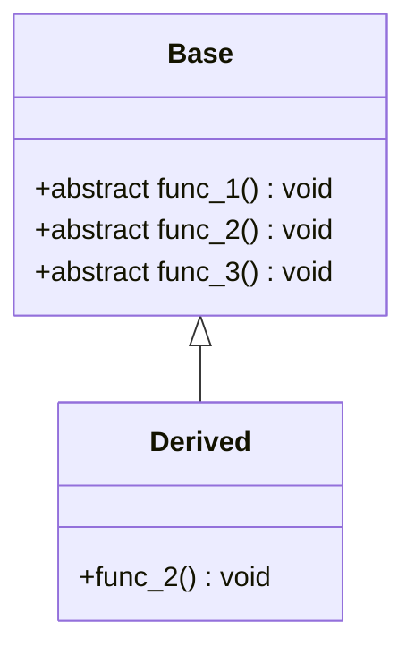
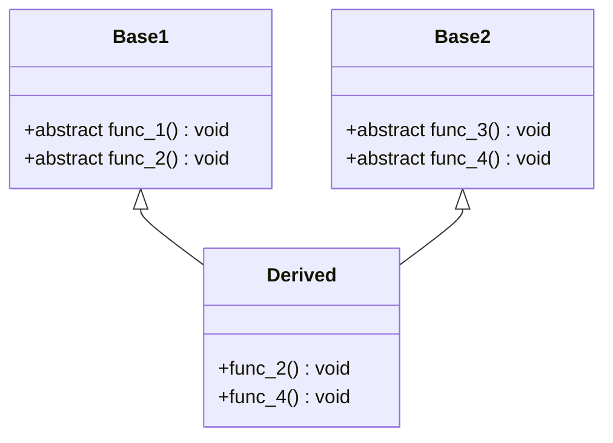

[TOC]

# 1	虚函数表指针位置分析

> 如果一个类中有虚函数，则针对这个类会产生一个虚函数表
>
> **注：基于不同的实验平台，实验的结果可能不同，但是核心思想是相同的**
>
> ```shell
> > g++ -v
> Apple clang version 14.0.0 (clang-1400.0.29.202)
> Target: arm64-apple-darwin22.1.0
> Thread model: posix
> InstalledDir: /Library/Developer/CommandLineTools/usr/bin
> ```

生成虚函数表的时候，该对象中就会有一个虚函数表指针用来指向这个虚函数表的起始地址。这个指针可以看成类中的成员变量，也占一定的字节数（一般是4字节或8字节）。通常会将这个这个指针存放在对象的开头或者末尾。

参考下面的代码：

[***1_where_is_virtual_funcPointer.cpp***](./1_virtualFunctionCodes/1_where_is_virtual_funcPointer.cpp)

```c++
#include <cstdio>
#include <iostream>

using namespace std;

class Normal
{
        long data;
};

class Virtual
{
public:
        long data;
        virtual void func() { cout << "I'm virtual class" << endl; }
};

int main()
{
        printf("size of class Normal: %zu\n", sizeof(Normal));
        printf("size of class Virtual: %zu\n", sizeof(Virtual));
        Virtual v;
        printf("Offset of member data: %zu\n", reinterpret_cast<char*>(&(v.data)) - reinterpret_cast<char*>(&v));
}
```

在上面的代码中，我们使用了一个不包含虚函数的类`Normal`和一个包含虚函数的类`Virtual`。

以下是运行结果：

```
size of class Normal: 8
size of class Virtual: 16
Offset of member data: 8
```

于是我们可以引出关于虚函数指针的第一个性质：

<center><b><i>===== 虚函数指针位于对象内存的开头。 =====</i></b></center>

对于Windows，Linux和Darwin，他们都位于对象内存的开头，对于其他平台，可以使用上面的方法验证。

# 2	继承关系作用下虚函数的手动调用

> 使用虚函数表指针调用虚函数

> 具体代码：[***2_call_parent_virtual_func.cpp***](./1_virtualFunctionCodes/2_call_parent_virtual_func.cpp)

考虑如下两个类：



首先，我们观察两个类的大小：

```c++
printf("size of class Base: %zu\n", sizeof(Base));
printf("size of class Derived: %zu\n", sizeof(Derived));
```

运行结果：

```
size of class Base: 8
size of class Derived: 8
```

******

接下来，我们分析两个类的虚函数表。

我们的思路是，首先获得一个`Base`类对象的虚函数表指针和一个`Derived`类对象的虚函数表的指针，然后打印表中的前三个表项，来观察他们的地址。

说白了，这样我们就可以对比两个虚函数表的表项：

```c++
vptr vptr_base = reinterpret_cast<vptr>(new Base());		// 对象指针
vptr vptr_derived = reinterpret_cast<vptr>(new Derived());		// 对象指针

vptr virtual_table_base = reinterpret_cast<vptr>(*vptr_base);		// 虚函数表指针
vptr virtual_table_derived = reinterpret_cast<vptr>(*vptr_derived);		// 虚函数表指针
```

然后我们去打印前三个指针的指即可：

```c++
The first 3 items in the virtual function table in class Base:
table[0]: 0x100b0af74	// <---------- Base::func_1 函数入口地址
table[1]: 0x100b0afbc	// <---------- Base::func_2 函数入口地址
table[2]: 0x100b0b004	// <---------- Base::func_3 函数入口地址
The first 3 items in the virtual function table in class Derived:
table[0]: 0x100b0af74	
table[1]: 0x100b0b090	// <---------- Derived::func_2 函数入口地址
table[2]: 0x100b0b004
```

可以看到，`Derived`类的`func_1()`和`func_3()`函数的入口地址是一样的。而由于我们在`Derived`类中重写了函数`func_2()`，所以其入口地址不同。

******

接下来，我们尝试去调用这些函数。

我们先对函数进行标记，以方便我们对调用的函数进行分辨：

```c++
#define BASE_CALL	cout << "Base::" << __func__ << endl; 
#define DERI_CALL	cout << "Derived::" << __func__ << endl;

class Base
{
public:
	virtual void func_1() { BASE_CALL; }
	virtual void func_2() { BASE_CALL; }
	virtual void func_3() { BASE_CALL; }
};

class Derived : public Base
{
public:
	void func_2() { DERI_CALL; }
};
```

然后我们可以开始调用：

```c++
cout << "Try to call virtual functions in class Base:" << endl;
for (int i = 0; i < 3; i++)
{
    (reinterpret_cast<void(*)()>(virtual_table_base[i]))();
}

cout << "Try to call virtual functions in class Derived:" << endl;
for (int i = 0; i < 3; i++)
{
    (reinterpret_cast<void(*)()>(virtual_table_derived[i]))();
}
```

运行结果：

```
Try to call virtual functions in class Base:
Base::func_1
Base::func_2
Base::func_3
Try to call virtual functions in class Derived:
Base::func_1
Derived::func_2
Base::func_3
```

# 3	虚函数表分析

> [***3_OO&OB.cpp***](./1_virtualFunctionCodes/3_OO&OB.cpp)

结合前面的运行结果，我们可以有以下分析：

1. 包含虚函数的类才会有虚函数表，同属于一个类的对象共享这个虚函数表，但是每个对象都有自己的虚函数指针，当然该指针所指向的地址（虚函数表的首地址）是相同的

    ```c++
    vptr d1 = reinterpret_cast<vptr>(new Derived());
    vptr d2 = reinterpret_cast<vptr>(new Derived());
    ```

    虽然`d1`和`d2`指向不同的地址（代表不同的对象），但是这两个地址中的前8个字节的内容相同，因为他们指向相同的虚函数表。

    ```c
    The address of virtual function table of derived1: 0x104048100
    The address of virtual function table of derived2: 0x104048100
    ```

2. 父类中有虚函数就等于子类中有虚函数。换句话说，父类中有虚函数表，那么子类中一定会有虚函数表，即使其不重写父类的任何虚函数。

    同样，***即使我们在子类中把父类中的虚函数全部重写，这些函数依然是虚函数***：

    ```c++
    class Derived : public Base
    {
    public:
        void func_1() {}
        void func_2() {}
        void func_3() {}
    };
    ```

    上面三个函数依然是虚函数。

3. 如果子类中完全没有新的虚函数，则可以认为子类的虚函数表和父类的虚函数表内容相同，但**仅仅是内容不同**，这两个表在内存中处于不同位置的。***换句话说，这是内容相同的两张表。***

4. 超出虚函数表部分的内存内容不可知也不可预测。最好的办法就是不要触碰其中的内容。

    我们可以在之前的基础上多打印几项，然后会发现，虚函数之前的地址差距较小，而超出的部分差距极大：

    ```c++
    The first 5 items in the virtual function table in class Base:
    table[0]: 0x1028eaf74
    table[1]: 0x1028eafbc
    table[2]: 0x1028eb004
    table[3]: 0x203235270	// <---------- 超出的部分地址差距极大
    table[4]: 0x80000001028ebead
    The first 5 items in the virtual function table in class Derived:
    table[0]: 0x1028eaf74
    table[1]: 0x1028eb090
    table[2]: 0x1028eb004
    table[3]: 0x2032352d8
    table[4]: 0x80000001028ebeb3
    ```

******

接下来，我们对比一下OO和OB在思想和代码实现上的区别：

+ 首先，我们知道对于C++，我们是通过类对象的指针和引用来支持多态的，这种程序设计风格就是常说的面向对象模型——OOM（Object Oriented Model）
+ 还有一种程序设计风格叫做基于对象（Object-Based），这种风格以前叫做抽象数据模型ADT（Abstract Datatype Model），这种模型不支持多态。因为函数调用的解析没有虚函数指针和虚函数表的概念、不需要运行决定（没有多态或者说没有虚函数），而是编译期间就解析完成，所以在这种模型下的对象运行速度更快，内存空间紧凑程度上更紧凑。但是显然OB的设计灵活性相较OO就要差一些。

那么在具体的实现是怎样实现的？

```c++
Derived derived;
Base base = derived;
Base* ptr_base = &derived;

printf("The address of virtual function table of derived: %p\n", (*((long*)&derived)));
    printf("In OO, the address of virtual function table of base: %p\n", (*((long*)ptr_base)));
    printf("In OB, the address of virtual function table of base: %p\n", (*((long*)&base)));
```

运行结果：

```c++
The address of virtual function table of derived: 0x10275c100
In OO, the address of virtual function table of base: 0x10275c100
In OB, the address of virtual function table of base: 0x10275c150
```


<center><b><i>C++既支持面向对象程序设计，也支持基于对象程序设计，继承机制和多态机制就摆在那里。不用，就是基于对象的程序设计；用了，就是面向对象的程序设计。弹性和效率方面如何使用，取决于程序员。</i></b></center>

# 4	多重继承虚函数表分析

> [***4_multiple inheritance.cpp***](./1_virtualFunctionCodes/4_multiple inheritance.cpp)

考虑这样的情况：



我们在每个虚函数中，令他们打印形如`类名::函数名`的信息。

我们首先观察他们的大小：

```
size of class Base1: 8
size of class Base2: 8
size of class Derived: 16
```

可以发现，派生类有两个虚函数表指针，也就是说，派生类`Derived`分别从`Base1`和`Base2`处继承了一张虚函数表。

我们可以进一步进行观察：

1. 打印三个类的虚函数表地址：

    ```c++
    The address of virtual function table of class Base1: 0x102380130
    The address of virtual function table of class Base2: 0x102380160
    The address of virtual function table 1 of class Derived: 0x102380190
    The address of virtual function table 2 of class Derived: 0x1023801b8
    ```

2. 打印三个类的虚函数表中的函数入口地址和调用结果：

    1. `Base1`

        ```
        Print all addresses of virtual functions in class Base1:
        0x10237e6fc
        0x10237e7ac
        Call all functions in class Base1:
        Base1::func_1
        Base1::func_2
        ```

    2. `Base2`

        ```
        Print all addresses of virtual functions in class Base2:
        0x10237ea8c
        0x10237eb3c
        Call all functions in class Base2:
        Base2::func_3
        Base2::func_4
        ```

    3. `Derived`

        我们首先打印两张表中的函数入口地址：

        ```
        Print all addresses of virtual functions in virtual function table 1 of class Derived: 
        0x10237e6fc	// <---------- 与父类Base1相同
        0x10237ec88	// <---------- 与父类Base1不同
        Print all addresses of virtual functions in virtual function table 2 of class Derived: 
        0x10237ea8c	// <---------- 与父类Base2相同
        0x10237ede8	// <---------- 与父类Base2不同
        ```

        可以看到，我们确实有两张表，第一张表来自`Base1`，第二张表来自`Base2`。同时，由于我们在派生类`Derived`中重写了`func_2()`和`func_4()`，这两个函数的入口地址与父类不同（也就是不是同一个函数）；而其他函数因为继承自父类，故而入口函地址相同。

    ******

经过上面的分析，我们可以得到以下结论：

<center><b><i>一个类，如果它继承自多个类，那么有多个虚函数表指针。<br/>在多继承中，对应各个基类的虚函数表指针按照继承顺序依次放置在类内存空间中。</i></b></center>
