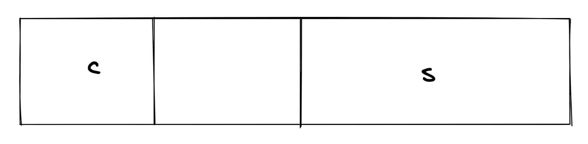
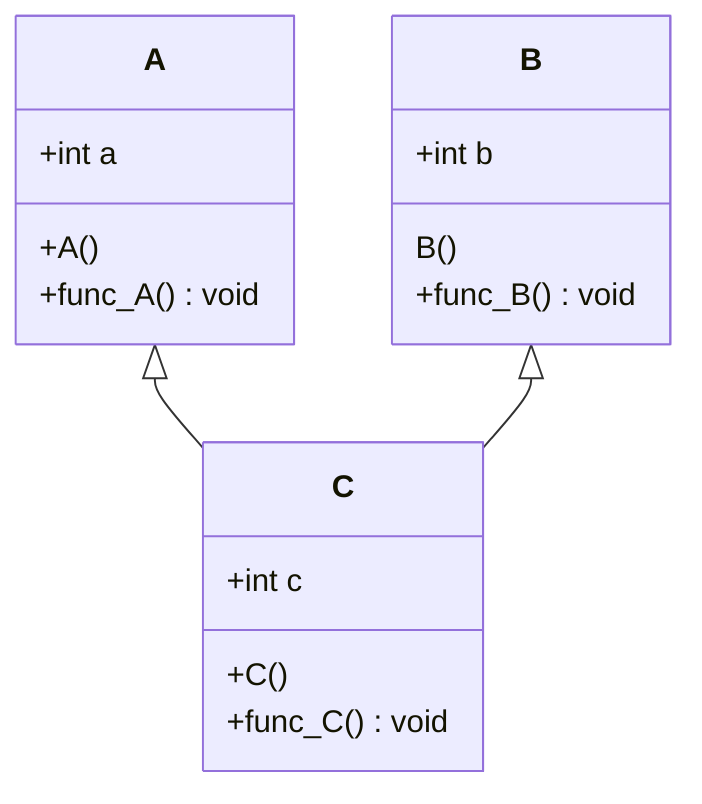
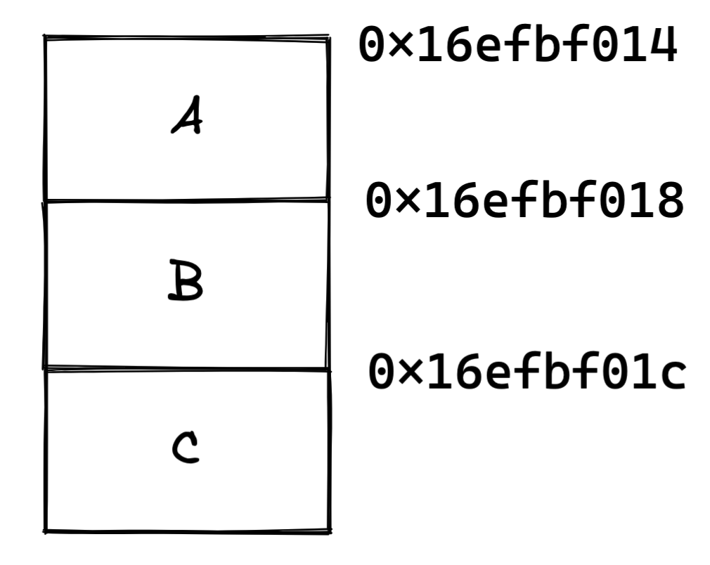

[TOC]

> 类对象所占用的空间问题
>
> 多重继承下的`this`的调整
>
> 三大构造函数的语义
>
> ...

# 1 	类对象所占用的空间

## 1 类对象的最小占用空间

考虑如下代码：

```c++
#include <iostream>
#include <ostream>

using namespace std;

class A
{
public:
};

int main()
{
	A a;
	cout << "size of object of class A: " << sizeof(a) << endl;
}
```

运行结果为：

```
size of object of class A: 1
```

为什么`sizeof(a)`的结果是1？

由于`a`是一个对象，那么它在内存中就一定有自己的栖身之所。换言之，我们使用`&a`得到的地址，一定就是对象`a`的内存的起始地址。但是，`a`中因为没有任何的数据对象，我们又需要分配一定的空间，所以我们就分配了能够分配的最小单元：1Byte。

## 2 类成员函数所占的内存空间

考虑如下代码：

```c++
#include <iostream>

using namespace std;

class A
{
	public:
		void func() {}
		void func_1() {}
		void func_2() {}
};

int main()
{
	cout << "size of object of class A: " << sizeof(A) << endl;
}
```

以下是运行结果：

```
size of object of class A: 1
```

由此我们可以得出一个结论：***类中的成员函数不占用类对象的内存空间。***但是需要注意的是，成员函数并非不占用内存空间，而是不占用“类对象”的内存空间。成员函数被定义在代码段。

## 3 类成员变量所占的内存空间 & 内存对齐

考虑如下类：

```c++
class A
{
	char c;
};
```

它的大小是多大？结论是显而易见的：1

******

那么，我们接下来对`A`增添一点数据成员：

```c++
class A
{
	char c;
	short s;
};
```

接下来，它的大小是多少呢？答案是4。

在我们的想象中，`s`在内存中会贴着`c`存放，但是事实并非如此。在`c`和`s`之间会有1Byte的填充。也就是说，真实的排布是这样的：

<center></center>

至于为什么要这样排布，出于两点考虑。我们在内存中通常不以一个奇数地址进行数据存取，有的是因为CPU不支持这样的操作，有的是因为可以这样操作，但是反而会导致存取效率降低。所以，为了保证代码的适用性和一定的效率，我们采取了这样的填充方法，而这样的方法叫做“内存对齐”。

只有在追求极致的内存利用的时候，我们会通过`#pragma pack(n)`来修改对齐值。这个值指的是我们对齐的时候的单位。

换言之，对于这样的类：

```c++
class A
{
	char c1;
	int i;
	char c2;
};
```

+ 假如对齐值为1，那么类的大小是6

+ 假如对齐值为2，那么类的大小是8
    $$
    c1占用2Byte，i被分为2 * 2Byte，c2同c1
    $$

+ 假如对齐值为4，那么类的大小是12

******

以上的讨论给了我们一些启发，例如我们在设计类数据成员的时候，尽量将小的数据成员定义在一起，这样可以有效地节省内存空间。

## 总结

1. 成员函数虽然定义在类中，但是其不占用对象的内存空间。
2. 成员变量包含在每个对象中，固定占用内存空间。
3. 使用`#pragma pack(n)`来设置内存对齐的方式

# 2	对象结构的发展和演化

> 当前采用的C++对象模型是什么样子的

## 1. 非静态的成员变量跟着对象走

所谓非静态的成员变量跟着对象走，指的是非静态的成员变量保存在对象的内部。

## 2. 静态成员变量跟对象没有什么关系

静态成员跟对象没有什么关系，所以不会保存在对象内部，而是保存在对象外面。

## 3. 成员函数

不管是***静态的***还是***非静态的***，全部都保存在类对象之外。

## 4. 虚函数

一个类中只要有虚函数，对象的大小就会增加4字节。这4个字节用于存放一个指针，这个指针指向了对象的虚函数表，而虚函数表中存放了这个类的所有虚函数的入口地址。

## 总结

1. 静态成员变量不计算在对象的大小内
2. 所有成员函数都不计算在对象的大小内
3. 虚函数不计算在对象的大小内，但是对象的大小会增加4字节以容纳虚函数表指针
4. 虚函数表基于类，而不是基于对象
5. 类中存在内存对齐
6. 所有指针的大小是固定的（4字节或8字节），其大小取决于操作系统是32位还是64位的 

# 3	`this`指针调整

> 一般存在于多重继承

考虑这样一个类：



我们在每个函数中打印被调用的函数的信息和`this`指针，再编写这样的`main`函数：

```c++
int main()
{
	cout << sizeof(A) << endl;
	cout << sizeof(B) << endl;
	cout << sizeof(C) << endl;

	C c;
	c.func_A();
	c.func_B();
	c.func_C();
}
```

以下是运行结果：

```C++
4
4
12
A::A, this: 0x16efbf014
B::B, this: 0x16efbf018
C::C, this: 0x16efbf014
A::func_A: this: 0x16efbf014
B::func_B: this: 0x16efbf018
C::func_C: this: 0x16efbf014
```

我们分析一下程序的运行结果：

1. 前三行是三个类的大小

2. 4~6行是构造函数

    1. 对于一个派生类来说，首先构造他的基类

    2. 接下来观察`this`指针，就是一个非常有意思的现象：

        `A`的构造函数和`C`的构造函数的`this`是一样的

3. 最后三行是`C`的一个对象在调用继承来的、自己的成员函数，同样可以发现，继承自`A`的函数`func_A`和自己的成员函数`func_C`的`this`是一样的

在分析上面`this`指针的打印结果之前，我们首先需要考虑`C`的结构：

<center></center>

观察类`C`的声明，我们先继承了`A`，然后继承了`B`，这很重要。于是，我们就可以解释上面关于`this`指针的问题了。当我们指向`A::func_A()`和`C::func_C()`的时候，它们的`this`指针是相同的，原因是基类`A`和子类`C`的起始地址相同。当调用`B::func_B()`的时候，由于这个成员函数是基于`B`的成员函数，所以`this`指针就被调成到了`B`的起始位置。而中间相差的4个字节，恰恰就是类`A`的大小。

总结：

<center><b><i>调用哪个子类的成员函数，这个`this`指针就会被编译器自动调整为对象内存布局中对应该类子对象的起始地址去。</i></b></center>

# 4	分析`obj`文件与构造函数语义

## 1 合成默认构造函数

> 以往一直有一个传统认知，就是在一个类的定义中，如果程序员没有定义任何构造函数，编译器就会隐式地生成一个默认的构造函数，这个构造函数被称为合成默认构造函数

但是，当我们认真的审视这段话，我们不禁开始疑问：真的什么时候都会生成吗？

答案是：***合成默认构造函数，只有在必要的时候，编译器才会为程序员合成，而不是必然或必须合成出来。***于是，问题重新来到了：***什么时候是必要的？***

### 目标文件的分析

首先，我们需要补充一些前缀知识。

在C++中，要生成一个可执行文件，需要经过编译、链接的步骤。一个源码文件，经过编译，就会生成目标文件（`.obj`或者`.o`）文件。
