> [【技术杂谈】C编译体系](https://www.bilibili.com/video/BV1J14y1D7Sw?vd_source=8b03f6e8f77627cf848cfa96e05c2f23)

[TOC]

# GCC 编译器使用

## 参数

1. 短参数

    1. 短参数通常是某个长参数的缩写形式：

        `-O`: `--optimize`

    2. 支持黏连

        ```bash
        gcc -g -c
        gcc -cg
        ```

    3. 后面需要跟正常参数：

        ```bash
        # 三种方式都可以
        gcc -Iinclude1 -I=include2 -I include3
        gcc -labc -l=def -l xyz
        ```

        但是有的连写是不合法的, 例如:

        ```bash
        # valid
        gcc -O1
        # invalid
        gcc -O 1
        
        # valid
        gcc -Wall
        # invalid
        gcc -W all
        ```

        或者有的参数只能出现一次, 但是反复出现:

        ```bash
        gcc -o test1.o -o test2.o 
        ```

2. 长参数

3. 正常传递的参数

# 多文件编译下的 Makefile

## 基础

假设有两个文件`main.c`, `a.c`, 我们编写了如下的 Makefile:

```makefile
main: main.c a.c
	gcc main.c a.c -o main
```

这样写法存在的问题是, 对于任意的一个文件的修改, 所有文件都需要重新编译, 生成目标代码, 链接. 为了充分利用目标代码, 可以:

```makefile
main: main.o a.o
	gcc main.o a.o -o main
	
main.o: main.c
	gcc -c main.c -o main.o
	
a.o: a.c
	gcc -c a.c -o a.o
```

当然 Makefile 提供了自己的语法来进行偷懒:

```makefile
main: main.o a.o
	gcc $^ -o $@
	
%.o: %.c
	gcc -c $^ -o $@
```

但上面的 Makefile 依然存在问题: 

1. 编译器的种类写死了: gcc
2. 源文件也写死了: `main.o`和`a.o`

于是可以将 Makefile 改成这个样子:

```makefile
CC = gcc
SRC = main.c a.c
OBJ = $(SRC:.c=.o)

main: $(OBJ)
    $(CC) $^ -o $@

%.o: $.c
    $(CC) -c $^ -o $@
```

## 包含头文件

假设存在这样的项目结构:

```
❯ tree
.
├── header
│   └── globla.h
└── source
    └── unit_1
        └── subUnit_1
            └── main.cpp

5 directories, 2 files
```

那么`main.cpp`的头文件引用可能是这样的:

```cpp
#include "../../../header/globla.h"
```

看起来就会很呆, 为了解决这样的问题, 可以将`header`目录包含在编译搜索路径中:

```makefile
CC = gcc
SRC = main.c a.c
OBJ = $(SRC:.c=.o)
# 通常的习惯是将路径直接跟在 I 后面
INCLUDE_PATH = -I./header/

main: $(OBJ)
    $(CC) $^ -o $@

%.o: $.c
    $(CC) -c $(INCLUDE_PATH) $^ -o $@
```

## 使用 Makefile 或者 CMakeLists 生成 LSP 包含路径配置

>  虽然现在可以正常编译了, 但是在编写代码的时候很可能出现 LSP 不识别头文件的问题

假设有一个这样的文件, 他使用了已经安装好的 Boost库, 在编译的时候是可以正常识别的:

```bash
❯ head -5 test.cpp
#include <boost/asio.hpp>
#include <boost/beast/core.hpp>
#include <boost/beast/http.hpp>
#include <iostream>

❯ g++ --std=c++17 test.cpp -lpthread -o boost_test

❯
```

但是进入 IDE, 可以看到 LSP 疯狂爆红:

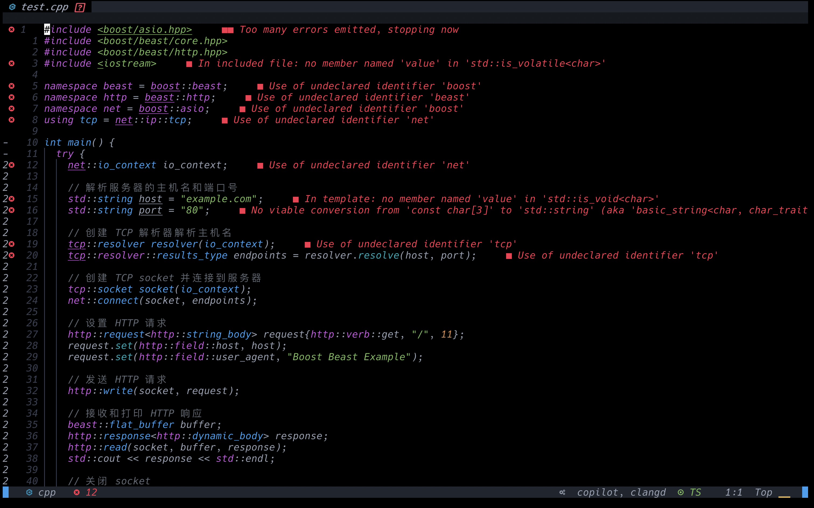

出现这样的原因是因为 IDE 使用的 LSP 不知道到哪里去找这些头文件. 既然可以在 Makefile 中设置寻找路径, 那让 Makefile 生成一个能够让 LSP 识别的路径文件也就顺理成章.

在 CMake中:

+ 可以直接使用参数`-DCMAKE_EXPORT_COMPILE_COMMANDS=1`来生成路径文件
+ 也可以选择在 CMakeLists.txt中加入`set(CMAKE_EXPORT_COMPILE_COMMANDS ON)`.

例如这个[项目](https://github.com/LiuYuan-SHU/CompilePricinple):

```
❯ tree -L 1
.
├── CMakeLists.txt			// CMake 文件
├── README.md				// README
├── README_ENG.md			// 英文版 README
├── cmake-build-debug		// CLion 生成的 debug 版本
├── cmake-build-release		// CLion 生成的 release 版本
├── data					// SLR1 分析表
├── source					// 源代码
└── test_files				// 测试文件

6 directories, 3 files
```

执行以下指令:

```bash
❯ mkdir build
❯ cd build
❯ cmake -DCMAKE_EXPORT_COMPILE_COMMANDS=1 ..
-- The CXX compiler identification is AppleClang 14.0.0.14000029
-- Detecting CXX compiler ABI info
-- Detecting CXX compiler ABI info - done
-- Check for working CXX compiler: /Applications/Xcode.app/Contents/Developer/Toolchains/XcodeDefault.xctoolchain/usr/bin/c++ - skipped
-- Detecting CXX compile features
-- Detecting CXX compile features - done
-- Configuring done
-- Generating done
-- Build files have been written to: /Users/liuyuan/Liuyuan/大三_春/Compiler/Compiler/build
```

然后查看生成的文件:

```
❯ tree -L 1
.
├── CMakeCache.txt
├── CMakeFiles
├── Makefile
├── bin
├── cmake_install.cmake
├── compile_commands.json	<----------- LSP指导文件
├── data
├── output
└── test_files

6 directories, 4 files
```

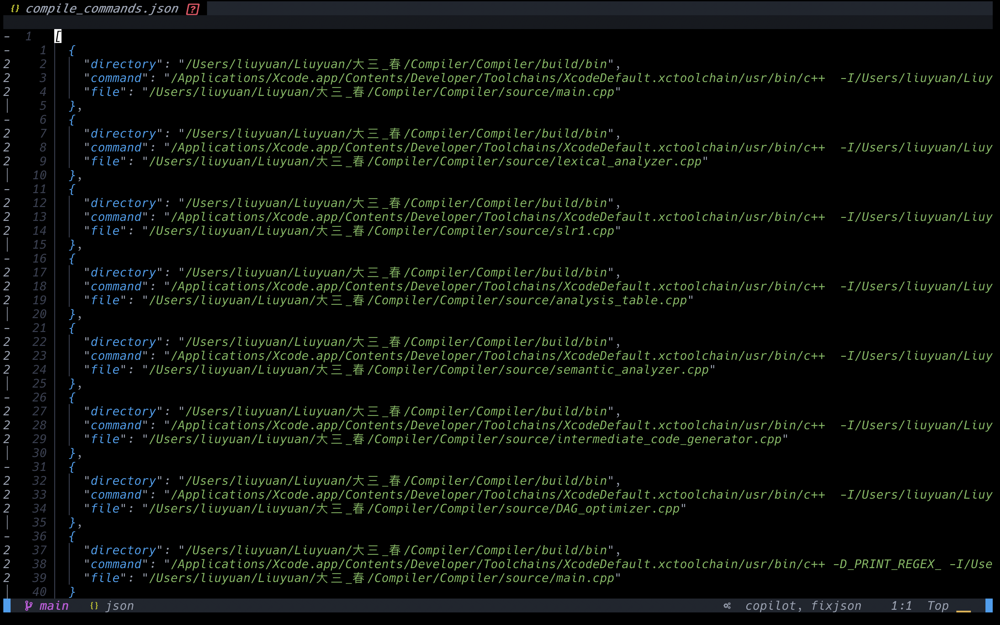

如果是 Make 的话需要使用[Bear](https://github.com/rizsotto/Bear).

生成的这个文件可以在 vscode 或者 neovim 中进行使用.

### Neovim 演示

目录结构:

```
❯ tree
.
├── CMakeLists.txt
└── main.cpp

1 directory, 2 files
```

`main.cpp`就是之前演示的使用了 boost 库的代码, 同样爆红. 

以下是 CMakeLists.txt:

```cmake
cmake_minimum_required(VERSION 3.25)
project(boost_test)

set(CMAKE_CXX_STANDARD 11)

# 查找 Boost 库
find_package(Boost REQUIRED )
include_directories(${Boost_INCLUDE_DIRS})
link_directories(${Boost_LIBRARY_DIRS})

# 生成 compiler_commands.json 文件
set(CMAKE_EXPORT_COMPILE_COMMANDS ON)

add_executable(boost_test main.cpp)
```

接下来在 neovim 中查看`clangd`的提示: 

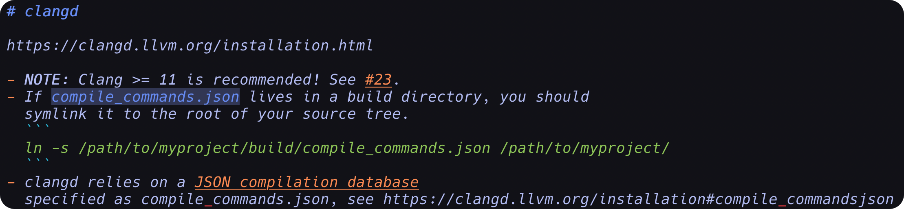

于是创建`build`文件夹, 并在其中运行`cmake ..`:

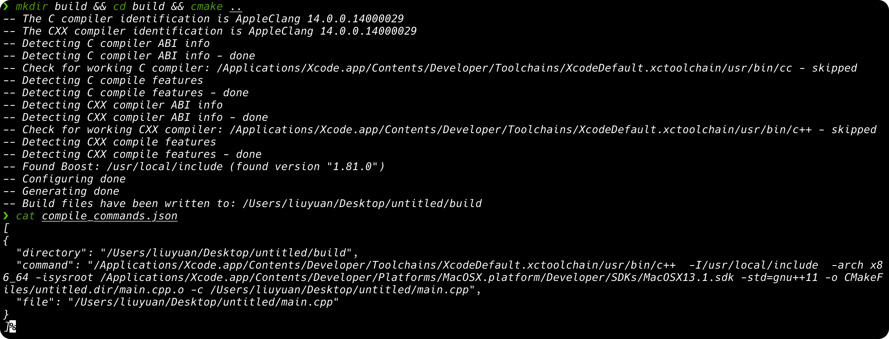

然后再打开`main.cpp`:

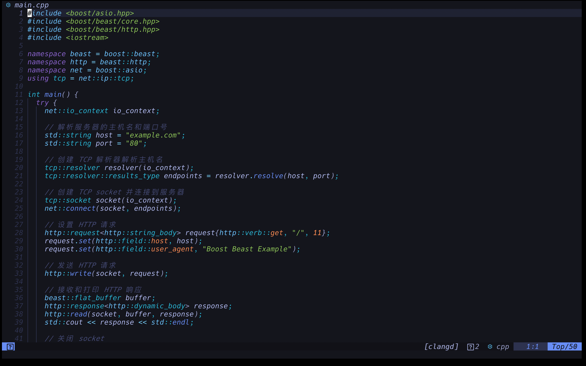

可以看到一切正常

# 使用第三方库

## 第三方库结构概览

一个第三方库编译完成之后的结构:

```
bin
include
lib
share
```

1. bin: 库提供的可执行文件

2. include: 库所提供的头文件

3. lib: 源码编译得到的所有`.o`文件,

    + 可以通过`ar`合并得到一个静态链接库
        + Linux: `.la/.a`
        + Windows: `.lib`
    + 或者通过`-shared`获得一个动态链接库
        + Linux: `.so`
        + Windows: `.dll`

    ******

    `.so.6/.so.5`: SO-NAME(Shared Object Name): 共享对象名字. 在不同版本的库之间的区分形式, 利于软件的版本迭代

    ******

    需要注意的是, 在 Linux 下,静态链接库和动态链接库都在`lib`下, 而在 WIndows 中, 静态链接库在`lib`下, 动态链接库在`include`下

4. share: 关于库的文档, 示例和手册

## 第三方库的 Makefile 装载

我们在编译的时候可以先装入库的根目录, 然后拓展根目录为其他目录. 例如:

```makefile
CC = gcc
SRC = main.c a.c
OBJ = $(SRC:.c=.o)

INCLUDE_PATH = -I./header/

# 根目录
GRAPHVIZ_ROOT_PATH = ~/graphviz
# 头文件
INCLUDE_PATH = -I$(GRAPHVIZ_ROOT_PATH)/include
# 链接库
LIBRARY_PATH = -L$(GRAPHVIZ_ROOT_PATH)/lib
# 链接的库名称, 编译器会进一步拓展名称, 例如libgvc
# 如果链接库中既有静态链接库又有动态链接库, 会优先链接动态链接库, 这对软件的体积是最友好的
LDFLAGS = -lgvc -lcgraph -lcdt

main: $(OBJ)
    $(CC) $^ -o $@

%.o: $.c
    $(CC) -c $(INCLUDE_PATH) $^ -o $@
```

## 第三方库的自定义配置

在第三方库的目录下有一个`configure`文件, 这个文件由 GNU Build System 体系下的开发者三件套构建而来, 主要是为了简化跨平台软件的构建过程

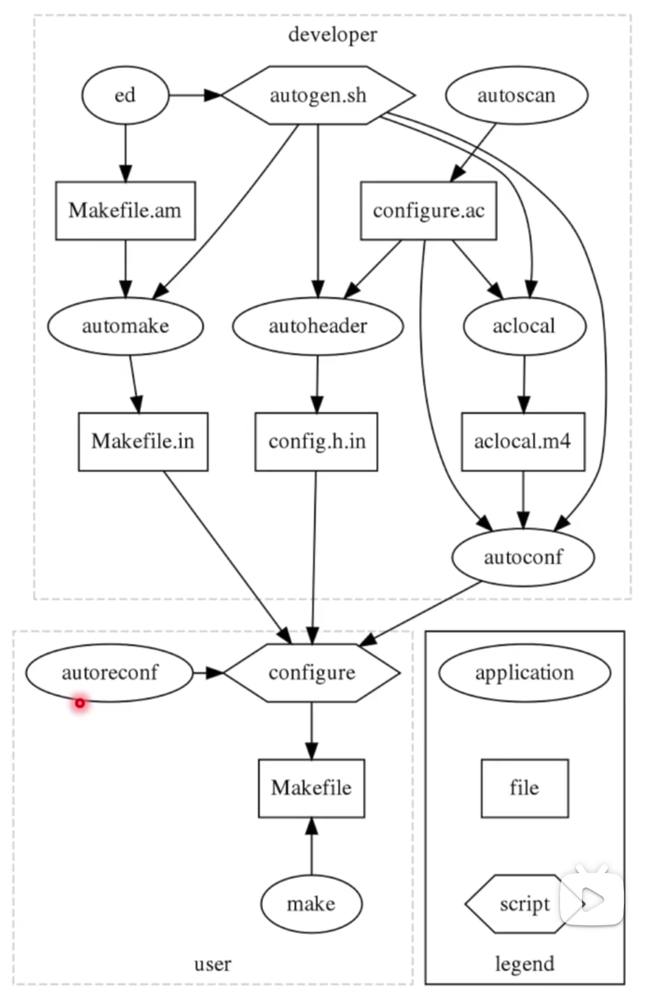

三件套分别为:

+ automake: 自动生成 Makefile
+ autoconf: 生成shell脚本来自动配置软件源代码包
+ libtools: 处理库的版本号, 符号表和依赖关系

使用`configure`就可以指定库的安装路径, 以及是否生成动态库. 常见的安装指令集:

```bash
./configure --prefix=~/xxx --enable-shared
make
sudo make install
```

## 第三方库都安装在哪了

```bash
# -E 预处理
# -v 打印输出信息(默认 quiet)
# -  从 stdio 中读取输入
gcc -E -v -
# 或者
gcc -print-search-dirs
```

+ 可执行文件安装在`/usr/bin`
+ 头文件安装在`/usr/include`
+ 库文件在`/usr/lib/x86_64-linux-gnu`

之所以我们能够直接使用`apt`直接安装第三方软件包,是因为软件开发者在完成开发之后将软件打包成了 Debian 软件包的形式. 这个软件包中就包含了之前提到的`lib`, `include`, `share`等目录. 并且这个软件包也需要声明这些目录需要放在系统的什么位置. `apt`则负责检查是否存在依赖缺失和文件名称冲突. 

之后, `apt`使用`ldconfig`指令来更新或创建共享库的软链接. 而头文件和链接库的安装位置就刚好在 gcc 的搜索路径中, 所有的可执行文件会被放在`/usr/bin`下, 因此我们可以直接使用可执行文件的命令来运行程序.

需要注意的是, 在编译的时候需要将链接库的名称放在目标代码的后面, 也就是这样:

```bash
gcc main.o a.o -lgvc -lcgraph -lcdt -o main
```

这是因为目标文件中的未定义符号只会在其之后出现的文件中去寻找, 而不会去其之前的文件中去查找, 所以一旦将链接库放在目标代码前方就会出现符号未定义的情况. 所以最简单的方法就是将所有的链接库放在目标代码的后面.

## 手动添加软件源到`apt`

当`apt `中不存在所需要的软件时, 就可以添加软件源到`apt`中, 然后再进行安装. 或者是直接下载 Debian 安装包手动安装.

## pkg-config

> 解决头文件路径和链接库名字的问题

例如对于这个 Makefile:

```makefile
CC = gcc
SRC = main.c a.c
OBJ = $(SRC:.c=.o)
INCLUDE_PATH = 
LDFLAGS = -lgvc -lcgraph -lcdt

main: $(OBJ)
	$(CC) $^ $(LDFLAGS) -o $@
	
%.o: %.c
	$(CC) -c $(INCLUDE_PATH) $^ -o $@
```

但是如果不确定链接库的名称, 那么就需要`pkg-config`来确定链接库的名称甚至是路径:

```makefile
CC = gcc
SRC = main.c a.c
OBJ = $(SRC:.c=.o)

# 生成头文件路径: -I/usr/include/graphviz
CFLAGS = `pkg-config libgvc --cflags`
# 生成静态库路径: -lgvc -lcgraph -lcdt
LDFLAGS = `pkg-config libgvc --libs`

main: $(OBJ)
	$(CC) $(CFLAGS) $^ $(LDFLAGS) -o $@
	
%.o: %.c
	$(CC) -c $(CFLAGS) $^ -o $@
```

# 宏配置 - `make menuconfig`

> 面对超大型的项目, 拥有非常灵活的选项. 例如 Linux 内核, 可以根据不同的需求生成不同的内核

# C 运行时库: crt

+ glibc: GNU 开发的针对 Linux 的 CRT
+ MSVCRT/UCRT (Universal): 微软的 CRT, 后者为 VS2015 后重写的版本
    + Mingw-w64: GNU 为 Windows 编写的 CRT
+ BSD libc: MacOS
+ Bionic: Android
+ Musl/newlib/$\mu$Clibc/uClibc: 嵌入式等资源有限场景, 主打轻量

CRT 提供了程序开始和结束时的一些函数, 以及一些重要的 C 标准库. crt 负责了程序启动的结束, 对象的构造和析构, 以及异常处理, 信号量, 线程等等的工作. 

当然, 程序可以通过一些方法运行在没有操作系统的裸机上的, 但是这需要程序自己来完成操作系统完成的一些工作, 例如内存管理等. 

通常使用一个三元组(Triplet)来描述一个平台:
$$
<arch>-<OS>-<libc>
$$

+ X86_64_linux_gnu
+ X86_64_windows_gnu
+ X86_64_windows_msvc
+ arm_linux_gnu

# GCC 编译工作流

本质上, gcc 是一整套 GNU C Compiler 的驱动程序. 当使用 gcc 编译代码的时候, 其依次调用下面的组件, 并将上一组件的运行结果交给下一组件:

+ cpp: C Preprocessor
+ cc1/cc1plus: C Compiler 1, 编译器前端部分(Plus 代表 CPP 编译器前端)
+ as: 汇编器
+ ld: 链接器

也就是说, 如果有条件, 我们可以在遵守接口协议的前提下编写属于自己的编译器后端, 替换掉 as 和 ld

其中还有一个非常重要的组件 collect2, 用于串联 GCC 的前后端部分, 同时调用 ld, 处理链接信息.

汇编器 as 和连接器 ld 实际上是 GNU binutils 的一部分, 只有cpp, cc1和 colletc2 才是 GCC 的部分. binutils 也是非常常见的工具:

+ objdump: 反汇编
+ readelf: 查看 elf 文件
+ ar: 压缩静态链接库
+ gprof: 用于识别程序的性能

会被一同链接的除了代码中使用到的静态链接库以外, 以 crt 开头的静态链接库也会被 collect2 一同链接. 

# 跨平台和交叉编译

## 存在的困难

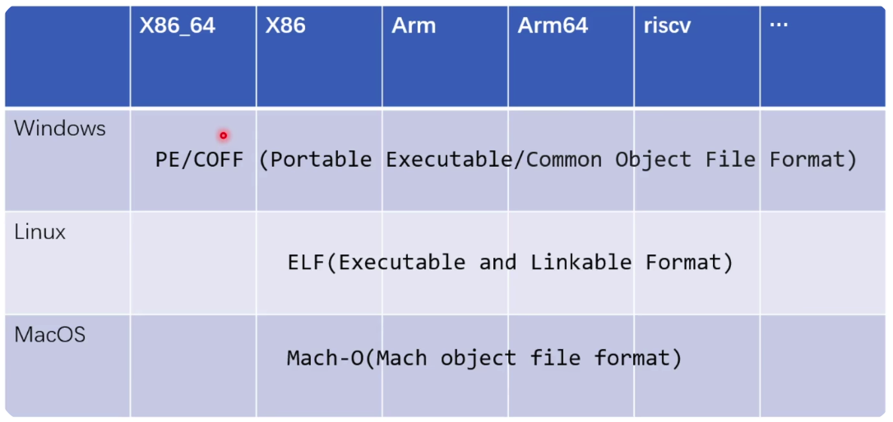

不同的操作系统的目标文件的格式各不相同, 如上图所示. 

但是也并不是说, 只要链接器能够同时处理三种不同的目标代码文件格式, 就能使用一份目标文件生成不同平台下的可执行文件. 

此处涉及到一个叫做 ABI(Application Binary Interface)的概念. 

ABI 和 API(Application Programming Interface)的含义有区别. API 指的是函数接口, 例如这是 POSIX 的函数接口定义: 

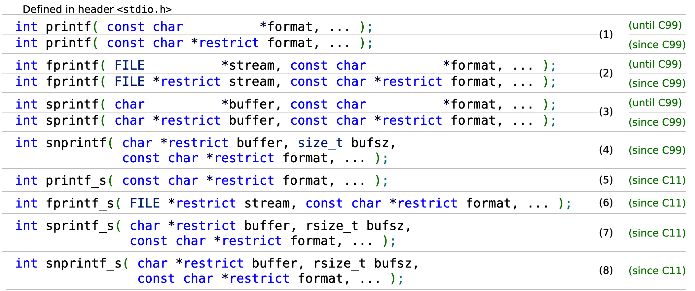

只要这样调用函数, 在所有使用 POSIX 协议的机器上都可以运行. 

ABI 相比 API严格很多. 例如在使用`printf`的时候, 使用了哪些寄存器, 栈中参数的顺序是怎样的?以下是一个非常经典的例子:

```cpp
f(a(), b())
```

在确定架构和操作系统之前, 不能够确定`a()`和`b()`哪一个先被调用. 影响 ABI 的因素非常多, 例如硬件设备, 编译器, 链接器和操作系统等等. 甚至还有`int`, `long`的大小是多少, char 是有符号的还是无符号的, 是小端对齐还是大端对齐, 都会有问题. 

在 C++的 ABI 中, 存在的问题会更多一些, 微软的 MSVC ABI和 GNU 的Intel Itanium ABI的差距已经非常之大. Clang 试图在两者之间做到统一, 但是也非常之难. 甚至三种编译器的编译选项也各不相同.

## 跨平台和交叉编译

假设这样的情况:

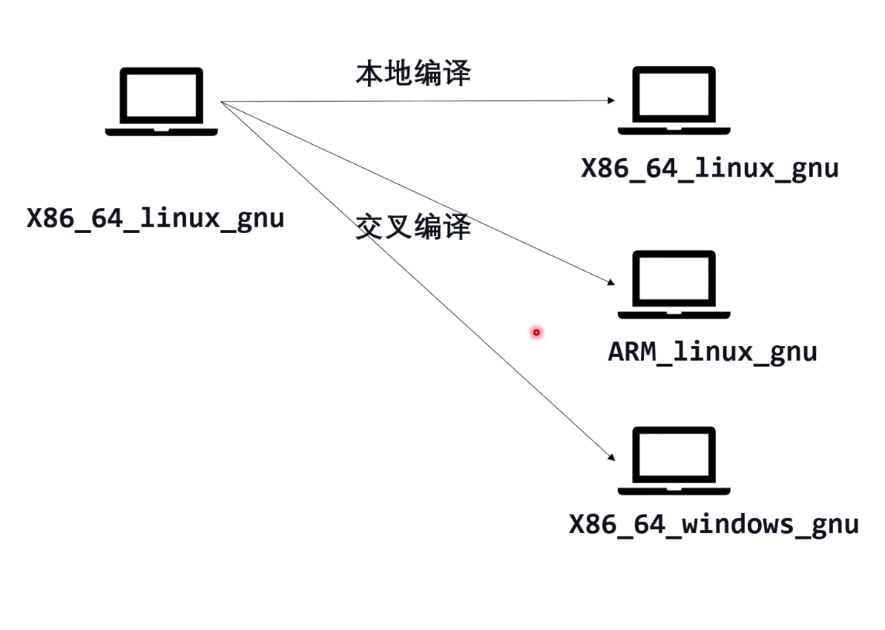

此处仅考虑架构和操作系统有所不同, 不去考虑 CRT 的不同, 因为如果连 CRT 都不同的话事情就会很麻烦.

事实上, 在 Linux 上去编译一个可以在 Windows 上运行的程序, 或者是在 x86 上编译一个可以在 arm 上运行的程序, 是可以做到的. 

### 交叉编译

能够做到跨架构编译的编译器, 称为交叉编译器, 这种编译方式称为交叉编译. 之所以要交叉编译, 而不选择直接在目标平台上进行编译的原因是, 需要交叉编译的目标平台通常运行速度慢, 运行空间小(嵌入式硬件, 低功耗, 低成本). 所以处理这个问题的最好办法就是直接把运行时的最小依赖放到目标平台上即可.

最重要的问题是移植第三方库. 在常见的架构上可能有的第三方库是编译好的, 但是可能在目标架构上是没有编译好的第三方库的. 

X86_64_GNU 平台是属于软件包最多的平台. 例如 X86_64 到 ARM 有 arm_linux_gcc 编译.

### Canadian Cross(加拿大编译)

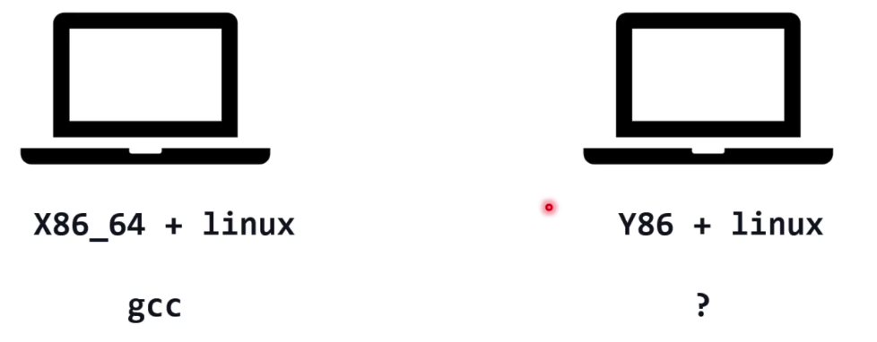

假设现在有一个 Y86 架构的计算机, 为了拓展该平台的软件生态, 需要编写一些程序. 那么就需要一个编译器能够运行在 Y86 上, 并且其编译的程序需要能够运行在该平台上. 

这个时候就会发现一个问题, 编译器是由编译器编译出来的(自举), 那么第一个编译器是从哪里来的?

此处需要引入三个概念:

+ Build: 构建编译器时使用的机器
+ Host: 可以运行编译器的机器
+ Target: 编译器为这台机器产生代码

| 阶段 | Build  | Host   | Target | 说明     |
| :--: | :----- | ------ | ------ | -------- |
|  1   | X86_64 | X86_64 | Y86    | gcc -> A |
|  2   | X86_64 | Y86    | Y86    | A -> B   |
|  3   | Y86    | Y86    | Y86    | B -> B   |

1. 首先利用X86_64 上的编译器编译生成一个新的编译器 A, 其能够生成在 Y86 上能够使用的软件
2. 接下来使用 A 在 X86_64 下编译生成 Y86 下运行的编译器 B, 其能够生成在 Y86 上能够使用的软件
3. 接下来就可以用 B 实现自举

> 这部分内容可以参考[Linux From Scratch](https://www.linuxfromscratch.org/lfs/view/11.2-systemd/partintro/toolchaintechnotes.html)

同样可以参考本书的[第三章](https://www.linuxfromscratch.org/lfs/view/11.2-systemd/chapter03/chapter03.html), 那里会介绍如何使用交叉编译工具链:

+ GNU binutils
+ GCC
+ linux
+ Glibc

其实在查看版本的时候是可以看到编译器的 Build, Host 和 Target 的:

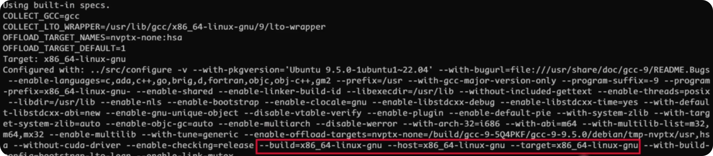
