# 第二章 编译系统设计

[TOC]

## 编译程序的设计

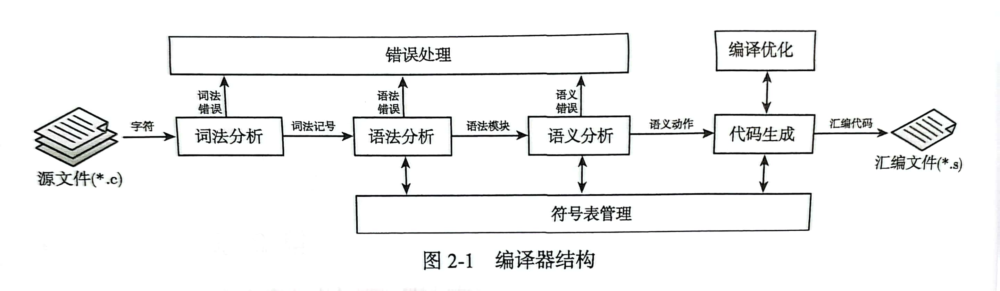

### 词法分析

> 词法记号: 也称为终结符, 反映在高级语言语法中就是对应的标识符, 关键字, 常量, 以及运算符, 逗号, 分号等界符.


标识符的有穷自动机:

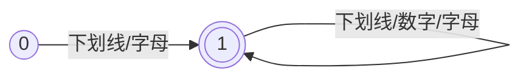

### 语法分析

```cpp
var2 = var1 + 100;
```

抽象语法树示例:

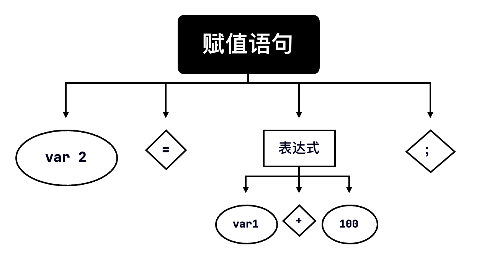

1. 所有的词法记号都出现在树的叶节点上, 我们称这样的节点为终结符

2. 所有的非叶结点, 都是对一串词法记号的抽象概括, 我们称之为非终结符

    可以将非终结符看做一个单独的语法模块(抽象语法树).

在获得高级语言的文法之后, 构造语法分析器来生成抽象语法树. 在编译原理中, 由自顶向下的 LL分析, 自底向上的算符优先分析和 LR分析等. 最常使用的是 LL(1)分析和 LR 分析. 相比而言, LR 分析器能力更强, 但是分析器设计比较复杂, 不适合手工构造.

递归下降子程序的基本原则是: 将产生式左侧的非终结符转化为函数定义, 将产生式右侧的非终结符转化为函数调用, 将终结符转化为词法记号匹配. 例如上面的赋值语句的子程序的文法:

```
assign = "identifier", "=", expression, ";"
```

那么对应的分析伪代码:

```cpp
void 赋值语句()
{
    match(标识符);
    match(等号);
    表达式();
    match(分号);
}
```

每次对子程序的调用, 就是按照前序的方式对该抽象语法子树的一次构造. 例如在构造赋值语句的时候:

1. 构造"赋值语句"根节点
2. 匹配标识符, 等号子节点
3. 匹配非终结符时, 进入对应的"表达式"子程序中继续按照前序方式构造子树

整个语法分析就是按照这样的方式构造"程序"树的一个过程, 一旦在终结符匹配过程中出现读入的词法记号与预期的词法记号不吻合的情况, 便会产生语法错误.

在实际语法分析器实现中, 并不一定要显式地构造出抽象语法树. 递归下降子程序实现的语法分析器, 使得抽象语法树的语法模块都蕴含在每次子程序的执行中, 即每次子程序正确执行都表示识别了对应的语法模块. 因此, 可以在语法分析子程序中直接进行后续的工作, 例如语义分析及代码生成.

### 符号表的管理

符号表是记录符号信息的数据结构, 它使用按名存取的方式记录与符号相关的所有编译信息. 语义分析需要根据符号检测变量使用的合法性, 代码生成需要根据符号产生正确的地址, 因此, 符号信息的准确和完整是进行语义分析和代码生成的前提. 

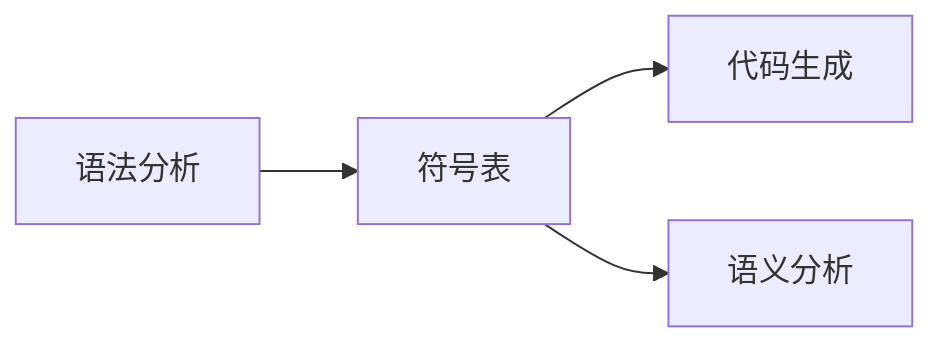

1. 对于变量符号, 需要在符号表中记录变量的名称, 类型, 区分变量的声明和定义的形式, 如果变量是局部变量, 还要记录变量在运行时栈帧中的相对位置.

    例如:

    ```cpp
    extern int var;
    ```

    该语句声明了一个外部的全局变量, 记录变量符号的数据结构中除了保存变量的名称`var`, 还需要记录变量的类型`int`, 以及其声明形式`extern`.

2. 对于函数记号, 需要在符号表中记录函数的名称, 返回类型, 参数列表, 以及函数内定义的所有局部变量等.例如:

    ```cpp
    int sum(int a, int b) {
        int c;
        c = a + b;
        return c;
    }
    ```

    符号符号表应该记录函数的:

    + 返回类型`int`
    + 函数名`sum`
    + 参数列表`int, int`

    函数的局部变量除了显式定义的变量`c`之外, 还暗含参数变量`a`和`b`

由于局部变量的存在, 符号表必须考虑代码作用域的变化. 函数内的局部变量在函数之外是不可见的, 因此在代码分析的过程中, 符号表需要根据作用域的变化动态维护变量的可见性.

### 语义分析

编译原理教材中, 将语言的文法分为 4 种:

1. 0 型文法
2. 1 型文法
3. 2 型文法
4. 3 型文法

这几种文法对语言的描述能力依次减弱. 其中, 

+ 3 型文法也称为正规文法, 词法分析器种有穷自动机能处理的文法正是这种文法. 
+ 2型文法也称为上下文无关文法, 也是目前计算机程序语言所采用的文法.

顾名思义, 程序语言的文法是上下文无关的, 即程序代码语句之间在文法层次上是没有关联的. 例如在分析赋值语句时, LL(1)分析器无法解决"被赋值的对象是已经声明的标识符吗?"这样的问题, 因为语法分析器之关系程序语法形式的正确性, 而不考虑语法模块上下文之间联系的合法性.

******

然而实际的情况是, 程序语言的语句虽然形式上是上下文无关的, 但含义上是上下文相关的. 例如: 

+ 不允许使用一个未声明的变量
+ 不允许函数实参列表和形参列表不一致
+ 不允许对无法默认转换的类型进行赋值和运算
+ 不允许`continue`语句出现在循环语句之外

等等. 这些要求是语法分析器无法完成的.

******

编译器的语义分析模块需要处理的问题有:

1. 变量及函数在使用前是否已经定义?
2. `break`是否出现在循环或是`switch-case`语句内部?
3. `continue`语句是否出现在循环内部?
4. `return`语句返回值的类型是否与函数返回值类型相兼容?
5. 函数调用时, 实参列表和形参列表是否兼容?
6. 表达式计算及赋值时, 类型是否兼容?

语义分析是编译器处理流程中对源代码正确性的最后一次检查, 只要源代码语义上没有问题, 编译器就可以正确引导目标代码的生成.

### 代码生成

代码生成是编译器的最后一个处理阶段, 它根据识别的语法模块翻译出目标机器指令, 例如汇编语言, 这一步称为使用语法制导的方式进行代码生成. 


例如:

```cpp
var2 = var1 + 100;
```

其汇编代码:

```assembly
mov eax, [var1]
mov ebx, 100
add eax, ebx
mov [tmp], eax
mov eax, [tmp]
mov [var2], eax
```

根据上面绘制的语法树, 上面的代码分别对应了表达式语法模块和赋值语句语法模块. 根据自定义语言的语法, 需要对如下语法模块进行翻译:

1. 表达式的翻译
2. 复合语句的翻译
3. 函数定义与调用的翻译
4. 语句段信息的翻译

### 编译优化

一般主流工业化编译器会按照如图所示进行设计:

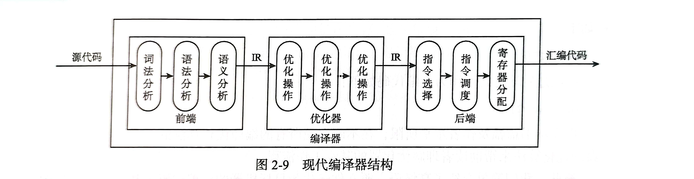

由于中间代码的存在, 是的语法制导翻译的结果不再是目标机器的代码, 而是中间代码. 按照我们自己设计的中间代码形式, 上述例子生成的中间代码可能是:

```python
tmp = var1 + 100
var2 = tmp
```

及时优化器没有对这段代码进行处理, 编译器的后端也能正确地把这段中间代码翻译为目标机制指令. 根据指令选择和寄存器分配算法, 得到的目标机器指令可能如下:

```assembly
mov eax, [var1]
add eax, 100
mov [var2], eax
```

编译器后端在指令选择阶段会选择更"合适"的指令实现中间代码的翻译, 比如使用`add eax, 100`实现`tmp = var1 + 100`的翻译. 在寄存器分配阶段会尽可能地将变量保存在寄存器内, 比如`tmp`一直在`eax`中. 

中间代码的抽象程度一般介于目标语言和目标机器语言之间. 良好的中间代码格式使得中间代码生成, 目标代码生成, 以及优化器的实现更加简单. 

首先通过一个简单的实例说明中间代码优化的工作:

```cpp
var1 = 100;
var2 = var1 + 100;
```

将上述高级语言翻译为中间代码的形式如下:

```python
var1 = 100
tmp = var1 + 100
var2 = tmp
```

常量传播优化使得编译器在编译期间可以将表达式的结果提前算出来, 因此经过常量传播优化后中间代码形式如下:

```python
var1 = 100
tmp = 200
var2 = 200
```

死代码消除优化会把无效的表达式从中间代码中删除, 假如上述代码中只有变量`var2`在之后会继续使用, 那么`var1`和`tmp`都是无效的计算. 因此, 消除死代码后, 最终的中间代码:

```python
var2 = 200
```

再经过后端将其翻译为汇编:

```assembly
mov [var2], 200
```

## x86 指令格式

编译系统的编译器需要把编译器生成的汇编语言转化为 x86 格式的二进制机器指令序列, 然后将这些二进制信息存储为 ELF 格式的目标文件. 

在 x86 指令结构中, 指令被分为前缀, 操作码, ModR/M, SIB, 偏移量和立即数六个部分. 

+ 前缀: 用于修改指令的行为或是提供额外的信息. 

+ 操作码: 指定了指令的含义和功能

+ ModR/R 和SIB: 为扩充操作码或者为指令操作数提供各种不同的寻址模式


如果指令含有偏移量和立即数的信息, 就需要把他们放在指令后边的对应位置.

例如:

```assembly
add eax, ebx
```

根据 Intel 的指令手册:

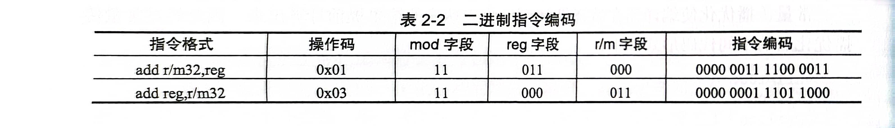

当操作数为 32 位寄存器的时候, `add`指令的操作码是`0x01`或者`0x03`, 它们对应的指令格式是`add r/m32, reg`和`add reg, r/m32`. 

在 ModR/M字节的定义中, 高两位 mod 字段为`0b11`时表示指令的两个操作数都是寄存器, 低三位表示r/m操作数寄存器的编号, 中间三位表示 reg 操作数寄存器的编号. Intel 定义`eax`寄存器编号为`0b000`, `ebx`寄存器编号为`0b011`. 如果我们采用操作码`0x01`, reg 应该记录`ebx`的编号`0b011`, r/m32 记录`eax`编号`0b000`, mod 字段为`ob11`. 因此该指令的 ModR/M 字节为:

```
11 011 000 # 0xd8
```

同理, 如果采用的操作码是`0x03`, 那么 ModR/M字节应该是:

```
11 000 011 # 0xc3
```


可以看到, 两个操作码的区别就是在于第一个操作值是 reg 字段还是r/m字段. 最终组合而成的都是`add eax, ebx`指令.

指令不再含有其他信息, 因此不存在 SIB 和偏移量, 立即数字段. 这样, 指令就有两种表示形式: `0x01d8`和`0x03c3`.

可以看出, 在汇编器语法分析阶段, 应该记录生成的二进制指令需要的信息. 指令的名称决定操作码, 指令的寻址方式决定 ModR/M 和 SIB 字段, 指令中的常量决定偏移量和立即数部分.

## ELF文件格式

ELF 文件格式描述了 Linux 下可执行文件, 可重定位目标文件, 共享目标文件, 核心转储文件的存储格式. 在此我们只关注可执行文件和可重定位目标文件的格式, 如果要设计动态链接器的话, 则还需要了解共享目标文件的内容.

ELF 文件的一般存储形式如图:

<center>
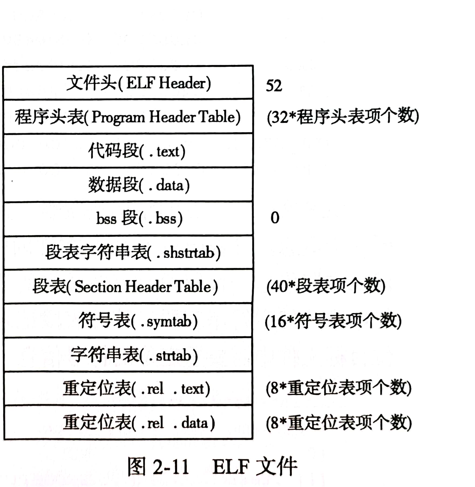
</center>

在 Linux 下, 可以使用 `readelf` 命令查看 ELF 文件的信息. 如果要查看生成的目标代码的信息, 例如之前的`hello.o`, 可以可以使用:

```shell
readelf -a hello.o     
```

在 ELF 文件中, 最开始的 52 个字节记录 ELF 文件头部的信息. 通过它可以确定 ELF 文件内程序头表和段表的位置和大小. 下面是`hello.o`文件头的信息:

```
ELF Header:
  Magic:   7f 45 4c 46 02 01 01 00 00 00 00 00 00 00 00 00
  Class:                             ELF64
  Data:                              2's complement, little endian
  Version:                           1 (current)
  OS/ABI:                            UNIX - System V
  ABI Version:                       0
  Type:                              REL (Relocatable file) <===============
  Machine:                           Advanced Micro Devices X86-64
  Version:                           0x1
  Entry point address:               0x0	<===============
  Start of program headers:          0 (bytes into file)	<===============
  Start of section headers:          608 (bytes into file)	<===============
  Flags:                             0x0
  Size of this header:               64 (bytes)
  Size of program headers:           0 (bytes)
  Number of program headers:         0
  Size of section headers:           64 (bytes)
  Number of section headers:         14
  Section header string table index: 13
```

紧接着的文件头便是程序头表, 它记录程序运行时操作系统如何将文件加载到内存. 因此只有可执行文件包含程序头表. 使用`readelf`查看使用静态链接选项`-static`生成的`hello`文件:

```
Program Headers:
  Type           Offset             VirtAddr           PhysAddr
                 FileSiz            MemSiz              Flags  Align
  LOAD           0x0000000000000000 0x0000000000400000 0x0000000000400000
                 0x0000000000000528 0x0000000000000528  R      0x1000
  LOAD           0x0000000000001000 0x0000000000401000 0x0000000000401000
                 0x000000000009659d 0x000000000009659d  R E    0x1000
  LOAD           0x0000000000098000 0x0000000000498000 0x0000000000498000
                 0x00000000000284c6 0x00000000000284c6  R      0x1000
  LOAD           0x00000000000c07b0 0x00000000004c17b0 0x00000000004c17b0
                 0x0000000000005ae0 0x000000000000b490  RW     0x1000
  NOTE           0x0000000000000270 0x0000000000400270 0x0000000000400270
                 0x0000000000000030 0x0000000000000030  R      0x8
  NOTE           0x00000000000002a0 0x00000000004002a0 0x00000000004002a0
                 0x0000000000000044 0x0000000000000044  R      0x4
  TLS            0x00000000000c07b0 0x00000000004c17b0 0x00000000004c17b0
                 0x0000000000000020 0x0000000000000068  R      0x8
  GNU_PROPERTY   0x0000000000000270 0x0000000000400270 0x0000000000400270
                 0x0000000000000030 0x0000000000000030  R      0x8
  GNU_STACK      0x0000000000000000 0x0000000000000000 0x0000000000000000
                 0x0000000000000000 0x0000000000000000  RW     0x10
  GNU_RELRO      0x00000000000c07b0 0x00000000004c17b0 0x00000000004c17b0
                 0x0000000000003850 0x0000000000003850  R      0x1
```

ELF 文件最关键的结构是段表, 这里的段表示文件内的信息块, 与汇编语言内的段并非同一个概念. 段表记录了 ELF 文件内所有段的位置和大小等信息. 在所有的段中, 由保存代码二进制信息的代码段, 存储数据的数据段, 保存段表名称的段表字符串表段和存储程序字符串常量的字符串标段. 符号表段记录汇编代码中定义的符号信息, 重定位标段记录可重定位目标文件中需要重定位的符号信息. `hello.o`的段表如下:

```
Section Headers:
  [Nr] Name              Type             Address           Offset
       Size              EntSize          Flags  Link  Info  Align
  [ 0]                   NULL             0000000000000000  00000000
       0000000000000000  0000000000000000           0     0     0
  [ 1] .text             PROGBITS         0000000000000000  00000040
       0000000000000023  0000000000000000  AX       0     0     1
  [ 2] .rela.text        RELA             0000000000000000  000001a0
       0000000000000030  0000000000000018   I      11     1     8
  [ 3] .data             PROGBITS         0000000000000000  00000063
       0000000000000000  0000000000000000  WA       0     0     1
  [ 4] .bss              NOBITS           0000000000000000  00000063
       0000000000000000  0000000000000000  WA       0     0     1
  [ 5] .rodata           PROGBITS         0000000000000000  00000063
       000000000000000d  0000000000000000   A       0     0     1
  [ 6] .comment          PROGBITS         0000000000000000  00000070
       000000000000002e  0000000000000001  MS       0     0     1
  [ 7] .note.GNU-stack   PROGBITS         0000000000000000  0000009e
       0000000000000000  0000000000000000           0     0     1
  [ 8] .note.gnu.pr[...] NOTE             0000000000000000  000000a0
       0000000000000020  0000000000000000   A       0     0     8
  [ 9] .eh_frame         PROGBITS         0000000000000000  000000c0
       0000000000000038  0000000000000000   A       0     0     8
  [10] .rela.eh_frame    RELA             0000000000000000  000001d0
       0000000000000018  0000000000000018   I      11     9     8
  [11] .symtab           SYMTAB           0000000000000000  000000f8
       0000000000000090  0000000000000018          12     4     8
  [12] .strtab           STRTAB           0000000000000000  00000188
       0000000000000015  0000000000000000           0     0     1
  [13] .shstrtab         STRTAB           0000000000000000  000001e8
       0000000000000074  0000000000000000           0     0     1
```

符号标段是按照表格形式存储符号信息的, 我们可以看到主函数和`printf`函数的符号项:

```
Symbol table '.symtab' contains 6 entries:
   Num:    Value          Size Type    Bind   Vis      Ndx Name
     0: 0000000000000000     0 NOTYPE  LOCAL  DEFAULT  UND
     1: 0000000000000000     0 FILE    LOCAL  DEFAULT  ABS hello.c
     2: 0000000000000000     0 SECTION LOCAL  DEFAULT    1 .text
     3: 0000000000000000     0 SECTION LOCAL  DEFAULT    5 .rodata
     4: 0000000000000000    35 FUNC    GLOBAL DEFAULT    1 main
     5: 0000000000000000     0 NOTYPE  GLOBAL DEFAULT  UND printf
```

重定位表也是按照表格形式存储的, 很明显, `printf`作为外部符号是需要重定位的

```
Relocation section '.rela.text' at offset 0x1a0 contains 2 entries:
  Offset          Info           Type           Sym. Value    Sym. Name + Addend
00000000000b  000300000002 R_X86_64_PC32     0000000000000000 .rodata - 4
000000000018  000500000004 R_X86_64_PLT32    0000000000000000 printf - 4
```

从 ELF 文件格式的设计中可以看出, 可执行文件其实就是按照一定标准将二进制数据和代码等信息包装起来, 方便操作系统进行管理和调用. 从文件头可以找到程序头表和段表, 从段表可以找到其他所有的段. 因此, 在汇编语言输出目标文件的时候, 就需要收集这些段的信息, 并按照 ELF 格式组装成目标文件. 这样做不仅有利于使用操作系统现有的工具调试文件信息, 也为后期链接器的实现提供了方便.

另外需要说明的是, ELF 文件格式的定义, Linux 提供了头文件描述. 在系统目录`/usr/include/elf.h`提供的`elf.h`头文件中描述了标准 ELF 文件的数据结构的定义, 在实现汇编器和链接器的代码中都使用了该头文件. 

## 汇编程序的设计

汇编器和编译器的实现非常相似. 

汇编器也包含词法分析, 语法分析, 语义分析和代码生成四个基本流程. 

就本书而言, 汇编器面向编译器生成的汇编代码, 汇编代码的正确性由编译器保证, 因此汇编器不需要进行错误检查以及语义的正确性检查.

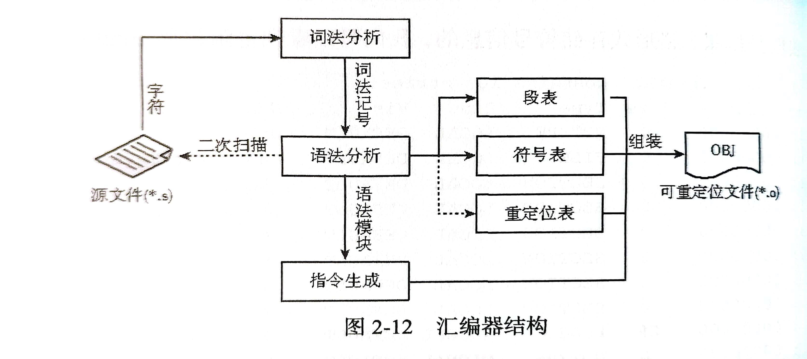

相比于编译器, 汇编器的工作重点放在目标文件信息的收集和二进制指令的生成上. 

### 汇编词法, 语法分析

汇编语言由独立的词法记号, 对于汇编词法的分析, 只需要构造相应的词法有穷自动机就可以了. 例如:

```assembly
mov eax, [ebx-8]
```

该指令有 8 个词法记号, 他们分别是: `mov`, `eax`, `,`, `[`, `ebp`, `-`, `8`, `]`.

汇编器的词法分析器将词法记号送到语法分析器, 构造抽象语法树:

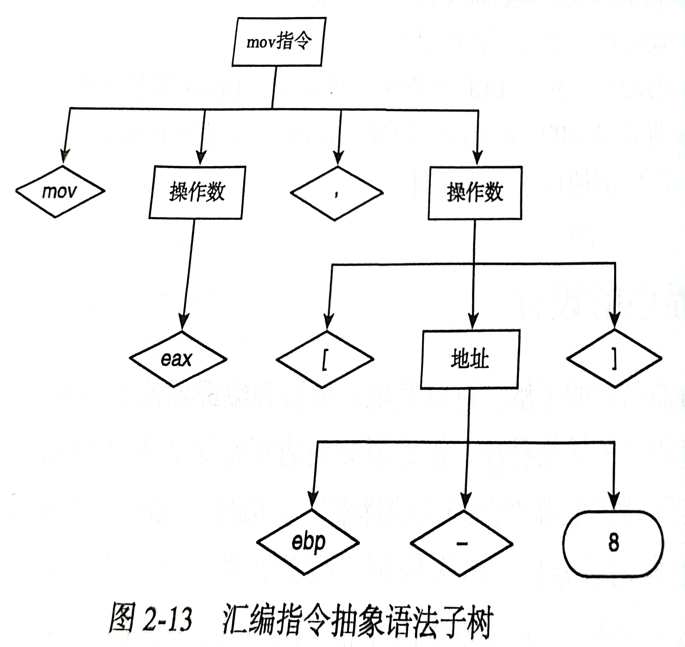

上图是简化后的抽象语法树, 与编译器类似, 语法分析器会在非叶子节点处识别语法模块, 以产生语义动作. 由于汇编器要输出可重定位目标文件, 因此在语法分析时要收集目标文件的相关信息. 比如记录代码段和数据段的长度, 目标文件符号表的内容, 重定位表的内容等, 这些操作都在语法分析器识别每个语法模块时使用语法制导的方式完成.

汇编器和编译器最大的不同是, 汇编器需要对源文件进行两遍扫描. 其根本原因是汇编语言允许符号的后置定义, 例如汇编语言常见的跳转指令:

```assembly
	jmp L
L:
```

很明显, 第一遍扫描分析`jmp`指令的时候, 汇编器并不知道`L`已经定义. 因此, 汇编器需要通过第一遍扫描获取符号的信息, 在第二遍扫描时获取使用符号的那些信息.

### 表信息生成

汇编器的符号表除了记录符号的信息以外, 还需要记录段相关的信息以及重定位符号的信息, 这些信息都是可重定位目标文件所必需的

对于段表的信息, 可以在汇编器识别`section`语法模块时进行处理. 比如声明代码段的汇编代码及段表信息生成.

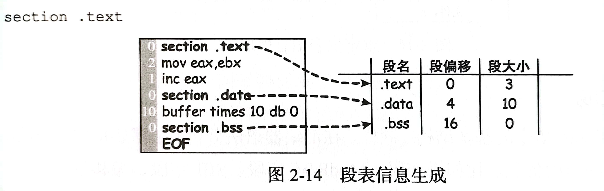

汇编器的语法分析器只要计算两次`section`声明之间的地址差, 便能获得段的长度, 从而将段的名称, 偏移, 大小记录到段表项内. 如果规定了 4 字节对齐, 那么需要对段偏移进行行扩展, 如上图所示.

汇编器的符号表与 ELF 文件的符号表并非同一概念. 汇编器的符号表来源于汇编语言定义的符号, ELF 文件的符号表是汇编器根据需要导出的符号信息, 如图所示:

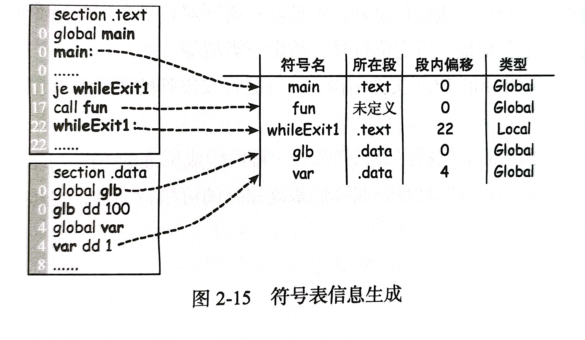

最明显的例子是使用`equ`命令定义的符号, 这个符号对汇编器来说是一个符号, 但是在 ELF 文件内, 它就是一个数字常量, 并不是符号

目标文件链接时会重新组织代码段, 数据段的位置. 这样段内定义的所有符号的地址以及引用符号的数据和指令都会产生偏差. 这是就需要重新计算符号的地址, 修改原来的地址, 也就是常说的重定位. 重定位一般分为两类:

1. 绝对地址重定位
2. 相对地址重定位

在重定位表内, 需要记录符号重定位相关的所有信息.

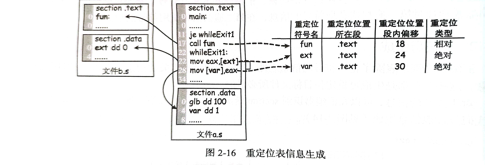

### 符号解析

如果说地址空间分配是为段指定地址的话, 那么符号解析就是为段内的符号指定地址. 对于一个汇编文件来说, 它内部使用的符号分为两类:

1. 来自自身定义的符号, 称为内部符号

    内部符号在其段内的偏移是确定的, 当段的起始地址制定完毕后, 内部符号的地址按照如下方式计算:
    $$
    符号地址=符号所在段基址 + 符号所在段内偏移
    $$

2. 来自其他文件定义的符号, 本地文件只是使用该符号, 这类符号称为外部符号. 外部符号地址在本地文件内是无法确定的, 但是外部符号总定义在其他文件中. 外部符号相对于定义它的文件就是内部符号了, 同样使用上面的公式计算它的地址, 而使用该符号的本地文件需要的也是这个地址.

在重定位目标文件内, 符号表记录了符号的所有信息. 对于本地定义的符号, 符号表项记录符号的段内偏移地址. 对于外部引用的符号, 符号表项标识该符号为"未定义的". 当链接器扫描到定义该外部符号的目标文件时, 就需要将外部符号的地址修改为正确的符号地址. 

链接器在扫描重定位目标文件的符号表时会动态地维护两个符号集合. 

1. 一个记录所有文件定义的全局符号集合 Export, 该集合内的所有符号允许被其他文件引用
2. 一个记录所有文件使用的未定义符号的集合 Import, 该集合内所有符号都来源于其他目标文件

文件扫描完毕后, 链接器需要验证 Import 集合是否是 Export 的子集. 

符号解析完毕后, 所有目标文件符号表内的所有符号都获得了完整, 正确的符号地址信息.

### 重定位

重定位从本质上来说就是地址修正. 由于目标文件在链接之前不能获取自己所使用符号的虚拟地址信息, 因此导致依赖于这些符号的数据定义或者指令信息缺失. 汇编器在生成目标文件的时候就记录下所有需要重定位的信息. 链接器获取这些重定位信息, 并按照重定位信息的含义修改已经生成的代码, 使得最终的代码正确, 完整.

既然重定位是对已有二进制信息的修改, 因此作为链接器需要清楚几件事情:

1. 在哪里修改二进制信息?
2. 用什么信息修改?
3. 按照怎样的方式修改?

这三个问题对应在重定位中的三个参数:

1. 重定位地址

    重定位地址在重定位表中没有直接记录, 因为在重定位目标文件内, 段地址还没有确定下来, 它只记录了重定位位置所在段内的偏移, 在地址空间分配结束后, 我们使用如下公式计算出重定位地址:
    $$
    重定位地址 = 重定位位置所在段基址 + 重定位位置的段内偏移
    $$

2. 重定位符号记录着被指令或者数据使用的符号信息, 比如`call`指令的标号, `mov`指令使用的变量符号等. 在符号解析结束后, 重定位符号的地址就已经确定了

3. 重定位类型决定修改二进制信息的方式, 即绝对地址重定位和相对地址重定位

在确定了上面的三个问题之后, 链接器便可以正确地修改重定位地址处的符号地址信息.
