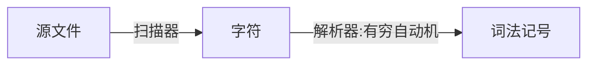
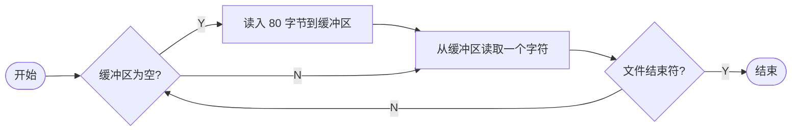
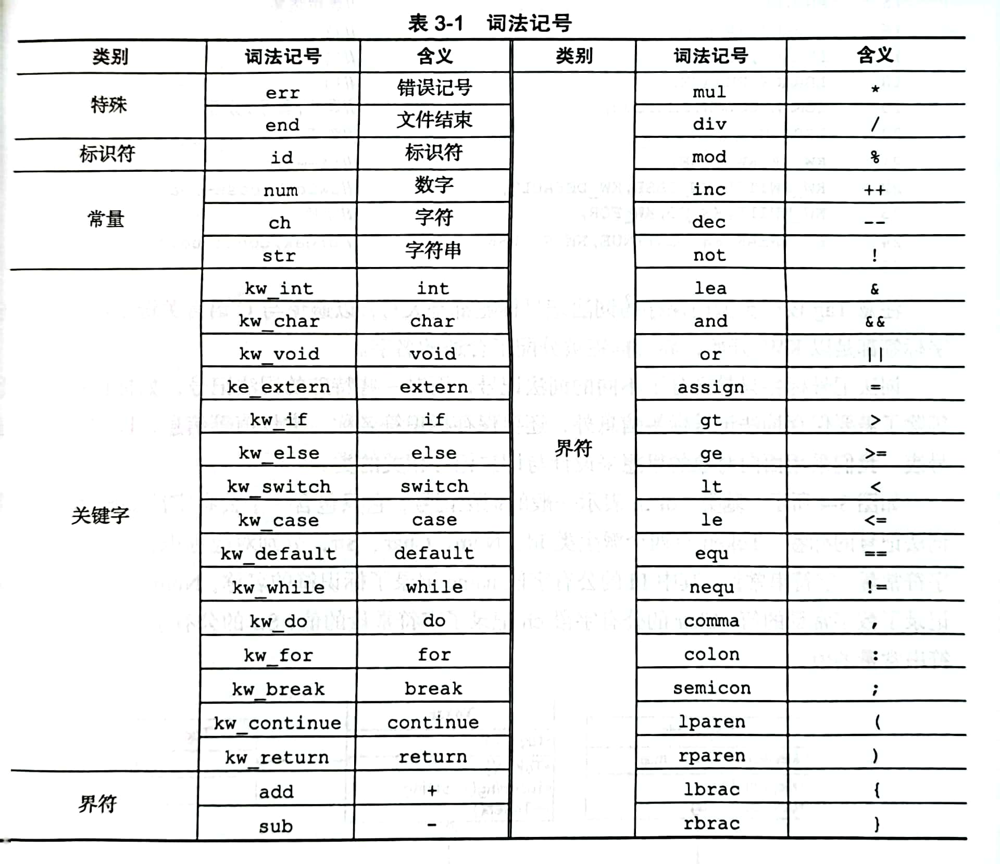
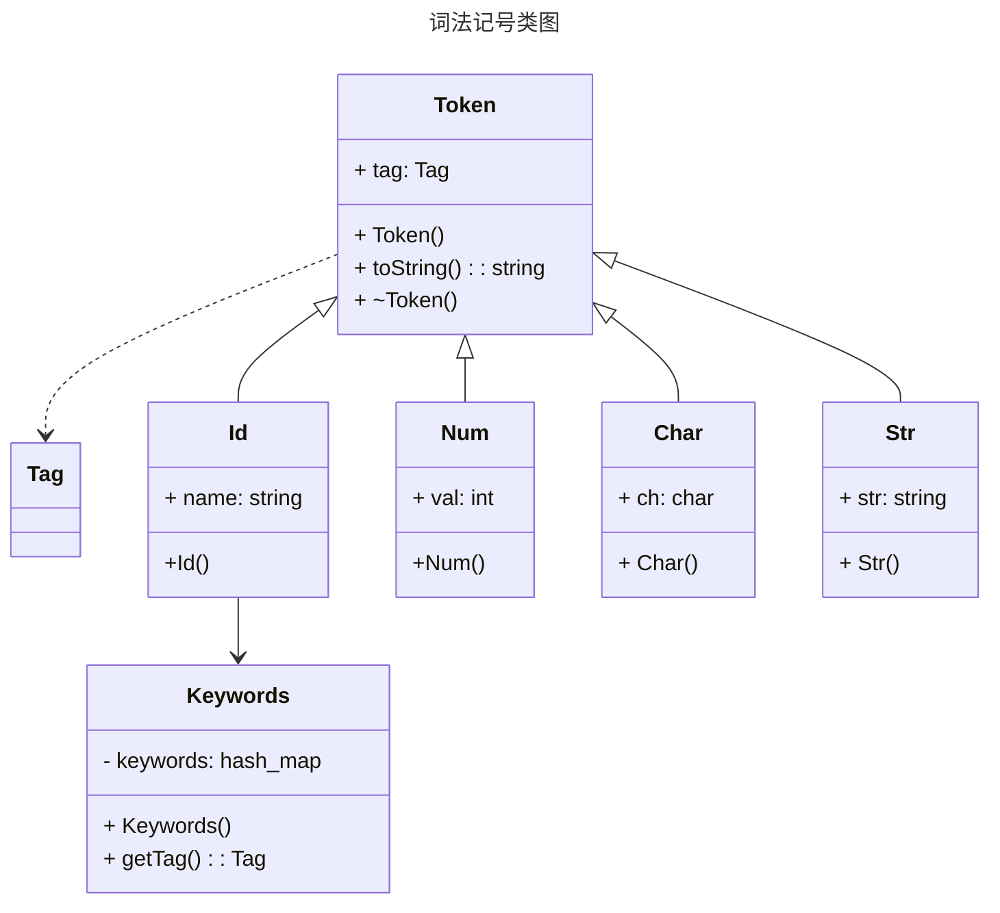
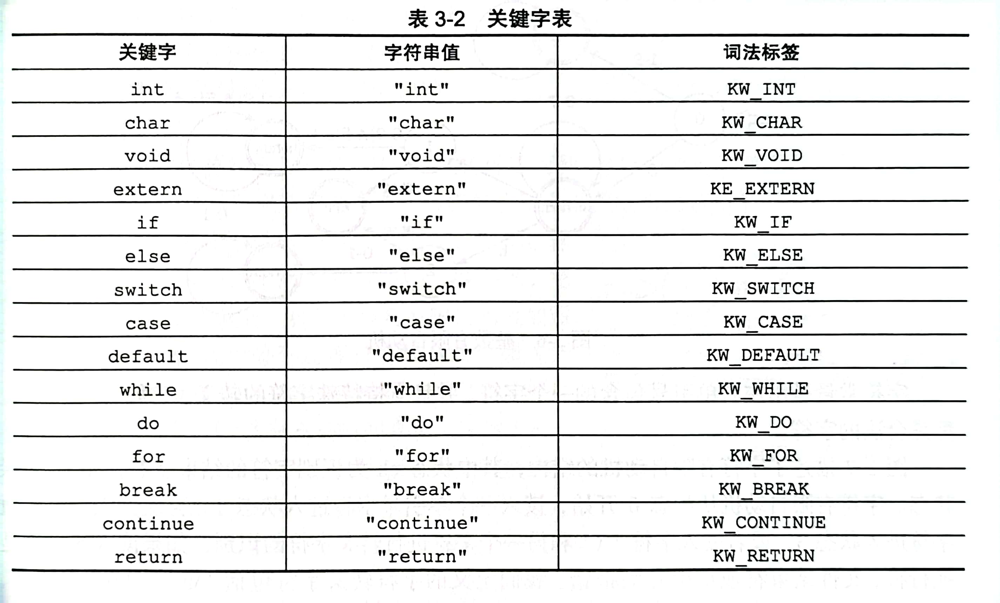
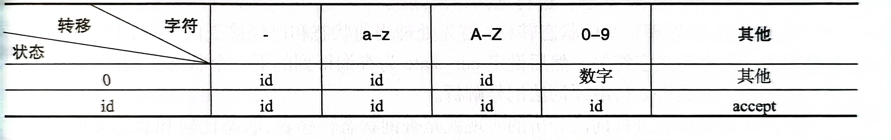
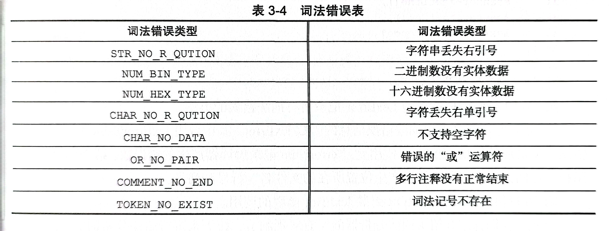

# 第三章 编译器构造

> 一个 C 语言子集的实现

[TOC]

## 词法分析



词法分析需要解决下面四个问题:

1. 扫描器如何实现源文件字符的扫描, 它与普通的读文件有什么区别?
2. 词法记号是如何定义的?
3. 为什么有穷自动机可以识别词法记号?
4. 解析器是如何利用有穷自动机将一传字符串转化为词法记号的?

### 扫描器

扫描器读取源文件, 按序返回文件内的字符, 直到文件结束. 使用 C 语言的`fscanf`或者`fread`可以轻松实现扫描器的功能:

```cpp
char Scanner::scan(FILE* file) {
    char ch;
    if (fscanf(file, "%c", &ch) == EOF) {
        ch = -1;
    }
    return ch;
}
```

这样做可以实现扫描器的基本功能, 但是并不高效. 因为词法分析器每次调用`scan`函数获取源文件的下一个字符时, 都会产生一次对磁盘的读操作, 而 IO 操作是比较耗时的. 更高效的方式是使用一块缓冲区保存后续的多个字符, 每次调用`scan`时首先从缓冲区按序获取字符, 只有缓冲区为空的时候才会读取磁盘重新加载缓冲区. 这有点类似于 Linux 的预读取机制.



### 词法记号

词法记号是高级语言代码的基本单位, 可以认为高级语言代码是词法记号按照一定规则的组合. 词法记号通常可以分为对标识符, 关键字, 常量, 界符四大类, 高级语言的定义对词法记号的定义有直接影响. 

1. 不同语言对标识符的定义不同, 例如 Visual Basic 不区分标识符的大小写, 而 C 语言区分. 

2. 不同语言的关键字表也不同,例如 C++的`virtual`关键字在 C语言中并不存在.
3. 不同语言的界符定义不同, 例如 PASCAL 语言的赋值运算为`:=`, 而 C 语言的赋值运算为`=`

本书编译系统处理的语言的词法记号如下:

1. 类型系统: 支持`int`, `char`, `void`基本类型和一维指针, 一维数组类型. 

    涉及的词法记号有关键字`int`, `char`和`void`,  指针运算符为`*`, 取址运算符为`&`, 数组运算符为`[`和`]`

2. 常量: 字符常量, 字符串常量, 二/八/十六进制整数.

    涉及的词法记号有数字常量`num`, 字符常量`ch`, 字符串常量`str`.

    与常量定义的变量使用标识符表示, 因此标识符`id`也是词法记号

3. 表达式: 

    1. 算术运算: 加`+`, 减`-`, 乘`*`, 除`/`, 取模`%`, 取负`-`, 自加`++`, 自减`--`
    2. 关系运算: 大于`>`, 大于等于`>=`, 小于`<`, 小于等于`<=`, 等于`==`, 不等于`!=`
    3. 逻辑运算: 与`&&`, 或`||`, 非`!`

    注意, 乘法运算符和指针运算符是同一个字符, 在词法分析器内它们被视为同一个词法记号. 同理, 减法运算符和取负运算符也是如此

4. 语句

    支持赋值语句, do-while, while, for 循环语句, if-else, switch-case 条件分支语句, 函数调用

    涉及的词法记号有:

    + `=`
    + `do`
    + `while`
    + `for`
    + `if`
    + `else`
    + `switch`
    + `case`
    + `default`
    + `return`
    + `break`
    + `continue`

    除此之外, 复合语句或者函数体需要使用花括号`{}`包含起来; 基本语句都以分号`;`结束; `case`和`default`关键字后使用冒号`:`分隔, 因此这些符号也是词法记号

5. 声明与定义

    支持`extern`变量声明, 函数声明, 变量, 函数定义.

    涉及到的词法记号有`extern`, `(`, `)`和`,`

6. 其他: 支持默认类型转换, 单行和多行注释等.

    默认类型的转换属于代码生成的内容, 注释不是有效的词法记号.

    额外还需要引入`err`表示词法分析出错时返回的词法记号, `end`表示文件结束



使用枚举类型记录所有词法记号的标签, 为后面的代码提供符号定义:

```cpp
enum Tag {
  	ERR, 
  	END,
  	ID,
    ...,
    KW_WHILE,
    AND,
    ...
};
```

使用大写以避免与 C 语言关键字冲突. 关键字都以`KW_`开始, 界符标签给予合适的名字

标签只是区分了不同的词法记号, 而对特殊的词法记号, 除了保存基本的信息, 还要保存标识符的名称, 常量值等信息, 用来构造符号表.



确定了词法记号之后, 接下来便是将扫描器输出的字符序列转化为词法记号的序列, 这一步由解析器完成. 解析器读入字符, 使用有穷自动机对输入字符进行匹配, 最终输出词法记号.

### 有穷自动机

#### 标识符

对于任意 DFA, 总有一个开始状态`0`, 它的输入是一串字符序列, 根据字符选择不同的转移进入下一个状态, 当遇到结束状态时便接受已经输入的字符串.

C语言对标识符的定义是: 以下划线或字母开始的任意下划线, 字母和数字的组合

#### 关键字

关键字是一类特殊的词法记号, 本质上与标识符没有任何区别, 只是词法分析器将其作为系统保留的标识符, 不允许用户重复定义. 我们在分析标识符结束后可以查询关键字表, 来确定当前识别的标识符是普通的标识符还是关键字. 



#### 常量

常量词法记号有三种: `num`, `ch`和`str`, 它们分别对应数字常量, 字符常量和字符串常量.

1. 数字常量: 对不同进制的整数的定义如下:

    1. 十进制整数: 以数字 1~9 开始, 0~9 中任意个数字组合的字符串
    2. 八进制整数: 以数字 0 开始, 0~7 中任意个数字组合的字符串.
    3. 二进制整数: 以字符串`0b`开始, 0~1 中任意个数字组合的字符串
    4. 十六进制整数: 以字符串`0x`开始的, 0~9 及字母 a~f, A~F 中一个或多个数字, 字母组合的字符串

    有穷自动机如图所示:

    

2. 字符的有穷自动机:

    

3. 字符串的有穷自动机:

    

4. 界符:

    词法记号中的界符数量较多, 但是就形式而言无非两种: 单字节界符合双字节界符.

    1. 单字节界符: `%`
    2. 双字节界符: `>=`

    下面是有穷自动机的结构:

    

5. 无效词法记号

    除了上面的词法记号, 还有两类自动机, 它们并不产生真正的词法记号, 称之为无效词法记号:

    1. 空白字符
    2. 注释

    根据 C 语言的特点, 所有有效词法记号之间可以出现任意多个空白字符和注释.

    1. 对于空白字符的有穷自动机识别结束之后应该如何处理? 有两种可选的方式:

        1. 不产生任何词法记号, 在识别结束后继续识别其他词法记号
        2. 产生词法记号`err`, 因为词法记号`err`会被词法分析器自动忽略. 出错的词法记号会被忽略, 因此不会影响后续词法记号的识别

        <center></center>

    2. 对于注释的有穷自动机:

        

        无论是单行注释还是多行注释, 识别结束后都会返回词法记号`err`. 这与空白字符有穷自动机的处理有所区别, 因为注释的有穷自动机包含了除法运算符的处理, 为了保持代码的一致性, 该有穷自动机必须返回一个记号.

#### 解析器

解析器的输入是扫描器产生的线性字符序列, 而输出的是词法记号序列. 解析器的构造依赖于词法记号有穷自动机实现, 有穷自动机构造完毕之后, 便可以编码实现解析器.

根据有穷自动机实现词法分析器一般有两种方式:

1. 表驱动: 需要为词法记号建立状态转移表

    

    在上表中, 只有出现其他字符的时候"accept", 这意味着, 这个字符不是自动机已经接受的字符. 因此, 在后续的词法记号自动机识别的过程中, 需要重新读入当前字符, 以避免当前读入字符被跳过. 为此, 每次查询状态转移表之前并不读入新的字符, 而是假定字符已经被读入. 那么自动机开始运行时, 需要将当前字符初始化为空格(或者其他空白字符), 这样自动机启动后会首先进入空白字符有穷自动机的处理, 识别这个字符.

    使用状态转移表进行词法分析的实现就是查询状态转移表, 状态比较和状态处理的过程, 这样的实现非常简单. 词法分析器的自动生成工具一般都采用这种方法. 词法分析器自动生成工具根据用户提供的词法记号定义配置文件, 建立词法记号有穷自动机 NFA, 然后将 NFA 确定化为 DFA, 再将 DFA 最小化, 生成状态转移表, 最后按照上述过程进行词法分析.

    ```cpp
    cur_char = ' ';
    Token* Lexer::tokenize() {
        cur_state = 0;
        while (1) {
            next_state = table[cur_state][cur_char];
            if (next_state == accept) {
                return process(cur_state);
            }
           	else if (next_state == error) {
                return lex_error(cur_state, cur_char);
            }
            else {
                handle_state(cur_state, cur_char);
                cur_state = next_state;
                cur_char = scan(file);
            }
        }
    }
    ```

    

    然而, 主流的编译器并未采用表驱动的词法分析方式, 而是采用硬编码的方式, 可能考虑了以下因素:

    1. 保存状态转移表需要大量的存储空间, 构建状态转移表对词法记号的定义有很强的依赖, 一旦更改了词法记号的定义, 状态转移表变化很大, 不利于代码维护
    2. 基于表驱动的词法分析过程虽然简单, 但是灵活性较差, 不利于对特定状态的自定义处理. 所有词法记号有穷自动机的状态转移在代码层形式基本相同, 导致代码可读性较差, 调试不够方便
    3. 基于表驱动的词法分析在每次读入一个字符后都会发生状态转移, 大量的查表, 状态比较和状态处理降低性能

2. 硬编码: 使用程序控制结构直接实现. 

    ```cpp
    if (ch == 下划线 || 字母) {
     	ch = scan(file);
        while (ch == 下划线 || 字母 || 数字) {
            ch = scan(file);
        }
    }
    ```

    ******

    还有一种方式称为直接编码. 我们对有穷自动机做如下处理: 将有穷自动机的状态转化为一个标号, 将每条状态转移弧转化为一条跳转到目标状态的`goto`语句, 且在每条`goto`语句前读入新的字符, 弧上的字符标签转化为判断条件:

    ```cpp
    0: 
    	if (ch == 下划线 || 字母) {
            ch = scan(file);
            goto 1;
        }
    	goto end;
    1:
    	if (ch == 下划线 || 字母 || 数字) {
        	ch = scan(file);
            goto 1;
        }
    	goto end;
    end:
    	...
    ```

    这种将 DFA 直接转化为编码的方式一般称为直接编码方式. 虽然使用这种方式也可以完成词法分析器的构造, 但是这种方式依然需要考虑自动机状态的转换, 并且包含大量的`goto`语句, 代码明显不如硬编码方式简洁. 因此, 使用硬编码方式的词法分析是较好的选择.

接下来逐一描述词法记号的硬编码实现:

1. 标识符

    在前面的章节已经描述了标识符的硬编码实现.

    ```cpp
    if ((ch >= 'a' && ch <= 'z') ||
        (ch >= 'A' && ch <= 'Z') ||
        ch == '_') {
        string name = "";
        do {
            name.push_back(ch);
            scan();
        } while ((ch >= 'a' && ch <= 'z') ||
                 (ch >= 'A' && ch <= 'Z') ||
                 ch == '_' ||
                 (ch >= '0' && ch <= '9'));
        Tag tag = keywords.getTag(name);
        if (tag == ID) { t = new Id(name); }
        else { t = new Id(tag); }
    }
    ```

    这里依然假定当前字符已经提前读入, 存储在`ch`内.

2. 关键字

    ```cpp
    /*
    	关键字列表初始化
    */
    Keywords::Keywords() {
        keywords["int"] = KW_INT;
        keywords["char"] = KW_CHAR;
        // ...
    }
    
    /*
    	测试是否是关键字
    */
    Tag Keywords::getTag(string name) {
        return keyworkds.find(name) != keywords.end() ? keywords[name] : ID;
    }
    ```

3. 常量: 数字常量, 字符常量, 字符串常量的顺序介绍常量词法记号的识别. 

    1. 数字常量代码

        ```cpp
            if (ch >= '0' && ch <= '9') {
                int val = 0;
                // dec
                if (ch != '0') {
                  do {
                    val = val * 10 + ch - '0';
                    scan();
                  } while (ch >= '0' && ch <= '9');
                } else {
                  scan();
                  // hex
                  if (ch == 'x') {
                    scan();
                    if ((ch >= '0' && ch <= '9') || (ch >= 'A' && ch <= 'A') ||
                        (ch >= 'a' && ch <= 'z')) {
                      do {
                        val = val * 16 + ch;
                        if (ch >= '0' && ch <= '9') {
                          val -= '0';
                        } else if (ch >= 'A' && ch <= 'F') {
                          val += 10 - 'A';
                        } else {
                          val += 10 - 'a';
                        }
                        scan();
                      } while ((ch >= '0' && ch <= '9') || (ch >= 'A' && ch <= 'A') ||
                               (ch >= 'a' && ch <= 'z'));
                    }
                  }
                  // bin
                  else if (ch == 'b') {
                    scan();
                    if (ch >= '0' && ch <= '1') {
                      do {
                        val = val * 2 + ch - '0';
                        scan();
                      } while (ch >= '0' && ch <= '1');
                    } else {
                      LEXERROR(NUM_BIN_TYPE);
                      t = new Token(ERR);
                    }
                  }
                  // oct
                  else if (ch >= '0' && ch <= '7') {
                    do {
                      val = val * 8 + ch - '0';
                      scan();
                    } while (ch >= '0' && ch <= '7');
                  }
                }
                if (!t) {
                  t = new Num(val);
                }
              }
        ```
    
    2. 字符常量
    
        ```cpp
        if (ch == '\'') {
            char c;
            scan();
            if (ch == '\\') {
              scan();
              if (ch == 'n') {
                c = '\n';
              } else if (ch == '\\') {
                c = '\\';
              } else if (ch == 't') {
                c = '\t';
              } else if (ch == '0') {
                c = '\0';
              } else if (ch == '\'') {
                c = '\'';
              } else if (ch == -1 || ch == '\n') {
                LEXERROR(CHAR_NO_R_QUITION);
                t = new Token(ERR);
              }
              // 否则没有转义，意即，字符本身就是'\'
              else {
                c = ch;
              }
            }
            // EOF or new line
            /*
             ch = '
             ';
            */
            else if (ch == '\n' || ch == -1) {
              LEXERROR(CHAR_NO_R_QUITION);
              t = new Token(ERR);
            }
            // no data
            else if (ch == '\'') {
              LEXERROR(CHAR_NO_DATA);
              t = new Token(ERR);
              scan();
            }
            // ordinary char
            else {
              c = ch;
            }
        
            // if no error
            if (!t) {
              if (scan('\'')) {
                t = new Char(c);
              } else {
                LEXERROR(CHAR_NO_R_QUITION);
                t = new Token(ERR);
              }
            }
          }
        ```
    
    3. 字符串常量
    
        ```cpp
         if (ch == '"') {
            string str = "";
            while (!scan('"')) {
              if (ch == '\\') {
                scan();
                if (ch == '\\') {
                  str.push_back('\n');
                } else if (ch == '\\') {
                  str.push_back('\\');
                } else if (ch == 't') {
                  str.push_back('\t');
                } else if (ch == '"') {
                  str.push_back('"');
                } else if (ch == '0') {
                  str.push_back('\0');
                } else if (ch == '\n') {
                    // 对于这种情况, 不做多余处理
                    /*
                    "Hello \
                    World!"
                    */
                } else if (ch == -1) {
                  LEXERROR(STR_NO_R_QUITION);
                  t = new Token(ERR);
                  break;
                } else {
                  str.push_back(ch);
                }
              }
              // 文件结束或者没有使用转移字符换行
              /*
               "Hello 
               Wolrd!"
              */
              else if (ch == '\n' || ch == -1) {
                LEXERROR(STR_NO_R_QUITION);
                t = new Token(ERR);
                break;
              }
              // normal char
              else {
                str.push_back(ch);
              }
            }
            if (!t) {
              t = new Str(str);
            };
          }
        ```
    
    4. 界符
    
        1. 单字节界符
    
            ```cpp
            if (ch == '%') {
                t = new Token(MOD);
                scan();
            }
            ```
    
        2. 双字节界符
    
            对于双字符标签, 需要读入两个字符以确定界符的词法标签.
    
            ```cpp
            if (ch == '>') {
                Tag tag = GT;
                scan();
                if (ch == '=') { 
                	tag = GE;
                	scan();
                }
                t = new Token(tag);
            }
            ```
    
            使用这样的方式识别双字节界符比较繁琐, 为简化识别过程, 需要重新设计接口:
    
            ```cpp
            bool Lexer::scan(char need = 0) {
                ch = scanner.scan();
                if (need) {
                    // 与预期不相符
                    if (ch != need) 
                        return false;
                    // 与预期相符
                    ch = scanner.scan();
                    return true;
                }
                return true;
            }
            ```
    
            将所有的界符的识别过程放在一个`switch-case`中:
    
            ```cpp
            switch(ch) {
                case '+':
                    t = new Token(scan('+') ? INC : ADD); 
                    scan();
                    break;
                // ...
                case '|':
                    t = new Token(scan('|') ? OR : ERR);
                    if (t->tag == ERR) {
                        LEXERROR(OR_NO_PAIR);
                    }
                    break;
                // ...
                default:
                    t = new Token(ERR);
                    LEXERROR(TOKEN_NO_EXIST);
                    scan();
            }
            ```
    
            对于除号的处理见下文.
    
    5. 无效词法记号
    
        1. 空白字符: 每次进行词法记号识别之前, 词法分析器需要尽可能忽略空白字符:
    
            ```cpp
                    while (ch == ' ' || ch == '\n' || ch == '\t') {
                        scan();
                    }
            ```
        
        1. 对于注释, 与除号有相同前缀, 需要一起处理. 对于注释, 使用`ERR`标识
        
            ```cpp
                    switch(ch) {
                        // ...
                        case '/':
                            scan();
                            // 单行注释
                            if (ch == '/') {
                                while (!(ch == '\n' || ch == -1)) {
                                    scan();
                                }
                                t = new Token(ERR);
                            }
                            // 多行注释
                            else if (ch == '*') {
                                while (!scan(-1)) {
                                    if (ch == '*') {
                                        while (scan('*')) {}
                                        if (ch == '/') {
                                            t = new Token(ERR);
                                            break;
                                        }
                                    }
                                }
                                // 直到文件末尾也没有读到结束符
                                if (!t && ch == -1) {
                                    LEXERROR(COMMENT_NO_END);
                                    t = new Token(ERR);
                                }
                            }
                            // 除号
                            else {
                                t = new Token(DIV);
                            }
                            break;
                    }	
            ```
        
    
    对于无效的词法记号, 词法分析器有两种处理方式:
    
    1. 不做任何处理: 在词法分析器内将错误词法记号忽略, 这样语法分析器不会接收到错误词法记号
    
        ```cpp
        for (; ch != -1; ) {
            Token *t = NULL;
            while (ch == ' ' || ch == '\n' || ch == '\t')
                scan();
            // 处理其他词法记号的识别
            if (token) delete token;
            token = t;
            // 返回有效记号, 忽略错误记号
            if (token && token->tag != ERR)
                return token;
            else
                continue;
            
        }
        ```
    
    2. 返回错误记号    

#### 错误处理



在扫描器中计算出字符所在行和列的位置, 且保存处理的源文件名:

```cpp
enum LexError {
// ...
};

void Error::lexError(int code) {
	static const char* lexErrorTable[] = {
    	"字符串确实左引号",
    	//...
	};

	errorNum++;
	printf("&s<%d 行, %d 列> 词法错误 : %s. \n",
      	scanner->getFile(),
   	    scanner->getLine(),
       	scanner->getCol(),
        lexErrorTable[code]);
}
#define LEXERROR(code) Error::lexError(code)
```

