> 在第五章中，我们了解了Ajax数据的分析和爬取方式，这其实是JavaScript动态渲染页面的一种情形，通过直接分析Ajax，是我们仍然可以借助`requests`或者`urllib`实现数据爬取
>
> 不过JavaScript动态渲染的页面不止Ajax一种。例如，有些页面的分页部分由JavaScript生成，而非原始HTML代码，这其中其实并不包含Ajax请求。再例如ECharts的[官方示例](https://echarts.apache.org/examples/zh/editor.html?c=line-aqi)，这些图形都是经过JavaScript计算之后生成的。还有类似淘宝这种页面，即使是Ajax获取的数据，其Ajax接口中也含有很多加密参数，使我们难以直接找出规律，也很难直接通过分析Ajax爬取数据。
>
> 为了解决这次额问题，我们可以直接模拟浏览器运行，然后爬取数据，这样就可以实现**在浏览器中看到的内容是什么样，爬取的源码就是什么样——所见即所爬**。此时我们无须管网页内部的JavaScript是用什么算法渲染页面，也不用管网页后台的Ajax接口到底有哪些参数。

[TOC]

# 1. 准备工作

[安装方法](https://setup.scrape.center/selenium)

# 2. 基本用法

[7.1_基本用法](https://github.com/LiuYuan-SHU/MyNotes/blob/26388cbcae3136a3bf465322cb88573f8fadb11f/Crawler%20with%20Python3/Python3%20web%20crawler%20development%20practice%EF%BC%88Edition2%EF%BC%89%20-%20Cui%20Qingcai/%E7%AC%AC%E4%B8%83%E7%AB%A0/7.1_%E5%9F%BA%E6%9C%AC%E7%94%A8%E6%B3%95.py)

```python
from selenium import webdriver
from selenium.webdriver.common.by import By
from selenium.webdriver.common.keys import Keys
from selenium.webdriver.support import expected_conditions as EC
from selenium.webdriver.support.wait import WebDriverWait

browser = webdriver.Chrome()
try:
    browser.get('https://www.baidu.com')
    input = browser.find_element(By.ID, 'kw')
    input.send_keys('Python')
    input.send_keys(Keys.ENTER)
    wait = WebDriverWait(browser, 10)
    wait.until(EC.presence_of_element_located((By.ID, 'content_left')))
    print(browser.current_url)
    print(browser.get_cookies())
    print(browser.page_source)
finally:
    browser.close()
```

## 代码逻辑

1. 控制Chrome访问https://www.baidu.com

    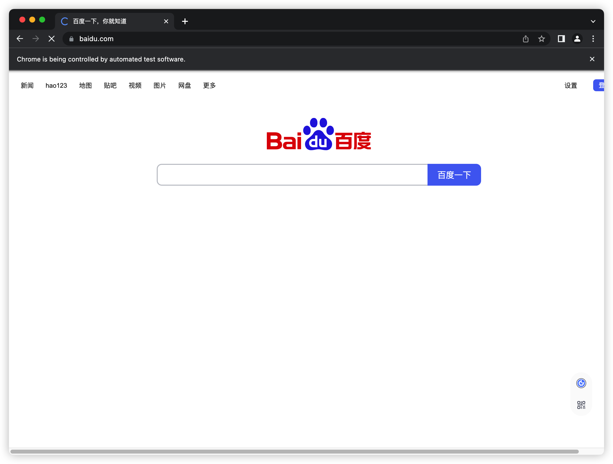

2. 在输入框（其`id`为`kw`）输入Python，按下回车

    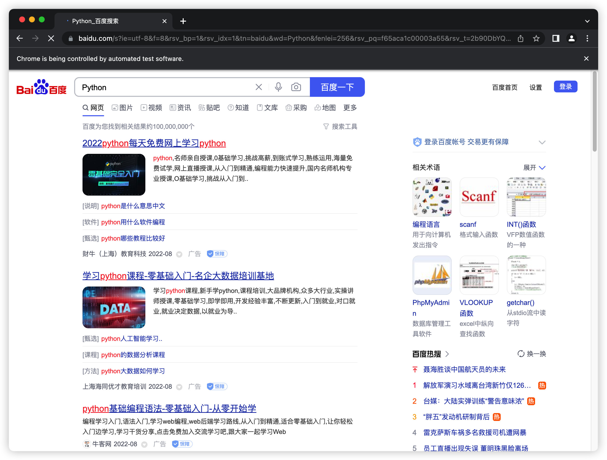

3. 等待浏览器响应10s，获取`id`为`content_left`的元素的全部内容

    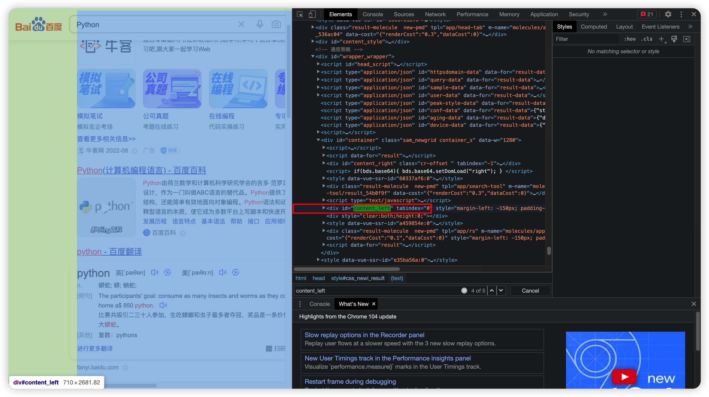

## 运行结果

使用管道操作，将终端的打印结果打印到`output.txt`：

```shell
python3 7.1_基本用法.py > output.txt
```

运行结果：

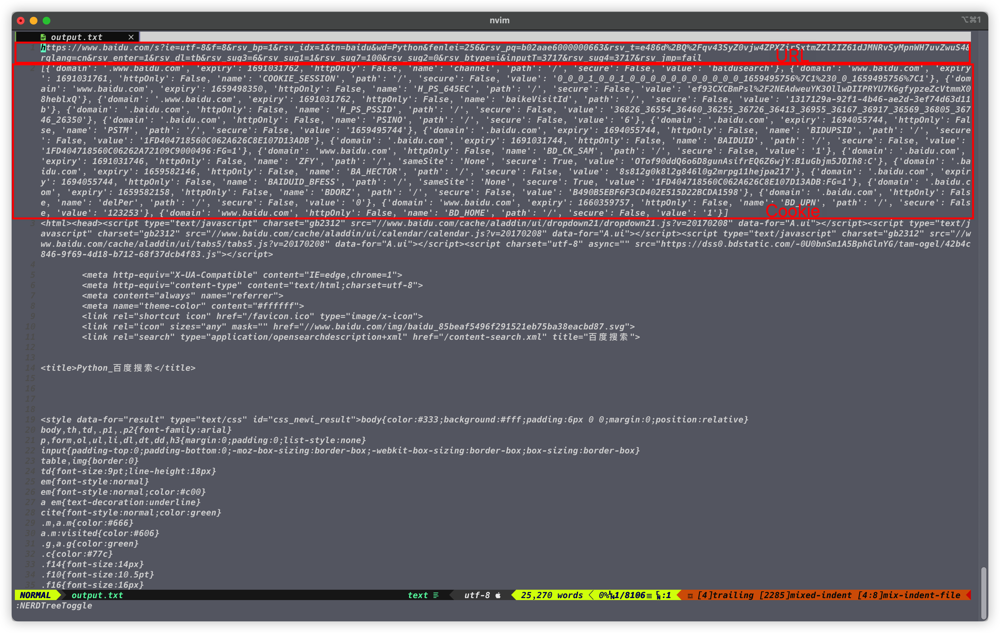

可以看到，我们得到的当前URL、Cookie内容和页面源码代码都是浏览器中的真实内容

***所以说，用`Selenium`驱动浏览器加载网页，可以直接拿到`JavaScrip`渲染的结果，无需关心使用的是什么加密系统***

# 3. 初始化浏览器对象

`Selenium`支持的浏览器非常多，既有Chrome、Firefox、Edge、Safari等电脑端的浏览器，也有Android、BlackBerry等手机端的浏览器。我们可以使用如下方式初始化浏览器对象：

```python
from selenium import webdriver

browser = webdriver.Chrome()
browser = webdriver.Firefox()
browser = webdriver.Edge()
browser = webdriver.Safari()
```

这样就完成了浏览器对象的初始化，并将其赋值给了`browser`。接下来，我们要做的就是调用`browser`，执行其各个方法以模拟浏览器的操作。

# 4. 访问页面

我们可以使用`get`方法请求网页，向其传入要请求的网页的URL即可。

```python
from selenium import webdriver

browser = webdriver.Chrome()
browser.get('https://www.taobao.com')
print(browser.page_source)
```

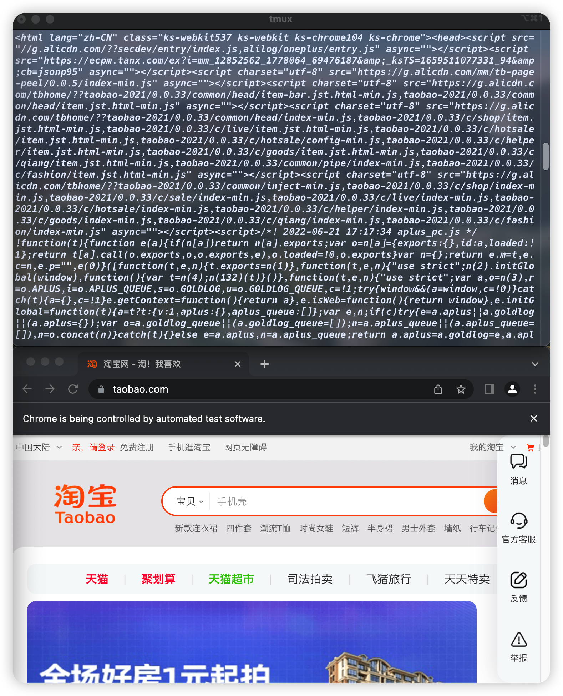

# 5. 查找节点

> `Selenium`可以驱动浏览器完成各种操作，比如填写表单、模拟点击等。对此，`Selenium`为我们提供了一系列用来查找节点的方法，我们可以使用这些方法获取想要的节点，以便执行下一步的操作或者提取信息。

## 单个节点——`find_element`

想从淘宝页面中提取搜索框这个节点，首先就要观察这个页面的源代码。

我们可以发现，淘宝页面的`id`属性是`q`，`name`属性也是`q`。此外，还有许多其他属性，我们可以用多种方式获取它们。例如，我们可以使用`find_element`方法对`id`、`name`等属性进行获取，此外还有依据XPath、CSS选择器等的获取方式。

```python
from selenium import webdriver
from selenium.webdriver.common.by import By

browser = webdriver.Chrome()
browser.get('https://www.taobao.com')
# 使用id属性查找
input1 = browser.find_element(By.ID, 'q')
# 使用CSS选择器
input2 = browser.find_element(By.CSS_SELECTOR, '#q')
# 使用XPath
input3 = browser.find_element(By.XPATH, '//*[@id="q"]')
print('By.ID: ', input1)
print('By.CSS: ', input2)
print('By.XPATH: ', input3)
browser.close()
```

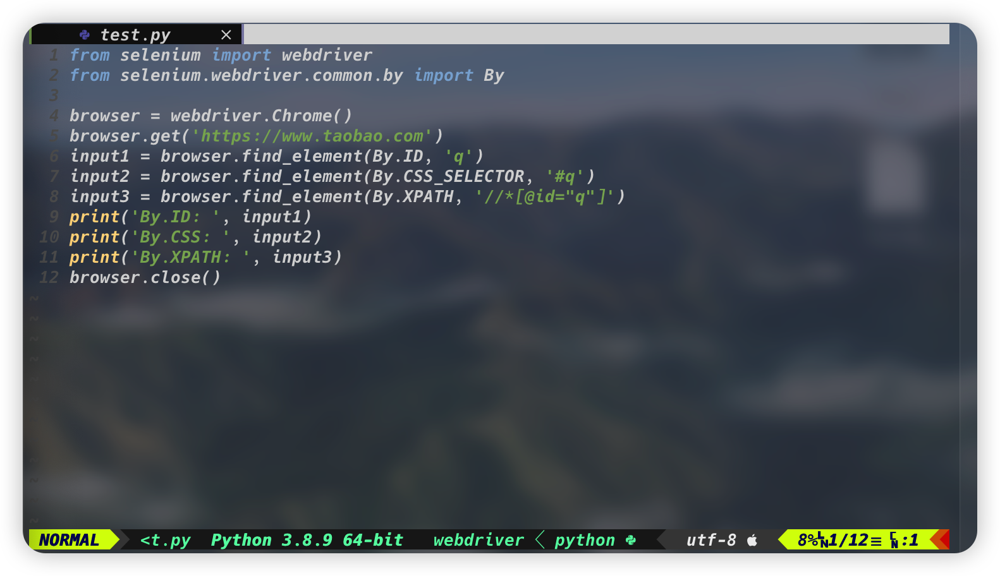

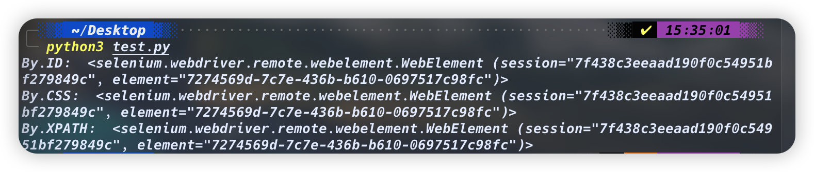

## 多个节点——`find_elements`

如果查找的目标节点在网页中只有一个，那么用`find_element`方法就可以完全实现。但如果目标节点有多个，再用`find_element`方法查找，就只能得到第一个节点了，此时需要用`find_elements`方法才能找到所有满足条件的节点。

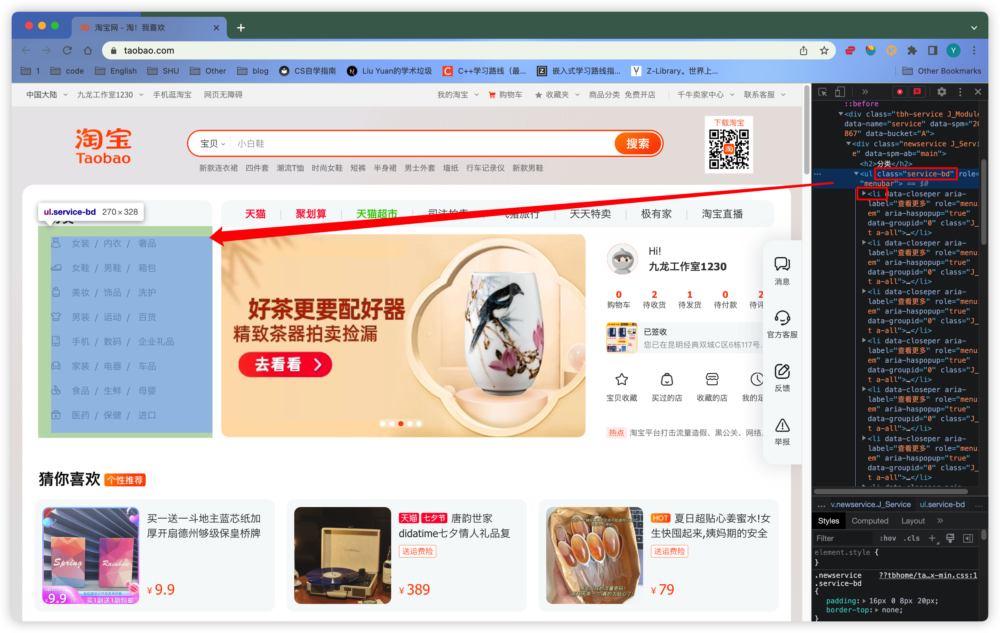

我们想要获得左侧导航栏中的元素，可以在`class=service-bd`下继续选择所有的`li`节点：

```python
from selenium import webdriver
from selenium.webdriver.common.by import By

browser = webdriver.Chrome()
browser.get('https://www.taobao.com')

try:
    items = browser.find_elements(By.XPATH, '//ul[@class="service-bd"]/li/a')
    for item in items:
        print(item.text)
finally:
    browser.close()
```

但是需要注意的是，运行的浏览器中必须显示对应的内容，我们才能获得其中的数据，也就是说，窗口必须是这样的：

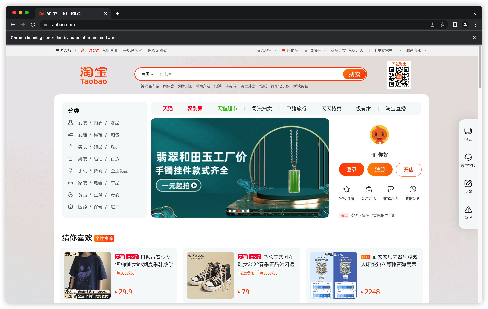

而不是这样的：

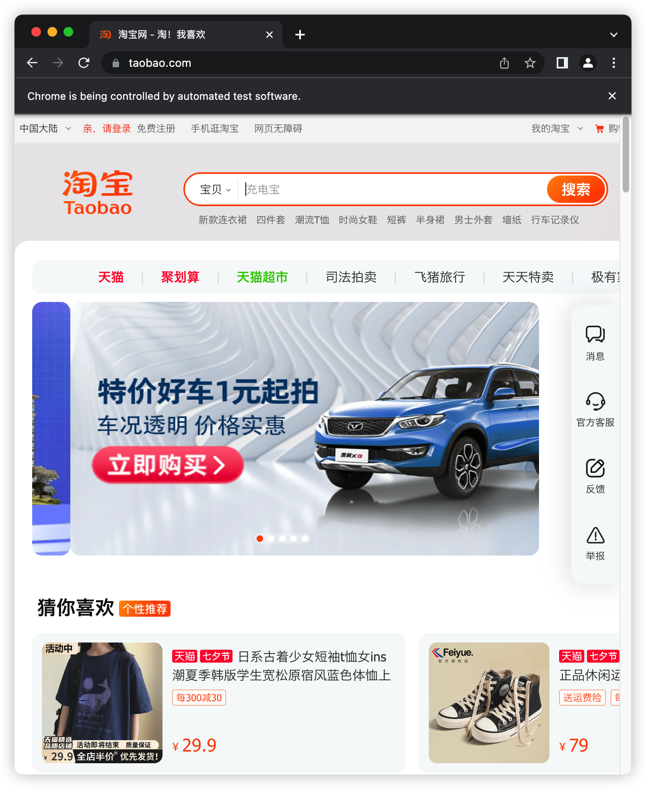

用程序的执行来看更为直观：

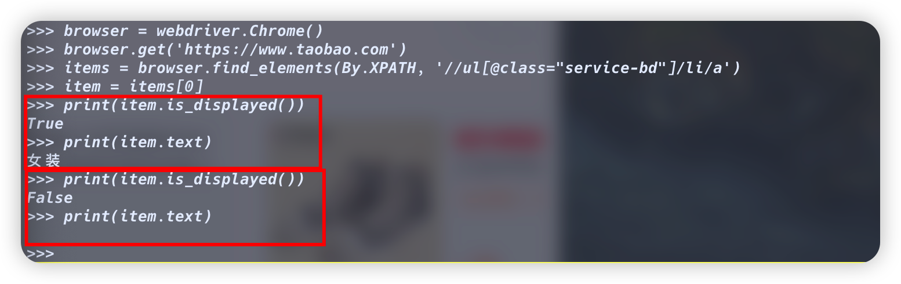

当节点被显示时（`is_displayed() == True`），我们可以拿到对应节点的文本；但是如果我们调整窗口大小，节点不显示之后，我们就无法获取对应的文本，这点尤其需要注意。

# 6. 节点交互

Selenium可以驱动浏览器执行一些操作。比较常见的方法有：用`send_keys`方法输入文字，用`clear`方法清空文字，用`click`方法点击按钮。示例如下：

```python
from selenium import webdriver
from selenium.webdriver.common.by import By
import time

browser = webdriver.Chrome()
browser.get('https://www.taobao.com')
input = browser.find_element(By.ID, 'q')
# 测试输入
input.send_keys('iPhone')
time.sleep(1)
# 测试清空
input.clear()

input.send_keys('iPad')
# 测试按钮
button = browser.find_element(By.CLASS_NAME, 'btn-search')
# 点击按钮
button.click()
```

更多操作参见[官方文档](http://selenium-python.readthedocs.io/api.html#module-selenium.webdriver.remote.webelement)

# 7. 动作链

> 有一些操作，它们没有特定的执行对象，比如鼠标拖拽、键盘按键等，这些操作需要用另一种方式执行，这就是动作链

```python
>>> from selenium import webdriver
>>> from selenium.webdriver.common.by import By
>>> browser = webdriver.Chrome()
>>> browser.get('http://www.runoob.com/try/try.php?filename=jqueryui-api-droppable')
>>> browser.switch_to.frame('iframeResult')
>>> source = browser.find_element(By.ID, 'draggable')
>>> target = browser.find_element(By.ID, 'droppable')
>>> actions = webdriver.ActionChains(browser)
>>> actions.drag_and_drop(source, target)
<selenium.webdriver.common.action_chains.ActionChains object at 0x10c019dc0>
>>> actions.perform()
>>> browser.close()
```

运行结果：

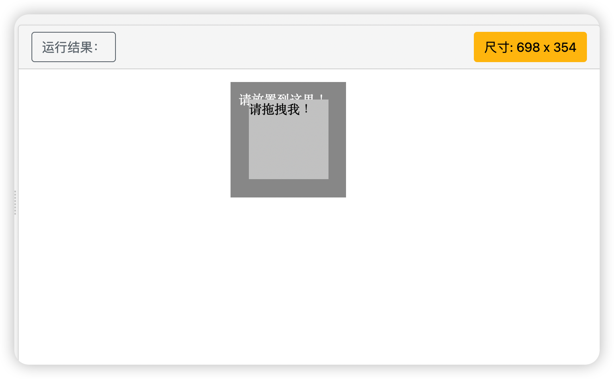

[更多操作链](http://selenium-python.readthedocs.io/api.html#module-selenium.webdriver.common.action_chains)

## `switch_to`

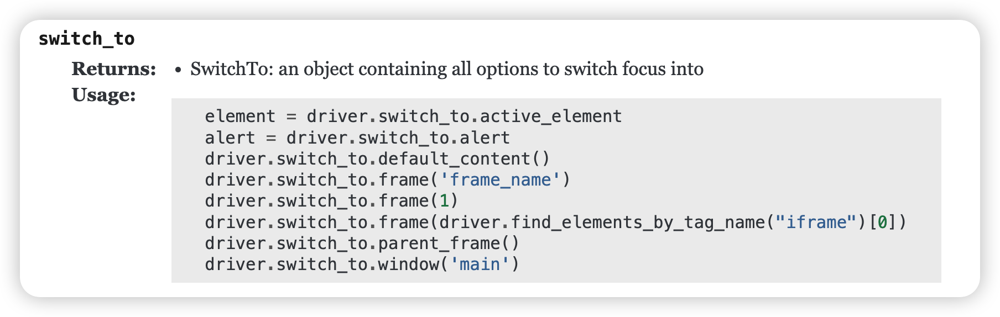

切换框架，在本例中，使用`switch_to`方法能够切换到对应的框架中，我们才能继续操作我们想要的内容。否则`find_element`方法就会找不到我们想要的东西

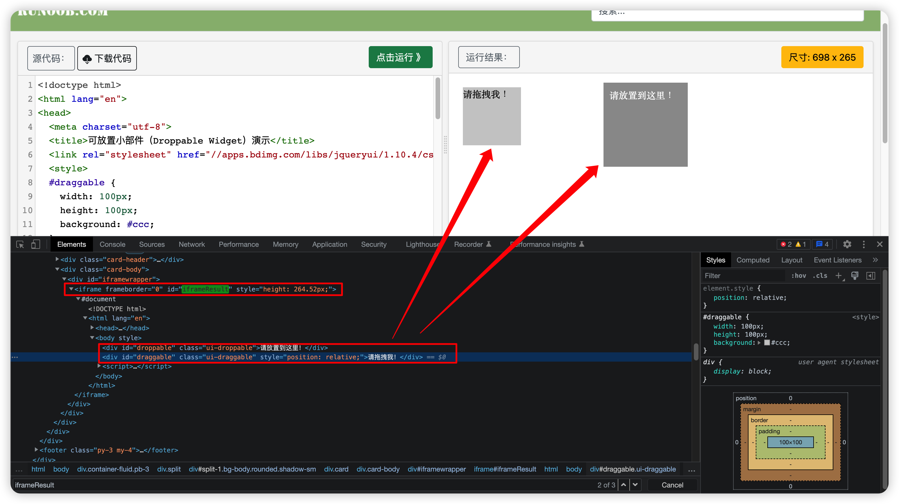

# 8. 运行JavaScript

还有一些操作，Selenium没有提供API。例如下拉进度条。面对这种情况可以模拟运行JavaScript，此时使用`execute_script`方法可以实现：

```python
>>> browser = webdriver.Chrome()
>>> browser.get('https://www.zhihu.com/explore')
>>> browser.execute_script('window.scrollTo(0, document.body.scrollHeight)')
>>> browser.execute_script('alert("To Bottom")')
```

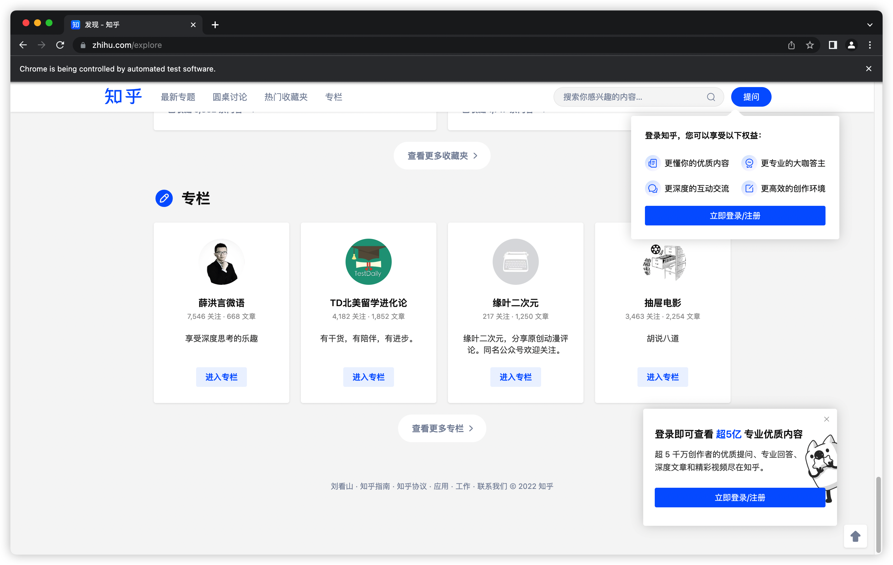

**所以说，有了`execute_script`方法，那些没有被提供API的功能几乎都可以用运行JavaScript的方式实现**

# 9. 获取节点信息

**前面我们已经通过`page_source`属性获取了网页源代码，就可以通过解析库从中提取信息了**

当然，Selenium本身也提供一些获取节点信息的方法：

## 获取属性——`get_attribute`

```python
>>> browser.get('https://spa2.scrape.center')
>>> logo = browser.find_element(By.CLASS_NAME, 'logo-image')
>>> print(logo)
<selenium.webdriver.remote.webelement.WebElement (session="642fb6079ed78bb1141ed955e7f3ae9b", element="2dfed4f0-b60a-4a89-9ec9-e9e651fab7e5")>
>>> print(logo.get_attribute('src'))
https://spa2.scrape.center/img/logo.a508a8f0.png
```

## 获取文本——`text`

## 获取节点ID、位置、标签名与大小

```python
print(input.id)
print(input.location)
print(input.tag_name)
print(input.size)
```

# 10. 切换frame

在网页中有一种节点叫做`iframe`，也就是子Frame，相当于页面的子页面，它的结构和外部网页的结构完全一致。Selenium打开一个页面后，默认是在父Frame里面操作，此时这个页面中如果有子Frame，那么它是不能够获取子Frame里的节点的，这时候就需要使用`switch_to.frame`方法切换Frame


# 11. 延时等待

在Selenium中，`get`方法在网页框架加载结束之后才会结束执行，如果我们尝试在`get`方法执行完毕时获取网页源代码，其结果可能并不是浏览器完全加载完成的页面，因为某些页面有额外的Ajax请求，页面还会经由JavaScript渲染。所以在有的时候，我们需要设置浏览器等待一定的时间，确保节点已经加载出来。

## 隐式等待

在查找节点而节点没有立即出现的时候，隐式等待会先等待一段时间再查找节点

```python
browser.implicitly_wait(10)
```

## 显式等待

隐式等待的效果其实并不好，因为我们只规定了一个固定时间，而页面的加载时间会受网络条件影响。

还有一种更合适的等待方式——显式等待。这种方式会指定要查找的节点和最长等待时间。如果在规定时间内加载了要查找的节点，就返回这个节点；如果到了规定时间依然没有加载出来，就抛出超时异常。

```python
from selenium import webdriver
from selenium.webdriver.common.by import By
from selenium.webdriver.support.wait import WebDriverWait
from selenium.webdriver.support import expected_conditions as EC

browser = webdriver.Chrome()
browser.get('https://www.taobao.com')
wait = WebDriverWait(browser, 10)
input = wait.until(EC.presence_of_element_located((By.ID, 'q')))
button = wait.until(EC.presence_of_element_located((By.CSS_SELECTOR, '.btn-search')))
print(input, button)

browser.close()
```

[更多等待条件和参数](https://selenium-python.readthedocs.io/api.html#module-selenium.webdriver.support.expected_conditions)

# 12. 前进和后退

平时使用浏览器的时候，都有前进和后退功能，Selenium也可以完成这个操作，它使用`forward`方法实现前进，使用`back`方法实现后退。

```python
import time
from selenium import webdriver

browser = webdriver.Chrome()
browser.get('https://www.baidu.com')
browser.get('https://www.taobao.com')
browser.get('https://www.python.org')
browser.back()
time.sleep(1)
browser.forward()
browser.close()
```

# 13. Cookie

对Cookie进行获取、添加、删除等。

```python
:!cat test.py
from selenium import webdriver

browser = webdriver.Chrome()
browser.get('https://www.zhihu.com/explore')
print(browser.get_cookies())
browser.add_cookie({
    'name': 'name',
    'domain': 'www.zhihu.com',
    'value': 'liuyuan'
    })
print(browser.get_cookies())
browser.delete_all_cookies()
print(browser.get_cookies())
browser.close()
```

运行结果：

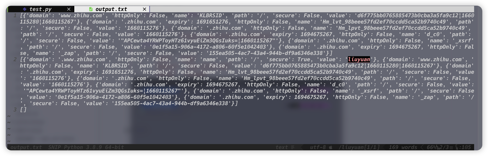

# 14. 选项卡管理

```python
from selenium import webdriver
import time

browser = webdriver.Chrome()
browser.get('https://www.baidu.com')

# execute javascript to open new tab
browser.execute_script('window.open()')
print(browser.window_handles)

# switch tabs
browser.switch_to.window(browser.window_handles[1])
browser.get('https://www.taobao.com')
time.sleep(1)
browser.switch_to.window(browser.window_handles[0])
browser.get('https://www.python.org')
```

结果：

```
['CDwindow-F2CCBAE07E78BF4521BD1FDC49FA1CEC', 'CDwindow-5027C2922D4A2143F4614606811A78AB']
```

# 15. 异常处理

[官方文档](http://selenium-python.readthedocs.io/api.html#module-selenium.common.exceptions)

# 16. 反屏蔽

在大多数情况下，检测的基本原理是监测当前浏览器窗口下的`window.navigator`对象中是否包含`webdriver`属性。因为在正常使用浏览器的时候，这个属性是`undefined`。一旦使用了Selenium，它就会给`window.nevigator`设置`webdriver`属性。很多网站通过JAvaScript语句判断是否存在`webdriver`属性，如果存在就直接屏蔽

例如：[测试网站](https://antispider1.scrape.center)

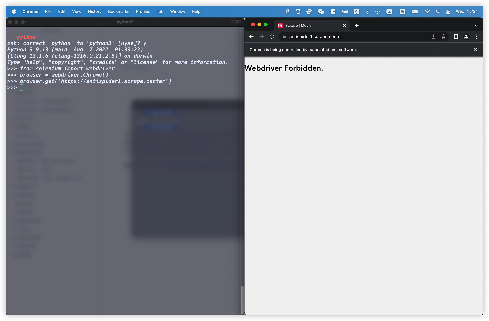

## 解决方法

### 使用JavaScript语句置空？

```javascript
Object.defineProperty(navigator, "webdriver", {get: () => undefined})
```

这行代码确实可以置空对应属性，但是这个方法是在页面加载完成之后才执行的，太晚了，网页早在渲染之前就已经检测对应属性了。所以这个方法不能达到想要的效果

### CDP

**CDP（Chrome Devtools Protocol）**可以解决这个问题。利用它可以在每个页面刚加载的时候就执行JavaScript语句，将`webdriver`属性值空。这里执行的CDP方法叫做`Page.addScriptToEvaluateOnNewDocument`，将上面的JavaScript语句传入其中即可。另外，还可以加入几个选项来隐藏`WebDriver`提示条和自动化拓展信息。

```python
import time

from selenium import webdriver
from selenium.webdriver import ChromeOptions

option = ChromeOptions()
# 隐藏WebDriver提示条
option.add_experimental_option('excludeSwitches', ['enable-automation'])
# 隐藏自动化拓展信息
option.add_experimental_option('useAutomationExtension', False)

browser = webdriver.Chrome(options=option)
# 利用CDP在页面加载前执行JavaScript
browser.execute_cdp_cmd('Page.addScriptToEvaluateOnNewDocument', {'source
': 'Object.defineProperty(navigator, "webdriver", { get: () => undefined
})'})
browser.get('https://antispider1.scrape.center')
time.sleep(3)

browser.close()
```

运行结果：

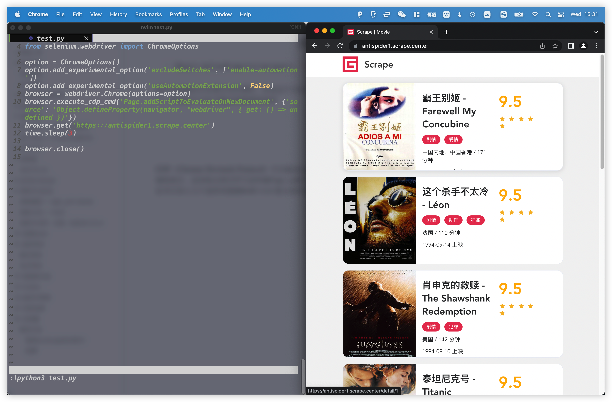

在大多时候，以上方法可以实现Selenium的反屏蔽。但是也存在一些特殊网站会对WebDriver属性设置更多的特征检测，这种情况下可能需要具体检测。

# 17. 无头模式

在无头模式下，在网站运行的时候并不会弹出窗口，从而减少了干扰，并且减少了一些资源的加载，所以无头模式在一定程度上节省了资源加载的时候和网络带宽。

```python
from selenium import webdriver
from selenium.webdriver import ChromeOptions

option = ChromeOptions()
option.add_argument('--headless')
browser = webdriver.Chrome(options=option)
browser.set_window_size(1366, 768)
browser.get('https://www.baidu.com')
browser.get_screenshot_as_file('preview.png')
```

运行结果：

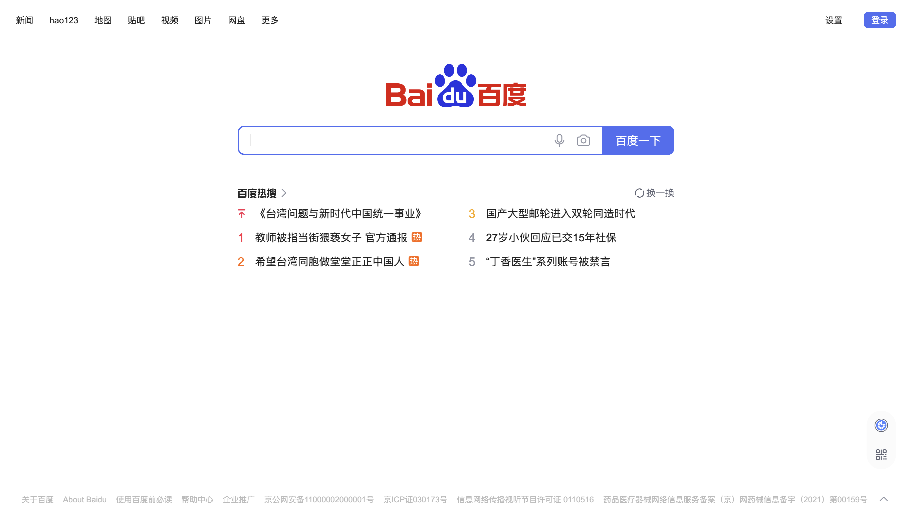

在无头模式下，最好设置一下窗口的大小，因此这里调用了`set_window_size`方法。


