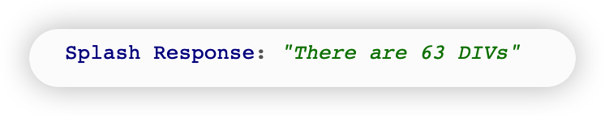

[TOC]

# 2. 准备工作

https://setup.scrape.center/splash

## 安装Docker

```shell
brew install --cask docker
```

## 安装splash

```shell
docker run -p 8050:8050 scrapinghub/splash
```

# 3. 实例引入

主界面：


测试百度：


Splash通过Lua脚本控制页面的加载过程，加载过程完全模拟浏览器，最后可以返回各种格式的结果，如网页源码和截图等，

# 4. Splash Lua脚本

Splash能够通过Lua脚本执行一系列渲染操作，因此我们可以用它模拟Chrome，PhantomJS

## 入口及返回值

```lua
function main(splash, args)
    splash:go("http://www.baidu.com")
    splash:wait(0.5)
    local title = splash:evaljs("document.title")
    return {title=title}
end
```

将上面这段代码粘贴到Splash代码段中，运行结果：


可以看到，渲染结果中包含网页的标题。这里我们通过`evaljs`方法传入了JavaScript脚本，而`document.title`返回的就是网页的标题，`evaljs`方法执行完毕后将标题赋值给`title`变量，随后将其返回。

注意，我们传入的方法名称为`main`。这个名称是固定的，Splash会默认调用这个方法。`main`方法的返回值既可以是字典形式，也可以是字符串形式，最后都会转化为Splash的HTTP响应。

## 异步处理

Splash支持异步处理，但是并没有显式地指明回调方法，其回调的跳转是在内部完成的。

```lua
function main(splash, args)
    local example_urls = {"www.baidu.com", "www.taobao.com", "www.zhihu.com"}
    local urls = args.urls or example_urls
	local results = {}
	for index, url in ipairs(urls) do
		local ok, reason = splash:go("http://" .. url)
		if ok then
			splash:wait(2)
			results[url] = splash:png()
		end
	end
	return results
end
```

运行结果：


代码中的`wait`方法类似于Python中的`sleep`方法，参数是等待的秒数。当Splash执行到这里的时候，就会转而处理其他任务，在等待参数指定的时间后再回来处理继续处理

[Lua脚本语法](http://www.runoob.com/lua/lua-basic-syntax.html)

# 5. Splash对象的属性

前面的例子中，`main`函数方法的第一个参数是`splash`，这个对象非常重要，类似于Selenium中的`WebDriver`对象，我们可以调用它的一些属性和方法来控制加载过程。接下来，先看Splash属性：

## `args`属性

该属性用于获取页面加载时的配置参数，例如请求URL。对于GET请求，`args`属性还可以用于获取GET请求的参数；对于POST请求，`args`属性还可以用于获取表单提交的数据。此外，Splash支持将`main`方法的第二个参数直接设置为`args`，例如：

```lua
function main(splash, args)
	local url = args.url
end
```

这里的第二个参数`args`就相当于`splash.args`属性，以上代码等价于：

```lua
function main(splash)
	local url = splash.args.url
end
```

## `js_enabled`属性

这个属性是splash执行JavaScript代码的开关，将其设置为`true`或`false`可以控制是否执行JavaScript代码，默认取`true`，例如：

```lua
function main(splash, args)
	splash:go("https://www.baidu.com")
	splash.js_enabled = false
	local title = splash:evaljs("document.title")
	return {title = title}
end
```

这里我们设置了不允许执行JavaScript代码，然后调用`evaljs`方法执行JavaScript代码，就会抛出异常。


## `resource_timeout`属性

此属性用于设置页面加载超时时间，单位为s。如果设置为0或者`nil`，代表不检测超时。示例如下：

```lua
function main(splash)
	splash.resource_timeout = 0.1
	assert(splash:go('https://www.taobao.com'))
	return splash:png()
end
```

这里将超时时间设置为了0.1秒。意味着如果在没有在0.1秒内得到响应，就会抛出异常。

此属性适合在页面加载速度较慢的情况下设置。如果超过某个时间后页面依然无响应，则直接抛出异常并忽略。

## `images_enabled`属性

此属性用于设置是否加载图片，默认是加载。禁用该属性可以节省网络流量并提高页面的加载速度，但是需要注意，这样做可能会影响JavaScript渲染。因为禁用该属性之后，它的外层DOM节点的高度会受影响，进而影响DOM节点的位置。当JavaScript对图片节点进行操作时，就会受影响。

另外有一点值得注意，SPlash会使用缓存。意味着即使禁用`images_enabled`属性，一开始加载出来的网页图片也会在重新加载页面后显示出来，这种情况下直接重启Splash即可。

禁用`images_enabled`属性的实例如下：

```lua
function main(splash, args)
	splash.images_enabled = false
	assert(splash:go("https://www.jd.com"))
	return {png = splash:png()}
end
```

这样返回的页面截图不会带有任何图片，加载速度也会快很多

## `plugins_enabled`属性

此属性用于控制是否开启浏览器插件（例如Flash插件），默认取`false`，表示不开启。可以使用如下代码开启/关闭`plugins_enabled`：

```lua
splash.plugins_enabled = true/false
```

## `scroll_position`属性

此属性可以控制页面上下滚动或者左右滚动，是一个比较常用的属性。

```lua
function main(splash, args)
	assert(splash:go("https://www.taobao.com"))
	splash.scroll_position = {y = 400}
	return {png = splash:png()}
end
```

这样可以控制页面向下滚动400像素值，如果想要让页面左右滚动，也可以：

```lua
splash.scroll_position = {x = 100, y = 200}
```

# 6. splash对象的方法

## `go`方法

该方法用于请求某个链接，可以模拟GET请求和POST请求，同时支持传入请求头、表单等数据，用法如下：

```lua
ok, reason = splash:go{url, baseurl = nil, headers = nil, http_method = "GET", body = nil, formdata = nil}
```

对其中的参数解释如下：

+ `url`：请求URL
+ `baseurl`：资源加载的相对路径，是可选参数，默认为空
+ `headers`：请求头，可选参数，默认为空
+ `http_method`：请求方法，可选参数，默认`GET`
+ `body`：请求用的表单数据，使用的`Content-type`为`application/json`，是可选参数，默认为空
+ `formdata`：`http_method`为`POST`时的表单数据，使用的`Content-type`为`application/x-www-form-urlencoded`，是可选参数，默认为空

该方法返回值是`ok`变量和`reason`变量的组合，如果`ok`为空，代表页面加载出现了错误，`reason`包含错误的原因，否则代表页面加载成功。示例如下：

```lua
function main(splash, args)
	local ok, reason = splash:go("https://www.httpbin.org/post", http_method="POST", body="name=Germey")
	if ok then
		return splash:html()
	end
end
```

## `wait`方法

此方法用于控制页面等待时间：

```lua
ok, reason = splash:wait(time, cancel_on_redirect=false, cancel_on_error=true)
```

参数说明：

+ `time`： 等待时间，单位为s
+ `cancel_on_redirect`：如果发生了重定向就停止等待，并返回重定向结果
+ `cancel_on_error`： 如果发生了错误就停止等待

实例：

```lua
function main(splash)
	splash:go("https://www.taobao.com")
	splash:wait(2)
	return {html=splash:html()}
```

## `jsfunc`方法

此方法用于直接调用JavaScript定义的方法，但是需要用双中括号把调用的方法包起来，相当于实现了从JavaScript方法到Lua脚本的转换。示例如下：

```Lua
function main(splash, args)
	local get_div_count = splash:jsfunc([[function () {
		var body = document.body;
		var divs = body.getElementsByTagName('div');
		return divs.length;
	}
	]])
	splash:go("https://www.baidu.com")
	return ("There are % s DIVs"):format(get_div_count())
end
```

运行结果：



这里我们先声明了一个JavaScript定义的方法`get_div_count`，然后在页面加载成功后调用此方法计算出了页面中div节点的个数。

[从JavaScript转换到Lua脚本](https://splash.readthedocs.io/en/stable/scripting-ref.html#splash-jsfunc)

## `evaljs`方法

此方法用于执行JavaScript代码并返回最后一条JavaScript语句的返回结果：

```Lua
result = splash:evaljs(js)
```

例如，可以用下面的代码获取页面标题：

```Lua
local title = splash:evaljs("document.title")
```

## `runjs`方法

此方法用于执行JavaScript代码，其功能与`evaljs`方法类似，但更偏向于执行某些动作或声明某些方法：

```Lua
function main(splash, args)
	splash:go("https://www.baidu.com")
	splash:runjs("foo = function() { return 'bar' }")
	local result = splash:evaljs("foo()")
	return result
```

这里我们先用`runjs`方法声明了一个JavaScript方法`foo`，然后通过`evaljs`方法调用`foo`方法得到结果。

## `html`方法

此方法用于获取页面的源代码，是一个非常简单且常用的方法，示例如下：

```Lua
function main(splash, args)
	splash:go("https://www.httpbin.org/get")
	return splash:html()
end
```

运行结果：


## `png`方法

此方法用于得到png格式的页面截图：

```Lua
function main(splash, args)
	splash:go("https://www.taobao.com")
	return splash:png()
end
```

## `jpeg`方法

此方法用于获取JPEG格式的页面截图。

## `har`方法

此方法用于获取页面加载过程的描述信息。

```Lua
function main(splash, args)
	splash:go("https://www.baidu.com")	
	return splash:har()
end
```


## `url`方法

此方法用于获取当前正在访问的URL

## `set_user_agent`方法

此方法用于设置浏览器的User-Agent

```Lua
function main(splash)
	splash:set_user_agent('Splash')
	splash:go("https://www.httpbin.org/get")
	return splash:html()
end
```

运行结果：


## `select`方法

该方法用于选中第一个符合条件的节点，如果有多个节点符合条件，只返回第一个，其参数是CSS选择器

```Lua
function main(splash, args)
	splash:go("https://www.baidu.com")
	input = splash:select('#kw')
	input:send_text('Splash')
	splash:wait(3)
	return splash:png()
end
```


## `select_all`方法

```Lua
function main(splash, args)
	local treat = require('treat')
	assert(splash:go("http://quotes.toscrape.com"))
	assert(splash:wait(0.5))
	local texts = splash:select_all('.quote .text')
	local results = {}
	for index, text in ipairs(texts) do
		results[index] = text.node.innerHTML
	end
	return treat.as_array(results)
end
```


## `mouse_click`方法

此方法用于模拟鼠标的点击操作，参数为坐标值`x`，`y`。我们可以直接选中某个节点直接调用地方法。

```Lua
function main(splash, args)
	splash:go("https://www.baidu.com")
	input = splash:select('#kw')
	input:send_text('Splash')
	splash:wait(3)
	submit = splash:select('#su')
	submit:mouse_click()
	splash:wait(4)
	return splash:png()
end
```


可以看到，我们拿到了查询后的页面内容，同时模拟了baidu的搜索操作。

## 其他对象方法和页面操作

1. [对象方法](https://splash.readthedocs.io/en/stable/scripting-ref.html)
2. [页面元素](https://splash.readthedocs.io/en/stable/scripting-element-object.html)

# 7. 调用Splash提供的API

> 如何利用Splash渲染页面，如何与Python结合使用

## `render.html`

此API用于获取JavaScript渲染的页面的HTML代码，API地址是Splash的运行地址加上此API的名称，例如 https://localhost:8050/render.html，我们可以使用`curl`测试：

```Shell
curl 'http://localhost:8050/render.html?url=https://www.baidu.com'
```

我们给这个API传递了一个url参数，指定渲染的URL，返回结果即为页面渲染后的代码。


用Python实现代码如下：

```Python
import requests

url = 'http://localhost:8050/render.html?url=https://www.baidu.com'
response = requests.get(url)
print(response.text)
```
这样就可以成功输出运行之后的结果。此API还有其他参数，例如`wait`，用于指定等待秒数。如果要确保页面完全加载出来，就可以设置此参数。

```Python
import requests
url = 'http://localhost;8050/render.html?url=https://www.baidu.com&amp;wait=5'
response = requests.get(url)
print(response.text)
```

另外，此API还支持代理设置、图片加载设置、请求头设置和请求方法设置，具体的用法可以参见[官方文档](https://splash.readthedocs.io/en/stable/api.html#render-html)

## `render.png`

此API用于获取页面截图，其参数比`render.html`多几个，例如`width`和`height`用来控制截图的宽高，返回值是PNG图片二进制数据

```Shell
curl 'http://localhost:8050/render.png?url=https://www.taobao.com&wait=5&width=1000&height=700' >> output.png
```

这里我们设置了`width`和`height`参数，将页面截图的大小缩放为1000×700像素。

采用Python实现：

```Python
import requests

url = 'http://localhost:8050/render.png?url=https://www.taobao.com&wait=5&width=1000&height=700'
response = requests.get(url)
with open('taobao.png', 'wb') as f:
    f.write(response.content)
```

这样我们就可以获得这样的图片：


更详细的参数设置，参照[官方文档](https://splash.readthedocs.io/en/stable/api.html#render-png)

## `render.jpg`

此API与`render.png`类似，只不过返回的是JPEG格式图片。

此外，此API比`render.png`多一个参数`quality`， 该参数可以设置图片质量

## `render.har`

此API用于获取页面加载的HAR，示例如下：

```Shell
curl 'http://localhost:8050/render.har?url=https://www.jd.com&wait=5'
```

返回的是页面加载过程中的JSON格式的HAR数据。

## `render.json`

此API包含前面介绍的所有API的功能，返回值是JSON格式的数据，示例如下：

```Shell
curl 'http://localhost:8050/render.json?url=https://www.httpbin.org'
```

返回结果：

```text
{"url": "https://www.httpbin.org/", "requestedUrl": "https://www.httpbin.org/", "geometry":[0, 0, 1024, 768], "title": "httpbin.org"}
```

我们可以通过传入不同的参数控制返回结果。例如，传入`html=1`，返回结果会增加页面源代码；传入`png=1`，返回结果会增加PNG格式的页面截图；传入`har=1`，返回结果会增加页面的HAR数据。

其他的参数设置参照[官方文档](https://splash.readthedocs.io/en/stable/api.html#render-json)
## `execute`

这个API才是最为强大的API。之前介绍的很多关于Splash Lua的操作，用此API即可实现与Lua脚本的对接。

要爬取一般的JavaScript渲染页面，使用前面的`render.html`和`render.png`就足够了，但如果要实现交互操作，这些API就不能满足需求。

先实现最简单的脚本，直接返回数据：

```Lua
function main(splash)
	return 'hello'
end
```

然后将次脚本转化为URL编码后的字符串，拼接到`execute`中：

```Python
import urllib.parse
import requests

lua_script = """
function main(splash)
    return 'hello'
end
"""
url = 'http://localhost:8050/execute?lua_source=' + urllib.parse.quote(lua_script)
response = requests.get(url)
print(response.text)
```

再来看一个更为复杂一些的例子：

```Python
from urllib.parse import quote
import requests
import json

lua_script = None
with open('./test.lua', 'r') as file:
    lua_script = file.read()

url = 'http://localhost:8050/execute?lua_source=' + quote(lua_script)
response = requests.get(url)
json.dump( json.loads(response.text),
        open('output.json', 'w', encoding='utf-8'),
        indent=2, ensure_ascii=False)
```

结果如下：

```JSON
{
  "html": "{\n  \"args\": {}, \n  \"headers\": {\n    \"Accept-Encoding\": \"gzip, deflate\", \n    \"Accept-Language\": \"en,*\", \n    \"Host\": \"www.httpbin.org\", \n    \"User-Agent\": \"Mozilla/5.0 (X11; Linux x86_64) AppleWebKit/602.1 (KHTML, like Gecko) splash Version/10.0 Safari/602.1\", \n    \"X-Amzn-Trace-Id\": \"Root=1-62fa02d6-6dd1b1792790b8cc59804485\"\n  }, \n  \"origin\": \"218.63.133.107\", \n  \"url\": \"http://www.httpbin.org/get\"\n}\n",
  "url": "http://www.httpbin.org/get",
  "status": 200
}
```

如此一来，之前所讲的Lua脚本就可以用这样的方式与Python对接，所有网页的动态渲染、模拟点击、表单提交、页面滑动、延时等待后的结果就都可以自由控制获取细节，获取页面源代码和截图也不在话下。

# 8. 负载均衡配置

用Splash爬取页面时，如果爬取的数据量非常大，任务非常多，那么只用一个Splash服务就会使压力非常大，此时可以考虑搭建一个负载均衡器把压力分散到多个服务器上，相当于多台机器、多个服务共同参与任务的处理，可以减小单个Splash服务的压力，[具体配置方法](https://setup.scrape.center/splash-loadbalance)
