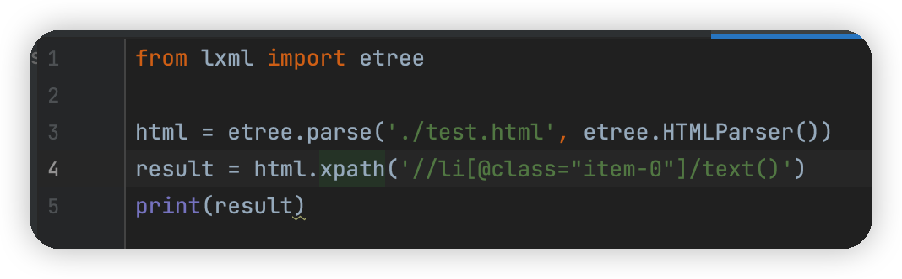

[TOC]

> 对于网页的节点来说，可以定义`id`、`class`等其他属性，而且节点之间还有层次关系。我们其实可以使用XPath或者CSS选择器来定位一个或多个节点，并且调用相应的方法来获取这个节点的内容或者属性，就可以得到目标信息。

# 1. XPath概览

XPath提供了非常简洁明了的路径选择方式

# 2. XPath常用规则

| 表达式     | 描述                     |
| ---------- | ------------------------ |
| `nodename` | 选取此节点的所有子节点   |
| `/`        | 从当前节点选取直接子节点 |
| `//`       | 从当前节点选取子孙节点   |
| `.`        | 选取当前节点             |
| `..`       | 选取当前节点的父节点     |
| `@`        | 选取属性                 |

# 3. 准备工作

> `pip install lxml`

# 4. 实例引入

[3.1.1_实例引入.py](https://github.com/LiuYuan-SHU/MyNotes/blob/e8b1b6cbee2510592c5a22e51827b46abc7e12bd/Crawler%20with%20Python3/Python3%20web%20crawler%20development%20practice%EF%BC%88Edition2%EF%BC%89%20-%20Cui%20Qingcai/%E7%AC%AC%E4%B8%89%E7%AB%A0/3.1/3.1.1_%E5%AE%9E%E4%BE%8B%E5%BC%95%E5%85%A5.py)

我们在实例中声明了一段HTML文本，接着调用`HTML`类进行初始化，这样就成功构造了一个XPath解析对象。需要注意的是，实例中HTML文本中的最后一个`li`节点是没有闭合的，而`etree`模块可以自动修正HTML文本。


之后调用`tostring`方法即可输出修正后的HTML代码，但是结果是`bytes`类型。于是利用`decode`方法将其转化成`str`类型。

******

当然，我们也可以不声明，直接读取文本文件进行解析。假设我们有一个HTML文件`test.html`，我们可以使用这样的方法来进行解析：

```python
from lxml import etree

html = etree.parse('./test.html', etree.HTMLParser())
result = etree.tostring(html)
print(result.decode('utf-8'))
```

# 5. 所有节点

[3.1.2_所有节点.py](https://github.com/LiuYuan-SHU/MyNotes/blob/a3b57fd85ffac92a507b641cf841643443b546c7/Crawler%20with%20Python3/Python3%20web%20crawler%20development%20practice%EF%BC%88Edition2%EF%BC%89%20-%20Cui%20Qingcai/%E7%AC%AC%E4%B8%89%E7%AB%A0/3.1/3.1.2_%E6%89%80%E6%9C%89%E8%8A%82%E7%82%B9.py)

我们一般会以`//`开头的XPath规则来选取所有符合要求的节点。

我们可以用`//*`来选取所有的节点，也可以用`//li`来获取所有的`<li></li>`节点

使用`xpath`方法提取到的是一个列表，其中的每一个元素都是`Element`类型。要是想提取出其中的某一个，可以使用数组的下标索引方式提取。

# 6. 子节点

[3.1.3_子节点.py](https://github.com/LiuYuan-SHU/MyNotes/blob/dc27eab46115e76f7836cae584335bf7fad54a06/Crawler%20with%20Python3/Python3%20web%20crawler%20development%20practice%EF%BC%88Edition2%EF%BC%89%20-%20Cui%20Qingcai/%E7%AC%AC%E4%B8%89%E7%AB%A0/3.1/3.1.3_%E5%AD%90%E8%8A%82%E7%82%B9.py)

我们如果想要获得所有`li`节点下的`a`节点，可以这样写：`//li/a`，需要区分的是：**`//`代表当前节点下的所有节点，而`/`代表当前节点的子节点**

# 7. 父节点

[3.1.4_父节点.py](https://github.com/LiuYuan-SHU/MyNotes/blob/4b3b47b441c22aeb61b5421598a4311aa5bd83b3/Crawler%20with%20Python3/Python3%20web%20crawler%20development%20practice%EF%BC%88Edition2%EF%BC%89%20-%20Cui%20Qingcai/%E7%AC%AC%E4%B8%89%E7%AB%A0/3.1/3.1.4_%E7%88%B6%E8%8A%82%E7%82%B9.py)

获取链接为`link4.html`的`a`节点的父节点的`class`属性

```xpath
//a[@href="link4.html"]/../@class
```

当然我们也可以通过`parent::`获取父节点：

```xpath
//a[@href="link4.html"]/parent::*/@class
```

所以`parent::`也就相当于`..`

# 8. 属性匹配

在选取节点的时候，还可以使用`@`符号实现属性过滤。

*选取`class`属性为`item-0`的`li`节点：*

```xpath
//li[@class="item-0"]
```

# 9. 文本获取

[3.1.5_文本选取.py](https://github.com/LiuYuan-SHU/MyNotes/blob/c10d9056c495e155bcccfcd004371a1b8a442d56/Crawler%20with%20Python3/Python3%20web%20crawler%20development%20practice%EF%BC%88Edition2%EF%BC%89%20-%20Cui%20Qingcai/%E7%AC%AC%E4%B8%89%E7%AB%A0/3.1/3.1.5_%E6%96%87%E5%AD%97%E6%8F%90%E5%8F%96.py)

使用XPath的`text`方法可以获取节点中的文本。

我们首先尝试提取`class`属性值为`item-0`的`li`节点的文字信息：



这个是运行结果：

可以发现，我们没有选取到任何的文本，而是获取了一个换行符。让我们回顾`test.html`中的内容，分析一下原因：


这两行是我们选取到的元素。由于我们使用的XPath语句是：`//li[@class="item-0"]/text()`。在`text()`函数之前的节点选择语句是`/`，所以选取的是`li`的直接子节点的文本。由于选取到的两行元素中：第一行的直接子节点是`a`没有文本，所以没有选择到；第二行在解析的时候使用了标准的HTML格式补全了`li`的尾部，所以现实情况是这样的：

```html
<li class="item-0"><a href="link5.html">fifth item</a>
</li>
```

所以选择到的是这个补全之后带上的换行符。

## 逐层选取——`select_with_level`

我们可以先转换到`li`节点下的`a`节点，然后再选取文本


## `//`选取——`select_with_double_slash`

当然，我们也可以选择`li`节点下所有的文本：


## 结语

由此，要想获取子孙节点内部的所有文本，可以直接使用`//`加`text`方法的方式，这样能够保证获取最全面的文本信息，但是可能会夹杂一些换行符等特殊的字符。如果想获取某些特定子孙节点下的所有文本，则可以先选取特定的子孙节点，再调用`text`方法获取七内部的文本，这样可以保证获取的结果是整洁的。

# 10. 属性获取

获取`li`节点的直接子节点类型为`a`的属性

```xpath
//li/a/@href
```

需要区分属性匹配和属性获取的不同：

```xpath
# 属性匹配
//li/a[@href="<想要匹配的属性值>"]

# 属性获取
//li/a/@<a的属性类型>
```

# 11. 属性多值匹配——`contains`

[3.1.6_属性多值匹配.py](https://github.com/LiuYuan-SHU/MyNotes/blob/86e7bb6eaf6d304d5c2e1e9440e0bf07b747da86/Crawler%20with%20Python3/Python3%20web%20crawler%20development%20practice%EF%BC%88Edition2%EF%BC%89%20-%20Cui%20Qingcai/%E7%AC%AC%E4%B8%89%E7%AB%A0/3.1/3.1.6_%E5%B1%9E%E6%80%A7%E5%A4%9A%E5%80%BC%E5%8C%B9%E9%85%8D.py)

> 经常在某个节点的某个属性有多个值的时候用到

考虑这样一个HTML语句：


当我们想要选择这个`li`节点的时候，我们发现它的`class`属性有两个值：`li`和`li-first`。我们可以用之前的方法来进行分析：


但这样我们无法提取到这个节点。

我们需要使用`contains`方法：


# 12. 多属性匹配——`and`


我们通常需要用一个节点的多个属性来确定我们需要的节点，这个时候使用`and`来完成多个属性的同时选取：

选取一个`li`节点，其`class`属性应当包含`li`，并且还应该其`name`属性应当为`item`。获取其子节点`a`并且获得子节点中的文本：

```xpath
'//li[contains(@class, "li") and @name="item"]/a/text()'
```

## XPath运算符及其介绍

| 运算符 | 描述 | 实例               | 返回值                              |
| ------ | ---- | ------------------ | ----------------------------------- |
| `or`   | 或   | `age=19 or age=20` | 如果`age`是19，返回true;</br>如果`age`是21，返回false |
| `and`  |   与   | `age>19 and age<21`                   |           如果`19<age<21`，返回true；</br>否则返回false                          |
| `mod`  |   计算除法的余数   |  `5 mod 2`                  |          1                           |
| `丨`    |  计算两个节点集    |  `//book丨//cd`                  |     返回所有拥有`book`和`cd`元素的节点集                                |
| `+`    |   加法   |  `6 + 4`                  |                     10                |
| `-`    |  减法    |   `6 - 2`                 |                     4                |
| `*`    |   乘法   |  `6 * 4`                  |                     24                |
| `div`  |  除法    |   `8 div 2`                 |                   4                  |
| `=`    |   等于   |   `age=19`                 |                    如果`age`是19，返回true</br>如果`age`不是19，返回false                 |
| `!=`   |   不等于   |  `age!=19`                  |     如果`age`不是19，返回true；</br>否则返回false                                |
| `<`    | 小于 | `age<19` | 如果`age`小于19，返回true</br>否则返回false |
| `<=`   | 小于等于 | `age<=19` | 如果`age`小于等于19，返回true</br>否则返回false |
| `>`    | 大于 | 'age>19' | 如果`age`大于19，返回true</br>否则返回false |
| `>=`   | 大于等于 | `age>=19` | 如果`age`大于等于19，返回true</br>否则返回false |
|        |      |                    |                                     |

# 13. 按序选择

> 在选择节点的事后，某些属性可能匹配了多个节点，但我们只想要其中的某一个

[3.1.7_按序选择.py](https://github.com/LiuYuan-SHU/MyNotes/blob/2b9c72df975bf29a598e357fb06d0bda9ade7eca/Crawler%20with%20Python3/Python3%20web%20crawler%20development%20practice%EF%BC%88Edition2%EF%BC%89%20-%20Cui%20Qingcai/%E7%AC%AC%E4%B8%89%E7%AB%A0/3.1/3.1.7_%E6%8C%89%E5%BA%8F%E9%80%89%E6%8B%A9.py)

我们可以使用往中括号中传入索引的方法获取特定次序的节点，**需要注意的是，与一般的编程语言下标开始的地方不一样，XPath下标从1开始**。XPath提供了100多个方法，包括存取、数值、字符串、逻辑、节点、序列等处理功能

# 14. 节点轴选择

[3.1.8_节点轴选择.py](https://github.com/LiuYuan-SHU/MyNotes/blob/ad5ac04b3b8d9ea8fe7f0d0faa40c341522e654a/Crawler%20with%20Python3/Python3%20web%20crawler%20development%20practice%EF%BC%88Edition2%EF%BC%89%20-%20Cui%20Qingcai/%E7%AC%AC%E4%B8%89%E7%AB%A0/3.1/3.1.8_%E8%8A%82%E7%82%B9%E8%BD%B4%E9%80%89%E5%8F%96.py)

XPath提供了很多节点轴的选择方法，包括选取子元素、兄弟元素、父元素、祖先元素等。

<table class="reference">

​                  <tbody><tr>
​                      <th style="width:30%;">轴名称</th>
​                      <th>结果</th>
​                    </tr>

​                    <tr>
​                      <td>ancestor</td>
​                      <td>选取当前节点的所有先辈（父、祖父等）。</td>
​                    </tr>

​                    <tr>
​                      <td>ancestor-or-self</td>
​                      <td>选取当前节点的所有先辈（父、祖父等）以及当前节点本身。</td>
​                    </tr>

​                    <tr>
​                      <td>attribute</td>
​                      <td>选取当前节点的所有属性。</td>
​                    </tr>

​                    <tr>
​                      <td>child</td>
​                      <td>选取当前节点的所有子元素。</td>
​                    </tr>

​                    <tr>
​                      <td>descendant</td>
​                      <td>选取当前节点的所有后代元素（子、孙等）。</td>
​                    </tr>

​                    <tr>
​                      <td>descendant-or-self</td>
​                      <td>选取当前节点的所有后代元素（子、孙等）以及当前节点本身。</td>
​                    </tr>

​                    <tr>
​                      <td>following</td>
​                      <td>选取文档中当前节点的结束标签之后的所有节点。</td>
​                    </tr>
​                    <tr>
​                      <td>following-sibling</td>
​                      <td>选取当前节点之后的所有兄弟节点</td>
​                    </tr>
​                    <tr>
​                      <td>namespace</td>
​                      <td>选取当前节点的所有命名空间节点。</td>
​                    </tr>

​                    <tr>
​                      <td>parent</td>
​                      <td>选取当前节点的父节点。</td>
​                    </tr>

​                    <tr>
​                      <td>preceding</td>
​                      <td>选取文档中当前节点的开始标签之前的所有节点。</td>
​                    </tr>

​                    <tr>
​                      <td>preceding-sibling</td>
​                      <td>选取当前节点之前的所有同级节点。</td>
​                    </tr>

​                    <tr>
​                      <td>self</td>
​                      <td>选取当前节点。</td>
​                    </tr>
​                  </tbody></table>
