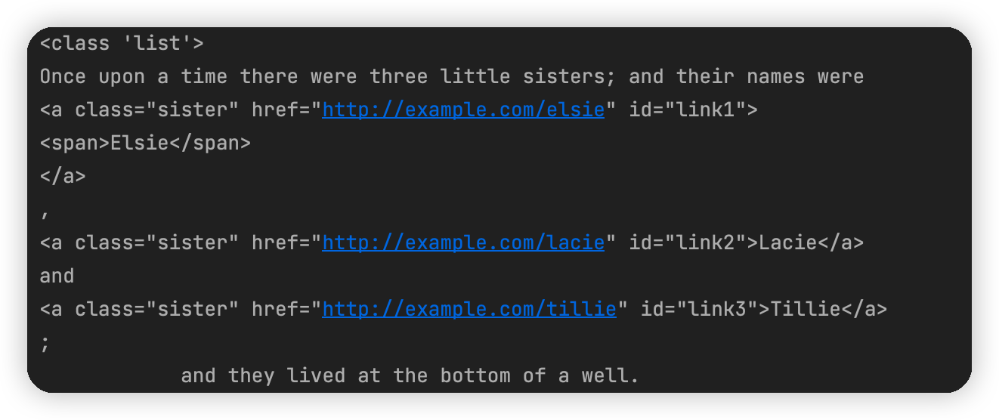
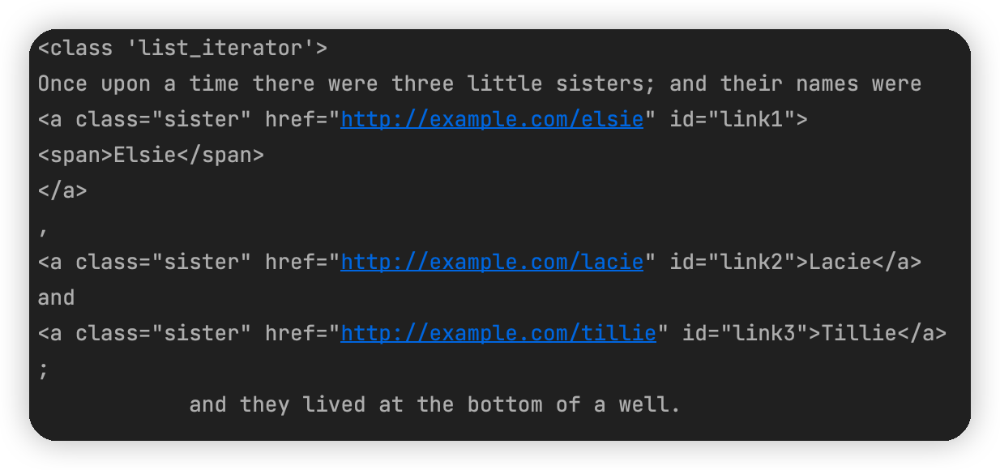
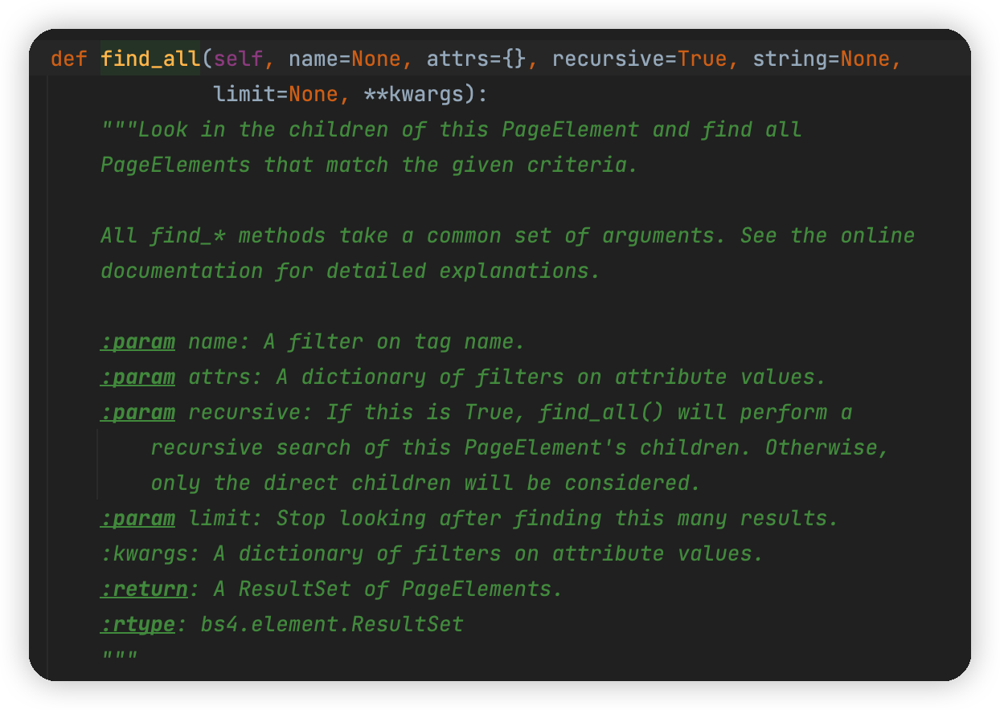

[TOC]

# 2. 解析器

Beautiful Soup在解析时是依赖解析器的，它除了支持Python标准库中的HTML解析器，还支持一些第三方解析器。

| 解析器          | 使用方法                                     | 优势                                                         | 劣势                                         |
| --------------- | -------------------------------------------- | ------------------------------------------------------------ | -------------------------------------------- |
| Python标准库    | `BeautifulSoup(<待解析代码>, 'html.parser')` | Python的内置标准库、执行速度适中、文档容错能力强             | Python 2.7.3 或 3.2.2 前的版本中文容错能力差 |
| LXML HTML解析器 | `BeautifulSoup(<待解析代码>, 'lxml')`        | 速度快、文档容错能力强                                       | 需要安装C语言库                              |
| LXML XML解析器  | `BeautifulSoup(<待解析代码>, 'xml')`         | 速度快、唯一支持XML的解析器                                  | 需要安装C语言库                              |
| html5lib        | `BeautifulSoup(<待解析代码>, 'html5lib')`    | 提供最好的容错性、以浏览器的方式解析文档、生成HTML5格式的文档 | 速度慢、不依赖外部扩展                       |

# 3. 准备工作

1. 安装lxml

2. 安装Beautiful Soup

    `pip3 install beautifulsoup4`

    如果不小心安装了过老的版本，那么会有以下报错：

```
"You're trying to run a very old release of Beautiful Soup under Python 3. This will not work."<>"Please use Beautiful Soup 4, available through the pip package 'beautifulsoup4'."
```

# 4. 基本使用

```python
from bs4 import BeautifulSoup

html = '''
<html><head><title>The Document's story</title></head>
<body>
<p class="title" name="dromouse"><b>The Dormouse's story</b></p>
<p class="story">Once upon a time there were three little sisters; and thir names were
<a href="http://example.com/elsie" class="sister" id="link1"><!-- Elsie --> </a>,
<a href="http://example.com/lacie" class="sister" id="link2">Lacie</a> and
<a href="http://example.com/tillie" class="sister" id "link3">Tillie</a>;
and they lived at the bottom of a well.</p>
<p clss="story">...</p>
'''
# 传入HTML字符串和解析器类型
soup = BeautifulSoup(html, 'lxml')
# 将要解析的字符串以标准的缩进格式输出
print(soup.prettify())
# 选取title节点，并打印其中的字符串
print(soup.title.string)	# The Document's story
```

1. 我们传入的html不必是闭合的HTML字符串，BeautifulSoup会为我们补全

# 5. 节点选择器

直接调用节点的名称即可选择节点，然后调用`string`属性就可以得到节点内的文本。这种选择方式速度非常快，当单个节点结构层次非常清晰的时候，可以选用这种方式来解析。

```python
from bs4 import BeautifulSoup

soup = BeautifulSoup(html, 'lxml')
print(soup.title)			# <title>The Dormouse's stody</title>
print(type(soup.title))		# <class 'bs4.element.Tag'>
print(soup.title.string)	# The Dormouse's story
print(soup.head)			# <head><title>The Dormouse's story</title></head>
print(soup.p)				# <p class="title" name="dormouse"><b>The Dormouse's story</b></p>
```

1. title节点的类型是`bs4.element.Tag`，这是Beautiful Soup中一个重要的数据结构，经过选择器选择的结果都是这种Tag类型
2. 我们可以使用节点的类型获得节点及其内部的内容，但是可以发现，**这样的选择方式只会选择第一个匹配的节点*

# 6. 提取信息

> 使用`Tag`的各种属性来提取其中的信息

## 获取名称

**利用`name`属性能够获取节点的名称**

```python
soup = BeautifulSoup('<title></title>')
print(soup.title.name)	# title
```

## 获取属性

一个节点可能有多个属性，例如`id`和`class`等，选择这个节点元素后，可以调用`attrs`获取其所有属性

```python
print(soup.p.attrs)			# {'class': ['title'], 'name': 'dromouse'}
print(soup.p.attrs["name"])	# dromouse
```

可以看到，返回的属性其实是一个字典，我们还可以使用更加简洁的方式：

```python
print(soup.p["name"])	# dromouse
print(soup.p["class"])	# ['title']
```

需要注意的是，有的时候返回的是一个字符串，有的时候返回的是字符串组成的列表，需要加以区分

## 获取内容

```python
print(soup.p.string)	# The Dromouse's story
```

## 嵌套选择

我们知道所有返回结果都是`bs4.element.Tag`类型，`Tag`类型的对象同样可以继续调用节点进行下一步选择。例如，我们获取了`head`节点，就可以继续调用`head`选取器内部的`title`节点：

```python
html='''
<html><head><title>The Dromouse's story</title></head'>
<body>
'''
from bs4 import BeautifulSoup
soup = BeautifulSoup(html, 'lxml')
print(soup.head.title)			# <title>The Dromouse's story</title>
print(type(soup.head.title))	# <class 'bs4.element.Tag'>
print(soup.head.title.string)	# The Dromouse's story
```

我们可以在`Tag`的基础上继续做选择，得到的依然是`Tag`

# 7. 关联选择

> 在做选择的过程中，有的时候不能一步就选择到想要的节点，需要先选中某一个节点，再以它为基准选择子节点、父节点、兄弟节点等。

## 子节点和子孙节点——`contents`、`children`、`descendants`

[3.2.1_节点选择_子节点和子孙节点](https://github.com/LiuYuan-SHU/MyNotes/blob/86ce2bd77f55b62a1ebace4c9fb749105aa5d616/Crawler%20with%20Python3/Python3%20web%20crawler%20development%20practice%EF%BC%88Edition2%EF%BC%89%20-%20Cui%20Qingcai/%E7%AC%AC%E4%B8%89%E7%AB%A0/3.2/3.2.1_%E5%85%B3%E8%81%94%E9%80%89%E6%8B%A9_%E5%AD%90%E8%8A%82%E7%82%B9%E5%92%8C%E5%AD%90%E5%AD%99%E8%8A%82%E7%82%B9.py)

### `contents`——`contents()`

选取节点之后，如果想要获取它的直接子节点，可以调用`contents`属性

```python
html = """
<html>
    <head>
        <title>The Document's story</title>
    </head>
    <body>
        <p class="story">
            Once upon a time there were three little sisters; and their names were
            <a href="http://example.com/elsie" class="sister" id="link1">
                <span>Elsie</span>
            </a>,
            <a href="http://example.com/lacie" class="sister" id="link2">Lacie</a>
            and
            <a href="http://example.com/tillie" class="sister" id="link3">Tillie</a>;
            and they lived at the bottom of a well.
        </p>
        <p clss="story">...</p>
"""
from bs4 import BeautifulSoup
soup = BeautifulSoup(html, 'lxml')
print(soup.p.contents)
```



可以看到返回的类型是一个列表。

### `children`——`children()`

可以看到返回的类型是一个生成器：



### `descendants`——`descendants()`

> 得到所有的子孙节点

返回的类型依然是生成器，同时可以发现结果中还包含了`<span>`节点，这就是因为得到了所有的子孙节点

> `enumerate()`函数能够将一个可迭代的对象转换为一个索引序列，包含一个下标和数据

## 父节点和祖先节点——`parent`&`parents`

[3.2.2_节点选择_父节点和祖先节点.py](https://github.com/LiuYuan-SHU/MyNotes/blob/0c8bda98a3a42f9adc8f3a356995047b15aec522/Crawler%20with%20Python3/Python3%20web%20crawler%20development%20practice%EF%BC%88Edition2%EF%BC%89%20-%20Cui%20Qingcai/%E7%AC%AC%E4%B8%89%E7%AB%A0/3.2/3.2.2_%E5%85%B3%E8%81%94%E9%80%89%E6%8B%A9_%E7%88%B6%E8%8A%82%E7%82%B9%E5%92%8C%E7%A5%96%E5%85%88%E8%8A%82%E7%82%B9.py)

### `parent`——`parent()`

需要注意，`parent`获得的仅仅是`a`节点的直接父节点，而没有再向外寻找父节点的祖先节点

### `parents`——`parents()`

## 兄弟节点——`next/previous_sibling(s)`

* `next_sibling`和`previous_sibling`分别用于获取节点的下一个和上一个兄弟节点
* `next_siblings`和`previous_siblings`分别返回后面和前面所有的兄弟节点

## 提取信息

如果我们提取到的是单个节点，我们可以直接调用`string`和`attr`属性来获得想要的信息；如果提取到的是多个节点的列表，可以现货的想要的节点，然后再获取相应的信息

# 8. 方法选择器

## `find_all`

> 查询所有符合条件的元素

```python
find_all(name, attrs, recursive, text, **kwargs)
```



### `name`

> 根据`name`参数来查询元素

```python
print(soup.find_all(name='ul'))
```

### `attrs`

> 根据属性进行查询

```python
print(soup.find_all(attrs={'name': 'list-1'}))
```

### `text`

> 匹配节点的文本，传入的可以是文本也可以是**正则表达式对象**

```python
print(soup.find_all(text=re.compile('link')))
```

## `find`

> 与`find_all`相同，只不过`find_all`返回的是所有满足条件的元素的列表；`find`返回的是第一个满足条件的元素

## 其他`find`

* `find_parents/find_parent`：前者返回所有祖先节点，后者返回直接父节点
* `find_next_siblings/find_next_sibling：前者返回后面的所有兄弟节点，后者返回后面第一个兄弟节点`
* `find_previous_siblings/find_previous_sibling`：前者返回前面的所有兄弟节点，后者返回前面的第一个兄弟节点
* `find_all_next/find_next`：前者返回节点后面所有符合条件的节点，后者返回节点后面第一个符合条件的节点
* `find_all_previous/find_previous`：前者返回节点前面所有符合条件的节点，后者返回节点前第一个符合条件的节点

# 9. CSS选择器

> [CSS选择器的基本使用](https://www.w3school.com.cn/css/css_selectors.asp)

[3.2.3_CSS选择器.py](https://github.com/LiuYuan-SHU/MyNotes/blob/ef7c21f16dba35f8092d35f5d2201c774871295a/Crawler%20with%20Python3/Python3%20web%20crawler%20development%20practice%EF%BC%88Edition2%EF%BC%89%20-%20Cui%20Qingcai/%E7%AC%AC%E4%B8%89%E7%AB%A0/3.2/3.2.3_CSS%E9%80%89%E6%8B%A9%E5%99%A8.py)

使用CSS选择器，只需要调用`select`方法，传入相应的CSS选择器即可。***并且由于`select`的操作返回的元素的类型依然是`bs4.element.Tag`，CSS选择器的返回结果可以继续使用前面的内容进行操作，反之亦然。***

## 嵌套选择

`select`同样支持嵌套选择，我们可以先用`select`获取到一个结果，然后再使用`select`对这个结果进行下一步的操作

## 获取属性

> 同[[获取属性](#获取属性)]中的方法

```python
for ul in soup.select('ul'):
    print(ul['id'])
    print(ul.attrs['id'])
```

## 获取文本——`get_text`
要获取文本，除了使用之前的`string`属性，还可以使用`get_text`函数作用于`bs4.element.Tag`对象上

```python
for li in soup.select('li'):
    print(li.get_text())
    print(li.string)
```

二者的效果是一样的