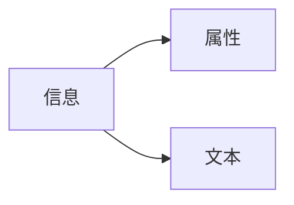

[TOC]

> 更加强大的CSS选择器

# 1. 准备工作

```shell
pip3 install pyquery
```

# 2. 初始化

[3.3.1_初始化.py](https://github.com/LiuYuan-SHU/MyNotes/blob/7776614e87abba75d38e74c5187df5975eb27b2f/Crawler%20with%20Python3/Python3%20web%20crawler%20development%20practice%EF%BC%88Edition2%EF%BC%89%20-%20Cui%20Qingcai/%E7%AC%AC%E4%B8%89%E7%AB%A0/3.3/3.3.1_%E5%88%9D%E5%A7%8B%E5%8C%96.py)

在用pyquery库解析HTML文件的时候，首先需要将这个HTML文本初始化为一个PyQuery对象。然后这个对象本身就是一个CSS选择器

## 字符串初始化——`init_string`

使用字符串初始化PyQuery对象

## URL初始化——`init_URL`

使用URL初始化对象，会去获取URL对应的HTML文件，相当于：

```python
from pyquery import PyQuery as pq
import requests
doc = pq(requests.get('https://cuiqingcai.com').text)
print(doc('title'))
```

## 文件初始化——`init_file`

使用已有的文件去初始化对象

## 3. 基本CSS选择器

```python
html = '''
    <div id="container">
        <ul class="list">
            <li class="item-0">first item</li> 
            <li class="item-1"><a href="link2.html">second item</a></li> 
            <li class="item-0 active"><a href="link3.html"><span class="bold">third item</span></a></li> 
            <li class="item-1 active"><a href="link4.html">fourth item</a></li> 
            <li class="item-0"><a href="link5.html">fifth item</a></li> 
        </ul>
    </div>
    '''
from pyquery import PyQuery as pq
doc = pq(html)
print(doc('#container .list li'))
print(type(doc('#container .list li')))	# pyquery.pyquery.PyQuery
```

`#container .list li`的意思是说，首先选取`id`为`container`的节点，然后在这个节点下选择`class`为`list`的节点，再在这个节点下选择所有的`li`节点

然后，我们可以使用`items()`函数来遍历其中的内容，并且使用`text()`函数来打印文本：

```python
for item in doc('#container .list li').items():
    print(item.text())
```

# 4. 查找节点

> 一些常用的查询方法

[3.3.2_查找节点.py](https://github.com/LiuYuan-SHU/MyNotes/blob/bda7bd0efa58772e95658b5bab2b14dedc5583b0/Crawler%20with%20Python3/Python3%20web%20crawler%20development%20practice%EF%BC%88Edition2%EF%BC%89%20-%20Cui%20Qingcai/%E7%AC%AC%E4%B8%89%E7%AB%A0/3.3/3.3.2_%E6%9F%A5%E6%89%BE%E8%8A%82%E7%82%B9.py)

**下列列出的方法，都可以传空参数，或者传入选择参数。如果传缺省的参数，那么就返回所有的节点**

## 子节点

> `search_child_with_find`
>
> `search_child_with_children`

1. 我们可以直接使用`find`函数来搜索当前节点下的所有节点
2. 当然，如果我们只想要直接子节点，那么就可以使用`children`函数

## 父节点

> `search_parent_with_parent`
>
> `search_parents_with_parents`

## 兄弟节点

> `search_siblings_with_siblings`

对一个属性的多个值进行选择：

```python
doc = pq(html)
# 选择一个节点，其class值为list
# 再在这个节点的子节点中进行选择，其class值为item-0和active
li = doc('.list .item-0.active')
```

# 5. 遍历节点

可以看到，无论选择的结果是单个节点还是多个节点，类型都是`PyQuery`类型，并没有在多节点的情况下返回列表。

1. 如果结果是单个节点，既可以直接打印输出，也可以直接转换成字符串：

    ```python
    doc = pq(html)
    li = doc('.item-0.active')
    print(li)		# <li class="item-0 active"><a href="link3.html"><span class="bold">third item</span></a></li>
    print(str(li))	# <li class="item-0 active"><a href="link3.html"><span class="bold">third item</span></a></li>
    ```

2. 如果是多个节点，那么就需要遍历获取了：

    ```python
    lis = doc('li').items()
    for item in lis:
        ...
    ```

    ## 获取信息



### 获取属性——`attr`

提取到某个`PyQuery`类型的节点之后，可以调用`attr`方法获取其属性：

```python
html = '''
<div class="wrap">
	<div id="container">
		<ul class="list">
			<li class="item-0">first item</li>
			<li class="item-1"><a href="link2.html">second item</a></li>
			<li class="item-0 active"><a href="link3.html"><span class="bold">third item</span></a></li>
			<li class="item-1 active"><a href="link4.html">fourth item</a></li>
			<li class="item-0"><a href="link5.html">fifth item</a></li>
		</ul>
	</div>
</div>
'''

from pyquery import PyQuery as pq
doc = pq(html)
a = doc('.item-0.active a')
print(a, type(a))		# type(a): <class pyquery.pyquery.PyQuery''>
print(a.attr('href'))	# link3.html
```

当然，我们也可以通过调用`attr`属性来获取属性值：

```python
print(a.attr.href)
```

需要注意的是，如果选取到了多个节点，`attr`只会获得第一个节点的属性。如果想要获得多个节点的属性，就需要遍历取得。

### 获取文本——`text`&`html`

获取节点内部文本：

```python
a = doc('.item-0.active a')
print(a.text())					# third item
```

获取节点的HTML文本（不包含被选中的节点）：

```python
li = doc('.item-0.active')
print(li.html())				# <a href="link3.html"><span class="bold">third item</span></a>
```

需要注意的是，如果选中了多个节点：

1. `text`返回的是所有选中的节点的文本，以空格隔开
2. `html`返回的是第一个节点的HTML文本

# 6. 节点操作

> 动态修改：为某个节点添加一个`class`，移除某个节点

## `addClass`&`removeClass`

```python
doc = pq(html)
li = doc('.item-0.active')
print(li)
li.removeClass('active')
print(li)
li.addClass('active')
print(li)
```

## `attr`/`text`/`html`

```python
li = doc('.item-0.active')
print(li)
li.attr('name', 'link')		# 添加属性{"name": "link"}
li.text('changed item')		# 覆盖文本：changed item
li.html('<span>changed item</span>')	# 在节点下添加、覆盖文本
```

***所以说，如果`attr`方法只传入一个参数，即属性名，即表示获取这个属性值；如果传入第二个参数，则可以用来修改属性值。`text`和`html`方法如果不传参数，表示的是获取节点内的纯文本和HTML文本；如果传入参数，则表示进行赋值***

## `remove`

```python
html = '''
<div class="wrap">
	Hello, World
	<p>This is a paragraph.</p>
</div>
'''
from pyquery import PyQuery as pq
doc = pq(html)
wrap = doc('.wrap')
print(wrap.text())	# Hello, World This is a paragraph.
```

可以看到，提取的结果会把当前节点下所有的节点都提取出来。如果我们只想要“Hello, World”，而不想要`p`节点中的内容，我们可以先将这个节点删除，然后再使用`text`函数

```python
wrap.find('p').remove()
print(wrap.text())
```

## 其他函数

* `append`
* `empty`
* `prepend`

https://geek-docs.com/python/python-tutorial/python-pyquery.html

# 7. 伪类选择器

```python
li = doc('li:first-child')		# 选择第一个li节点
li = doc('li:last-child')		# 选择最后一个li节点
li = doc('li:nth-child(2)')		# 第二个li节点
li = doc('li:gt(2)')			# 第三个li之后的节点
li = doc('li:nth-child(2n)')	# 偶数位置的li节点
li = doc('li:contains(second)')	# 包含second文本的li节点
```

[pyquery文档](http://pyquery.readthedocs.io)
