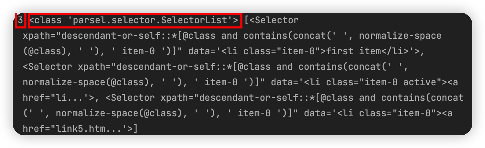
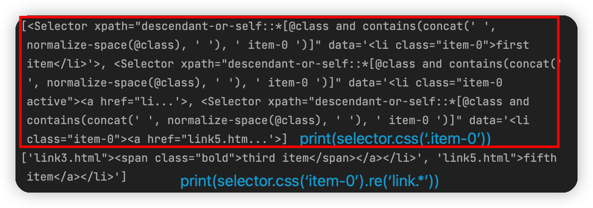

> 穿插XPath和CSS选择器的使用

[TOC]

# 1. 介绍

`parsel`这个库可以解析HTML和XML，并支持使用XPath和选择器对内容进行提取和修改，同时还融合了正则表达式的提取功能。

# 2. 准备工作

> `pip3 install parsel`

# 3. 初始化

[3.4.1_初始化.py](https://github.com/LiuYuan-SHU/MyNotes/blob/f7bba68ac9d84ab17afd1b43103fc2bf05ceed00/Crawler%20with%20Python3/Python3%20web%20crawler%20development%20practice%EF%BC%88Edition2%EF%BC%89%20-%20Cui%20Qingcai/%E7%AC%AC%E4%B8%89%E7%AB%A0/3.4/3.4.1_%E5%88%9D%E5%A7%8B%E5%8C%96.py)

```python
html = '''
    <div id="container">
        <ul class="list">
            <li class="item-0">first item</li> 
            <li class="item-1"><a href="link2.html">second item</a></li> 
            <li class="item-0 active"><a href="link3.html"><span class="bold">third item</span></a></li> 
            <li class="item-1 active"><a href="link4.html">fourth item</a></li> 
            <li class="item-0"><a href="link5.html">fifth item</a></li> 
        </ul>
    </div>
    '''
```



可以看到返回的结果都是`SelectorList`对象，而显而易见它是一个可迭代对象。

同时可以看到的是，就算使用CSS选择器，返回的是`xpath`属性。这是因为CSS选择器首先是被转成了XPath，真正进行节点提取的是XPath。其中CSS选择器转换为XPath的过程是底层的`cssselect`实现的。

例如，`.item-0`这个CSS选择器转换为XPath的结果就是：`descendant-or-self::*[@class and contains(concat(' ', normalize-space(@class), ' '), 'item-0')]`

# 4. 提取文本——`get`&`getall`

## `get`

既然我们获得的是一个可迭代对象，那么想要提取文本，就需要遍历这个对象：

```python
# item是一个Selector对象
for item in items:
   	# 在我们使用了text之后，返回的依然是一个可迭代对象SelectorList
    # 这个对象存放着这个节点下的所有文本
    # 然后我们再调用get方法，可以将SelectorList中的Selector的内容提取出来
    # 其本质是获得返回的SelectorList的第一个Selector对象，并返回其文本
    text = item.xpath('.//text()').get()
```

## `getall`

如果想要获取`SelectorList`下所有对象的所有文本，我们可以使用`getall`：

```python
result = selector.xpath('//li[contains(@class, "item-0")]//text()').getall()
print(result)	# ['first item', 'third item', 'fifth item']
```

## 对CSS选择器也是同理

```python
result = selector.css('.item-0 *::text').getall()
print(result)
```

# 5. 提取属性

提取第三个`li`节点内部的`a`节点的`href`属性：

```python
from parsel import Selector
selector = Selector(text=html)
# CSS 选择器写法
result = selector.css('.item-0.active a::attr(href)').get()
print(result)
# xpath写法
result = selector.xpath('//li[contains(@class, "item-0") and contains(@class, "active")]/a/@href').get()
print(result)
```

# 6. 正则提取

## `re`

[3.4.2_正则提取.py](https://github.com/LiuYuan-SHU/MyNotes/blob/85f7aa5fa6b599c369376fa7f78e57a6397c64d6/Crawler%20with%20Python3/Python3%20web%20crawler%20development%20practice%EF%BC%88Edition2%EF%BC%89%20-%20Cui%20Qingcai/%E7%AC%AC%E4%B8%89%E7%AB%A0/3.4/3.4.2_%E6%AD%A3%E5%88%99%E6%8F%90%E5%8F%96.py)

运行结果如下：



可以看到，`re`方法便利了所有提取到的`Selector`对象，然后根据传入的正则表达式，查找出符合规则的节点源码并以列表的形式返回。

******

当然，如果在调用`css`方法的时候，已经提取了进一步的结果，例如提取了节点文本值，那么`re`方法就只会针对节点文本值进行提取：

```python
result = selector.css('.item-0 *::text').re('.*item')
print(result)	# ['first item', 'third itme', 'fifth item']
```

## `re_first`

我们也可以利用`re_first`方法来提取第一个符合规则的结果：

```python
result = selector.css('.item-0').re_first('<span class="bold">(.*?)</span>')
print(result)	# third item
```

