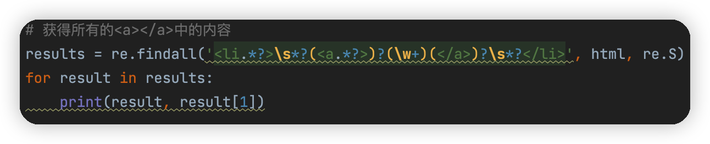
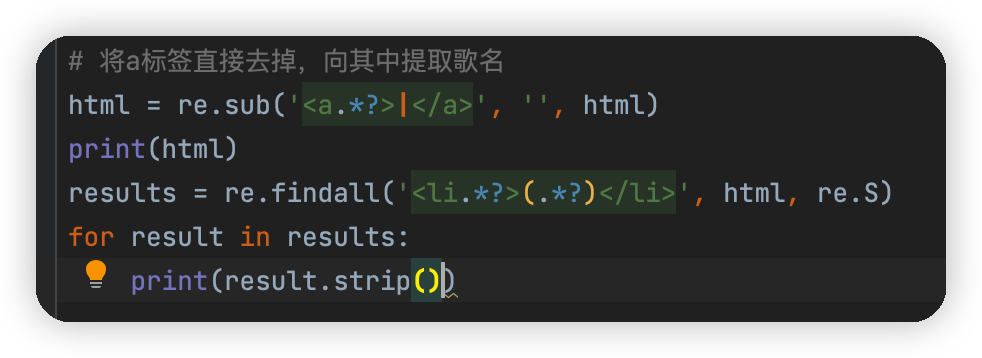

[TOC]


> [正则表达式测试工具 - 开源中国](http://tool.oschina.net/regex)

# 示例引入

> `import re`

## 常用的匹配规则

|   模式   | 描述                                                                                       |
|:--------:| ------------------------------------------------------------------------------------------ |
|   `\w`   | 匹配字母、数字及下划线                                                                     |
|   `\W`   | 匹配不是字母、数字以及下划线的字符                                                         |
|   `\s`   | 匹配任意空白字符，等价于`[\t\n\r\f]`                                                       |
|   `\S`   | 匹配任意非空字符                                                                           |
|   `\d`   | 匹配任意数字，等价于`[0-9]`                                                                |
|   `\D`   | 匹配任意非数字字符                                                                         |
|   `\A`   | 匹配字符串开头                                                                             |
|   `\Z`   | 匹配字符串结尾。如果存在换行，只匹配到换行前的结束字符串                                   |
|   `\z`   | 匹配字符串结尾。如果存在换行，同时还会匹配换行符。                                         |
|   `\G`   | 匹配最后匹配完成的位置                                                                     |
|   `\n`   | 匹配一个换行符                                                                             |
|   `\t`   | 匹配一个制表符                                                                             |
|   `^`    | 匹配一行字符串的开头                                                                       |
|   `$`    | 匹配一行字符串的结尾                                                                       |
|   `.`    | 匹配任意字符，除了换行符。</br>当`re.DOTALL`标记被指定时，可以匹配包括换行符在内的任意字符 |
| `[...]`  | 用来表示一组字符，单独列出，例如`[amk]`用来匹配a、m或k                                     |
| `[^...]` | 匹配不在`[]`中的字符                                                                       |
|   `*`    | 匹配0个或多个表达式                                                                        |
|   `+`    | 匹配1个或多个表达式                                                                        |
|   `?`    | 匹配0个或1个前面的正则表达式定义的片段，非贪婪方式                                         |
|  `{n}`   | 精确匹配`n`个前面的表达式                                                                  |
| `{n,m}`  | 匹配`n`到`m`次由前面正则表达式定义的片段，贪婪方式                                         |
|  `a丨b`   | 匹配`a`或`b`                                                                               |
| `()`         | 匹配括号内的表达式，也表示一个组                                                                                           |
## `match`——文本是否符合要求

[2.3.1_match.py](https://github.com/LiuYuan-SHU/MyNotes/blob/de262a234871b25f034c23f5c3ddcd141e68e59a/Crawler%20with%20Python3/Python3%20web%20crawler%20development%20practice%EF%BC%88Edition2%EF%BC%89%20-%20Cui%20Qingcai/2_use_of_basic_libraries/2.3/2.3.1_match.py)

`match`方法会尝试从字符串的**起始位置**开始匹配正则表达式，如果匹配，就返回匹配成功的结果；如果不匹配，就返回`None`。


> [!NOTE] 提示
> `match`方法更适合用作检测一个字符串是否符合一定的规则，而不适合用作匹配


将输入结果打印出来，可以看到结果是`SRE_Match`对象，证明匹配成功。该对象包含两个方法：

1. **`group`方法可以输出匹配到的内容**
2. **`span`方法可以输出匹配的范围，代表匹配到的结果字符串在原字符串中的位置范围**

### 匹配目标

[2.3.2_匹配目标.py](https://github.com/LiuYuan-SHU/MyNotes/blob/7660322235b188ff8c39154e7f4168c9308e0e6d/Crawler%20with%20Python3/Python3%20web%20crawler%20development%20practice%EF%BC%88Edition2%EF%BC%89%20-%20Cui%20Qingcai/2_use_of_basic_libraries/2.3/2.3.2_%E5%8C%B9%E9%85%8D%E7%9B%AE%E6%A0%87.py)

用`match`方法可以实现匹配，如果想从字符串中提取一部分内容，我们可以使用`()`将想要的内容括起来。`()`实际上标记了一个子表达式的开始和结束位置，被标记的每个子表达式一次对应每个分组，调用`group`方法传入分组的索引即可获取提取结果。

### 通用匹配

刚才我们编写的正则表达式其实比较复杂：只要出现空白字符就需要写`\s`，只要出现数字就需要`\d`匹配，这样的工作量非常大。我们可以使用`.*`来匹配任意字符（除了换行符）。

### 贪婪与非贪婪

[2.3.3_贪婪与非贪婪.py](https://github.com/LiuYuan-SHU/MyNotes/blob/e8cdaa88a14c330490ff86aec0932221f64a9df4/Crawler%20with%20Python3/Python3%20web%20crawler%20development%20practice%EF%BC%88Edition2%EF%BC%89%20-%20Cui%20Qingcai/2_use_of_basic_libraries/2.3/2.3.3_%E8%B4%AA%E5%A9%AA%E4%B8%8E%E9%9D%9E%E8%B4%AA%E5%A9%AA.py)

使用通用匹配`.*`获得的内容有的时候不是我们想要的结果。

#### 函数`greedy`

在贪婪匹配下，`.*`会匹配尽可能多的字符。正则表达式中`.*`后面是`\d+`，也就是只杀一个数字，而且没有指定具体几个数字。因此，`.*`就会匹配尽可能多的字符，从而只留一个数字给`\d+`。

这很明显会给我们带来很大的额不变。有的时候，匹配的结果会莫名其妙少一部分内容。这时，我们就需要非贪婪匹配。

#### 函数`not_greedy`

我们将`.*`换成`.*?`就可以转换为非贪婪匹配。非贪婪匹配的思路是匹配尽量少的字符。当`.*?`匹配到`Hello`后面的空白字符的时候，再往后的字符就是数字了，交给`\d+`来说正合适。

#### 函数`str_end`

但是需要注意的是，如果匹配的结果在字符串结尾，`.*?`有可能匹配不到任何内容，因为它会匹配尽可能少的字符。

### 修饰符

在正则表达式中，可以用一些可选标志修饰符来控制匹配的模式。

`re.match('匹配字符', '目标字符串', '修饰符')`

| 修饰符 | 描述                                                           |
| ------ | -------------------------------------------------------------- |
| `re.I` | 使匹配对大小写不敏感                                           |
| `re.L` | 实现本地化识别（locale_aware）匹配                             |
| `re.M` | 多行匹配，影响`^`和`$`                                         |
| `re.S` | 是匹配内容包括换行符在内的所有字符                             |
| `re.U` | 根据Unicode字符集解析字符。这个标志会影响`\w, \W, \b, \B` |
|   `re.X`     |     该标志能够给予你更灵活的格式，以便将正则表达式书写得更易于理解                                                           |

`re.S`在网页匹配中经常用到。因为HTML节点会有换行，加上它，就可以匹配节点与节点之间的换行了。

### 转义匹配

***当在目标字符串中遇到用作正则匹配模式的特殊字符时，在此字符前面加反斜线`\`转移一下即可。*** 例如`\.`就用来匹配`.`

## `search`——获得满足条件的第一个字符串

> 返回找到的第一个字符串

`search`在匹配的时候会扫描整个字符串，并且返回第一个匹配成功的结果。也就是说，正则表达式可以是字符串的一部分。在匹配的时候，`search`方法会依次以每个字符作为开头扫描字符串，直到找到第一个符合规则的字符串，然后返回匹配内容；如果扫描完还没有找到符合规则的字符串，就返回`None`

******

```html
<div id="songs-list">
<h2 class="title">经典老歌</h2>
<p class="introduction">
经典老歌列表
</p>
<ul id="list" class="list-group">
	<li data-view="2">一路有你</li>
	<li data-view="7">
		<a href="/2.mp3" singer="任贤齐">沧海一声笑</a>
	</li>
	<li data-view="4" class="active">
		<a href="/3.mp3" singer="齐秦">往事随风</a>
	</li>
	<li data-view="6">
		<a href="/4.mp3" singer="beyond">光辉岁月</a>
	</li>
	<li data-view="5">
		<a href="/5.mp3" singer="陈慧琳">记事本</a>
	</li>
	<li data-view="5">
		<a href="/6.mp3" singer="邓丽君">但愿人长久</a>
	</li>
</ul>
</div>

```

假如现在我们想要选择“齐秦”和“往事如风”所在的两行HTML，我们可以这样编写语句：

```regex
<li.*?active.*?\n.*?\n.*?/a>
```

当然，由于我们可以使用Python函数，所以我们稍加更改，提取“齐秦”和“往事如风”，换行符也可以用`re.S`代替：

```python
result = re.research('<li.*?active.*?singer=(.*?)>(.*?)</a>', html, re.S)
```

**由于绝大部分HTML文本包含换行符，所以需要尽量加上`re.S`修饰符，以免出现匹配不到的问题**

## `findall`——获得满足条件的多个字符串

> 获取与正则表达式相匹配的所有字符串

如果想要获得所有满足条件的内容，我们可以使用`findall`函数来进行操作，其返回一个列表，我们可以通过遍历来获取其中的内容


## `sub`——删除不必要的文本

除了使用正则表达式提取信息，有的时候还需要借助其来修改文本。

[2.3.4_sub.py](https://github.com/LiuYuan-SHU/MyNotes/blob/db00ebfc6d64ecd34efbb6ee2a2c57f4ccf18c57/Crawler%20with%20Python3/Python3%20web%20crawler%20development%20practice%EF%BC%88Edition2%EF%BC%89%20-%20Cui%20Qingcai/2_use_of_basic_libraries/2.3/2.3.4_sub.py)

我们当然可以使用`findall`函数来获得所有的歌曲名称，但是这样的正则表达式语句有些复杂：



我们可以选择先将`<a></a>`标签删除，只保留其中的文字，然后再进行提取：



这样就会方便一些。可以发现，在适当的时候借助`sub`方法，可以起到事半功倍的效果。


## compile——将正则字符串编译为正则表达式对象

考虑下面这三个字符串：

```python
content1 = '2019-12-15 12:00'
content2 = '2019-12-17 12:55'
content3 = '2019-12-22 13:21'
```

如果想要将这三个字符串中后面的时间删去，我们不用任何新的组件，我们只能将同一个正则表达式写三遍。但是如果我们能够将这个正则表达式变成一个对象，那么就能实现代码复用：

```python
pattern = re.compile('\d{2}:\d{2}')
result1 = re.sub(pattern, '', conten1)
...
```

