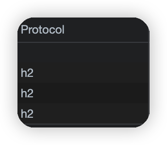
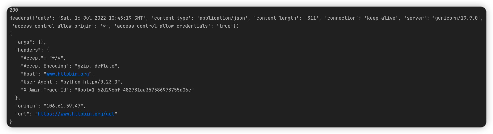

[TOC]

>  ***有的网站强制使用HTTP/2.0协议访问，而`urllib`和`requests`只支持HTTP/1.0。***

## 1. 示例

可以看到[这个网站](https://spa16.scrape.center/)，如果我们使用开发者工具查看network中的protocal信息（如果找不到可以右键元素选择protocal），就会发现protocal全部都是2.0：



如果强行使用`requests`来进行访问，就会得到`RemoteDisconnected`错误。**一个使用HTTP/2.0的网站如果见到请求使用的协议是HTTP1，就会拒绝返回任何结果**


## 2. 安装

```shell
# 安装HTTPX，但是不支持HTTP/2.0
pip3 install httpx
# 安装HTTPX的同时安装HTTP/2.0支持模块
pip3 install 'httpx[http2]'
```

## 3. 基本使用

[2.4.1_基本使用.py](https://github.com/LiuYuan-SHU/MyNotes/blob/523755ec81e7a77e018bfe98e90c8f6040f1a5ad/Crawler%20with%20Python3/Python3%20web%20crawler%20development%20practice%EF%BC%88Edition2%EF%BC%89%20-%20Cui%20Qingcai/2_use_of_basic_libraries/2.4/2.4.1_%E5%9F%BA%E6%9C%AC%E4%BD%BF%E7%94%A8.py)

### `get`方法的使用

> `test_get()`



输出结果对应三项内容：

1. `status_code`对应状态码
2. `headers`对应响应头，是一个`Headers`对象，类似于一个字典
3. `text`对应响应体，可以看到其中的`User-Agent`是`python-httpx/0.23.0`

### 在`get`中添加`headers`

> `test_get_with_headers`

这里我们换了一个`User-Agent`重新请求，可以发现更换后的`User-Agent`生效了

### 在代码中声明HTTP/2.0

> `test_httpx_with_http2`

`httpx`默认不会开启对HTTP/2.0的支持，需要默认使用的是HTTP/1.1，需要手动声明一下才能使用HTTP/2.0

******

基于得到的`Response`对象，我们可以使用如下属性和方法获取想要的内容：

* `status_code`：状态码
* `text`：响应体的文本内容
* `content`：响应体的二进制内容，当请求的目标是二进制数据（如图片）时，可以使用此属性获取
* `headers`：响应头，是`Headers`对象，可以用像获取字典中的内容一样获取其中某个`Headers`的值
* `json`：方法，可以调用此方法将文本结果转化为JSON对象

## 4. `Client`对象

[2.4.2_Client.py](https://github.com/LiuYuan-SHU/MyNotes/blob/e39778c6c771e5dbfa09a6fe5d2c41284537e2f2/Crawler%20with%20Python3/Python3%20web%20crawler%20development%20practice%EF%BC%88Edition2%EF%BC%89%20-%20Cui%20Qingcai/2_use_of_basic_libraries/2.4/2.4.2_Client.py)

`httpx`中有一些基本的API和`requests`中非常相似，但是和有一些API是不相似的。例如`httpx`中有一个`Client`对象，就可以和`requests`中的`Session`对象类比学习。

官方比较推荐的方法是`with as`语句，也就是方法一。当然方法一和方法二是等价的，只是方法二需要显式关闭对象。

另外，在声明`Client`对象的时候可以指定一些参数，例如`headers`。

```python
url = 'http://www.httpbin.org/headers'
headers = {'User-Agent': 'my-app/0.0.1'}
with httpx.Client(headers = headser) as client:
    r = client.get(url)
    print(r.json()['headers']['User-Agent'])
```

更多高级用法参照[官方文档](https://www,python-httpx.org/advanced)

## 5. 支持HTTP/2.0

方法相同，加上`client = httpx.Client(http2=True)`即可

> ![Warning] 注意
>
> 这客户端的`httpx`上启用对HTTP/2.0的支持并不意味着请求和响应都讲通过HTTP/2.0传输，这得客户端和服务端都支持HTTP/2.0才行。如果客户端连接到仅支持HTTP/1.1的服务器，那么它也需要改用HTTP/1.1

## 6. 支持异步请求

> `pip install asyncio`

`httpx`还支持异步客户请求（即**AsyncClient**），支持Python的async请求模式：

```python
import httpx
import asyncio

async def fetch(url):
    async with httpx.AsyncClient(http2=True) as client:
		response = await client.get(url)
        print(response.text)
```


