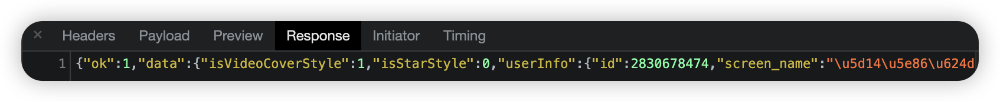

# 1. 分析案例

https://m.weibo.cn/u/2830678474

事实上，Ajax尤其特殊的请求类型，叫做xhr。

单击请求，我们就可以看到其详细信息。

单击Preview，查看相应的内容：

这些就是响应的内容，JavaScript拿到这些数据之后，再执行相应的渲染方法，整个页面就渲染出来了。

另外，也可以切换到Response选项卡，从中观察真实的返回数据：

## 原始HTML

可以看到，在没有Ajax的情况下，代码和结构非常简单，只是执行了一些JavaScript语句，

所以说，微博页面呈现给我们的真实数据并不是最原始的页面返回的，而是执行JavaScript后再次向Ajax请求，浏览器拿到服务器返回的数据后进一步渲染得到的。

# 2. 过滤请求

利用Chrome开发工具可以筛选出所有的Ajax请求：

然后，不断上滑微博页面，可以看到页面底部有一条条新的微博被刷出，开发者工具下方也出现一个个新的Ajax请求，这样就可以捕获所有的Ajax请求。