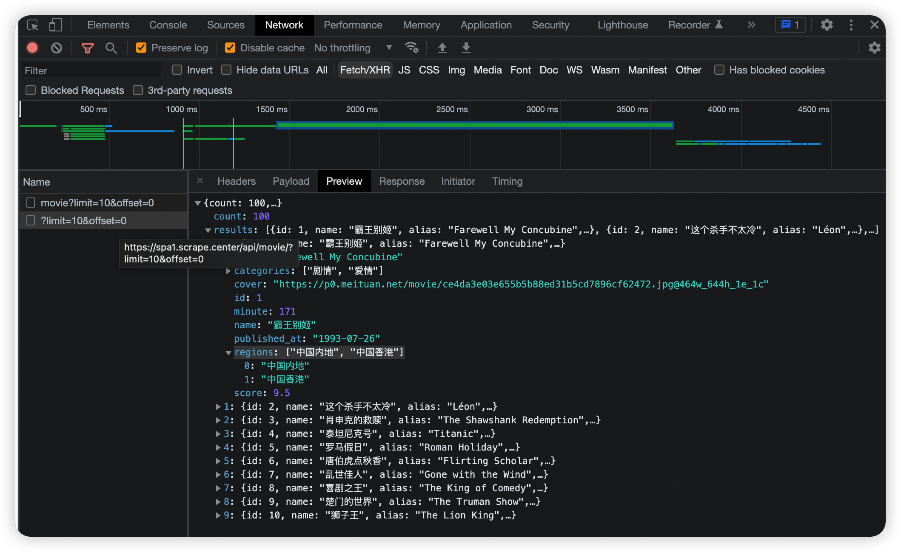
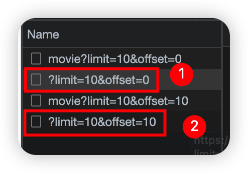
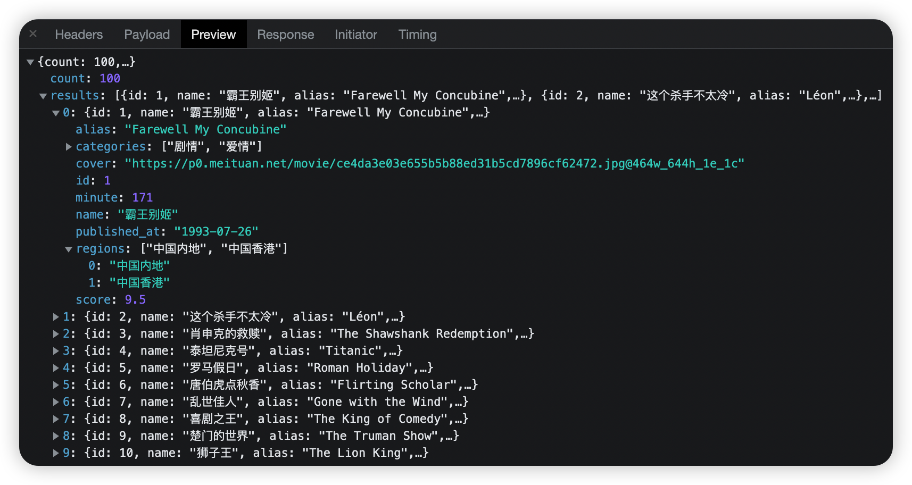
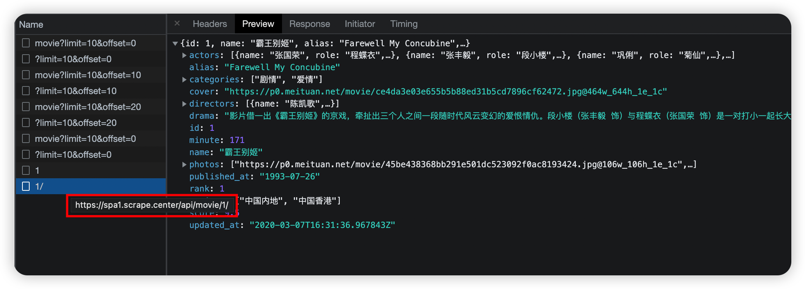
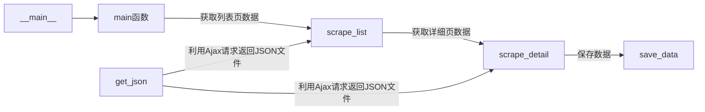

[Ajax分析爬取实战](https://github.com/LiuYuan-SHU/MyNotes/blob/f5acc66cc0a2f68393d9d5be7692be0809a2db70/Crawler%20with%20Python3/Python3%20web%20crawler%20development%20practice%EF%BC%88Edition2%EF%BC%89%20-%20Cui%20Qingcai/%E7%AC%AC%E4%BA%94%E7%AB%A0/Ajax%E5%88%86%E6%9E%90%E7%88%AC%E5%8F%96%E5%AE%9E%E6%88%98.py)

# 2. 爬取目标

https://spa1.scrape.center

需要爬取的内容：

1. 分析页面数据的加载逻辑
2. 用requests实现Ajax的数据爬取
3. 将每部电影的数据分别保存到MongoDB数据库

# 3. Ajax分析

## 列表页分析

1. 首先观察请求URL：可以发现其中有两个非常关键的参数：`limit`和`offset`，如果我们继续观察第二页的Ajax请求URL：

    

    我们可以发现，`limit`是不变的，表示的是每页的10条数据；而`offset`每次增加十，说明获取后面的10条数据

2. 再来观察Ajax返回的数据：

    

    返回的数据类型是JSON结构，并且全部放在`results`中。每一部电影都有自己的字段。

## 详情页分析

再来看详情页，我们可以发现，所有的数据同样是以Ajax请求的方式返回的：

# 4. 项目逻辑

