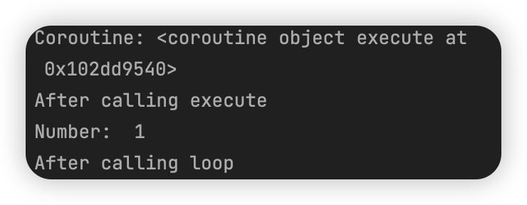

# 1. 案例引入

平时我们浏览网页的时候，绝大部分网页的响应速度还是很快的，如果写爬虫来爬取，那么从发出请求到接受响应的时间不会很长，因此需要我们等待的时间并不多。

但是对于一些响应较慢的网站来说，花费的时间就要很多。如果我们使用`requests`单程来做，总耗时将会非常大。此时如果要是打开多进程或是多线程来爬取，效果就会好很多。

# 2. 基础知识

## 阻塞

**阻塞状态指程序未得到所需计算资源时被挂起的状态**。程序在等待某个操作完成的期间，自身无法继续干别的事情，则称该程序在该操作上是阻塞的。

常见形式的阻塞形式有：网络IO阻塞、磁盘IO阻塞、用户输入阻塞等。阻塞是无处不在的，包括在CPU切换上下文的时候，所有进程都无法真正干事情，他们也会被阻塞。在多核CPU的情况下，正在执行上下文切换操作的核不可被利用。

## 非阻塞

程序在等待某操作的过程中，自身不被阻塞，可以继续干别的事情，则称该程序在该操作上是非阻塞的。非阻塞并不是在任何程序级别、任何情况下都存在的。仅当程序封装的级别可以囊括独立的子程序单元时，程序才可能存在非阻塞状态。

非阻塞因阻塞的存在而存在，正因为阻塞导致程序运行的耗时增加与效率低下。我们才要把它变成非阻塞的。

## 同步

不同程序单元为了共同完成某个任务，在执行过程中需要通过某种通信方式来保持协调一致，此时这些程序单元是可以同步执行的。

例如在购物系统中更新商品库存时，需要用“行锁”作为通信信号，强制让不同的更新请求排队并按顺序执行，这里的更新库存操作就是同步的。

简而言之，同步意味着有序。

## 异步

为了完成某个任务，有时不同程序单元之间无须通信协调也能完成任务，此时不相关的程序单元之间可以是异步的。

例如，爬取下载网页。调度程序调用下载程序后，即可调度其他任务，无须与该下载任务保持通信以协调行为。不同网页的下载、保存等操作都是无关的，也无须相互通知协调。这些一步操作的完成时刻并不确定。

简言之，异步意味着无序。

## 多进程

多进程就是利用CPU的多核优势，在同一时间并行执行多个任务，可以大大提高执行效率。

## 协程

协程，英文叫作coroutine，又称微线程、纤程，是一种运行在用户态的轻量级线程。

协程拥有自己的寄存器上下文和栈。协程在调度切换的时候，将寄存器上下文和栈保存到其他地方，等切回来的时候，再恢复先前保存的寄存器上下文和栈。因此，协程能保留上一次调用时的状态，即所有局部状态的一个特定组合，每次过程重入，就相当于进入上一次调用的状态。

协程本质上是单进程，相对于多进程来说，它没有线程上下文切换的开销，没有原子操作锁定及同步的开销，编程模型也非常简单。

我们可以使用协程来实现异步操作，例如在网络爬虫场景下，我们发出一个请求之后，需要等待一定时间才能得到相应，但其实在这个等待过程中，看程序可以干许多其他事情，等得到相应之后再切换回来继续处理，这样可以充分利用CPU和其他资源，这就是协程的优势。

# 3. 协程的用法

* `event_loop`：事件循环，相当于一个无限循环，我们可以把一些函数注册到这个事件循环上，当满足发生条件的时候，就调用对应的方法
* `coroutine`：协程，在Python中常代指协程对象类型，我们可以将写成对象注册到事件循环中，它会被事件循环调用。我们可以使用`async`关键字来定义一个方法，这个方法在调用时不会立即被执行，而是会返回一个协程对象
* `task`：任务，这是对协程对象的进一步封装，包含协程对象的各个状态
* `future`：代表将来执行或者没有执行的任务的结果，实际上和`task`没有本质上的区别
* `async`：定义一个协程
* `await`：挂起阻塞方法的执行

# 5. 定义协程

## `async`

[6.1_定义携程](https://github.com/LiuYuan-SHU/MyNotes/blob/86bef100f855d2c3ad74c017ae392c89cfd0c6d7/Crawler%20with%20Python3/Python3%20web%20crawler%20development%20practice%EF%BC%88Edition2%EF%BC%89%20-%20Cui%20Qingcai/%E7%AC%AC%E5%85%AD%E7%AB%A0/6.1_%E5%AE%9A%E4%B9%89%E6%90%BA%E7%A8%8B.py)

```python
import asyncio


async def execute(x):
    print('Number: ', x)

# 定义协程对象，但此时并没有开始执行
coroutine = execute(1)
print('Coroutine:', coroutine)
print('After calling execute')

# 创建loop，让协程对象在其中执行
loop = asyncio.get_event_loop()
loop.run_until_complete(coroutine)
print('After calling loop')

```

运行结果：



我们直接调用`execute`方法，然而这个方法并没有执行，而是返回了一个`coroutine`协程对象。之后我们使用`get_event_loop`方法创建了一个事件循环，并调用了`loop`对象的`run_until_complete`方法将协程对象注册到了事件循环中，接着启动。最后，我们才看到`execute`方法打印出了接收的数字。

**可见，`async`定义的方法会变成一个无法直接执行的协程对象，必须将此对象注册到时间循环中才可以执行**

## `task`

### `create_task`

前面我们还提到了`task`，它是对协程对象的进一步封装，比协程对象多了运行状态，例如`running`, `finished`等，我们可以利用这些状态获取协程对象的执行状况。

在上面 的例子中，当我们把协程对象`coroutine`传递给`run_until_complete`方法的时候，实际上它进行了一个操作，就是将`coroutine`封装成`task`对象。对此，我们也可以显式地进行声明：

```python
import asyncio

async def execute(x):
    print('Number:', x)
    return x

coroutine = execute(1)
print('Coroutine:', coroutine)
print('After calling execute')

# 定义loop对象
loop = asyncio.get_event_loop()
# 定义task对象：封装coroutine
task = loop.create_tesk(coroutine)
print('Task:', task)
loop.run_until_complete(task)
print('Task:', task)
print('After calling loop')
```

### `ensure_future`

定义`task`对象还有另外一种方式，就是直接调用`asyncio`包的`ensure_future`方法，返回结果也是`task`对象，这样的话我们就可以不借助`loop`对象。即使还没有声明`loop`，也可以提前定义好`task`对象，这种方式的写法如下：

```python
import asyncio

async def execute(x):
    print('Number:', x)
    return x

coroutine = execute(x)
print('Coroutine:', coroutine)
print('After calling execute')

task = asyncio.ensure_future(coroutine)
print('Task:', task)
loop = asyncio.get_event_loop()
loop.run_until_complete(task)
print('Task:', task)
print('After calling loop')
```

### 注意

声明两种`task`的区别是：

**第一种方法，`task`的定义需要使用到`loop`的方法；而第二种方法，`task`的定义只需要`asyncio`的方法。*简而言之，如果我们使用第一种方法，那么就需要先定义`loop`，而第二种方式就没有这样的限制***

# 6. 绑定回调——`add_done_callback`

[6.2_绑定回调](https://github.com/LiuYuan-SHU/MyNotes/blob/8c08c21868765fb1abb5060721947ab99765a7ab/Crawler%20with%20Python3/Python3%20web%20crawler%20development%20practice%EF%BC%88Edition2%EF%BC%89%20-%20Cui%20Qingcai/%E7%AC%AC%E5%85%AD%E7%AB%A0/6.2_%E7%BB%91%E5%AE%9A%E5%9B%9E%E8%B0%83.py)

```python
import asyncio
import requests

# 返回请求的状态码
async def request():
    url = 'https://www.baidu.com'
    status = requests.get(url)
    return status

# 定义回调方法，也就是说，task执行完之后就调用这个方法
def callback(task):
    print('Status:', task.result())

# 定义协程对象
coroutine = request()
# 定义task对象
task = asyncio.ensure_future(coroutine)
# 绑定回调函数
task.add_done_callback(callback)
print('Task:', task)

# 定义事件循环
loop = asyncio.get_event_loop()
# 执行时间循环
loop.run_until_complete(task)
print('Task:', task)
```

执行结果：

```text
Task: <Task pending name='Task-1' coro=<request() running at 6.2_绑定回调.py:5> cb=[callback() at 6.2_绑定回调.py:11]>
Status: <Response [200]>
Task: <Task finished name='Task-1' coro=<request() done, defined at 6.2_绑定回调.py:5> result=<Response [200]>>
```


**需要注意的是，回调函数要有一个参数，用于接收事件**

******

实际上，即使不使用回调方法，在`task`运行完毕之后，也可以直接调用`result`方法获取结果：

```python
loop = asyncio.get_event_loop()
loop.run_until_complete(task)
print('Task': task)
print('Task Result:', task.result())
```

# 7. 多任务协程

> 多次请求的实现

[6.3_多任务协程](https://github.com/LiuYuan-SHU/MyNotes/blob/754bba2550d347c4245118b9cb1de867eb30f497/Crawler%20with%20Python3/Python3%20web%20crawler%20development%20practice%EF%BC%88Edition2%EF%BC%89%20-%20Cui%20Qingcai/%E7%AC%AC%E5%85%AD%E7%AB%A0/6.3_%E5%A4%9A%E4%BB%BB%E5%8A%A1%E5%8D%8F%E7%A8%8B.py)

```python
import asyncio
import requests


async def request():
    url = 'https://www.baidu.com'
    status = requests.get(url)
    return status

# 执行asyncio.ensure_future(request())5次，保存到列表tasks中
tasks = [asyncio.ensure_future(request()) for _ in range(5)]
print('Tasks:', tasks)

loop = asyncio.get_event_loop()
loop.run_until_complete(asyncio.wait(tasks))

for task in tasks:
    print('Task Result: ', task.result())
```

# 8. 协程实现——`await`

## 初版代码

```python
import asyncio
import requests
import time

start = time.time()

async def request():
    url = 'https://www.httpbin.org/delay/5'
    print('Wating for', url)
    response = requests.get(url)
    print('Get response from', url, 'response', response)
    
tasks = [asyncio.ensure_future(request()) for _ in range(10)]
loop = asyncio.get_event_loop()
loop.run_until_complete(asyncio.wait(tasks))

end = time.time()
print('Cost time:', end - start)
```

我们会发现的是，每个任务依然是顺序执行的，占用的时间也是5秒以上，并没有实现异步

## 代码改进

要实现异步，首先需要使用到`await`关键字，它可以将耗时等待的操作挂起，让出程序的控制权。如果协程在执行的时候遇到`await`，事件循环就会将这个协程挂起，转而执行别的协程，直到其他协程被挂起或者执行完毕。

所以，我们可以将代码中的`request`方法改写成：

```python
async def request():
    url = 'https://www.httpbin.org/delay/5'
    print('Waiting for', url)
    response = await requests.get(url)
    print('Get response from', url, 'response', response)
```

但是这次会得到报错：

```
TypeError: object Reponse can't be used in 'await' expression
```

### `await`所接的对象类型

1. 一个原生的协程对象
2. 一个由`types.conroutine`修饰的生成器，这个生成器可以返回协程对象
3. 由一个包含`__await__`方法的对象返回的一个迭代器

## 最终代码

```python
async def get(url):
    return requests.get(url)

async def request():
    url = 'https://www.httpbin.org/delay/5'
    print('Waiting for', url)
    response = await get(url)
    print('Get response from', url, 'response', response)
```

我们将`get`函数封装一层，这样就可以返回一个协程对象，从而保证了`await`关键字的正确使用

**但是我们依然不能获得想要的协程能力**，这就需要——

# 9. 使用`aiohttp`

安装：`pip3 install aiohttp`

[6.4_使用aiohttp](https://github.com/LiuYuan-SHU/MyNotes/blob/7a742b4aaf87004bf31ac2110339ff6f00117839/Crawler%20with%20Python3/Python3%20web%20crawler%20development%20practice%EF%BC%88Edition2%EF%BC%89%20-%20Cui%20Qingcai/%E7%AC%AC%E5%85%AD%E7%AB%A0/6.4_%E4%BD%BF%E7%94%A8aiohttp.py)

```python
import aiohttp
import asyncio
import time

start = time.time()


async def get(url):
    session = aiohttp.ClientSession()
    # 在此处挂起，等待服务器响应，转而执行别的task
    response = await session.get(url)
    await response.text()
    await session.close()
    return response


async def request():
    url = 'https://www.httpbin.org/delay/5'
    print('Waiting for', url)
    response = await get(url)
    print('Get response from', url, 'response', response)


tasks = [asyncio.ensure_future(request()) for _ in range(5)]
loop = asyncio.get_event_loop()
loop.run_until_complete(asyncio.wait(tasks))

end = time.time()
print('Cost time:', end - start)
```

这样我们就通过`aiohttp`中的`ClientSession`类的`get`方法进行请求，可以发现，当一个task执行到`get`阻塞式操作的时候，就转而执行下一个task；当所有task都在挂起的时候，程序就会等待。

从理论上来说，不同的并发请求量所需要的耗时是差不多的。不过有个前提，就是服务器即使在同一时刻接受无限次请求，依然要能够保证正常返回结果，也就是说服务器应该无限抗压，另外还有要忽略IO传输时延。满足了这两点，确实可以做到无限个task一起执行，并且在预想时间内得到结果。但是由于不同服务器处理的实现机制不同，可能某些服务器并不能承受这么高的并发量，因此响应速度也会减慢。
