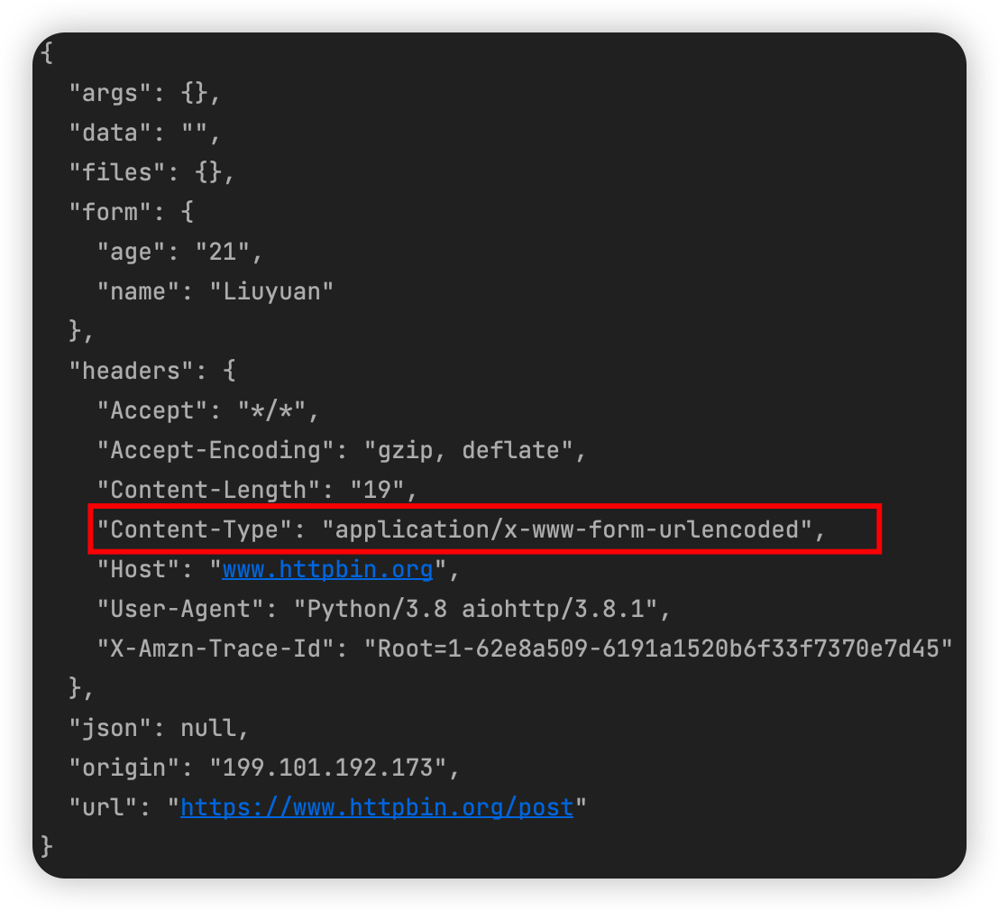
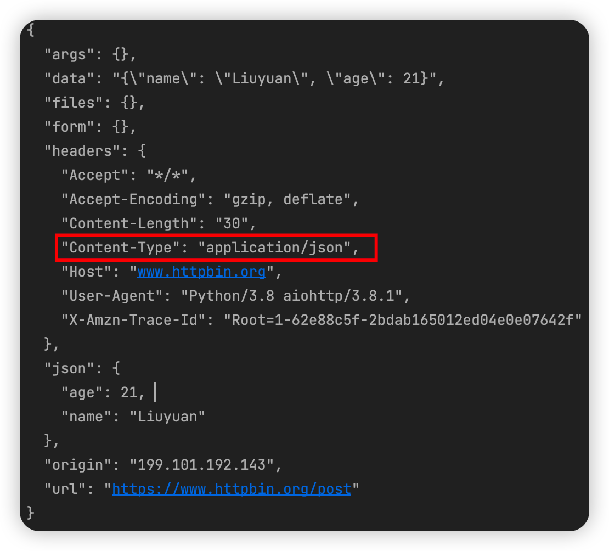

[TOC]

> [官方文档](https://docs.aiohttp.org)

# 1. 基本介绍

**前面介绍的`asyncio`模块，其内部实现了对TCP，UDP，SSL协议的异步操作，但是对于HTTP请求，就需要`aiohttp`实现了**

`aiohttp`是一个基于`asyncio`的异步HTTP网络模块。它既提供了服务端，又提供了客户端。其中，我们用客户端可以搭建一个支持异步处理的服务器，这个服务器就是用来处理请求并返回响应的，类似于`Django`、`Flask`、`Tornado`等一些Web服务器。而客户端可以用来发起请求，类似于使用`requests`发起一个HTTP请求然后获得相应，但`requests`发起的是同步的网络请求，`aiohttp`则是异步的。

# 2. 基本案例

[6.5_aiohttp的使用](https://github.com/LiuYuan-SHU/MyNotes/blob/25bd0a3c7ebd19ca8a5876a4bf61c38d7ac1e0e4/Crawler%20with%20Python3/Python3%20web%20crawler%20development%20practice%EF%BC%88Edition2%EF%BC%89%20-%20Cui%20Qingcai/%E7%AC%AC%E5%85%AD%E7%AB%A0/6.5_aiohttp%E7%9A%84%E4%BD%BF%E7%94%A8.py)

```python
import aiohttp
import asyncio

async def fetch(session, url):
    async with session.get(url) as response:
        return await response.text(), response.status

async def main():
    async with aiohttp.ClientSession() as session:
        html, status = await fetch(session, 'https://cuiqingcai.com')
        print(f'html: {html[:100]}...')
        print(f'status: {status}')

if __name__ == '__main__':
    loop = asyncio.get_event_loop()
    loop.run_until_complete(main())
```

能够发现，`aiohttp`的请求方法的定义与之前有明显的区别，主要包括以下几点：

* 首先在导入库的时候，除了必须引入`aiohttp`这个库还必须引入`asyncio`库。因为要实现异步爬取，需要启动协程，而协程则需要借助于`asyncio`里面的事件循环才能执行。除了事件循环，`asyncio`中也提供了很多基础的异步操作
* 异步爬取方法的定义和之前有所不同，**每个异步方法的前面都要统一加`async`来修饰**
* `with as`语句前面同样需要加入`async`来修饰。在Python中，`with as`语句用于声明一个上下文管理器，能够帮助我们自动分配和释放资源。而在异步方法中，`with as`前面加上`async`代表声明一个支持异步的上下文管理器
* **对于一些返回协程对象的操作，前面需要加`await`来修饰。**例如`response`调用`text`方法，查询API可以发现，其返回的是协程对象，那么就要加`await`
* 最后，定义好了爬取方法之后，实际上是`main`方法调用了我们定义的`fetch`方法。要运行的话，必须启用事件循环，而时间循环需要使用`asyncio`库，然后调用`run_until_complete`方法来执行

> **注意**
>
> 在Python3.7之后，我们可以使用`asyncio.run(main())`代替最后的启动操作，不需要显式声明事件循环，`run`方法内部会自动启动一个事件循环。

# 3. URL参数设置——`params`参数

```python
import aiohttp
import asyncio

async def main():
	params = {'name': 'germey', 'age': '25'}
    async with aiohttp.ClientSession() as session:
        async with session.get('https://www.httpbin.org/get', params = params) as response:
            print(await response.text())

if __name__ == '__main__':
    asyncio.get_event_loop().run_until_complete(main())
```

我们会看到，实际请求的URL为：`https://www.httpbin.org/get?name=germey&age=25`

# 4. 其他请求类型

`aiohttp`还支持其他请求类型，如POST，PUT，DELETE等，这些和`requests`的使用方法有些类似：

```python
session.post(URL, data = b'data')
session.put(URL, data = b'data')
session.delete(URL)
session.head(URL)
session.options(URL)
session.patch(URL, data = b'data')
```

# 5. POST请求

对于POST表单提交，其对应的请求头中的`Content-Type`为`application/x-www-form-urlencoded`，我们可以用如下方式来实现：

[6.6_POST请求](https://github.com/LiuYuan-SHU/MyNotes/blob/338814bc976fa3b0adf0154e2b4f8201bf391861/Crawler%20with%20Python3/Python3%20web%20crawler%20development%20practice%EF%BC%88Edition2%EF%BC%89%20-%20Cui%20Qingcai/%E7%AC%AC%E5%85%AD%E7%AB%A0/6.6_POST%E8%AF%B7%E6%B1%82.py)

```python
import aiohttp
import asyncio


async def main(json = False):
    data = {'name': 'Liuyuan', 'age': 21}
    async with aiohttp.ClientSession() as session:
        if json:
            async with session.post('https://www.httpbin.org/post', data=data) as response:
                print(await response.text())
        else:
            async with session.post('https://www.httpbin.org/post', json=data) as response:
                print(await response.text())


if __name__ == '__main__':
    asyncio.get_event_loop().run_until_complete(main())
```

可以观察程序的返回结果：

如果使用`data`参数进行请求，返回的结果的`Content-Type`为`application/x-www-form-urlencoded`：



而如果我们使用json参数进行请求，返回的结果就是`application/json`



可以看到，不同的参数支持不同类型的请求内容

# 6. 响应

对于相应来说，我们可以用如下方法分别获取其中的状态码、响应头、响应体、响应体二进制内容、响应体JSON结果，实例代码如下：

[6.7_响应](https://github.com/LiuYuan-SHU/MyNotes/blob/651732ebdca0c2d352ddda1e84a90faeff76a1d4/Crawler%20with%20Python3/Python3%20web%20crawler%20development%20practice%EF%BC%88Edition2%EF%BC%89%20-%20Cui%20Qingcai/%E7%AC%AC%E5%85%AD%E7%AB%A0/6.7_%E5%93%8D%E5%BA%94.py)

```python
import asyncio
import aiohttp

async def main():
    data = {'name': 'germey', 'age': 25}
    async with aiohttp.ClientSession() as session:
        async with session.post('https://www.httpbin.org/post', data = data) as response:
            print('status:', response.status)
            print('headers:', response.headers)
            print('body:', await response.text())
            print('bytes:', await response.read())
            print('json:', await response.json())

if __name__ == '__main__':
    asyncio.get_event_loop().run_until_complete(main())
```

***可以看到，这里有些字段前面需要加`await`，有的不需要。其原则是，如果返回的是一个协程对象（如`async`修饰的方法），那么前面就要加`await`，具体可以看`aiohttp`的[API](https://docs.aiohttp.org/en/stable/client_reference.html)***

# 7. 超时设置

```python
timeout = aiohttp.ClientTimeout(total = 1)
async with aiohttp.ClientSession(timeout=timeout) as session:
    ...
```

如果超时，会抛出`TimeoutError`异常，其类型为`asyncio.TimeoutError`，我们进行异常捕获即可

**另外，声明`ClientTimeout`对象时还有其它参数，例如`connect`, `socket_connect`等，可以参考[官方文档](https://docs.aiohttp.org/en/stable/client_quickstart.html#timeouts)**

# 8. 并发限制——`asyncio.Semaphore`

由于`aiohttp`可以支持非常高的并发量，如几万、十万、百万都是能做到的，但面对如此高的并发量，目标网站很可能无法再短时间内响应，而且有瞬间崩溃服务器的危险，这提示我们需要控制一下爬取的并发量

[6.8_并发限制](https://github.com/LiuYuan-SHU/MyNotes/blob/6ce1ecee697a828043b07b63a75a5f4c469ee57e/Crawler%20with%20Python3/Python3%20web%20crawler%20development%20practice%EF%BC%88Edition2%EF%BC%89%20-%20Cui%20Qingcai/%E7%AC%AC%E5%85%AD%E7%AB%A0/6.8_%E5%B9%B6%E5%8F%91%E9%99%90%E5%88%B6.py)

```python
import asyncio
import aiohttp

CONCURRENCY = 1000				# 最大并发数量
URL = 'https://www.baidu.com'	

semaphore = asyncio.Semaphore(CONCURRENCY) # 创建信号量对象
session = None

async def scrape_api():
    async with semaphore:
        print('scraping', URL)
        async with session.get(URL) as response:
            await asyncio.sleep(1)
            return await response.text()

async def main():
    global session
    session = aiohttp.ClientSession()
    scrape_index_tasks = [asyncio.ensure_future(scrape_api()) for _ in range(10000)]
    await asyncio.gather(*scrape_index_tasks)

if __name__ == '__main__':
    asyncio.get_event_loop().run_until_complete(main())
```

