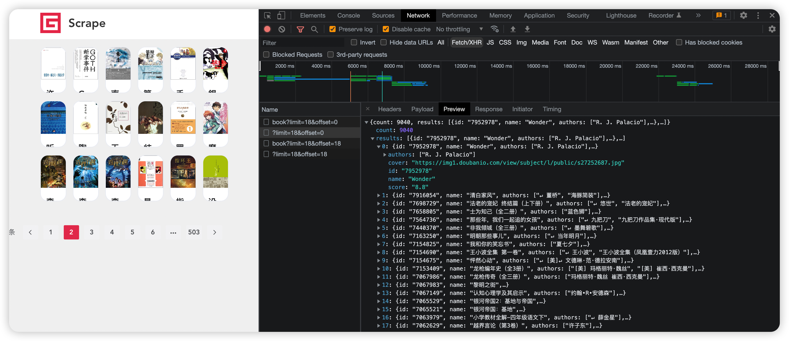
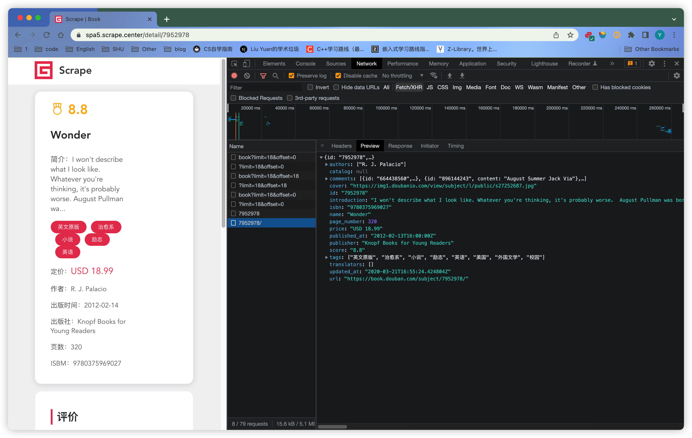
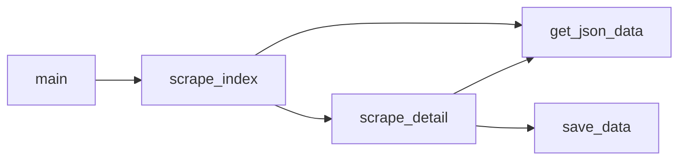
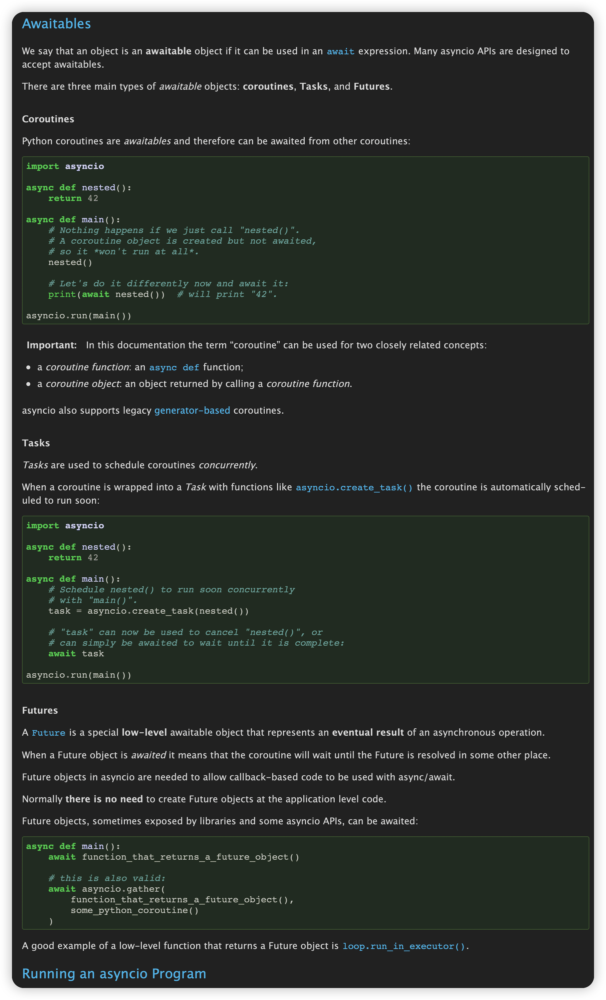
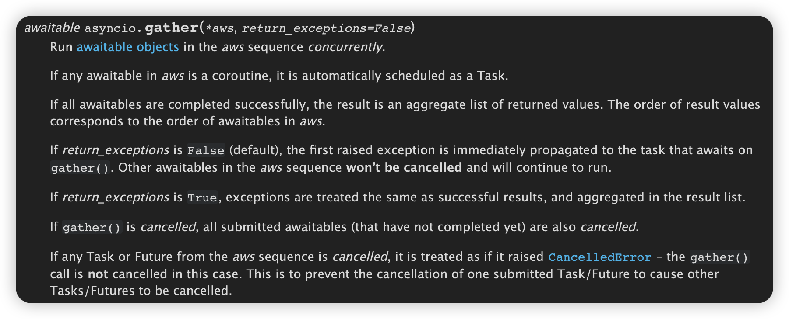
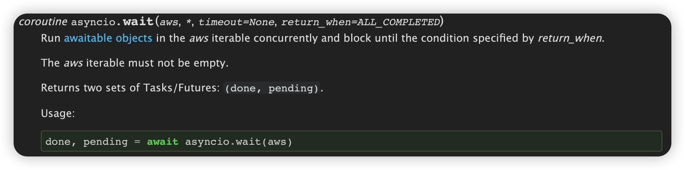
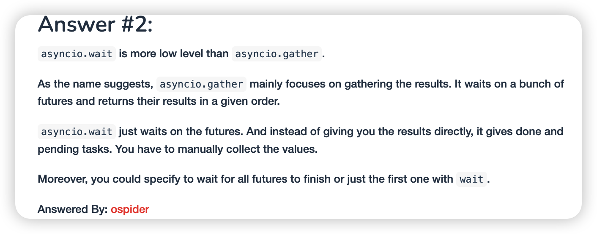

[TOC]

# 1. 需求分析

1. 目标网页：https://spa5.scrape.center

2. 网页加载方式：Ajax

    

3. 使用异步爬取的方式，保存到MongoDB中


# 2. 准备工作

安装异步实现的MongoDB存储库`motor`：

```shell
pip3 install motor
```

# 3. 页面分析

## 列表页

1. Ajax请求接口：`https://spa5.scrape.center/api/book/?limit=18&offset={offset}`，返回的数据为JSON格式，放在`results`中

    

## 详情页

1. Ajax请求接口：`https://spa5.scrape.center/api/book/{book id}`

    

# 4. 实现思路

>  **首先，一个完善的异步爬虫应当能够充分利用资源进行全速爬取。**其实现思路是维护一个动态变化的爬取队列，每产生一个新的`task`，就将其放入爬取队列中，有专门的爬虫消费者从此队列中获取`task`并执行，能做到在最大并发量的前提下充分利用等待时间进行其他的爬取处理。

但由于目前还未接触到爬取队列、回调函数、消费者等机制，需要实现的功能较多，因此进行一定的简化：

**我们将爬取逻辑分成两部分，第一部分爬取列表页，第二部分爬取详情页。**因为异步爬虫的关键点在于并发执行，所以可以将爬取拆分为如下两个阶段：

+ 第一阶段是异步爬取所有列表页，我们可以将所有列表页的爬取任务集合在一起，并将其声明为由`task`组成的列表，进行异步爬取
+ 第二阶段是拿到上一步列表页的所有内容并进行解析，将所有图书的`id`信息组合为所有详情页的爬取任务集合，并将其声明为`task`组成的列表，进行一步爬取，同时爬取结果也以一步方式存储到MongoDB中

因为两个阶段在拆分之后需要串行执行，所以可能无法大到协程的最佳调度方式和资源利用情况，但是也差不了很多。这个实现思路简单清晰，实现起来也较为容易，能够帮我们快速了解`aiohttp`的简单用法。

# 5. 代码实现

## 代码逻辑



## 细节分析

### `wait`和`gather`的区别 

> [Asyncio.gather vs asyncio.wait](https://discuss.dizzycoding.com/asyncio-gather-vs-asyncio-wait/)

#### `Awaitables`



#### `asyncio.gather`



#### `asyncio.wait`



#### 精选回答


