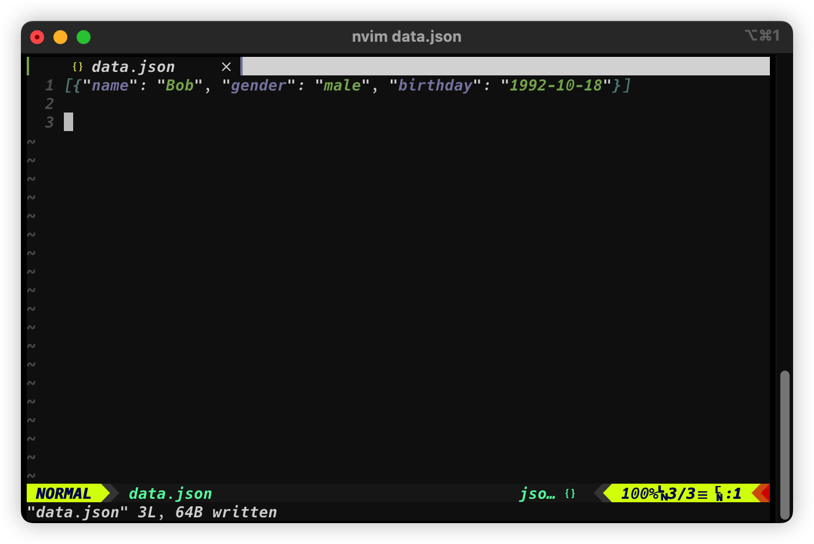
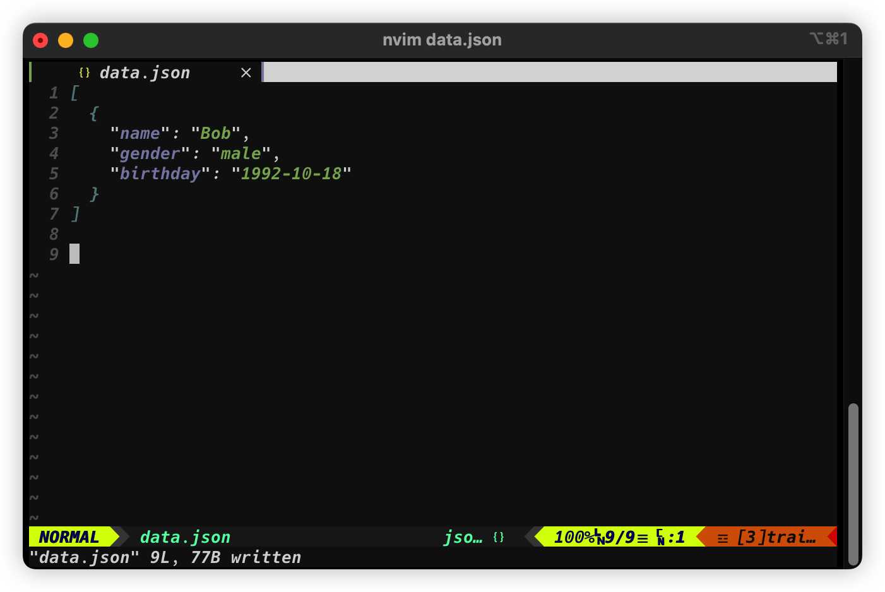

> JSON，全称为**JavaScript Object Notation**，也就是JavaScript对象标记，通过对象和数组的组合来表示数据，虽然构造简介但是结构化程度非常高，是一种轻量级的数据交换格式

[TOC]

# 1. 对象和数组

>  ***在JavaScript语言中，一切解对象，因此任何支持的数据类型都可以通过JSON表示，例如字符串、数字、对象、数组等。***

## 对象

对象在JavaScript中是指花括号`{}`包围起来的内容，数据结构是`{key1: value1, key2: value2, ...}`这种键值对结构。**前者可以使用整数和字符串表示，后者可以是任意类型**

## 数组

数组在JavaScript中是指用方括号`[]`包围起来的内容，数据结构是`["java", "javascript", "vb", ...]`这种索引结构。在J啊vaSs中，数组是一种比较特殊的数据类型，因为它可以像对象那样使用键值对结构，但还是索引结构用的更多。**同样，它的值可以是任意类型**

## 实例

所以，一个JSON对象可以写成如下形式：

```javascript
[{
    "name": "Bob",
    "gender": "male",
    "birthday": "1992-10-18"
},{
 	"name": "Selina",
    "gender": "female",
    "birthday": "1995-10-18"
}]
```

由`[]`包围的内容箱单与是数组，舒祖忠的每个元素都可以是任意类型，这个实例中的元素是对象，由`{}`包围。

***JSON可以由以上两种形式自由组合而成，能够嵌套无限次，而且结构清晰，是数据交换的极佳实现方式***

# 2. 读取JSON——`loads`&`load`

> Python为我们提供了简答易用的JSON库，用来实现JSON文件的读写操作，**我们可以调用JSON库中的`loads`方法将JSON文本字符串转换为JSON对象**。实际上，JSON对象就是Python中列表和字典的嵌套与组合。反过来，**我们可以通过`dumps`方法将JSON对象转换为文本字符串**

## 实例——`loads`

```python
import json

str = '''
[{
    "name": "Bob",
    "gender": "male",
    "birthday": "1992-10-18"
},{
 	"name": "Selina",
    "gender": "female",
    "birthday": "1995-10-18"
}]
'''
print(type(str))		# <class 'str'>
data = json.loads(str)
print(data)				# [{'name': 'Bob', 'gender': 'male', 'birthday': '1992-10-18'}, {...}]
print(type(data))		# <class 'list'>
```

这里用`loads`方法将字符串转化为了JSON对象。**由于最外层是中括号，所以最终的数据类型是列表类型。**

这样一来，我们就可以用索引获取对应的内容了。

```python
# 获取第一个元素里的name属性
data[0]['name']		# Bob
data[0].get('name')	# Bob
```

## 获取键值的两种方式

**获取键值的方式有两种：**

1. 中括号加键名

2. 利用`get`方法传入键名（推荐），如果键名不存在，那么返回`None`而不是报错。

    另外，`get`方法还可以传入第二个参数（即，默认值）：

    ```python
    data[0].get('age')		# None
    data[0].get('age', 25)	# 25
    ```

    如果原字典中不存在该键名，那么就会返回`None`。但是如果传入了第二个参数，就会返回这个值。

## 注意

值得注意的是，**JSON数据都需要用双引号包围起来，而不能使用单引号。**

***错误示范：***

```python
str = '''
[{
	'name': 'Bob',
	...
}]
'''
```

## 从JSON文本中读取内容——`load`

```python
import json

with open('data.json', encoding='utf-8') as file:
    str = file.read()
    data = json.loads(str)
    print(data)
```

更简洁的写法：直接使用`load`方法传入文件操作对象，同样也可以将文本转化为JSON对象：

```python
import json

data = json.load(open('data.json', encoding='utf-8'))
print(data)
```

## 两种方法的区别与联系

需要注意的是，**`load`的参数是一个文件操作对象，`loads`的参数是一个JSON字符串**

这两种写法的运行结果是完全一样的。只不过`load`方法是将整个文件中的内容转化为JSON对象，而`loads`方法可以更灵活地控制要转化哪些内容。

# 3. 输出JSON——`dumps`&`dump`

> 可以调用`dumps`方法将JSON对象转化为字符串。

```python
import json

data = [{
    'name': 'Bob',
    'gender': 'male',
    'birthday': '1992-10-18'
}, {
    ...
}]
with open('data.json', 'w', encoding='utf-8') as file:
    file.write(json.dumps(data))
```



## 设置缩进

另外，如果想要保存JSON对象的缩进格式，可以再往`dumps`方法中添加一个参数`indent`，代表缩进字符的个数：

```python
file.write(json.dumps(data, indent=2))
```



## 保存中文

如果不加任何修改，那么保存的将是Unicode字符，这显然不是我们想要的结果。要想输出中文，还需要指定参数`ensure_ascii`为`False`，以及规定文件输出的编码：

```python
with open('data.json', 'w', encoding='utf-8') as file:
    file.write(json.dumps(data, indent=2, ensure_ascii=Flase))
```

## `dump`

`dump`方法能够直接将JSON对象全部写入文件中，因此上面的写法可以写成这样：

```python
json.dump(data, open('data.json', 'w', encoding='utf-8'), indet=2, ensure_ascii=False)
```

