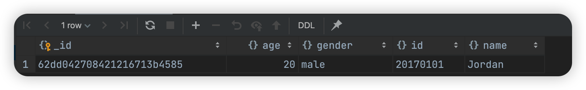

NoSQL，全称为**Not Only SQL**，泛指非关系型数据库。NoSQL是基于键值对的，而且不需要经过SQL层的解析，数据之间没有耦合性，性能非常高。

> ```mermaid
> graph LR;
> 非关系型数据库 --> 键值存储数据库 & 列存储数据库 & 文档型数据库 & 图形数据库
> 	键值存储数据库 --> Redis & Voldemort & ora[Oracle BDB]
> 	列存储数据库 --> Cassandra & HBase & Riak
> 	文档型数据库 --> CouchDb & MongoDB
> 	图形数据库 --> Neo4j & InfoGrid & infinite[Infinite Graph]
> ```
>
> 对于爬虫的数据存储来说，一条数据可能存在因某些字段提取失败而缺失的情况，而且数据可能随时调整。
>
> 另外，数据之间还存在嵌套关系。如果使用关系型数据库存储这些数据：
>
> 1. 需要提前建表
> 2. 如果数据存在嵌套关系，还需要进行序列化操作才可以存储，这非常不方便。
>
> MongoDB是由C++编写的非关系型数据库，是一个基于分布式文件存储的开源数据库系统，其内容的存储形式类似JSON对象。他的字段值可以包含其他文档、数组及文档数组。

# 1. 准备工作

1. MongoDB安装：https://setup.scrape.center/mongodb

2. PyMongo安装：https://setup.scrape.center/pymongo

    `pip3 install pymongo`

# 2. 连接工作

```python
import pymongo

# Method 1
client = pymongo.MongoClient(host = 'localhost', port = 27017)
# Method 2
client = pymongo.MongoClient('mongodb://localhost:27017')
```

# 3. 指定数据库

在MongoDB中，可以建立多个数据库，所以我们需要指定操作哪个数据库。

Python:

```python
db = client.test
db = client['test']
```

MongoDB:

```sql
use test;
```

# 4. 指定集合

MongoDB中每个数据库又都包含许多集合（collection），这些集合类似于关系型数据库中的表。

python：

```python
collection = db.students
collection = db['students']
```

# 5. 插入数据

## `insert`

### 单条数据插入

```python
student = {
    'id': '20170101',
    'name': 'Jordan',
    'age': 20,
    'gender': 'male'
}
result = collection.insert(student)
print(result)	# 返回的是生成的ObjectId
```

```sql
db.students.insertOne({'id': '20170101', 'name': 'Jordan', 'age': 20, 'gender': 'male'});
```

### 多条数据插入

```python
student1 = {
    'id': '20170101',
    'name': 'Jordan',
    'age': 20,
    'gender': 'male'
}
student2 = {
    'id': '20170202',
    'name': 'Mike',
    'age': 21,
    'gender': 'male'
}
result = collection.insert([student1, student2])
print(result)
```

```SQL
db.students.insertMany([
    {'id': '20170101', 'name': 'Jordan', 'age': 20, 'gender': 'male'},
    {'id': '20170202', 'name': 'Mike', 'age':21, 'gender': 'male'}
])
```


## ObjectId

在MongoDB中，每条数据都有一个`_id`属性作为唯一标识。如果没有显式指明该属性，那么MongoDB会自动产生一个`ObjectId`类型的`_id`属性，`insert`方法会在执行后返回`_id`值



## `insert_one`&`insert_many`

在PyMongo 3.x版本中，官方已经不推荐使用`insert`方法了。当然继续使用也没有什么问题

### `insert_one`

```python
result = collection.insert_one(student)
print(result)
print(result.inserted_id)
```

返回的是`InsertOneResult`对象

### `insert_many`

```python
result = collection.insert_many([student1, student2])
print(result)
print(result.inserted_ids)	# 返回一个列表
```

返回的是`InsertManyResult`对象

# 6. 查询

## `find_one`

```python
result = collection.find_one({'name': 'Mike'})
print(type(result))	# <class 'dict'>
print(result)		# {'_id': ObjectId('...'), ...}
```

此外，我们也可以根据`ObjectId`来查询数据，此时需要使用`bson`库中的`obecjtid`：

```python
from bson.objectid import ObjectId

result = collection.find_one({'_id': ObjectId('...')})
```

## `find`

```python
results = collection.find({'age': 20})
print(results)
for result in reults:
    print(result)
```

返回结果是Cursor类型，相当于一个生成器，每一个结果都是字典类型。

### 比较

如果想要查询`age`大于20的数据，写法如下：

```python
results = collection.find({'age': {'$gt': 20}})
```

| 符号   | 含义       | 实例                         |
| ------ | ---------- | ---------------------------- |
| `$lt`  | 小于       | `{'age': {'$lt': 20}}`       |
| `$gt`  | 大于       |                              |
| `$lte` | 小于等于   |                              |
| `$gte` | 大于等于   |                              |
| `$ne`  | 不等于     |                              |
| `$in`  | 在范围内   | `{'age': {'$in': [20, 23]}}` |
| `$nin` | 不在范围内 |                              |

### 功能

另外，还可以进行正则匹配查询。例如，查询`name`以`M`开头的学生数据：

```python
results = collection.find('name': {'$regex': '^M.*'})
```

| 符号      | 含义           | 实例 | 实例含义 |
| --------- | -------------- | ---- | -------- |
| `$regex`  | 匹配正则表达式 |      |          |
| `$exists` | 属性是否存在   |      |          |
| `$type`   | 类型判断       |      |          |
| `$mod`    | 数字摸操作     |      |          |
| `$text`   | 文本查询       |      |          |
| `$where`  | 高级条件查询   |      |          |
| `$set`    | 更新字段               |      |          |
| `$inc`          |  令字段的值增加指定值              |      |          |

# 7. 计数——`count`

```python
count = collection.find({'age': 20}).count()
```

```SQL
db.students.find().count()
```

# 8. 排序——`sort`

```python
results = collection.find().sort('name', pymongo.ASCENDING)	# 升序
```

如果想要降序，可以传入`pymongo.DESCENDING`

```sql
db.students.find().sort({'name': 1});
db.students.find().sort({'_id': -1});
```

# 9. 偏移——`skip` & `limit`

在某些情况下，我们可能只想获取某几个元素，这个时候可以利用`skip`方法偏移几个位置

```python
results = collection.find().sort('name', pymongo.ASCENDING).skip(2)
```

```SQL
db.students.find().sort({'name': 1}).skip(2);
```

******

同时，我们可以使用`limit`来指定想要获取的结果个数：

```python
results = collection.find().sort('name', pymongo.ASCENDING).skip(2).limit(2)
```

```sql
db.students.find().sort({'name': 1}).skip(2).limit(2);
```

## 注意

在数据库中数据量非常大的时候（例如千万、亿级别），最好不要使用大偏移量来查询数据，因为这样很可能导致内存溢出。此时可以使用这样的操作：

```python
from bson.objectid import ObjectId
collection.find({'_id': {'$gt': ObecjtId('<提前准备好的id>')}})
```

# 10. 更新——`update`

```python
condition = {'name': 'Kevin'}
student = collection.find_one(condition)
student['age'] = 25
result = collection.update(contidion, student)
print(result)	# {'ok': 1, 'nModified': 1, 'n': 1, 'updatedExisting': True}
```

返回结果中，ok代表执行成功，`nModified`代表影响的数据条数

## 可选参数`upsert`

如果参数被设置为True，那么：

1. 如果数据不存在，插入
2. 如果数据存在
    1. 但不相同，那么按照参数更新（例如下面的`set`）
    2. 且相同，那么不进行操作

详见

## `set`

```Python
result = collection.update(condition, {'$set': student})
```

这样可以只更新`student`字典内存在的字段。如果原先还有其他字段，则既不会更新，也不会删除。**而如果不使用`$set`**，就会把之前的数据全部用`student`字典替换；如果原先存在其他字段，会被删除

## `update_one` & `update_many`

> 事实上，`update`其实也是官方不推荐使用的方法。官方推荐使用单独的`update_one`方法和`update_many`来处理单条和多条数据更新过程，它们的用法更为严格，第二个参数都需要使用`{'$set': student}`这种形式的数据。然后分别调用`matched_count`和`modified_count`属性，可以获得匹配的数据条数和影响的数据条数

### `update_one`

```Python
condition = {'name': 'Kevin'}
student = collection.find_one(condition)
student['age'] = 26
result = collection.update_one(condition, {'$set': student})
print(result)	# <pymongo.results.UpdateResult object at ...>
print(result.matched_count, result.modified_count) # 1 0
```

```SQL
db.students.updateOne({'name': 'Kevin'}, {'$set': {'age': 26}});
```

可以发现`update_one`方法的返回结果是`UpdateResult`类型。

### `update_many`

```python
condition = {'age': 20}
result = collection.update_one(condition, {'$inc': {'age': 1}})
```

如果我们使用`update_many`，就会更新所有符合条件的数据：

```python
conditon = {'age': {'$gt': 20}}
result = collection.update_many(conditon, {'age': 1})
```