# 泛型编程与STL

[TOC]

## 读后感

这确实是一本好书。

******

***初读***

但是可能是作者自身的原因吧，他喜欢在应用和概念之间反复横条。而且对于概念的深究往往能够追究到非常理论和逻辑的部分，但我个人向来不是很喜欢这样的。可能是因为我认为脱离了实体的概念是没有意义的，也没有必要将概念抽象到如此高度，知道大概是这么一回事儿就可以了。但是对于作者以这个层次的人来说，一定要将概念抽象到如此境界才能说透彻吧。

******

***读完第一部分***

概念的大量铺垫确实必要。就目前而言，很多东西还不是读的很懂。但是可以看出很多深邃的思想。奈何这翻译好像有点问题，读了很多之后能够猜出作者的翻译和当今的说法的对应。

******

## 引入

### *Why Iterator?* -- 线性查找（linear search）

#### 基于char的数组的线性查找

##### **代码块1**

```cpp
char* strchr(char* s, int c)
{
   	while(*s != '\0' && *s != c)
    {
        ++s;
    }
    return *s == c ? s : (char*) 0;
}
```

这个函数虽然有用，却未能如它所表现的那么一般化。部分问题处在它只能查找chars数组中的某个char（或说某个`unsigned char 或 wchar_t`。另一个问题和类型记号无关：`strchr`的接口限制它只能查找一种特定的数据结构。

两个明显的方法可以修改strchr的接口。一是提供一个整数计数：以“以s为始”之数组的“前n个字符”中查找。另一种选择是提供一个指针，指向所要查找的数组尾端。结果显示，后者比较方便。


###### 为什么*“指向序列结尾的指针”*比*“整数计数法”*来的恰当？

1. 累加指针值比维护一个分离的计数值容易多了
2. 指针比较具有一致性。如果序列的开头/结尾以及函数返回值都具有相同表示法，那么“以某一查找结果作为下一查找运算的输入值”就容易多了。
    - **最重要的一点**：当将[`find1`](#find1)函数更加一般化时，就会发现指针的使用及其必要。

##### **代码块2**<a name="find1"></a>

```cpp
char *find1(char* first, char* last, int c)
{
    while (first != last && *first != c)
    {
        ++first;
    }
    return first;
}
```

函数`find1`以“指针越过数组尾端”作为结束条件。循环遇到*“first等于last”*的情况就结束。last自身则从未被提领（*dereferenced*）过。也就是说，`find1`从first所指之元素开始一一往下查找，至last为止，但不包含last。

###### **应用**

```c
char A[N];
...;
char* result = find1(A, A + N, c);
if(result == A + N)
{
    //查找失败
}
else
{
    //查找成功
}
    
```

###### ***技术关键——C语言的三种指针***

> C语言对于指针运算是很挑剔的
>
> 举例来说，你不能执行‵p < q‵这样的比较动作，除非p与q指向同一个数组。
>
> 同样道理，你不可对非法指针（例如`null`指针）做数值运算

在C/C++中，典型的循环是由0检查至N-1，所以***“past the end（越过尾端）”***的指针如 A + N是有效的，但这仅仅适用于特殊情况。每一个C语言数组都有一个指针会***"越过尾端"***，你不能提领其值，因为实际上它没有指向任何东西，你也不可以累加这个指针，因为每个数组只有这么一个越过尾端的指针，但是你可以利用它来做比对动作和指针运算。

因此，***C语言有三种不同种类的指针***：

1. 普通而有效的指针如&A[0]，可以对它作提领***(dereference)***动作
2. 非法指针如*NULL*（又称为***singular***指针）
3. ***past the end***指针，不可以进行提领动作，但可用于指针运算。


#### Range（区间）<a name="range"></a>

在find1函数中，我们通过从first至last（但不包含last）的所有指针，进行查找。

一般而言，***range***包含以下性质：

1. 对任何指针`p``而言，***empty range[p,p)（空区间）***是有效区间
2. 如果[first, last)有效，而且不为空，那么[first + 1, last)也必定有效
3. 如果[first, last)有效，mid为满足以下条件之任何指针：first出发后可达mid，mid出发后可达last，那么[first, mid)和[mid, last)亦皆有效
4. 反方向说，如果first, mid)和[mid, last)皆有效，那么[first, last)有效


#### 基于链表（Linked List）的线性查找

从`find1`函数中我们可以提取出`find`函数基本模式：<a name="find2"></a>

```cpp
template<class T>
T* find2(T* first, T* last, T value);
```

其中，P为某种指针，能够满足我们我们需要的一系列操作

##### STL的线性查找算法<a name="find"></a>

```cpp
template<class Iterator,class T>
Iterator find(Iterator first,Iterator last, const T& value)
{
    while(first != last && *first != value)
        ++first;
    return first;
}
```

***为何采用[`find`](#find)，而不采用比较浅显的[`find2`](#find2)呢？这样有什么好处？***

好处是，**这样的函数可以比`find2`更一般化**。`find2`要求参数first和last都必须为指针，find却没有这样的限制。虽然find对那些参数使用了指针运算语法(`operator*`用来取出first所指之指，`operator++`用来累加，`operator==`用来验证first与last是否等值)，但这并不表示`Iterator`一定是指针，而是仅仅意味`Iterator`必须支持类似指针的接口。如同[`find1`](#find1)一样，`find`仍可对***range***[first, last)执行查找动作，并假设[first, last)满足[Range](#range)中所描述的所有性质，但`find`不要求其中的元素必须是数组元素（也可以是非连续数据结构——链表）


##### 链表的查找

**Int_node**<a name="int_node"></a>

```cpp
struct int_node
{
    int val;
    int_node* next;
};
```

常见的一种链表操作行为是：在链表之中查找某个指定值。换言之，就是作线性查找。既然`int_node`所形成的链表是线性序列，我们就没有必要再写一个线性查找器；***我们应该重复利用find函数***。

既然[int_node](#inde_node)不是唯一具有next指针的节点形式，我们不妨稍稍地一般化些。我们可以轻易地定义一个`template wrapper class`，使它适用于任何***“具有next指针的链表节点”***，而不局限于`int_node`

###### node_wrap

```cpp
template<class Node>
struct node_wrap
{
    Node* ptr;
    
    //default constructor（缺省函数）
    node_wrap(Node* p = 0):ptr(p) {}
    //reference/dereference operator reload
    Node& operator*() const { return *ptr; }
    Node* operator->() const { return ptr; }
    //preincrement & postincrement operator reload
    node_wrap& operator++() { ptr = ptr->next; return *this; }
    node_wrap operator++(int) { node_wrap temp = *this; ++ *this; return temp; }
    //logic operator reload
    bool operator==(const node_wrap& i) const { return ptr == i.ptr; }
    bool operator!=(const node_wrap& i) const { return ptr != i.ptr; }
};
```

最后，为了方便，我们可以定义一个相等操作符，用来比对节点中的值

```cpp
template<class T,class U>
bool operator==(const T& node,U val)
{
    return node.val == val;
}
```


现在，想要查找哪一个`int_node`具有某个特定值，我们在不需要写任何循环了。我们呢可以重复利用[`find`](#find)，将查找动作写成单一函数调用：

```cpp
find(node_wrap<int_node>(list_head), node_wrap(int_node)(), int val)
```

外覆类`node_int`看起来简单而普通（实际上也是），但它很管用。要知道，`int_node`并未设计范型算法的任何知识；它可能是数年前写成的数据结构，甚至在泛型算法(甚至C++语言)出现之前就存在了。只要使用小小的外覆类，我们就可以让旧的数据结构([`int_node`链表](#int_node))和新的范型算法(`find`)之间相互作用。`node_wrap`**class**作为二者的中间媒介而不失效率。是的，`node_wrap`的所有*member function*都被定义为***inline***，所以面对`node_wrap<int_node>`写出`w++`，和面对`int_node*`写出`p = p->next`，效果完全相同 


### 意义

由于`find`非常谨慎地希望尽可能一般化，所以它假设其参数可适用于任何range。这组条件可妥善运用在其他地方，不仅止于`find`。它可运用于任何***在某个range上面做动作***的算法

这组条件是如此的重要，因而有属于自己的名字：`find`的`template`参数是个所谓的***iterator***（迭代器）。

***Iterator*** 是**Standard Template Library**的一部分


## Concepts和Modeling

**Iterator**中有很多分类，而***Input Iterator***便是其中一个种类。

在线性查找之中，`find`函数最重要的需求（条件）就是，`Iterator`必须是一个***Input Iterator***。

***Input Iterator***是一个***concept***。所谓concept，是一组“描述某个类型”的条件。当某个类型满足所有这样的条件，我们便说它是该concept的一个***model***。


### 何谓Concept？

有三种方法有助于了解concepts，这些方式一开始似乎大不相同，但最后证明都是相通的。

1. concept可以想象是一组类型条件(*type requirement*)。如果说类型T是concept C的一个model，则T必须满足C的所有条件。***“描述某个类型所必需具备的性质”***几乎是最容易具体指明concept的方式了。
2. concept可以想成是类型的集合。举例来说，***concept Input Iterator***可以涵盖`char*/int*/node_wrap`等类型。如果类型T是concept C的model，意思便是说T隶属于***C所代表的那个类型集合***。由于集合中的所有类型都满足那一系列条件，所以这个定义与前一个定义相通。***这个定义涉及集合自身，先前那个定义则涉及集合的形成条件***，其实是以不同的角度看待同一件事。
3. concept可以想成是一组合法程序。——***这也是新的concept的发掘方法。我们并非藉由“写下一组需求条件”来发掘和描述新的concepts，而是藉由“特别定义的算法”并研究“template参数如何运用于这些算法身上”的过程来完成。***我们研究`find`，过程中导出了***Input Iterator***。

### Concept的条件 (Concept Requirements)

### 基本的Concepts


## *Iterators*

> 迭代器，范型指针

Iterator是指针的概括物；它们是“用来指向其他对象”的一种对象，这对于像`find`这样的范型算法很重要，因为它们可以用来在对象区间内***来回移动(iterate)***。

Iterator对于范型编程之所以很重要，原因是它是算法与数据结构之间的接口。类似`find`这样的算法，以iterator为参数，便可以作用在许许多多不同的数据结构上——即使结构彼此不同（例如链表与C数组）。我们仅仅要求：***iterator能够以某种线性顺序遍历某个数据结构，以访问其中所有的元素***

经过[之前的讨论](#Concepts和Modeling)，iterator似乎需要定义为一个concept，而指针便是这个concept的一个model。这差不多是正确的，但也不尽然。C++指针有许多不同的性质，而范型算法`find`倚赖的是这些性质中很小的一个子集。其他的范型算法可能倚赖不同的子集。换句话说，有许多不同的方法可以将指针一般化，每一个不同的方法便是一个不同的concept。

Iterator不单单只是一个concept，而是五个不同的concepts：<a name="iterators"></a>

1. ***Input Iterator***
2. ***Output Iterator***
3. ***Forward Iterator***
4. ***Bidirectional Iterator***
5. ***Random Access Iterator***
6. ***Trivial Iterator***——用来理清其他iterator concepts的定义

### **Input Iterators**

本质上，***Input Iterator***是某种类似指针的东西，并且在我们谈到***iterator range***[first, last) 时有意义：

- 当它作为一般C指针时，有三种不同的价值：它是***dereferenceable（可取值的）***/***past the end（可跨越尾端的）***/***singular（可为null的）***。当它作为指针，只有在first和last都不为null指针时，[first, last)才是有意义的range
- 类型为Iterator的两个对象可以比较其相等性。
- Input Iterator可以被复制或被赋值。
- 一个类型为Iterator的对象可以被提领(**dereference**)
- 一个类型为Iterator的对象可以进行累加操作。

在`find`函数中，使用到的性质还有：

- 审视在range[first, last)内的值，但不改动他们
- Input Iterator仅仅支持我们所习惯的指针运算中极小的一部分子集，例如不能够递减
- Input Iterator只支持极有限的比较形式，例如可以测试两个Input Iterator是否想等，但是不能够比较谁在谁之前
- 线性查找是一种***single pass（单回）***算法。它只遍历**range**[first, last)一次，并对range中的值最多读取一次

需要注意的是，以上四点是在`find`之中的限制，而不是Input Iterator其本身的限制。例如，`double *`是Input Iterator的一个model，但`double *`支持***multipass（多回）***算法。***Input Iterator***携带的条件是功能需求最小的集合，而其***model***则可能（而且经常）超过这个最小集合。

Input Iterator这个名称，暗示着这些需求和条件的某些看似奇怪的理由。使用Input Iterator就像从终端机或网络连线读取数据一样读如输入值：你可以要求下一个值，但一旦如此，前一个值便消失无踪了。如果你希望再次取得前一个值，你必须自行将取自input stream的数据存储下来。


### Output Iterators

如果说Input Iterator是做*从input stream读入*的动作，你或许会觉得有另一个iterator作*写入output stream*的动作，我们称其为***Output Iterators***

**应用—— `copy` of STL**<a name="copy"></a>

```cpp
template<class InputIterator, class OutputIterator>
OutputIterator copy(InputIterator first, InputIterator last, OutputIterator result)
{
    for( ; first != last; ++result, ++ first)
        *result = *first;
    return result;
}
```

Output Iterator的需求条件与Input Iterator类似：

- 如同Input Iterator，我们可以复制和赋值Output Iterator
- 我们可以使用Output Iterator来写值。换言之，表达式 `*p = x`有良好定义
- 我们可以累加Output Iterator。换言之，表达式`++p/p++`有良好定义
- Output Iterator具有只写性
- Output Iterator所形成的“*区间*”都是以单独一个iterator再加上一个计量值来决定。以`copy`为例，其输出区间是以`result`为开头，[first, last)所覆盖的元素个数作为区间长度

#### ostream_iterator

```cpp
template<class T>
class ostream_iterator
{
private:
    ostream* os;
    const char* string;
public:
    ostream_iterator(ostream& s,const char* c = 0) : os(&s), string(c) {}
    ostream_iteratpr(const ostream_iterator& i) : os(i.os), string(i.string) {}
    ostream_iterator& operator=(const ostream_iterator& i)
    {
        os = i.os;
        string = i.string;
        return *this;
    }
    ostream_iterator<T>& operator=(const T& value)
    {
        *os << value;
        if (string) *os << string;
        return *this;
    }
    
    ostream_iterator<T>& operator*() { return *this; }
    ostream_iterator<T>& operator++() { return *this; }
    ostream_iterator<T>& operator++(int) { return *this; }
};
```

`ostream_iterator`只能用在single-pass算法上，因为`ostream_iterator`不会记录ostream内的哪个特定位置；它只做输出动作，除此之外便无其他。可以这样使用[copy](#copy)函数：

```cpp
copy(A, A + N, ostream_iterator<int>(cout, " "))
```

这是将整数序列复制到标准输出设备。只有这样形式的算法才可以使用`ostream_iterator`


#### 意义

花费这么大的俄历其，似乎只是为了可以将`os << x`替换为`*p = x`。但我们其实获得了很重要的东西。泛型编程（***generic programming***）非常依从语法的约束。这种一致性的语法形式使我们有可能以同一个`copy`算法完成任何*涉及将数值写至任意种类的输出区间*的动作。


### Forward Iterators

很多算法可以单独以Input Iterator和Output Iterator完成，但也有许多算法无法如此。

***Input Iterators和Output Iterators的缺点***

1. Input Iterator具有只读性，Output Iterator具有只写性。这意味这任何需要***“读写并更改”***某一区间的算法，无法单就这些concepts来运作。你可以利用Input Iterators写出某种查找算法，但无法用它写出*“查找并替换”*的算法
2. 由于运用Input Iterators和Output Iterators的算法只能是single pass算法，这使得算法的复杂度最多只能与区间内的元素呈线性关系。但并非所有的算法都是线性的。
3. 任何时刻，某个区间内，只能有一个有效的（active，作用中的）Input Iterator或Output Iterator。这使得算法在同一时刻只能对单一元素做动作。对于*"行为取决于两个或多个不同元素之间的关系"*的算法，我们无能为力

#### Forward Iterators的限制

1. 指针运算与Input Iteratos和Output Iterators同级：可以写`++p`但是不可以写`--p`或者'p += 5'
2. 一个身为Forward Iterator model的类型，必然也是Input Iterator model和Output Iterator model，因此它能够在统一区间内作读取动作和更新动作

#### 性质

***Const（不变的）Iterators 和Mutable（可变的）Iterators***

Forward Iterator可以是***constant（常量的）***，这种情况下（[adjacent_find](#adjacent_find)）我们可以取出它所指的对象，但不能经由它赋值；Forward Iterator也可以是***mutable（可变的）***，这种情况下可以取出其所指之值，或是对它做赋值动作。

***一个指向常量的迭代器其本身并不一定是常量***——一个指向常量的指针并不一定是一个常量

***constant iterator***并不一定得是（甚至不常是）const object。constant iterator是一种*“无法用来更改其所指值”*的iterator，但iterator object自身可能是const，也可能不是。

#### 应用

***replace***<a name="replace"></a>

```cpp
template<class ForwardIterator, class T>
void replace(ForwardIterator first, ForwardIterator last, const T& old_value, const T& new_value)
{
    for( ; first != last; ++first)
    {
        if(*first == old_value)
            *first = new_value;
    }
}
```

`replace`也是一种single pass算法，一次只作用一个元素。我们之所以需要威力较强的Forward Iterator concept，是因为ie我们需要在同一个 iterator上进行读取和涂写。Forward Iterator也允许算法使用更一般化的访问模式(***access patterns***)

考虑一个线性查找的变形。这次我们不再查找某特定之，而是查找是否*“连续两个元素具有相同值”*

***adjacent_find***<a name="adjacent_find"></a>

```cpp
template<class ForwardIterator>
ForwardIterator adjacent_find(ForwardIterator first, ForwardIterator last)
{
    if (first == last)
        return last;
    ForwardIterator next = first;
    while(++next != last)
    {
        if(*first == *next)
            return first;
        first = next;
    }
    return last;
}
```

虽然`adjacent_find`只做只读动作，却不能以Input Iterator写成。因为循环的每一次迭代都会比较两个不同的值，`*first`与`*next`。如果算法只是用Input Iterator，无法在同一区间内使用一个以上的iterator。

基本的差异在于，Input Iterator和Output Iterator并未完全遵循一般的C内存模式(***C memory model***)，而Forward ITerator对之所有遵循。例如[node_wrap](#node_wrap)，就是一个Forward Iterator，因为一个`node_wrap`指向某个特定的地址，就像一般的指针一样。

### Bidirectional Iterators

> Bidirectional 双向的
>
> 和Forward Iterator一样，Bidirectional Iterator允许multipass算法。
>
> 而且它也可以是constant或mutable

```cpp
template<class BidirectionalIterator, class OutputIterator>
OutputIterator reverse_copy(BidirectionalIterator first, BidirectionalIterator last,OutputInterator result)
{
    while(first != last)
    {
        --last;
        *result = *last;
        ++result;
    }
    return result;
}
```

### Random Access Iterators

#### Random Access Iterator 与 Bidirectional Iterator的区别

再次之前所题的四个concepts都值提供指针运算的一小部分子集，Input Iterator, Output Iterator 和 Forward Iterator只定义`operator++`，Bidirectional Iterator也只不过增加了`operator--`。

而Random Access Iterator则涵盖所有的指针运算：

- 加法和减法：`p+n/p-n`
- 下标：`p[n]`
- 两个iterator相减：`p1-p2`
- 以及前后次序关系：`p1 < p2`

#### Random Access Iterators真的必要吗？

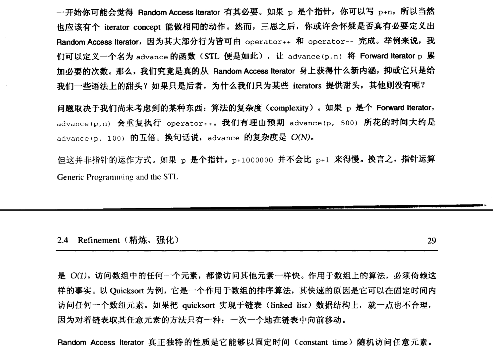

#### Refinement（精炼/强化）

*如果concept C2提供concept C1的所有功能，再加上其他可能的额外功能，我们便说C2是C1的一个refinement*。换句话说，Bidirectional Iterator是Forward Iterator的一个Refinement，其model也是Forward Iterator的一个model

Moldeling与refinement满足三个重要性质：

1. ***Reflexivity（自凡性）***。每个concept C都是其自身的一个refinement
2. ***Containment（涵盖性）***。如果类型x是concept C2的一个model，而C2是concept C1的一个refinement，那么x必然是C1 的一个model
3. ***Transitivity（传递性）***。如果C3是C2的refinement，而C2是C1的refinement，那么C3一定是C1的refinement。

***对多态概念的强化***

这些性质所造成的实际影响是，如果concept C2是concept C1的一个refinement，而某个算法要求其参数的类型必须是C1的model，那么你永远可以喂给它一个C2 model的参数类型.

#### Concepts（概念）与Inheritance（继承）

Modeling和refinement都是指丽娜各种不同事物之间的关系

***modeling*** 是type与concept之间的关系，例如type T是concept C的一个model。又因为concept是多个type的一个集合，因此我们称modeling是一个type与一组types之间的关系

***refinement***则是两个concepts之间的关系（例如concept C2是concept C1 的一个refinement），即两组types之间的关系

***inheritance***是两个type之间的关系

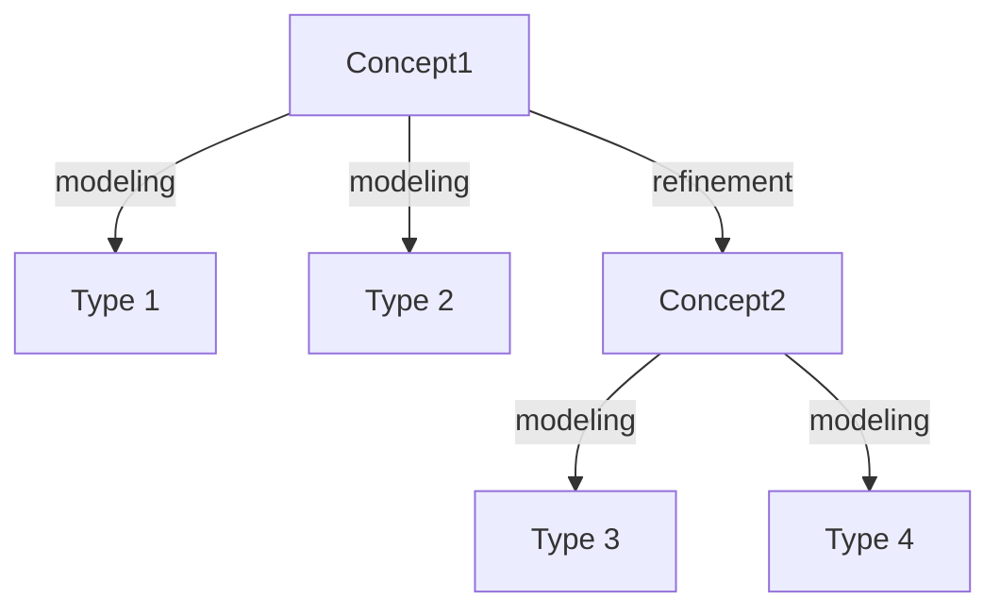

<center style="color:#C0C0C0;test-decoration:underover；">Refinement与Modeling示意</center>

### 总结

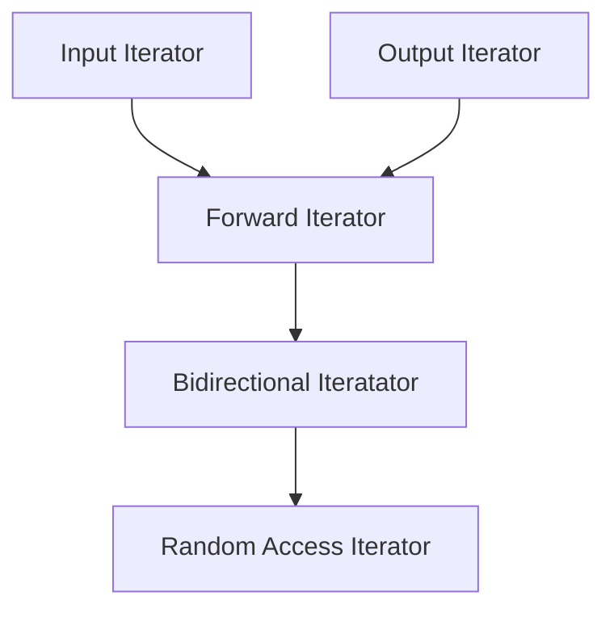

<center style="color:#C0C0C0">iterator concepts的有向无环图</center>


## 再论Iterators（迭代器 or 泛型指针）

### Iterator Traits（迭代器特征）与Associated Types（相关类型）

#### Value Type（数值类型）

##### C++的type inference（类型推论）机制

假设有一个泛型函数`f()`，需要一个类型为`I`的参数，而且需要一个临时变量，其类型为*I的value type*。虽然C++不允许写`typeof(*I)`，但是可以令`f()`成为一个单纯的转递函数(forwarding function)，并将所有工作委托给内部函数[f_impl()](#f_impl):

***f_impl***<a name="f_impl"></a>

```cpp
template<class I, class T>
void f_impl(I iter, T t)
{
    T tmp;					//T 是 I 的type
	.....
}

template<class T> inline void f(I iter)
{
    f_impl(iter,*iter);		//type inference
}
```

这个技巧既巧妙又实用。STL在某种场合下会使用这种技巧的变形。不幸的是，光这样还不够。C++的参数推导过程，只及与参数本身，不及与函数返回值。


##### 第二种方法——嵌套式类型声明

***也许可以考虑第二种方法：在iterator class内声明其value type***。举例来说，我们可以在[node_wrap iterator class](#node_wrap)中利用typedef新增一个类型：

```cpp
template<class Node> struct node_wrap
{
    typedef Node value_type;			//将Node声明为类型value_type
    Node* ptr;
    ...
};
```

如果类型 I 是个node_wrap，嵌套类型声明允许我们将 I 的value type写成`typename I::value_type`[^ 1]。这看起来就是我们想要的。


##### 第三种方法——iterator_traits

但其实不是。[第二个方法](#第二种方法——嵌套式类型声明)对于 iterator class倒还好，但是对于non-iterator class完全没有作用。如果 I 是`int*`，我们无法把`I::value_type`定义为int。光靠嵌套类型，会破坏iterator的原意——指针是[Random Access Iterator](#Random Access Iterators)的一个model，并且我们故意以指针作为其他iterators的样本。所以，不论iterators采纳什么条件，都必须满足指针。


我们可以增加一层间接性来解决这个问题。做法是定义一个辅助用的class, 

***iterator_traits***<a name="iterator_traits1"></a>

```cpp
template<class Iterator>
struct iterator_traits
{
    typedef typename Iterator::value_type value_type;
};
```

这样一来，我们就可以用这样的写法取用 iterator I 的value_type：

```cpp
typename iterator_traits<I>::value_type
```

这样似乎没有任何的改进，因为iterator_traits仍然假设它的template参数Iterator有一个嵌套类型。然而这的确是一个改进，因为我们可以利用*对某种template参数提供另一种定义*的方法，将iterator_traits特化(specialize)

***C++允许的特化方式***

C++允许template的***全特化***（full specialization，即为某种特定的类型，例如`int*`，另外提供一种定义）和 ***偏特化***（partial specialization，即提供另一个定义，这个新的定义也是模板定义）。


在本例中，我们需要针对每一种指针类型作出另一种定义，因此我们需要偏特化：<a name="iterator_traits2"></a>

```cpp
template<class T>
struct iterator_traits<T*>
{
    typedef T value_type;
};
```

最后，只需要考虑另外一个问题——constant iterator的value type是什么？根据[先前定义的iterator_traits](#iterator_traits1)，这个类型将是constant value type。而这绝对不会是我们想要的，毕竟如果我们用这个类型来申明一个临时变量，却无法更改它的值，这是没有意义的<a name="const_value_type"></a>。因此，我们也需要为constant value type设计一个偏特化的模板：<a name="iterator_traits3"></a>

```cpp
template <class T>
struct iterator_traits<const T*>
{
    typedef T value_type;
};
```


##### 应用——sum_nonempty<a name="sum_nonempty"></a>

```cpp
template<class InputIterator>
typename iterator_traits<InputIterator>::value_type
sum_nonempty(InputIterator first, InputIterator last)
{
    typename iterator_traits<InputIterator>::value_type result = *first++;
    for( ; first != last; ++ first)
        result += first;
    return result;
}
```


##### 总结

如果 I 是Iterator（当然包括Input Iterator的所有refinements），那么`iterator_traites<T>::value_type`必须是 I 的value type。***换言之，当你定义新的iterator class时，你必须确定你的class能够支持iterator_traits。最简单的方法便是：总在你的class中以嵌套类型定义value_type。这使你不需要显式地调用iterator_traits，而是使用程序库内的iterator_traits。如果因为某种原因，使你无法或不方便使用现有的iterator_traits，你可以针对你的class，将iterator_traits特化。***


#### Different Type（差距类型）

> 如果 I 是Random Access Iterator的一个model。p1与p2是类型 I 的值(value)，那么`p2 - p1`便是p1到p2的距离。如果我们在程序中用到这个距离，我们必须知道其类型。如果 I 是指针，答案很简单。其类型为`ptrdiff_t`[^ 2]。
>
> 由这个启发，我们可以猜想一种可能的解决方法——令`p2-p1`的返回类型永远是ptrfidd_t
>
> 这样的解决方法虽然简单，却相当受限。对于文件操作而言，经常出现iterator range的区间太大，以至于ptrdiff_t不够存储区间的个数。
>

因此，对于一般的Random Access Iterator，`p2-p1`这个表达式应该返回某个带正负号的整数类型，我们称之为***iterator的difference type***。

所有的Input Iterator都有difference type。当我们写下`p2-p1`时，我们所要做的就是计算range[first, last)内的元素个数，这对于各种Input Iterators都是妥当的做法。（但对于Output Iterator来说，就完全不需要）

正如value type一样，一些算法在操作iterator ranges时必须取用iterator的difference type。其中最间的算法当推count.

***count***<a name="count"></a>

```cpp
/*
 * 计算某值x出现于range中的次数。
 * 对于为什么要区分value_type和difference_type就有了明显的解释
 * 对于int类型的数据来说，Iterator的value_type和difference_type都是int，看上去无关紧要
 * 但是对于其他类型的数据来说，例如double，其value_type就是double，但是其difference_type还是int
 */
template<class InputIterator, class T>
typename iterator_traits<InputIterator>::difference_type
count(InputIterator first, InputIterator last, const T& x)
{
    typename iterator_traits<InputIterator>::difference_type n = 0;
    for( ; first != last; ++first)
    {
        if(*first == x)
        {
            ++n;
        }
    }
    return n;
}
```

在STL的历史上，当初引入iterator_traits的主要动机之一，就是为了提供一个机制，以声明count的返回值


#### Reference Type和Pointer Type

所谓Reference Type，是用来指向某个内存位置。如果p是一个forward Iterator，指向类型为T的欧对象，那么表达式*p不不能只返回类型为T的对象，它必须返回一个lvalue（左值）。

如果p是一个mutable iterator，而其value type为T，正常情况下，*p的类型应该是T&。同样道理，如`p`是个constant iterator，`*p`的类型应该是const T&。

***一般而言，`*p`的类型并不是p的value type，而是p的所谓的reference type***

如果我们能够返回一个lvalue，代表p所指的对象，那么我们一定也有什么东西，可以代表该对象的地址——也就是说，我们可以返回一个指针，指向这个对象。

***也就是说，[node_wrap](#node_wrap)中的reference type是Node&，而pointer type是`Node*`***


#### 算法的处理与Iterator Tags

***三种不同定义的advance函数——advance(p,n)，将p向前移动n次***

针对三种不同的iterator，有三种不同的advance函数定义：一种针对Input Iterators，一种针对Bidirectional Iteratos，另一个针对Random Access Iterators

***advance_II***<a name="advance_II"></a>

```cpp
template<class InputIterator, class Distance>
void advance_II(InputIterator& i, Distance n)
{
    for( ; n > 0; --n, ++i) {}
}
```

***advance_BI***<a name="advance_BI"></a>

```cpp
template<class BidirectionalIterator, class Distance>
void advance_BI(BidirectionalIterator& i, Distance n)
{
    if(n >= 0)
        for( ; n > 0; --n, ++i) {}
    else
        for( ; n < 0; ++n, --i) {}
}
```

***advance_RAI***<a name="advance_RAI"></a>

```cpp
template<class RandomAccessIterator, class Distance>
void advance_RAI(RandomAccessIterator& i, Distance n)
{
    i += n;
}
```

在这三个版本之中，我们应该选择哪个作为iterator的基本要素呢？答案是没有真实适合的。我们真正需要的是某种可以结合以上三个版本的方法。我们可以写成这样：

```cpp
template<class InputIterator, class Distance>
void advance(InputIterator& i, Distance n)
{
    if(is_random_access_iterator(i))
        advance_RAI(i,n);
    else if(is_bidirectional_iterator(i))
        advance_BI(i,n);
    else
        advance_II(i,n);
}
```

当然，我们不能这样实现advance，因为运行期才做选择实在是太慢了。我们必须在编译器就选择版本，我们真正要尝试的是将某些东西更加一般化。——***函数重载（overloading）***

C++语言并未直接支持*对concept进行重载*，意即，并没有定义Input Iterator等等。但如果我们能够找出一种*以C++类型系统（type system）来表示concepts*的方法，我们就能够以一般的*函数重载*来模拟*concepts重载*

第一步，为每一个iterator concept定义一个专属类型，作为tag（标签）之用。我们不必在乎这些类型实际上是什么，只需要知道他们独一无二。

第二步，将三个advance函数进行重载，并以上述的标签类型（tag types）作为重载的识别凭借。

***advance***<a name="advance_overload"></a>

```cpp
template<class InputIterator, class Distance>
void advance(InputIterator& i, Distance n, input_iterator_tag)
{
    //实现代码同advance_II
}

template<class ForwardIterator, class Distance>
inline void advance(ForwardIterator& i,Distance n,forward_iteartor_tag)
{
    advance(i, n, input_iterator_tag);
}

template<class BidirectionalIterator, class Distance>
void advance(BidirectionalIterator& i, Distance n,  bidirectional_iterator_tag)
{
    //实现代码同advance_BI
}

template<class RandomAccessIterator, class Distance>
void advance(RandomAccessIterator& i, Distance n, random_access_iterator_tag)
{
    //实现代码同advance_RAI
}
```

最后，只需要写一个上层函数，来调用重载后的advance。这个函数需要两个参数：iterator i 和距离 n。它将这两个参数传给advance，并加上第三个参数：上述的五个tag types之一。因此，上层函数必须有能力推导出某个iterator type的tag type。

解决方法是，让灭个iterator拥有一个相应的iterator category type（迭代器分类类型）。iterator的category（分类），指的是*该iterator所隶属的最明确的concept所对应的tag type*。例如，`int*`是五种iterator的一个model，所以`int*`的分类是random_access_iterator_tag。

和其他Associated Type一样，iterator_category被定义为iterator_traits内的嵌套类型。这使得我们可以写出*必须依据iterator的分类而有不同设计的*advance函数以及其他算法：

***advance***<a name="advance"></a>

```cpp
template<class InputIter,class Distance>
inline void advance(InputIter& i, Distance n)
{
    advance(i, n, typename iterator_traits<InputIter>::iterator_category());
}
```

STL把这五个tag types定义为空类：

***tag types***<a name="tag_types"></a>

```cpp
struct input_iterator_tag {};
struct output_iterator_tag {};
struct forward_iterator_tag : public input_iterator_tag {};
struct bidirectional_iterator_tag : public forward_iterator_tag {};
struct random_access_iterator_tag : public bidirectional_iterator_tag {};
```

在设计的时候，采用了继承，这可以为设计函数的时候带来方便。例如我们写了四个版本的[advance](#advance_overload)，但只有三个有所区别。Forward Iterator的版本只是转调用Input Iterator的版本而已。如果让forward_iterator_tag继承自input_iterator_tag，我们就可以省略那个转调函数。

####  整合

iterator_traits的某些机制所蕴含的意义十分微妙而深远，不过实现起来却相当简单

##### iterator_traits<a name="iterator_traits"></a>

```cpp
template<class Iterator>
struct iterator_traits
{
    typedef typename Iterator::iterator_category 	iterator_category;
    typedef typename Iterator::value_type			value_type;
    typedef typename Iterator::difference_type		difference_type;
    typedef typename Iterator::pointer				pointer;
    typedef typename Iterator::reference			reference;
};

template<class T>
struct iterator_traits<T*>
{
    typedef random_access_iterator_tag	iterator_category;
    typedef T							value_type;
    typedef ptrdiff_t					difference_type;
    typedef T*							pointer;
    typedef T&							reference;
};

template<class T>
struct iterator_traits<const T*>
{
    typedef random_access_iterator_tag	iterator_category;
    typedef T							value_type;
    typedef ptrdiff_t					difference_type;
    typedef const T*					pointer;
    typedef const T&					reference;
}
```

##### 何时使用

只有当我们自己需要定义自己的iterators或算法的时候，才需要担心这个机制。当需要定义自己的算法的时候，以下两个条件可以用来判断是否需要用到iterator_traits：

1. 你必须返回某个值，或是声明临时变量，其类型与iterator的value type / difference type / reference type / pointer type一致
2. 你的算法类似[advance](#advance)——必须根据iterator的分类决定不同的实现方法。如果没有iterator_traits，就只能被迫在*一般化，却灭有效率*或是*有效率，或过渡局限*之间继续抉择

##### 定义iterator的注意事项

每当定义一个新的iterator class I ，就必须在这个class中定义五个嵌套类型：iterator_category / value_type / difference_type / pointer / reference，不然就得针对这个class I，显式地令iterator_traits为 I 特化，就好型iterator_traits显式地对指针进行特化一样。***定义五个嵌套类型的做法几乎总是比较简单***，尤其STL内含一个辅助类，***base class iterator***，让事情更好办

##### ***iterator***<a name="iterator"></a>

```cpp
template<	class Category,
			class Value,
			class Distance = ptrdiff_t,
			class Pointer = Value*,
			class Reference = Value&>
struct iterator
{
    typedef Category	iterator_category;
    typedef Value		value_type;
    typedef Distance	difference_type;
    typedef Pointer		pointer;
    typedef Reference	reference;
}
```

为了确保iterator_traits能够针对新的iterator class I 有适当的定义，最简单的做法就是让 I 继承iterator。base class iterator不含任何的member functions或member variables，所以继承它应该不会导致任何额外的开销。

#### 早期版本

> 没有iterator_traits，如何制作iterator traits

iterator_traits class是颇为晚近的发明，HP STL的原始版本并未包含。

早期的机制是提供一组查询函数：distance_type，value_type，iterator_category。每个查询函数只需要一个参数，也就是iterator，而这个iterator的某个特征就会由函数返回。

在早期的HP STL原始版本中，每个iterator type都必须提供这三个函数。如果想要定义新的iterator，确保这三个函数都有定义的最简单方法，就是令这个新的iterator class继承自前五个[base classes](#iterators)之一

### 定义新组件（New Components）

STL的设计允许我们加以扩充。

由于算法和iterator types都以iterator concept作为其接口，因此每当定义信的算法或新的iterator时，应该把iterator concepts视为一份清单。这份清单对于新的iterators而言，代表*应提供的机能*，对于新算法则表示*『假设已经存在的机能』*

***基本上，iterator必须做两件事：***

1. 它必须指向某物
2. 它必须能够遍历任何一个有效区间

一旦定义了`operator*`和`operator++`，通常剩下的iterator行为就很简单了

***你必须确定iterator被正确地定义为constant或是mutable***。

据个例子，[node_wrap class](#node_wrap)是个mutable iterator。*『const的正确性』*在C++中十分必要。C++所谓的const指针，能够避免不小心更改了不应该被更改的数据结构。当定义能够遍历某个航速句结构的iterators时，通常的做法是定义两个iterator，其中一个时constant，另一个时mutable。他们有着相同的value type，并允许从mutable转换为constant。

也许你认为没有必要。也许你认为像node_wrap这样的iterator可以同时承担constant和mutable两份责任。其实不然。有两个地方是可能的放置const的地方：

1. `const node_wrap<T>`

    这代表的是，iterator的指向不可被改变，但是iterator所指向的内容可以被改变，这并不符合我们的要求。

2. `node_wrap<const T>`

    虽然这样做，确实可以让其value type是const，但是iterator（即使是constant iterator）的value type不应该修饰为[const](#const_value_type)


#### ***以[node_wrap](#node_wrap)为例***

`mutable iterator class node_wrap<T>`的value type / reference type / pointer type分别是T / T& / T*。而`constant iterator class node_wrap<T>`的value type / reference type / pointer type分别是T / const T& / const T&。

尽管我们可以将mutable和constant的两个版本中相同的部分以template或者继承机制来解决，但为了区分这两个iterator class，我们确实需要分离这两个class——一个是constant，一个是mutable。

『constant版本』和『mutable版本』之间最重要的差异，就是其pointer type和reference type。

***node_wrap_base***<a name="node_wrap_base"></a>

```cpp
template<class Node, class Reference, class Pointer>
struct node_wrap_base
    : public iterator<forward_iterator_tag, Node,
					ptrdiff_t, Pointer, Reference>
{
	typedef node_wrap_base<Node, Node&, Node*>					iterator;
    typedef node_wrap_base<Node, const Node&, const Node*>		const_iterator;
    Pointer ptr;
                        
	node_wrap_base(Pointer p = 0) : ptr(p) {}
    node_wrap_base(const iterator& x) : ptr(x.ptr) {}
                        
    Reference operator*() const { return *ptr; }
    Pointer operator->() const { return ptr; }
                        
    void incr() { ptr = ptr->next; }
                        
    bool operator==(const node_wrap_base& x) const { return ptr == x.ptr; }
    bool operator!=(const node_wrap_base& x) const { return ptr != x.ptr; }
};
```

***node_wrap***<a name="mutable_node_wrap"></a>    

```cpp
template<class Node>
struct node_wrap : public node_wrap_base<Node, Node&, Node*>
{
    typedef node_wrap_base<Node, Node& Node*> Base;
    node_wrap(Node* p = 0) : Base(p) {}
    node_wrap(const node_wrap<Node>& x) : Base(x) {}
    node_wrap& operator++() { incr(); return *this; }
    node_wrap operator++(int) { node_wrap tmp = *this; incr(); return tmp; }
};
```

***const_node_wrap***<a name="const_node_wrap"></a>

```cpp
template<class Node>
struct const_node_wrap : public node_wrap_base<Node, const Node&, const Node*>
{
	typedef node_wrap_base<Node, const Node&, const Node*> Base;
	const_node_wrap(const Node* p = 0) : Base(p) {}
	const_node_wrap(const node_wrap<Node>& x) : Base(x) {}
	const_node_wrap& operator++() { incr(); return *this; }
	const_node_wrap operator++(int) { const_node_wrap tmp = *this; incr(); return tmp; }
};
```

其实单单一个base class node_wrap_base几乎就已经足够。我们从中衍生出两个类，而非单单只提供base class，唯一的真正的理由是，撰写`node_wrap<T>`比撰写`node_wrap_base<T, T&, T*>`方便的多


#### Iterator Adapters

#### 定义iterator时的建议

#### 定义算法时的建议

### 总结

STL的中心特性是『作用于range之上的泛型算法』


## Function Objects

### 将线性查找一般化

在[find()](#find)之中，我们已经将两种东西参数化：

1. 查找对象的类型
2. 这种对象在数据结构中的组织方式

为了全面一般化，我们还需再明确一件事：如何判断找到了正确的元素。这引出了另一个新算法find_if：

***find_if***<a name="find_if"></a>

```cpp
template<class InputIterator, class Predicate>
InputIterator find_if(InputIterator first, InputIterator last, Predicate pred)
{
    while(first != last && !pred(*first))
        ++first;
    return first;
}
```

算法find_if非常类似find。但显而易见的是，它比find更加一般化。

在find_if中，测试条件并非被声明为一个函数指针，而是声明为一个template参数，此即所谓的***function object***，或称为***functor***（二者同义）。换言之，***『pred是一种可以像函数一样被调用的东西』***


#### ***最简单的 function object***

最简单的function object当推一般的函数指针（function pointer）。例如：

***is_even***<a name="is_even"></a>

```cpp
bool is_even(int x) { return (x & 1) == 0; }
```

如此，便可以将is_even指针当作引数，传入find_if：

```cpp
find_if(f, L, is_even)
```

在这个例子中，C++会执行类型推导（***type deduction***），将`bool (*)(int)`判定为template参数Predicate


#### ***不一定非函数指针不可***

function call操作符 operator() 可以被重载，所以只要某各类型具有妥善定义的operator()，就可以将这类类型的对象传给find_if当作参数。

例如，可以将上面那个例子改变为class，而不是一个函数：

***even***<a name="even"></a>

```cpp
template<class Number>
struct even
{
    bool operator()(Number x) const { return (x & 1) == 0; }
};
```

我们几乎能够像使用函数is_even一样是使用 class even。如果要在某个range中寻找第一个偶数，可以这么写：

```cpp
find_if(f, l, even<int>());
```

这里的`even<int>()`看上去很奇怪，理由很简单：我们需要传递的是这个类的一个对象，所以我们应当调用构造函数


#### ***进一步使用***

Function object并不局限于这种简单的形式。它可以像一般的类一样拥有成员函数和成员变量。也就是说，可以利用function objects来表现『具有局部状态(local state，这里的局部与局部变量的意思相同)的函数』

***last_name_is***<a name="last_name_is"></a>

```cpp
struct last_name_is
{
    string value;
    last_name_is(const string& val) : value(val) {}
    bool operator()(const Person& x) const 
    {
        return x.last_name == value;
    }
}
```

调用方法：

```cpp
find_if(first, last, last_name_is("Smith"))	
//last_name_is("Smith")是调用opertor()函数，而在传参时的last_name_is("...")则是带参构造
```

像last_name_is这样的类，便是一个完全一般化的function object。


### Function Object Concepts（函数对象概念）

到现在一共出现了三个function objects: [is_even](#is_even),[even](#even),[last_name_is](#last_name_is)，除了它们都可以『像函数一样被调用』，它们的相同点很少。

很显然，对于任何function object concept的基本条件只是：***如果 f 是一个function object，我们可以调用f( )***


#### 单参（Unary）与双参（Binary）Function Objects

对于之前的三个例子来说，我们都只能传递一个参数。function objects并非只能单参传递，这只取决于算法需要我们怎样传递。我们能够以『单一参数的function object』来对[find](#find)一般化，同样地，我们可以用『多个参数的function object』操作

***adjacent_find——查找相邻的相同元素***<a name="adjacent_find"></a>

```cpp
template<class FrowardIterator, class BinaryPredicate>
ForwardIterator adjacent_find(ForwardIterator first, ForwardIterator last, BinaryPredicate pred)
{
    if(first == last)
        return last;
    ForwardIterator next = first;
    while(++next != last)
    {
        if(pred(*first, *next))
        {
            return first;
        }
        first = next;
    }
    return last;
}
```


有的算法使用的单一参数的function object，有的使用两个参数的，有时不需要参数。因此，基本的function object concepts是General，Unary Function，和Binary Function。


#### Predicates和Binary Predicates

就目前为止，所有的function objects都是用来测试某个条件是否成立。但是，Function Objects其实是非常一般化的概念，它们可以将任何种类的行为参数化。

但是，『返回布尔值』的function object特别重要——它比完全一般化的function objects更常被使用。

『单一参合苏并返回true或者false』的function objects，称为***Predicate***，这是Unary Function的一个强化(refinement)。同样的道理，***Binary Predicate***是Binary Function的一个强化。


#### 相关类型（Associated Types）

***所谓『Function Object的相关类型』，是指『其参数与其返回值的类型』***。Generator具有一个相关类型（即返回类型），Unary Function具有两个相关类型（其参数类型与返回类型），Binary Function具有三个（两个参数类型，返回类型）

和iterator一样，有时候取用相关类型是有必要的。面对iterator，我们引入了[iterator_traits](#iterator_traits)来解决这个问题。面对function object，我们的解决方法也类似。同时，就像iterator一样，我们也定义了两个空的基类`unary_function`和`binary_function`，其中都只有一些typedef。

***unary_function***<a name="unary_function"></a>

```cpp
template<class Arg, class Result>
struct unary_function
{
    typedef	Arg		argument_type;
    typedef	Result	result_type;
};
```

***binary_function***<a name="binary_function"></a>

```cpp
template<class Arg1, class Arg2, class Result>
struct binary_function
{
    typedef Arg1	first_argument_type;
    typedef Arg2	second_argument_type;
    typedef Result	result_type;
};
```

修改`even<T>`的方法有两种，一种是显式地声明两个相关类型，一种是继承`unary_function`。

继承`unary_function`并不是一个完整的解决方案，因为它不能适用于函数指针。我们可以像解决iterator的类似问题一样解决这个问题。我们可以定义一个trait class，名为unary_function_traits，然后为其定义一个『针对函数指针』的局部特殊版本(partial specialization)。

但是，STL并没有提供这样的类，理由是，虽然function objects很重要，但是它们并不是到处都存在，很多运用了function object的算法，并不会需要知道取用的参数类型和返回类型，所以没有必要每一个function object都提供那些类型的取用方法。

##### *function objects*与*adaptable function objects*

- 一个function object会有参数类型和返回类型，但是程序并不需要知道那些类型
- 一个adaptable function object会指明参数和返回类型，它会内涵嵌套的typedef，所以程序中可以指定并使用那些类型
    - 意即，如果类型`F1`是`Adaptable Unary Funciton`的一个model，则它必须定义有`F1::argument_type`和`F1::result_type`

  STL提供两个基类`unary_function`和`binary_function`，这使得定义Adaptable Unary Function和Adaptable Binary Function的工作简化许多

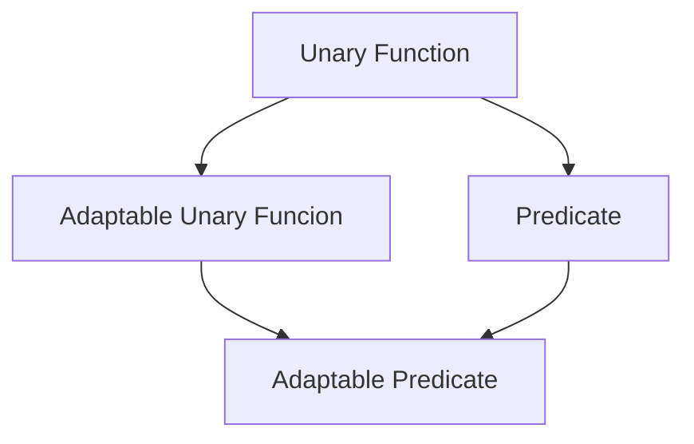

#### Function Object Adapters（函数对象适配器）

***adapter***是一种『将某种接口转换成另一种接口』的组件。

function object adapters出现的理由如下：

- 函数的组合（function composition）是数学与计算机科学的基本操作行为
- 定义众多特殊用途的function object是令人厌烦的。而只需要少量的function object adapter便可以『以简御繁』
- 有很多非常有用的function object adapter都很容易定义


***引入***

举个例子，我们可以这样寻找某个整数区间的第一个偶数：

```cpp
find_if(f, l, even<int>)
```

但如果我们还想要寻找区间上的第一个奇数，再写另一个function object `odd<T>`会显得有些愚蠢。奇偶的测试是互补的，所以一旦定义好其中一个，就不必再定义另外一个。我们应该复用代码，而不是反复撰写。

***解决***

解决的的方法是利用一个已经由STL提供的function object adapter:

***unary_negate***<a name="unary_negate"></a>

```cpp
template <class AdaptablePredicate>
class unary_negate
{
private:
    AdaptablePredicate pred;
public:
    typedef typename AdaptablePredicate::argument_type	argument_type;
    typedef typename AdaptablePredicate::result_type	result_type;
    unary_negate(const AdaptablePredicate& x):pred(x) {}
    bool operator()(const argument_type& x) const
    {
        return !pred(x);
    }
};
```

如果f是类型F的一个predicate，那么`unary_negate<F>(f)`是『f的反相（negation）』的一个predicate。也就是说，当且仅当`f(x)`是false，并且f_neg是f的predicate，那么`f_neg(x)`一定是true。


`unary_negate` adapter 的唯一问题是，表达式`unary_negate<F>(f)`没必要这么累赘。这的确很啰嗦，因为我们必须提供function object `f` 和 type `F` 。纯粹为了方便，我们可以定义一个辅助函数，使`unary_negate` object 的产生得以简化许多：

```cpp
template<class AdaptablePredicate>
inline unary_negate<AdaptablePredicate>
not1(const AdaptablePredicate& pred)
{
    return unary_negate<AdaptablePredicate>(pred);
}
```

最后，我们终于能够以如下写法，找寻整个整数区间的第一个奇数：

```cpp
find_if(first, last, not1(even<int>()))
```


***传递函数指针***

如果需要将一般函数指针传递给function object adapter，可以利用`pointer_to_unary_function`将函数指针转换为Adaptable Unary Function。（**注意**，只有在你需要将函数指针视为一个*Adaptable Unary Function*时，才需要动用`pointer_to_unary_function`）

***pointer_to_unary_function***<a name="pointer_to_unary_function"></a>

```cpp
template<class Arg, class Result>
class pointer_to_unary_function : public unary_function<Arg, Result>
{
private:
    Result (*ptr)(Arg);
public:
    pointer_to_unary_function() {}
    pointer_to_unary_function(Result (*x)(Arg)) : ptr(x) {}
    Result operator()(Arg x) const { return ptr(x); }
};

template<class Arg, class Result>
inline pointer_to_unary_function<Arg, Result>
ptr_fun(Result (*x)(Arg))
{
    return pointer_to_unary_function<Arg, Result>(x);
}
```

STL还定义有其他数个function object adapters。其中最重要的是：

1. `binder1st`与`binder2nd`可将Adaptable Binary Function转换为Unary Function
2. `men_fun_t` adapter及其变形，它们除了『作用于member function而非全局函数之外』，非常类似`pointer_to_unary_function`
3. `unary_compose`，能将两个function objects `f`和`g`转换成单一一个function object `h`，使得`h(x) = f(g(x))`


##### ***应用***

```cpp
#include<iostream>
#include<iterator>
#include<cmath>

#define READ true					//before compile, set READ as false.

using namespace std;

/* This file is a test to test function object and its adapter
 * class `even` is the function object itself, with operator(). The most important part is the `const` key word 
 * class `unary_negate` is the funcion object adapter itself. It use `even` to do the oppsite thing.
 * inline function `not1` is the STL function, which provides a easier way to call function object adapter.
 */

//function object class
template<class Number>
struct even
{
	typedef Number argument_type;
	typedef Number result_type;
	bool operator()(const Number& num) const { return num % 2 == 0; }
};

//function object adapter declared in STL
//use Function Object `even` to judge odd number
//for a Function Object Adapter, the Function Object is the Predicate 
#if READ

template<class AdaptablePredicate>
class unary_negate
{
private:
	AdaptablePredicate pred;
public:
	typedef typename AdaptablePredicate::argument_type	argument_type;
	typedef typename AdaptablePredicate::result_type	result_type;
	unary_negate(const AdaptablePredicate& x) : pred(x) {}				//constructor
	bool operator()(const argument_type& x) const
	{
		return !pred(x);
	}
};

#endif

//not1, which has been declared in STL, provides a easier way to call unary_negate
#if READ

template<class AdaptablePredicate>
inline unary_negate<AdaptablePredicate>
not1(const AdaptablePredicate& pred)
{
	return unary_negate<AdaptablePredicate>(pred);
}

#endif


//find_if in STL
//traverse in the range until *first satisfies the condition
template<class InputIterator, class Predicate>
InputIterator find_if(InputIterator first, InputIterator last, Predicate pred)
{
	while(first != last && !pred(*first))
	{
		++first;
	}
	return first;
}

//------------------------------------------------------------------------------------------------------
//in the following part, it shows how to transfer a function pointer to function object adapter

//the basic function
bool is_even(int num)
{
	return (num % 2 == 0);
}


//declared in STL
//transfer the function  to function object adapter
#if READ

template<class Arg, class Result>
class pointer_to_unary_function : public unary_function<Arg, Result>
{
private:
    Result (*ptr)(Arg);											//define function pointer
public:
    pointer_to_unary_function() {}								//constructor
    pointer_to_unary_function(Result (*x)(Arg)) : ptr(x) {}		//construct a function into a function object
    Result operator()(Arg x) const { return ptr(x); }			//predicate
};

//a easier way to use adapter
template<class Arg, class Result>
inline pointer_to_unary_function<Arg, Result>
ptr_fun(Result (*x)(Arg))
{
    return pointer_to_unary_function<Arg, Result>(x);
}

#endif

int main()
{
	int array[10];
	for(int i = 0; i < 10; i++)
	{
		array[i] = pow((i + 1),2);
	}
	
    //use function object
    cout << "-----Use function object-----" << endl;
	cout << *(find_if(array, array + 10, even<int>()))<<endl;
    
    //use function object adapter
	//the first way to use function object adapter
    /*
    unary_negate<even<int>>(even<int>()), here, the first even<int> is F
    the second `even<int>()` is constructor, which is f
    */
    cout << "-----Use function object adapter-----" << endl;
    cout << "The first way: " << *(find_if(array, array + 10, unary_negate<even<int>>(even<int>()))) << endl;
	//the second way to use funcion object adapter
	cout << "The second way: " << *(find_if(array, array + 10, not1(even<int>()))) << endl;
	
    //use function pointer
	cout << "-----Use function pointer-----" << endl;
    cout << "The first way: " <<*(find_if(array, array + 10, pointer_to_unary_function<int, bool>(is_even))) << endl;
    cout << "The second way: " <<*(find_if(array, array + 10, ptr_fun<int, bool>(is_even))) << endl;
	return 0;
}

```


##### 预定义的Function Objects

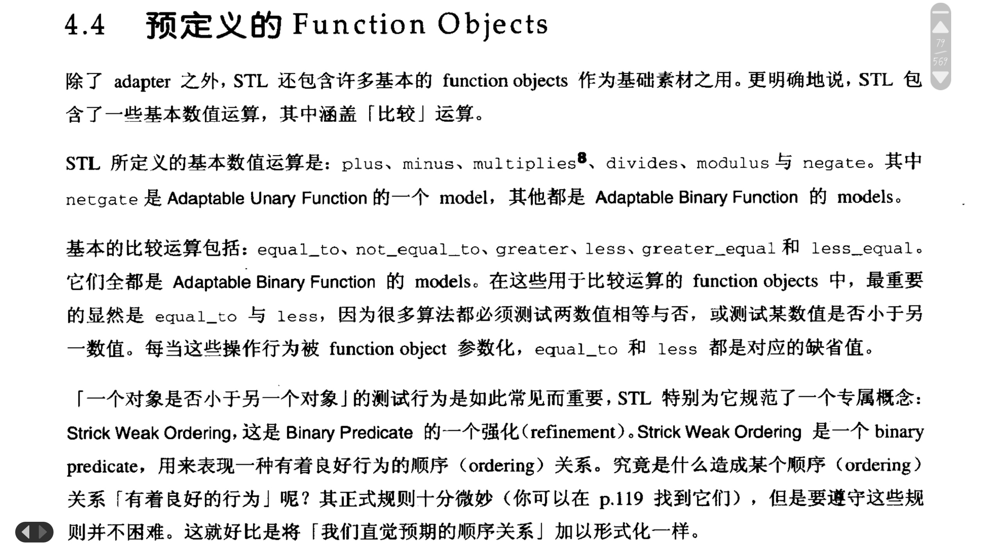


##### 总结

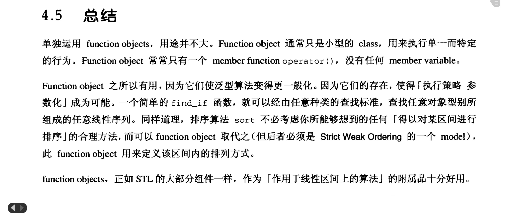


## Containers——容器

### 一个简单的Container——以数组为例

***优点***

C/C++数组有一些明显的优点，而且满足很多用途：

- 数组本质上遵循range概念
- 数组可以被分配在栈(stack)之内。这是一项优点，因为它比较快，而且不必检查是否分配成功
- 数组很有效率，不许哟呵通过多个间接动作就可以访问某一元素。取用某个元素只需要及少量的机器码
- 数组具有固定大小，并且在编译器就可以知道。数组的操作不可能导致『重新改变大小』，数组的使用者也不需要为『数组的大小有可能改变』而负责
- 数组具有简单的初始化方法，但同样的语法不能运用于任何稍微复杂的container classes

***缺点***

- 尽管数组具有固定大小，但应用程序必须明白记录数组的大小，因为数组没有`size()`这个member function
- 每个数组都有『指向第一个元素』的iterator，以及『past-the-end』的iterator，但没有方法可以直接找到*past-the-end iterator*。必须先找到指向开头的iterator，再利用iterator的运算获得数组结尾
- 无法直接复制数组。数组没有copy constructor或assignment操作符。如果想要复制数组，则必须自己写个循环来处理
- 无法将数组以by value方式传入某个数组。事实上，很难将整个数组传入函数。事实上，根本很难将整个数组传入函数。每当在表达式中取用某个数值时，真正取用的其实只是『指向该数组的第一个元素』的指针。


#### 一个Array Class

我们很容易就能定义一个简单的block class，让它保留C数组的所有有用的特点，并剔除主要的缺点

```cpp
template<class T, size_t N>
struct block
{
    typedef T					value_type;
    typedef value_type*			pointer;
	typedef const value_type* 	const_pointer;
    typedef value_type&			reference;
    typedef const valye_type&	const_reference;
    typedef ptrdiff_t			difference_type;
    typedef size_t				size_type;
    typedef pointer				iterator;
    typedef const_pointer		const_iterator;
    
    iterator begin() { return data; }
    iterator end() { return data + N; }
    const_iterator begin() const { return data; }
    const_iterator end() const { return data + N; }
    reference operator[](size_type n) { return data[n]; }
    const_reference operator[](size_type n) const { return data[n]; }
    size_type size() const { return N; }
    
    T data[N];
};
```

由于block具备两种iterator，而每个iterator具有value type，difference type，reference type，pointer type，或许会认为我们应该针对block定义出八种嵌套类型。这样的想法正确，但是没有必要

1. 这八种类型中某些是相同的，没有必要去重复定义。例如iterator 和 const_iterator的value type都是T
2. size type并非直接与block的iterator有关。『***difference type几乎总是ptrdiff_t，size type几乎总是size_t***』。

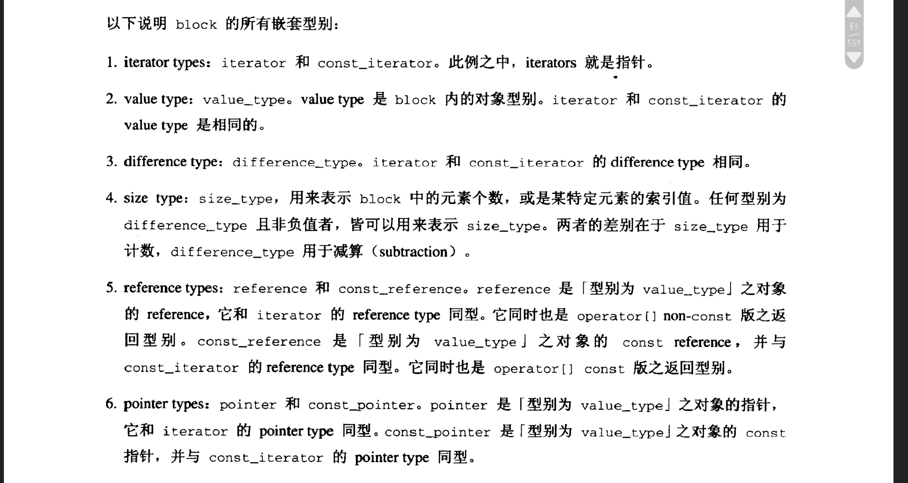


#### 它是如何运作的

block class的设计非常简单，但是却有些非同寻常：

1. block的元素个数是其类型的一部分。`block<int, 10>`与`block<int, 12>`是完全不同的类型。换句话说，block的元素个数是该block的一个template参数，而不是可以在constructor中指定的值
2. block遗漏了很多东西：constructor，destructor，assignment操作符。这或许不是那么令人惊讶，因为由编译器产生的每一个成员函数的缺省版本都不差。比较不同寻常的是，block甚至没有任何的public声明或者private声明。而由于block本身是一个struct，所以其所有成员，包括数组data自身，都是public
    - 这似乎违反封装概念，不过这样的设计在这里不会造成的伤害，并且这样的设计有利于客户独立更改data的元素
    - 令data成为public，除了『不会造成任何的伤害』以外，还有一个特别重要的理由。***在C++中，你可以像对 数组做初始化一般地将struct初始化（也就是在一对大括号中放置初始值）***。不过有一项特殊的限制：***struct不能拥有聚合类型*[^ 3]**。
    - 如此这般，就可以通过这样的方式声明一个block：`block<int, 6> A = {1, 4, 2, 8, 5, 7};`


#### 最后的讨论

我们还可以对block再做一些加强，它们或许并为严格符合原先的目标，但是可以让block更方便用于某些场景

1. 就目前的block而言，它已经是两个概念——***Assignable***，***Default Constructible***的model，但是它还不是***Equality Comparable*** 或者 ***LessThan Comparable***的model。意思是，如果x和y是两个类型为`block<T,N>`的对象，你不能写`x==y`或者是`x < y`

    我们很容易以全局函数的方式实现operator==和operator<

    ```cpp
    template<class T, size_t N>
    bool operator==(const block<T,N>& x, const block<T,N>& y)
    {
        for(size_t n = 0; n < N; ++n)
        {
            if(x.data[n] != y.data[n])
            {
                return false;
            }
        }
        return true;
    }
    
    template<class T, size_t N>
    bool operator<(const block<T,N>& x, const block<T,N>& y)
    {
        for(size_t n = 0; n < N; ++n)
        {
            if(x.data[n] < y.data[n])
            {
                return true;
            }
            else if(x.data[n] > y.data[n])
            {
                return false;
            }
        }
        return false;
    }
    ```

    严格来说，这两个函数并不能保证`block<T,N>`是『Equality Comparable和LessThan Comparable的model』。意思是，当且仅当`T`是『Equality Comparable和LessThan Comparable的model』的时候，`block<T,N>`才是对应的model。当然，也可以使用不是『Equality Comparable和LessThan Comparable的model』的T——前提是永远不要试图比较这样的两个block。
    
2. 我们还可以提供另一种iterator。我们可以多定义两个成员函数，`rbegin()`和`rend()`，返回反向的iterator。当然，我们需要两个不同版本的`rbegin()`和`rend()`，用来返回*constant iterator*和*mutable iterator*。

3. 还有一些member function适合放入block，虽然它们并非必要。

最终，我们有了一个完整的block版本。即使是带着所有改进（虽然有的改进对于block来说并不是很有意义，但是为了其未来的泛化还是加上），比起STL中的数据结构来说，它还是非常简单。不过，像block这样的class，往往是实用上的最佳选择。

***block***<a name="block"></a>

```cpp
template<class T, size_t N>
struct block
{
	typedef T 					value_type;

	typedef value_type*			pointer;
	typedef const value_type	const_pointer;
	typedef value_type&			reference;
	typedef const value_type&	const_reference;

	typedef ptrdiff_t			difference_type;
	typedef size_t				size_type;

	typedef pointer 			iterator;
	typedef const_pointer		const_iterator;

	iterator begin() { return data; }
	iterator end() { return data + N; }

	const_iterator begin() { return data; }
	const_iterator end() { return data + N; }

	typedef reverse_iterator<const_iterator>	const_reverse_iterator;
	typedef reverse_iterator<iterator>			reverse_iterator;

	reverse_iterator rbegin() { return reverse_iterator(begin()); }
	reverse_iterator rend()	{ return reverse_iterator(end()); }

	const_reverse_iterator rbegin() const
	{
		return const_reverse_iterator(end());
	}
	const_reverse_iterator rend() const
	{
		return const_reverse_iterator(begin());
	}

	reference operator[](size_type n) { return data[n]; }
	const_reference operator[](size_type n) { return data[n]; }

	size_type size() const { return N; }
	size_type max_size() const { return N; }
	bool empty() const { return N == 0; }

	void swap(block& x)
	{
		for(size_t n = 0; n < N; ++n)
		{
			std::swap(data[n], x.data[n]);
		}
	}
};

template<class T, class N>
bool operator==(const block<T,N>& x, const block<T,N>& y)
{
	for(size_t n = 0; n < N; ++n)
	{
		if(x.data[n] != y.data[n])
		{
			return false;
		}
	}
	return true;
}

tempalte<class T, class N>
bool operator<(const block<T,N>& x, const block<T,N>& y)
{
	for(size_t n = 0; n < N; ++n)
	{
		if(x.data[n] < y.data[n])
		{
			return true;
		}
		else if(x.data[n] > y.data[n])
		{
			return false;
		}
	}
	return false;
}
```


### Container Concepts

为了抽象出这个概念，我们需要区分我们为block设计的这些功能中，哪些是我们单独为它设计的，哪些是所有的container class普遍应该有的。

block具有三个主要的功能性：

1. 它包含元素
2. 它提供访问那些元素的方法
3. 它支持『让block成为***regular type***』所必需的一些操作行为


#### 元素的容纳（Containment of Elements）

1. 两个container不能重叠，同一个元素不能分属两个以上的container。
2. 元素的生命周期不能超越其所属的container。
3. container可以如同block一般拥有固定的大小，但其大小也可以改变

#### Iterators

有三种不同的方式可以访问block的元素：

1. block class定义了`iterator`和`const_iterator`，而block A的所有元素都包含于`range[A.begin(),A.end())`之中
2. 相对于`iterator`和`const_iterator`，`reverse_iterator`和`const_reverse_iterator`是反向的iterator类型
3. 如果n是一个整数，表达式`A[n]`返回第n个元素

在这三种方式中，第一种显然最为基本。第二种使用adapter——`reverse_iterator`和`const_reverse_iterator`自是如下式子的简单记法：

```cpp
reverse_iterator<iterator>
reverse_iterator<const_iterator>
```

同样的道理，表达式`A[n]`只是`A.begin()[n]`的记法，或者是`*(A.begin() + n)`的记法

*****

***关于mutable iterator和constant iterator的讨论***

在block所提供的元素访问方式中，真正重要的是，它定义了iterator types `iterator`和`const_iterator`，以及member function `begin()`和`end()`。***Iterator之于container的重要性，正如iterators之于算法的重要性一样。它们是算法和容器之间重要的接口***

所有的container都拥有iterator，block iterator的某些特性是一般化的，某些特性则专属于block：

1. block有两种不同的iterator type： iterator和const_iterator。

    事实上，不止block，所有的container都定义有iterator和const_iterator，以及member function `begin()`和`end()`。

    如果说const_iterator一定是一个constant iterator的话，很自然地我们会假设iterator一定是mutable iterator。但这样的假设是错误的。有时候，为了维护class的不可变动性，有必要限制或禁止对class的『写入』动作。

2. 类型iterator和const_iterator并不仅仅是iterator而已。它们是Random Access Iterator。

    『block的iterator是Random Access Iterator』这件事之所以重要，有两个原因：

    1. 它影响可以运用于block元素身上的算法种类：Random Access Iterator比其他种类的iterator支持更多算法
    2. 它直接影响block所提供的member function
        - `range[A.begin(),A.end())`合理的原因是，block的iterator是一种Input Iterator（[Output Iterator](#Output Iterators)并不一定支持）
        - `range[A.rbegin(),A.rend())`合理的原因是，block的iterator是一种Bidirectional Iterator。因为只有在iterator支持operator--的情况下，才能在这种iterator所形成的range上反向移动
        - 以`A[n]`来访问block元素，就是『随机访问』的意思——由于block拥有Random Access Iterator，因此这种形式访问元素是合理的


#### Containers的阶层架构（Hierarchy）

有的containers，例如block，可以并且应该提供Random Access Iterator。其他的container只需要提供Bidirectional Iterator或Forward Iterator就好。这暗示我们containers并不是单一的concept，而是多个不同的concepts。***我们可以根据containers所提供的iterator种类，来对container分类***

任何一个隶属于Container的类型，都定义有iterator和const_iterator，两者都属于Input Iterator。这两个类型可能相同。任何情况下，const_iterator一定是一个constant iterator，而且我们一定可以将iterator转换为const_iterator（除非类型一致，否则不能做逆向转换）。

每一个Container都拥有member function `begin()`和`end()`，而其所有元素都包含于`range[begin(),end())`

每一个Container也拥有一些辅助类型：`value_type`，`pointer_type`，`const_pointer_type`，`reference_type`，`const_reference_type`，`difference_type`和`size_type`。它们的定义只是为了方便，并非因为必要。除了size_type，它们都可以由iterator和const_iterator推导出来。

*****

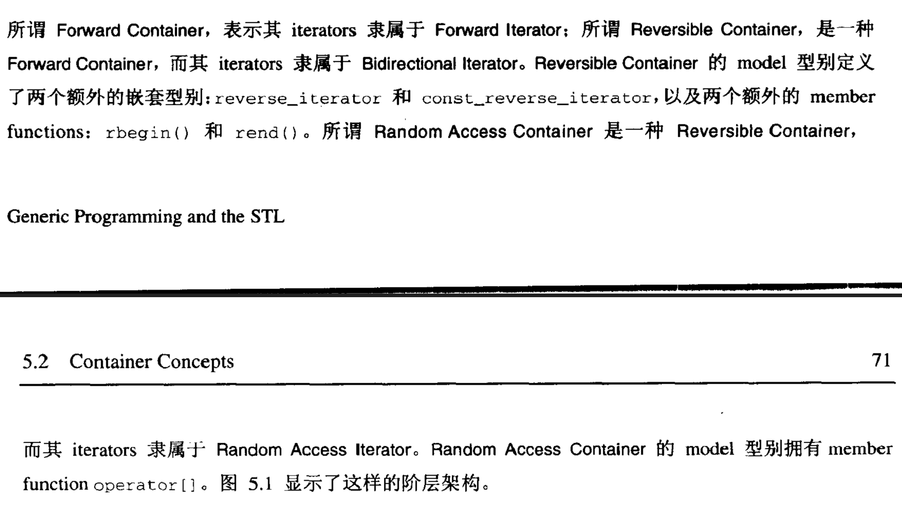

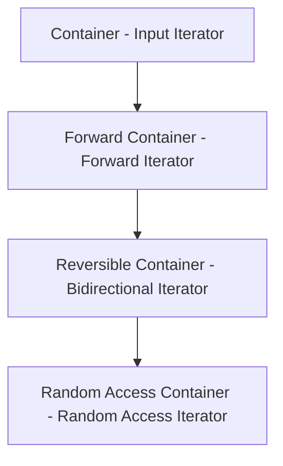

<center><strong><fontsize="5">Container concepts的阶层架构。每一个container concept之后的名称，是container的iterator类型</strong></center>

STL预定义的所有container class都是Forward Container，其中大多数甚至是Bidirectional Container。有一些像block之类的container class，则属于Random Access Container。


#### 最平淡无奇的Container

最简单的C++程序是一个不做任何事的程序：

```cpp
int main() {}
```

同样道理，最简单的STL container是一个实际上不包含任何东西的container。

所谓『最平淡无奇的container』， 其range永远为空，其大小永远为0：

***trivial_container***<a name="trivial_container"></a>

```cpp
template<class T>
struct trivial_container
{
	typedef T 					value_type;

	typedef value_type*			pointer;
	typedef const value_type*	const_pointer;
	typedef value_type&			reference;
	typedef const value_type&	const_reference;

	typedef value_type*			iterator;
	typedef const value_type*	const_iterator;
	typedef ptrdiff_t			difference_type;
	typedef size_t				size_type;

	const_iterator begin() const { return 0; }
	const_iterator end() const { return 0; }

	iterator begin() { return 0; }
	iterator end() { return 0; }

	size_type size() const { return 0; }
	bool empty() const { return true; }
	size_type max_size() const { return 0; }

	void swap(trivial_container&) {}
};
```

这个平淡无奇的container是处于好奇心才撰写的，正好展示了所有必须满足的container条件。不过它也有两个真正的用途：

1. 它满足Container的所有条件，因此可以被用来测试『以Container为参数』的泛型算法
2. 可以看到，STL container涉及大量『照本宣科的行为』。当你要撰写一个新的STL Container时，你会发现，以trivial_container为基础，会比从无到有方便许多。


### 大小可变的Container Concepts

STL定义两种大小可变的container： ***Sequence Container***和***Associative Container***。

#### Sequences（序列）

Sequence是Forward Container的一个强化（refinement），是一种最明显的大小可变的container。Sequence不会以某种规定来排列元素，它会以任何你所希望的顺序进行排列。

Sequence必须具有成员函数insert与erase。假设s是Sequence，p是『指向s内的某个元素』的iterator，`s.erase(p)`会移除并且删除元素。 `s.insert(p,x)`会将元素安插在iterator`p`之前。至于为什么是之前，是考虑到了p是past the end指针的情况。

尽管这两个成员函数非常简单，它们却有两个重要的问题：

- 在安插或删除元素的时候，对Sequence的其他元素造成什么影响？iterator所指向的元素会发生改变吗？
- `insert`与`erase`的复杂度如何？

这两个问题的答案相同：根据情况而定。

例如，STL包含三种Sequence class：`vector`，`list`和`deque`，其中主要差异在于它们所提供的iterator种类，iterator的无效语义（即指什么样的操作会导致之前获取的iterator无效）以及`insert`和`erase`的复杂度

以vector为例，它具有Random Access Iterator性质，并将元素存储在但已连续的内存区域内。`vector`类似`block`，但其大小可变。因此『安插』动作十分耗时，并且『安插动作』会使这个`vector`的其他iterators无效。

相较之下，`list`是以node为基础的container，其iterator属于Bidirectional Iterator。安插新元素到list中不涉及任何元素的偏移，也不会造成任何元素的无效。

##### 其他形式的insert与erase——函数重载

##### 安插(insertion)于开头（Front）与尾端（Back）

有的Sequence的尾插入 / 头插入速度非常快，例如vector / list。于是导出两个Sequence的强化（refinement）——Back Insert Sequence & Front Insert Sequence。

Front Insert Sequence具有三个特别的成员函数：（1）`front`，返回container中的第一个元素；（2）`push_front`在开头安插新的元素；（3）`pop_front`，删除第一个元素

Back Insert Sequence与之对应的三个函数是：（1）`back`；（2）`push_back`；（3）`pop_back`


##### 安插（Insertion）语义和覆盖（Overwrite）语义

> 讨论复制元素和插入元素值的区别
>
> 例如不能直接向vector中拷贝元素
>
> 解决方法：insert_iterator adapter或其它相关的adapters： front_insert_iterator或者back_insert_iterator


#### Associative Containers（关联式容器）

保证其元素会根据特定规则类排列——快速查询。

Associative Container是一种可变大小的container，可以高效率的查找『以key为基础』的元素。Associative Container的每一个元素都有相关联的key。只要给定key，就可以快速找寻匹配的元素。

Associative Container的基本操作行为是查询（lookup）/安插（insertion）/消除（erase）。当然也可以在Sequence中指向这些操作，但是有两个不同：（1）Associative Container显式地提供这些方法；（2）这些方法的效率更高，一般是
$$
O(log{\space N})
$$
Associative Container与Sequence相比更为复杂，很多东西也互不相同：

- Associative Container每一个元素都有key。和所有的container一样，Associative Container也有value type，但是它还有associated type，即key type。每一个类型为value_type的值，都与其类型为key_type的值相关联。

    value和key可以有很多关联方式，STL定义了两种Associative Container concepts：

    1. Simple Associative Container，其value_type和key_type相同。元素的key就是元素自身
    2. Pair Associative Container，其value_type的形式是`pair<const Key, T>`。Pair Associative Container的value是个pair，而其key则是这个pair的第一个字段

    之所以是`const key`也很好理解，元素可以被安插以及删除，但是不可以被更改

- Associative Container可不可以拥有两个同key不同的元素？

    如果是 **Multiple Associative Type**就可以，如果是 **Unique Associative Container**就不行

- 每个Associative Container内的元素都是根据key来排列。其至少有两个不同的强化概念，分别以不同的方式来组织元素。

    1. ***Hashed Associative Container***，根据hash table（散列表）来组织元素；其有一个嵌套类型，是一个function object，作为hash function（散列函数）
    2. ***Sorted Associative Container***，它的元素一定以key的升幂顺序排列；也具有一个function object嵌套类型——Binary Predicate，用来判断某个key是否小于另一个

以上三种差异具有正交性（orthogonal，可以互相组合而互不影响）

*****

和Sequence一样，Associative Container必须定义成员函数`insert`和`erase`。和Sequence的差别在于，Sequence的`insert`需要一个参数，指定安插位置，而Associative Container并不需要


### Allocators（配置器）

很多containers以动态方式分配内存（但非全部如此，例如block就不是）。

如果能够控制container的内存分配方式，有时候很有用。

Allocator并非Container需求条件的一部分。然而所有预定义的STL container class都允许以template参数指定其allocator。


### 总结

#### 我们应该使用什么样的container？

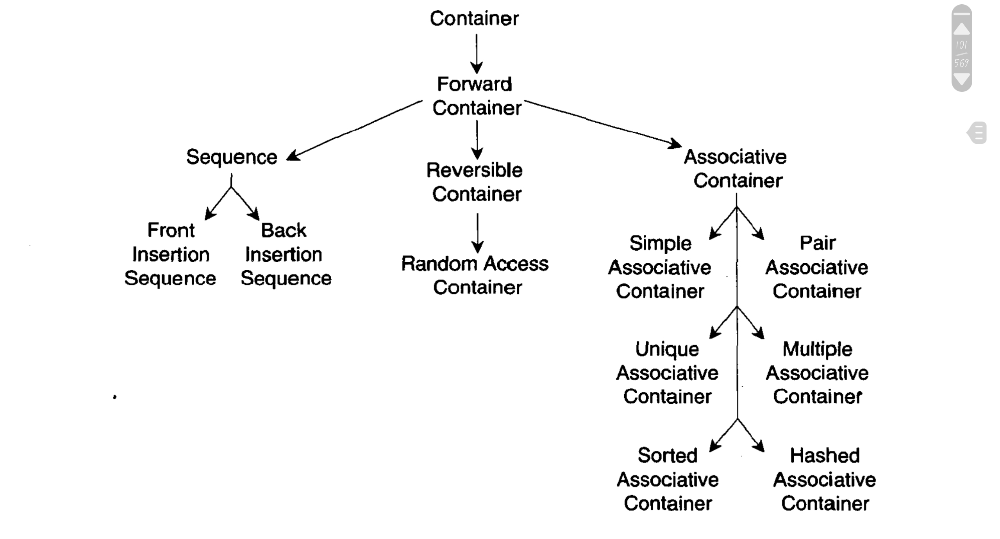

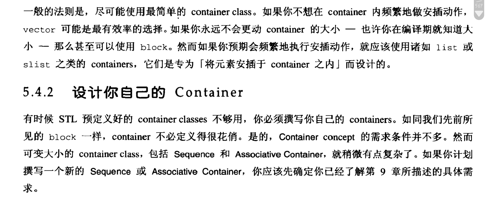


[^ 1]: 此处看似奇怪的关键字`typename`是因为当 I 是个template参数时，在这个template被具现化（instantiated）之前，编译器完全不知道 I 的任何信息。更明确的说，编译器无法知道`I::value_type`是类型名称，或是member function，抑或member variable。

[^ 2]: C和C++标准都定义有ptrdiff_t类型。其本身并非是某种新类型，而是以`typedef定义的带正负号整数的类型，通常是int或long`
[^ 3]: 满足下列条件的类型，在C++中被称为aggregate type（聚合类型） ，不能声明任何的constructor，也不能有任何的private或protected members。

