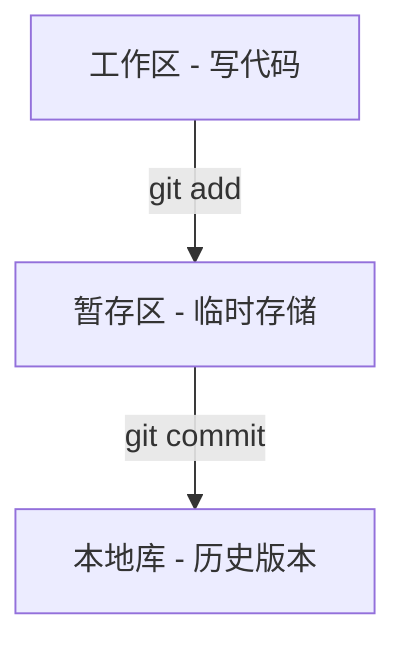

# Git&GitHub

## 理论部分

### Git结构



### Git和代码托管中心

代码托管中心:维护远程库

> -   局域网环境下
>     - GitLab服务器
> - 外网环境下
>     - GitHub
>     - 码云

#### 本地库和远程库

1. 团队内部协作

    ```mermaid
    flowchart TD;
    local1[发起者本地库] --push--> 远程库
    远程库 --pull--> local1
    远程库 --clone--> ocal2[协作者本地库] --push--> 远程库
    
    subgraph 代码托管中心
    	远程库
    end
    ```

    

2. 跨团队协作

    ```mermaid
    flowchart LR;
    local1[发起者本地库]
    local2[协作者本地库]
    local3[跨团队合作者本地库] 
    cloud2 --2. clone--> local3 --3. push--> cloud2
    cloud1 --pull--> local1 & local2
    
    subgraph 代码托管中心
    	cloud1[远程库 - 发起者]
    	cloud2[远程库 - 跨团队合作者]
    	
    	cloud1 --1. fork--> cloud2
    	cloud2 --4. pull request--> 审核 --5. merge--> cloud1
    	
    end
    ```

## Git命令行操作

### 本地库初始化

1. 初始化本地库

    ```shell
    git init
    ```

    注意,`.git`目录中存放的是本地库相关的子目录和文件,不要删除,也不要胡乱修改

2. 设置签名

    > 项目级别信息保存位置: `.git/config`
    >
    > 系统级别信息保存位值: `~/.gitconfig`

    1. 形式

        用户名:

        Email地址:

    2. 命令

        - 项目级别(仓库级别): 仅在当前本地库范围内有效

            ```shell
            git config user.name tom
            git config user.email goodMorning@qq.com
            ```

        - 系统用户级别: 登陆当前操作系统的用户范围

            ```shell
            git config --global user.name tom_glb
            git config --global goodMorning@qq.com
            ```

        - 级别优先级

            - **就近原则**: 项目级别优先于系统用户级别,二者都有时采用项目级别
            - 如果只有系统用户级别的签名, 就以系统用户级别的签名为准
            - ==二者都没有不允许==

    3. 作用: 区分不同开发人员的身份

    4. 辨析: 此处设置的签名和登陆远程库(代码托管中心)的账号 / 密码没有任何关系

### 添加提交以及查看状态操作

1. 状态查看操作

    `git status`，查看工作区 、暂存区的状态

2. 添加操作

    `git add [file name]`，将工作区的新建、修改添加到暂存区

3. 提交操作

    `git commit -m "[commit message]" [file name]`，将暂存区的内容提交到本地库

### 实现版本的前进和后退

#### 查看历史记录

1. `git log`

    多屏显示控制方式：空格向下翻页，b向上翻页，q退出

    

2. `git log --pretty=oneline`

    

3. `git log --oneline`

    

4. `git reflog`，在oneline的基础上加上了移动到当前版本所需要的步数

    

#### 前进后退

> `reset`命令的三个参数对比：
>
> 1. soft参数
>     - 仅仅移动本地库`HEAD`指针，此时暂存区中文件的不变
> 2. mixed参数
>     - 在本地库移动`HEAD`指针
>     - 同时将暂存区中的文件改变，不提交
> 3. hard参数
>     - 在本地库移动`HEAD`指针
>     - 改变暂存区中的文件
>     - 改变工作区中的文件
> 4. 统一

1. 基于索引值操作（推荐）

- `git reset --hard [局部索引值]`
- 举例：`git reset --hard f02eb20`

2. 使用^符号——只能够后退，不能够往前
    - `git reset --hard HEAD^`
    - n个^后退n步
3. 使用~符号——只能后退
    - `git reset --hard HEAD~[n]`
    - 表示后退n步

#### 文件的删除和找回

1. 前提：删除前，文件存在时的状态提交到了本地库
2. 操作：`git reset --hard [指针位置]`
    - 删除操作已经提交到本地库：指针位置指向历史记录
    - 删除操作尚未提交到本地库：指针位置使用HEAD

#### 比较文件差异

1. `git diff [文件名]`
    - 将工作区中的文件和暂存区进行比较
2. `git diff [本地库中历史版本的记录] [文件名]`
    - 将工作区中的文件和本地库历史记录比较
    - 不带文件名比较多个文件

### 分支管理

#### 什么是分支

在版本控制过程中，使用多条线同时推进多个任务

#### 分支的好处？

1. 同时并行推进多个功能的开发，提高开发效率
2. 各个分支开发的过程中，如果某一个分支开发失败，不会对其他分支有任何影响。失败的分支删除重新开始即可

#### 分支操作

1. 创建分支

    `git branch [分支名]`

2. 查看分支

    `git branch -v`

3. 切换分支

    `git checkout [分支名]`

4. 合并分支

    1. `git checkout [被合并分支名]`
    2. `git merge [分支名]`

#### 冲突

1.冲突的表现

    

2. 冲突的解决<a name='冲突的解决'></a>

    1. 编辑文件，删除特殊符号

    2. 把文件修改到满意的程度，保存退出

    3. `git add [文件名]`

    4. `git commit -m "日志信息"`

        ==注意：此时`commit`不可以带文件名==

***解决冲突的要点***

- 如果不是基于GitHub远程库的最新版所做的修改，不能推送，必须先拉取
- 拉取下来以后如果进入冲突状态，则按照[“分支冲突解决”](#冲突的解决)操作解决即可

### GitHub

#### 创建远程库——New Repository


#### 创建远程库链接地址

> 将远程库链接地址保存到本地，起一个别名

`git remote -v`	查看当前所有远程地址别名

`git remote add [别名] [远程地址]`


#### 推送

> 本地提交完成，确定要推送到远程库，就使用推送命令

`git push [别名] [分支名]`


==注意：==不能通过密码验证，需要在官网上生成token，用token当做密码登录

#### 克隆

> 将远程库中的内容复制一份在本地


***克隆的同时会完成的操作：***

1. 完整的把远程库下载到本地
2. 创建origin远程地址别名
3. 初始化本地库

#### 拉取

> fetch能够先拉到本地，确定没问题再merge

- `pull` = `fetch` + `merge`
- `git fetch [远程库地址别名] [远程分支名]`
- `git merge [远程库地址别名/远程分支名]`

### 本地库和远程库

#### 团队内部

1. 从远程库上抓取

    `git fetch origin master`

2. 抓取后，本地的内容不会改变，需要到抓取的库中查看

    `git checkout origin/master`

    如果想要回到自己的库，只需要`git checkout master`

3. 将远程的分支合并到本地分支

    `git merge origin/master`

#### 团队协作

1. 协作方从网页`fork`代码到自己的库
2. 协作方`clone`到本地库，进行修改，然后`push`
3. 协作方`pull request`，等待审核
4. 审核方确定没有问题后在网页`merge`，然后`pull`到本地进行下一步操作
