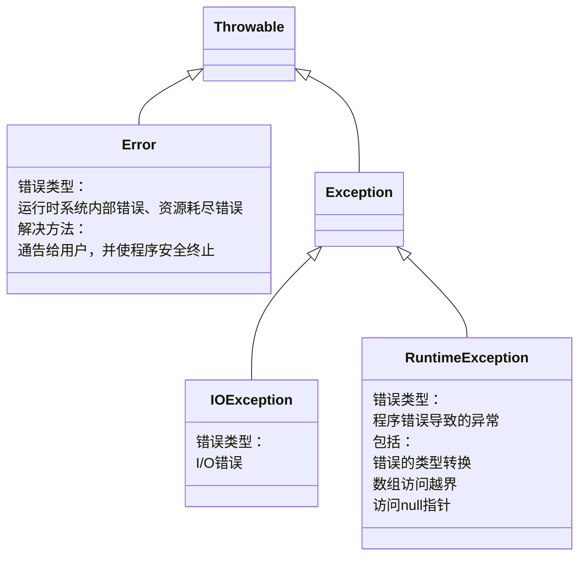

# 第七章	异常、断言和日志

## 7.1	处理错误

如果由于出现错误而使得某些操作没有完成，程序应该：

1. 返回到一种安全状态，并能够让用户执行一些其他命令；或者
2. 允许用户保存所有操作的结果，并以妥善的方式终止程序。

为了能够在程序中处理异常情况，必须研究程序中可能会出现的错误和问题，以及哪类问题需要关注：

1. 用户输入错误

2. 设备错误

3. 物理限制

4. 代码错误

    通常返回一个错误代码，由调用方法分析。

    遗憾的是，并不是在任何情况下都能够返回一个错误码。

在java中，如果某个方法不能够采用正常的途径完整它的任务，就可以通过另外一个路径退出方法。在这种情况下，方法并不返回任何值，而是*抛出*（throw）一个封装了错误信息的对象。需要注意的是，这个方法会立刻退出，调用这个方法的代码也将无法继续执行。取而代之的是，异常处理机制开始搜索能够处理这种异常状况的*异常处理器*（exception handler）

### 7.1.1	异常分类



***如果出现Runtime Exception异常，那么就是你的问题***

1. 应当通过检测数组下标是否越界来避免*ArrayIndexOutOfBoundsException*异常
2. 应当通过在使用变量之前检测是否为null来杜绝*NullPointerException*异常

java将派生于***Error***类或***RuntimeException***类的所有异常称为*非受查*（unchecked）异常，所有其他的异常称为*受查*（checked）异常

### 7.1.2	声明受查异常

方法应该在其首部声明所有可能抛出的异常。这样可以从首部反映出这个方法可能抛出哪类异常。

在自己编写方法时，不必将所有可能抛出的异常都进行声明。至于什么时候需要在方法中用throw子句声明异常，什么异常必须使用throw子句声明，需要记住在遇到下面4种情况时应该抛出异常：

1. 调用一个抛出受查异常的方法
2. 程序运行过程中发现错误，并且利用throw语句抛出一个受查异常
3. 程序出现错误
4. Java虚拟机和运行时库出现的内部错误

如果出现前两种情况之一，则必须告诉调用这个方法的程序员有可能抛出异常。因为任何一个抛出异常的方法都有可能是一个死亡陷阱。如果没有处理器捕获这个异常，当前执行的线程就会结束。

对于那些可能被他人使用的Java方法，应该根据*异常规范*（exception specification），在方法的首部声明这个方法可能抛出异常。同时，如果一个方法有可能抛出多个异常，那么异常之间需要使用逗号隔开。

```java
class MyAnimation
{
    //...
    public Image loadImage(String s)	throws FileNotFoundException,EOFException
    {
        //...
    }
}
```

但是，不要声明非受查异常，这些错误完全在我们的控制之下。应该将更多的时间花费在修正程序的错误上，而不是说明这些错误发生的可能性。

```java
class MyAnimation
{
    //...
    void drawImage(int i)	throws ArrayIndexOutOfBoundException	//bad style
}
```

总之，一个方法必须声明所有可能抛出的*受查异常*，而非受查异常要么不可控制（Error），要么就应该避免发生（RuntimeException）。如果方法没有声明所有可能发生的受查异常，编译器就会发出一个错误信息。

***警告：如果子类覆盖了超类的方法***

1. 子类方法中可以抛出更特定的异常，或是根本不抛出任何异常

2. 如果超类方法中没有抛出任何受查异常，那么子类也不能抛出任何异常

### 7.1.3	如何抛出异常

对于一个已经存在的异常类，将其抛出非常容易。在这种情况下：

1. 找到一个合适的异常类
2. 创建这个类的一个对象
3. 将对象抛出

***C++注释***

在Java中，只能抛出Throwable子类的对象，而在C++中，却可以抛出任何类型的值

### 7.1.4	创建异常类

习惯上，定义的类应该包含两个构造器，一个是默认的构造器；另一个是带有详细描述信息的构造器（超类Throwable的toString方法将会打印出这些详细信息，这在调试中非常有用）

```java
//define exception
class FileFormatException extends IOException
{
    public FileFormationException()	{}
    public FileFormationException(String gripe)
    {
        super(gripe);
    }
}
//throw exception defined by ourselves
String readData(BufferedReader in) throws FileFormatException
{
    //...
    while(/*...*/)
    {
        if(ch == -1)	//EOF encountered
        {
            if(n < len)
            {
                throw new FilrFormatException();
            }
        }
    }
    return s;
}
```

## 7.2	捕获异常

想要捕获一个异常，必须设置try/catch语句块。

```java
try
{
	//code
    //more code
    //more code
}
catch(ExceptionType e)
{
    //handle for thie type
}
```

如果在try语句块的任何代码抛出了一个在catch子句中说明的异常类，那么

1. 程序将跳过try语句块的其余代码
2. 程序将执行catch子句中的处理器代码

如果在try语句块中的代码没有抛出任何异常，那么程序将跳过catch语句

如果方法中的任何代码抛出了一个在catch子句中没有声明的异常类型，那么这个方法就立刻退出

### 7.2.2	捕获多个异常

```java 
try
{
    //code that might throw exception
}
catch(FileNotFoundException e)
{
    //emergency action for missing files
}
catch(UnknownHostException e)
{
    //emergency action for unknown hosts
}
catch(IOException e)
{
    //emergency action for all other I/O problems
}
```

异常对象可能包含与异常本身有关的信息。

```java
e.getMessage();//得到详细的错误信息（如果有的话）
e.getClass().getName();//得到异常对象的实际类型
```

合并catch语句

***只有当捕获的异常类型彼此之间不存在子类关系时才需要这个特性***

```java
try
{
    //code that might throw exceptions
}
catch(FileNotFoundException | UnknownHostException e)
{
    //emergency action for missing files and unknown hosts
}
```

***注释***

1. 捕获多个异常时，异常变量隐含为final

2. 捕获多个异常不仅会让你的代码看起来更简单，而且会更高效。

### 7.2.3	再次抛出异常和异常链

在catch子句中可以抛出一个异常，这样做的目的是改变异常的类型（再次抛出异常）

可以将原始异常设置为新异常的原因：

```java
try
{
    //access the database
}
catch(SQLException e)
{
    Throwable se = new ServletException("database error");
    se.initCause(e);
    throw se;
}
```

当捕获到异常时，就可以使用下面这条语句重新得到原始异常：

强烈建议使用这种包装技术。这样可以让用户抛出子系统中的高级异常，而不会丢失原始异常的细节。

```java
Throwable e = se.getCause();
```

如果只是想记录一个异常，再重新抛出，而不做任何的改变：

```java
try
{
	//access the databace
}
catch (Exception e)
{
    logger.log(level,message e);
    throw e;
}
```

### 7.2.4	finally字句

当代码抛出一个异常时，就会终止方法中剩余代码的处理，并退出这个方法的执行。如果方法获得了一些本地资源，并且只有这个方法自己知道，又如果这些资源在退出方法之前必须被回收，那么就会产生资源回收问题。——finally字句

不管是否有异常被捕获，finally子句中的代码都被执行。在下面的示例中，程序将在*所有情况*下关闭文件

```java
InputStream in = new FileInputStream(...);
try
{
    //1
    //code that might throw exceptions
      
    //2
}
catch(IOException e)
{
    //3
    //show error message
    //4
}
finally
{
    //5
    in.close();
}
//6
```

在上面这段代码中，有下列3种情况会执行finally子句：

1. 代码没有抛出异常。
2. 抛出一个在catch子句中捕获的异常。
    1. 如果catch语句没有抛出异常，程序将执行try语句块之后的第一条语句。在这里，执行1,3,4,5,6处的代码
    2. 如果catch语句抛出异常，异常将会被抛回这个方法的调用者。在这里，执行1,3,5处的代码
3. 代码抛出一个异常，但是这个异常不是由catch子句捕获的。在这里，程序执行try中的所有语句，直到有异常被抛出为之。在这里，执行1,5处代码

try语句可以只有finally语句，而没有catch语句。

```java
InputStream in = ...;
try
{
    //code that might throw exceptions
}
finally
{
    in.close();
}
```

***提示***

强烈建议解耦合try/catch和try/finally语句块。

内层的try语句块只有一个职责，就是确保关闭输入流。外层的try语句块也只有一个职责，就是确保报告出现的错误。这种设计方式不仅清楚，而且还具有一个功能。就是会报告finally子句中出现的错误。

```java
InputStream in = ...;
try
{
    try
    {
        //code that might throw exceptions
    }
    finally
    {
        in.close();
    }
}
catch(IOException e)
{
    //show error message
}
```

***警告***

当finally子句包含return时，这个方法的返回值会被覆盖。

```java
//若n=2，最终返回值为0而不是4
public static int(int n)
{
    try
    {
        int r = n * n;
        return r;
    }
    finally
    {
        if(n==2)	return 0;
    }
}
```

### 7.2.5	带资源的try语句

带资源的try语句格式：

```java
try(Resourse res=...)
{
    //work with res
}
```

try块退出时，无论是否正常退出，都会自动调用res.close()

```java
try(Scanner in = new Scanner(new FileInputStream("/usr/share/dict/words")),"UTF-8")
{
    while(in.hasNext())
    {
        System.out.println(in.next());
    }
}
```

不论try如何退出，in和out都会正常关闭

```java
try(Scanner in = new Scanner(new FileInputStream("/usr/share/dict/words")),"UTF-8")
    PrintWriter out = new PrintWriter("out.txt")
{
    while(in.hasNext())
        out.println(in.next().toUpperCase());
}
```

***注释***

带资源的try语句自身也可以有catch子句和finally子句。这些子句会在关闭资源之后执行。不过在实际中，一个try语句中加入这么多内容可能不是一个好主意。

### 7.2.6	分析堆栈轨迹元素

*堆栈轨迹*（stack trace）是一个方法调用过程的列表，它包含了程序执行过程中方法调用的特定位置。当java程序正常终止，而没有捕获异常时，这个列表就会显示出来。

使用getStackTrace方法访问堆栈轨迹的文本描述信息，它会得到StackTraceElement对象的一个数组，可以在程序中分析这个对象数组

```java
Throwable t = new Throwable();
StackTraceElement[] frames = t.getStackTrace();
for(StackTraceElement frame : frames)
{
    //analyze frame
}
```

***重要程序***

```java
package stackTrace;

import java.util.*;

/**
 * A program that displays a trace feature of a recursive method call.
 */
public class StackTraceTest
{
    /**
     * Computes the factorial of a number
     * @param n a non-negative integer
     * @return n! = 1 * 2 * ... * n
     */
    public static int factorial(int n)
    {
        System.out.println("factorial(" + n + ")");
        Throwable t = new Throwable();
        StackTraceElement[] frames = t.getStackTrace();
        for(StackTraceElement f : frames)
            System.out.println(f);
        int r;
        if(n <= 1)
        {
            r=1;
        }
        else
        {
            r = n * factorial(n-1);
        }
        System.out.println("return " + r);
        return r;
    }

    public static void main(String[] args)
    {
        Scanner in = new Scanner(System.in);
        System.out.print("Enter n: ");
        int n = in.nextInt();
        factorial(n);
    }
}
//output:
Enter n: 5
factorial(5)
stackTrace.StackTraceTest.factorial(StackTraceTest.java:18)
stackTrace.StackTraceTest.main(StackTraceTest.java:40)
factorial(4)
stackTrace.StackTraceTest.factorial(StackTraceTest.java:18)
stackTrace.StackTraceTest.factorial(StackTraceTest.java:29)
stackTrace.StackTraceTest.main(StackTraceTest.java:40)
factorial(3)
stackTrace.StackTraceTest.factorial(StackTraceTest.java:18)
stackTrace.StackTraceTest.factorial(StackTraceTest.java:29)
stackTrace.StackTraceTest.factorial(StackTraceTest.java:29)
stackTrace.StackTraceTest.main(StackTraceTest.java:40)
factorial(2)
stackTrace.StackTraceTest.factorial(StackTraceTest.java:18)
stackTrace.StackTraceTest.factorial(StackTraceTest.java:29)
stackTrace.StackTraceTest.factorial(StackTraceTest.java:29)
stackTrace.StackTraceTest.factorial(StackTraceTest.java:29)
stackTrace.StackTraceTest.main(StackTraceTest.java:40)
factorial(1)
stackTrace.StackTraceTest.factorial(StackTraceTest.java:18)
stackTrace.StackTraceTest.factorial(StackTraceTest.java:29)
stackTrace.StackTraceTest.factorial(StackTraceTest.java:29)
stackTrace.StackTraceTest.factorial(StackTraceTest.java:29)
stackTrace.StackTraceTest.factorial(StackTraceTest.java:29)
stackTrace.StackTraceTest.main(StackTraceTest.java:40)
return 1
return 2
return 6
return 24
return 120

Process finished with exit code 0
```

## 7.3	使用异常机制的技巧

1. 异常里不能代替简单的测试

    ```java
    //1	用时646ms
    if(!s.empty())	s.pop();
    //2	用时21739ms
    try
    {
        s.pop();
    }
    catch(EmptyStackException e)
    {
    }
    ```

    与执行简单的测试想必，捕获异常所花费的时间大大超过了前者。

2. 不要过分细分异异常

    ```java
    //1
    PrintStream out;
    Stack s;
    for(i = 0; i < 100; i++)
    {
        try
        {
            n = s.pop();
        }
        catch(EmptyStackException e)
        {
            //stack is empty
        }
        try
        {
            out.writerInt(n);
        }
        catch(IOException e)
        {
            //problem
        }
    }
    
    //2
    try
    {
        for(i = 0; i < 100; i++)
        {
            n = s.pop();
            out.writeInt(n);
        }
    }
    catch(IOException e)
    {
        //problem writing to file
    }
    catch(EmptyStackException e)
    {
        //stack was empty
    }
    ```

3. 利用异常层次结构

4. 不要压制异常

5. 早抛出，晚捕获

## 7.4	使用断言

### 7.4.1	断言的概念

假设确信某个属性符合要求，并且代码的执行依赖于这个属性。例如，

```java
double y = Math.srqt(x);
```

此处x的正负属性应当为正，并且代码的正确执行依赖于此。

为了检测属性的合法性，同时为了不牺牲代码的效率，不使用异常检测，而使用断言


Java语言引入关键字*assert*，两种形式：

1.  ```java
    assert 条件;
    ```

2.  ```java
    assert 条件: 表达式;
    ```

这两种形式都会对条件进行检测，若结果为false，则抛出一个*AssertionError*异常。在第二种形式中，表达式将被传入*AssertionError*的构造器，并转换成一个消息字符串。

###  7.4.2	启用和禁用断言

```
java -enableassertions MyApp
```

详细参考P286

### 7.4.3	使用断言完成参数检查

#### 3种处理系统错误的机制

1.  抛出一个异常
2.  日志
3.  使用断言

#### 什么时候使用断言

1.  断言失败是致命的、不可恢复的错误

2.  断言检查只用于开发和测阶段

## 7.5	记录日志

### 7.5.1	基本日志

生成简单的日志记录，使用*全局日志记录器（global logger）*并调用其info方法：

```java
Logger.getGlobal().info("File->Open menu item selected");
```

