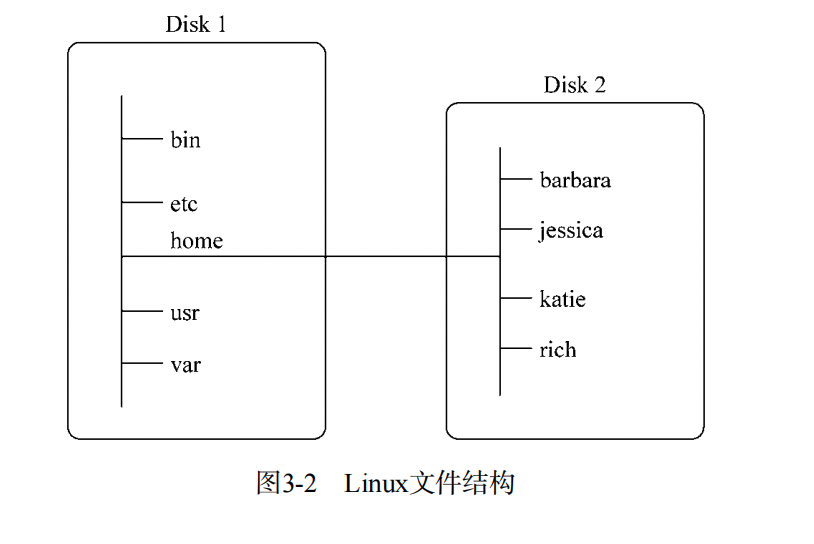

[TOC]

# bash 手册

> `man <cmd>`

bash手册甚至包含了一份有关其自身的参考信息。输入`man man`来查看与手册页相关的手册页

如果不记得命令，也可以使用`man -k <cmd>`来查找命令。

## 命令信息分节

手册页将相关的信息分成了不同的节。每一节惯用的命名标准如下列所示：

1. `Name`：显示命令名和一段简短的描述
2. `Synopsis`：命令的语法
3. `Configuration`：命令配置信息
4. `Description`：命令的一般性描述
5. `Options`：命令选项描述
6. `Exit Status`：命令的退出状态指示
7. `Return Value`：命令的返回值
8. `Errors`：命令的错误消息
9. `Files`：命令用到的文件
10. `Versions`：命令的版本信息
11. `Conforming To`：命令所遵从的标准
12. `Notes`：其他有帮助的资料
13. `Bugs`：提供提交bug的途径
14. `Example`：展示命令的用法
15.	`Authors`：命令开发人员的信息
16. `Copyright`：命令源代码的版权情况
17. `See Also`：与该命令类型相似的其他命令

## Linux手册页的内容区域

| 区域号 | 所涵盖的内容 |
|:--:|:--:|
| 1 | 可执行程序或Shell命令|
| 2 | 系统调用 |
| 3 | 库调用 | 
| 4 | 特殊文件 |
| 5 | 文件格式与约定 |
| 6 | 游戏 |
| 7 | 概览、约定与杂项|
| 8 | 超级用户和系统管理员命令 |
| 9 | 内核例程 |

一个命令偶尔会在多个内容区域都有对应的手册页。比如说，有个叫做`hostname`的命令。手册页中既包括该命令的相关信息，也包括对系统主机名的概述。要想查看所需要的页面，可以输入`man <page number> <cmd>`：

```shell
man 1 hostname	# 查看手册第一部分
man 2 hostname
```

# 浏览文件系统

> 注：本篇笔记使用的是GNU BASH

在Windows中，PC上安装的物理驱动器决定了文件的路径名。Windows会为每个物理磁盘驱动器分配一个盼复，每个驱动器都会有自己的目录结构，以便访问其中的文件。

Linux采用的方式是将文件存储在单个目录结构中，这个目录被称为*虚拟目录(virtual directory)*。虚拟目录将安装在PC上的所有存储设备的文件路径纳入单个目录结构中。

Linux虚拟目录只包含一个称为*root*的目录。根目录下的目录和文件会按照访问它们的目标目录二列出。

Linux虚拟目录中比较复杂的部分是它如何协调管理各个存储设备。在Linux PC上安装的第一块硬盘称为根驱动器。根驱动器包含了虚拟目录的核心，其他目录都是从那里开始构建的。Linux会在根驱动器上创建一些特别的目录，我们称之为*挂载点（mount point）*。挂载点是虚拟目录中用于分配额外存储设备的目录。虚拟目录会让文件和目录出现在这些挂载点目录中，然而实际上它们却存储在另外一个驱动器中。



如图，`home`节点就被挂在到了另外一个驱动中。

## Linux文件系统结构

Linux文件系统结构是从UNIX文件结构演进过来的。在Linux文件系统中，通用的目录名用于表示一些常见的功能。他们都遵循一个叫做文件系统层级标准（filesystem hierarchy standard, FHS）的东西。

| 目录     | 用途                                                      |
| -------- | --------------------------------------------------------- |
| `/`      | 虚拟目录的根目录。通常不会在这里存储文件                  |
| `/bin`   | 二进制目录，存放许多用户级的GNU工具                       |
| `/boot`  | 启动目录，存放启动文件                                    |
| `/dev`   | 设备目录，Linux在这里创建设备节点                         |
| `/etc`   | 系统配置文件目录                                          |
| `/home`  | 主目录，Linux在这里创建用户目录                           |
| `/lib`   | 库目录，存放系统和应用程序的库文件                        |
| `/media` | 媒体目录，可移动媒体设备的常用挂载点                      |
| `/mnt`   | 挂在目录，另一个可移动媒体设备的常用挂载点                |
| `/opt`   | 可选目录，常用于存放第三方软件包河数据文件                |
| `/proc`  | 进程目录，存放现有硬件河当前进程的相关信息                |
| `/root`  | root用户的主目录                                          |
| `/sbin`  | 系统二进制目录，存放许多GNU管理员级工具                   |
| `/run`   | 运行目录，存放系统运作时的运行时数据                      |
| `/srv`   | 服务目录，存放本地服务的相关文件                          |
| `/sys`   | 系统目录，存放系统硬件信息的相关文件                      |
| `/tmp`   | 临时目录，可以在该目录中创建和删除临时工作文件            |
| `/usr`   | 用户二进制目录，大量用户级的GNU工具和数据文件都存储在这里 |
| `/var`   | 可变目录，用以存放经常变化的文件，比如日志文件            |

## 基本列表功能——`ls`

`ls`命令最基本的形式会显示当前目录下的文件和目录。注意，`ls`命令输出的列表是按字母排序的（按列排序）。如果用户用的是支持彩色的终端仿真器，`ls`命令还可以用不同的颜色来区分不同类型的文件。`LSCOLORS`环境变量控制者这个功能。


如果没有设置这个环境变量，或者是没有安装彩色终端仿真器，那么使用`ls`命令的时候我们便不能知道一个目录是文件还是文件夹：


我们可以使用带`-F`参数的`ls`命令轻松区分文件和目录：


`-R`参数是`ls`命令可用的另一个参数，成为递归选项。它能够列当前目录下包含的子目录中的文件。如果目录很多，这个输出就会很长。

## 在`ls`中使用通配符

```shell
ls -l | grep Node
-rw-r--r--  1 liuyuan  staff    2504 Sep  2 14:08 Node.cpp
-rw-r--r--  1 liuyuan  staff    2550 Sep  2 14:07 Node.h
-rw-r--r--  1 liuyuan  staff    3159 Sep  2 13:55 NodeTree.cpp
-rw-r--r--  1 liuyuan  staff    1027 Sep  2 13:24 NodeTree.h
```
`ls`命令能够识别标准通配符，并在过滤器中用它们进行模式匹配：

+ 问号（?）代表一个字符
+ 星号（*）代表零个或多个字符

在文件中使用星号和问号被称为*文件扩展匹配（file globbing）*，指的是使用通配符进行模式匹配的过程。通配符正式的名称叫做*元字符通配符(metacharacter wildcards)*。除了星号和问号之外还有更多的元字符通配符

+ 中括号（[]）代表可能出现的字符，可以仅代表几个字符，也可以代表一个范围
	```shell
	> ls my_scr[ai]pt
	my_scrapt	my_script
	> ls my_scr[a-i]pt
	my_scrapt	my_script
	```
+ 感叹号（!）将不需要的内容排除在外
	```shell
	> ls
	fall	fell	fill
	> ls f[!all]
	fell	fill
	```
# 文件操作

## 创建文件

## 复制文件

> `cp <source> <destination>`

### `-i`

如果目标文件已经存在，`cp`命令可能并不会提醒这一点。最好是加上`-i`选项，强制shell询问是否需要覆盖已有的文件：

```shell
> cp -i fall ..
overwrite ../fall? (y/n [n])
```

### `-R`

使用这个参数可以在一条命令中递归地复制整个目录的内容

## 链接文件

链接文件是Linux文件系统的一个优势。如果需要在系统上维护同一文件的两份或者多分副本，除了保存多分单独的物理文件副本之外，还可以采用保存一份物理副本和多个虚拟副本 的方法。这种虚拟的副本就成为链接。链接是目录中指向文件真实位置的占位符。在Linux中有两种不同类型的文件链接：

+ 符号链接
+ 硬链接

### 符号链接

符号链接就是一个实实在在的文件，它指向存放在虚拟目录结构中某个地方的另一个文件。这两个通过符号链接在一起的文件，彼此的内容并不相同。要为一个文件创建符号链接，原始文件必须事先存在。然后可以使用`ln`命令以及`-s`选项来创建符号链接：

```shell
> ls
data_file
> ln -s data_file sl_data_file
> ls -l
total 0
-rw-r--r--  1 liuyuan  staff  0 Sep  3 10:14 data_file
lrwxr-xr-x  1 liuyuan  staff  9 Sep  3 10:14 sl_data_file -> data_file
```

需要注意的是，两个文件其实并不相同。被创建的符号链接`sl_data_file`中的数据记录着其指向的文件的信息。

我们也可以查看他们的`inode`编号。文件或目录的`inode`编号是一个用于标识的唯一数字，这个数字由内核分配个文件系统的每一个对象。要查看文件或目录的`inode`编号，可以给`ls`命令加入`-i`参数：

```shell
> ls -li
10238567 -rw-r--r--  1 liuyuan  staff  0 Sep  3 10:14 data_file
10238570 lrwxr-xr-x  1 liuyuan  staff  9 Sep  3 10:14 sl_data_file -> data_file
```

### 硬链接

硬链接会创建独立的虚拟文件，其中包含了原始文件的信息及位置。但是它们从根本上而言是同一个文件。引用硬链接文件等同于引用了源文件。要创建硬链接，原始文件也必须事先存在，只不过这次使用`ln`命令的时候不需要额外的参数：

```shell
> touch code_file
> ln code_file hl_code_file
> ls -li
10238794 -rw-r--r--  2 liuyuan  staff  0 Sep  3 10:21 code_file
10238794 -rw-r--r--  2 liuyuan  staff  0 Sep  3 10:21 hl_code_file
```

可以看到，带有硬链接的文件共享inode编号。这是因为它们终归是同一个文件。还要注意的是，链接计数（第三项）显示这两个文件都有两个链接。另外，它们的文件大小也一模一样。

> 只能对处于同一存储媒体的文件创建硬链接。要想在不同存储媒体的文件之间创建链接，只能使用符号链接。

## 删除文件

# 查看文件neirong

## 查看文件类型

```shell
> file my_file
my_file: ASCII text
> file New_Dir
New_Dir/: directory
> file sl_data_file
sl_data_file: ASCII text
> file -h sl_data_file
sl_data_file: symbolic link to data_file
> file my_script
my_script: Bourne-Again shell script text executable, ASCII text
> file /bin/ls
/bin/ls: Mach-O universal binary with 2 architectures: [x86_64:Mach-O 64-bit executable x86_64
...
```

## 查看整个文件

### `cat`

+ `-n`：给所有的行加上行号
+ `-b`：给有文本的行加上行号
+ `-T：将制表符替换为`^I`
    + 在UNIX中为`-t`


### `more`

`cat`命令的主要缺陷是：一旦运行，你就无法控制后面的操作。`more`命令会显示文本文件的内容，但在显示每页数据之后停下来。

### `less`

`less`命令的命名是从一个文字游戏`less is more`演变过来的，它实际上是`more`的升级版。

## 查看部分文件

通常，我们要查看的数据要么在文本文件的开头，要么在文本文件的末尾。如果这些数据实在大型文件的起始部分，那就得等`cat`或者`more`加载整个文件之后才能看到。

### `tail`

直接输入`tail`指令会打印最后10行，当然我们可以通过`tail -<number> <file>`的方式来指定打印的行数。

我们也可以使用`-f`来在别的进程使用这个文件的时候打印文件内容。`tail`将会保持活动状态，并不断显示添加到文件中的内容。**这是实时监测系统日志的绝妙方式。**

### `head`

`head`会显示文件开头的那些行的内容。默认情况下，它会显示文件前10行的文本。当然，我们也可以使用短横杠加数字的方式来指定打印的行数：`head -<number> <file>`
