[TOC]

# 检测程序

## 探查进程——`ps`

默认情况下，`ps`命令指挥显示运行在当前控制台下的属于当前用户的进程。在Linux系统重使用的GNU  `ps`命令支持3种不同类型的命令行参数：
+ UNIX风格参数，前面加单破折线
+ BSD风格的参数，前面不加破折线
+ GNU风格的长参数，前面加双破折线

### 1. UNIX风格的参数

UNIX风格的参数是从贝尔实验室开发的AT&UNIX系统上原有的`ps`命令继承下来的

|     参数      | 描述                                                     |
|:-------------:| -------------------------------------------------------- |
|     `-A`      | 显示所有进程                                             |
|     `-N`      | 显示与指定参数不符的所有进程                             |
|     `-a`      | 显示除控制进程（session leader）和无终端进程外的所有进程 |
|     `-d`      | 显示除控制进程外的所有进程                               |
|     `-e`      | 显示所有进程                                             |
| `-C cmdlist`  | 显示包含在`cmdlist`列表中的进程                          |
| `-G grplist`  | 显示组ID在`grplist`列表中的进程                          |
| `-U userlist` | 显示属主的用户ID在`userlist`列表中的进程                 |
| `-g grplist`  | 显示会话或组ID在`greplist`列表中的进程                   |
| `-p pidlist`  | 显示PID在`pidlist`列表中的进程                           |
| `-s sesslist` | 显示会话ID在`sesslist`列表中的进程                       |
| `-t ttylist`  | 显示终端ID在`ttylist`列表中的进程                        |
| `-u userlist` | 显示有效用户ID在`userlist`列表中的进程                   |
|     `-F`      | 显示更多而外输出（相对于`-f`而言）                       |
|  `-O format`  | 显示默认的输出列以及`format`列表指定的特定列             |
|     `-M`      | 显示进程的安全信息                                       |
|     `-c`      | 显示进程的额外调度器信息                                 |
|     `-f`      | 显示完整格式的输出                                       |
|     `-j`      | 显示任务信息                                             |
|     `-l`      | 显示长列表                                               |
|  `-o format`  |  仅显示由`format`指定的列                                                        | 
|     `-y`      |  不要显示进程标记（process flag，表明进程状态的标记）                                                        |
|     `-z`      |  显示安全标签（security context）信息                                                        |
|     `-H`      |   用层级格式来显示进程（树状，用来显示父进程）                                                       |
| `-n namelist` |                      定义了WCHAN列显示的值                                    |
|     `-w`      |                              采用宽输出模式，不限宽度显示                            |
|     `-L`      |     显示进程中的线程                                                     |
|     `-V`      |        显示ps命令的版本号                                                  |

使用ps的关键不在于记住所有哦可用的参数，而是在于记住最有用的那些参数。大多数Linux系统管理员都有自己的一组参数，他们会牢牢记住这些用来提取有用的进程信息的参数。举个例子，我们可以使用`-ef`参数组合：


这些显示的列中包含：

+ UID：启动这些进程的用户
+ PID：进程的进程ID
+ PPID：父进程的进程号（如果该进程是由另一个进程启动的）
+ C：进程生命周期中的CPU利用率
+ STIME：进程启动时的系统时间
+ TTY：进程启动时的终端设备
+ TIME：运行进程需要的累计CPU时间
+ CMD：启动的程序名称

如果想要获得更多的信息，可以采用`-l`参数，它会产生一个长格式输出：


+ F：内核分配给进程的系统标记
+ S：进程的状态（O代表正在运行；S代表正在休眠；R代表可运行、正等待运行；Z代表僵尸进程，进程已经结束，但是父进程不存在；T代表停止）
+ PRI：进程的优先级（越大的数字代表越低的优先级）
+ NI：谦让度值用来参与决定优先级
+ ADDR：进程的内存地址
+ SZ：假如进程被换出所需交换空间的大致大小
+ WCHAN：进程休眠的内核函数的地址

### 2. BSD风格的参数

伯克利软件发行版（Berkeley software distribution, BSD）是加州大学伯克利分校开发的一个UNIX版本。


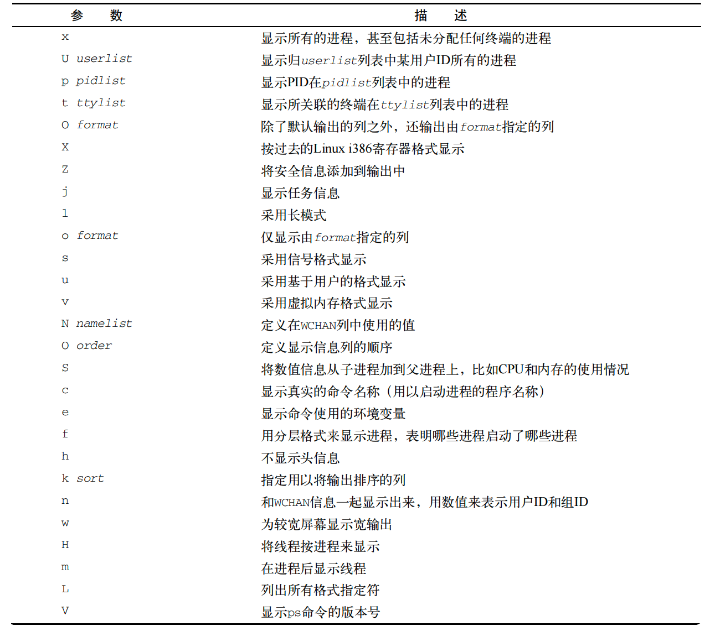

如图所示，UNIX和BSD类型的参数有很多重叠的地方。使用其中某种类型参数得到的信息也同样可以使用另一种获得。大多数情况下，你只要选择自己所喜欢格式的参数类型就可以了。

在使用BSD参数的时候，`ps`命令会自动改变输出以模仿BSD格式。

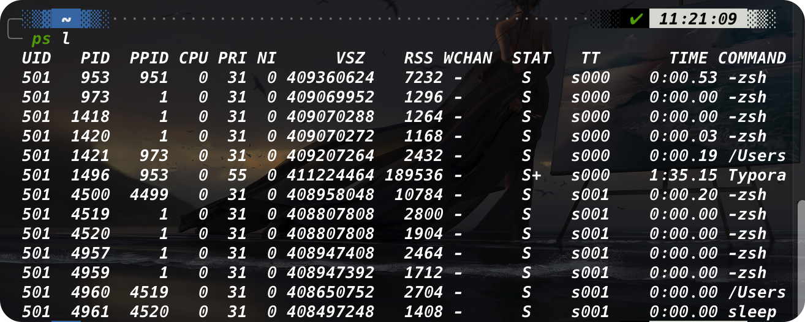

注意，其中大部分的输出列跟使用UNIX风格参数时的输出是一样的，只有一小部分不同

+ VSZ：进程在内存中的大小，以KB为单位
+ RSS：进程在未换出时占用的物理内存
+ STAT：代表当前进程状态的双字符状态码

许多系统管理员都喜欢BSD风格的`l`参数。它能输出更详细的进程状态码（STAT列）。双字符状态码能比UNIX风格输出的单字符状态码更清楚地表示进程的当前状态

第一个字符采用了和UNIX风格`S`列相同的值，表明进程是在休眠、运行还是等待。第二个参数进一步说明进程的状态：

+ <：该进程运行在高优先级上
+ N：该进程运行在低优先级上
+ L：该进程有页面锁定在内存中
+ s：该进程是控制进程
+ l：该进程是多线程的
+ +：该进程运行在前台

### 3. GNU长参数

最后，GNU开发人员在这个新改进过的`ps`命令中加入了另外一些参数。其中一些GNU长参数复制了先有的UNIX或者BSD类型的参数，而另一些则提供了新功能。

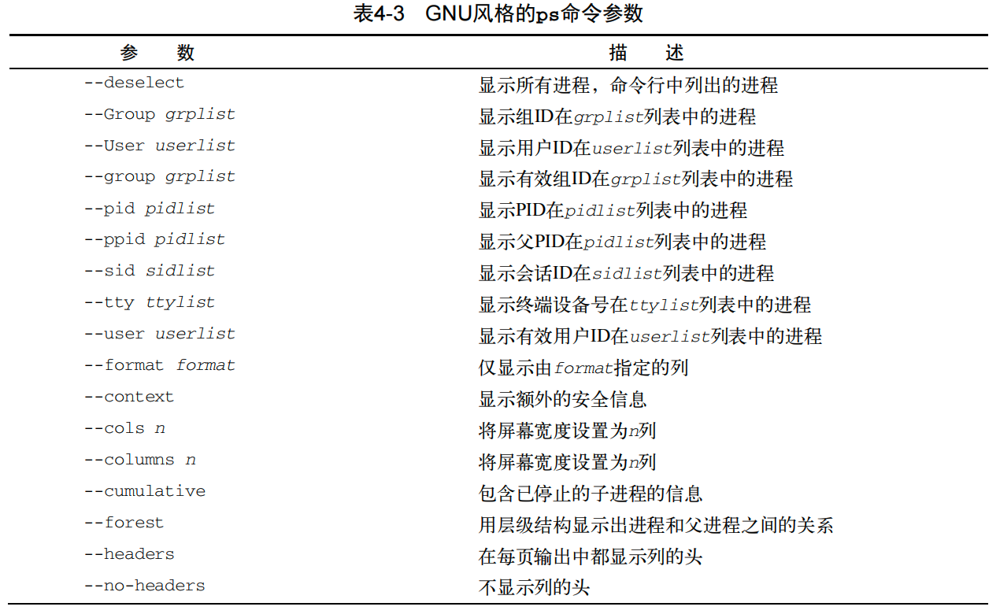

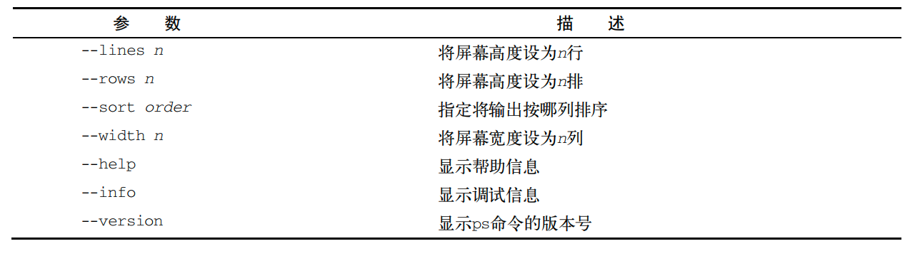

可以将GNU长参数和UNIX或BSD风格的参数混用来定制输出。GNU长参数中一个着实让人喜爱的功能就是`--forest`参数。它会显示进程的层级信息，并用ASCII字符展示：


## 实时监测进程——`top`

ps命令虽然在收集运行在系统上的进程信息时非常有用，但也有不足之处：它只能显示某个特定时间点的信息。如果想观察那些频繁换进换出的内存的进程趋势，用ps命令就不方便了。

而top命令刚好适用这种情况。top命令跟ps命令相似，能够显示进程信息，但它是实时显示的。

输出的第一部分显示的系统的概况：第一行显示了当前时间、系统的运行时间、登录的用户数以及系统的平均负载。

平均负载有3个值：最近1分钟的、最近5分钟的和最近15分钟的平均负载。值越大说明系统的负载越高。由于进程短期的突发性活动，出现最近1分钟的高负载值也很常见，但如果近15分钟内的平均负载都很高，就说明系统可能有问题。


下一行显示了CPU的概要信息。top根据进程的属主（用户还是系统）和京城的状态（运行、空闲还是等待）将CPU利用率分成了几类输出。

紧跟其后的两行说明了系统内存的状态。第一行说的是系统的物理内存：总共有多少内存，当前用了多少，还有多少空间。最后一行说的是同样的信息，不过是针对系统交换空间（如果分配了的话）的状态而言的。

最后一部分显示了当前运行中的进程的详细列表，有些列跟ps命令的输出类似。

+ PID：进程的ID
+ USER：进程属主的名字
+ PR：进程的优先级
+ NI：进程的谦让度值
+ VIRT：进程占用的虚拟内存总量
+ RES：进程占用的物理内存总量
+ SHR：进程和其他进程共享的内存总量
+ S：进程的状态（D代表可中断的休眠状态，R代表在运行状态，S代表休眠状态，T代表跟踪状态或停止状态，Z代表僵化状态）
+ %CPU：进程使用的CPU时间比例
+ %MEM：进程使用的内存占可用内存的比例
+ TIME+：自进程启动到目前为止的CPU时间总量
+ COMMAND：进程所对应的命令行名称，也就是启动的程序名

默认情况下，top命令在启动时会按照`%CPU`值对进程进行排序。可以在top运行时使用多种交互命令重新排序。每个交互式命令都是单字符，在top命令运行时键入可改变top的行为。键入f允许你选择对输出进行排序的字段，键入d允许你修改轮询间隔。键入q可以退出top。用户在top命令的输出有很大的控制权。用这个工具就能经常找出占用系统大部分资源的罪魁祸首。

## 结束进程

在Linux中，进程之间通过信号来通信。进程的信号就是预定好的一个消息，进程能识别它并决定忽略还是做出反应。进程如何处理信号是由开发人员通过编程来决定的。大多数编写完善的程序都能接受和处理标准UNIX进程信号。

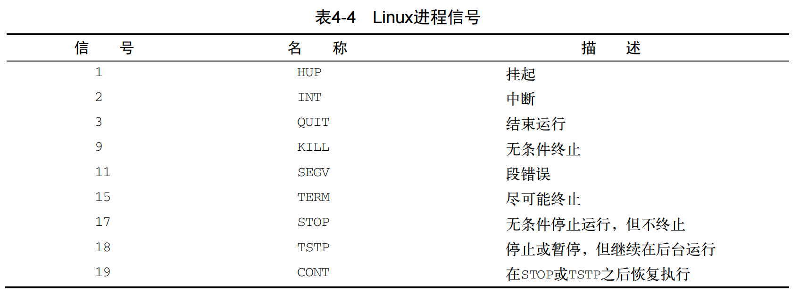

在Linux上有两个命令可以像运行中的进程发出进程信号。

### 1. `kill`

kill命令可以通过进程ID给进程发信号。默认情况下，kill命令会向命令行中列出的全部PID发送一个TERM信号。遗憾的是，你只能用进程的PID，而不能用命令名，所以kill命令有的时候并不好用。

要发送进程信号，你必须是进程的属主或者登录为root用户。TERM信号告诉进程可能得话就停止运行。不过，如果有不服管教的进程，那它通常会忽略这个请求。如果要强制停止，`-s`参数支持指定其他信号。

kill指令不会有任何输出，可以通过再运行ps或者top来查看进程是否已经停止。

### 2. `killall`

killall命令非常强大，它支持通过进程名而不是PID来结束进程。`killall`也支持通配符，这在系统因负载过大而变慢时很有用。

> 以root用户身份登录系统时，使用`killall`命令时要特别小心，因为很容易就会误用通配符而结束了重要的系统进程。这可能会破坏文件系统。

# 监测文件系统

## 挂载存储媒体

Linux文件系统将所有的磁盘都并入一个虚拟目录下。在使用新的存储媒体之前，需要把它放到虚拟目录下。这项工作称为挂载（mounting）

在今天的图形化桌面环境里，大多数Linux发行版都能自动挂载特定类型的可移动存储媒体。可移动存储媒体指的是可以从PC上轻易移除的媒体，比如CD-ROM，软盘和U盘。

如果用的发行版不支持自动挂载和卸载可移动存储媒体，就必须手动完成。

### 1. `mount`

默认情况下，mount命令会输出当前系统上挂载的设备列表：


mount命令提供如下四部分信息：

+ 媒体的设备文件名
+ 媒体挂载到虚拟目录的挂载点
+ 文件系统类型
+ 已挂载媒体的访问状态

以下面一行信息为例：

```shell
/dev/sdb1 on /media/disk type vfat
```

U盘被挂载到了`/media/disk`，vfat文件系统类型说明它实在Windows机器上被格式化的。

要手动在虚拟目录中挂在设备，需要以root用户身份登录，或是以root用户身份运行sudo命令。下面是手动挂载媒体设备的基本命令：

```shell
mount -t < media type> <device path> <destination directory>
```

媒体设备挂载到了虚拟目录后，root用户就有了对该设备的所有访问权限，而其他用户的访问则会被限制。你可以通过目录权限指定用户对设备的访问权限。

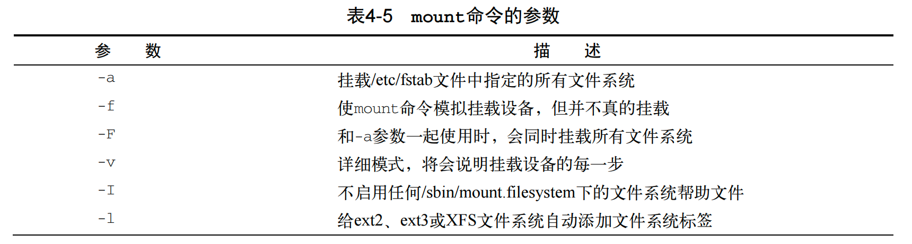

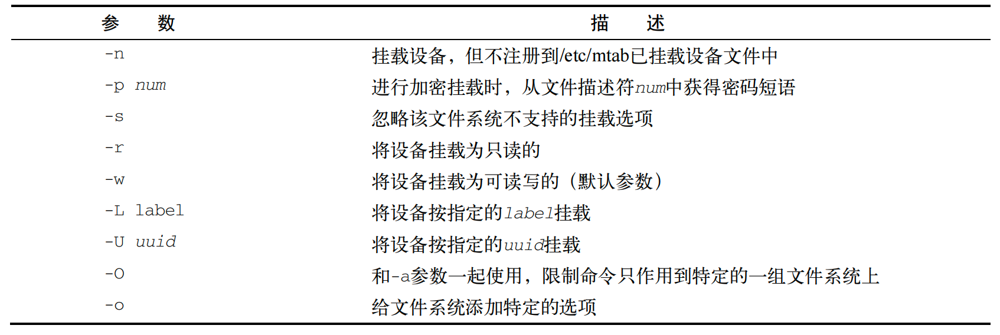

 `-o`参数允许在挂载文件系统时添加一些以逗号分隔的额外选项。以下为常用的选项：

+ `ro`：以只读形式挂载
+ `rw`：以读写形式挂载
+ `user`：允许普通用户挂载文件系统
+ `check=none`：挂载文件系统时不进行完整性校验
+ `loop`：挂载一个文件

### 2. `umount`

从Linux系统上移除一个可移动设备时，不能直接从系统上移除，而应该先卸载。

> Linux上不能直接弹出已挂载的CD。如果你在从光驱中移除CD时遇到麻烦，通常是因为该CD还挂载在虚拟目录里。先卸载它，然后再尝试弹出

umount命令的格式非常简单：

```shell
umount [directory | device]
```

umount命令支持通过设备文件或者是挂载点来指定要卸载的设备。如果有任何程序正在使用设备上的文件，系统就不会允许你卸载它：

```shell
[root@testbox mnt ]# umount /home/rich/mnt
umount: /home/rich/mnt: device is busy
umonnt: /home/rich/mnt: device is busy
[root@testbox mnt ]# cd ..
[root@testbox rich]# umount /home/rich/mnt
[root@testbox rich]# ls -l mnt
total 0
```

上面的例子中，命令行提示符仍然在挂载设备的文件系统目录中，所以umount命令无法卸载该镜像文件。一旦命令提示符移出该镜像文件的文件系统，umount命令就能卸载该镜像文件。

如果在卸载设备时，系统提示设备繁忙，无法卸载设备，通常是有进程还在访问该设备或使用该设备上的文件。这是可用lsof（list open files）命令获得使用它的进程信息，然后再应用中停止使用该设备或停止该进程。

```shel
lsof /path/to/device/node
```


## 使用df命令

有时需要知道在某个设备上还有多少磁盘空间。df命令可以让你很方便地查看已挂载磁盘的使用情况。

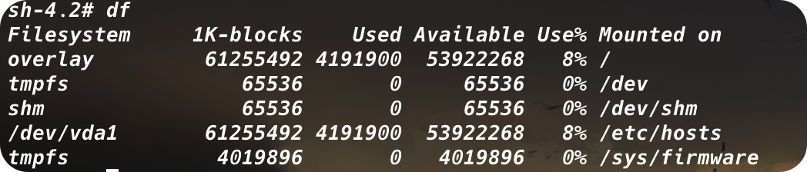

df命令会显示每个有数据的已挂载文件系统。命令输出如下：

+ 设备的设备文件位置
+ 能容纳多少个1024字节大小的块
+ 已用了多少个1024字节大小的块
+ 还有多少个1024字节大小的块能够使用
+ 已用空间所占比例
+ 设备挂载到了哪个挂载点上

df命令有一些命令行参数可用，但是基本不会用到。一个常用的参数是`-h`，它会把输出中的磁盘空间按照用户已读的形式显示：

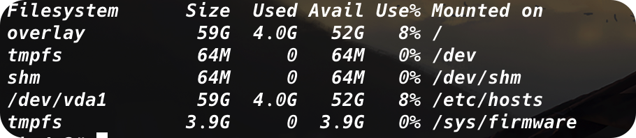

## 使用du命令

通过df命令很容易发现哪个磁盘的存储空间快没了。系统管理员面临的下一个问题是，发生这种情况时要怎么办。

另一个有用的命令是du命令。du命令可以显示某个特定目录（默认是当前目录）的磁盘使用情况。这一方法可以用来快速判断系统上某个目录下是不是有超大文件。

默认情况下，du命令会显示当前目录下所有的文件、目录和子目录的磁盘使用情况，它会磁盘块为单位来表明每个文件或目录占用了多大存储空间。对标准大小的目录来说，这个输出会是一个比较长的列表。


每行输出左边的数值是每个文件或目录占用的磁盘块数。注意，这个列表是从目录层级的最底部开始，然后按文件、子目录、目录逐级向上

这样意义不大。我们更想知道每个文件和目录占用了多大的磁盘空间，但如果还得逐页查找的话就没什么意义了。

+ -c：显示所有已列出文件总的大小
+ -h：按用户易读的格式输出大小
+ -s：显示每个输出参数的总计

# 处理数据文件

## 排序数据——`sort`

处理大量数据时的一个常用命令是sort命令。默认情况下，sort命令是对数据进行排序的。默认情况下，sort命令按照会话指定的默认语言的排序规则对文本文件中的数据进行排序。


如果你本期望这些数字能按值排序，就要失望了。默认情况下，sort命令会把数字当做字符来执行标准的字符排序，产生的输出可能根本就不是我们要的。解决这个问题可用`-n`参数，它会告诉sort命令把数字识别成数字而不是自负，并且按值排序。

<center>
    
</center>

另一个常用的参数是-M，按月排序。Linux的日志文件经常会在每行的起始位置有一个时间戳，用来表明时间是什么时候发生的。如果用-M参数，sort命令就能识别三字符的月份名，并相应地排序。

还有其他一些方便的sort参数：

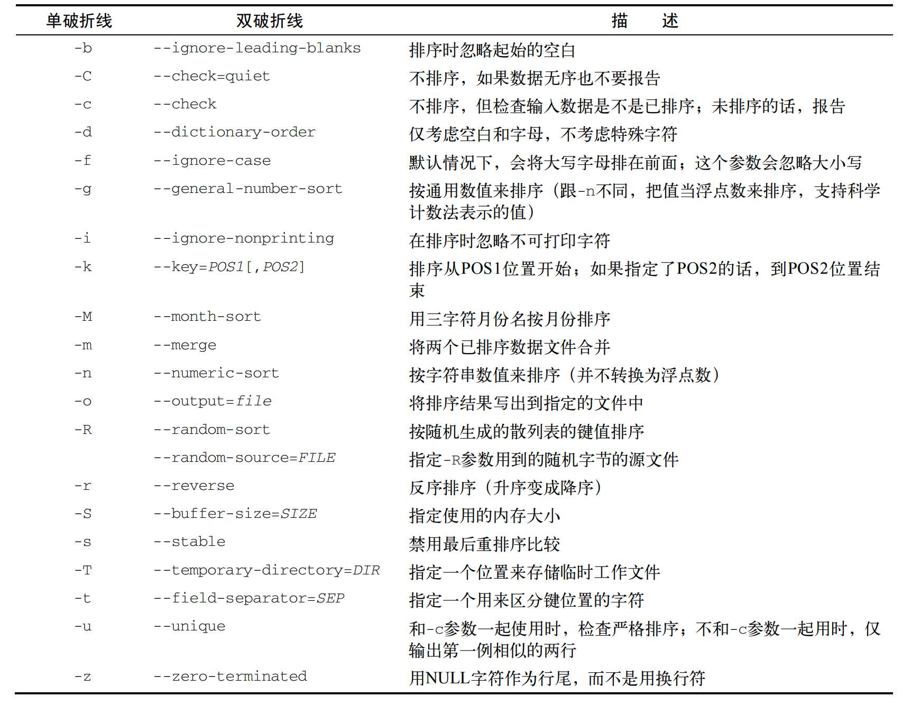

-k和-t参数在对按字段分隔的数据进行排序时非常有用，例如`/etc/passwd`文件。可以用`-t`参数来指定字符分隔符，然后用-k参数来指定排序的字段。

```shell
# 对密码文件/etc/passwd根据用户ID进行数值排序
sort -t ':' -k 3 -n /etc/passwd
```


-n参数在排序数值时非常有用，比如du命令的输出：


注意，-r参数将结果按降序输出，这样就更容易看到目录下的哪些文件占用空间最多

## 搜索数据——`grep`

我们经常需要再大文件中找一行数据，而这行数据又埋藏在文件的中间。这时并不需要手动翻看整个文件，用`grep`命令来帮助查找就行了。

```shell
grep [options] pattern [file]
```

grep命令会在输入或指定的文件中查找包含匹配指定模式的字符的行。grep的输出就是包含了匹配模式的行。

+ -v：反向搜索
+ -n：显示匹配模式的行所在的行号
+ -c：只想知道有多少行含有匹配的模式
+ -e：指定多个匹配模式

默认情况下，grep命令用基本的UNIX风格正则表达式来匹配模式。

egrep是grep的一个衍生，支持POSIX扩展正则表达式。POSIX扩展正则表达式含有更多的可以用来指定匹配模式的字符串。fgrep则是另外一个版本，支持将匹配模式指定为用换行符分割的一列固定长度的字符串。这样就可以把这列字符串放到哦一个文件中，然后再fgrep命令中用其在一个大型文件中搜索字符串了。

## 压缩数据——`bzip2`/`compress`/`gzip`/`zip`

Linux包含了多种文件压缩工具。虽然听上去不错，但这实际上经常会导致用户在下载文件时造成混淆。

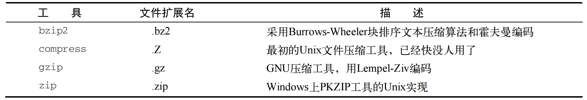

compress文件压缩工具已经很少在Linux系统上看到了。如果下载了带`.Z`扩展名的文件，通常可以用软件包安装compress包或者叫做ncompress。gzip是Linux上最流行的压缩工具。

gzip软件包是GNU项目的产物，意在编写一个能够代替袁霞UNIX中compress工具的免费版本。这个软件包含有下面的工具：

+ gzip：用来压缩文件
+ gzcat：用来查看压缩过的文本文件的内容
+ gunzip：用来解压文件

gzip命令会压缩你在命令行中指定的文件。也可以在命令行指定多个文件名甚至用通配符来一次性批量压缩文件。

## 归档数据——`tar`

虽然zip命令能够很好地将数据压缩和归档进单个文件，但它不是UNIX和Linux中的标准归档工具。目前，UNIX和Linux上最广泛使用的归档工具是`tar`命令

tar命令最开始是用来将文件写到磁带设备上归档的，然而它也能把输出写到文件里，这种用法在Linux上已经普遍用来归档数据了。

```shell
tar function [options] object1 object2 ...
```

function参数定义了tar命令该做什么：

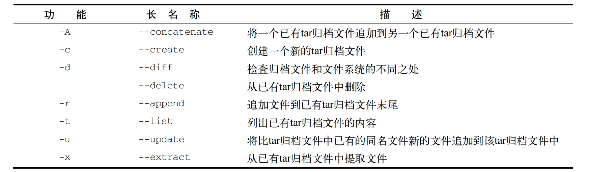

每个功能可用选项来针对tar归档文件定义一个特定行为：

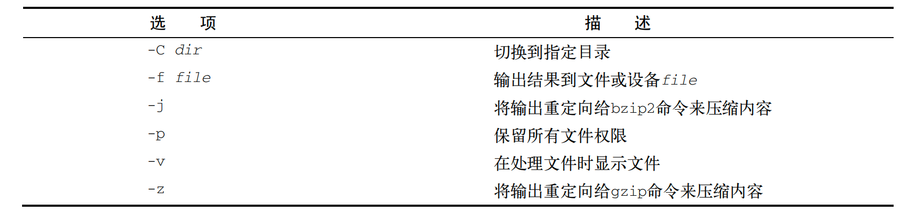

这些选项经常并到一起使用。我们可以用下列命令来创建一个归档文件：

```shell
# 创建一个名为test.tar的归档文件，含有test和test2目录内容
tar -cvf test.tar test/ test2/
```

用下列命令列出tar文件的内容（但并不提取文件）：

```shell
tar -tf test.tar
```

用下列命令从tar文件中提取内容：

```shell
tar -xvf test.tar
```

如果tar文件是从一个目录结构创建的，那整个目录结构都会在当前目录下重新创建。tar命令是给整个目录结构创建归档文件的简便方法。这是Linux中分发开源程序源码文件所采用的普遍方法。

> 下载了开源软件之后，经常会看到文件名以`.tgz`结尾。这些是gzip压缩过的tar文件，可以用命令
>
> ```shell
> tar -zxvf filename.tgz
> ```
>
> 来解压
