[TOC]

# 什么是环境变量

bash shell使用叫做环境变量(environment variable)的特性来存储有关shell会话和工作环境的信息（这也是被称作环境变量的原因）。这项特性允许我们在内存中存储数据，以便程序或shell中运行的脚本能够轻松访问它们。这也是存储持久数据的一种简便方法。

环境变量的分类：

+ 全局变量
+ 局部变量

## 全局环境变量

全局环境变量对于shell会话和所有生成的子shell都是可见的。局部变量则值对创建它们的shell可见。这对所有创建的子shell需要获取父shell信息的程序来说非常有用。

Linux系统在开始bash会话的时候就设置了一些全局环境变量。系统环境变量几乎全部采用大写字母，以此来区分普通用户的环境变量。

### `env`&`printenv`——查看全局变量

#### 显示所有的全局变量

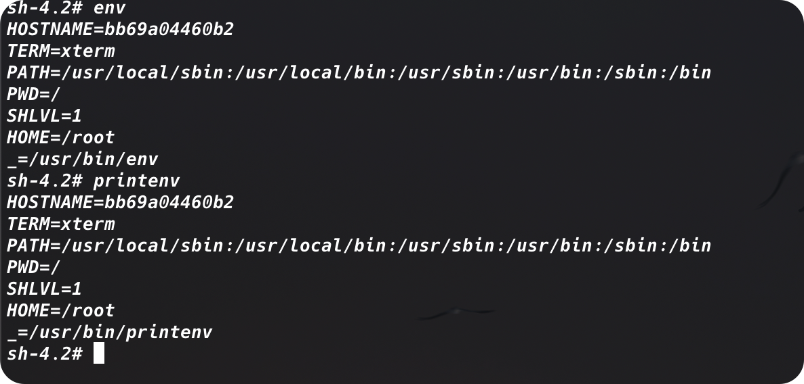

系统为bash shell设置的全局环境变量数目众多，我们不得不在展示的时候进行删减。其中有很多是在登录过程中设置的，另外，登录方式也会影响所设置的环境变量

#### 查看特指的全局变量

要显示个别环境变量的值，可以使用`printenv`命令，但是不要使用`env`命令。

我们也可以使用`echo`显示变量的值。在这种情况下引用某个环境变量的时候，必须在变量前面加上一个美元符号。


在`echo`命令中，在变量名前面加上美元符不仅仅能够显示变量当前的值。它能够让变量作为命令行参数。

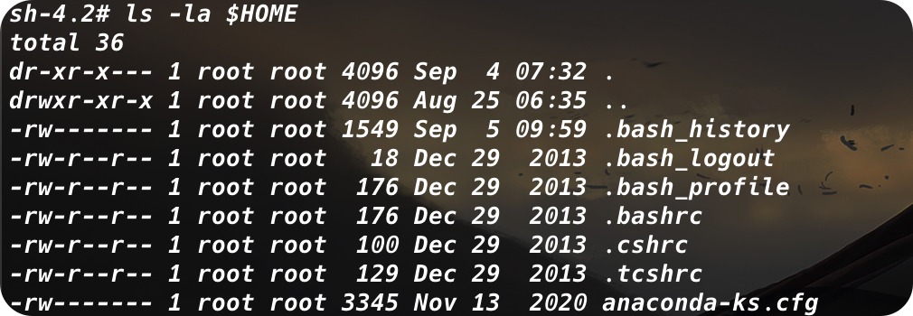

正如前面所说的，全局环境变量可以用于进程的所有shell

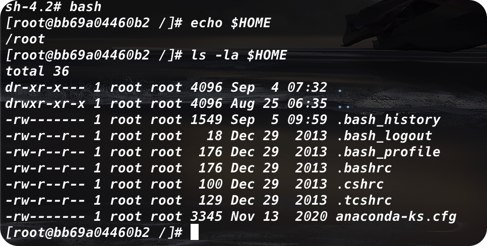

## 局部环境变量

局部环境变量只能在定义它们的进程中课件。尽管它们是局部的，但是和全局环境变量一样重要。事实上，Linux系统也默认定义了标准的局部环境变量。不过我们可以定义自己的局部变量，它们被称为**用户定义局部变量**

### `set`——打印全局变量、局部变量和用户自定义局部变量

遗憾的是，在Linux系统重并米有一个只表示局部环境变量的命令。`set`命令会显示为某个特定进程设置的所有环境变量。


> 命令`env`、`printenv`和`set`之间的差异很细微。`set`会显示所有的环境变量，它还会按照字母顺序对结果进行排序。

# 设置用户定义变量

## 设置局部用户定义变量

一旦启动了bash shell（或者执行了一个shell脚本），就能创建在这个shell进程内可见的局部变量了。可以通过等号给环境变量赋值，值可以是数值或者字符串。

```shell
[root@bb69a04460b2 /]# echo $hello

[root@bb69a04460b2 /]# hello=Hello
[root@bb69a04460b2 /]# echo $hello
Hello
```

如果要给变量赋一个含有空格的字符的值，必须使用引号来界定字符串的首位

```shell
[root@bb69a04460b2 /]# home='my home'
[root@bb69a04460b2 /]# home="my home"
```

没有单引号的话，bash shell会以为下一个词是另一个要执行的命令。注意，我们定义的局部环境变量用的都是小写字母，而到目前为止我们所看到的系统环境变量都是大写字母

> 所有的环境变量名均使用大写字母，这是bash shell的惯例。如果是我们自己创建的局部变量或是shell脚本，就需要使用小写字母。变量名区分大小写。在设计用户定义的局部变量时坚持使用小写字母，这能够避免重复定义系统环境变量可能带来的灾难。

变量名、等号和值之间没有空格，这一点非常重要。如果在赋值表达式中加上了空格，bash shell就会把值当成一个单独命令。

```shell
[root@bb69a04460b2 /]# home = "home"
bash: home: command not found
```

### 局部环境变量不在父子shell中传递

设置了局部环境变量后，就能在shell进程的任何地方使用它了。但是，如果生成了另一个shell，它在子shell中就不可用。

```shell
[root@bb69a04460b2 /]# my_variable="hello world"
[root@bb69a04460b2 /]# echo $my_variable
hello world
# 进入子shell
[root@bb69a04460b2 /]# bash
[root@bb69a04460b2 /]# echo $my_variable

[root@bb69a04460b2 /]# exit
exit
[root@bb69a04460b2 /]# echo $my_variable
hello world
```

类似的，如果我们在子进程中设置了一个局部变量，一旦我们退出了子进程，那个局部环境变量就不再可用

```shell
[root@bb69a04460b2 /]# ps --forest
  PID TTY          TIME CMD
   15 pts/1    00:00:00 sh
   74 pts/1    00:00:00  \_ bash
   83 pts/1    00:00:00      \_ bash
   92 pts/1    00:00:00          \_ ps
[root@bb69a04460b2 /]# my_variable="hello world"
[root@bb69a04460b2 /]# echo $my_variable
hello world
[root@bb69a04460b2 /]# exit
exit
[root@bb69a04460b2 /]# echo $my_variable

```

## 设置全局环境变量——`export`

在设定全局环境变量的进程**所创建的子进程**中，该变量都是可见的。创建全局环境变量的方法是先创建一个局部环境变量，然后再把它导出到全局环境中。

```shell
[root@bb69a04460b2 /]# global_variable="global"
[root@bb69a04460b2 /]# export global_variable
[root@bb69a04460b2 /]# bash
[root@bb69a04460b2 /]# echo $global_variable
global
```

**修改子shell中全局环境变量并不会影响到父shell中该变量的值**。

# 删除环境变量——`unset`

```shell
[root@bb69a04460b2 /]# printenv global_variable
global
[root@bb69a04460b2 /]# unset global_variable
[root@bb69a04460b2 /]# printenv global_variable
[root@bb69a04460b2 /]#
```

在处理全局环境变量的时候，事情就有些棘手。如果我们在子进程中删除了一个全局环境变量，这只对子进程有效。该全局环境变量在父进程中依然有效。

# 默认的shell环境变量

默认情况下，bash shell会用一些特定的环境变量来定义系统变量。这些变量在Linux系统上都已经设置好了。bash shell原子UNIX Bourne shell，因此也保留了UNIX Bourne shell里定义的那些环境变量。

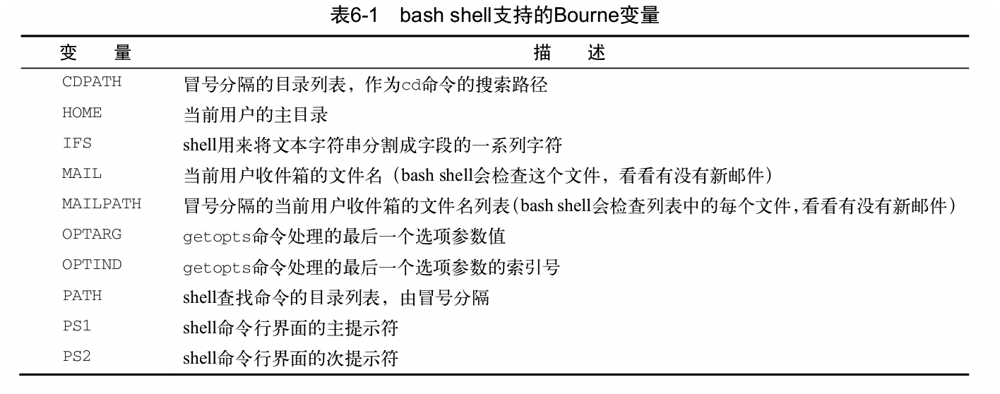

当然，bash shell还提供了一些自由的变量

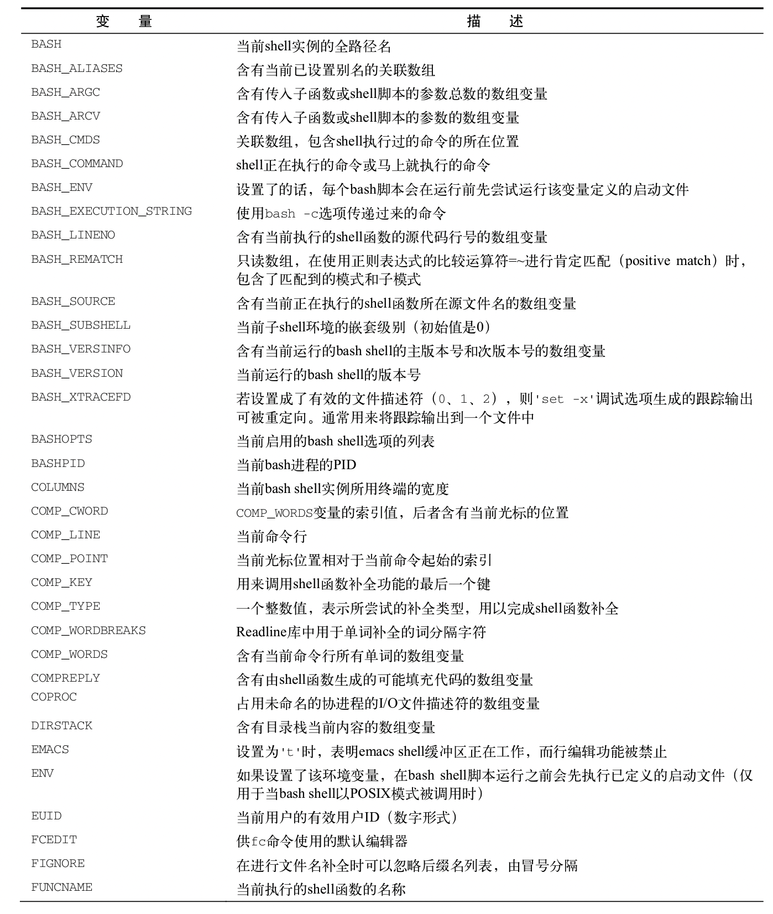

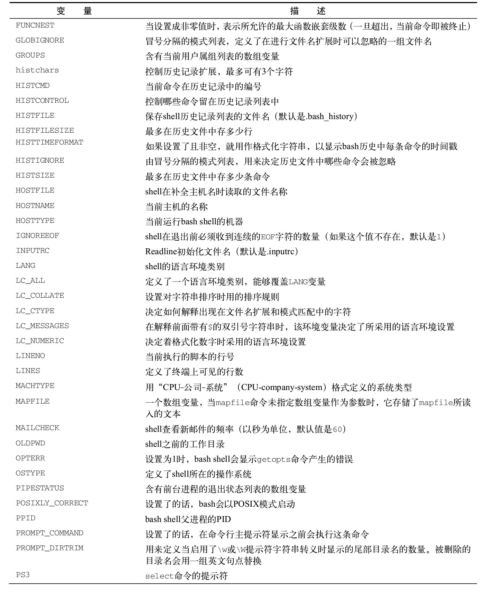

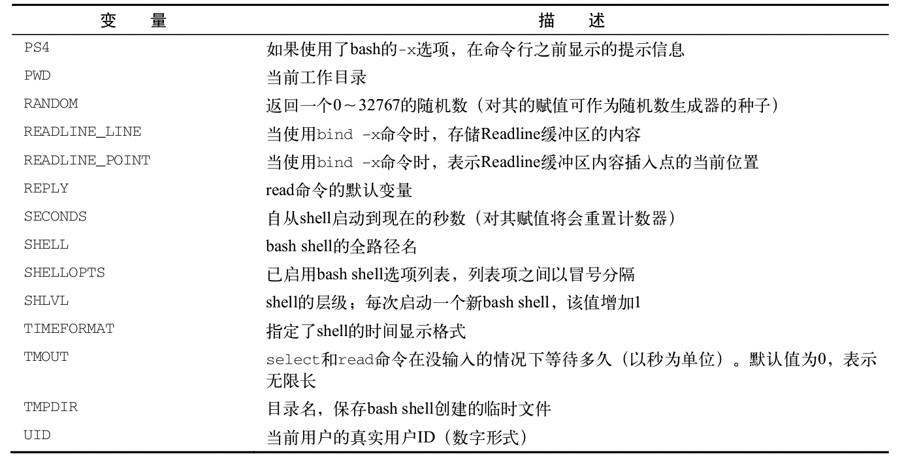

我们在使用`set`命令的时候，并没有列出这么多默认环境变量。尽管这些都是默认环境变量，但是并不是每一个都必须有一个值。

# 设置PATH环境变量

```shell
[root@bb69a04460b2 /]# echo $PATH
/usr/local/sbin:/usr/local/bin:/usr/sbin:/usr/bin:/sbin:/bin
```

PATH中的目录使用冒号分割。如果命令或者程序的位置没有包括在PATH变量中，那么如果不使用绝对路径的话，shell是没法找到的。如果shell找不到指定的命令或程序，它会产生一个错误信息。

那么就引出了一个问题：使用频繁而又不在PATH环境变量中的程序，使用起来会非常不方便。解决办法是将目录添加到PATH中。

```shell
[root@bb69a04460b2 /]# echo $PATH
/usr/local/sbin:/usr/local/bin:/usr/sbin:/usr/bin:/sbin:/bin
[root@bb69a04460b2 /]# PATH=hello:$PATH
[root@bb69a04460b2 /]# echo $PATH
hello:/usr/local/sbin:/usr/local/bin:/usr/sbin:/usr/bin:/sbin:/bin
```

> 如果希望子shell也能找到程序，需要把修改后的PATH导出

通常的办法是将单点符加入PATH环境变量。

# 定位系统环境变量

> 如何让环境变量的作用持久化

在登入Linux系统启动一个bash shell的时候，默认情况下bash会在几个文件中查找命令。这些文件叫做**启动文件**或**环境文件**。bash检查的启动文件取决于启动bash shell的方式。启动bash shell有3种方式：

+ 登录时作为默认登录shell
+ 作为非登录shell的交互式shell
+ 作为运行脚本的非交互shell

## 登录shell

当我们登录Linux系统的时候，bash shell会作为登录shell启动。登录shell会从5个不同的启动文件里读取命令：

+ `/etc/profile`
+ `$HOME/.bash_profile`
+ `$HOME/.bashrc`
+ `$HOME/.bash_login`
+ `$HOME/.profile`

`/etc/profile`文件是系统上默认的bash shell的主启动文件。系统上的每个用户登录时都会执行这个启动文件。

### `/etc/profile`

`/etc/profile`是bash shell默认的主启动文件。只要你登陆了Linux系统，bash就会执行文件中存放的命令。不同的Linux发行版中的这个文件存放了不同的命令。

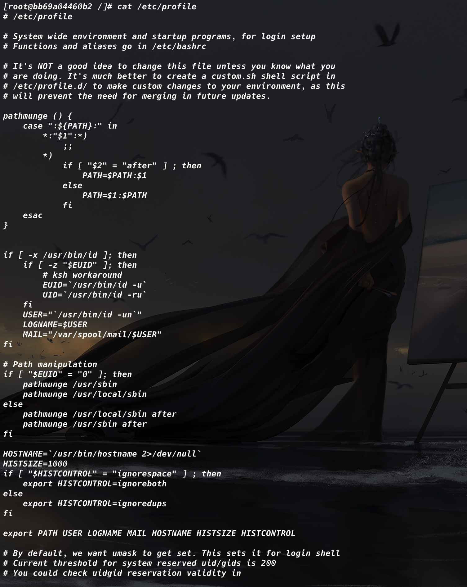

可以发现，profile文件在遍历执行一些文件：

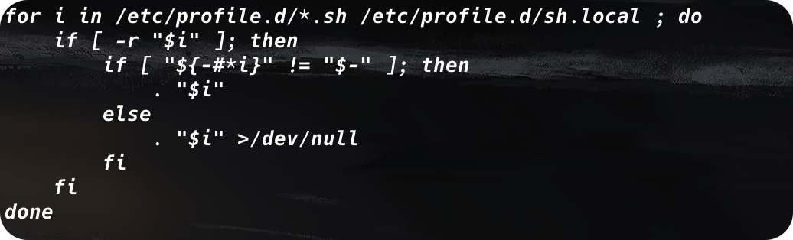

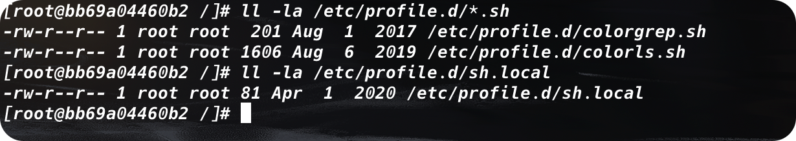

这些文件都被依次打开调用。

### `$HOME`目录下的启动文件

剩下的启动文件都起着同一个作用：提供一个用户专属的启动文件来定义该用户所用到的环境变量。大多数Linux发行版只用这四个启动文件的一到两个：

```shell
$HOME/.bash_profile
$HOME/.bashrc
$HOME/.bash_login
$HOME/.profile
```

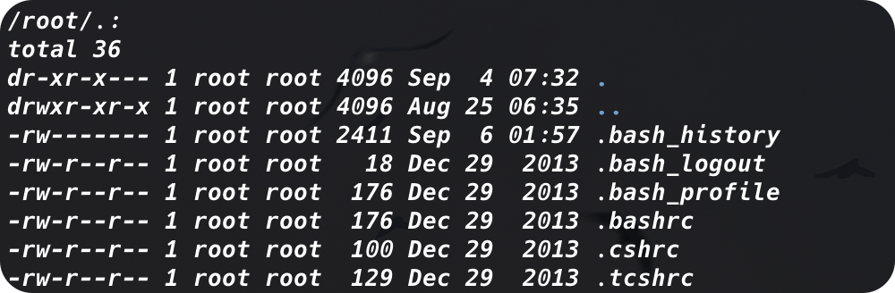

这些文件位于用户的HOME目录下，所以每个用户都可以编辑这些文件并添加自己的环境变量，这些环境变量会在每次启动bash shell会话时生效。

**bash会按照下列顺序，运行第一个被找到的文件，余下的则被忽略：**

+ `$HOME/.bash_profile`
+ `$HOME/.bash_login`
+ `$HOME/.profile`

注意，这个列表中没有`$HOME/.profile`文件。该文件通常是通过其他文件运行的。

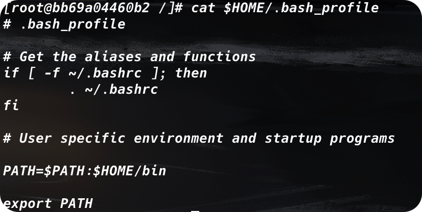

可以看到，语句首先检测了`.bashrc`文件是否存在，如果存在就先执行其中的命令。

## 交互式shell编程

如果bash shell不是登录系统时启动的（比如实在命令行提示符下敲入bash进入的），那么启动的shell叫做**交互式shell**。

交互式shell不会像登录shell一样运行。如果bash是作为交互式shell启动的，它就不会访问`/etc/profile`文件，只会检查用户HOME目录中的`.bashrc`文件。

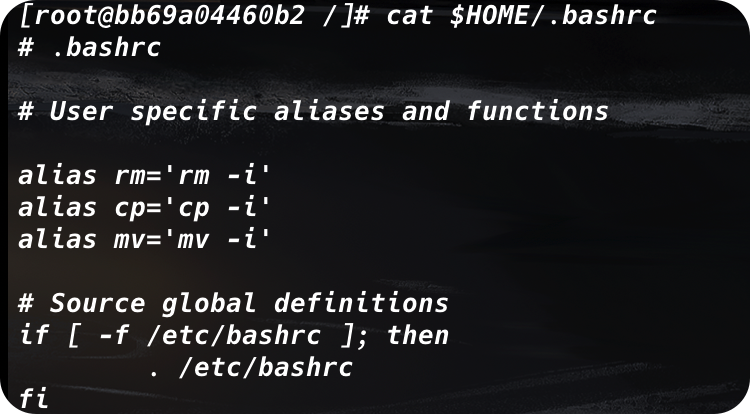

`.bashrc`有两个作用：一个是查看`/etc`目录下通用的`bashrc`文件，二十为用户提供一个定制自己的命令别名和私有脚本函数的地方。

## 非交互式shell

最后一种shell是非交互式sheel。系统执行shell脚本时用的就是这种shell。不同的地方在于它没有命令行提示符。但是当我们在系统上运行脚本的时候，也许希望能够运行一些特定启动的命令。

> 脚本能以不同的方式执行。只有其中的某一些方式能够启动子shell。

为了处理这种情况，bash shell提供了`BASH_ENV`环境变量。当shell启动一个非交互式shell进程的时候，它会检查这个环境变量来查看要执行的启动文件。如果有指定的文件，shell会执行该文件里的命令，这通常包括shell脚本变量设置。

在默认情况下，这个环境变量不会被设置。如果变量没有设置，`printenv`命令只会返回CLI提示符：


如果`BASH_ENV`没有设置，shell脚本到哪里去获得它们的环境变量？别忘了有些shell脚本是通过启动一个子shell来执行的。子shell可以继承父shell导出过的变量。

对于那些不启动子shell的脚本，变量已经存在于当前的shell中了。所以就算没有设置`BASH_ENV`，也可以使用当前shell的局部变量和全局变量。

## 环境变量持久化

对于全局环境变量来说，我们倾向于将新的或修改过的环境变量设置存放在`/etc/profile`中，但是这不是一个好主意。如果我们升级了所用的发行版，这个文件也会跟着更新，之前定制过的环境设置就全部没有了。

最好是在`/etc/profile.d`目录中创建一个以`.sh`结尾的文件。把所有新的或修改过的全局环境变量设置在这个文件中。

在大多数发行版中，存储个人用户永久性bash shell变量的地方是`$HOME/.bashrc`文件。这一点适用于所有类型的shell进程。但如果设置了`BASH_ENV`变量，那么需要注意的是，除非它指向的是`$HOME/.bashrc`，否则我们应该将非交互式shell的用户变量放在别的地方。

`alias`命令设置是不能持久的，我们可以把这些设置放在`$HOME/.bashrc`启动文件中，使其效果持久化

# 数组变量

环境变量有一个很酷的特性，它们可以作为数组使用。

## 设置数组

要给某个环境变量设置多个值，可以把值放在括号里，值与值之间用空格分割。


## 输出数组

但如果我们像输出普通变量那样输出变量，我们是无法获得我们想要的结果的：


我们需要加上索引值，索引值从0开始：


要显示整个数组，可以在索引位置写通配符`*`：

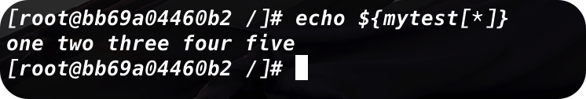

## 删除数组元素和数组

我们可以使用下标和`unset`来删除元素。但是需要注意的是，删除元素之后，原本的那个位置会空出来，也就是说，后面的元素并不会向前补：

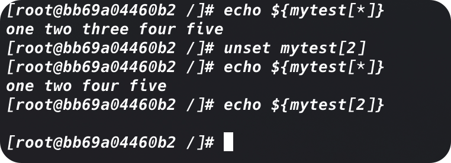

我们可以直接使用`unset [arr name]`来直接删除整个数组：

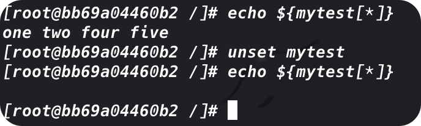

有时数组变量会让事情很麻烦，所以在shell脚本编程中并不常用。对其他shell而言，数组变量的可移植性并不好，如果需要再不同的shell环境下从事大量的脚本编写工作，这会带来很多不便。有些bash系统环境变量使用了数组，但总体上不会太频繁用到。