[TOC]

# Linux的安全性

Linux安全系统的核心是用户账户。每个能进入Linux系统的用户都会被分配唯一的用户账户。用户对系统中各种对象的访问权限取决于他们登录系统时的账户。

用户权限是通过创建用户时分配的用户ID（User ID，UID）来跟踪的。UID是数值，每个用户的UID是唯一的，但是在登录时使用的不是UID，而是登录名。登录名是用户用来登录系统的最长八字符的字符串（字符串可以是数字或字母），同时会关联一个对应的密码。

Linux系统使用特定的文件和工具来跟踪和管理系统上的用户账户。

## `/etc/passwd`

Linux系统使用一个专门的我呢间来将用户的登录名匹配到对应的UID值。这个文件就是`/etc/passwd`文件，它包含了一些与用户有关的信息。

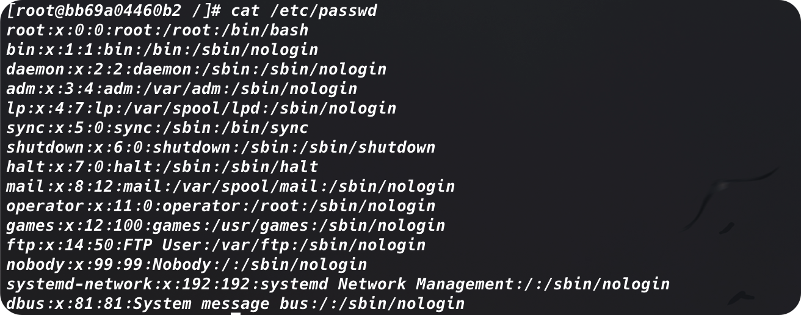

root用于账户是Linux系统的管理员，固定分配的UID是0。Linux系统会为各种各样的功能创建不同的用户账户，但这些账户并不是真的用户。这些账户都叫做*系统账户*，是系统上运行的各种服务进程访问资源用的特殊账户。所有运行在后台的服务都需要用一个系统用户账户登录到Linux系统上。

> 在安全成为一个大问题之前，这些服务经常会以root账户登录。遗憾的是，如果有非授权的用户攻陷了这些服务中的其中一个，他立刻就能作为root用户进入系统。为了防止发生这种情况，现在运行在Linux服务器后台的几乎所有的服务都是用自己的账户登录。这样的话，即使有人工入了某个服务，也无法访问整个系统。

**Linux为系统账户预留了500以下的UID值。**有些服务甚至要特定的UID才能正常工作。为普通用户创建账户的时候，大多数Linux系统UID会从500开始，将第一个可用UID分配给这个账户（并非所有的Linux发行版都是这样）

`/etc/passwd`文件中还有很多用户登录名和UID之外的信息。`/etc`/passwd文件的字段包含了如下信息：

* 登录用户名
* 登录密码
* 用户账户UID（数字形式）
* 用户账户的组ID（GID）（数字形式）
* 用户账户的文本描述（备注字段）
* 用户HOME目录的位置
* 用户的默认shell

`/etc/passwd`文件中的密码字段都被设置为了x，这并不是说所有的用户账户都是用了相同的密码。

> 在早期的Linux上，`/etc/passwd`文件里有加密后的用户密码。但鉴于很多程序都需要访问该文件获取用户信息，这样就成为了一个安全隐患。随着用来破解加密密码的工具的不断演变，用心不良的人开始忙于破解存储在该文件中的密码。Linux开发人员需要重新考虑这种策略。

## `/etc/shadow`

现在，绝大多数Linux系统都将用户密码保存在另一个独立文件中（`/etc/shadow`），只有特定的程序（比如登录程序）才能访问这个文件。

`/etc/passwd`是一个标准的文本文件。我们可以用任何文本编辑器在该文件里直接手动进行用户管理（比如添加、修改或者删除用户）。但这样做极其危险。如果该文件出现损坏，系统就无法读取它的内容，这样会导致用户无法正常登录（甚至是root）。用标准的Linux用户管理工具去执行这些用户管理就会安全许多。

`/etc/shadow`文件尾系统上的每个用户账户都保存了一条记录。记录就像下面这样：


与`/etc/shadow`文件中的记录中的关系：

1. 与`/etc/passwd`文件中的登录名字对应的登录名
2. 加密后的代码
3. 自上次修改密码后过去的天数密码（从1970年1月1日开始计算）
4. 多少天后才能修改密码
5. 多少天后必须修改密码
6. 密码过期前提前多少天提醒用户更改密码
7. 密码过期多少天后禁用用户账户
8. 用户账户被禁用的日期（从1970年1月1日开始计算）
9. 预留字段给将来使用

使用shadow密码系统后，Linux系统可以更好地控制用户密码。它可以控制用户多久更改一次密码，以及什么时候禁用该账户——如果密码没有激活的话。

## 添加新用户——`useradd`

用来向Linux系统添加新用户的主要工具是`useradd`。这个命令简答快捷，可以一次性创建新用户及设置用户HOME目录结构。`useradd`命令使用系统的默认值以及命令行参数来设置用户账户。**系统默认值被设置在`/etc/defult/useradd`文件中。**可以使用加入了`-D`选项的`useradd`命令查看所用Linux系统中的这些默认值。

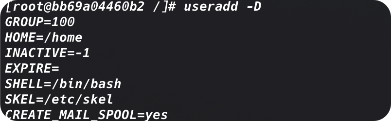

> 一些Linux发行版会把Linux用户和组工具放在`/usr/sbin`目录下，这个目录可能不在PATH环境变量里。如果你的Linux系统时这样的话，可以将这个目录添加进PATH环境变量，或者用绝对文件路径名来使用这些工具。

在创建新用户时，如果我们不再命令行中指定具体的值，`useradd`命令就会使用`-D`选项所显示的那些默认值。这个例子给出的默认值如下：

+ 新用户会被添加到GID为100的公共组
+ 新用户的HOME目录将会位于`/home`
+ 新用户账户密码在过期后不会被禁用
+ 新用户账户不会过期
+ 新用户账户将bash shell作为默认shell
+ 系统会将`/etc/skel`目录下的内容复制到用户的HOME目录下
+ 系统为该用户账户在mail目录下创建一个用于接收邮件的文件

倒数第二个值很有意思。`useradd`命令允许管理员创建一份默认的HOME目录配置，然后把它作为创建用户HOME目录的木板。这样就能自动在每个新用户的HOME目录里防止默认的系统文件。

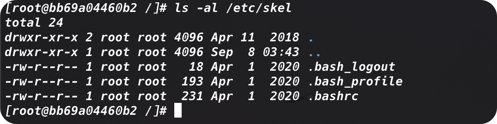

这些文件时bash shell环境的标准启动文件。系统会自动将这些默认文件复制到你创建的每个用户的HOME目录。

要想在创建用户时改变默认值或默认行为，可以使用命令行参数。

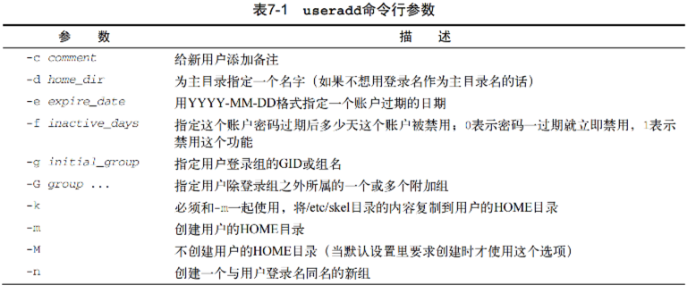

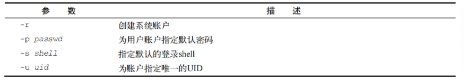

我们在创建新用户账户时可以使用命令行参数来更改系统指定的默认值。但如果总需要修改某个值的话，最好还是修改一下系统的默认值。

可以在`-D`选项后跟上一个指定的值来修改系统默认的新用户设置。

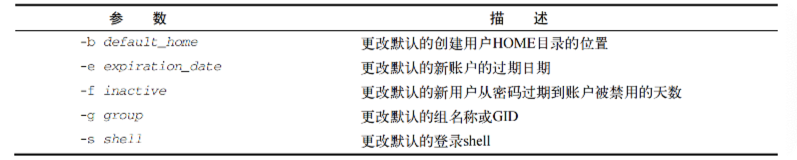

例如：

```shell
useradd -D -s /bin/tsch
```

## 删除用户——`userdel`

默认情况下，`userdel`命令只会删除`/etc/passwd`文件中的用户信息，而不会删除系统中属于该账户的任何文件。

如果加上`-r`参数，`userdel`会删除用户的HOME目录以及邮件目录。然而，系统上仍可能存有已经删除用户的其他文件。这在有些环境中会造成问题。

> **警告**
>
> 在有大量用户的环境中使用`-r`参数时要特别小心。你永远不知道用户是否在其HOME目录下存放了其他用户或其他程序要使用的重要文件。

## 修改用户

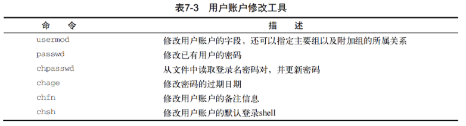

### `usermod`

`usermod`命令是用户账户修改工具中最强大的一个。它能用来修改`/etc/paswd`文件中的大部分字段，只需要用于想修改的字段对应的命令行参数就行了。参数大部分跟`useradd`命令的参数一样。除此之外，还有另外一些可能排上用场的选项：

+ `-l`：修改用户账户的登录名
+ `-L`：锁定账户，使用户无法登陆

+ `-p`：修改账户的密码
+ `-U`：解锁锁定，使用户能够登录

`-L`选项尤其适用。它可以将账户锁定，使用户无法登陆，同时无需删除账户和用户的数据。要让账户恢复正常，只需要使用`-U`选项即可。

### `passwd` & `chpasswd`

#### `passwd`——修改单个用户密码

改变用户密码的一个简便方法就是用`passwd`命令。

```shell
[root@bb69a04460b2 liuyuan]# passwd liuyuan
Changing password for user liuyuan.
New password:
Retype new password:
passwd: all authentication tokens updated successfully.
```

如果只使用`passwd`命令，而不添加任何的参数的话，它会修改你的密码。**系统上的任何用户都能改自己的密码，但只有root用户才有权限修改别人的密码。**

`-e`选项更够强制用户下次登陆的时候修改密码。我们可以先给用户设置一个简单的密码，之后再强制在下次登陆的时候改成他们能够记住的复杂密码。

#### `chpasswd`——修改多个用户密码

如果需要为系统中的大量用户修改密码，`chpasswd`命令事半功倍。`chpasswd`命令能从标准输入自动读取登录名和密码对（由冒号分割）列表，给密码加密，然后为用户账户设置。我们当然可以使用重定向符来提供登录名和密码对。

```shell
chpasswd < users.txt
```

### `chsh` & `chfn` & `chage`

> `chsh`/`chfn`/`chage`用于修改特定的账户信息

#### `chsh`——快速修改默认的用户登录shell

> change shell

使用的时候必须用shell的全路径名作为参数，不能只用shell名。

```shell
chsh -s /bin/csh test # 为test用户设置默认shell为/bin/csh
```

#### `chfn`——在`/etc/passwd`的备注字段中储存信息

> change finger

#### `chage`——设置用户的有效时间

> Change age


`change`命令的日期值可以使用任意一种：

+ YYYY-MM-DD格式的日期
+ 代表从1970年1月1日起到该日期天数的数值

# 使用Linux组

> 用户账户在控制单个用户安全性方面很好用，但涉及在共享资源的一组用户时就捉襟见肘了。为了解决这个问题，Linux系统采用了另一个安全概念——组（group）

组权限允许多个用户对系统中的对象（比如文件、目录或设备等）共享一组共用的权限。

Linux发行版在处理默认组的成员关系时略有差异。有些Linux发行版会创建一个组，把所有用户都当做这个组的成员。遇到这样的情况要特别小心，因为文件很有可能对其他用户也是可读的。有些发行版会为每个用户创建单独的组，这样会更安全一些。

每个组都有唯一的GID——跟UID类似，在系统上这是个唯一的值。除了GID，每个组还有唯一的组名。

## `/etc/group`

与用户账户类似，组信息也保存在系统的一个文件中。`/etc/group`文件包含系统上用到的每个组的信息。

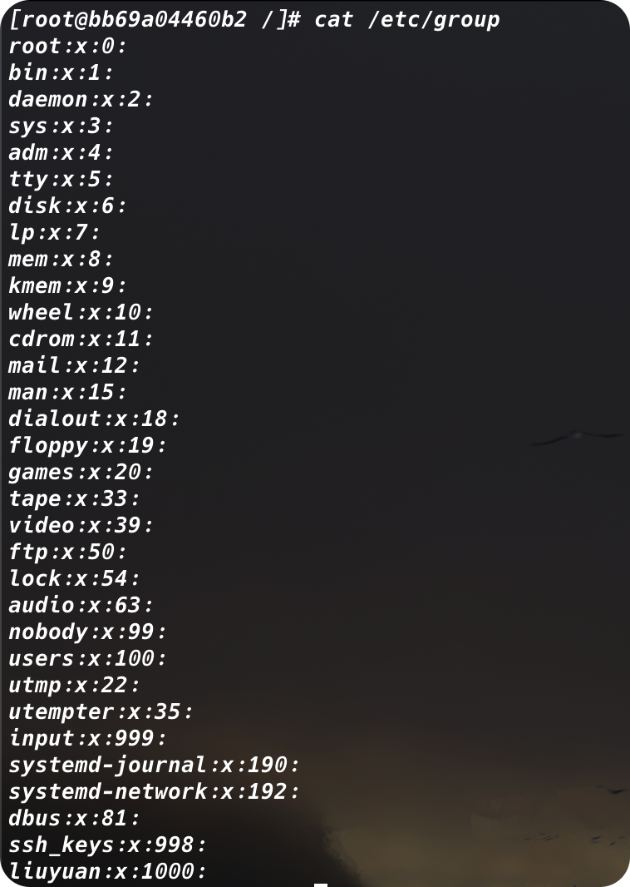

和UID一样，GID在分配时也采用了特定的格式。系统账户用的组通常会分配低于500的GID值，而用户组的GID则会从500开始分配。`/etc/group`文件有4个字段：

+ 组名
+ 组密码
+ GID
+ 属于改组的用户列表

组密码允许非组内成员通过它临时成为该组成员。这个功能并不普遍，但确实存在。

千万不要通过直接修改`/etc/group`文件来添加用户到一个组，要用`usermod`命令。在添加用户到不同的组之前，首先得创建组。

> **有些组并没有列出用户。这并不是说这些组没有成员。当一个用户在`/etc/passwd`文件中指定某个组作为默认组时，用户账户不会作为该组成员再出现在`/etc/group`文件中。**

## 创建新组——`groupadd`

`groupadd`命令可以在系统上创建新组。

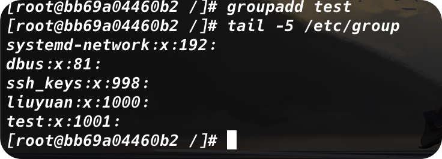

在创建新组的时候，默认没有用户被分配到改组。`groupadd`命令没有提供将用户添加到组中的选项，但是可以用`usermod`命令来弥补这一点。

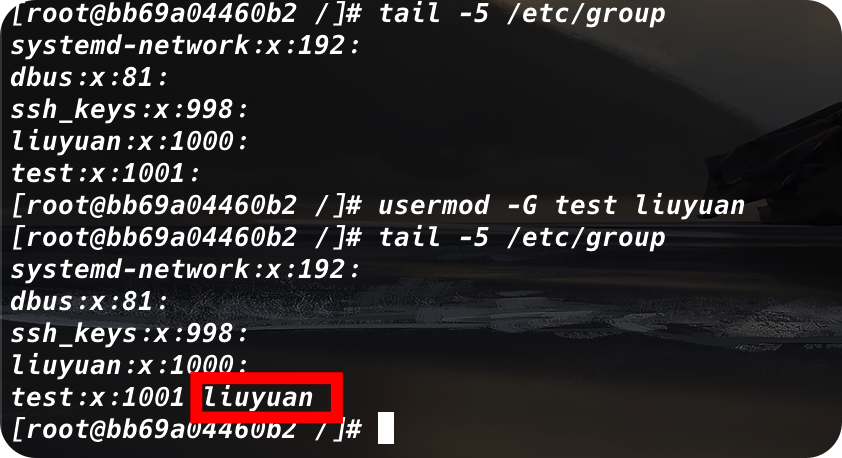

`usermod`命令的`-G`选项会把这个新组添加到该用户账户的组列表里。

> 如果更改了已经登录系统账户所属的用户组，该用户必须登出系统后再登录，组关系的更改才能生效

> **为用户账户分配组的时候需要格外小心。如果加了`-g`选项，指定的组名会替换掉该账户的默认组。`-G`选项则将该组添加到用户的属组的列表里，不会影响默认组。**

## 修改组——`groupmod`

`groupmod`命令可以修改已有组的GID（`-g`）或者组名（`-n`）。

```shell
groupmod -n <new name> <group name>
```

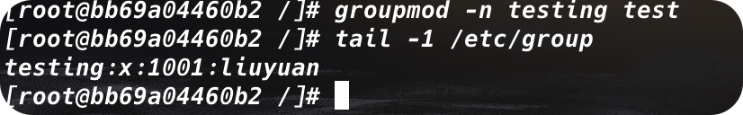

修改组名的时候，GID和组成员不会改变，只有组名改变。由于所有的安全权限都是基于GID的，因此我们可以随意改变组名而不会影响文件的安全性。

# 了解文件权限

## 使用文件权限符

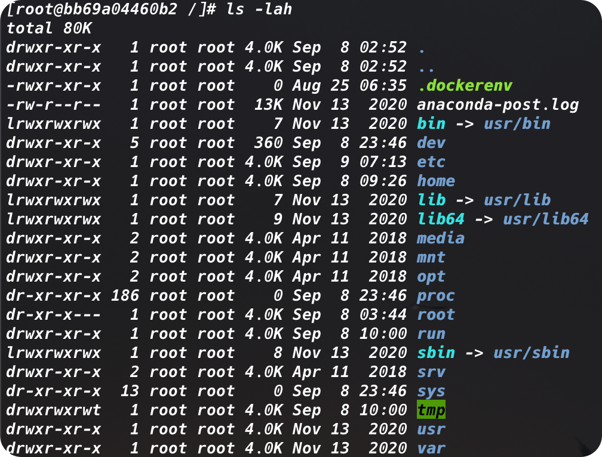

### 字段的第一个字符代表了对象的类型

+ `-`：文件
+ `d`：目录
+ `l`：链接
+ `c`：字符型设备
+ `b`：块设备
+ `n`：网络设备

### 之后的三组三字符的编码定义了访问权限

#### 访问权限

+ `r`：对象是可读的
+ `w`：对象是可写的
+ `x`：对象是可执行的

若没有某种权限，该权限位会出现单破折线。

#### 谁的权限

+ 第一组：对象的属主
+ 第二组：对象的属组
+ 第三组：系统其他用户

```shell
-rwxrw-r-- 1 liuyuan liuyuan 0 Sep  9 07:34 test
```

文件`.test`下面有3组权限：

+ `rwx`：文件的属主（设为登录名`liuyuan`）
+ `rw-`：文件的属组（设为组名`liuyuan`）
+ `r--`：系统上其他人

这些权限说明登录名为`liuyuan`的用户可以读取、写入和执行这个文件（拥有全部权限）；类似地，`liuyuan`组的成员可以读取、写入这个文件。然而不属于`liuyuan`组的其他用户只能读取这个文件；

## 默认文件权限——`umask`

在创建一个文件的时候，文件的权限是如何确定的呢？答案是`umask`。`umask`命令用来设置所创建文件的目录和默认权限。

`umask`命令可以显示和设置这个默认权限

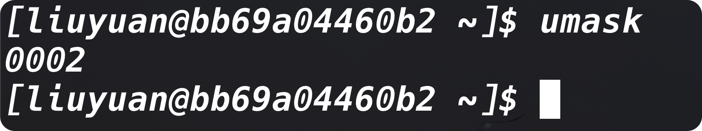

遗憾的是，`umask`命令设置没有如此简单明了，要想弄明白其工作原理就更混乱了。第一位代表了一项特别的安全特性，叫做**黏着位(sticky bit)**；剩余位表示文件或目录对应的`umask`八进制值。

### 八进制模式的安全性设置

>  要理解`umask`是怎么工作的，得先理解八进制模式的安全性设置。

八进制模式的安全性设置先获取`rwx`权限的值，然后将其转换为3位2进制值，用一个八进制值来表示。在这个二进制表示中，每个位置代表一个二进制位。因此，如果读权限是唯一的权限，权限值就是`r--`，用二进制表示就是`100`，代表的八进制值是4。

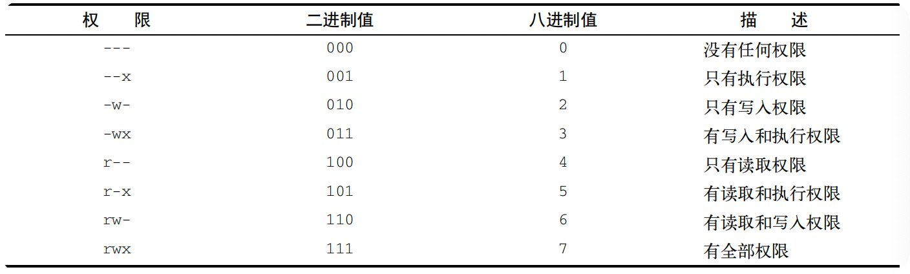

八进制模式首先获取权限的八进制值，然后再把这三组安全级别（属主，属组和其他用户）的八进制值顺序列出。因此，八进制模式的值664代表`rw-rw-r--`

### `umask`是如何作用的

了解八进制模式权限是怎么工作的后，`umask`值反而令人疑惑。我们的默认的`umask`八进制是`0002`，而我们创建的文件的八进制权限却是664，这是如何得来的？

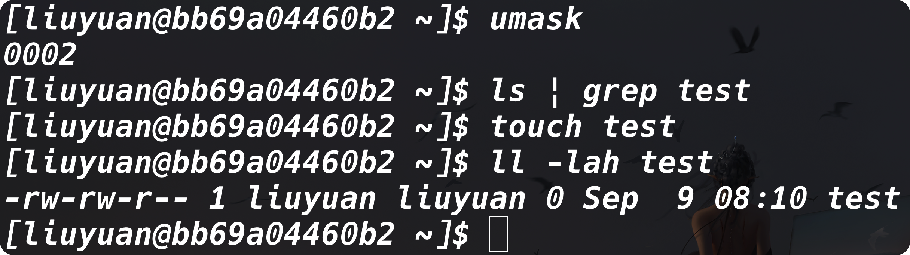

`umask`只是一个掩码，它会屏蔽掉不想授予的安全级别的权限，也就是说，**`umask`值会被从对象的全权限值中减掉**。

***对文件来说，全权限的值是666（所有用户都有读写权限）；对目录来说，则是777.***

所以在上面的例子中，文件一开始的权限是666，减去`umask`值002之后，剩下的文件权限就成了664。

### `umask`在哪

在大多数Linux发行版中，`umask`值通常会设置在`/etc/profile`自动文件中，不过有一些是设置在`/etc/login.defs`文件中的（例如Ubuntu）。可以用`umask`命令为默认`umask`设置指定一个新值。

```shell
umask 026
```

# 改变安全性设置

## 改变权限——`chmod`

> 改变文件和目录的安全性设置

```shell
chmod options mode file
```

### 八进制模式

`mode`参数可以使用八进制模式和符号模式进行安全性设置。八进制模式设置非常直观，直接用期望赋予文件的标准3位八进制权限码即可。

```shell
chmod 760 newfile
```

### 符号模式

符号模式就更为复杂：

```shell
[ugoa][+-=][rwxXstugo...]
```

#### 第一组字符定义了权限作用的对象

+ `u`：用户
+ `g`：组
+ `o`：其他
+ `a`：代表上述所有

#### 第二组字符表示想在现有基础上做的改动

+ +：想在现有基础上增加
+ -：移除
+ =：设置为

#### 第三个符号代表额外作用到设置上的权限

额外的设置有以下几项：

+ X：如果对象是目录或者已经有执行权限，赋予执行权限
+ s：运行时重新设置UID或GID
+ t：保留文件或目录
+ u：将权限设置为跟属主一样
+ g：将权限设置为跟属组一样
+ o：将权限设置为跟其他用户一样

例如：

```shell
chmod o+r newfile
```

不管其他用户在这一安全级别之前都有什么权限，`o+r`都给这一级别添加读取读取权限

**注意`ls`命令的`-F`选项，它能够在具有执行权限的文件名后添加一个`*`**

#### 使用`options`

`options`为`chmod`命令提供了一些额外功能：`-R`可以让权限的改变递归地作用到文件和子目录，然后利用一条命令将权限更改应用到这些文件上

## 改变所属关系——`chown` & `chgrp`

> `chown`命令用来改变文件的属主，`chgrp`用来改变文件的默认属组

### `chown`

```shell
chown options owner[.group] file
```

我们可以用登录名或者UID来指定文件的新属主。

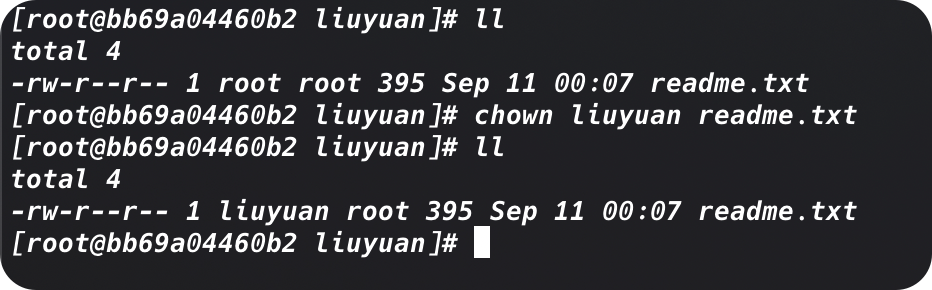

`chown`命令也支持同时改变文件的属主和属组：

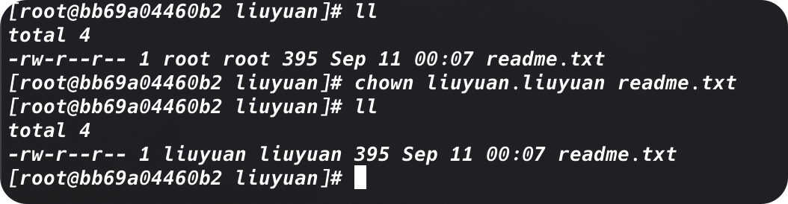

当然我们可以只改变默认属组：

```shell
chown .liuyuan readme.txt
```

如果我们的Linux系统采用和用户登录名匹配的组名，我们可以只用一个条目就改变二者：

```shell
chown liuyuan. readme.txt
```

******

`chown`命令采用一些不同的选项参数：

+ `-R`：配合通配符可以递归地改变子目录和文件的所属关系
+ `-h`：改变改文件的所有符号链接文件的所属关系

> 只有root用户能够改变文件的属主。任何属主都可以改变文件的属组，但前提是属主必须是原属组和目标属组的成员

### `chgrp`

```shell
chgrp group_name file_name
```

用户账户必须是这个文件的属主，除了能够更换属组之外，还得是新组的成员。

# 共享文件

Linux系统上共享文件的方法是创建组。但在一个完整的共享文件的环境中，事情会复杂的多。

如果我们想在大范围环境中常见文档并将文档与人共享，这会很繁琐。幸好有一种简单的方法可以解决这个问题。Linux还未每个文件和目录存储了3个额外的信息位：

+ 设置用户ID（SUID）：当文件被用户使用的时候，程序会以文件属主的权限运行
+ 设置组ID（SGID）：对文件来说，程序会以文件属组的权限运行；对目录来说，目录中创建的新文件会以目录的默认属组作为默认属组
+ 黏着位：进程结束后文件还驻留（黏着）在内存中

SGID对文件共享非常重要。启用SGID之后，我们可以强制在一个共享目录下创建的新文件都属于该分组的属组，这个组也就成为了每个用户的属组。

## 使用`chmod`设置SGID

SGID可以通过`chmod`命令设置。他会加到标准3位八进制之前（组成4位八进制值），或者在符号模式下用`s`显示


因此，要创建一个共享目录，使目录里的新文件都能沿用目录的属组，只需要将该目录的SGID位置位。

```shell
# 首先，创建希望共享的目录
[root@bb69a04460b2 home]# mkdir testdir
[root@bb69a04460b2 home]# ls testdir -ld
drwxr-xr-x 2 root root 4096 Sep 11 06:11 testdir
# 更改目录的属组
[root@bb69a04460b2 home]# chgrp liuyuan testdir/
# 为目录添加SGID位置位，保证目录中新建的文件都用liuyuan作为默认属组
[root@bb69a04460b2 home]# chmod g+s testdir/
[root@bb69a04460b2 home]# ls testdir -ld
drwxr-sr-x 2 root liuyuan 4096 Sep 11 06:13 testdir
# 为了让环境能够正常工作，所有组成员都需要把他们的umask设置成文件对属组成员可写
[root@bb69a04460b2 home]# umask 002
[root@bb69a04460b2 home]# cd testdir/
# 新文件会沿用目录的属组，而不是用户的默认属组
# 现在liuyuan组的所有用户都能访问这个文件了
[root@bb69a04460b2 testdir]# touch testfile
[root@bb69a04460b2 testdir]# ls -l
total 0
-rw-rw-r-- 1 root liuyuan 0 Sep 11 06:13 testfile
[root@bb69a04460b2 testdir]#
```

