[TOC]

# 使用多个命令

shell脚本的关键在于输入多个命令并处理每个命令的结果，甚至需要将一个命令的结果传给另一个命令。shell可以让我们把多个命令串起来，一次执行完成。如果要两个命令一起运行，可以把它们放在同一行中，彼此间用多个分号隔开。

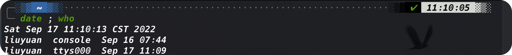

date命令先运行，显示了当前日期和时间，后面紧跟着who命令的输出，显示当前是谁登陆到了系统上。使用这种方法就能将任意多个命令连在一起使用了，只要不超过最大命令行字符数255就行。

这种技术对于小型脚本尚可，但是由一个很大的缺陷：每次运行之前，我们都需要再命令提示符下输入整个命令。可以将这些命令组合成一个简单的文本文件，这样就不需要在命令行中手动输入了。在需要运行这些命令时，只需要运行这个文本文件就可以了。

# 创建shell脚本

要将shell命令放到文本文件中，首先需要用文本编辑器来创建一个文件，然后将命令输入到文件中。

**在创建shell脚本文件的时候，必须在文件的第一行指定要使用的shell。**其格式为：

```shell
#! /bin/bash
```

在通常的shell脚本中，井号用于作注释行。shell并不会处理shell脚本中的注释行。然而，shell及哦啊本文件的第一行是个例外。`#`后面的感叹号会告诉shell用哪个shell来运行脚本。

在指定了shell之后，就可以在文件的每一行输入命令，然后加一个回车符。


现在我们可以运行脚本了：


正如第六章所述，shell通过`PATH`环境变量来查找命令。要让shell找到`test1`命令，只需要采取下列两种方法之一：

+ 将shell脚本所处的目录添加到`PATH`变量之中
+ 在提示符中用绝对或相对路径来引用shell脚本


可以看到，我们依然不能运行这个文件。我们可以查看一下文件的权限：

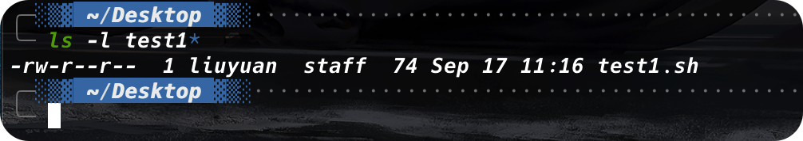

可以看到，这个文件不具有执行权限。我们可以使用`chmod`来赋予文件属主执行文件的权限：

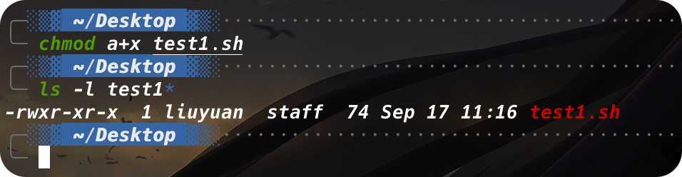

运行：

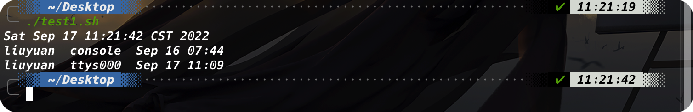

# 显示消息

大多数shell命令都会产生自己的输出，这些输出会显示在脚本所运行的控制台显示器上。很多时候，我们可能会想要添加文本信息来让脚本告诉用户他正在做什么。我们可以使用`echo`命令来实现这一点：


需要注意，在默认情况下，不需要使用引号将要显示的文本字符串划定出来。但有时，在字符串中出现引号的话就比较麻烦了：


`echo`命令可以用单引号或双引号来划定文本字符串。如果在字符串中用到了它们，我们需要使用另一种引号来把整个字符串划定起来：


如果我们不想让`echo`输出内容之后换行，我们可以：

```shell
echo -n "<content>"
```


# 使用变量

运行shell脚本中的单个命令自然有用，但是其自身也有限制。通常我们会需要在shell命令中使用其他数据来处理信息。这可以通过变量来实现。变量允许我们临时性地将信息存储在shell脚本中，以便和脚本中的其他命令一起使用。

## 环境变量

我们已经看到过Linux的一种变量在实际中的应用。shell维护着一组变量，用来记录特定的系统信息。比如系统的名称，登录到系统上的用户名、用户的系统ID、用户的默认主目录以及shell查找程序的搜索路径。可以用`set`来显示一份完整的当前环境变量列表：

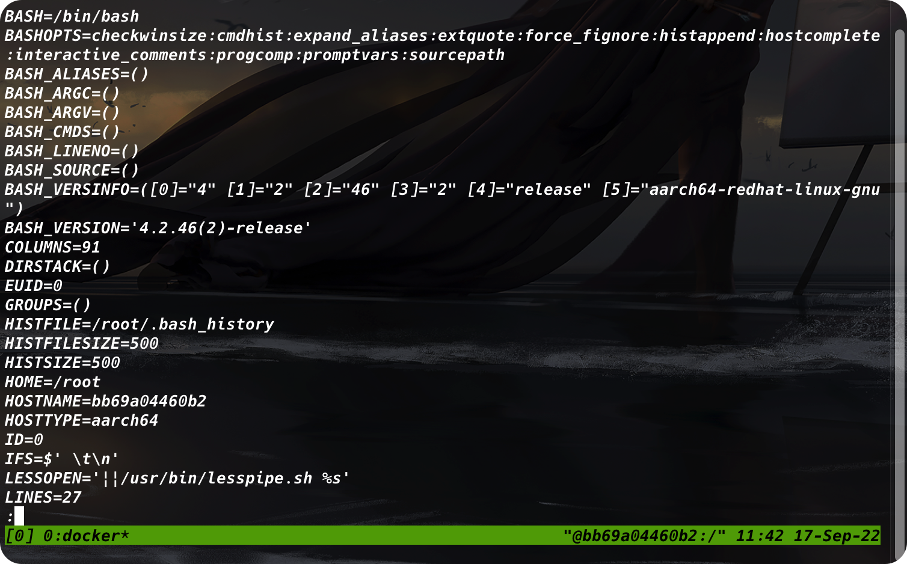

在脚本中，我们可以在环境变量名称之前加上美元符`$`来使用这些环境变量：

```shell
#! /bin/bash
# display user information from the system
echo "User info for userid: $USER"
echo UID: $UID
echo HOME: $HOME
```


注意，`echo`命令中的环境变量会在脚本运行时替换成当前的值。另外，在第一个字符串中可以将`$USER`系统变量放置到双引号中，而shell依然能够知道我们的意图。但采用这种方法也有一个问题。看看下面这个例子：


显然这不是我们想要的，系统会以为我们想要获得环境变量`15`的值，而其实并不是。遇到这样的情况，我们需要添加一个反斜线：


> 你可能还见过通过`${variable}`形式引用的变量名。变量名两侧额外的花括号通常用来帮助识别美元符后的变量名。

## 用户变量

除了环境变量，shell脚本还允许在脚本中定义和使用自己的变量。定义变量允许临时存放数据并在整个脚本中使用，从而使shell脚本看起来像真正的计算机程序。

用户变量可以是任何由字母、数字或下划线组成的文本字符串，长度不超过20。用户变量区分大小写，所以变量`var1`和`Var1`是不同的。

使用等号将值赋给用户变量。在变量、符号和值之间不能出现空格。

```shell
var1=10
var2=57
var3=testing
var4="still more testing"
```

shell脚本会自动决定变量值的数据类型。在脚本的整个生命周期里，shell脚本中定义的变量会一直保持着它们的值，但在shell脚本结束的时候会被删除掉。

与系统变量类似，用户变量可以通过美元符引用：

```shell
#! /bin/bash
# testing cariables
days=10
guest="Katie"
echo "$guest checked in $days days ago"
days=5
guest="Jessica"
echo "$guest checked in $days days ago"
```


变量每次被应用时，都会输出当前赋给它的值。重要的是，引用一个变量的时候需要使用美元符，而引用变量来对其进行赋值的时候则不需要使用美元符。

```shell
#! /bin/bash
# assuming a variable value to another variable
value1=10
value2=$value1
echo The resulting value is $value2
```


如果我们不小心写成了：

```shell
value2=value1
```

那么输出就会是：`The resuling value is value1`

## 命令替换

shell脚本中最有用的特性之一就是可以从命令输出中提取信息，并将其赋值给变量。把输出赋给变量之后，就可以随意在脚本中使用了。这个特性在处理脚本数据时尤其方便。

有两种方式可以将命令的输出赋值给变量：

+ 反引号`
+ `$()`格式

要注意反引号字符，这不是字符串用的那个单引号字符。由于在shell脚本之外很少用到，你可能都不知道在键盘什么地方可以找到这个字符，但是这是shell脚本中的重要组件。

命令替换允许我们将shell命令的输出赋值给变量。尽管这看起来不是那么重要，但是它确实脚本编程中的一个重要组成部分。

要么用一对反引号把整个命令行命令围起来：

```shell
testing=`date`
```

要么使用`$()`格式：

```shell
testing=$(date)
```

shell会运行命令替换符号中的命令，并将输出赋值给变量。

下面这个例子很常见，它在脚本中通过命令替换获得当前日期并用它来生成唯一文件名：

```shell
#! /bin/bash
# copy the /usr/bin directory to a log file
today=$(date +%y%m%d)
ls -al /usr/bin > log.$today
```


`today`变量是被赋予格式化后的`date`命令的输出。这是提取日期信息来生成日志文件名常用的一种技术。`+%y%m%d`告诉`date`命令将日期显示为两位数的年月日的组合。

> **警告**
>
> 命令替换会创建一个子shell来运行对应的命令。子shell是由运行该脚本的shell所创建出来的一个独立的子shell。正因如此，由该子shell所执行命令是无法使用脚本中所创建的变量的。
>
> 在命令行提示符下使用路径`./`运行命令的话，也会创建出子shell；要是运行命令的时候不加入路径，就不会创建子shell。如果我们使用的是内建的shell命令，并不会涉及子shell。

# 重定向输入和输出

> 有时候你想要保存某个命令的输出而不仅仅只是让它显示在显示器上。bash shell提供了几个操作符，可以将命令的输出重定向到另一个位置（比如文件）。重定向可以用于输入，也可以用于输出，可以将文件重定向到文件输入。

## 输出重定向

最基本的重定向是将命令的输出发送到一个文件中。bash shell使用大于号来完成这项功能：

```shell
command > outputfile
```

之前显示器上出现的命令输出会被保存到指定的输出文件中。

如果输出文件已经存在了，重定向操作符会用心的文件数据覆盖已有文件。有时，我们可能斌不想覆盖文件原有内容，而是想要将命令的输出追加到已有文件中，比如我们正在创建一个记录系统上某个操作的日志文件。在这种情况下，我们可以使用双大于号（>>）来追加数据：

```shell
command >> outputfile
```


## 输入重定向

输入重定向和输出重定向正好相反。输入重定向将文件的内容重定向到命令，而非将命令的输出重定向到文件。

输入重定向符号是小于号（<）：

```shell
command < inputfile
```

一个简单的记忆方法就是：在命令行上，命令总是在左侧，而重定向符号“指向”数据流动的方向。小于号说明数据正在从初入文件流向命令。

例如：

```shell
wc < inputfile
```

`wc`命令可以对数据中的文本进行计数。默认情况下，它会输出3个值：

+ 文本的行数
+ 文本的词数
+ 文本的字节数

通过将文本文件重定向到`wc`命令，我们就可以得到文件中的行、词和字节的计数。

还有另外一种输入重定向的方法，称为*内联输入重定向（inline input redirection）*。这种方法无须使用文件进行重定向，只需要在命令行中指定用于输入重定向的数据就可以了。乍看一眼，这可能有点奇怪，但是有些应用会用到这种方式。

内联输入重定向负号是远小于符号（<<）。除了这个符号，我们必须制定一个文本标记来划分输入数据的开始和结尾。任何字符串都可以作为文本标记，但是在数据的开始和结尾文本标记必须一致。

```shell
command << marker
data
marker
```

在命令行上使用内联输入重定向时，shell会用PS2环境变量中定义的次提示符来提示输入数据，下面是使用情况：

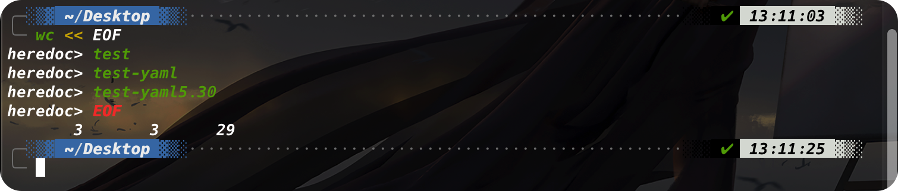

次提示符会持续提示，以获取更多的输入数据，直到我们输入了作为文本标记的那个字符串。`wc`命令会对内联输入重定向提供的数据进行行、词和字节计数。

# 管道

加入我们想让一个命令的输出作为另一个命令的输入，我们就需要使用管道连接（piping）。

>  和命令替换所用的反引号一样，管道符号在shell编程之外也很少用到。该符号由两个竖线组成，一个在另一个上面。然而管道符号的印刷体通常看起来更像是单个竖线。

管道被放在命令之间，将一个命令的输出重定向到另一个命令中：

```shell
command1 | command2
```

***不要以为由管道串起得两个命令会一次执行。***Linux系统实际上会同时运行这两个命令，在系统内部将它们连接起来。在第一个命令产生输出的同时，输出会被立即送给第二个命令。数据传输不会用到任何中间文件或缓冲区。

我们可以在一条命令中使用任意多条管道。可以持续地将命令的输出管道传给其他命令来细化操作：

```shell
rpm -qa | sort | more
```

当然我们也可以加上重定向：

```shell
rpm -qa | sort > rpm.list
```

# 执行数学运算

## 两种方法

### `expr`

`expr`命令能够识别少数的数学和字符串操作符：

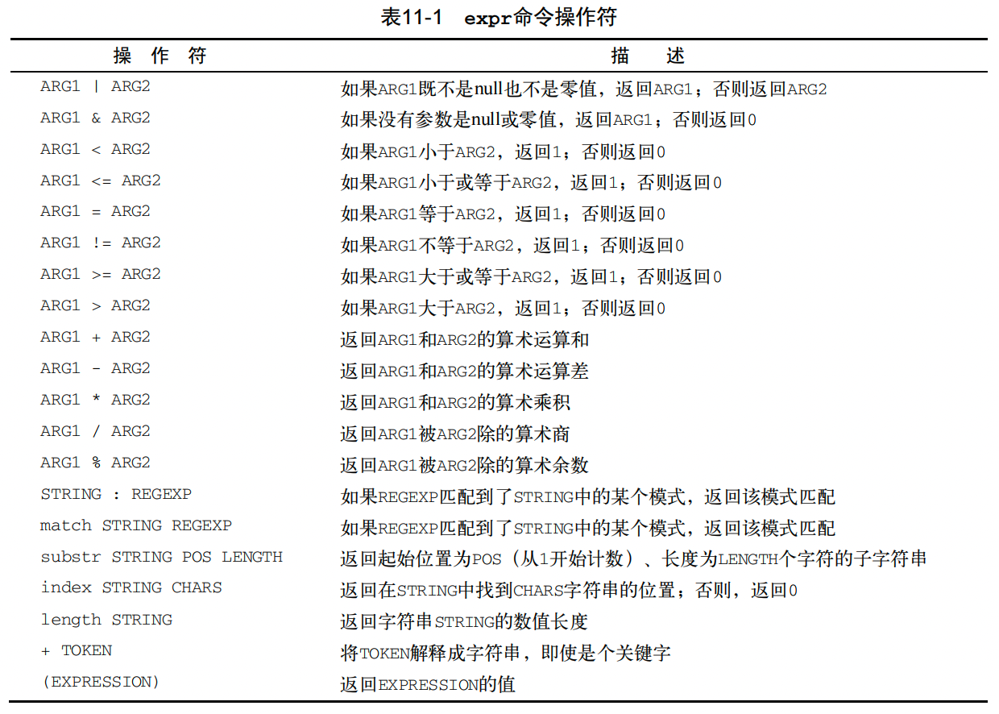

尽管标准操作符`expr`命令中做得很好，但在脚本或命令行上使用它们时仍有问题出现。许多`expr`命令操作符在`shell`中另有定义（比如星号）。当它们出现在`expr`命令中的时候，会有一些诡异的结果：


要解决这个问题，对于那些容易被shell错误解释的字符，在它们传入`expr`命令之前，需要使用shell的转义字符（反斜线）将其标出来。


在shell脚本中使用`expr`命令也同样复杂：

```shell
#! /bin/bash
# An example of usign the expr command
var1=10
var2=20
var3=$(expr $var2 / $var1)
echo The result is $var3
```


### 使用方括号

在bash中，将一个数学运算结果赋给某个变量时，可以用美元符和方括号（`$[operation]`）将数据表达式围起来：

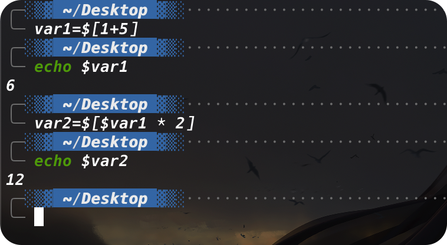

这种技术也同样适用于shell脚本：

```shell
#! /bin/bash
var1=100
var2=50
var3=45
var4=$[$var1 * ($var2 - $var3)]
echo $var4
```

***在使用方括号来计算公式的时候，不用担心shell会误解乘号或其他符号。***shell知道它不是通配符，因为它在方括号内。

### shell运算的缺陷

在bash shell脚本中进行算术运算会有一个主要限制——只支持整数运算。

## 浮点解决方案——`bc`

### `bc`的基本用法

bash计算器实际上是一种编程语言，它允许在命令行中输入浮点表达式，然后解释并计算改表达式，最后返回结果。

bash计算器能够识别：

+ 数字：整数和浮点数
+ 变量：简单变量和数组
+ 注释：以#或者`/**/`
+ 表达式
+ 编程语句（`if-then`）
+ 函数

我们可以在shell提示符下通过`bc`命令访问bash计算器：

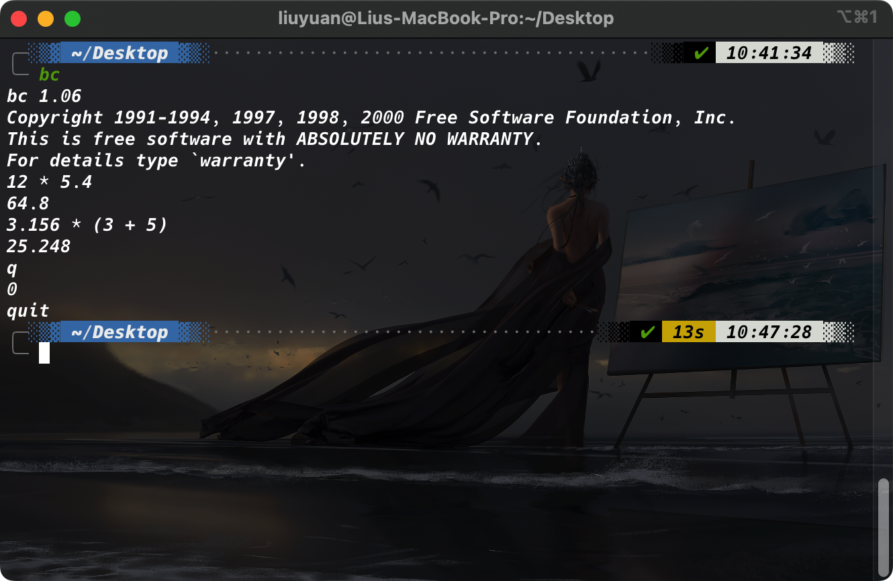

浮点运算是由内建变量`scale`控制的，必须将这个值设置为我们希望在计算结果中保留的小数位数，否则无法获得期望的结果：

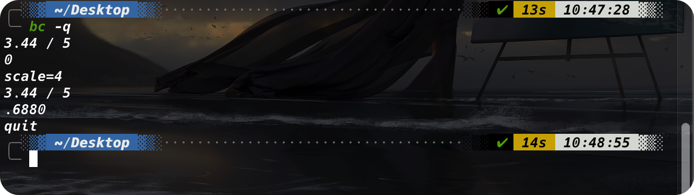

> `bc -q`会省略程序启动时的版本信息

`scale`变量的默认值是0.在`scale`被设置前，bash计算器的计算结果不包含小数位。在将其设置成4后，bash计算器显示的结果包含四位小数。

除了普通数字，bash计算器还能支持变量。

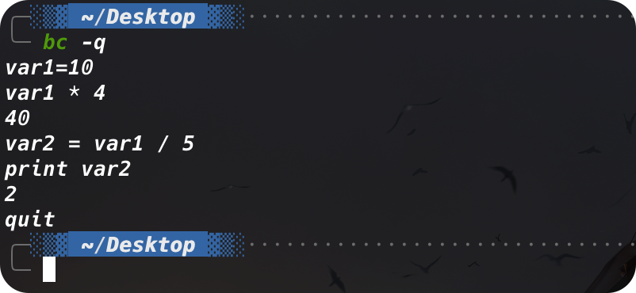

### 在脚本中使用bc

```shell
variable=$(echo "<options>; <expression>" | bc)
```

第一部分`<options>`允许我们设置变量。如果我们需要设置不止一个变量，可以用分号将其分开。`expression`参数定义了通过`bc`执行的数学表达式：

```shell
#! /bin/bash
var1=$(echo "scale=4; 3.44 / 5" | bc)
echo The answer is $var1
```

当然，我们也可以使用定义好的变量：

```shell
#! /bin/bash
var1=100
var2=45
var3=$(echo "scale=4; $var1 / $var2" | bc)
echo The answer for this is $var3
```

这些方法适用于较短的运算，但有时我们会设计更多的数字。如果需要进行大量运算，在一个命令行中列出多个表达式就会有些麻烦。

有一个方法可以已解决这个问题：`bc`命令能够识别输入重定向，允许我们将一个文件重定向到`bc`命令来处理。但这样同样会让人头疼，因为我们还得把表达式存放到文件中。

最好的方法就是使用内联输入重定向，它允许我们直接在命令行中重定向数据：

```shell
variable=$(bc << EOF
<options>
<statements>
<expressions>
EOF
)
```

举个栗子：

```shell
#! /bin/bash

var1=10.46
var2=43.67
var3=33.2
var4=71

var5=$(bc << EOF
scale=4
al = ($var1 * $var2)
bl = ($var3 * $var4)
a1 + b1
EOF
)

echo The final answer for this mess is $var5
```

需要注意的是，我们可以在bash计算器中赋值给变量。这一点很重要：在bash计算其中创建的变量只在bash计算器中有效，不能在shell脚本中使用

# 退出脚本

shell中运行的每个命令都使用退出状态码（eixt status）告诉shell它已经运行完毕。退出状态码是一个0~255的整数值，在命令结束时由命令传给shell。我们可以捕获这个值并在脚本中使用。

## 查看退出状态码——`$?`

```shell
echo $?
```

按照惯例，一个成功结束的命令的退出状态码是0.如果一个命令结束时由错误，退出状态码就是一个正数值：


Linux错误退出状态码没有什么标准可循，但是有一些参考：

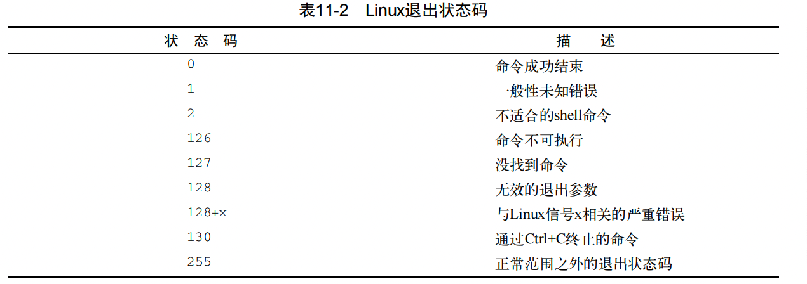

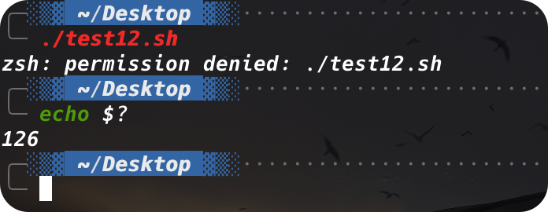

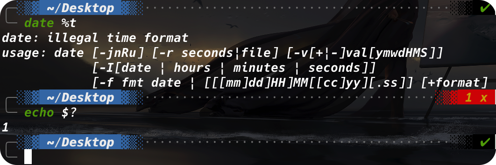

## `exit`

默认情况下，shell脚本会以脚本中的最后一个命令的退出状态码退出。

我们可以改变这种默认行为，返回自己的退出状态码。

```shell
exit <status code>
```

当然，我们也可以使用变量：

```shell
exit $var
```

需要注意的是，如果退出状态码超出了这个范围，shell会通过模运算得到这个结果。