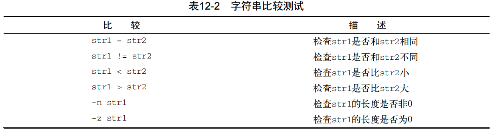

[TOC]

# 使用`if-then`语句

`if-then`语句的基本格式是：

```shell
if command
then
	commands
fi
```

bash shell的`if`语句会运行`if`后面的那个命令。如果该命令的退出状态码是0（成功运行），位于`then`部分后面的命令就会被执行。如果该命令的退出状态码是其他值，那么`then`后面的内容就不会被执行，bash shell会继续执行脚本中的下一个命令。

这里有一个简单的例子：

```shell
#! /bin/bash
# testign the if statement
if pwd
then
	echo "It worked"
fi
```

如果我们放置一个错误的命令，bash shell就会跳过`then`后面的部分。还要注意的是，运行`if`语句中的那个错误命令所生成的错误消息依然会显示在脚本的输出中。

> 我们还可以这样写：
>
> ```shell
> if command; then
> 	commands
> fi
> ```
>
> 这样看起来更像其他编程语言

# `if-then-else`

```shell
if command
then
	commands
else
	commands
fi
```

# 嵌套`if`

```shell
if command1
then
	commands
elif comman2
	more commands
fi
```

# 在`if`中使用条件

## `test`与`[]`

### `test`

到目前为止，在`if`中看到的都是普通的shell命令。我们想知道的是，`if-then`语句是否能测试命令退出状态码之外的条件。

但是不能，但是我们可以使用`test`。

`test`命令的格式非常简单：

```shell
test condition
```

`condition`是`test`命令要测试的一系列参数和值。我们可以这样使用：

```shell
if test condition
then
	commands
fi
```

如果我们只写了`test`，而不提供`conditon`，`test`将返回一个非0状态码。

我们可以利用这个性质来测试一个变量中是否有内容：

```shell
#! /bin/bash
# Testing the test command

my_variable="Full"

if test $my_variable
then
	echo "The $my_variable expresstion returns a True"
else
	echo "The $my_variable expresstion returns a False"
fi;
```

### `if [ condition ]`

```shell
if [ condition ]
then
	comands
fi
```

方括号定义了测试条件。注意，第一个方括号和第二个方括号之前必须加上一个空格，否则就会报错。

## 可以判断的三类条件

### 数值比较


在设计浮点值的时候，数值条件测试会有一个限制。需要记住的是，bash shell只能处理整数。如果我们要通过`echo`来显示这个值，是没有问题的；但在基于数组的函数中就不行了。

### 字符串比较



#### 字符串相等性

#### 字符串顺序

要测试一个字符串是否比另一个字符串大就是麻烦的开始。当要开始使用测试条件的大于或小于功能时，就会出现两个经常困扰shell程序员的问题：

+ 大于号和小于号必须转义，否则shell会把它们当做重定向负号，把字符串值当做文件名

    ```shell
    if [ $var1 \> $var2 ]
    ```

+ 大于和小于顺序和`sort`命令所采用的不同

    例如`test`和`Test`，在字符串比较中，采用的是ASCII顺序，`test`是大于`Test`的；在`sort`中，使用的是系统的本地化语言中定义的排序顺序，而对于英语顺序，`T`大于`t`

> `test`命令和测试表达式使用标准的数学比较符号来表示字符串比较，而用文本代码来表示数值比较。***如果我们对数值使用了数学运算符号，shell会将它们当成字符串值，可能无法得到正确的结果。***

#### 字符串大小

`-n`和`-z`可以检查一个变量是否含有数据。

> 空的和未初始化的变量会对shell脚本测试造成灾难性的影响。如果不是很确定一个变量的内容，最好在将其用于数值或字符串比较值钱先通过`-n`或者`-z`来测试一下变量是否含有值

## 文件比较

文件比较允许我们测试Linux文件系统上文件和目录的比较


这些测试条件使我们能够在shell脚本中检查文件系统中的文件。它们经常出现在需要进行文件访问的脚本中。

# 复合条件测试

`if-then`语句允许我们使用布尔逻辑来组合测试。有两种布尔运算符可用：

+ `[ condition1 ] && [ condition2 ]`
+ `[ condition1 ] || [ condition2 ]`

# `if-else`的高级特性

bash shell提供了两项可以在`if-else`语句中使用的高级特性。

## 使用双括号

***双括号命令允许我们在比较过程中使用高级数学表达式***。`test`命令只能在比较中使用简单的算术操作。双括号命令提供了更多的数学符号。

```shell
(( expresstion ))
```

`expression`可以是任意的数学赋值或比较表达式。


```shell
#! /bin/bash
# using double parenthesis
#
val1=10
#
if (( $val1 ** 2 > 90 ))
then
	(( val2 = $val1 ** 2 ))
	echo "The square of $var1 is $val2"
fi;
```

***注意，不需要将双括号中表达式里的大于号转义，这是双括号命令提供的另一个高级特性***

## 使用双方括号

```shell
[[ expression ]]
```

`expression`使用了`test`中采用的标准字符串比较。但它提供了`test`命令未提供的另一个特性：模式匹配（pattern matching）。

> 双方括号在bash shell中工作良好。不过要小心，不是所有的shell都支持双方括号。

在模式匹配中，可以定义一个正则表达式来匹配字符串的值：

```shell
#! /bin/bash
# using pattern matching
#
if [[ $USER == r* ]]
then
	echo "Hello $USER"
else
	echo "Sorry, I do not know you"
fi
```

在上面的脚本中，我们使用了双等号。双等号右边的字符串视为一个模式，并应用模式匹配规则。

# `case`

```shell
case <variable> in
pattern1 | pattern2)
	commands1;;
pattern3)
	commands2;;
*)
	default_commands;;
esac
```

`case`命令会将指定的变量与不同模式进行比较。如果变量和模式是匹配的，那么shell就会执行为该模式指定的命令。可以通过竖线操作符在一行中分隔出多个模式，星号会捕获所有与一直模式不匹配的值。

```shell
#! /bin/bash
# using the case command
#
case $USER in
rich | barbara)
	echo "Welcome, $USER"
	echo "Please enjoy your visit";;
testing)
	echo "Special testing account";;
jessica)
	echo "Do not forget to log off when you're done";;
*)
	echo "Sorry, you are not allowed here";;
esac
```

