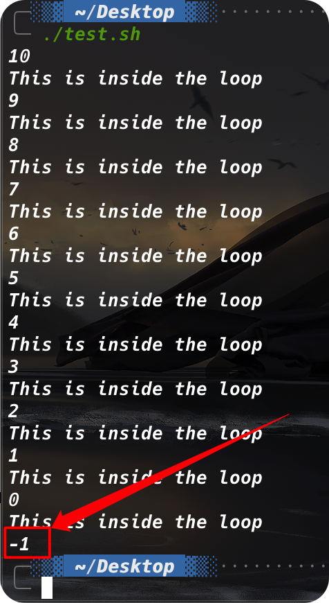

# `for`

bash shell提供了`for`命令，允许我们创建一个一系列值的循环。每次迭代都是用其中一个值来执行已定义好的一组命令。

```shell
for var in list
do
	commands
done
```

在`list`参数中，我们需要提供迭代中要用到的一系列值。可以通过几种不同的方法指定列表中的值。

> 只要我们愿意，也可以将`do`和`for`放在同一行，但必须用分号将其同列表中的值分开：
>
> ```shell
> for var in list; do
> ```

## 读取列表中的值

```shell
#! /bin/bash
# basic for command

for test in Alabama Alaska Arizona Arkansas California Colorado
do
	echo The next state is $test
done
```

每次`for`命令遍历值列表，它都会将列表中的下一个值赋给`$test`变量。`$test`变量可以像`for`命令中的其他脚本变量一样使用。***在最后一次迭代后，`$test`变量的值会在shell脚本的剩余部分一直保持有效。它会一直保持最后一次迭代的值（除非我们修改了它）。***

## 读取列表中的复杂值

```shell
for test in I don't know if this'll work
do 
	...
done
```

有两种方法可以解决这样的问题：

+ 使用转义字符（反斜线）来将单引号转义
+ 使用双引号来定义用到单引号的值

## 从变量读取列表

```shell
#! /bin/bash
# using a variable to hold the list

list="Alabama Alaska Arizona Arkansas Colorado"
list = $list" Connecticut"	# 向list末尾添加了一个值
for state in $list
do
	...
done
```

## 从命令读取值

```shell
#! /bin/bash
# reading values form a file

file="states"

for state in $(cat $file)
do
	...
done
```

## 更改字段分隔符

在[上一节](#从命令读取值)的例子中，我们的`state`未必是以空格的方式存放于文件中的，有可能是一行一行，可能以制表符分隔。但是我们都能获得想要的结果。

造成这个问题的原因是特殊的环境变量`IFS`，叫做内部字段分隔符（internal filed separator）。`IFS`环境变量定义了bash shell用作字段分隔符的一系列字符。默认情况下，bash shell会将下列字符当做字段分隔符：

+ 空格
+ 制表符
+ 换行符

如果bash shell在数据中看到了这些字符中的任意一个，它就会假定这表明了列表中一个新数据字段的开始。在处理可能含有空格的数据（比如文件名）时，这会非常麻烦。

要解决问题，可以在shell脚本中临时更改IFS环境变量的值来限制被bash shell当做字段分隔符的字符。例如，如果我们想修改IFS的值，使其只能是被换行符，那就必须这么做：

```shell
IFS=$'\n'
```

> 在处理代码量较大的脚本时，可能在一个地方需要修改IFS的值，然后忽略这次修改，在脚本的其他地方继续沿用IFS的默认值。一个可参考的安全事件是在改变IFS之前保存原来的IFS值，之后再回复它。

还有其他一些IFS环境变量的绝妙用法。假定我们要遍历一个文件中用冒号分割的值（比如在`/etc/passwd`文件中），我们要做的就是将IFS的值设为冒号：

```shell
IFS=:
```

如果要制定多个IFS字符，只要将它们在赋值行串起来就行，

```shell
IFS=$'\n':;
```

## 用通配符读取目录

可以用`for`命令自动遍历目录中的文件。进行此操作时，必须在文件名或路径名中使用通配符。它会强制shell使用文件扩展匹配。文件扩展匹配是生成匹配制定通配符的文件名或路径名的过程。

如果不知道所有的文件名，这个特性在处理目录中的文件时就非常好用。

```shell
#! /bin/bash
# iterate through all the files in a directory

for file in /home/rich/test/*
do
	if [ -d "$file" ]
	then
		echo "$file is a directory"
	elif [ -f "$file" ]
		...
done
```

注意，在使用`$file`的时候，需要使用双引号括起来，因为`file`中的值可能带有空格

# C语言风格的`for`

## `C-style for`

```shell
for (( variable assignmeng ; condition ; iteration process ))
```

注意，C语言风格的`for`有些部分并不遵循bash shell标准的`for`命令：

+ 变量赋值可以有空格
+ 条件中的变量不以美元符开头
+ 迭代过程中的算式没有使用`expr`命令格式

```shell
#! /bin/bash
# testing the C-style for loop

for (( i = 1; i <= 10; i++ ))
do
	echo "The next number is $i"
done
```

## 使用多个变量

```shell
for (( a = 1, b = 10; a <= 10; a++, b-- ))
```

# `while`

## 基本格式

```shell
while test command
do
	other commands
done
```

## 使用多个测试命令

```shell
while command1
		command2
		command3
do
	...
done

```


***`while`命令允许我们在`while`语句行定义多个测试命令。只有最后一个测试命令的退出状态码会被用来决定什么时候结束循环。***但是，如果我们不够小心，可能会导致一些有意思的结果：

```shell
#! /bin/bash
# testing a multicommand while loop

var1=10

while echo $var1
		[ $var1 -ge 0 ]
do
	echo "This is inside the loop"
	var1=$[ $var - 1 ]
done
```



需要注意的是，即使条件已经不适合让`while`再运行一次，测试命令也会被运行，在本例中，是`echo $var1`

# `until`

`until`命令和`while`命令工作的方式完全相反。`until`命令要求我们制定一个通常返回非零退出状态码的测试命令。只有测试命令的退出状态码不为0，bash shell才会执行循环中列出的命令。一旦测试命令返回了退出状态码0，循环就结束了。

```shell
until test commands
do
	other commands
done
```

# 循环处理文件数据

通常必须遍历存储在文件中的数据，这要求结合已经讲过的两种技术：

+ 使用嵌套循环
+ 修改IFS环境变量

通过修改IFS循环变量，就能强制`for`命令将文件中的每行都当成单独的一个条目来处理，即使数据中有空格也是如此。一旦从文件中提取出了单独的行，可能需要再次利用循环来提取行中的数据

典型的例子是处理`/etc/passwd`文件中的数据。

```shell
#! /bin/bash
# traverse every single line in /etc/passwd
# then traverse every element seperated by :

# record old IFS
old_IFS=$IFS
IFS=$'\n'

# traverse every single line in /etc/passwd
for line in $(cat /etc/passwd)
do
	# traverse every element in every single line
	echo $line
	IFS=:
	for element in $line
	do
		echo "    $element"
	done
	IFS=$'\n'
done
```

# 控制循环

## `break`

`break`的使用逻辑和C差不多，但是bash shell的`break`能够跳出多层循环：

```shell
# 跳出n层循环
break n
```


```shell
for ..
do
	for ...
	do
		..
		break 2
	done
done
```

## `continue`

`continue`的使用逻辑与C相同

# 处理循环的输出

在shell脚本中，我们可以对循环的输出使用管道或进行重定向。这可以通过在`done`命令之后添加一个管道操作符来完成：

```shell
for ...
do
	...
done > output.txt
```

# 实例

## 查找可执行文件

```shell
#! /bin/bash
# find all the executable files in PATH

old_IFS=$IFS
IFS=:

for path in $PATH
do
	for file in $path/*
	do
		if [ -x "$file" ]
		then
			echo "    $file"
		fi
	done
done
```

