[TOC]

# 命令行参数

向shell脚本传递数据的最基本方法是使用命令行参数。命令行参数允许在脚本运行时向命令行添加参数。

## 读取参数

bash shell会将一些称为位置参数（positional parameter）的特殊变量分配给输入到命令行中的所有参数。这也包括shell所执行的脚本的额名称。位置参数变量是标准的数字：`$0`是程序名，`$1`是第一个参数，依此类推，直到第九个参数。如果脚本需要的命令行参数不只9个，我们仍然可以处理，但是需要稍微修改一些变量名。在第九个变量之后，我们必须在变量数字周围加上花括号，比如`${10}`

如果参数中包含空格，那么就需要用引号包围，同时在处理的时候，参数中不会包含引号

## 读取脚本名和`basename`

可以用`$0`参数获取shell在命令行中启动的脚本名。这在编写多功能工具时非常方便。

但是存在一个潜在的问题。如果我们使用另一个命令来运行shell脚本，命令回合脚本名混在一起，出现在`$0`参数中。

```shell
./test5.sh
The zero parameter is set to: ./test5.sh
```

这还不是唯一的问题。当我们使用绝对路径调用脚本的时候，`$0`就会使用整个路径：

```shell
bash /home/Christine/test5.sh
The zero paramter is set to: /home/Christine/test5.sh
```

不过我们可以使用`basename`来返回不包含路径的脚本名：

```shell
$(basename $0)
```

## 测试参数

在使用参数前一定要检查其中是否存在数据：

```shell
if [ -n "$1" ]
then
	...
else
	...
fi
```

# 特殊参数变量

## 参数统计——`$#`

特殊变量`$#`含有脚本运行时鞋带的命令行参数的个数。

需要注意的是，如果我们想要使用`$#`直接获得最后一个参数，是不可以的：

```shell
${$#}
```

我们需要使用`!`：

```shell
${!#}
```

## 抓取所有的数据——`$*` & `$@`

如果我们想要遍历命令行上提供的所有参数，我们不需要先使用`$#`来判断命令行上有多少参数，然后再进行遍历，我们可以使用一组其他的变量来解决这个问题：

+ `$*`会将命令行上提供的所有参数当做一个单词保存。这个单词包含了命令行中出现的每一个参数值。***基本上`$*`会将这些参数是为一个整体，而不是多个个体。***
+ `$@`会将命令行上提供的所有参数当做同一字符串中的多个独立的单词。***这样我们就能够遍历所有的参数值，得到每一个参数***

# 移动变量——`shift`

bash shell的`shift`命令用来操作命令行参数。和字面上的意思一样，`shift`命令会根据它们的相对位置来移动命令行参数。

在使用`shift`命令时，默认情况下它会将每个参数变量向左移动一个位置。所以，变量`$3`中的值会移到`$2`中，变量`$2`的值会移到`$1`中，而变量`$1`的值则会被删除。（注意，变量`$0`的值，也就是程序名，不会更改）。

这是遍历命令行参数的另一个好办法，尤其是在我们不知道到底有多少参数时。我们可以只操作第一个参数，移动参数，然后继续操作第一个参数

```shell
while [ -n "$1" ]
do
	...
	shift
done
```

> 使用`shift`命令的时候要小心。如果某个参数被移除，它的值就被丢弃了，无法再回复。

当然，我们也可以一次性移动多个位置，只需要给`shift`命令提供一个参数，指明要移动的位置数就行了。

```shell
#! /bin/bash
# demonstrating a multi-position shift
#
echo
echo "The original parameters: $*"
shift 2
echo "Here the new first parameter: $1"
```

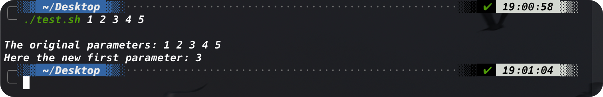

# 处理选项

## 查找选项

### 1. 处理简单选项

当我们在脚本中使用命令选项这样的操作方式：

```shell
./test15.sh -a -b -d -f
```

我们只需要使用`shift`和`case`就好了：

```shell
while [ -n "$1" ]
do
	case "$1" in
		-a) ... ;;
		-b) ... ;;
		-c) ... ;;
		*)  ... ;;
	esac
	shift
done
```

这样，无论选项按照什么样的顺序出现在命令行上，这种方式都适用。

### 2. 分离参数和选项

我们经常会遇到想在shell脚本中同时使用选项和参数的情况。Linux中处理这个问题的标准方式使用特殊字符来将二者分开，该字符会告诉脚本何时选项结束以及普通参数何时开始

对Linux来说，这个特殊字符是双破折线（`--`）。在双破折线之后，脚本就可以放心地将剩下的命令行参数当做参数，而不是选项来处理了。

```shell
#! /bin/bash
# extracting options and parameters
#
echo
while [ -n "$1" ]
do
	case "$1" in
		-a) echo "Found the -a option" ;;
		-b) echo "Found the -b option" ;;
		-c) echo "Found the -c option" ;;
		--) shift
			break ;;
		*)	echo "$1 is not an option" ;;
	esac
	shift
done

count=1
for param in $@
do
	echo "Parameter #$count: $param"
	count=$[ $count + 1 ]
done
```

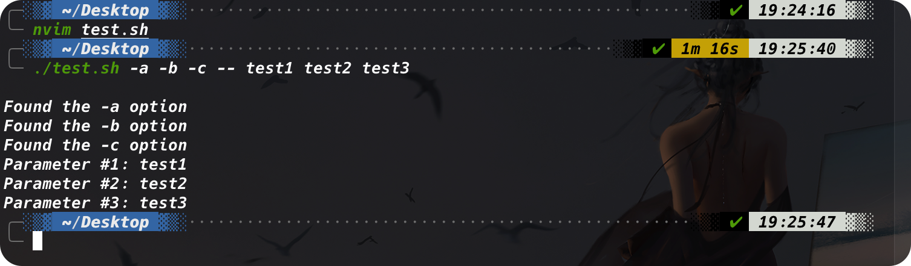

上面这个脚本所做的事是，先读入选项。然后在双横线之后的参数被视为普通的参数，进入接下来的处理部分

### 3. 处理带值的选项

有些选项会带上一个额外的参数值，在这种情况下，命令行看起来是这样的：

```shell
./testing.sh -a test1 -b -c -d test2
```

当当命令行要求额外的参数时，脚本必须能检测到并正确处理。下面是如何处理的例子：

```shell
#! /bin/bash
# extracting options and parameters
#
echo
while [ -n "$1" ]
do
	case "$1" in
		-a) echo "Found the -a option" ;;
		-b) param="$2"
			echo "Found the -b option, with parameter value $param"
			shift ;;
		-c) echo "Found the -c option" ;;
		--) shift
			break ;;
		*)	echo "$1" is not an option ;;
	esac
	shift
done
#
count=1
for param in "$@"
do
	echo "Parameter #$count: $param"
	count=$[ $count + 1 ]
done
```

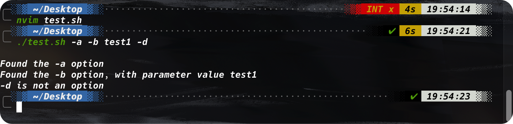

## 使用`getopt`命令

现在shell脚本已经有了处理命令行选项的基本能力，但还有一些限制。比如，如果我们想将多个选项放进一个参数中时，他就不能工作了：

```shell
./test.sh -ac
```

`getopt`命令是一个在处理命令行选项和参数时特别方便的工具。它能够识别命令行参数，从而在脚本解析它们时更加方便。

### 1. 命令的格式

`getopt`命令可以接受一系列任意形式的命令行选项和参数，并自动将它们转换成适当的格式：

```shell
getopt optstring parameters
```

`optstring`是这个过程的关键所在。它定义了命令行有效的选项字母，还定义了哪些选项字母需要参数值。

首先，在`optstring`中列出我们要在脚本中用到的每个命令行选项字母。然后，在每个需要参数值的选项字母后加一个冒号。`getopt`命令会给予我们定义的`optstring`解析提供的参数。

下面是一个简单的例子：

```shell
getopt ab:cd -a -b test1 -cd test2 test3
```


`optstring`定义了四个有效选项字母：a、b、c和d。冒号(`:`)被放在了字母b后面，因为b选项需要一个参数值。当`getopt`命令运行时，它会检查提供的参数列表，并给予提供的`optstring`进行解析。注意，它会将`-cd`分成两个单独的选项，并插入两个双破折线来分隔行中的额外参数。

如果制定了一个不在`optstring`中的选项，默认情况下，`getopt`会产生一条错误信息。如果想要忽略这条错误信息，可以在命令后添加`-g`选项。

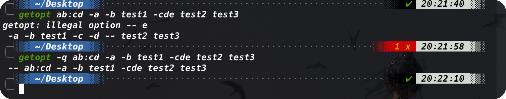

### 2. 在脚本中使用`getopt`

可以在脚本中使用`getopt`来格式化脚本所携带的任何命令行选项或参数，但用起来略微复杂。

方法是使用`getopt`生成的格式化后的版本来替换已有的命令行选项和参数。用`set`命令能够做到。

`set`命令的选项之一是双破折线（`--`），它会将命令行参数替换成`set`命令的命令行值。

然后，该方法会将原始脚本的命令行参数传递给`getopt`命令，之后再将`getopt`命令的输出传给`set`命令，用`getopt`格式化后的命令行参数来替换原始的命令行参数：

```shell
set -- $(getopt -q ab:cd "$@")
```

现在原始的命令行参数变量的值会被`getopt`命令的输出替换，而`getopt`已经为我们格式化了命令行参数。利用这个方法，现在就可以写出能帮我们处理命令行参数的脚本：

```shell
#! /bin/bash
# Extract command line options & values with getopt
#
set -- $(getopt -q ab:cd "$@")
#
echo
while [ -n "$1" ]
do
	case "$1" in
		-a)	echo "Found the -a option" ;;
		-b) param="$2"
			echo "Found the -b option, with parameter value $param"
			shift;;
		-c) echo "Found the -c option" ;;
		--) shift
			break ;;
		*)	echo "$1 is not an option" ;;
	esac
	shift
done
#
count=1
for param in "$@"
do
	echo "Parameter #$count: $param"
	count=$[ $count + 1 ]
done
```

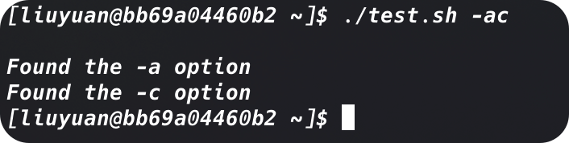

更复杂的例子也不在话下：

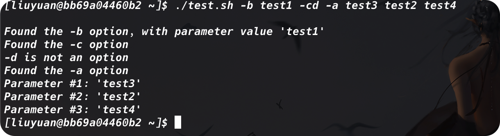

但是，`getopt`并不擅长处理带空格和引号的参数值。它会将空格作为参数分隔符，而不是根据双引号将二者当做一个参数：

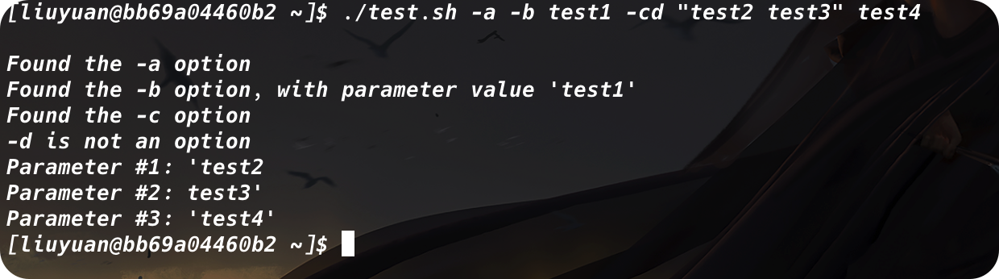

### 3. 使用更高级的`getopts`

这个命令内建于bash shell，与`getopt`不同，`getopt`将命令行上选项和参数处理后只生成一个输出，而`getopts`命令能够和以后的shell参数变量配合默契。

每次调用的时候，它只处理命令行上检测到的一个参数。处理完所有的参数后，它会退出并返回一个大于0的退出状态码。这让它非常适合用解析命令行所有参数的循环中。

```shell
getopts optstring variable
```

`optstring`值类似于`getopt`命令中的那个。有效的选项字母都会列在`optstring`中，如果选项字母要求有个参数值，就加一个冒号。要去掉错误信息的话，可以在`optstring`之前加一个冒号。`getopts`命令将当前参数保存在命令行中定义的`variable`中。

`getopts`命令会用到两个环境变量。如果选项需要跟一个参数值，`OPTARG`环境变量就会保存这个值。`OPTIND`环境变量保存了参数列表中`getopts`正在处理的参数位置。这样我们就能在处理完选项之后继续处理其他命令行参数了。

#### 使用示例

```shell
#! /bin/bash
# simple demonstration of the getopts command
#
echo
while getopts :ab:c opt
do
	case "$opt" in
		a)	echo "Found the -a option" ;;
		b)	echo "Found the -b option, with value $OPTARG" ;;
		c)	echo "Found the -c option" ;;
		*)	echo "Unknow option: $opt" ;;
    esac
done
```

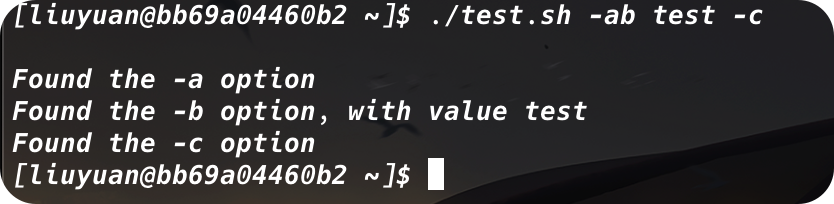

#### 好用的功能

##### 1. 参数值包含空格

`getopts`有好几个好用的功能，比如可以在参数值中包含空格：

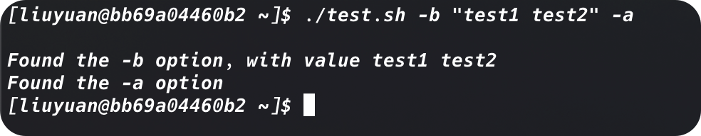

##### 2. 选项字母和参数值放在一起

比如可以将选项字母和参数值放在一起使用而不需要加空格：

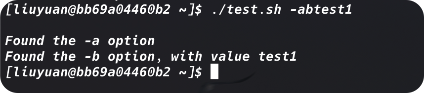

##### 3. 处理未定义选项字母

`getopts`还能够将命令行上找到的未定义的选项统一输出成问号：

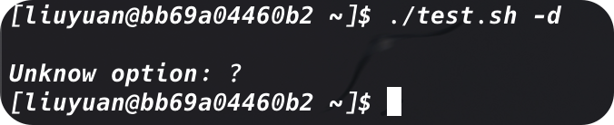

#### 继续操作剩余的参数

```shell
#! /bin/bash
# simple demonstration of the getopts command
#
echo
while getopts :ab:c opt
do
	case "$opt" in
		a)	echo "Found the -a option" ;;
		b)	echo "Found the -b option, with value $OPTARG" ;;
		c)	echo "Found the -c option" ;;
		*)	echo "Unknow option: $opt" ;;
    esac
done
#
shift $[ $OPTIND - 1 ]
#
echo
count=1
for param in "$@"
do
	echo "Parameter $count: $param"
	count=$[ $count + 1 ]
done
```

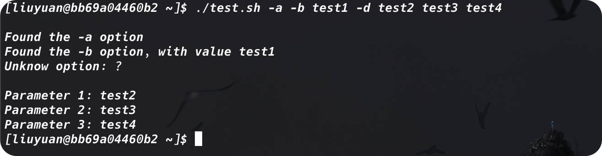

# 将选项标准化

在创建shell脚本的时候，显然可以控制具体怎么做。我们完全可以自己决定用哪些字母选项以及他们的用法。

但是有些字母选项在Linux世界中已经拥有了某种程度的标准含义。如果我们能够在shell脚本中支持这些选项，脚本对于他人来说就会更为友好：

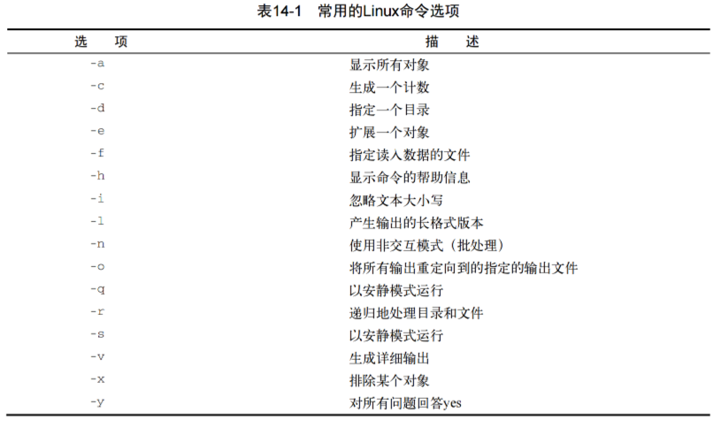

# 获得用户输入——`read`

尽管命令行选项和参数是脚本从用户处获得输入的一种重要方式，但有时脚本的交互性还需要更强一些。

## 基本的读取

`read`命令从标准输入（键盘）或另一个文件描述符中接收输入。在收到输入后，`read`命令会将数据放进一个变量。下面是最简单的用法：

```shell
#! /bin/bash
# testing the read command
#
echo -n "Enter your name: "
read name
echo "Hello $name, welcome to my program."
```

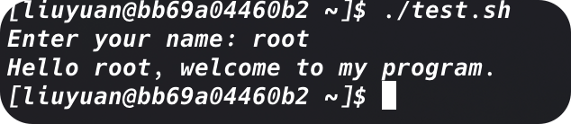

### 显示输入提示——`-p`

这里我们使用了`echo`来显示输入提示，事实上，`read`也支持：

```shell
read -p "Please enter your age: " age
```

### 多变量输入

如果我们在`read`的时候只提供一个变量，那么所有的输入（即使有空格隔开）都会被存入这个变量；如果我们提供了多个变量，那么就会依次存入，如果最后变量的个数还是小于输入的参数，那么剩余的参数会存入最后一个变量中。

```shell
#! /bin/bash
# entering multiple variables
#
read -p "Enter your name: " first last
echo "Cheking data for $last, $first ..."
```


### 保存到环境变量`REPLY`

当然也可以在`read`命令行中不指定变量。如果是这样，`read`命令会将它收到的所有数据保存到特殊环境变量`REPLY`中：

```shell
#! /bin/bash
# Testing the REPLY Environment variable
#
read -p "Enter your name: "
echo
echo Hello $REPLY, welcome to my program
```


### 超时——`-t`

为了防止因为等不到用户输入而让脚本苦苦等待，我们可以用`-t`来设置计时器。当计时器过期后，`read`会返回一个非零退出状态码。

```shell
#! /bin/bash
# timing the data entry
#
if read -t 5 -p "Please enter your name: " name
then
	echo "Hello $name, welcome to my script"
else
	echo
	echo "Sorry, too slow!"
fi
```

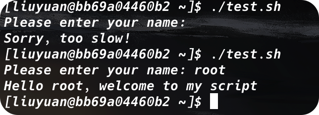

### 限制输入字符个数——`-n`

```shell
#! /bin/bash
# timing the data entry
#
while read -n1 -p "Do you want to continue [Y/N]? " answer
do
	case $answer in
	Y | y)	echo
		echo "fine, continue on ..." ;;
	N | n)	echo
		echo OK, goodbye
		break ;;
	esac
done
echo "This is the end of the script"
```

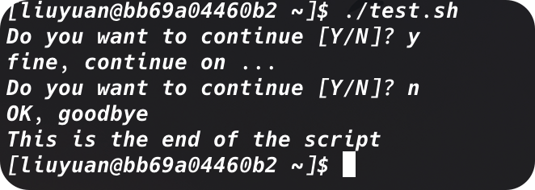

## 隐藏方式读取——`-s`

`-s`选项可以避免在`read`命令中输入的数据出现在显示器上（实际上，数据会被显示，但是`read`命令会将文本颜色设置成跟背景色一样）

```shell
#! /bin/bash
# timing the data entry
#
read -s -p "Enter your password: " pass
echo
echo "Is your password really $pass? "
```

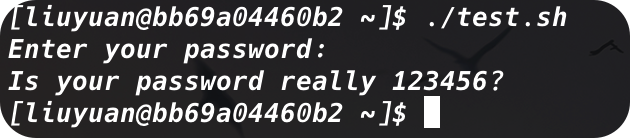

## 从文件中读取

也可以用`read`命令来读取Linux系统上文件里保存的数据。每次调用`read`命令，它都会从文件中读取一行文本。当文件中再没有内容的时候，`read`命令会退出并返回非零退出状态码。

其中最难的部分是将文件中的数据传给`read`命令。最常见的方法是对文件使用`cat`命令，将结果通过管道直接传给含有`read`命令的`while`命令。

```shell
#! /bin/bash
# timing the data entry
#
count=1
file=""
if [ -n $1 ]
then
	file=$1
fi

cat $1 | while read line
do
	echo "Line $count: $line"
	count=$[ $count + 1 ]
done
echo "Finished processing the $file"
```


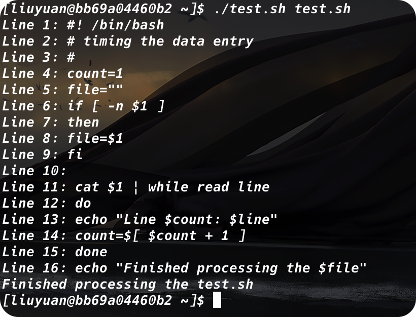
