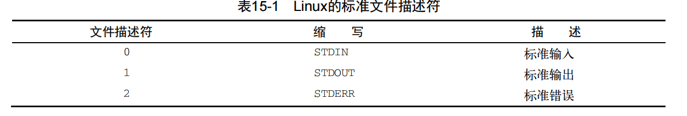
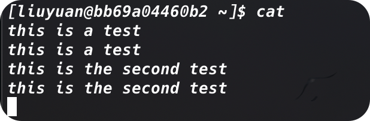
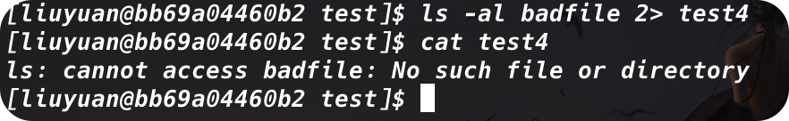
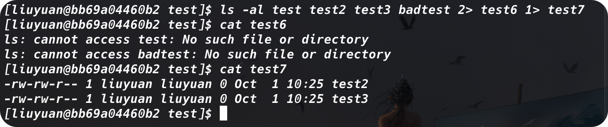
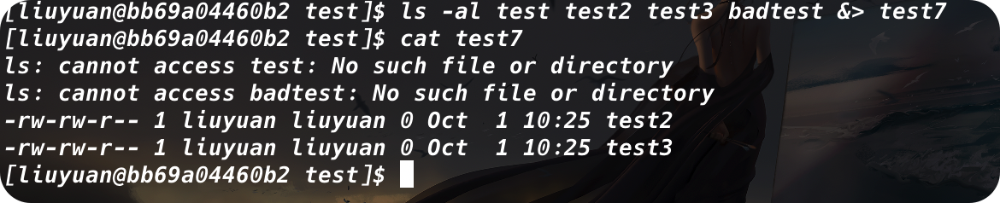
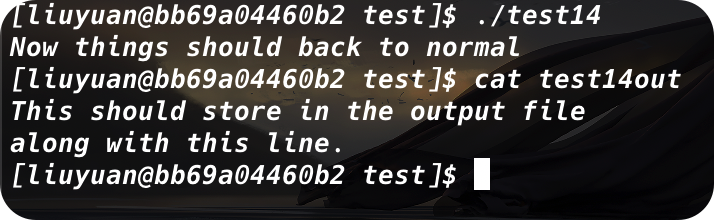
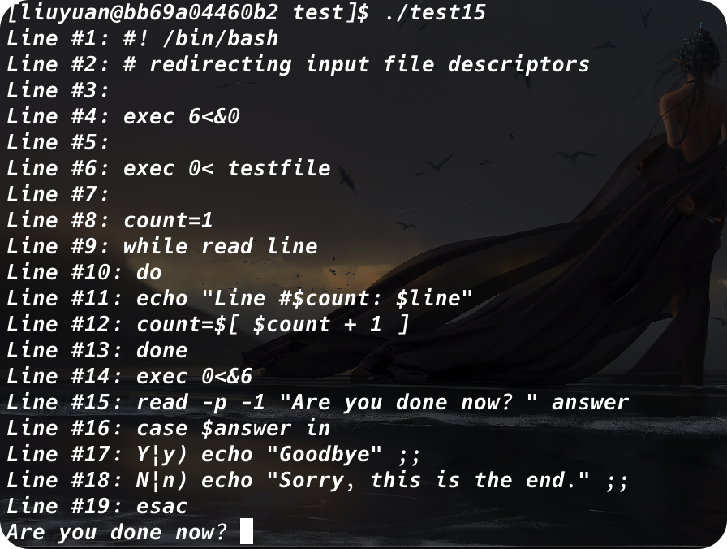

# 理解输入和输出

我们目前已经掌握的两种显示脚本输出的方法：

+ 在显示器屏幕上显示输出
+ 将输出重定向到文件中

这两种方法要么将数据输出全部显示，要么全都不显示。但有时将一部分数据在显示器上显示，另一部分数据保存到文件中也是不错的。

## 标准文件描述符

Linux操作系统将每个对象当做文件处理。这包括输入和输出进程。Linux用*文件描述符*(file descriptor)来标识每个文件对象。文件描述符是一个非负整数，可以唯一标识会话中打开的文件。每个进程一次最多可以有9个文件描述符。处于特殊目的，bash shell保留了前三个文件描述符（0、1和2）：



这三个特殊文件描述符回处理脚本中的输入和输出。shell用他们将shell的默认的输入和输出导向到相应的位置。

### 1.	STDIN

STDIN文件描述符代表shell的标准输入。对终端界面来说，标准输入是键盘。shell从STDIN文件描述对应的键盘获得输入，在用户输入时处理每个字符。

在使用输入重定向符号（<）时，Linux会重定向指定的文件来替换标准输入文件描述符。它会读取文件并提取数据，就如同它是在键盘上输入的。

下面用`cat`来处理STDIN输入数据：



如果我们只在命令行上输入`cat`命令，那么我们输入一行，就会打印一行。

我们当然可以使用STDIN重定向符强制`cat`接受来自另一个非STDIN文件的输入：


### 2.	STDOUT

STDOUT文件描述符代表shell的标准输出。在终端界面上，标准输出就是终端显示器。

我们可以使用管道操作符`<`或者`<<`将数据和命令输出写到/追加到文件中，但是有的时候我们会发现明明提供了输出重定向，却还是在显示器上打印消息：


### 3.	STDERR

这是因为，命令的错误信息并不是从STDOUT输出的，而是从STDERR输出的。

shell通过特殊的STDERR文件描述符来处理错误消息。STDERR文件描述符代表shell的标准错误输出，shell或shell中运行的程序和脚本出错时生成的错误消息都会发送到这个位置。

默认情况下，STDOUT和STDERR指向同样的地方（尽管分配的文件描述符值不同）。但是当我们想要将错误信息打印到日志文件中的时候，我们就需要进行一些改变。

## 重定向错误

### 1.	只重定向错误

从前面的内容我们知道，STDERR文件描述符被设置为2。我们可以选择通过将该文件描述符放在重定向符号钱，从而实现只重定向错误消息的目的。***需要注意的是，文件描述符的值必须紧紧地放在重定向符号前，否则不会工作：***



### 2.	重定向错误和数据

如果向重定向错误和正常输出，必须用两个重定向符号。需要再符号前面放上待重定向数据所对应的文件描述符，然后指向用于保存数据的输出文件：



另外，如果愿意，也可以将STDERR和STDOUT输出重定向到同一个输出文件。为此bash shell提供了特殊的重定向符号`&>`：



如果我们认真观察的话，我们可以发现，后输入的`badtest`文件的检索错误出现在先输入的`test2`和`test3`之前。为了避免错误信息散落在输出文件中，相较于标准输出，bash shell自动赋予了错误消息更高的优先级，这样我们就可以集中浏览错误了。

# 在脚本中重定向输出

## 临时重定向

如果有意在脚本中生成错误消息，可以将单独的一行输出重定向到STDERR，我们所需要做的就是使用输出重定向符来将输出信息重定向到STDERR文件描述符。在重定向到文件描述符的时候，我们必须在文件描述符数字之前加一个`&`：

```shell
echo "this is an error message" >&2
```

如果我们在一行命令后面添加这样的标识符，这行消息就会被打印到STDERR中。

以下面这个例子：

```shell
#! /bin/bash
# testting STDERR messages

echo "This is an error" >&2
echo "This is normal output"
```

如果我们直接运行这个脚本，是看不出任何的区别的。但是如果我们重定向了STDERR：

```shell
./test.sh 2> test9
```

那么打印到屏幕上的就只剩下第二行，第一行就会被打印到`test9`文件中。

## 永久重定向

如果脚本中存在大量数据需要重定向，那么重定向每个`echo`命令就会显得很繁琐。取而代之，我们可以使用`exec`命令告诉shell在脚本执行期间重定向某个特定的文件描述符：

```shell
#! /bin/bash
# redirecting all output to a file
exec 1>testout

echo "This is a test of redirecting all output"
echo "from a script to another file."
echo "without having to redirecting evey individual line"
```


`exec`命令会启动一个新shell并将STDOUT文件描述符重定向到文件。脚本中发给STDOUT的所有输出会被重定向到文件。

当然，我们还可以在脚本的执行过程中重定向STDOUT和STDERR。

# 在脚本中重定向输入

我们可以用相同的方法重定向输入：

```shell
exec 0< testfile
```

# 创建自己的重定向

## 创建输出文件描述符

我们可以用`exec`命令给输出分配文件描述符。一旦我们将一个文件描述符分配给一个文件，这个重定向就会一直有效，直到我们重新分配：

```shell
exec 3>test13out
```

## 重定向文件描述符

现在介绍怎么恢复已经重定向的文件描述符。简而言之，如何把STDOUT重定向到另一个文件描述符，再重定向回原本的位置。

```shell
#! /bin/bash
# storing STDOUT, then coming back to it

exec 3>&1
exec 1>test14out

echo "This should store in the output file"
echo "along with this line."

exec 1>&3

echo "Now things should back to normal"
```



首先，脚本将文件描述符3重定向到文件描述符1的当前位置，也就是STDOUT。

第三个`exec`命令将STDOUT重定向到文件，但是，由于这个文件仍然指向STDOUT原来的位置，也就是显示器，因此，我们发送数据给这个文件，其实就是发送给STDOUT

## 创建输入文件描述符

可以用和重定向输出文件描述符同样的方法重定向输入文件描述符。在重定向到文件之前，先将STDIN文件描述符保存到另一个文件描述符，然后在读取完之后再将STDIN恢复到原来的位置。

```shell
#! /bin/bash
# redirecting input file descriptors

exec 6<&0

exec 0< testfile

count=1
while read line
do
	echo "Line #$count: $line"
	count=$[ $count + 1 ]
done
exec 0<&6
read -n1 -p "Are you done now? " answer
echo
case $answer in
	Y|y) echo "Goodbye" ;;
	N|n) echo "Sorry, this is the end." ;;
esac
```



## 创建读写文件描述符

