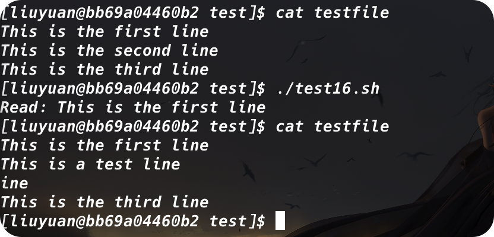
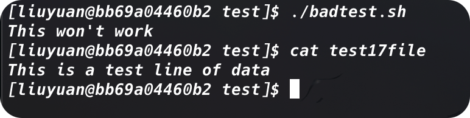
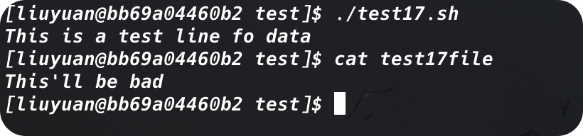
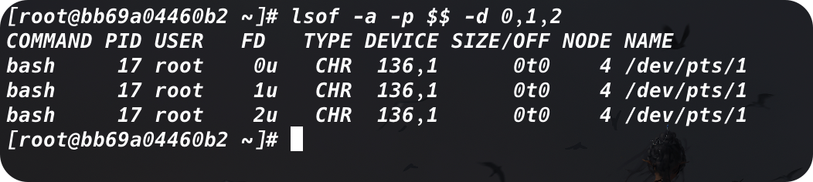
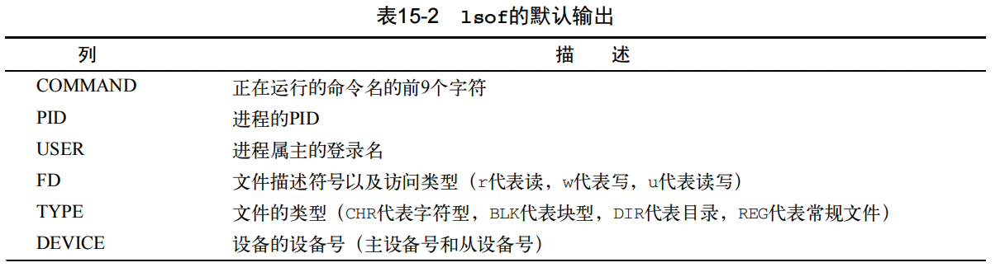
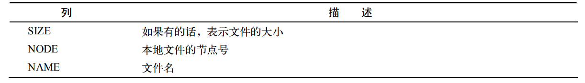
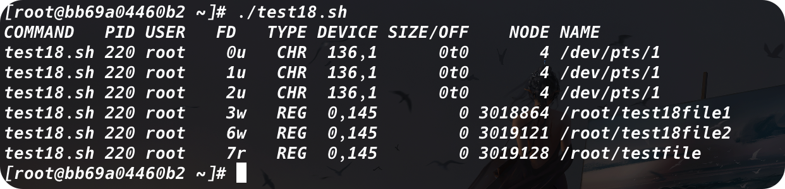
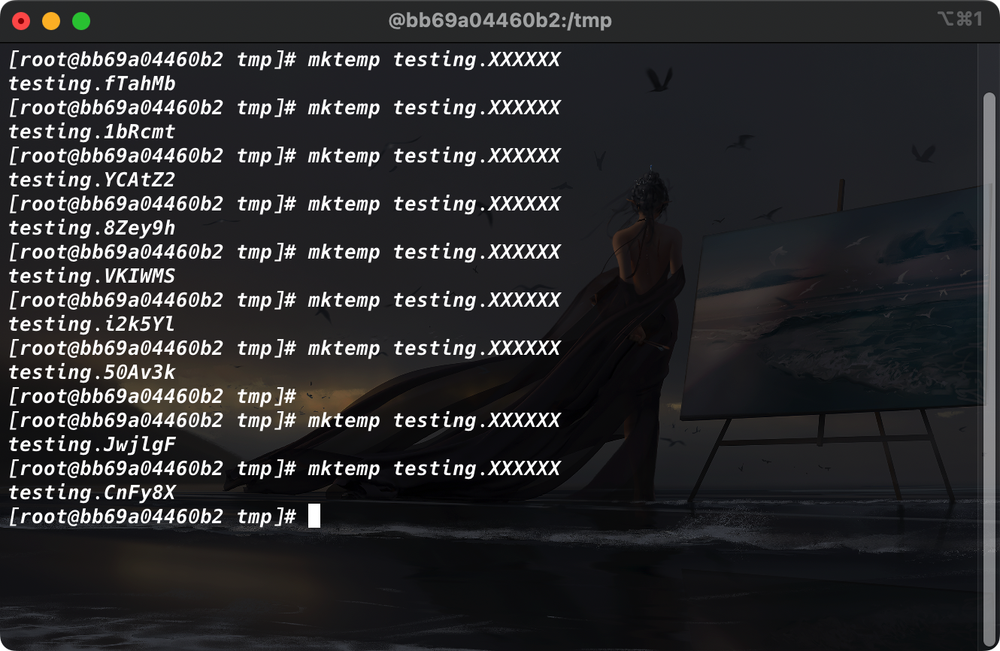
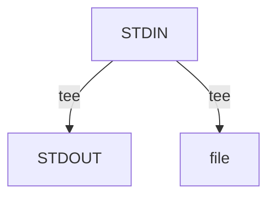
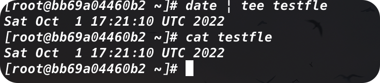

# 理解输入和输出

我们目前已经掌握的两种显示脚本输出的方法：

+ 在显示器屏幕上显示输出
+ 将输出重定向到文件中

这两种方法要么将数据输出全部显示，要么全都不显示。但有时将一部分数据在显示器上显示，另一部分数据保存到文件中也是不错的。

## 标准文件描述符

Linux操作系统将每个对象当做文件处理。这包括输入和输出进程。Linux用*文件描述符*(file descriptor)来标识每个文件对象。文件描述符是一个非负整数，可以唯一标识会话中打开的文件。每个进程一次最多可以有9个文件描述符。处于特殊目的，bash shell保留了前三个文件描述符（0、1和2）：


这三个特殊文件描述符回处理脚本中的输入和输出。shell用他们将shell的默认的输入和输出导向到相应的位置。

### 1.	STDIN

STDIN文件描述符代表shell的标准输入。对终端界面来说，标准输入是键盘。shell从STDIN文件描述对应的键盘获得输入，在用户输入时处理每个字符。

在使用输入重定向符号（<）时，Linux会重定向指定的文件来替换标准输入文件描述符。它会读取文件并提取数据，就如同它是在键盘上输入的。

下面用`cat`来处理STDIN输入数据：


如果我们只在命令行上输入`cat`命令，那么我们输入一行，就会打印一行。

我们当然可以使用STDIN重定向符强制`cat`接受来自另一个非STDIN文件的输入：


### 2.	STDOUT

STDOUT文件描述符代表shell的标准输出。在终端界面上，标准输出就是终端显示器。

我们可以使用管道操作符`<`或者`<<`将数据和命令输出写到/追加到文件中，但是有的时候我们会发现明明提供了输出重定向，却还是在显示器上打印消息：


### 3.	STDERR

这是因为，命令的错误信息并不是从STDOUT输出的，而是从STDERR输出的。

shell通过特殊的STDERR文件描述符来处理错误消息。STDERR文件描述符代表shell的标准错误输出，shell或shell中运行的程序和脚本出错时生成的错误消息都会发送到这个位置。

默认情况下，STDOUT和STDERR指向同样的地方（尽管分配的文件描述符值不同）。但是当我们想要将错误信息打印到日志文件中的时候，我们就需要进行一些改变。

## 重定向错误

### 1.	只重定向错误

从前面的内容我们知道，STDERR文件描述符被设置为2。我们可以选择通过将该文件描述符放在重定向符号钱，从而实现只重定向错误消息的目的。***需要注意的是，文件描述符的值必须紧紧地放在重定向符号前，否则不会工作：***


### 2.	重定向错误和数据

如果向重定向错误和正常输出，必须用两个重定向符号。需要再符号前面放上待重定向数据所对应的文件描述符，然后指向用于保存数据的输出文件：


另外，如果愿意，也可以将STDERR和STDOUT输出重定向到同一个输出文件。为此bash shell提供了特殊的重定向符号`&>`：


如果我们认真观察的话，我们可以发现，后输入的`badtest`文件的检索错误出现在先输入的`test2`和`test3`之前。为了避免错误信息散落在输出文件中，相较于标准输出，bash shell自动赋予了错误消息更高的优先级，这样我们就可以集中浏览错误了。

# 在脚本中重定向输出

## 临时重定向——`>&`

如果有意在脚本中生成错误消息，可以将单独的一行输出重定向到STDERR，我们所需要做的就是使用输出重定向符来将输出信息重定向到STDERR文件描述符。在重定向到文件描述符的时候，我们必须在文件描述符数字之前加一个`&`：

```shell
echo "this is an error message" >&2
```

如果我们在一行命令后面添加这样的标识符，这行消息就会被打印到STDERR中。

以下面这个例子：

```shell
#! /bin/bash
# testting STDERR messages

echo "This is an error" >&2
echo "This is normal output"
```

如果我们直接运行这个脚本，是看不出任何的区别的。但是如果我们重定向了STDERR：

```shell
./test.sh 2> test9
```

那么打印到屏幕上的就只剩下第二行，第一行就会被打印到`test9`文件中。

## 永久重定向——`exec`

如果脚本中存在大量数据需要重定向，那么重定向每个`echo`命令就会显得很繁琐。取而代之，我们可以使用`exec`命令告诉shell在脚本执行期间重定向某个特定的文件描述符：

```shell
#! /bin/bash
# redirecting all output to a file
exec 1>testout

echo "This is a test of redirecting all output"
echo "from a script to another file."
echo "without having to redirecting evey individual line"
```


`exec`命令会启动一个新shell并将STDOUT文件描述符重定向到文件。脚本中发给STDOUT的所有输出会被重定向到文件。

当然，我们还可以在脚本的执行过程中重定向STDOUT和STDERR。

# 在脚本中重定向输入

我们可以用相同的方法重定向输入：

```shell
exec 0< testfile
```

# 创建自己的重定向

## 创建输出文件描述符

我们可以用`exec`命令给输出分配文件描述符。一旦我们将一个文件描述符分配给一个文件，这个重定向就会一直有效，直到我们重新分配：

```shell
exec 3>test13out
```

## 重定向文件描述符

现在介绍怎么恢复已经重定向的文件描述符。简而言之，如何把STDOUT重定向到另一个文件描述符，再重定向回原本的位置：

```shell
#! /bin/bash
# storing STDOUT, then coming back to it

exec 3>&1
exec 1>test14out

echo "This should store in the output file"
echo "along with this line."

exec 1>&3

echo "Now things should back to normal"
```


首先，脚本将文件描述符3重定向到文件描述符1的当前位置，也就是STDOUT。

第三个`exec`命令将STDOUT重定向到文件，但是，由于这个文件仍然指向STDOUT原来的位置，也就是显示器，因此，我们发送数据给这个文件，其实就是发送给STDOUT

## 创建输入文件描述符

可以用和重定向输出文件描述符同样的方法重定向输入文件描述符。在重定向到文件之前，先将STDIN文件描述符保存到另一个文件描述符，然后在读取完之后再将STDIN恢复到原来的位置。

```shell
#! /bin/bash
# redirecting input file descriptors

exec 6<&0

exec 0< testfile

count=1
while read line
do
	echo "Line #$count: $line"
	count=$[ $count + 1 ]
done
exec 0<&6
read -n1 -p "Are you done now? " answer
echo
case $answer in
	Y|y) echo "Goodbye" ;;
	N|n) echo "Sorry, this is the end." ;;
esac
```


## 创建读写文件描述符

我们可以打开单个文件描述符作为输入和输出。可以用同一个文件描述符对同一个文件进行读写。

不过使用这种方法的时候需要特别小心。因为我们是对同一个文件进行数据读写，shell会维护一个内部至臻，指明当前在文件中的位置。任何读或者写的操作就会从文件指针指向的位置开始。如果不够小心，就会产生意料之外的结果：

```shell
#! /bin/bash
# testing input/output file descriptor

exec 3<> testfile
read line <&3
echo "Read: $line"
echo "This is a test line" >&3
```



在这个例子中，我们使用`exec`命令将文件描述符3分配给了文件`testfile`以进行文件读写。接下来，它通过分配好的额文件描述符，使用`read`命令读取文件中的第一行，然后将这一行显示在STDOUT上。最后，它用`echo`语句将一行数据写入由一个文件描述符打开的文件中。

在运行脚本的时候，一切看上去还算正常。输出内容表明脚本读取了`testfile`文件中的第一行，但是如果我们再去检查`testfile`的话，就会发现，我们写入文件中的数据覆盖了已有的数据。

当脚本向文件中写入数据的时候，它会从文件指针所处的位置开始。`read`命令读取了第一行数据，所以使得文件指针指向了第二行数据的第二个字符。在`echo`语句将数据输出到文件的时候，它会将数据放在文件指针的当前位置，覆盖已有的数据，

## 关闭文件描述符——`>&-`

如果我们创建了新的输入或输出文件描述符，shell会在脚本退出的时候自动关闭他们。然而在有些情况下，我们需要手动关闭文件描述符。

要关闭文件描述符，我们需要将它重定向到特殊符号`&-`：

```shell
exec 3>&-
```

该语句会关闭文件描述符3，不再在脚本中使用它。

```shell
#! /bin/bash
# testing closing file descriptors

exec 3> test17file

echo "This is a test line of data" >&3

exec 3>&-

echo "This won't work"
```



一旦关闭了文件描述符，就不能在脚本中向他写任何数据，否则shell会生成错误消息。

在关闭文件描述符时还要注意另一件事。如果随后我们在脚本中打开了同一个输出文件，shell会用一个新文件来替换已有文件：

```shell
#! /bin/bash
# testing closing file descriptors

exec 3> test17file
echo "This is a test line fo data" >&3
exec 3>&-

cat test17file

exec 3> test17file
echo "This'll be bad" >&3
```



# 列出打开的文件描述符——`lsof`

我们能够使用的文件描述符只有9个，有时要记住哪个文件描述符被重定向到了哪里很难。

`lsof`命令会列出整个Linux系统打开的所有的文件描述符。这是个有争议的功能，因为它回响非系统管理员用户提供Linux系统的信息。鉴于此，许多Linux系统隐藏了这个命令，这样用户就不会一不小心就发现了。

在很多Linux系统中，`lsof`命令位于`/usr/sbin`。要想以普通用户账户来运行它，必须通过全路径名来引用。

该命令会产生大量的输出。它会显示当前Linux系统上打开的每个文件的有关信息。这包括后台运行的所有进程以及登录到系统的任何用户。

有大量的命令行参数和选项可以用来帮助过滤`lsof`的输出。最常用的有`-p`和`-d`，前者允许我们指定PID，后者允许我们指定要显示的文件描述符编号。

要想知道当前进程的PID，我们可以使用特殊环境变量`$$`（shell会将其设置为当前PID）。`-a`选项用于对其他两个选项的结果执行布尔AND运算：



上例显示了当前进程（bash shell）的默认文件描述符。`lsof`的默认输出中有7列信息：





与STDIN、STDOUT和STDERR关联的文件类型是字符型。因为STDIN、STDOUT和STDERR文件描述符都指向终端，所以输出文件的名称就是终端的设备名。***所有3种标准文件都支持读和写***

```shell
#! /bin/bash
# testing lsof with file descriptors

exec 3> test18file1
exec 6> test18file2
exec 7< testfile

lsof -a -p $$ -d0,1,2,3,6,7
```



# 阻止命令输出——`/dev/null`

有时候，我们可能不想显示脚本的输出。这在将脚本作为后台进程运行时很常见。如果在运行在后台的脚本出现错误信息，shell会通过邮件将它们发送给进程的属主。这会很麻烦，尤其是当运行会产生很多繁琐的小麻烦的时候。

要解决这问题，可以将STDERR重定向到一个叫做`null`的特殊文件。`null`文件跟塔尔名字很像，文件里面什么都没有，shell输出到null文件的任何数据都不会保存，全部都被丢掉了。

Linux系统上null文件的标准位置是`/dev/null`。我们重定向到这个位置的任何数据都会被丢掉，不会显示：

```shell
ls -al > /dev/null
```

***这是避免出现错误消息，也无需保存它们的一个常用方法***

也可以在输入重定向中将`/dev/null`作为输入文件。由于`/dev/null`文件中不含有任何内容，***程序员通常用它来作为快速清楚现有文件中的数据，而不用删除文件又再次创建的简便方法：***

```shell
cat /dev/null > testfile
```

这样，`testfile`仍然存在系统上，但现在它是空文件。这是清除日志文件的一个常用方法，因为日志文件必须时刻准备等待应用程序的操作。

# 创建临时文件——`mktemp`

Linux系统有特殊的目录，专供临时文件使用。`tmp`目录用来存放不需要永久保留的文件。大多数Linux发行版配置了系统在启动时自动删除`/tmp`目录中的所有文件。

系统上的任何用户都有权限读写在`/tmp`中的文件。这个特性为我们提供了一种创建临时文件的简单方法，而且不用担心清理操作。

有个特殊命令可以用来创建临时文件。`mktemp`命令可以在`/tmp`目录中创建一个唯一的临时文件。shell会创建这个文件，但不用默认的`umask`值。它会将我们设为文件属主，并赋予属主读写权限。一旦创建了文件，我们就在脚本中拥有了完整的读写权限，但其他人无法访问它（root除外）

## 创建本地临时文件

默认情况下，`mktemp`会在本地目录中创建一个文件。要用`mktemp`命令在本地目录中创建一个临时文件，我们只需要指定一个文件名模板就好了。模板可以包含任意文本文件名，在文件名末尾加上6个X就好了：

```shell
mktemp testing.XXXXXX
```


`mktemp`命令会用6个字符码替换这个6个X，从而保证文件名在目录中时唯一的。我们可以创建多个临时文件，它可以保证每个文件都是唯一的



正如我们看到的，`mktemp`命令输出的正式它创建的文件的名字。在脚本中使用`mktemp`命令时，可能要将文件名保存到变量中，这样就能在后面的脚本中引用了：

```shell
tempfile=$(mktemp test19.XXXXXX)

exec 3>$testfile
```

## 返回绝对路径——`-t`

`-t`选项会强制`mktemp`命令来在系统的临时目录来创建这个文件，在用这个特性的时候，`mktemp`命令会返回用来创建临时文件的绝对路径：


## 创建临时目录——`-d`

`-d`选项告诉`mktemp`命令来创建一个临时目录而不是临时文件：

```shell
tempdir=$(mktemp -d dir.XXXXXX)
```

# 记录消息——`tee`

将输出同时发送到显示器和日志文件，这种做法有的时候能够派上用场。我们不用将输出重定向两次，只需要特殊的`tee`就好了

`tee`相当于管道中的一个T型头，它将来自STDIN过来额数据同时发往两处。一处使STDOUT，另一处是`tee`命令行所指定的文件名：



由于`tee`会重定向来自STDIN的数据，我们可以用它配合管道命令来操作：



### 追加消息——`-a`

***注意，默认情况下，`tee`命令会爱每次使用时覆盖输出文件的内容***。如果我们想要追加，就需要使用`-a`选项。

# 
