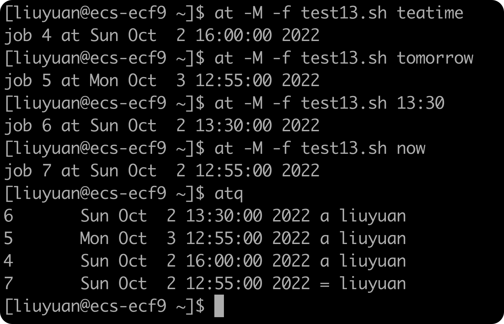
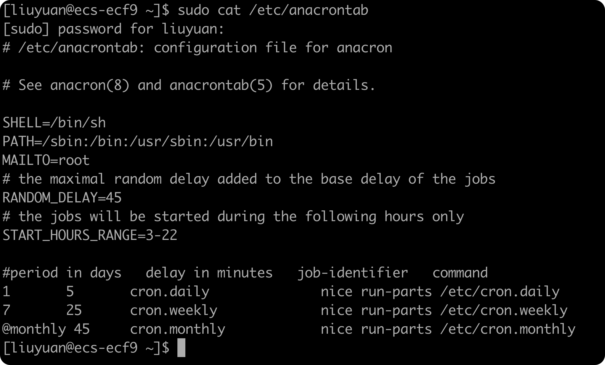

[TOC]

# 处理信号

## 重温Linux信号


默认情况下，bash shell会忽略收到的任何SIGQUIT（3）和SIGTERM（5）信号（正因为这样，交互式shell才不会被意外终止）。但是bash shell会处理收到的SIGHUP（1）和SIGINT（2）信号。

如果bash shell收到了SIGHUP信号，比如我们要离开一个交互式的shell，它就会退出。但在退出之前，shell会将SIGINT信号传给所有由它启动的进程（包括正在运行的shell脚本）

通过SIGINT信号，可以中断shell。Linux内核会停止为shell分配CPU处理时间。这种情况发生时，shell会将SIGINT信号传给所有由它所启动的进程，以此告知出现的状况。

> 可以注意到，shell会将这些信号传给shell脚本程序来处理。而shell脚本的默认行为是忽略这些信号。它们可能会不利于脚本的运行。为了避免这样的情况，我们可以在脚本中加入识别信号的代码，并执行命令来处理信号。

## 生成信号

### 1.	中断进程——`Ctrl+C`

生成SIGINT信号，并发送给当前正在shell中运行的所有进程

### 2.	暂停进程——`Ctrl+Z`

生成一个SIGTSTP信号，停止shell中运行的任何进程。

> 这样的行为有时会比较危险（比如，脚本打开了一个关键的系统文件的文件锁）

#### 查看进程

可以使用`ps`来查看已经停止的作业，在进程状态一列中，已停止作业的状态为T。

或者可以使用`jobs`来查看暂停的进程：


方括号中的数字是shell分配的作业号（job number）。shell将shell中运行的每个进程称为作业，并为每个作业分配唯一的作业号。它会给第一个作业分配作业号1，第二个作业号2，以此类推。

#### 退出shell

如果我们尝试退出，就会显示有被停止的任务：


如果我们仍然想退出，那么再次输入`exit`就好。

#### 终止进程

```shell
kill -9 PID
```

在终止作业的时候，有的时候可能我们不会得到回应。但下次如果我们做了能够产生shell提示符的操作（比如按下回车键），我们就会看到一条消息，显示作业已经被终止了。每当shell产生一个提示符的时候，它就会显示shell中状态发生改变的作业的状态。

#### 继续进程

```shell
kill -18 PID
```


## 捕获信号——`trap`

我们当然可以不忽略信号，在信号出现的时候捕获他们并执行其他命令。`trap`允许我们来指定shell脚本要监听并从shell中拦截的Linux信号。如果脚本收到了`trap`中列出的信号，该信号不再交给shell处理，而是交给本地处理。

```shell
trap commands signals
```

此处有一个例子，展示了如何使用`trap`来忽略SIGINT信号：

```shell
#! /bin/bash
# Testing signal trapping
#
trap "echo 'Sorry! I have trapped Ctrl-C'" SIGINT
#
echo This is a test script
#
count=1
while [ $count -le 10 ]
do
	echo "Loop #$count"
	sleep 1
	count=$[ $count + 1 ]
done
#
echo "This is the end of ths test script"
```


## 捕获脚本退出

```shell
trap commands EXIT
```

脚本退出的时候会发出EXIT信号，于是我们可以像“信号-槽”机制一样，当检测到这个信号的时候就去执行相应的命令。

无论是由我们手动Ctrl-C发出STGINT还是脚本正常结束，脚本结束的时候都会发出EXIT信号，我们就可以执行一些对应的指令

## 修改或移除捕获

如果想要在脚本中的不同位置进行不同的捕获处理，只需要重新使用trap`命令即可

如果想要删除已有的捕获，只需要在`trap`命令与希望恢复默认行为的信号列表之间加上两个破折号就好了：

```shell
trap -- SIGINT
```

> 单破折号也行

# 以后台模式运行脚本——`&`

## 后台运行脚本

```shell
./test.sh &
[1] 3231				# 后台运行中
[1]	Done	./test.sh	# 后台运行结束
```

***最好是将后台运行的脚本的STDOUT和STDERR进行重定向，避免终端的杂乱输出***

## 运行多个后台作业

需要注意的是，如果终端退出，那么所有的后台进程都会随之退出

# 在非控制台下运行脚本——`nohup`

***有时我们会想在终端会话中启动shell脚本，然后让脚本一直以后台模式运行到结束，即使我们退出了终端会话***

`nohup`命令运行了另一个命令来阻断所有发送给该进程的SIGHUP信号。这会在退出终端会话的时候阻止进程退出：

```shell
nohup ./test.sh
```

由于`nohup`命令会接触终端与进程的关联，进程也就不再同STDOUT和STDERR联系在一起。为了保存该命令产生的输出，`nohup`命令会自动将STDOUT和STDERR重定向到一个名为`nohup.out`的文件中

> 如果使用`nohup`运行了另一个命令，该命令的输出就会被追加到已有的`nohup.txt`文件中，如果有多个命令，一定要小心。

# 作业控制

> 启动、停止、终止以及回复作业的这些功能统称为作业控制。通过作业控制，就能完全控制shell环境中所有进程的运行方式了

## 查看作业——`jobs`


`jobs`命令输出的进程有带加号的，也有带减号的。带加号的作业会被当做默认作业。在使用作业控制命令的时候，如果未在命令行指定任何作业号，该作业会被当成作业控制命令的默认操作对象。

当前的默认作业完成处理之后，带减号的作业称为下一个默认作业。任何时候都只有一个带加号的作业和一个带减号的作业，不管shell中有多少个正在运行的作业。

## 重启停止的作业——`bg` & `fg`

在bash作业控制中，可以将已经停止的作业作为后台进程或前台进程重启。前台进程回接管我们当前的终端，所以在使用该功能的时候要小心了。

要以后台模式重启一个作业，需要用`bg`加上作业号：

```shell
bg 1
```

如果我们想要重启的是默认进程，那么直接输入`bg`就可以了。

当然我们也可以用相同的方式使用`fg`让一个进程在前台重启，只是直到作业完成，命令行界面的提示符才会出现。

# 调整谦让度

在多任务操作系统中，内核负责将CPU事件分配给系统上运行的每个进程。调度优先级（scheduling priority）是内核分配给进程的CPU时间（相对于其他进程）。**在Linux系统中，由shell启动的所有进程的调度优先级默认都是相同的。**

调度优先级是一个整数值，从-20（最高优先级）到+19（最低优先级）。默认情况下，bash shell以优先级0来启动所有进程。

> ###### 记忆优先级与值的关系：好人难做。越是“好”的值，获得CPU时间的机会就越低

## `nice`

### 降低优先级

`nice`命令允许我们设置命令启动时的调度优先级。要让命令以更低的优先级运行，只要用`nice -n`来指定新的优先级级别

```shell
nice -n 10 ./test.sh > test4.out &
```

注意，必须将`nice`命令和要启动的命令放在同一行中。`-n`并不是必须的，也可以直接在破折号后面跟优先级：

```shell
nice -10
```


### 提升优先级

`nice`命令阻止普通系统用户来提高命令的优先级。

## `renice`

有时我们想要改变系统上已经运行的命令的优先级。

```shell
renice -n PRI -p PID
```

`renice`命令会自动更新当前运行进程的调度优先级。和`nice`命令一样，`renice`命令也有一些限制：

+ 只能对属于我们自己的进程使用`renice`
+ 只能通过`renice`降低进程的优先级
+ root用户可以通过`renice`来任意调整进程的优先级。但即使是root，也不能够使用`renice`来提升进程的优先级

# 定时运行作业

## `at`

`at`允许指定Linux系统何时运行脚本。`at`会将作业提交到队列中，指定shell何时运行改作业。`at`的守护进程`atd`会以后台模式运行，检查作业队列来运行作业。大多数Linux发行版会在启动的时候启动这个守护进程。

`std`守护进程会检查系统上的一个特殊目录（通常位于`/var/spool/at`）来获取`at`命令提交的作业。默认情况下，`atd`守护进程会每60秒检查一次这个目录。有作业时，`atd`守护进程会检查作业设置运行的时间。如果时间跟当前时间匹配，`atd`守护进程就会运行作业。

### 格式

#### 命令格式

```shell
at [-f filename] time
```

默认情况下，`at`会将STDIN的输入放到队列中。我们可以用`-f`参数来指定用于读取命令（脚本文件）的文件名

`time`参数指定了Linux系统何时运行该作业。如果我们指定的时间已经错过，那么就会在第二天的那个时间运行指定的作业。

#### 时间格式

+ 标准的小时和分钟格式：10:15
+ AM/PM指示符：10:15 PM
+ 特定可命名时间
    + now
    + noon
    + midnight
    + teatime（4 PM）
+ 标准日期格式
    + MMDDYY
    + MM/DD/YY
    + DD.MM.YY
+ 文本日期，加不加年份均可：Jul 4

#### 作业队列

在我们使用`at`命令的时候，这个作业会被提交到作业队列（job queue）。作业队列会保存通过`at`命令提交的待处理作业。针对不同的优先级，存在26种不同的作业队列。作业队列通常用小写字母`a~z`和大写字母`A~Z`来指代。

作业队列的字母排序越高，作业运行的优先级就越低（更高的nice值）。默认情况下，`at`的作业会被提交到a作业队列。如果想要以更高的优先级运行作业，可以使用`-q`参数指定不同的队列字母

### 获取作业输出

当作业在Linux系统上运行的时候，显示器并不会关联该作业。取而代之的是，Linux系统会将提交该作业的用户的电子邮箱地址作为STDOUT和STDERR。任何发到STDOUT和STDERR的输出都会通过邮件系统发送给该用户。

```shell
#! /bin/bash
# Test using at command
#
echo "This script ran at $(date +%B%d,%T)"
echo
sleep 5
echo "This is the script's end..."
```


使用e-mail作为`at`命令的输出极其不便。`at`命令使用sendmail应用程序来发送邮件。如果我们的系统中没有安装sendmail，那就无法获得任何输出。因此在使用`at`的时候，***最好对STDOUT和STDERR进行重定向。***

```shell
#! /bin/bash
# Test using at command
#
exec 1>test13b.out
exec 2>test13b.out

echo "This script ran at $(date +%B%d,%T)"
echo
sleep 5
echo "This is the script's end..."
```


***如果不想在`at`命令中使用邮件或重定向，最好加上`-M`选项来屏蔽作业产生的输出信息***

### 列出等待作业——`atq`



作业列表中显示了作业号、系统运行该作业的日期和时间机器所在的作业队列

### 删除作业——`atrm`

```shell
atrm 作业号
```

只能删除我们提交的作业，不能删除他人的

## 安排需要定期执行的脚本

### `cron`时间表

```shell
min hour dayofmonth month dayofweek command
```

`cron`时间表允许我们用特定值、取值范围或者是通配符来指定条目。

例如，如果想在每天的10:15运行一个命令，可以用`cron`：

```shell
15 10 * * * command
```

在`dayofmonth`、`month`以及`dayofweek`字段中使用了通配符，表明`cron`会在每个月每天的10:15执行该命令。

#### 指定`dayofweek`

要指定在每周一4:15 PM执行的命令：

```shell
15 16 * * 1 command
```

可以用三字符的文本值（mon/tue/wed/thu/fri/sat/sun）或数值（0~6）来指定`dayofweek`

#### 指定`dayofmonth`

`dayofmonth`表项指定月份中的日期值（1~31）

> ###### 如何设置一个月的最后一天执行？
>
> ```shell
> 00 12 * * * if [ 'date +%d -d tomorrow' = 01 ] ; then ; command
> ```

#### 指定`command`

命令列表必须指定要运行的命令或脚本的全路径名。

```shell
15 10 * * * /home/liuyuan/test.sh > testout
```

`cron`程序会用提交作业的用户账户运行这个脚本。因此，我们必须有访问该命令和命令中指定的输出文件的权限。

### 构建`cron`时间表——`crontab`

每个系统用户（包括root用户）都可以用自己的`cron`时间表来运行安排好的任务。Linux提供了`crontab`命令来处理`cron`时间表。

#### 列出已有的时间表——`-l`


#### 为`cron`时间表添加条目——`-e`

默认情况下，用户的cron时间表文件并不存在。在添加条目时，`crontab`会启用一个文本编辑器，使用已有的cron时间表作为文件内容（或者一个空文件，如果时间表不存在的话）

### 浏览`cron`目录

如果我们创建的脚本对于精确执行要求不高，用预配置的`cron`脚本目录会更为方便。有四个基本目录：`hourly`/`daily`/`monthly`和`weekly`


因此，如果脚本需要每天执行一次，只要将脚本复制到`daily`目录，`cron`就会每天执行它

### `anacron`

cron程序的唯一问题就是它假定Linux系统是7×24小时运行的。除非将Linux当成服务器环境来运行，否则此假设未必成立。

如果某个作业在cron时间表中安排运行的时间已到，但这时候Linux系统处于关机状态，那么这个作业就不会被运行。当系统开机的时候，cron程序不会再去运行那些错过的文件。

如果`anacron`知道某个作业错过了执行事件，它会尽快运行该作业。这意味着如果Linux系统关机了几天，当它再次开机时，原定在关机期间运行的作业会自动运行。

***这个功能常用于进行常规日志维护的脚本***

`anacron`程序只会处理位于`cron`目录的程序，比如`/etc/cron.monthly`。他用时间戳决定作业是否在正确的计划间隔内运行。每个`cron`目录都有个时间戳文件，该文件位于`/var/spool/anacron`：


#### 时间表

anacron程序使用自己的时间表来检查作业目录，通常位于`/etc/anacrontab`



#### 格式

anacron时间表的基本格式和cron时间表略有不同：

```shell
period delay identifier command
```

+ period：定义了作业多久运行一次，以天为单位。anacron用此条目来检查作业的时间戳文件
+ delay：指定系统能够启动后anacron程序需要等待多少分钟再开始运行错过的脚本
+ identifier：特别的非空字符串，例如`cron-weekly`。它用于唯一标识日志消息和错误邮件中的作业
+ command：包含了`run-parts`程序和一个`cron`脚本目录名。`run-parts`负责运行目录中传给它的任何脚本

#### 注意

anacron不会运行位于`/etc/cron.hourly`中的脚本，因为anacron不会处理执行时间需求小于一天的脚本

## 使用新shell启动脚本

如果每次运行脚本的时候都能够启动一个新的bash shell（即便只是某个用户启动了一个bash shell），将会非常方便。有时候，我们希望为shell会话设置某些shell功能，或者只是为了确保已经设置了某个文件。

基本上，依照下列顺序所找到的第一个文件会被运行，其余的文件会被忽略：

+ `$HOME/.bash_profile`
+ `$HOME/.bash_login`
+ `$HOME/.profile`

因此，应该将需要再登录时运行的脚本放在上面第一个文件中。***每次启动一个新shell的时候，bash shell都会运行.bashrc文件。***

.bashrc文件通常也是通过某个bash启动文件来运行的。因为.bashrc文件会运行两次：

+ 一次是我们登录bash shell的时候
+ 一次是我们启动一个bash shell的时候

如果我们需要一个脚本在两个时刻都得以运行，可以把这个脚本放进该文件中