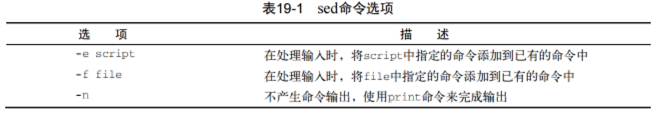
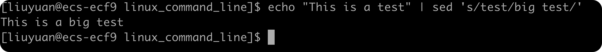
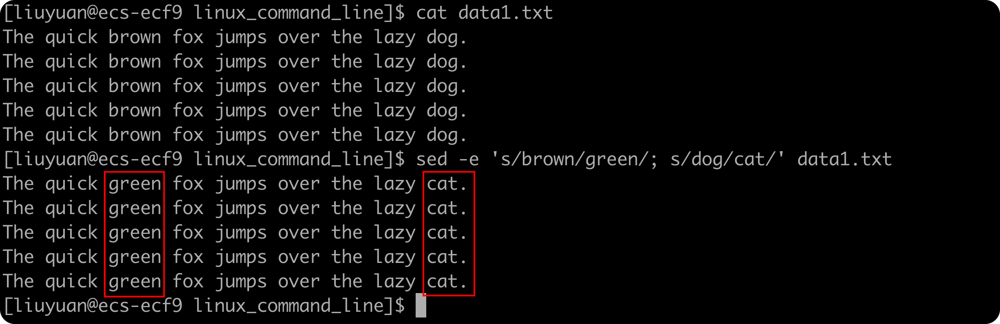
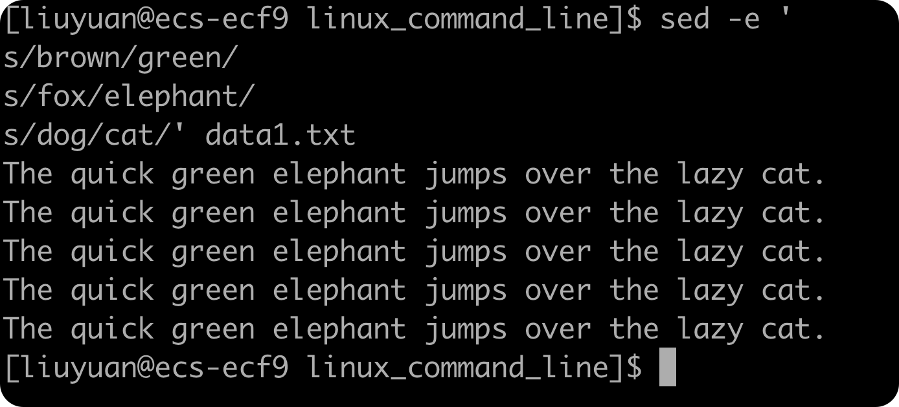
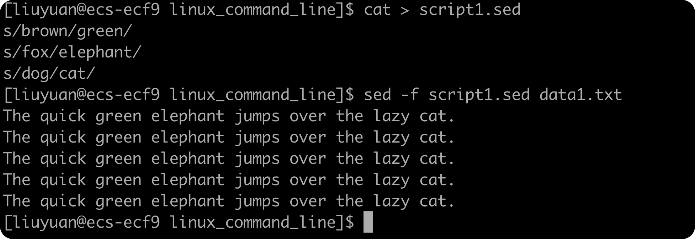
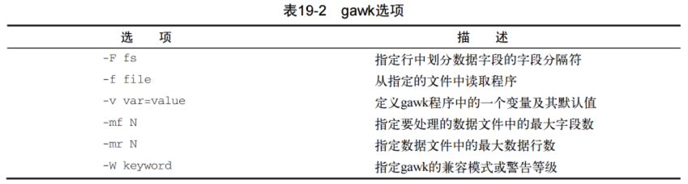
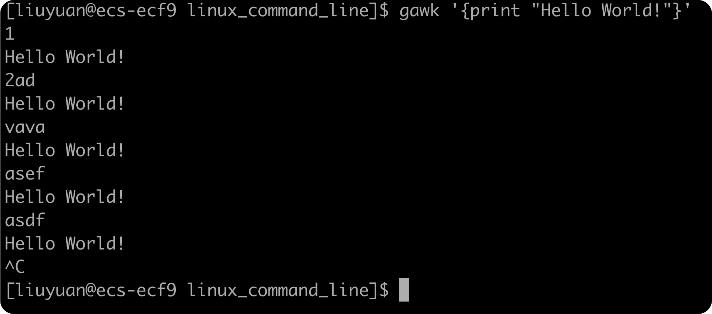

[TOC]

# 文本处理

## sed编辑器

sed编辑器被称作流编辑器（stream editor），和普通的交互式文本编辑器恰好相反。在交互式文编辑器（vim）中，我们使用键盘命令来交互式地插入、删除或替换数据中的文本。流编辑器则会在处理器处理数据之前基于预先提供的一组规则来编辑数据流。

sed编辑器可以根据命令来处理数据流中的数据，这些命令要么从命令行中输入，要么存储在一个命令文本文件中。

sed编辑器会执行以下操作：

1. 一次从输入中读入一行数据
2. 根据所提供的编辑器命令匹配数据
3. 按照命令修改流中的数据
4. 将新的数据输出到STDOUT

在流编辑器将所有命令与一行数据匹配完毕后，它会读取下一行数据并重复这个过程。在流编辑器处理完流中的所有数据行后，它就会终止。

由于命令是按顺序逐行给出的，sed编辑器只需要对数据流进行一遍处理就可以完成编辑操作。这使得sed编辑器要比交互式编辑器快得多，我们可以快速完成对数据的自动修改。

### 格式

```shell
sed options script file
```

+ options支持我们修改sed命令的行为：

    

+ script参数指定了应用于流数据上的单个命令。如果需要用多个命令，要么使用`-e`选项在命令行中指定，要么使用`-f`选项在单独的文件中指定。有大量的命令可以用来处理数据。

### 实际操作

#### 1.	在命令行定义编辑器命令

默认情况下，sed编辑器会将指定的命令应用到STDIN输入流上。这样我们可以直接将数据通过管道输入sed编辑器处理。

```shell
echo "This is a test" | sed 's/test/big test/'
```

输出结果：



这个例子在sed编辑器中使用了s命令。s命令会用斜线间指定的第二个文本字符串来提花第一个文本字符串模式。在本例中是使用`big test`替换了`test`

在运行这个例子时，结果就会立即显示出来。这就是sed编辑器的强大之处。我们可以同时对数据进行多处修改，而消耗的时间只够一些交互式编辑器启动。

#### 2.	在命令行使用多个编辑器命令

要在sed命令行上执行多个命令时，只要用`-e`选项就可以了：



两个命令都作用到文件中的每行数据上。命令之间必须用分号隔开，并且在命令末尾和分号之间不能有空格。

如果不想用分号，也可以用bash shell中的次提示符来分隔命令。只要输入第一个单引号标识出sed程序脚本的起始，bash会继续提示你输入更多命令，直到输入了标示结束的单引号：



必须记住，要在封尾单引号所在行结束命令。bash shell一单发现了封尾的打印好，就会执行命令。

#### 3.	从文件中读取编辑器命令

如果有大量要处理的sed命令，那么将它们放进一个单独的文件中通常会方便一些。可以在sed命令中用`-f`选项来指定文件。



在这种情况下，不用在每条命令后面放一个分号。sed编辑器直到每行都是一条单独的命令。跟在命令行输入命令一样，sed编辑器会从指定文件中读取命令，并将它们应用到数据文件中的每一行上。

> ###### 我们很容易就会把sed编辑器脚本文件和bash shell脚本文件搞混。为了避免这种情况，可以使用.sed作为sed脚本文件的扩展名

## gawk程序

虽然sed编辑器是非常方便自动修改文本文件的工具，但其也有自身的限制。通常我们需要一个用来处理文件中的数据的更高级工具，它能提供一个类编程环境来修改和重新组织文件中的数据。

gawk程序是UNIX中awk程序的GNU版本。gawk程序让流编辑迈上了一个新的台阶，它提供了一种编程语言而不只是编辑器命令。在gawk变成语言中，我们可以做下面的事：

+ 定义变量来保存数据
+ 使用算数和字符串操作符来处理素具
+ 使用结构化编程概念（比如if-else语句和循环）来为数据处理增加处理逻辑
+ 通过提取数据文件中的数据元素，将其重新排列或格式化，生成格式化报告

gawk最完美的例子是格式化日志文件。在日志文件中找出错误会很难。gawk程序可以让我们从日志文件中过滤出需要的数据元素，然后我们可以使其格式化，使得重要的数据更衣阅读。

### 1.	gawk的基本格式

```shell
gawk options program file
```



### 2.	从命令行读取程序脚本

gawk程序脚本用一对花括号来定义。我们必须将脚本命令放到两个花括号中。

由于gawk命令行嘉定脚本是单个文本字符串，我们还必须将脚本放到单引号中：

```shell
gawk '{print "Hello World!"}'
```

这个程序脚本定义了一个`print`命令。

如果我们输入一行文本并按下回车键，gawk会对这行文本运行一遍程序脚本。跟sed编辑器一样，gawk程序会针对数据流中的每行文本执行程序脚本。由于程序脚本被设为显示一行固定的文本字符串，因此不管我们在数据流中输入什么文本，都会得到同样的文本输出：



要终止这个程序，除了使用SIGINT，我们还可以使用Ctrl-D生成一个EOF字符。

### 3.	使用数据字段变量

