[TOC]

# shell的类型

系统启动什么样的shell程序取决于你个人的用户ID配置。在`/etc/passwd`文件中，用用户ID记录的第七个字段列出了默认的shell程序。只要用户登录到某个虚拟控制台或是在GUI中启动终端仿真器，默认的shell程序就会开始运行。


`/bin/bash位于`/bin`目录内。从长列表中可以看出`/bin/bash`是一个可执行程序：


CentOS发行版中还有其他一些shell程序。其中包括tcsh，它源自最初的C shell：`/bin/ctsh`

另外还有ash shell的Debian版：`/bin/dash`

最后，C shell的软连接指向的是`tcsh shell`：`/bin/sch -> tcsh`

这些shell程序各自都可以被设置成用户的默认shell。不过由于bash shell的广为流行，很少有人使用其他的shell作为默认shell。

默认的交互shell会在用户登录某个虚拟控制台终端在GUI中运行终端仿真器时启动。不过还有另外一个默认shell是`/bin/sh`，它作为默认的系统shell，用于哪些需要在启动时使用的系统shell脚本。

我们经常会看到某些发行版使用软连接将默认的系统shell设置成bash shell：


> 对bash shell叫本来说，可以使用发行版中所有可用的shell（默认的交互shell和默认的系统shell）会造成问题。一定要注意在脚本首行的语法要求，以避免这些麻烦

并不是必须一直使用默认的交互shell，只需要输入对应的文件名就可以了：


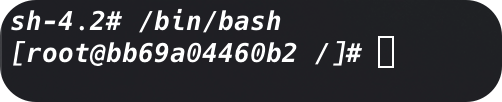

除启动了dash shell程序之外，看起来似乎什么都没有发生。我们可以输入exit来退出bash。

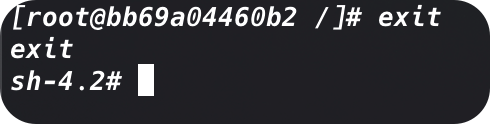

这一次好像还是什么都没有发生，但是bash shell程序已经推出了。为了理解这个过程，我们需要了解shell的父子关系

# shell的父子关系

用于登录某个虚拟控制器终端或在GUI中运行终端仿真器时所启动的默认的交互shell，是一个**父shell**。

在CLI提示符后输入bash命令时，会创建一个新的shell程序。这个shell程序被称为**子shell（child shell）**。子shell也有CLI提示符，同样会等待命令输入。

当输入bash、生成子shell的时候，我们是看不到任何的信息的，因此需要另一条命令帮助我们理清这一切。

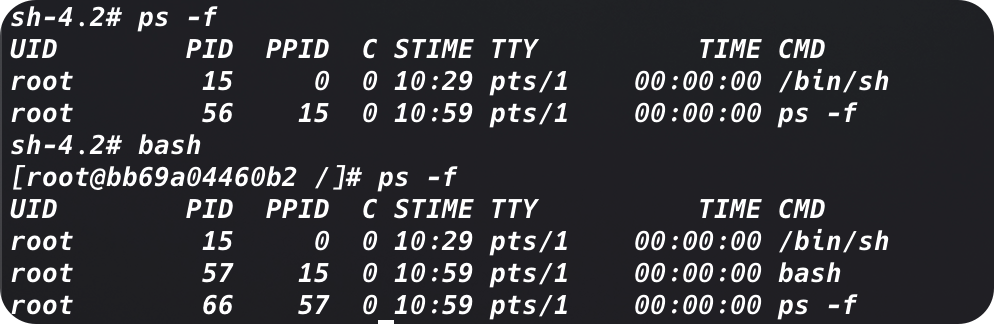

> 进程就是正在运行的程序。bash shell是一个程序，当它运行的时候，就成为了一个进程。一个运行着的shell就是某种进程而已。因此，在说道运行一个bash shell的时候，经常会看到“shell”和“进程”这两个词交换使用

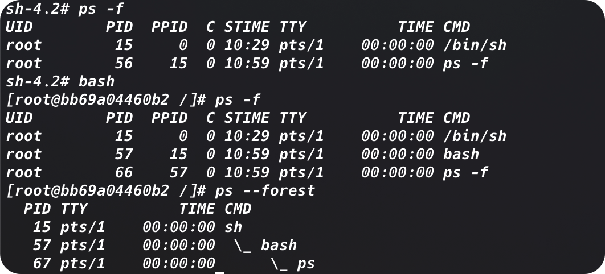

bash shell程序可以使用命令行参数修改shell启动方式。

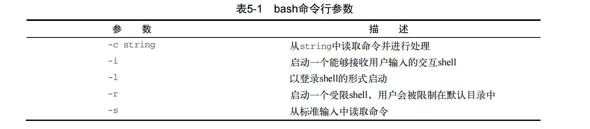

运行脚本shell脚本也能够创建出子shell。

就算是不使用bash shell命令或者是运行shell脚本，我们也可以生成子shell。一种方法就是使用进程列表

## 进程列表

我们可以在一行中指定要一次运行的一系列命令。这可以通过命令列表来实现，只需要在命令之间加入分号即可：

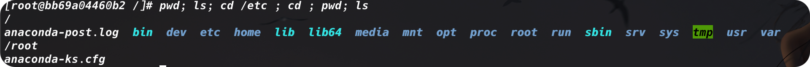

在上面的例子中，所有的命令依次执行，不存在任何问题。不过这并不是进程列表。命令列表要想成为进程列表，这些命令必须包含在括号里。

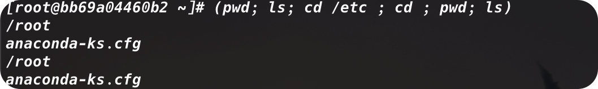

尽管多出来的括号看起来没有什么太大的不同，但起到的效果确实非同寻常。括号的加入使命令列表变成了进程列表，生成了一个子shell来执行对应的命令。

> 进程列表是一种命令分组（command grouping）。另一种命令分组是将命令放入花括号中，并在命令列表尾部加上分号。语法为`{command; }`。使用花括号进行命令分组并不会像进程列表那样创建出子shell

想要知道是否生成了子shell，需要借助一个环境变量：`echo $BASH_SUBSHELL`。如果返回0，表明没有子shell，如果返回了其他更大的数字，那么就存在子shell

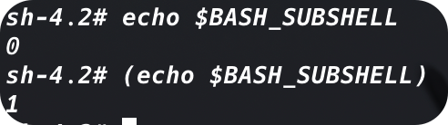

## 别出心裁的子shell用法

### 1. 探索后台模式

在后台模式中运行命令可以在处理命令的同时让出CLI，以供他用。演示后台模式的一个经典命令就是`sleep`。

`sleep`命令接受一个参数，该参数是你希望进程等待（睡眠）的秒数。这个命令在脚本中常用于引入一段时间的暂停。

```shell
sleep 3000
```

要想将命令置入后台模式，可以在命令末尾加上字符`&`。

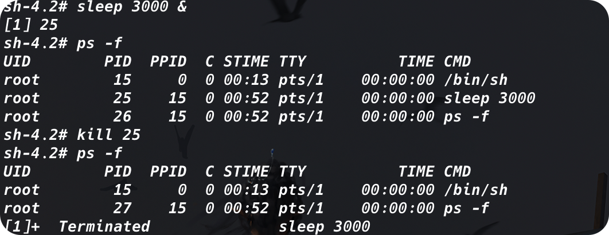

后台模式非常方便，它可以让我们在CLI中创造出有使用价值的子shell

### 2. 将进程列表置入后台

使用`tar`创建备份文件是有效利用后台进程列表的一个实用的例子：

```shell
(tar -cf Rich.tar /home/rich ; tar -cf My.tar /home/christine)&
```

### 3. 协程

将进程列表置入后台模式并不是子shell CLI中仅有的创造性用法。协程就是另一种方法。协程可以同时做两件事：在后台生成一个子shell，并在子shell中执行命令。

想要进行写成处理，需要使用`coproc`命令，以及需要子shell中执行的命令。

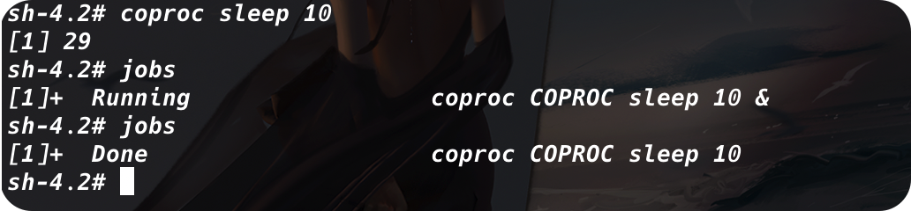

在上面的例子中可以看到在子shell中执行的命令后台是`coproc COPROC sleep 10`。`COPROC`命令是corproc命令给进程起的名字。我们可以使用命令的扩展语法自己设置这个名字：

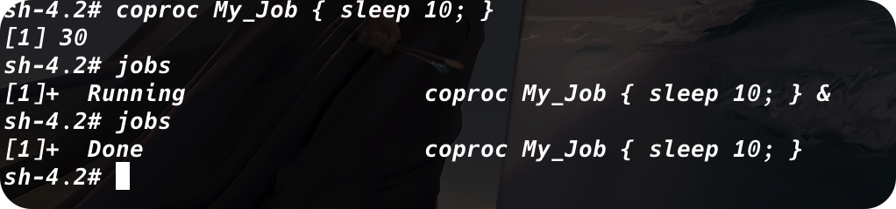

通过使用扩展语法，协程的名字被设置成`My_Job`。这里要注意的是，扩展语法写起来有点麻烦。必须确保在第一个花括号和命令之间有一个空格。还必须保证命令以分号结尾。另外，分号和闭花括号之间也要有一个空格。

> 协程能让我们尽情发挥想象力，发送或接收来自子shell中进程的信息。只有在拥有多个协程的时候才需要对协程进行命名，因为我们需要和协程进行通信。否则的话，让coproc自行命令就可以了。

我们也可以将协程与进程结合起来产生嵌套的子shell。只需要输入进程列表，然后把coproc放在前面就可以了：

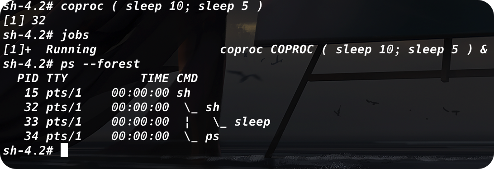

记住，生成子shell的成本不低，而且速度还慢。创建嵌套子shell更是如此。

在命令行中使用子shell能够获得灵活性和便利。要想获得这些优势，重要的是理解子shell的行为方式。

# 理解shell的内建命令

## 外部命令

外部命令，有的时候也被称为文件系统命令，是存在于bash shell之外的程序。它们并不是shell程序的一部分。外部命令程序通常位于`/bin`，`/usr/bin`，`/sbin`或`/usr/bin`中。

ps就是一个外部命令。我们可以使用`which`和`type`来找到它：

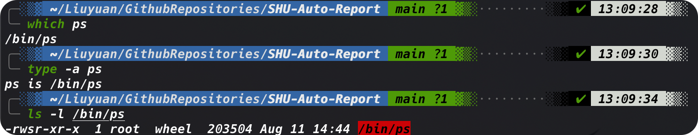

当外部命令执行时，会创建出一个子进程。这种操作被称为衍生（forking）。外部命令ps很方便显示它的父进程以及自己所对应的衍生子进程。

作为外部命令，命令执行的时候会创建出一个子进程。当进程必须执行衍生操作时，它需要花费时间和精力来设置新进程的环境。所以说，外部命令是有代价的。

> 就算衍生出子进程或者创建了子进程，我们仍然可以通过发送信号与其进行沟通。无论在命令行还是在脚本编写中都是极其有用的。发送信号（signaling）使得进程间可以通过信号进行通信。

## 内建命令

内建命令和外键命令的区别在于前者不需要使用子进程来执行。它们已经和shell编译成了一体，作为shell工具的组成部分存在。不需要借助外部程序文件来运行。

### 使用`type`来判断命令是否内建

我们可以利用type命令来了解某个命令是否内建的。

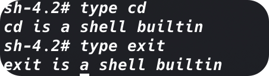

因为既不需要通过衍生出子进程来执行，也不需要打开程序文件，内建命令的执行速度要更快，效率也更高。要注意，有些命令有多种实现。例如pwd和echo既有内建命令也有外键命令。两种实现略有不同。要查看命令的不同实现，使用type命令的`-a`选项

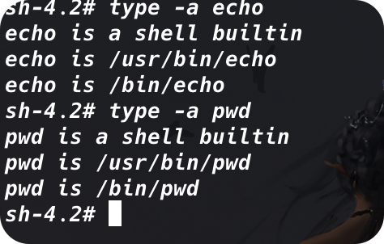

命令`type -a`显示出了每个命令的两种实现。注意，`which`命令只显示出了外部命令文件。

> 对于有多种实现的命令，如果想要使用其外部命令实现，直接指明对应的文件就可以了。

### 1. history

一个有用的内建命令是`history`命令。`bash shell`会跟踪你用过的命令。你可以唤回这些命令并重新使用。

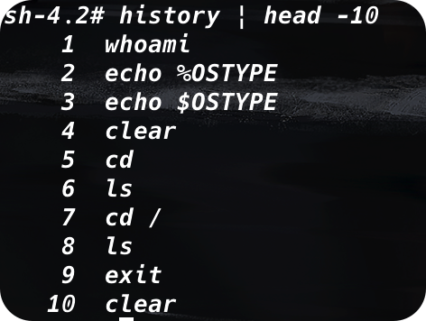

通常历史记录中会保存最近的1000条命令。如果想要改变能够保存的数量，可以修改环境变量`HISTSIZE`


可以通过直接输入`!!`来快速调用上一条命令，也可以输入`!5`来调用编号为5的记录


命令历史记录被保存在隐藏文件`.bash_history`中，它位于用户的主目录中。这里要注意的是，bash命令的历史记录是先存放在内存中，当shell退出的时候才被写入到历史文件中。

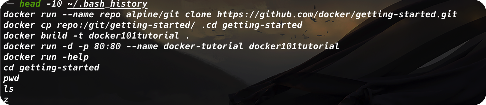

history会打印当前shell中使用过的指令，还有存放在`.bash_history`文件中的指令。如果我们想在退出shell之前将命令历史记录写入`.bash_history`文件，需要使用`-a`选项

> 如果我们打开了多个终端对话，我们仍然可以使用`history -a`命令在打开的会话中向`.bash_history`文件中添加记录。但是对于其他打开的终端会话，历史记录并不会自动更新。这是因为`.bash_history`文件只有在首个终端会话被打开时才会被读取。要想强制重新读取这个文件，更新终端会话的历史记录，可以使用`history -n`

### 2. alias

alias允许你为常用的命令（以及参数）创建另一个名称，从而将输入量减小到最低

#### 查看所有的命令别名

我们所使用的Linux发行版很可能已经为我们设置好了一些常用命令的北冥。要查看当前可用的别名，使用`alias -p`

#### 设置别名

```shell
alias <alias>='command [options] [arguments]'
```

在定义好别名之后，我们就可以随时在shell中使用它，就算在shell脚本中也没有问题。但是要注意的是，因为命令别名属于内部命令，一个别名仅在它被定义的shell进程中才有效
